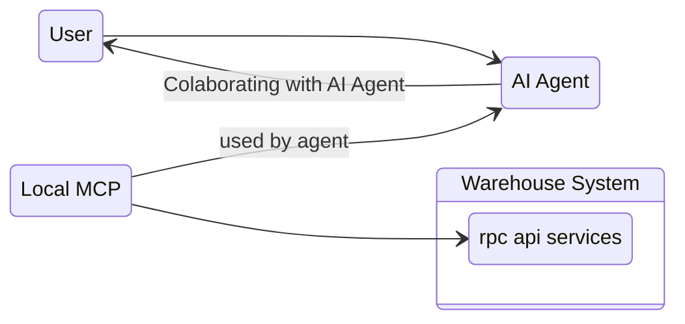

# MCP Contexts.

## General
1. we have local mcp app that shipped to user.
2. mcp used for if user need connect their account and colaborating with their ai agent to access / analize data in our system.

## General Flow Of MCP
