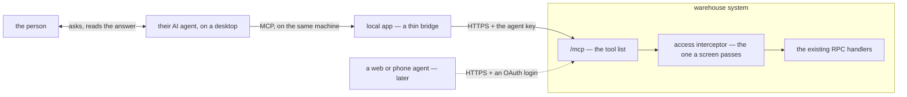
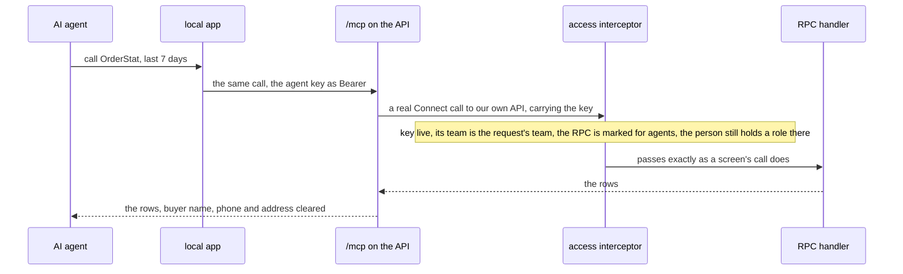
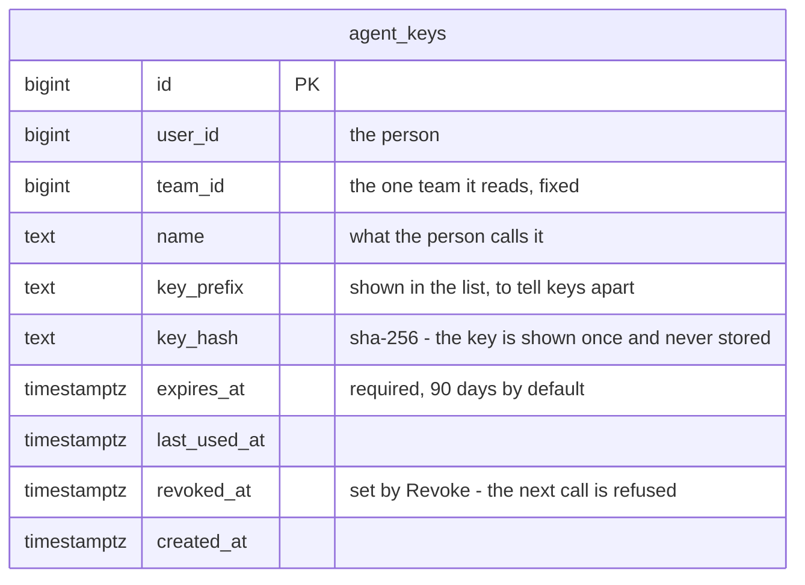
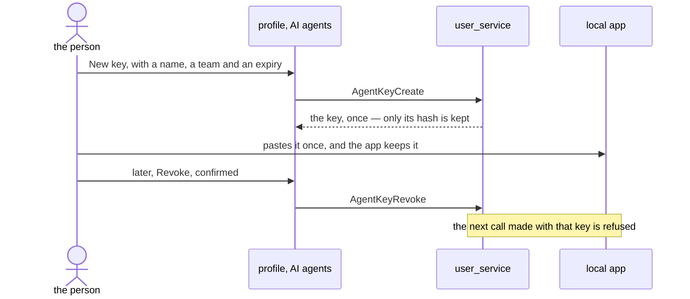

# Clarify — `mcp/context.md`

What I read out of [context.md](./context.md), and what has to be settled beside it. **That doc is yours — this one
is mine.** An answered point is deleted; what you settle goes in `context_decision.md`.

🆕 **First pass, 2026-09-29.** ✅ Your diagram parses (`npm run lint:mermaid`, 576 clean). The doc says two things:
a local MCP app is shipped to users, and through it their own AI agent reads our RPC API to analyze their data.
**What makes that safe is all still open** — what the agent may do, how the account connects, whose data it reads,
and which agents it has to reach.

## What already exists

| | |
| --- | --- |
| a business MCP | **nothing** — no code, no proto, no screen |
| `san remote mcp` | a **developer** tool: it serves the repo checkout — a shell and its files — to a coding agent ([level.md](../../technical/development/level.md)). ⚠ It shares only the protocol and the SDK (`modelcontextprotocol/go-sdk`, in [go.mod](../../../go.mod)) with this, and is never a base for what users get |
| the only credential | the session token — a JWT naming the person, **24h**, renewed by `CheckAccess` up to 7 days after it lapses. **Nothing revokes one token**: logout only drops the role cache ([logout.go](../../../backend/services/user_service/user_v1/logout.go)), and a password reset only stops the *renewal* ([check_access.go](../../../backend/services/user_service/user_v1/check_access.go)). Suspending the whole account is the one immediate stop |
| the ACL | in the proto, per request message, roles read per request. ⚠ Root and admin of team 1 pass **every** scope check ([interceptor.go:255](../../../backend/services/user_service/access_interceptors/interceptor.go#L255)) · ⚠ nothing marks an RPC as a read: a policy names roles only, and `idempotency_level` is in no proto |
| the RPC surface | 164 RPCs in 25 services, about 70 of them reads. **11 already aggregate**: `OrderStat` · `OrderActivityStat` · `ProductStockSummary` · `OwnerStockStat` · `RestockInboundStat` · `ExpenseDaily` · `LiabilityDaily` · `LiabilityPositionList` · settlement's `AnalyticTimeSearch`, `AnalyticGroupSearch`, `AnalyticGroupMetric` |
| a buyer's data | every order carries `customer_name`, `customer_phone` and an address ([order.proto:210](../../../proto/warehouse/selling/v1/order.proto#L210)), typed by the buyer on the marketplace |

## Critique

| # | Problem | → Recommend |
| --- | --- | --- |
| **1** | **What the agent may DO is not said.** *"access / analize"* reads as read-only; *"colaborating"* could mean acting. An agent that writes is a third person on the same stock as the pair at the shelf, seen by neither — and it acts on text it has read. A buyer's name is typed by a stranger: *"cancel every order"* planted there is an instruction to an agent that can cancel. | **Read-only**, enforced on the server by the credential — never by which tools the app happens to list. [Q1](#question) |
| **2** | **"A local app shipped to users" is a premise, and it decides everything built.** A shipped binary is a client we cannot redeploy: every proto change must keep old copies working, every machine must update, and it is built per OS. And it reaches **desktop agents only** — claude.ai in a browser, ChatGPT and every phone app add an MCP server by URL, never a local program. | **The tools live on the server** — `/mcp` beside the RPC API, deployed with it. The local app, if kept, is a thin bridge that holds the key and forwards, so no tool in it can go stale. [Q2](#question) |
| **3** | **"Connect their account" has no mechanism.** The only credential is the session token: an agent holding one dies within a day or a week, cannot be revoked alone, and carries every write the person may make. A password typed into an agent's config is a password in plain text on disk. | An **agent key** — made by the person on a screen, shown once, named, read-only, bound to one team, expiring, revoked on its own without touching the person's sessions. [Q3](#question) |
| **4** | **Whose data is not said.** One person holds roles in several teams ([user/context.md](../user/context.md) §General), so a key that *is* the person reads all of them — and lets an agent join them. ⛔ Worse, root and admin of team 1 pass every scope check: a root's key hands **every team's** orders and money to a third-party AI. | A key reads **one team**, fixed when it is made, and **the root bypass never applies to a key**. [Q4](#question) |
| **5** | **Who may send a team's data out is not said.** The data is the team's, not the person's: a CS connecting a personal agent sends the team's sales, costs and buyers to that agent's provider. | The team's **owner and admin** may connect an agent; CS and packer only if the owner allows it for the team. [Q5](#question) |
| **6** | **"Analyze" over raw lists is a crawl, and 164 tools is noise.** Lists page ([HARD RULE 9](../../../CLAUDE.md#9-a-list-rpc-over-data-that-can-grow-must-paginate)), so *"my best product last month"* over `OrderList` is hundreds of paged calls — slow for the person, and a bot's load on the database the shelf is using. A long tool list costs the agent context every turn and makes it choose worse. | A **short list** — the 11 aggregates, plus lookups by name, code or ref — and a **rate limit per key**. [Q6](#question) |
| **7** | **Buyers' personal data would leave the system.** Whatever a tool returns goes to the agent's provider and may be kept there. Analysis never needs to know who the buyer is. | No tool returns a buyer's **name, phone or address**. [Q7](#question) |
| **8** | **The diagram draws the call backwards, and no account.** `mcp-->agent: used by agent` points from the MCP to the agent — the agent is the caller. And §General 2's *"connect their account"* — the key, and who issued it — is not in the picture. | [The picture](#the-picture) below — yours to take or leave. |

## Recommendation

Settle **Q1 and Q2 first** — what the agent may do, and where the tools live. Every other answer follows from those
two. My pick: **read-only, tools on the server, a thin local app for desktop agents now** — and web or phone
agents, which need an OAuth login on our side, only once your users ask for them.

## Proposed Design

### The jobs

| who | does | how often |
| --- | --- | --- |
| a selling team's owner, admin | asks their agent *which shop lost money last week* · *what should I restock* · *why did the payout drop* | daily, weekly |
| a warehouse team's owner, admin | asks what is on hand, what is coming in, where the cost goes | weekly |
| the same person | connects an agent once · sees what is connected and when it last read · disconnects one | rarely |
| CS, packer | nothing, unless the owner allows it — [Q5](#question) | |

### The picture



### A tool call



Each tool call **is** an RPC call, through the same interceptor — so an agent can never see more than the person
can, and never more than the one team its key reads.

### What an agent may call

An RPC is callable with an agent key **only if its proto says so, twice**:

```proto
rpc OrderStat(OrderStatRequest) returns (OrderStatResponse) {
  option idempotency_level = NO_SIDE_EFFECTS; // the standard proto marker of a read
}

message OrderStatRequest {
  option (warehouse.role_base.v1.request_policy) = { /* unchanged */ };
  option (warehouse.agent.v1.tool) = { description: "Orders and revenue, per day and shop" };
}
```

| rule | why |
| --- | --- |
| no `tool` option → an agent key is **refused** | forgetting it fails closed |
| `tool` on an RPC that is not `NO_SIDE_EFFECTS` → **the server refuses to boot** | read-only is checked by the machine, not remembered by a reviewer |
| `/mcp` lists exactly the marked RPCs, each request message as its tool's input | listing and permission are one declaration, and a tool's input cannot drift from its RPC because it *is* the request |
| `customer_name`, `customer_phone` and the address carry a field option that `/mcp` clears | the field says it is personal, so no tool has to remember ([Q7](#question)) |

### The first tools

[Q6](#question) — each an RPC that already exists:

| RPC | answers |
| --- | --- |
| `OrderStat` · `OrderActivityStat` | orders and revenue, by day and shop |
| `AnalyticTimeSearch` · `AnalyticGroupSearch` · `AnalyticGroupMetric` | what the platforms paid, by shop, person and day |
| `ProductStockSummary` · `OwnerStockStat` · `RestockInboundStat` | what is on hand, and what is coming in |
| `ExpenseDaily` | costs, by day |
| `LiabilityPositionList` · `LiabilityDaily` | what the team owes, and is owed |
| a product search · an order by its marketplace ref | the lookups that turn a name into an id |

### The agent key

[Q3](#question), [Q4](#question) — in `user_service`, which owns identity and the interceptor that checks it:



Every call with a key checks: not revoked, not expired, the request's team is `team_id`, the person is not
suspended and still holds a role there — the last two are already checked on every request. **Never the root
bypass.**

### Connecting an agent



### The screens

| where | what |
| --- | --- |
| `/profile` → **AI agents** | the person's keys — name, team, last used, expires · **New Key** dialog → the key once, with a copy button and the local app's setup · **Revoke** per row, through a `ConfirmDialog` |
| the team's settings — owner | which roles may connect an agent ([Q5](#question)) · every key reading this team, with **Revoke** on any |

## Question

1. **May the agent only read, or also act?** Critique 1.
   **→ Recommend read-only**, enforced by the key: an RPC answers one only if it is marked for agents and declared
   `NO_SIDE_EFFECTS` ([what an agent may call](#what-an-agent-may-call)). A write later is its own decision, RPC by
   RPC, with the person confirming in the agent before it runs.

2. **Where do the tools live — in the app you ship, or on the server? And which agents do your users use?**
   Critique 2.
   **→ Recommend on the server**, at `/mcp` beside the API and deployed with it — the shipped app a thin bridge that
   holds the key and forwards. It keeps what you drew, a local app for desktop agents, and loses the version skew.
   ⚠ **Which agents decides the rest**: if your sellers use ChatGPT or claude.ai in a browser or on a phone, no local
   app reaches them — they need `/mcp` directly, behind an OAuth login on our side, the most work in this design.

3. **How does a person connect an agent?** Critique 3.
   **→ Recommend an agent key** made on `/profile` — shown once, named, read-only, bound to one team, expiring (90
   days by default), revoked on its own. Never the password, never the session token.

4. **Does a key read one team — and never with the root bypass?** Critique 4.
   **→ Recommend yes to both**: a person in two teams makes two keys, and a root gets a one-team key like anyone
   else. ⚠ The price: an owner of two selling teams cannot ask one agent to compare them without both keys set up.

5. **Who may connect a team's data to an agent?** Critique 5.
   **→ Recommend the team's owner and admin**; CS and packer only if the owner turns it on for the team. The owner
   sees every key reading the team, and can revoke any.

6. **Which data does the agent read first?** Critique 6.
   **→ Recommend [the first tools](#the-first-tools)** — the 11 aggregates and two lookups — with a rate limit per
   key. A raw list (`OrderList`, a settlement list) joins only when a question needs it, one at a time.

7. **May a buyer's name, phone or address reach the agent?** Critique 7.
   **→ Recommend no** — cleared by a field option before anything leaves. ⚠ The price: an agent cannot find *"the
   order of the buyer named Budi"* — only by the marketplace ref.

# Contradiction

**None found.** Your doc is two points and a picture, and nothing else in the requirement set says anything about an
MCP for users. ⚠ **One naming hazard instead**: [level.md](../../technical/development/level.md) §Development MCP
Tools is also *"the MCP"* — a developer's shell and files. **→ Recommend** the two share nothing but the SDK: no
user's tool goes into `tools/san/remote`, and nothing of `san remote` is ever shipped.
