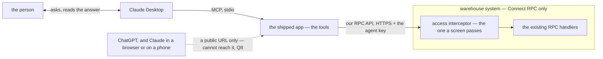
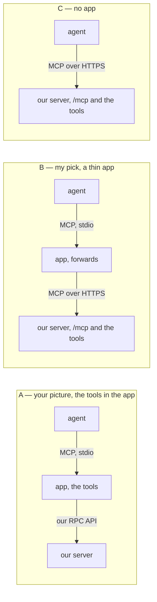
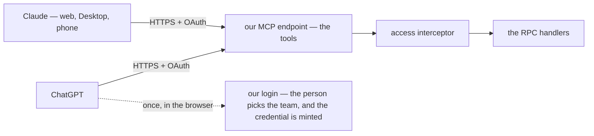
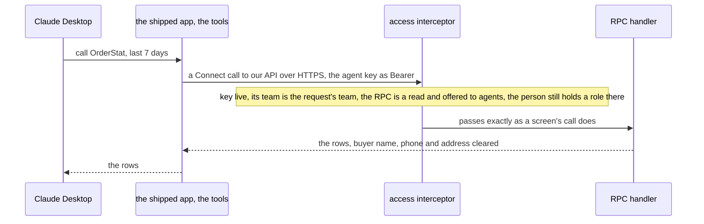
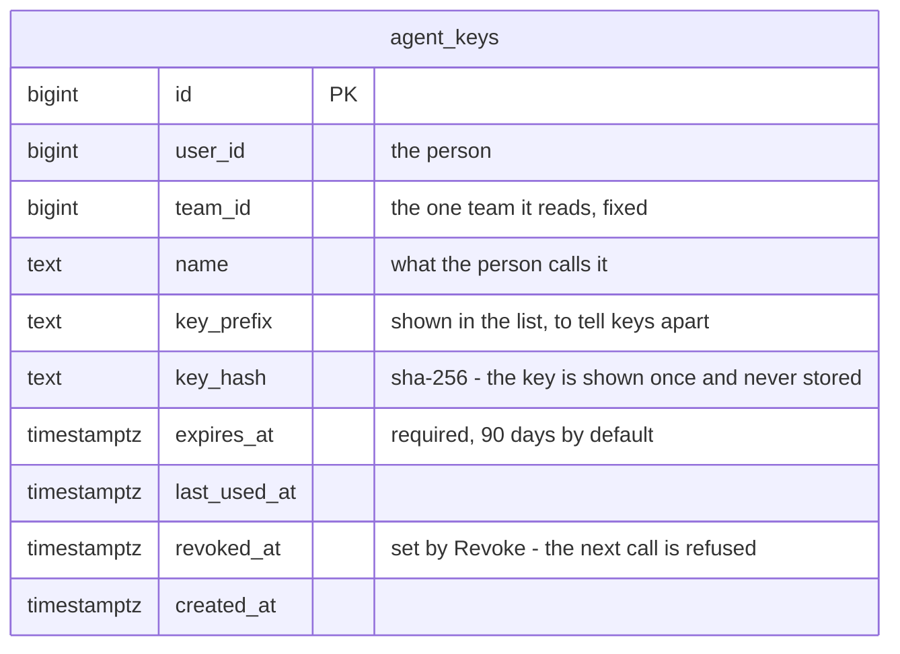
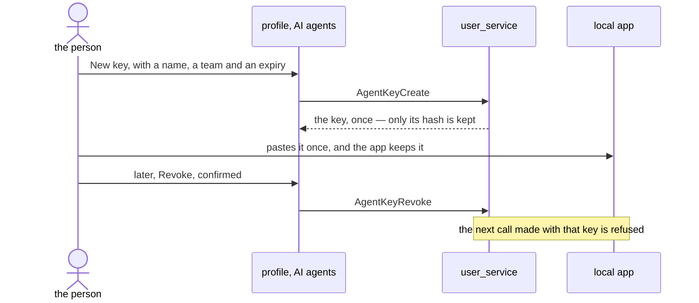
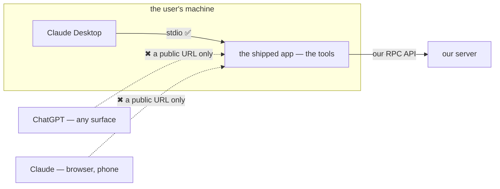

# Clarify — `mcp/context.md`

What I read out of [context.md](./context.md), and what has to be settled beside it. **That doc is yours — this one
is mine.** An answered point is deleted; what you settle goes in `context_decision.md`.

🆕 **First pass, 2026-09-29.** ✅ Your diagram parses (`npm run lint:mermaid`, 576 clean). The doc says two things:
a local MCP app is shipped to users, and through it their own AI agent reads our RPC API to analyze their data.
What the agent may do, where the tools live and which agents it serves are decided — ⛔ **and the last two conflict**:
ChatGPT cannot reach a local app ([Q8](#question)). How the account connects and whose data it reads are still open.

| | |
| --- | --- |
| ✅ answered (2026-09-29) | [Q1](#question) — the agent only reads, for now, and the server refuses any write: [an-agent-only-reads-for-now](./context_decision.md#an-agent-only-reads-for-now). ⚠ It rules out the session token as the agent's credential — that token carries every write ([Q3](#question)) |
| ✅ your edit (2026-09-29) | §General 3 — the official Go SDK: recorded as [the-mcp-uses-the-official-go-sdk](./context_decision.md#the-mcp-uses-the-official-go-sdk). It builds every option in Q2, so Q2 stays open |
| 🔄 reworded (2026-09-29) | [Q2](#question) — you asked whether it is about protocol: it is. Now 2a, which protocol crosses to us, and 2b, which agents — with [the options drawn](#which-protocol-crosses-to-us) |
| ✅ answered (2026-09-29) | [Q2](#question) — 2a **A**, against my recommendation: [the-tools-live-in-the-shipped-app](./context_decision.md#the-tools-live-in-the-shipped-app) · 2b **ChatGPT and Claude**, for now: [chatgpt-and-claude-are-the-agents-for-now](./context_decision.md#chatgpt-and-claude-are-the-agents-for-now) |
| ⛔ 🆕 +1 (2026-09-29) | [Q8](#question) — the two answers conflict: ChatGPT connects only to a public URL, so it cannot reach the shipped app ([Contradiction](#the-shipped-app-cannot-reach-chatgpt)) |

## What already exists

| | |
| --- | --- |
| a business MCP | **nothing** — no code, no proto, no screen |
| `san remote mcp` | a **developer** tool: it serves the repo checkout — a shell and its files — to a coding agent ([level.md](../../technical/development/level.md)). ⚠ It shares only the protocol and the SDK (`modelcontextprotocol/go-sdk`, in [go.mod](../../../go.mod) — now [the-mcp-uses-the-official-go-sdk](./context_decision.md#the-mcp-uses-the-official-go-sdk)) with this, and is never a base for what users get |
| the only credential | the session token — a JWT naming the person, **24h**, renewed by `CheckAccess` up to 7 days after it lapses. **Nothing revokes one token**: logout only drops the role cache ([logout.go](../../../backend/services/user_service/user_v1/logout.go)), and a password reset only stops the *renewal* ([check_access.go](../../../backend/services/user_service/user_v1/check_access.go)). Suspending the whole account is the one immediate stop |
| the ACL | in the proto, per request message, roles read per request. ⚠ Root and admin of team 1 pass **every** scope check ([interceptor.go:255](../../../backend/services/user_service/access_interceptors/interceptor.go#L255)) · ⚠ nothing marks an RPC as a read: a policy names roles only, and `idempotency_level` is in no proto |
| the RPC surface | 164 RPCs in 25 services, about 70 of them reads. **11 already aggregate**: `OrderStat` · `OrderActivityStat` · `ProductStockSummary` · `OwnerStockStat` · `RestockInboundStat` · `ExpenseDaily` · `LiabilityDaily` · `LiabilityPositionList` · settlement's `AnalyticTimeSearch`, `AnalyticGroupSearch`, `AnalyticGroupMetric` |
| a buyer's data | every order carries `customer_name`, `customer_phone` and an address ([order.proto:210](../../../proto/warehouse/selling/v1/order.proto#L210)), typed by the buyer on the marketplace |

## Critique

| # | Problem | → Recommend |
| --- | --- | --- |
| **1** | ✅ **Decided — [an-agent-only-reads-for-now](./context_decision.md#an-agent-only-reads-for-now).** An agent runs no write, and the server refuses one — not the tool list. Was: what the agent may do was not said, and an agent that writes acts on text a stranger typed. | Build it: mark each offered read `NO_SIDE_EFFECTS`, and have the interceptor refuse an agent's credential on anything else. |
| **2** | ✅ **Decided — [the-tools-live-in-the-shipped-app](./context_decision.md#the-tools-live-in-the-shipped-app)**, against my recommendation: the tools live in the app you ship, and it calls our RPC API. ⛔ **It cannot reach ChatGPT**, which [chatgpt-and-claude-are-the-agents-for-now](./context_decision.md#chatgpt-and-claude-are-the-agents-for-now) names — ChatGPT connects only to a public URL. Was: a shipped binary is a client we cannot redeploy, and it reaches desktop agents only. | [Q8](#question) — **C**: our server hosts the MCP, behind an OAuth login. |
| **3** | **"Connect their account" has no mechanism.** The only credential is the session token: an agent holding one dies within a day or a week, cannot be revoked alone, and carries every write the person may make — which [an-agent-only-reads-for-now](./context_decision.md#an-agent-only-reads-for-now) now rules out. A password typed into an agent's config is a password in plain text on disk. | An **agent key** — made by the person on a screen, shown once, named, read-only, bound to one team, expiring, revoked on its own without touching the person's sessions. [Q3](#question) |
| **4** | **Whose data is not said.** One person holds roles in several teams ([user/context.md](../user/context.md) §General), so a key that *is* the person reads all of them — and lets an agent join them. ⛔ Worse, root and admin of team 1 pass every scope check: a root's key hands **every team's** orders and money to a third-party AI. | A key reads **one team**, fixed when it is made, and **the root bypass never applies to a key**. [Q4](#question) |
| **5** | **Who may send a team's data out is not said.** The data is the team's, not the person's: a CS connecting a personal agent sends the team's sales, costs and buyers to that agent's provider. Read-only does not help here — it limits what an agent can do, not what it sends. | The team's **owner and admin** may connect an agent; CS and packer only if the owner allows it for the team. [Q5](#question) |
| **6** | **"Analyze" over raw lists is a crawl, and 164 tools is noise.** Lists page ([HARD RULE 9](../../../CLAUDE.md#9-a-list-rpc-over-data-that-can-grow-must-paginate)), so *"my best product last month"* over `OrderList` is hundreds of paged calls — slow for the person, and a bot's load on the database the shelf is using. A long tool list costs the agent context every turn and makes it choose worse. | A **short list** — the 11 aggregates, plus lookups by name, code or ref — and a **rate limit per key**. [Q6](#question) |
| **7** | **Buyers' personal data would leave the system.** Whatever a tool returns goes to the agent's provider and may be kept there. Analysis never needs to know who the buyer is. | No tool returns a buyer's **name, phone or address**. [Q7](#question) |
| **8** | **The diagram draws the call backwards, and no account.** `mcp-->agent: used by agent` points from the MCP to the agent — the agent is the caller. And §General 2's *"connect their account"* — the key, and who issued it — is not in the picture. | [The picture](#the-picture) below — yours to take or leave. |

## Recommendation

✅ **Q1 and Q2 are decided.** ⛔ **Settle Q8 first** — your two Q2 answers conflict, and nothing of the MCP can be
built until one gives way. My pick: **[C](#reaching-chatgpt)** — our server hosts the MCP behind an OAuth login,
which reaches ChatGPT and every Claude surface with nothing installed. Then Q3 and Q4: the credential, and whose
data it reads.

## Proposed Design

### The jobs

| who | does | how often |
| --- | --- | --- |
| a selling team's owner, admin | asks their agent *which shop lost money last week* · *what should I restock* · *why did the payout drop* | daily, weekly |
| a warehouse team's owner, admin | asks what is on hand, what is coming in, where the cost goes | weekly |
| the same person | connects an agent once · sees what is connected and when it last read · disconnects one | rarely |
| CS, packer | nothing, unless the owner allows it — [Q5](#question) | |

### The picture

As decided — [the-tools-live-in-the-shipped-app](./context_decision.md#the-tools-live-in-the-shipped-app) — and
what it leaves out ([Q8](#question)):



### Which protocol crosses to us

[Q2](#question) — ✅ **A**, [the-tools-live-in-the-shipped-app](./context_decision.md#the-tools-live-in-the-shipped-app),
against my B. ⛔ But ChatGPT reaches only a public URL — [Q8](#question). MCP is the same protocol in every option.
What changes is where it ends, and so where the tools live:



| | the wire to us carries | the tools live | reaches |
| --- | --- | --- | --- |
| **A** | our RPC API — the app calls our RPCs | in the app you ship | desktop agents |
| **B** | MCP — the app only forwards | on our server, at `/mcp` | desktop agents |
| **C** | MCP, straight from the agent | on our server, at `/mcp` | desktop agents that send a header · web and phone agents, with an OAuth login |

### Reaching ChatGPT

[Q8](#question). ChatGPT, and Claude in a browser or on a phone, reach an MCP server only at a public HTTPS URL,
logged in with OAuth or with nothing ([chatgpt-and-claude-are-the-agents-for-now](./context_decision.md#chatgpt-and-claude-are-the-agents-for-now)).
So whichever way out, **an MCP server has to sit on the internet** — the options differ in whose it is:

| | what it is | what it costs |
| --- | --- | --- |
| **C** — my pick | our server hosts the MCP at a public URL, behind an OAuth login that mints the agent's credential. ChatGPT and every Claude surface connect by URL; nothing is installed | an OAuth login server of ours — the SDK issues no token · the tools move to the server, reversing A |
| **A + a tunnel per user** | the shipped app also serves MCP over HTTP, and a tunnel publishes it — `san remote mcp`'s shape | every user runs the app and a tunnel, and keeps the machine on · the machine becomes an internet server · ChatGPT takes OAuth or nothing, so the app needs a login of its own or a key in its URL |
| **A, without ChatGPT for now** | Claude Desktop only | ChatGPT users get nothing — and neither does Claude in a browser or on a phone |
| **A and C** | the app for Claude Desktop, the server for everyone else | the tools built twice, and the OAuth login anyway |



⚠ **A cheaper start for C**: ChatGPT's *No Authentication*, with the key in the URL path — what `san remote` does. The
URL is then stored at OpenAI and lands in every log it passes, which [san.md](../../tools/san.md#connecting-a-client)
calls genuinely weaker, acceptable there only because that token dies with the run.

### A tool call

As decided — the tools in the shipped app:



Each tool call **is** an RPC call, through the same interceptor — so an agent can never see more than the person
can, and never more than the one team its key reads.

### What an agent may call

An RPC is callable with an agent key **only if its proto says so, twice** — it is a read, which
[an-agent-only-reads-for-now](./context_decision.md#an-agent-only-reads-for-now) requires, and it is offered to
agents, which is still my proposal ([Q6](#question)):

```proto
rpc OrderStat(OrderStatRequest) returns (OrderStatResponse) {
  option idempotency_level = NO_SIDE_EFFECTS; // the standard proto marker of a read
}

message OrderStatRequest {
  option (warehouse.role_base.v1.request_policy) = { /* unchanged */ };
  option (warehouse.agent.v1.tool) = { description: "Orders and revenue, per day and shop" };
}
```

| rule | why |
| --- | --- |
| not `NO_SIDE_EFFECTS` → an agent key is **refused** | ✅ [an-agent-only-reads-for-now](./context_decision.md#an-agent-only-reads-for-now) — a write is refused by the server, not left off a list |
| no `tool` option → an agent key is **refused** | forgetting it fails closed |
| `tool` on an RPC that is not `NO_SIDE_EFFECTS` → **the server refuses to boot** | read-only is checked by the machine, not remembered by a reviewer |
| the app lists exactly the marked RPCs, each request message as its tool's input — read from the descriptors compiled into it | listing and permission are one declaration, and a tool's input cannot drift from its RPC because it *is* the request |
| `customer_name`, `customer_phone` and the address carry a field option, and our server clears them for an agent's credential | the field says it is personal, so no tool has to remember — and the clearing happens on our side, not in an app on a machine we do not control ([Q7](#question)) |

### The first tools

[Q6](#question) — each an RPC that already exists:

| RPC | answers |
| --- | --- |
| `OrderStat` · `OrderActivityStat` | orders and revenue, by day and shop |
| `AnalyticTimeSearch` · `AnalyticGroupSearch` · `AnalyticGroupMetric` | what the platforms paid, by shop, person and day |
| `ProductStockSummary` · `OwnerStockStat` · `RestockInboundStat` | what is on hand, and what is coming in |
| `ExpenseDaily` | costs, by day |
| `LiabilityPositionList` · `LiabilityDaily` | what the team owes, and is owed |
| a product search · an order by its marketplace ref | the lookups that turn a name into an id |

### The agent key

[Q3](#question), [Q4](#question) — in `user_service`, which owns identity and the interceptor that checks it:



Every call with a key checks: not revoked, not expired, the request's team is `team_id`, the person is not
suspended and still holds a role there — the last two are already checked on every request. **Never the root
bypass.**

### Connecting an agent



### The screens

| where | what |
| --- | --- |
| `/profile` → **AI agents** | the person's keys — name, team, last used, expires · **New Key** dialog → the key once, with a copy button and the local app's setup · **Revoke** per row, through a `ConfirmDialog` |
| the team's settings — owner | which roles may connect an agent ([Q5](#question)) · every key reading this team, with **Revoke** on any |

## Question

1. ✅ **Answered 2026-09-29 — the agent only reads, for now**, as recommended:
   [an-agent-only-reads-for-now](./context_decision.md#an-agent-only-reads-for-now). Kept as a line so the numbers
   hold.

2. ✅ **Answered 2026-09-29** — 2a **A**, against my recommendation:
   [the-tools-live-in-the-shipped-app](./context_decision.md#the-tools-live-in-the-shipped-app) · 2b **ChatGPT and
   Claude**, for now: [chatgpt-and-claude-are-the-agents-for-now](./context_decision.md#chatgpt-and-claude-are-the-agents-for-now).
   ⛔ The two conflict — [Q8](#question). Kept as a line so the numbers hold.

3. **How does a person connect an agent?** Critique 3.
   **→ Recommend an agent key** made on `/profile` — shown once, named, bound to one team, expiring (90 days by
   default), revoked on its own. Never the password, and never the session token — which
   [an-agent-only-reads-for-now](./context_decision.md#an-agent-only-reads-for-now) now rules out, since it carries
   every write.

4. **Does a key read one team — and never with the root bypass?** Critique 4.
   **→ Recommend yes to both**: a person in two teams makes two keys, and a root gets a one-team key like anyone
   else. ⚠ The price: an owner of two selling teams cannot ask one agent to compare them without both keys set up.

5. **Who may connect a team's data to an agent?** Critique 5.
   **→ Recommend the team's owner and admin**; CS and packer only if the owner turns it on for the team. The owner
   sees every key reading the team, and can revoke any. ⚠ Read-only does not settle this: an agent that cannot
   write still sends everything it reads to its provider.

6. **Which data does the agent read first?** Critique 6.
   **→ Recommend [the first tools](#the-first-tools)** — the 11 aggregates and two lookups — with a rate limit per
   key. A raw list (`OrderList`, a settlement list) joins only when a question needs it, one at a time.

7. **May a buyer's name, phone or address reach the agent?** Critique 7.
   **→ Recommend no** — cleared by a field option before anything leaves. ⚠ The price: an agent cannot find *"the
   order of the buyer named Budi"* — only by the marketplace ref.

8. **ChatGPT cannot reach the shipped app — which gives way?** 🆕 *(2026-09-29)* Your two Q2 answers conflict —
   [the shipped app cannot reach ChatGPT](#the-shipped-app-cannot-reach-chatgpt). Four ways out,
   [compared](#reaching-chatgpt).
   **→ Recommend C** — our server hosts the MCP at a public URL, behind an OAuth login. ChatGPT needs an MCP server on
   the internet, behind OAuth, whichever way you go: the only choice is whether it runs once, on our server, or once
   per user, on their machine. And once ours exists, Claude Desktop takes the same URL as a connector, so the shipped
   app serves nobody C does not. ⚠ The price: the OAuth login, the most work in this design — and §General 1's local
   app goes, reversing [the-tools-live-in-the-shipped-app](./context_decision.md#the-tools-live-in-the-shipped-app).

# Contradiction

**One found — your two Q2 answers.** Re-examined after [an-agent-only-reads-for-now](./context_decision.md#an-agent-only-reads-for-now),
your §General 3 and both Q2 answers; nothing else conflicts, and no doc in the requirement set has an AI agent write
anything. ⚠ **A naming hazard besides**: [level.md](../../technical/development/level.md) §Development MCP Tools is
also *"the MCP"* — a developer's shell and files. **→ Recommend** the two share nothing but the SDK: no user's tool
goes into `tools/san/remote`, and nothing of `san remote` is ever shipped.

## the shipped app cannot reach ChatGPT

**The example.** *"for 2a, we use A"* — [the-tools-live-in-the-shipped-app](./context_decision.md#the-tools-live-in-the-shipped-app)
— puts the tools in a program on the user's machine, spoken to over stdio. *"for 2b for now we use chatgpt and
claude"* — [chatgpt-and-claude-are-the-agents-for-now](./context_decision.md#chatgpt-and-claude-are-the-agents-for-now)
— names ChatGPT, which connects only to a public HTTPS URL, logged in with OAuth or with nothing: it cannot start a
local program, and cannot reach one on the user's machine. Claude reaches the app from Claude Desktop only — not in a
browser, not on a phone.

**Which one I think is wrong: A.** The agents are a fact about your users; where the tools live is ours to choose.

**→ Recommend** [C](#reaching-chatgpt), in [Q8](#question). What stops it recurring: weigh where the tools live
against the agents they must reach — the agents first.


