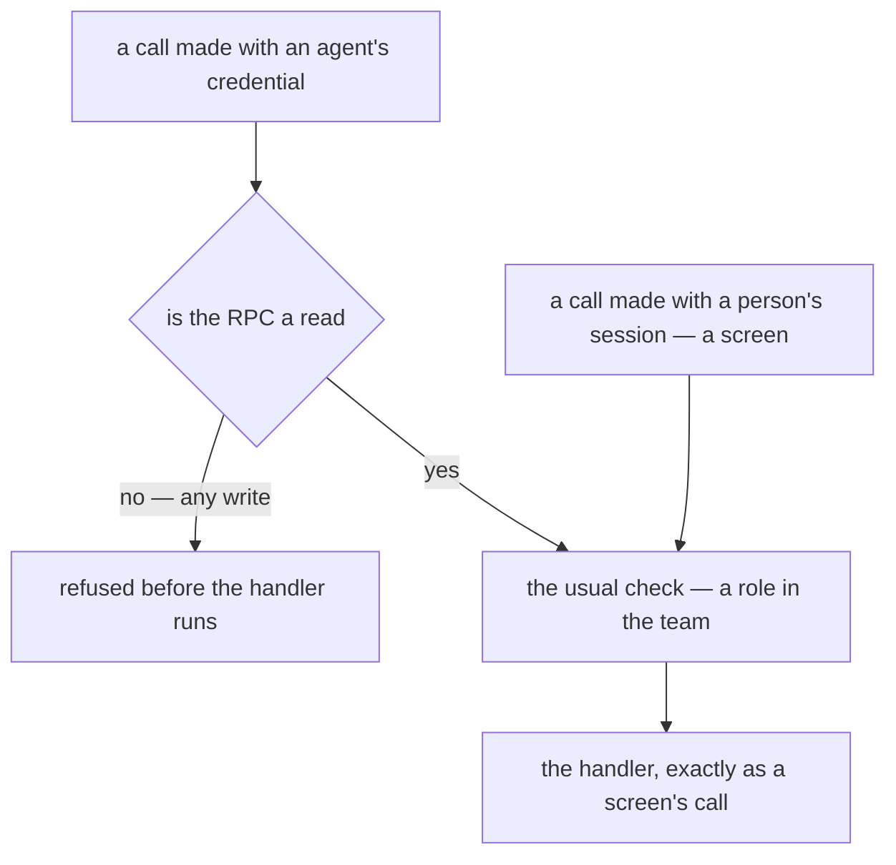
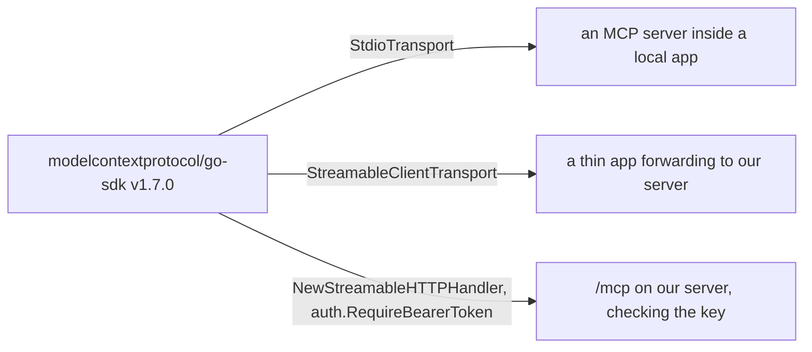

# Decisions — `mcp/context.md`

What the owner settled, recorded before it is acted on. **Append-only** — a decision that is later reversed is
renamed and its references grepped (RULE 12), never quietly edited away. The open set is
[context_clarify.md](./context_clarify.md).

| decision | what it decided | from | under review |
| --- | --- | --- | --- |
| [an-agent-only-reads-for-now](#an-agent-only-reads-for-now) | an AI agent reads and never writes — the server refuses any write made with an agent's credential | owner | [Q3](./context_clarify.md#question) — the credential · [Q6](./context_clarify.md#question) — which reads |
| [the-mcp-uses-the-official-go-sdk](#the-mcp-uses-the-official-go-sdk) | every MCP piece is built on the protocol's official Go SDK, whichever side it runs on | owner | [Q2](./context_clarify.md#question) — which side that is |

## an-agent-only-reads-for-now

> Chat *(owner, 2026-09-29)* — *"for 1, for now, agent only read, cannot run destructive action"*, to
> [Q1](./context_clarify.md#question) — read-only, as recommended.

**The verdict.** For now, an agent connected through the MCP **only reads**. It runs no write at all: none of the
destructive ones your answer names (cancel, delete, a stock adjustment), and none of the harmless-looking ones
either (a draft, a note), since *only read* excludes both. ⚠ My reading of *cannot*: **the server refuses the call**.
A tool list that simply leaves writes out is not *cannot*, because anyone holding the credential can call the API
directly, around the MCP.

### The spec

| | |
| --- | --- |
| what counts as a read | ⚠ my spec: an RPC declared `option idempotency_level = NO_SIDE_EFFECTS;` — the standard proto marker. **No proto carries it today**, so each read is marked as it is offered to agents |
| where it is enforced | the access interceptor, on every call: an agent's credential on an RPC not so declared → `PermissionDenied`, before the handler runs. A person's session is unaffected |
| a read with a side effect | is not a read, and stays unmarked — `CheckAccess` renews a token · beside settlement's report reads, `AnalyticReplayCompute` rebuilds the reports and `AnalyticMaintenanceRun` prunes a table |
| what the agent is told | every tool is listed with MCP's `readOnlyHint: true`. A hint that lets the agent skip asking the person, never the enforcement |
| *for now* | a write later is its own decision, RPC by RPC, with the person confirming in the agent before it runs. Nothing is built to anticipate one |

### What it does NOT settle

- **The credential** — [Q3](./context_clarify.md#question). ⚠ But this rules out the session token: it carries every
  write the person may make, so the agent needs a credential of its own.
- **Which reads** — every read, or only those offered as tools: [Q6](./context_clarify.md#question).
- **Whose data** — one team per credential, and the root bypass: [Q4](./context_clarify.md#question).
- ⚠ **Reading is not harmless.** This limits what an agent can *do*, not what it can *send*: every row it reads goes
  to its provider. That is still [Q5](./context_clarify.md#question) and [Q7](./context_clarify.md#question).

## the-mcp-uses-the-official-go-sdk

> `context.md` §General 3 *(owner, 2026-09-29)* — *"we use `https://github.com/modelcontextprotocol/go-sdk`"*.

**The verdict.** Every MCP piece of this context is built on the protocol's official Go SDK, whichever side it runs
on. It is already a dependency: [go.mod](../../../go.mod) pins it at v1.7.0 for `san remote mcp`.

### The spec

| | |
| --- | --- |
| the module | `github.com/modelcontextprotocol/go-sdk`, one version for the whole repo — the one `go.mod` pins. An upgrade for `san remote` is an upgrade for this, and the reverse |
| what it gives | both transports — stdio for a program on the user's machine, Streamable HTTP for an endpoint on ours — and the client side a thin app forwards with. **It builds every option in [Q2](./context_clarify.md#question), so it does not answer Q2** |
| auth | `auth.RequireBearerToken` checks a bearer on `/mcp` — enough for an agent key ([Q3](./context_clarify.md#question)). **It issues no token**: its OAuth code is for clients and for checking a token, so a login for web agents is a server of ours |
| ⚠ its localhost guard | a request arriving on a loopback address with a non-loopback `Host` is refused with 403 — what `san remote` met behind a tunnel ([san.md](../../tools/san.md#putting-a-tunnel-in-front)). A proxy on the same host in front of `/mcp` would meet it too; `DisableLocalhostProtection` is the switch |
| shared with `san remote` | the library only — never code, never tools ([Contradiction](./context_clarify.md#contradiction)) |

### What it does NOT settle

- **Which protocol crosses to us, and so where the tools live** — [Q2](./context_clarify.md#question). The SDK builds
  every option alike.
