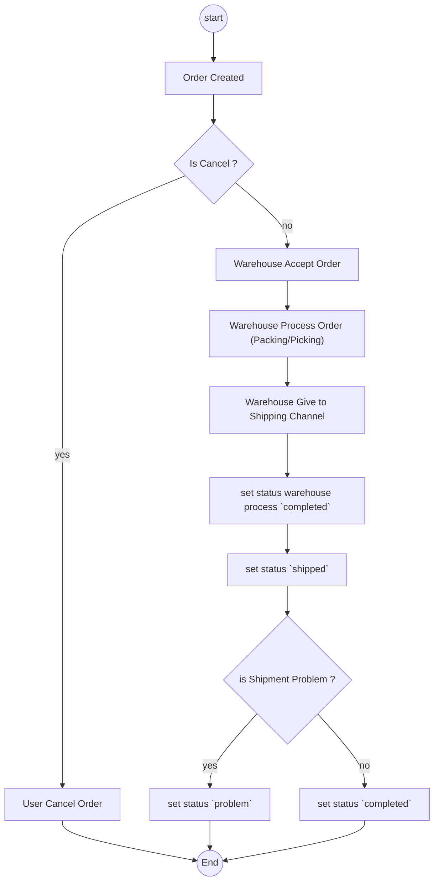
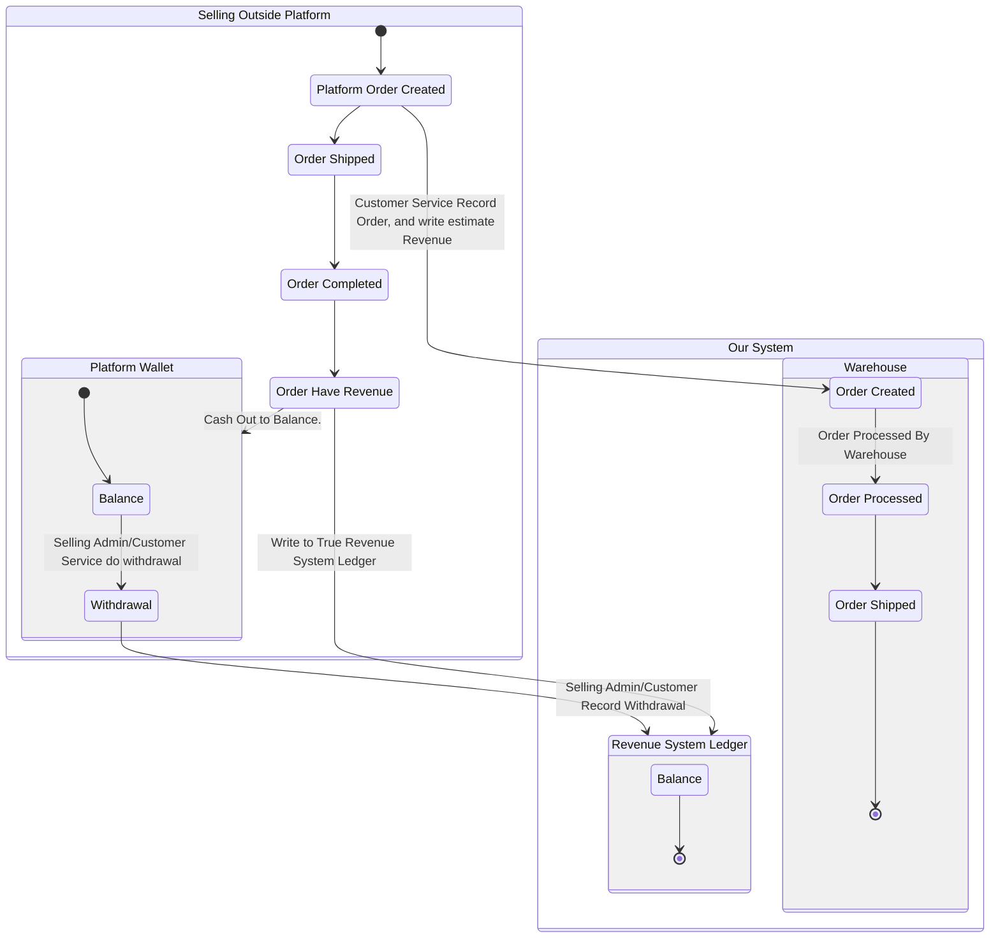
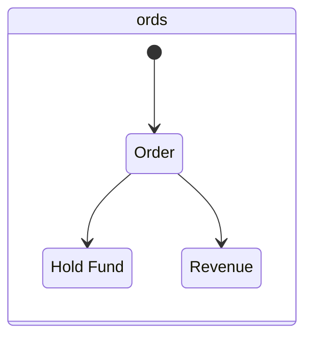
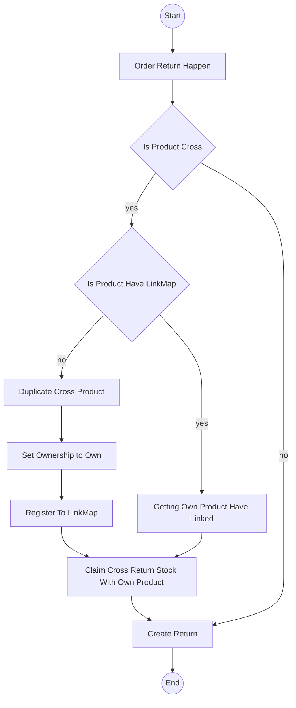

# Order Context.

## Order Anatomy.
when order created. its bring 4 things.
1. Shop Related.
2. Warehouse Related.
3. Marketplace Order Info Related.
4. Product Related.


## How Order Enter Our System.
1. Order is recorded manually by Customer Service.
2. We also exposed create order api. its because maybe Selling Team has own external app to speed up record the orders.

## What Make Our Order Unique.
1. our order can contain partials shared products and own products.
    - when product in order is own team, the debit is COGS and credit was from assets.
    - when product in order is cross team, the debit is COGS and the credit is payable to cross team.
    - in team that have product side, its also increase receivable from team that have order.

    ```mermaid
    block-beta

    columns 3
    
    block
        columns 2

        sa["Selling Team A"]
        space:1

        space:2

        space:1
        p2["Product 2"]
        space:2

        o["Order"]
        space:2
        space:2

        cogs["COGS"]
        

        sa-->o
        sa-->p2
        o-->cogs
        

    end
    
    block
        columns 3
        w["Warehouse Team"]:3

        space:3
        space:1

        s2["Stock Product 2"]
        space:3
        space:3
        s1["Stock Product 1"]
        space:3
        space:3
        wf["Warehouse Fee"]

        w-->s1
        w-->s2
    end

    block
        columns 1

        sb["Selling Team B"]
        space:1

        p1["Product 1"]
        loan["Loan"]

        sb-->p1
    end
    
    p1-->s1
    p2-->s2
    s1-->o
    s2-->o
    o-->wf
    o-->loan

    ```

## Complete Journey Of The Orders.


## How New Order Processed.

1. How User Input The Order.
    ```mermaid
    flowchart TD
    s(("start"))
    s-->u("User Check not recorded order on their own selling platform marketplace")
    u-->isdraft{"make draft first ?"}
    isdraft-->|yes|draftmake["User Input Draft Order"]
        draftmake-->rev("User Review Order")
        rev-->final("finalize the order")
        final-->e
    isdraft-->|no|insertfinal["User Make and finalize Order"]
        insertfinal-->e


    e(("end"))

    ```
2. How Selling third parties record order
    ```mermaid
    flowchart TD
    s(("Start"))
    e(("End"))

    s-->th("Third Parties App Scan Order")
    th-->draft("Create Draft Order")
    draft-->u("User Review Order")
    u-->final("User Finalize the Order")
    final-->e
    
    ```

## Order Settlements.

## About Customer Pays & Order Revenue.

1. In our business, order is from other platform.
2. Estimate Revenue is just recorded. its doesn't affect the ledger, its used for statistic.



### Hold Funds, Revenue And Withdrawals.


### How Withdrawal/Revenue entered or left the business ?.
Withdrawal/Revenue entered or left the business is inputted manually/batch import by customer service or admin to our system.

### True Revenue.
1. True revenue is order scoped.

### 


## Stock Ownership When Order Return. 

### What Is Product LinkMap
1. its use for prevent duplicate create product when order return happened.
2. its use for map product ownership when its return.

