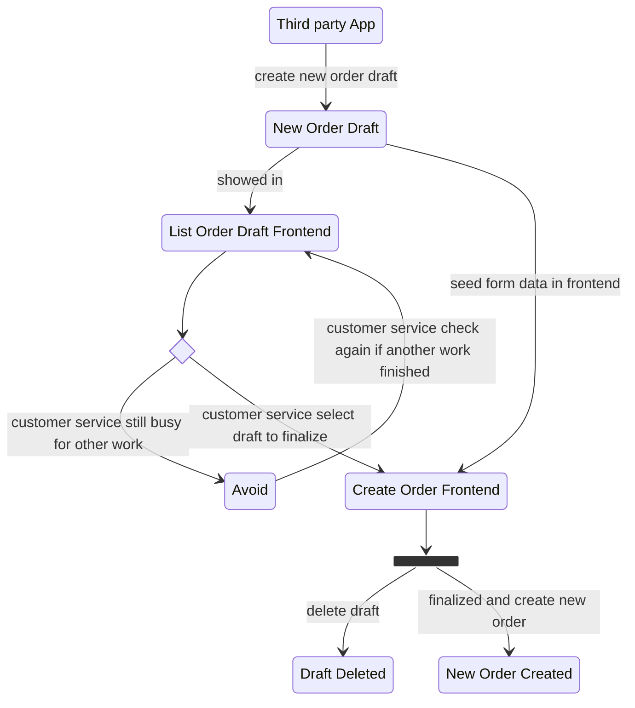
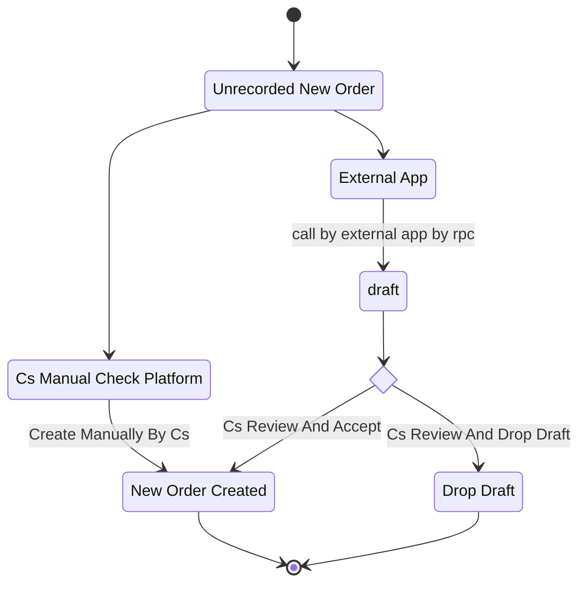
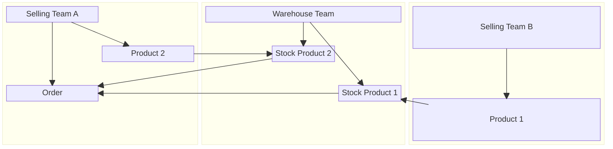
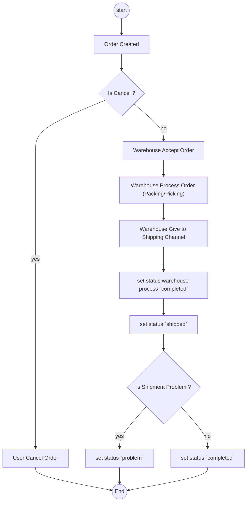
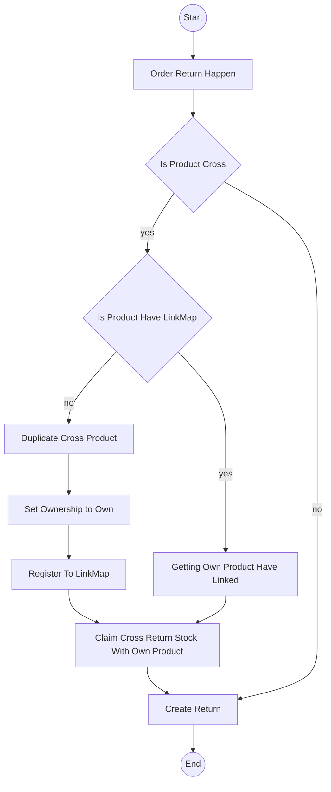

# Order Context.

## General.
1. for order settlement, its follow [this](../settlement/context.md).
2. for order event related, see [this](./event_context.md)

## Whats Order Responsbility And Not.
### Responsbility.
1. Manage Orders.
2. Manage Draft Orders.

### Whats Not.
1. The Cash, about withdrawal & platform wallet. we separate in other service. for now its defer development, we think later.
2. The debt related shared/cross product. we dont manage it. we just send it as event and other service handle it.

## Order Anatomy.
when order created. its bring 4 things.
1. Shop Related.
2. Warehouse Related.
3. Marketplace Order Info Related.
4. Product Related.

## Table That Must Have.
1. `orders`,

    field that must have:
    - `id`, primary key
    - `order_external_ref_id`, its for order uniqueness, its cannot empty
    - `shop_id`
    - `team_id`
    - `warehouse_id`
    - `shipment_channel_id`, see [this](../shipment/context.md)
    - `status`
    - `platform_type`
    - `warehouse_fee`
    - `receipt`
    - `receipt_file`
    
    - `goods_cost`, goods only, used for warehouse fee charge calculation
    - `total_cost`, goods + warehouse fee
    - `platform_total`, is total that outside platform given. Its used for post the settlement later.

2. `order_items`,

    field that must have:
    - `id`, primary key
    - `order_id`
    - `product_id`
    - `owner_team_id`, who team have the product 
    - `is_product_owned`, false if product cross/shared
    - `qty`
    - `unit_cost`, price product, if cross, price before markup 
    - `unit_cost_with_markup`, price product, if cross, price after markup
    - `markup_total`, total - (unit_cost * qty)  
    - `total`, unit_cost_with_markup * qty

3. `order_addresses`,

    field that must have:
    - `id`, primary key
    - `order_id`
    - `customer_name`
    - `customer_phone`
    - `provinsi_name`
    - `kabupaten_name`
    - `kecamatan_name`
    - `desa_name`
    - `postal_code`
    - `address_line`
    

4. `order_drafts`,

    field that must have:
    - `id`, primary key
    - `order_external_ref_id`, its for order uniqueness, its cannot empty
    - `shop_id`
    - `team_id`
    - `shipment_channel_id`
    - `warehouse_id`
    - `platform_type`
    - `platform_total`
    - `receipt`
    - `receipt_file`

5. `order_draft_platform_items`

    field that must have:
    - `id`, primary key
    - `order_draft_id`
    - `platform_title`
    - `platform_price`
    - `qty`
    - `total`

6. `order_draft_addresses`

    field that must have:
    - `id`, primary key
    - `order_draft_id`
    - `customer_name`
    - `customer_phone`
    - `provinsi_name`
    - `kabupaten_name`
    - `kecamatan_name`
    - `desa_name`
    - `postal_code`
    - `address_line`


### Order Items Table.
1. money in columns are frozen at finalize and never recomputed.


### Order Status.
1. Status That Existed.
    - `cancel`
    - `pending`
    - `processed`
    - `shipped`
    - `completed`
    - `problem`
    - `lost`
    - `return`

2. Status Move.
    ```mermaid
    stateDiagram-v2

    pending-->cancel
    pending-->processed
    processed-->cancel
    processed-->shipped
    shipped-->completed
    shipped-->problem
    problem-->completed
    problem-->lost
    problem-->return
    shipped-->lost
    shipped-->return
    completed-->return
    ```

## Order Draft Behavior and What Used For.
1. order draft is used **only by third party app**, when manual, customer service just simple direct create order.
2. order draft exists for accomodate third party app to not create order directly. Its because third party app have incomplete data to create a proper order.
3. finalize order draft to order not doing by backend. draft is fetched by frontend and seed manually in frontend.
4. `order_draft_platform_items` data is just showed in frontend as reference.
5. create order optionally take `order_draft_id`, its used for when create order succeed, draft order is deleted



## How We Manage Order Uniqueness.
1. Order uniqueness manage by code.
2. Unique Scope by `order_external_ref_id` + `shop_id`

    ```mermaid
    flowchart TD
    
    s(("Start"))
    e(("End"))

    s-->ordcreate["Order need Create"]
    ordcreate-->refcheck{"is `order_external_ref_id` exist ?"}
    refcheck-->|no|created["Order Created"]
    refcheck-->|yes|fetch["Fetch existing order with `order_external_ref_id` that not canceled"]

    fetch-->iscancel{"Is Existing Order Cancel"}
    iscancel-->|no|created
    iscancel-->|yes|deny["Deny Order Create"]

    deny-->e
    created-->e
    ```

## How Order Enter Our System.
1. Order Draft is stored to another place. not in table `orders` but in `order_drafts`

2. Inside order creation. its have complex graph, so i separate to [this](./order_creation.md)


## Cross Product Feature.
### Preface
1. Our system have multi selling team and multi warehouse team.
2. Every selling team maybe have stock in across multiple warehouse team.
3. Every Selling team can create order with own product or cross/shared product other selling team with same warehouse team (same warehouse location). 
    Because its only can shipped and processed in single warehouse.


## Whats Charge In Order.
1. `warehouse_fee`, Order that processed by warehouse team charge fee.
2. `cross_product_cost`, when Order use product from other teams.

how we charge that 2 item is managed by balance service that explained in [balance context](../balance/context.md)


### How Fee Calculated.
[defer]


## Complete Journey Of The Orders.



## Stock Ownership When Order Return. 

### What Is Product LinkMap
1. its use for prevent duplicate create product when order return happened.
2. its use for map product ownership when its return.


