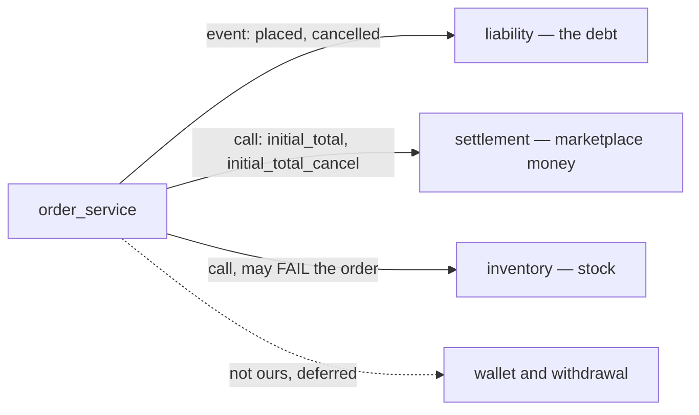
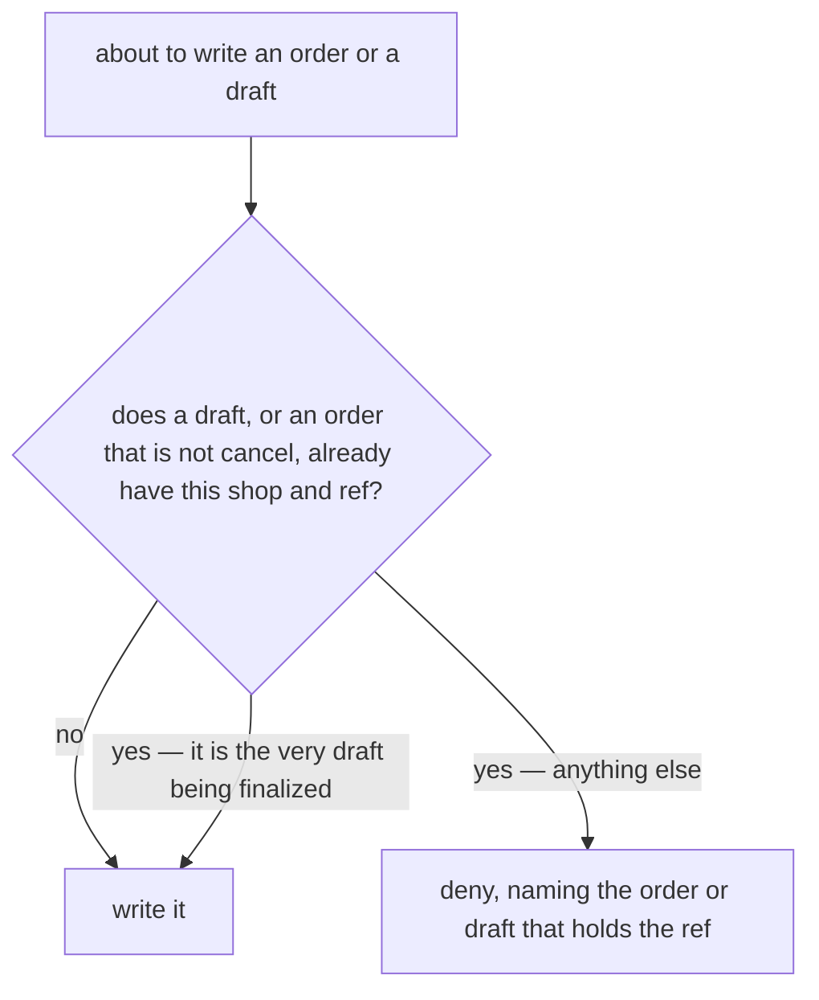
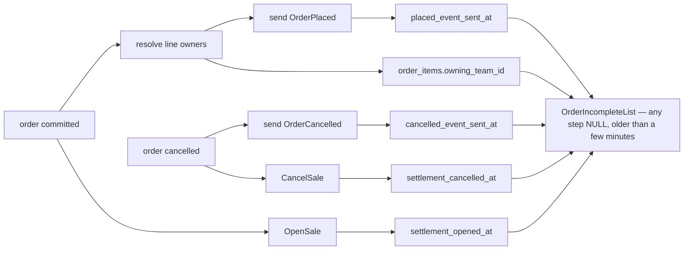
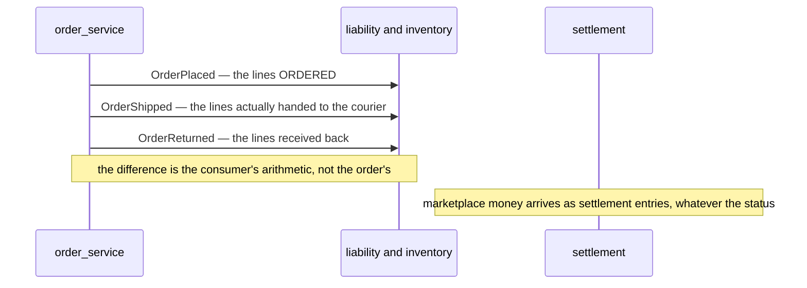
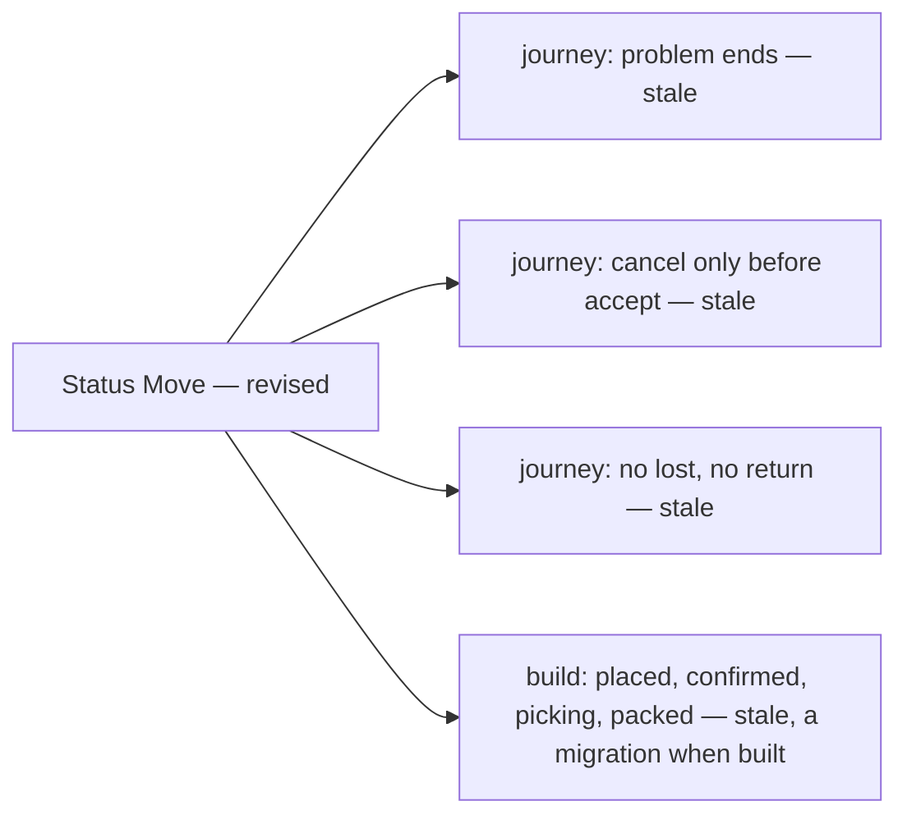
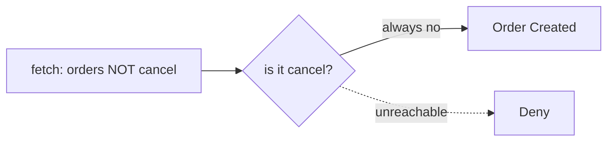

# Clarity — order `context.md`

What [context.md](./context.md) leaves open. **That doc is yours — this one is mine.** Answered points
are deleted, so this file is always the current open set; what was settled is in
[context_decision.md](./context_decision.md).

> **Rewritten 2026-09-15 after a session of edits to the doc.** ✅ Closed and recorded:
> [the-order-follows-settlement-for-its-money](./context_decision.md#the-order-follows-settlement-for-its-money) ·
> [an-order-is-unique-by-shop-and-marketplace-ref](./context_decision.md#an-order-is-unique-by-shop-and-marketplace-ref) ·
> [drafts-keep-their-own-table](./context_decision.md#drafts-keep-their-own-table) ·
> [the-order-has-eight-statuses](./context_decision.md#the-order-has-eight-statuses) ·
> [lost-is-final](./context_decision.md#lost-is-final). That also closes the old *"there is no lifecycle"*, the
> cancel gate, *"`problem` has no exits"*, the withdrawal double-count and the estimate-revenue contradiction.
>
> ⛔ **Found while checking the code this round:** the reconciliation report (#187) that six code comments
> name as the safety net for half-succeeded orders **does not exist** — see
> [half-finished-orders-are-found-from-the-order](#half-finished-orders-are-found-from-the-order).
>
> Questions are **named, not numbered** now, so closing one no longer renumbers the rest. Old numbers are
> kept in each entry as *(was Qn)*.

> 🔄 **The doc moved again since this was written (2026-09-16), and neither edit opens a question.**
> §Whats Charge In Order landed — `warehouse_fee` and `cross_product_cost`, *"managed by balance service"* — which
> **agrees** with [warehouse-prices-balance-records](../warehouse/context_decision.md#warehouse-prices-balance-records)
> next door: balance records, `warehouse_service` prices, and the order calls. ✅ Its `### How Fee Calculated.
> [defer]` is therefore answered in the **warehouse** context, not here — the open parts of it are
> [that clarify's](../warehouse/context_clarify.md#question), not this one's. `## How Order Enter Our System` also
> gained a bare *"2. Inside order created."* — an empty heading, which per RULE 8b.11 reads as **not designed
> yet**, not as a question.

Siblings: [business_level](../business_level_clarify.md) · [user_context](../user/context_clarify.md) ·
[product_context](../product/context_clarify.md) · [balance_context](../balance/context_clarify.md) ·
[inventory_context](../inventory/context_clarify.md) · [settlement_context](../settlement/context_clarify.md).

---

## Proposed Design

### The rules already in the doc, named

#### an-order-mixes-own-and-borrowed-lines
One order carries own **and** borrowed lines at once *(§What Make Our Order Unique 1)*, so every rule about
cross/shared goods is a rule about a **line**, never about an order. The diagram's three obligations land in
three teams: `COGS` (the seller), `Warehouse Fee` (the warehouse), `Loan` (the lending team).

#### every-line-debits-cogs-the-credit-differs
| the line | debit | credit | mirror on the owner's side |
| --- | --- | --- | --- |
| own | COGS | assets | — |
| cross | COGS | payable to the cross team | receivable from the ordering team |

The payable is the credit side of the COGS, never a fourth thing subtracted from margin.

#### a-draft-holds-facts-not-commitments
A draft holds marketplace, warehouse, shipping, customer and **external** product info — a SKU, not our
product — and no stock *(§Order Draft)*. With no mapped product there is no owner and no cost, so nothing
about money can be checked at draft; **every check lands on finalize, and finalize may refuse.**

#### order-emits-it-never-posts
The order does not hold the cash and does not manage the cross debt *(§Whats Not)* — it **announces** and
another service computes. Marketplace money is settlement's
([the-order-follows-settlement-for-its-money](./context_decision.md#the-order-follows-settlement-for-its-money)).

### Proposed — one uniqueness check across both tables

For [one-uniqueness-check-covers-drafts-and-orders](#one-uniqueness-check-covers-drafts-and-orders).

| | |
| --- | --- |
| checked on | draft create · order create · finalize |
| looks at | `order_drafts` **and** `orders` where `status <> 'cancel'`, both on `(shop_id, order_external_ref_id)` |
| finalize | writes the order and deletes the draft **in one transaction** — the build already does this (`inTx`) |
| the race | two writes in the same second both pass a code check. **→ A partial unique index on `orders` as a backstop**, `WHERE status <> 'cancel'` — or record that the race is accepted |

### Proposed — the order records what followed it

For [half-finished-orders-are-found-from-the-order](#half-finished-orders-are-found-from-the-order).

| | |
| --- | --- |
| a step's stamp | written only after the step succeeded. NULL = it did not happen — which also catches a **crash**, where no log line is ever written |
| owners | `owning_team_id NULL` = not resolved, **never 0**. `OrderPlaced` is **held** until they resolve — its id is `order-placed:<id>`, so a first send carrying `0` would make the corrected re-send a duplicate the consumer drops |
| false positive | the step succeeded, its stamp write did not → one wasted retry. Every retry is idempotent (derived event ids · settlement keyed on the order, the cancel on order + act date) |
| repair | a **Retry** per missing step on the order detail page — extending [a-missing-account-is-fixed-by-hand](../settlement/context_decision.md#a-missing-account-is-fixed-by-hand) to all five steps |
| list | `OrderIncompleteList`, paginated (HARD RULE 9) |

### Proposed — the order announces what shipped and what came back

For [the-order-announces-what-shipped-and-what-came-back](#the-order-announces-what-shipped-and-what-came-back).

---

## Critique

| | Problem | → Recommend |
| --- | --- | --- |
| **uniqueness-flow-never-denies** | §How We Manage Order Uniqueness fetches the existing order *"that not canceled"*, then asks *"Is Existing Order Cancel"* — always **no**, so every path reaches `Order Created` and `Deny` is unreachable. See [Contradiction](#the-uniqueness-flow-cannot-enforce-its-own-rule) | one question: *a draft, or an order not `cancel`, with this shop and ref?* — yes → deny |
| **two-tables-one-ref** | `orders` and `order_drafts` both carry the ref *"for order uniqueness"*, and nothing says whether one blocks the other. A check across both refuses a finalize on the draft's own row | [one check, finalize excluded](#proposed--one-uniqueness-check-across-both-tables) |
| **half-finished-orders-have-no-finder** | five after-commit steps end at a log line; the report the code relies on (#187) is unbuilt; a crash leaves no log at all; an unresolved owner is written as `0` | [stamps + a list + retry](#proposed--the-order-records-what-followed-it) |
| **short-pick-and-return-are-silent** | only *placed* and *cancelled* are announced. A short pick leaves another team charged for units that never left; a return never reverses COGS | [two more events](#proposed--the-order-announces-what-shipped-and-what-came-back) |
| **the-empty-ref-lives-on-in-the-build** | the doc says the ref *"cannot empty"*; the build says `''` is *"the ordinary state of an order taken over the phone"* and skips the settlement account when the platform total is 0 — both now forbidden by [platform-total-is-required-at-finalize](./context_decision.md#platform-total-is-required-at-finalize). See [Contradiction](#the-build-still-treats-an-empty-ref-as-a-phone-order) | a `selling_service` migration + handler check when this is built |
| **two-doors-one-rule-set** | the API exists to *"speed up record the orders"* — if the reserve, shared lock and debt threshold are checked on the form and not on the API, the API is the way around them | every rule enforced on finalize, never on a screen |
| **one-warehouse-per-order** | §Order Anatomy names *a* warehouse, but a team's stock sits in several — an order may have no single warehouse holding every line | state it: **one order ships from one warehouse**, and whoever takes it splits it |
| **review-cannot-fail** | `Create Draft → User Review Order → User Finalize` runs one way — a reviewer who spots a bad scan has nowhere to go | approve · edit-then-approve · discard with a reason |
| **what-an-order-must-prove** | nothing lists what the business must be able to show about an order later: who took it, by which door, what shipped, who picked | frozen at finalize: shop, warehouse, lines, owners, cost, source. Recorded as it moves: picker, packer, handover time |

---

## Question

### half-finished-orders-are-found-from-the-order
*(was Q14 — routed here by [ensuring-an-order-is-whole-is-order-services-job](./context_decision.md#ensuring-an-order-is-whole-is-order-services-job))*

**Five steps run after the order commits, and each failure is a log line and nothing else.**

| step | fails → | lost |
| --- | --- | --- |
| send `OrderPlaced` ([order_place.go](../../../backend/services/selling_service/selling_v1/order_place.go)) | logged | order fee and product fee never charged |
| `OpenSale` | logged — ⚠ **not even logged** when the total is 0, which [platform-total-is-required-at-finalize](./context_decision.md#platform-total-is-required-at-finalize) now forbids | no settlement account |
| resolve line owners | logged, owner written as `0` | product fee lost **for good** — `0` reads as *nobody to pay* |
| send `OrderCancelled` ([order_cancel.go](../../../backend/services/selling_service/selling_v1/order_cancel.go)) | logged | ⛔ a cancelled order's fees stay charged, for good |
| `CancelSale` | logged | the account still counts a sale that never happened |

⛔ **The safety net is not built.** Six comments across `selling_service`, `liability_service` and
`inventory_service`, and two protos, accept these gaps because *"the reconciliation report (#187) is built to
find"* them. Issue #187 has been **open since 2026-07-21**, with no RPC and no table. ⚠ **A crash between
commit and send logs nothing at all.** ⚠ **The same catalogue failure also skips the owners' credit check**
([`orderCreditors`](../../../backend/services/selling_service/selling_v1/order_place.go)).

1. **A timestamp per step on the order, plus a list of incomplete orders** — is that the finder?
   **→ Yes** — [the design](#proposed--the-order-records-what-followed-it).
2. **When line owners cannot be resolved:** A. save the order and **hold the event** until they resolve ·
   B. refuse the order · C. keep today's `0`. **→ A.**
3. **Where is the retry?** **→ The order detail page**, one button per missing step.

### one-uniqueness-check-covers-drafts-and-orders
*(was Q1 — the rule itself is decided: [an-order-is-unique-by-shop-and-marketplace-ref](./context_decision.md#an-order-is-unique-by-shop-and-marketplace-ref))*

Does a draft block an order with the same shop and ref, and an order block a draft — with a finalize never
blocked by its own draft? And is a simultaneous double entry stopped by an index, or accepted?
**→ One check over both tables, finalize excluded, and a partial unique index on `orders` as the backstop** —
[the design](#proposed--one-uniqueness-check-across-both-tables).

### the-order-announces-what-shipped-and-what-came-back
*(was Q6)* Does the order emit the lines **actually shipped** at handover, and the lines **received back** on a
return? Today it emits neither, the fee is posted from the ordered quantity, and ledger entries are immutable.
**→ Yes, both.** The business half is yours: **is a short-picked borrowed line charged at what shipped, or at
what was ordered?** There is a case for *ordered* — the owner lost that stock to this order.

### lost-and-return-do-not-reverse-initial-total
*(new)* Settlement names `initial_total_cancel` as the only reversal. Should `lost` and `return` also cancel the
sale on the settlement account? **→ No.** The marketplace decides what a lost or returned parcel is worth, and
settlement records exactly that — a residual balance is already normal
([a-residual-balance-is-normal](../settlement/context_decision.md#a-residual-balance-is-normal)).

### return-means-received-by-the-warehouse
*(new)* `return` can mean *the buyer sent it back* (in transit) or *the warehouse received it* (stock exists
again, and §Stock Ownership When Order Return's `Create Return` runs). **→ Received** — that is when stock and
money move; the transit belongs on a return record, not an order status.

### the-journey-stops-setting-statuses
*(new)* §Complete Journey still sets statuses by the old rules — see
[Contradiction](#the-journey-still-sets-the-old-statuses). **→ Take the `set status …` boxes out of the journey**
so the status diagram is the only place a status is defined.

### finalize-enforces-every-rule-on-both-doors
*(was Q2)* Which rules does finalize run — reserve · shared lock · debt threshold — and may an app create an
order for a team other than its own? **→ All three, on both doors, and never another team.**

### a-blocked-line-refuses-the-whole-order
*(was Q5)* One order can borrow from B and C and be over its limit with only one of them. **→ All-or-nothing at
finalize**, the refusal naming the line and the reason.

### a-draft-runs-no-pre-checks
*(was Q4)* **→ None at draft** — it has an external SKU, so no product, owner or cost to check against.
Finalize re-checks and may refuse.

### who-may-cancel-a-pending-order
*(was Q3's remainder)* `pending --> cancel` exists. Is that also how the **warehouse declines** an order it
cannot fulfil, or only the seller's act? **→ Both may**, with a required reason, so a warehouse refusal is
visible rather than a silent stall in `pending`.

### review-can-reject-a-scanned-draft
*(was Q8)* **→ approve · edit-then-approve · discard with a reason**, checking shop, warehouse, lines,
quantities and each line's owner.

### the-sku-mapping-is-remembered-per-shop
*(was Q11)* A draft's external SKU is mapped to our product by hand. Is that answer kept for the next order?
**→ Yes, per shop** — or the scan saves typing and review charges it back.

### stock-is-taken-synchronously-and-may-fail-the-order
*(was Q12)* §Whats Not names the cash and the debt, not stock — yet an order with no stock fails.
**→ One line:** *"stock is not ours either, but an order may not exist without it — we take it synchronously
and fail if we cannot."*

### the-order-consults-the-debt-it-does-not-manage
*(was Q13)* The order reads the debt threshold before placing. **→ One line:** *"we do not manage the debt; we
do consult it before placing"* — so the pre-check does not read as a scope violation.

### the-cross-line-cogs-is-unit-price-plus-fee
*(was Q7)* The bullets name the legs, not the amount. **→ Link** product `context.md` §Pricing Behavior 2
(`COGS = UnitPrice + fee`) — the two docs already agree.

### placement-means-rack-placement
*(was Q10)* §Order Draft's *"Placement"* beside *"Stock"* reads as the rack — but *"frozen at placement"* elsewhere
means the finalize moment. **→ Say "rack placement", or drop it.**

### an-order-cannot-be-created-without-a-channel
*(re-routed from [shipment](../shipment/context_clarify.md))* The third-party app converts the platform's
courier text to our id ([the-app-converts-the-courier-to-a-channel-id](../shipment/context_decision.md#the-app-converts-the-courier-to-a-channel-id)).
When it cannot — a courier we have no channel for — the draft's `shipment_channel_id` stays empty. May an order
be created from that draft? **→ No.** The person picks the channel on the create form, or root adds it first —
an order with no courier cannot be handed over.

---

# Contradiction

## the-journey-still-sets-the-old-statuses

| §Order Status — Status Move (revised) | §Complete Journey Of The Orders (not revised) |
| --- | --- |
| `problem --> completed`, `problem --> lost`, `problem --> return` | `set status problem --> e` — a problem simply ends |
| `processed --> cancel` | cancel only at `Is Cancel ?`, before `Warehouse Accept Order` |
| `lost`, `return` exist | neither appears |

**Which is wrong:** the journey — the status diagram is the newer statement and was revised deliberately.
**→ Recommend** removing statuses from the journey entirely
([the-journey-stops-setting-statuses](#the-journey-stops-setting-statuses)). ⚠ **The pattern:** a status written
in two diagrams has to be changed in two diagrams, and only one was.

## the-uniqueness-flow-cannot-enforce-its-own-rule

*"`order_external_ref_id`, its for order uniqueness"* (§Table That Must Have) — while the flow beneath §How We
Manage Order Uniqueness reaches `Order Created` on **every** path: it fetches only orders *"that not canceled"*,
then asks whether the fetched one is cancelled. **Which is wrong:** the flow's last diamond.
**→ Recommend** [one-uniqueness-check-covers-drafts-and-orders](#one-uniqueness-check-covers-drafts-and-orders).

## the-build-still-treats-an-empty-ref-as-a-phone-order

*"its cannot empty"* (§Table That Must Have) — while
[00012_order_external_ref.sql](../../../backend/services/selling_service/db_migrations/00012_order_external_ref.sql)
says *"'' = there is NO marketplace reference. That is the ordinary state of an order taken over the phone"*, the
reversed [every-marketplace-order-carries-a-unique-platform-ref](../settlement/context_decision.md#every-marketplace-order-carries-a-unique-platform-ref)
allowed `""` for a phone order, and `openSettlement` skips a platform total of 0 for the same reason. ⚠ The column itself is renamed to `platform_total` ([the-total-is-ours-the-platform-total-is-theirs](./context_decision.md#the-total-is-ours-the-platform-total-is-theirs)).
**Which is wrong:** the build — the doc is the owner's current statement. **→ Recommend** a `CHECK` + handler
check when this context is built, and deciding
[half-finished-orders-are-found-from-the-order](#half-finished-orders-are-found-from-the-order) item 3 in the same
pass, since it is the same assumption.

---

# Awaiting

- **The money of a return** beyond settlement: COGS reversed into inventory at the frozen cost, and the payable
  to a borrowed line's owner standing, since the unit becomes the borrower's own (§Stock Ownership When Order Return).
- **A parcel found after `lost`** — [lost-is-final](./context_decision.md#lost-is-final) means it does not come
  back through its order; how its goods re-enter stock is unwritten.
- **Buyer shipping and COD** — still unmentioned.
