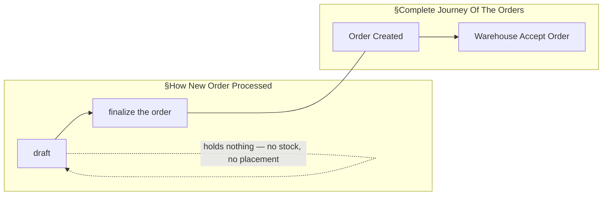
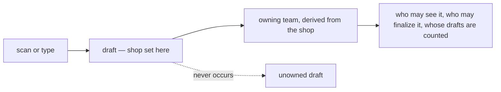
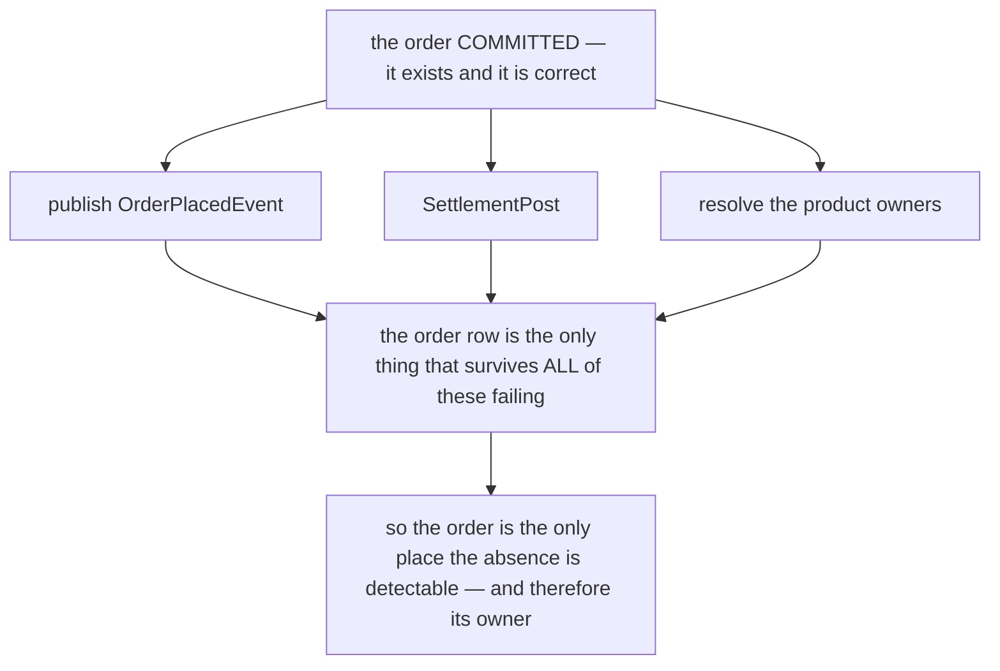
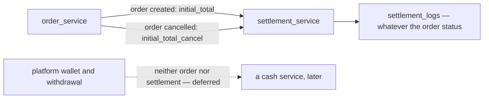
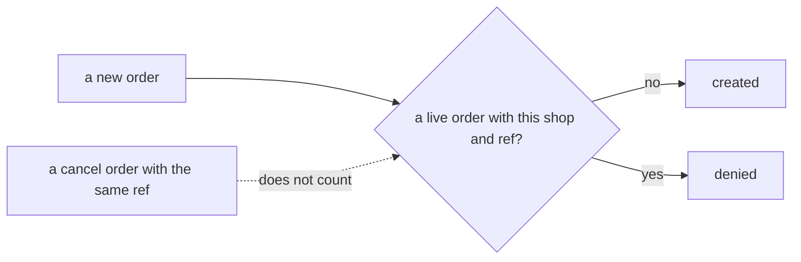
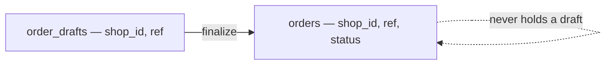
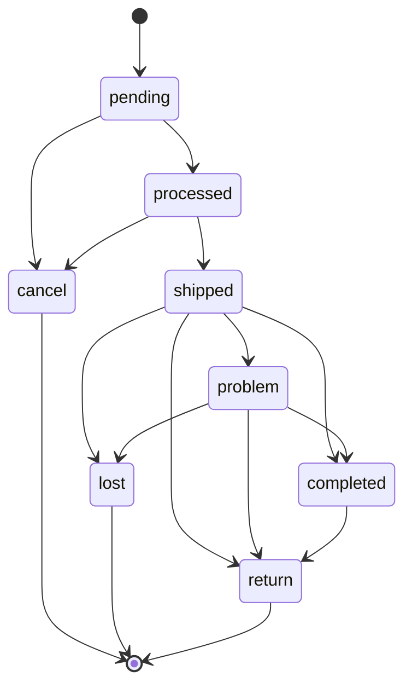
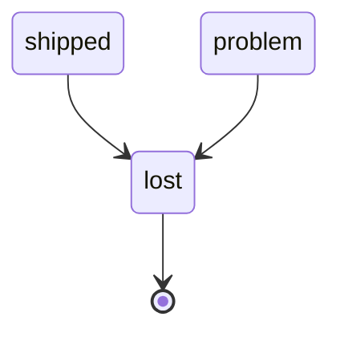

# Decisions — `order_context.md`

What the owner settled, recorded before it is acted on. **Append-only** — a decision that is later
reversed is renamed and its references grepped (RULE 12), never quietly edited away.

| decision | what it decided |
| --- | --- |
| [order-created-is-finalize](#order-created-is-finalize) | the two flows share one vertex — `finalize the order` **is** `Order Created` |
| [a-draft-carries-its-shop](#a-draft-carries-its-shop) | a draft has its shop, and therefore its owning team, from the moment it exists |
| [ensuring-an-order-is-whole-is-order-services-job](#ensuring-an-order-is-whole-is-order-services-job) | finding and repairing a half-succeeded order is `order_service`'s job |
| [the-order-follows-settlement-for-its-money](#the-order-follows-settlement-for-its-money) | marketplace money is described by the settlement doc — the order only opens and cancels the sale |
| [an-order-is-unique-by-shop-and-marketplace-ref](#an-order-is-unique-by-shop-and-marketplace-ref) | no two live orders share `(shop_id, order_external_ref_id)` · the ref is never empty · checked in code |
| [drafts-keep-their-own-table](#drafts-keep-their-own-table) | `order_drafts` stays apart from `orders`, carrying the same ref and shop |
| [the-order-has-eight-statuses](#the-order-has-eight-statuses) | the status set, and every move allowed between them |
| [lost-is-final](#lost-is-final) | an order marked `lost` never moves again |

---

## order-created-is-finalize

> Asked as *"Is `Order Created` the same moment as `finalized`?"* — the seam between §How New Order
> Processed, which ends at *"finalize the order"*, and §Complete Journey Of The Orders, which begins at
> *"Order Created"*. **Owner: yes.**

**The verdict.** They are **one moment under two names**. `finalize` is the act; `Order Created` is the
state it produces. There is no gap between them and nothing happens in between.

**The spec this makes buildable.**

| | |
| --- | --- |
| **before** | a **draft**. Facts only — marketplace, warehouse, shipping, customer, **external** product info. No stock, no rack placement. *(§Order Draft)* |
| **at** | **one atomic act.** Map each external SKU to our product · resolve each line's owner · commit stock · write the money · publish `Order Created`. All of it, or none. |
| **after** | the journey. The order is the warehouse's to accept. |
| **therefore** | **finalize may REFUSE.** Availability seen while drafting can go stale, and every check runs here — so a refusal is an ordinary outcome, not an error path. |

**What it closes.** The seam is gone, so *"when is stock committed?"* has one answer: **at finalize, which
is creation**. The words *"at creation"* are no longer ambiguous, and the diagrams now join.

**What it leaves open.** Only the **money** half of the same question — whether a draft posts a ledger
entry or trips the debt threshold, the shared lock or the reserve. §Order Draft names two physical things
and no financial one. See [Question 4](./context_clarify.md#question).

---

## a-draft-carries-its-shop

> Asked as *"Does a draft carry its shop?"* — the §Responsbility list names marketplace, warehouse,
> shipping, customer and external product info, and not the shop. **Owner: yes.**

**The verdict.** A draft carries its **shop** from the moment it exists. Since a shop belongs to a selling
team, a draft therefore has an **owning team** from the moment it exists. **There is no unowned draft.**

**Why it matters more than it looks.** Every other rule about a draft needs a team to point at: which
team's list it appears in, who may open it, whose [debt threshold](../balance/context_clarify.md#debt-threshold-limits-liability)
would be consulted if one ever were, and who is accountable for a bad one. *"Unowned"* is a state nothing
else in this system can handle, and this decision means it never arises.

**The spec.** `shop` is set at draft creation — the scanner knows which storefront it read, and a person
typing one picks it. A draft with no shop is refused at creation, not carried and resolved later.

**What it closes.** Critique 15, deleted from the clarify file. **What it does not touch:** the shop is not
in the owner's §Responsbility list, so the list and this decision have to be read together until the
list gains it.

---

## ensuring-an-order-is-whole-is-order-services-job

> Owner, in chat (2026-09-10) — *"this question should be in order context section, not in settlement,
> for ensure order half success or not its order service responsbility"*.

**The verdict.** Detecting and repairing a **half-succeeded order** belongs to `order_service`. The
question *"how is a half-succeeded order found afterwards"* is asked here, not in the settlement or
architecture clarifies.

### Why the order, and not the consumers

Each downstream service can only see what it **received**. None of them can see what it **should have**
received and did not — settlement cannot enumerate the orders that never opened an account, because it
never learned they existed. **The order row is the one record that survives every one of these failures**,
which makes it both the only detector and the right owner.

### Where the question moved

| from | to |
| --- | --- |
| `technical/architecture/context_clarify.md` Q2 | a pointer |
| `business/settlement/context_clarify.md` Awaiting | a pointer |
| — | **[order Q14](./context_clarify.md#question)** |

### ⚠ What the routing exposed, which the split had hidden

Asked in three places it read as three problems. In one place it is **one gap at three sites**, and the
third is the worst — and had gone unremarked while it sat in settlement's file:

| site | what is lost | does it look like a failure? |
| --- | --- | --- |
| `OrderPlacedEvent` not published | liability never charges the order fee | a log line |
| `SettlementPost` fails | no settlement account opens | a log line ([the-order-commits-without-settlement](../settlement/context_decision.md#the-order-commits-without-settlement) flagged the finding as its own open half) |
| ⛔ **product owners unresolved** | the product fee, permanently | ⛔ **no** — `0` is written and read downstream as *"nobody to pay"*, so a transient catalogue blip is indistinguishable from a legitimately unowned line |

### ⛔ What is NOT decided by this

**How** the finder works. The recommendation in [order Q14](./context_clarify.md#question) is a nullable
timestamp per leg on the order's own row (`WHERE settlement_posted_at IS NULL`), chosen because it needs
no RPC from another service and over-reports only in the safe direction — a false positive costs one
idempotent retry. **That is a recommendation, not this decision.**

⚠ And it carries one precondition the stamp alone does not meet: `0` must stop meaning both *unresolved*
and *nobody to pay*, or the finder reports every legitimate case forever.

---

## the-order-follows-settlement-for-its-money

> Owner, in the doc (2026-09-15): §General — *"for order settlement, its follow [this](../settlement/context.md)"*
> — and §About Customer Pays & Order Revenue, §How Withdrawal/Revenue entered or left the business and §True
> Revenue removed as *"irrelevant for settlement"*.

**The verdict.** The order doc no longer describes marketplace money. The settlement doc is the authority, and
what the order owes it is **two calls**.

**The spec.**

| the order moves to | the order calls settlement |
| --- | --- |
| created (finalize) | `initial_total` |
| `cancel` | `initial_total_cancel` |
| any other status | nothing — fund, fees and adjustments are settlement entries, independent of status ([settlement-ignores-our-order-status](../settlement/context_decision.md#settlement-ignores-our-order-status)) |

**What it closes.** *"Estimate Revenue … doesn't affect the ledger"*, which contradicted `initial_total` being a
ledger row · a withdrawal written into the same revenue ledger as true revenue, which counted the money twice ·
and a return after `completed` no longer needs `completed` to be final for the marketplace money.
**What it leaves open:** whether `lost` and `return` also cancel the sale —
[lost-and-return-do-not-reverse-initial-total](./context_clarify.md#lost-and-return-do-not-reverse-initial-total).

---

## an-order-is-unique-by-shop-and-marketplace-ref

> Owner, in the doc (2026-09-15): §Table That Must Have — *"`order_external_ref_id`, its for order uniqueness,
> its cannot empty"* · §How We Manage Order Uniqueness — *"Order uniqueness manage by code"*, *"Unique Scope by
> `order_external_ref_id` + `shop_id`"*, and a fetch of the existing order *"that not canceled"*.

**The verdict.** No two live orders share **`(shop_id, order_external_ref_id)`**. The ref is **required on
every order** — every order comes from a marketplace, so there is no phone-order exception. A cancelled order
does not hold its ref. The check is **in code**.

**The spec.**

| | |
| --- | --- |
| scope | `shop_id` + `order_external_ref_id` — a marketplace issues its ids per storefront |
| required | always. `""` is refused |
| cancelled orders | excluded, so a mistaken order can be cancelled and re-recorded |
| enforced | a handler check on create |

⚠ **What it reverses in the build.** `orders.order_external_ref_id` is `NOT NULL DEFAULT ''` and deliberately not
unique ([00012](../../../backend/services/selling_service/db_migrations/00012_order_external_ref.sql)), and
`openSettlement` skips a `marketplace_total` of 0 as a phone order. ⚠ **And it re-homes a rule settlement once
held:** [every-marketplace-order-carries-a-unique-platform-ref](../settlement/context_decision.md#every-marketplace-order-carries-a-unique-platform-ref)
was reversed when settlement moved to keying on our `order_id`
([settlement-keys-on-our-order-id](../settlement/context_decision.md#settlement-keys-on-our-order-id)) — and it had
allowed `""` for phone orders. Uniqueness is now the **order's** rule, and stricter.

**What it leaves open.** The drawn flow never reaches its deny branch, drafts versus orders, and the same-second
race — [one-uniqueness-check-covers-drafts-and-orders](./context_clarify.md#one-uniqueness-check-covers-drafts-and-orders).

---

## drafts-keep-their-own-table

> Owner, in the doc (2026-09-15): §Table That Must Have 2 — `order_drafts`, with `id`, `order_external_ref_id`
> (*"its for order uniqueness, its cannot empty"*) and `shop_id`. A `draft` status on `orders` was written and
> then removed in the same session.

**The verdict.** A draft is **not** an `orders` row. It lives in `order_drafts`, carrying the same ref and shop
as the order it will become.

**Why it holds up.** Every reader of `orders` — the pick queue, lists, counts — stays free of unfinished scans
without remembering to exclude them, and `orders` keeps its required fields. **What it costs:** the ref's
uniqueness now spans two tables.

**The spec.** `order_drafts.shop_id` is set at creation
([a-draft-carries-its-shop](#a-draft-carries-its-shop)); its ref is never empty. ⚠ The build keys a draft on
`(team_id, source, external_id)` — that moves to `shop_id` + the ref.

**What it leaves open.** [one-uniqueness-check-covers-drafts-and-orders](./context_clarify.md#one-uniqueness-check-covers-drafts-and-orders).

---

## the-order-has-eight-statuses

> Owner, in the doc (2026-09-15): §Order Status — *Status That Existed* and *Status Move*, revised over the
> session to the form below.

**The verdict.** Eight statuses, and only these moves.

**The spec.**

| from | may move to |
| --- | --- |
| `pending` | `processed` · `cancel` |
| `processed` | `shipped` · `cancel` |
| `shipped` | `completed` · `problem` · `lost` · `return` |
| `problem` | `completed` · `lost` · `return` |
| `completed` | `return` |
| `cancel` · `lost` · `return` | nothing — final |

**What it settles.** An order can be **cancelled until it ships** · `problem` is a **holding state** that must
end · `completed` is **not final** — a return can follow it. **What it leaves stale:** §Complete Journey still
sets the old statuses ([Contradiction](./context_clarify.md#the-journey-still-sets-the-old-statuses)), and the
build's proto (`placed, confirmed, picking, packed, shipped, cancelled`) needs a migration when built.

---

## lost-is-final

> Asked: *"a lost parcel that turns up has nowhere to go — `lost --> return`, or is `lost` final?"*
> **Owner: "lost is final".** Against my recommendation, which was the edge.

**The verdict.** Nothing moves out of `lost`.

**The spec.** Every move out of `lost` is refused. **The consequence, stated so it is not rediscovered:** a
parcel found after being declared lost does **not** come back through its order — its goods re-enter stock by
some other path, which no doc describes yet (clarify *Awaiting*).
