# Decisions — `order_context.md`

What the owner settled, recorded before it is acted on. **Append-only** — a decision that is later
reversed is renamed and its references grepped (RULE 12), never quietly edited away.

| decision | what it decided |
| --- | --- |
| [order-created-is-finalize](#order-created-is-finalize) | the two flows share one vertex — `finalize the order` **is** `Order Created` |
| [a-draft-carries-its-shop](#a-draft-carries-its-shop) | a draft has its shop, and therefore its owning team, from the moment it exists |
| [ensuring-an-order-is-whole-is-order-services-job](#ensuring-an-order-is-whole-is-order-services-job) | finding and repairing a half-succeeded order is `order_service`'s job |
| [the-order-follows-settlement-for-its-money](#the-order-follows-settlement-for-its-money) | marketplace money is described by the settlement doc — the order only opens and cancels the sale |
| [an-order-is-unique-by-shop-and-marketplace-ref](#an-order-is-unique-by-shop-and-marketplace-ref) | no two live orders share `(shop_id, order_external_ref_id)` · the ref is never empty · checked in code |
| [drafts-keep-their-own-table](#drafts-keep-their-own-table) | `order_drafts` stays apart from `orders`, carrying the same ref and shop |
| [the-order-has-eight-statuses](#the-order-has-eight-statuses) | the status set, and every move allowed between them |
| [lost-is-final](#lost-is-final) | an order marked `lost` never moves again |
| [the-total-is-ours-the-platform-total-is-theirs](#the-total-is-ours-the-platform-total-is-theirs) | the buyer-paid figure is `platform_total` everywhere — the build's `marketplace_total` is renamed |
| [superseded-the-warehouse-fee-is-a-percentage-of-our-total](#superseded-the-warehouse-fee-is-a-percentage-of-our-total) | ⛔ reversed — the basis became `sub_total` |
| [the-warehouse-fee-is-a-percentage-of-the-goods](#the-warehouse-fee-is-a-percentage-of-the-goods) | the fee is a percent of `sub_total`, the goods alone — never the shipping, never `platform_total` |
| [platform-is-the-word-for-the-outside-marketplace](#platform-is-the-word-for-the-outside-marketplace) | one vocabulary: `platform_type`, `platform_total` |
| [an-order-records-no-shipping-cost](#an-order-records-no-shipping-cost) | shipping is the platform's money — the order never stores what it cost |
| [the-cross-charge-lives-on-the-line](#the-cross-charge-lives-on-the-line) | each line carries its owner and its markup — there is no order-level cross cost |
| [a-lines-money-is-frozen-at-finalize](#a-lines-money-is-frozen-at-finalize) | the money columns are written once and never recomputed |
| [superseded-the-two-draft-line-tables-are-not-linked](#superseded-the-two-draft-line-tables-are-not-linked) | ⛔ reversed — there is only one line table now |
| [a-draft-holds-only-the-platforms-lines](#a-draft-holds-only-the-platforms-lines) | a draft is the header plus what the platform said — nothing of ours |
| [superseded-finalizing-deletes-the-draft-from-the-frontend](#superseded-finalizing-deletes-the-draft-from-the-frontend) | ⛔ reversed — the create call deletes it now |
| [create-order-takes-the-draft-id-and-deletes-it](#create-order-takes-the-draft-id-and-deletes-it) | `order_draft_id` is optional on create — on success the draft goes |
| [an-address-is-plain-names](#an-address-is-plain-names) | no region codes — an order address is the text it will be shipped to |
| [a-draft-carries-the-scraped-address](#a-draft-carries-the-scraped-address) | the draft mirrors the order's address table, so the buyer is never retyped |
| [one-address-per-order-and-per-draft](#one-address-per-order-and-per-draft) | exactly one address row each — unique on the parent id |
| [shipment-channel-is-an-id-into-shipment-service](#shipment-channel-is-an-id-into-shipment-service) | the order stores an opaque id, resolved by a future `shipment_service` |
| [the-channel-name-is-not-frozen](#the-channel-name-is-not-frozen) | the order keeps only the id — the name is always resolved live |
| [drafts-exist-only-for-the-third-party-app](#drafts-exist-only-for-the-third-party-app) | a person never drafts — Customer Service creates the order directly |
| [the-frontend-finalizes-a-draft-not-the-backend](#the-frontend-finalizes-a-draft-not-the-backend) | the draft seeds the create-order form in the browser; there is no promote RPC |
| [platform-total-is-required-at-finalize](#platform-total-is-required-at-finalize) | an order cannot be finalized without the buyer-paid figure — it is what settlement opens on |

---

## order-created-is-finalize

> Asked as *"Is `Order Created` the same moment as `finalized`?"* — the seam between §How New Order
> Processed, which ends at *"finalize the order"*, and §Complete Journey Of The Orders, which begins at
> *"Order Created"*. **Owner: yes.**

**The verdict.** They are **one moment under two names**. `finalize` is the act; `Order Created` is the
state it produces. There is no gap between them and nothing happens in between.

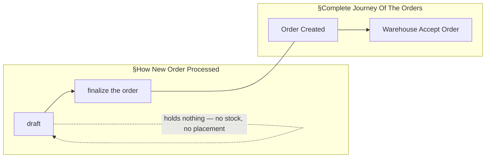

**The spec this makes buildable.**

| | |
| --- | --- |
| **before** | a **draft**. Facts only — marketplace, warehouse, shipping, customer, **external** product info. No stock, no rack placement. *(§Order Draft)* |
| **at** | **one atomic act.** Map each external SKU to our product · resolve each line's owner · commit stock · write the money · publish `Order Created`. All of it, or none. |
| **after** | the journey. The order is the warehouse's to accept. |
| **therefore** | **finalize may REFUSE.** Availability seen while drafting can go stale, and every check runs here — so a refusal is an ordinary outcome, not an error path. |

**What it closes.** The seam is gone, so *"when is stock committed?"* has one answer: **at finalize, which
is creation**. The words *"at creation"* are no longer ambiguous, and the diagrams now join.

**What it leaves open.** Only the **money** half of the same question — whether a draft posts a ledger
entry or trips the debt threshold, the shared lock or the reserve. §Order Draft names two physical things
and no financial one. See [Question 4](./context_clarify.md#question).


---

## a-draft-carries-its-shop

> Asked as *"Does a draft carry its shop?"* — the §Responsbility list names marketplace, warehouse,
> shipping, customer and external product info, and not the shop. **Owner: yes.**

**The verdict.** A draft carries its **shop** from the moment it exists. Since a shop belongs to a selling
team, a draft therefore has an **owning team** from the moment it exists. **There is no unowned draft.**

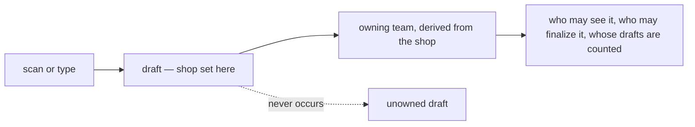

**Why it matters more than it looks.** Every other rule about a draft needs a team to point at: which
team's list it appears in, who may open it, whose [debt threshold](../balance/context_clarify.md#debt-threshold-limits-liability)
would be consulted if one ever were, and who is accountable for a bad one. *"Unowned"* is a state nothing
else in this system can handle, and this decision means it never arises.

**The spec.** `shop` is set at draft creation — the scanner knows which storefront it read, and a person
typing one picks it. A draft with no shop is refused at creation, not carried and resolved later.

**What it closes.** Critique 15, deleted from the clarify file. **What it does not touch:** the shop is not
in the owner's §Responsbility list, so the list and this decision have to be read together until the
list gains it.

---

## ensuring-an-order-is-whole-is-order-services-job

> Owner, in chat (2026-09-10) — *"this question should be in order context section, not in settlement,
> for ensure order half success or not its order service responsbility"*.

**The verdict.** Detecting and repairing a **half-succeeded order** belongs to `order_service`. The
question *"how is a half-succeeded order found afterwards"* is asked here, not in the settlement or
architecture clarifies.

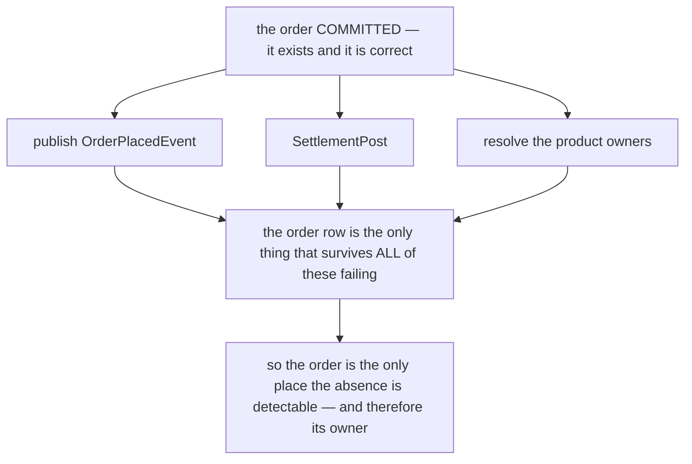

### Why the order, and not the consumers

Each downstream service can only see what it **received**. None of them can see what it **should have**
received and did not — settlement cannot enumerate the orders that never opened an account, because it
never learned they existed. **The order row is the one record that survives every one of these failures**,
which makes it both the only detector and the right owner.

### Where the question moved

| from | to |
| --- | --- |
| `technical/architecture/context_clarify.md` Q2 | a pointer |
| `business/settlement/context_clarify.md` Awaiting | a pointer |
| — | **[order Q14](./context_clarify.md#question)** |

### ⚠ What the routing exposed, which the split had hidden

Asked in three places it read as three problems. In one place it is **one gap at three sites**, and the
third is the worst — and had gone unremarked while it sat in settlement's file:

| site | what is lost | does it look like a failure? |
| --- | --- | --- |
| `OrderPlacedEvent` not published | liability never charges the order fee | a log line |
| `SettlementPost` fails | no settlement account opens | a log line ([the-order-commits-without-settlement](../settlement/context_decision.md#the-order-commits-without-settlement) flagged the finding as its own open half) |
| ⛔ **product owners unresolved** | the product fee, permanently | ⛔ **no** — `0` is written and read downstream as *"nobody to pay"*, so a transient catalogue blip is indistinguishable from a legitimately unowned line |

### ⛔ What is NOT decided by this

**How** the finder works. The recommendation in [order Q14](./context_clarify.md#question) is a nullable
timestamp per leg on the order's own row (`WHERE settlement_posted_at IS NULL`), chosen because it needs
no RPC from another service and over-reports only in the safe direction — a false positive costs one
idempotent retry. **That is a recommendation, not this decision.**

⚠ And it carries one precondition the stamp alone does not meet: `0` must stop meaning both *unresolved*
and *nobody to pay*, or the finder reports every legitimate case forever.

---

## the-order-follows-settlement-for-its-money

> Owner, in the doc (2026-09-15): §General — *"for order settlement, its follow [this](../settlement/context.md)"*
> — and §About Customer Pays & Order Revenue, §How Withdrawal/Revenue entered or left the business and §True
> Revenue removed as *"irrelevant for settlement"*.

**The verdict.** The order doc no longer describes marketplace money. The settlement doc is the authority, and
what the order owes it is **two calls**.

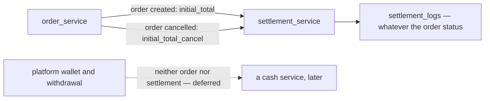

**The spec.**

| the order moves to | the order calls settlement |
| --- | --- |
| created (finalize) | `initial_total` |
| `cancel` | `initial_total_cancel` |
| any other status | nothing — fund, fees and adjustments are settlement entries, independent of status ([settlement-ignores-our-order-status](../settlement/context_decision.md#settlement-ignores-our-order-status)) |

**What it closes.** *"Estimate Revenue … doesn't affect the ledger"*, which contradicted `initial_total` being a
ledger row · a withdrawal written into the same revenue ledger as true revenue, which counted the money twice ·
and a return after `completed` no longer needs `completed` to be final for the marketplace money.
**What it leaves open:** whether `lost` and `return` also cancel the sale —
[lost-and-return-do-not-reverse-initial-total](./context_clarify.md#lost-and-return-do-not-reverse-initial-total).

---

## an-order-is-unique-by-shop-and-marketplace-ref

> Owner, in the doc (2026-09-15): §Table That Must Have — *"`order_external_ref_id`, its for order uniqueness,
> its cannot empty"* · §How We Manage Order Uniqueness — *"Order uniqueness manage by code"*, *"Unique Scope by
> `order_external_ref_id` + `shop_id`"*, and a fetch of the existing order *"that not canceled"*.

**The verdict.** No two live orders share **`(shop_id, order_external_ref_id)`**. The ref is **required on
every order** — every order comes from a marketplace, so there is no phone-order exception. A cancelled order
does not hold its ref. The check is **in code**.

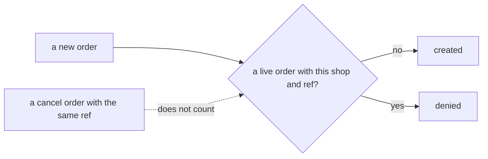

**The spec.**

| | |
| --- | --- |
| scope | `shop_id` + `order_external_ref_id` — a marketplace issues its ids per storefront |
| required | always. `""` is refused |
| cancelled orders | excluded, so a mistaken order can be cancelled and re-recorded |
| enforced | a handler check on create |

⚠ **What it reverses in the build.** `orders.order_external_ref_id` is `NOT NULL DEFAULT ''` and deliberately not
unique ([00012](../../../backend/services/selling_service/db_migrations/00012_order_external_ref.sql)), and
`openSettlement` skips a `marketplace_total` of 0 as a phone order. ⚠ **And it re-homes a rule settlement once
held:** [every-marketplace-order-carries-a-unique-platform-ref](../settlement/context_decision.md#every-marketplace-order-carries-a-unique-platform-ref)
was reversed when settlement moved to keying on our `order_id`
([settlement-keys-on-our-order-id](../settlement/context_decision.md#settlement-keys-on-our-order-id)) — and it had
allowed `""` for phone orders. Uniqueness is now the **order's** rule, and stricter.

**What it leaves open.** The drawn flow never reaches its deny branch, drafts versus orders, and the same-second
race — [one-uniqueness-check-covers-drafts-and-orders](./context_clarify.md#one-uniqueness-check-covers-drafts-and-orders).

---

## drafts-keep-their-own-table

> Owner, in the doc (2026-09-15): §Table That Must Have 2 — `order_drafts`, with `id`, `order_external_ref_id`
> (*"its for order uniqueness, its cannot empty"*) and `shop_id`. A `draft` status on `orders` was written and
> then removed in the same session.

**The verdict.** A draft is **not** an `orders` row. It lives in `order_drafts`, carrying the same ref and shop
as the order it will become.

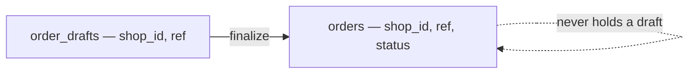

**Why it holds up.** Every reader of `orders` — the pick queue, lists, counts — stays free of unfinished scans
without remembering to exclude them, and `orders` keeps its required fields. **What it costs:** the ref's
uniqueness now spans two tables.

**The spec.** `order_drafts.shop_id` is set at creation
([a-draft-carries-its-shop](#a-draft-carries-its-shop)); its ref is never empty. ⚠ The build keys a draft on
`(team_id, source, external_id)` — that moves to `shop_id` + the ref.

**What it leaves open.** [one-uniqueness-check-covers-drafts-and-orders](./context_clarify.md#one-uniqueness-check-covers-drafts-and-orders).

---

## the-order-has-eight-statuses

> Owner, in the doc (2026-09-15): §Order Status — *Status That Existed* and *Status Move*, revised over the
> session to the form below.

**The verdict.** Eight statuses, and only these moves.

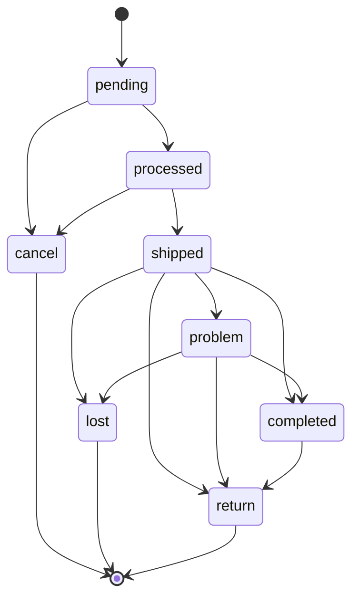

**The spec.**

| from | may move to |
| --- | --- |
| `pending` | `processed` · `cancel` |
| `processed` | `shipped` · `cancel` |
| `shipped` | `completed` · `problem` · `lost` · `return` |
| `problem` | `completed` · `lost` · `return` |
| `completed` | `return` |
| `cancel` · `lost` · `return` | nothing — final |

**What it settles.** An order can be **cancelled until it ships** · `problem` is a **holding state** that must
end · `completed` is **not final** — a return can follow it. **What it leaves stale:** §Complete Journey still
sets the old statuses ([Contradiction](./context_clarify.md#the-journey-still-sets-the-old-statuses)), and the
build's proto (`placed, confirmed, picking, packed, shipped, cancelled`) needs a migration when built.

---

## lost-is-final

> Asked: *"a lost parcel that turns up has nowhere to go — `lost --> return`, or is `lost` final?"*
> **Owner: "lost is final".** Against my recommendation, which was the edge.

**The verdict.** Nothing moves out of `lost`.

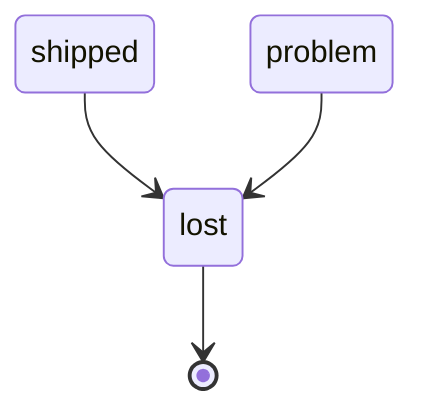

**The spec.** Every move out of `lost` is refused. **The consequence, stated so it is not rediscovered:** a
parcel found after being declared lost does **not** come back through its order — its goods re-enter stock by
some other path, which no doc describes yet (clarify *Awaiting*).

---

## the-total-is-ours-the-platform-total-is-theirs

> Owner (2026-09-16): **"platform_total win"** — asked as whether the buyer-paid figure keeps the build's
> name `marketplace_total` or the doc's new `platform_total`. Written into §Different `total` and
> `platform_total`.

**The verdict.** Two figures, never mixed, and the buyer-paid one is **`platform_total`** in every doc,
proto, column and screen.

| | what it is | who computes it | what reads it |
| --- | --- | --- | --- |
| `total` | **our** price for the order, as the system calculates it | us | the **warehouse fee** basis is `sub_total`, not this ([the-warehouse-fee-is-a-percentage-of-the-goods](#the-warehouse-fee-is-a-percentage-of-the-goods)), margin |
| `platform_total` | what the **storefront actually took** from the buyer, after its vouchers and subsidies | the marketplace | settlement's `initial_total` |

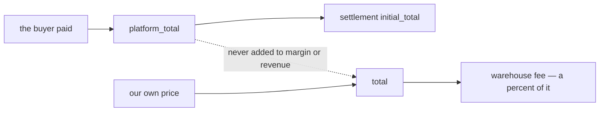

**What changes.** The shipped column is `orders.marketplace_total`, so this is a rename, not a new field —
and it stays a **fact, not an estimate**
([marketplace-total-is-a-fact-not-an-estimate](../settlement/context_decision.md#marketplace-total-is-a-fact-not-an-estimate),
whose own name now reads against the vocabulary it described).

| where | roughly |
| --- | --- |
| `proto/` — `selling/v1/order.proto`, `settlement/v1/settlement.proto` | 5 sites, then regenerate |
| `backend/` — the model, `order_place.go`, the settlement poster, tests | 25 |
| `frontend/src/` — the order form, the detail panel, the settlement screens, both locale files | 35 |
| `docs/` — settlement's context and decisions, the schema doc | 64 |
| a migration renaming the column added by `00008_order_marketplace_total.sql` | 1 |

⚠ **What it leaves open:** `marketplace_type` still says *marketplace*, so one doc now uses both words.
Settlement's append-only decisions keep the old name in their text and are renamed by reference, not edited.

---

## superseded-the-warehouse-fee-is-a-percentage-of-our-total

> ⛔ **REVERSED — NOT IN FORCE.** Superseded by [the-warehouse-fee-is-a-percentage-of-the-goods](#the-warehouse-fee-is-a-percentage-of-the-goods):
> the owner made the basis `sub_total`, *"goods only"*, the same day. Kept because this file is append-only.
> **Do not build from it.**

> Owner (2026-09-16): **"yes"** to *"Is the warehouse fee a percentage of `total` (our price), not
> `platform_total`?"*

**The verdict.** `WarehouseFeeCalculate`'s `order_total` is **`orders.total`** — our own figure. The
platform's discounting never changes what the warehouse is paid.

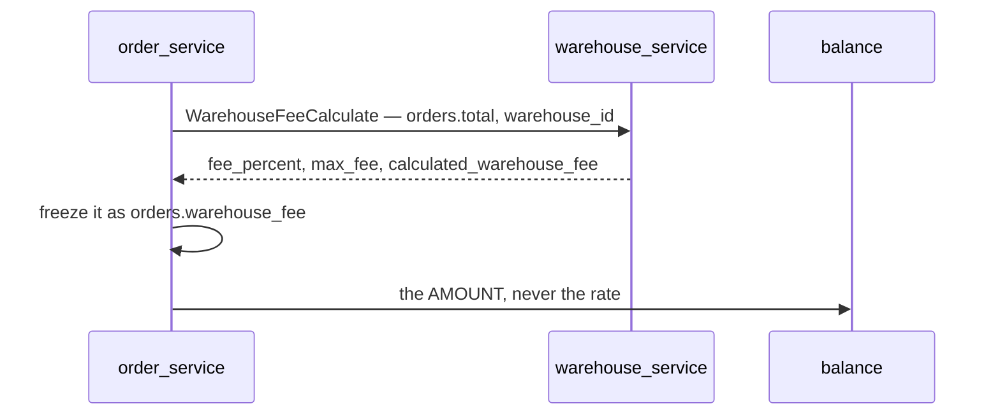

**The spec.**

| | |
| --- | --- |
| basis | `orders.total` — never `platform_total`, which can be missing and would compute a fee of 0 |
| rate | `fee_percent`, capped by `max_fee`, both from the warehouse's own config |
| frozen | when the order calls, per [warehouse-prices-balance-records](../warehouse/context_decision.md#warehouse-prices-balance-records) |
| stored | `orders.warehouse_fee`, the frozen copy |
| balance | is told the amount and records it; it computes nothing |

**Why it holds up.** The work of picking and packing is the same whether the marketplace discounted the
sale or not, so the warehouse should not absorb a promotion it had no part in.

⚠ **What it leaves open:** `total` includes **shipping cost**, so the warehouse earns a percentage of the
courier's fee as well as of the goods. If that is not intended the basis is `subtotal`, not `total`.
⚠ And the build still charges a **flat** `liability_terms.handling_fee`, which this supersedes —
see [is-the-old-flat-rate-column-dropped](../warehouse/context_clarify.md#question).

---

## platform-total-is-required-at-finalize

> Owner (2026-09-16): **"yes"** to *"Is `platform_total` required at finalize?"*

**The verdict.** An order cannot be finalized without `platform_total`. It is the figure settlement opens
the account on, so an order missing it can never be settled.

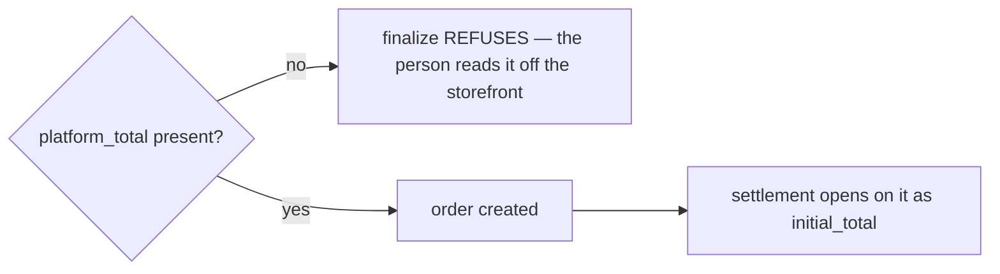

**The spec.** Checked at finalize, on **both** doors — the typed order and the promoted draft. A draft may
hold it empty while it is still being worked on; finalize is where it becomes required.

⚠ **What must change in the build.** `openSettlement` today **returns early when the figure is 0**, treating
0 as *"an order taken over the phone"* — silently, with no log line. With this decision that case cannot
arise, so the early return becomes dead code and should be replaced by the finalize check. ⚠ And
`OrderDraftPromote` passes no total at all, so **every promoted draft is currently a 0** — the draft must
carry `platform_total` and finalize must copy it.

---

## the-warehouse-fee-is-a-percentage-of-the-goods

> Owner (2026-09-16), in §Table That Must Have: *"`sub_total`, goods only, used for warehouse fee charge
> calculation"* — reversing [superseded-the-warehouse-fee-is-a-percentage-of-our-total](#superseded-the-warehouse-fee-is-a-percentage-of-our-total)
> the same day, in the direction I recommended.

**The verdict.** The fee is a percentage of **`sub_total`** — the goods alone. Shipping is not in the basis,
and neither is `platform_total`.

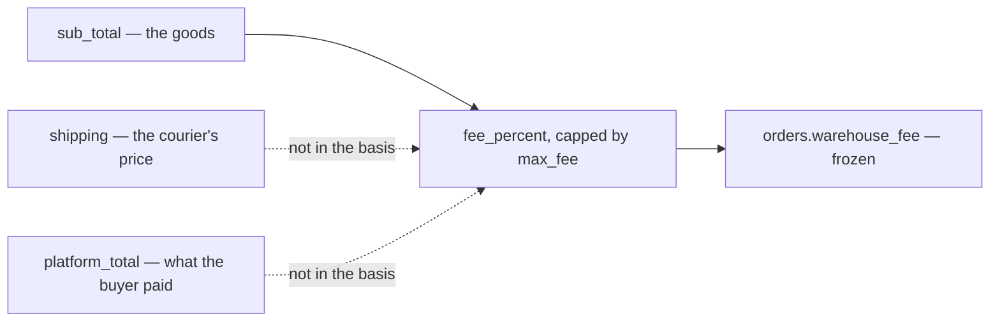

**Why it beats the alternative.** Shipping is a proxy for the **courier's** cost, not the warehouse's: the
same box, same picking and same packing, priced 80% apart because one buyer lives further away or because a
free-shipping promotion was running. Basing the fee on the goods asks the one question the warehouse can
answer — *what were the goods worth?*

**The spec.**

| | |
| --- | --- |
| basis | `orders.sub_total` |
| rate | `fee_percent`, capped by `max_fee`, from the warehouse's own config |
| frozen | when the order calls, per [warehouse-prices-balance-records](../warehouse/context_decision.md#warehouse-prices-balance-records) |
| stored | `orders.warehouse_fee` |
| balance | is told the amount; it computes nothing |

⚠ **It costs nothing today** — `warehouse_service` does not exist yet, so `WarehouseFeeCalculate`'s
`order_total` payload field is renamed to the goods figure before anything is built against it.

---

## platform-is-the-word-for-the-outside-marketplace

> Owner (2026-09-16): **"platform_total win"**, then `marketplace_type` → **`platform_type`** in
> §Table That Must Have.

**The verdict.** One vocabulary for the storefront outside our system: **platform**. `platform_type`,
`platform_total`.

| ours | theirs |
| --- | --- |
| `sub_total` · `total` · `warehouse_fee` | `platform_type` · `platform_total` |

⚠ **What still says *marketplace*** and is now inconsistent: the shipped `orders.marketplace_total` column
and `order.proto`, `shops.marketplace` and its enum, settlement's `context.md` and its append-only decisions
(renamed by reference, never edited), and the frontend's `MarketplaceInfoForm` plus both locale files. The
rename lands as one change per side, not gradually — a half-renamed vocabulary is worse than either name.

---

## an-order-records-no-shipping-cost

> Owner (2026-09-16): **"no"** to *"Does an order record shipping cost?"* — asked because the field vanished
> from §Table That Must Have while the journey still hands parcels to a shipping channel.

**The verdict.** An order stores **no shipping cost**. The buyer pays the platform, the platform pays the
courier, and none of that money passes through us — so there is nothing for the order to record.

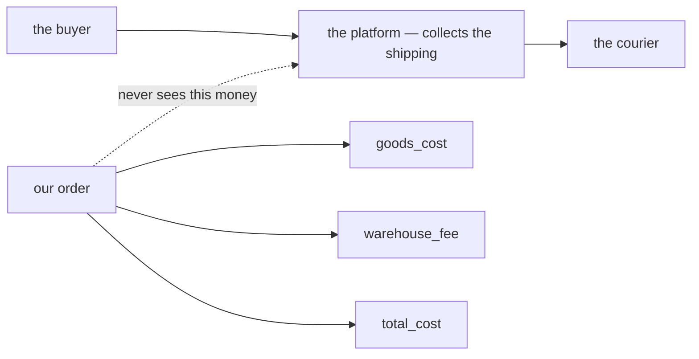

**What the order still records about shipping** — the facts, never the money: which **courier**
(`shipping_code`), the **receipt** (`receipt`, `receipt_file`), and the draft's *"shipping info"*.

**What changes in the build.** `orders.shipping_cost` is dropped, `total` stops being
`subtotal + shipping_cost`, and **`margin = total − cogs − shipping_cost` no longer holds** — with shipping
gone it becomes `platform_total − total_cost`. The order form's shipping-cost input and the detail panel's
row go with it.

⚠ **It does not touch inbound shipping.** `shipping_fee` and `cod_fee` on a restock or return are the
warehouse's real outlay and stay exactly as the balance doc describes them — a different journey, in the
opposite direction.

---

## the-cross-charge-lives-on-the-line

> Owner (2026-09-16), in §Table That Must Have: a third table, `order_items`, carrying `owner_team_id`,
> `price` (*"if cross, price before markup"*), `markup_price`, `markup_total` and `total`.

**The verdict.** The cross/shared charge is a fact about a **line**, not about an order. One order may borrow
from several teams, and each line names the team it is owed to.

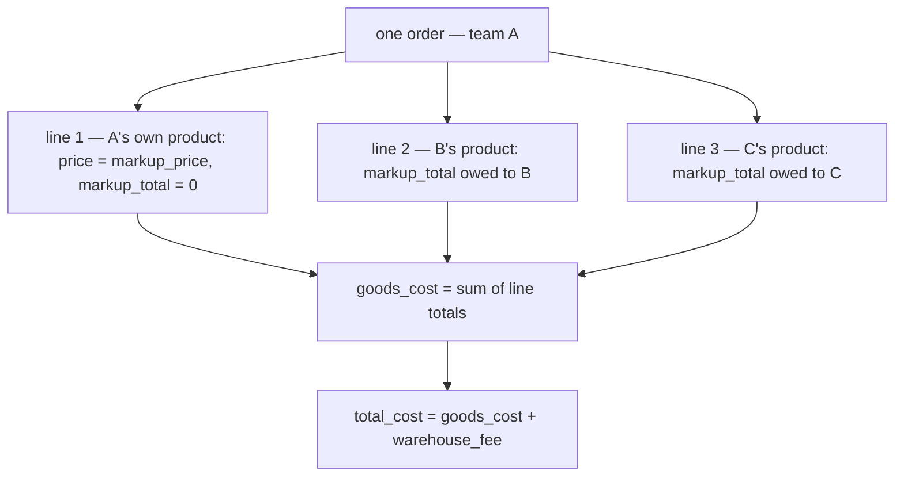

**What it settles beyond the grain.** `goods_cost` is a **cost**, not a sale figure: a line's `price` is the
figure *before* markup, so the sum of `markup_price × qty` is what the goods cost the selling team — own
lines at their own cost, borrowed lines at the owner's cost plus that owner's markup. That is the same
arithmetic the product doc states as `COGS = UnitPrice + fee`, now written per line.

**The spec.**

| | |
| --- | --- |
| `owner_team_id` | the team whose goods this line sold. Equal to the order's team on an own line |
| `price` | the unit figure before markup |
| `markup_price` | the unit figure after the owner's markup. On an own line, the same as `price` |
| `markup_total` | `(markup_price − price) × qty` — **what is owed to `owner_team_id`** |
| `total` | `markup_price × qty` — this line's cost |
| the order | `goods_cost = Σ total` · `total_cost = goods_cost + warehouse_fee` |

⚠ **Renamed the same day** (owner, 2026-09-16): `price` → **`unit_cost`**, `markup_price` → **`unit_cost_with_markup`**
— the figures and the verdict are unchanged, and the names now match `goods_cost` and `total_cost` beside them,
and the build's own `order_items.unit_cost`.

**What it closes.** §Whats Charge In Order's `cross_product_cost` needs no order-level field: it is
`Σ markup_total`, per owner. And the half-finished-order design's *"frozen owner per line"* now has a home —
`owner_team_id` on the line rather than a `0` riding on an event.

---

## a-lines-money-is-frozen-at-finalize

> Owner (2026-09-16), §Order Items Table: *"money in columns are frozen at finalize and never recomputed."*

**The verdict.** Every money column on a line — and the order totals summed from them — is written **once**,
at finalize, and never recalculated afterwards.

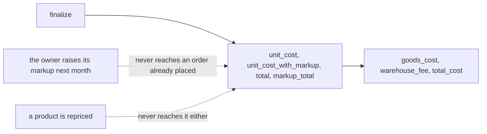

**Why it matters more than it reads.** A markup, a fee percentage and a product's cost all change over time.
Recomputing would rewrite what a team was charged for a sale that already happened, and two teams would then
disagree about a debt neither of them changed. It is the same rule the ledger's reversal already follows —
`ReverseOrder` reads back what was charged rather than deriving it, *"a rate changed between placement and
cancellation would make it disagree by design"*.

**The spec.**

| | |
| --- | --- |
| frozen | `unit_cost` · `unit_cost_with_markup` · `total` · `markup_total` · `goods_cost` · `warehouse_fee` · `total_cost` |
| written | at finalize, in the order's own transaction |
| never | recomputed on read, on a rate change, or on a repricing |
| a correction | is a new fact — a reversal or an adjustment — never an edit of these columns |

⚠ **What it makes sharper, not smaller.** If the picked quantity differs from the ordered one, these figures
stay as written — so the difference can only be carried by a **new** fact, which is why the order still has to
announce what actually shipped
([the-order-announces-what-shipped-and-what-came-back](./context_clarify.md#the-order-announces-what-shipped-and-what-came-back)).

---

## superseded-the-two-draft-line-tables-are-not-linked

> ⛔ **REVERSED — NOT IN FORCE.** Superseded by [a-draft-holds-only-the-platforms-lines](#a-draft-holds-only-the-platforms-lines)
> the same day: `order_draft_items` was removed, so there are no longer two line tables to link. Kept because
> this file is append-only. **Do not build from it.**

> Asked as *"add a nullable `platform_item_id` to `order_draft_items`, so a mapped line names the platform
> line it came from?"* — **Owner: "no need, we dont have that."** Against my recommendation.

**The verdict.** A draft holds two line tables that **do not reference each other**.
`order_draft_platform_items` is what the platform said; `order_draft_items` is what a person decided we will
ship. They sit side by side and are read together by eye.

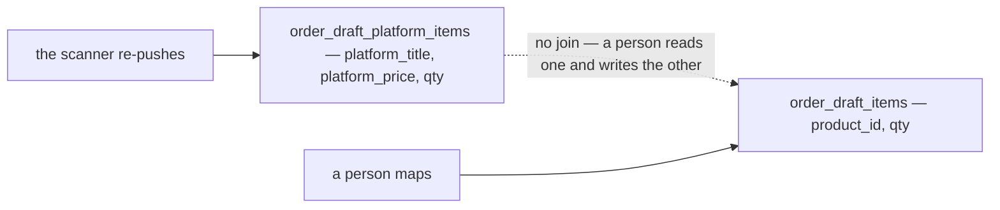

**Why it is defensible.** The relationship often is not one-to-one — a platform line can be a bundle of two
of our products, and two lines can be one — so a per-line link would be a claim the data cannot always
support. The split still buys the thing that matters: **the push owns one table and the person owns the
other**, so a re-scrape can replace the platform's lines wholesale and never destroy someone's work.

**What follows from it, recorded so it is not rediscovered as a bug:**

| | |
| --- | --- |
| progress | a draft cannot say *"5 of 8 mapped"* — only that both tables have lines. Counts can match while the wrong products are mapped |
| review | the reviewer compares the two lists **by eye**. That is the control, so the screen must show them side by side |
| auto-mapping | nothing records *this platform SKU became that product*, so repeat products cannot arrive pre-mapped from the draft's own history |
| bundles | a bundle is expressible precisely because no link is claimed |

⚠ **The review screen carries the weight this design gives up.** With no link and no progress count, the only
thing standing between a mis-scrape and a real order is a person reading two lists — so finalize must show
them together, and quantities must be easy to compare.

---

## drafts-exist-only-for-the-third-party-app

> Owner (2026-09-16), §Order Draft Behavior and What Used For 1–2: *"order draft is used **only by third
> party app**, when manual, customer service just simple direct create order"* · *"order draft exists for
> accomodate third party app to not create order directly. Its because third party app have incomplete data
> to create a proper order."*

**The verdict.** A draft is the **app's inbox**, nothing else. A person never drafts: Customer Service types
an order and creates it.

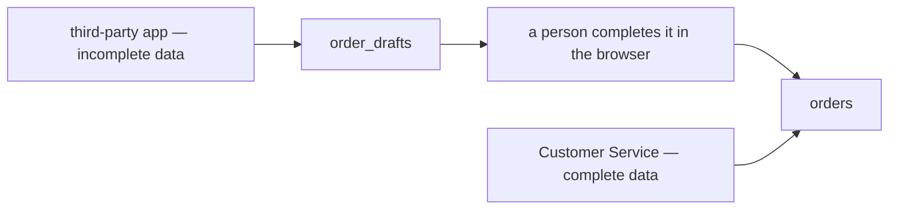

**Why the draft exists at all.** Not as a save-for-later: an app **cannot** produce a valid order, because it
does not know our products, our warehouse or the rest. The draft is the shape that holds an incomplete scrape
until a person finishes it — which is why *"nothing at draft"* is structural, and why a draft can never be
what a hurried person uses to postpone typing an order properly.

**What it closes.** The form's minted `form-…` external ids disappear with the person-drafting path.

---

## the-frontend-finalizes-a-draft-not-the-backend

> Owner (2026-09-16), §Order Draft Behavior and What Used For 3–4: *"finalize order draft to order not doing
> by backend. draft is fetched by frontend and seed manually in frontend"* · *"`order_draft_platform_items`
> data is just showed in frontend as reference."*

**The verdict.** There is **no promote RPC**. The browser fetches the draft, seeds the create-order form from
it, a person completes it, and the ordinary create-order call runs. The platform's lines are shown beside the
form as reference and are never submitted.

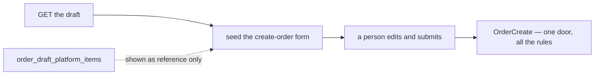

**What it buys.** One door into `orders`, so the rules cannot differ between a typed order and a finalized
draft — the reason the build gave for sharing a code path, now achieved by having only one path.

⚠ **What it costs, recorded so it is not rediscovered.** The build deletes the draft **inside the order's
transaction**, so *"the order exists and the draft is gone"* is one fact. Two separate calls cannot be atomic:
if the create succeeds and the draft is not removed, the draft stays in the queue and can be finalized again.

| | |
| --- | --- |
| the safety net that already exists | [an-order-is-unique-by-shop-and-marketplace-ref](#an-order-is-unique-by-shop-and-marketplace-ref) — the second attempt carries the same ref and is refused |
| what the net does not fix | a **stale draft** sitting in the queue, which a person will open and work on again |
| ⚠ **→ Recommend** | the create-order request carries `order_draft_id`, and the backend removes the draft in the same transaction. The seeding stays in the browser; only the cleanup moves back |

⚠ **And it reopens who writes `order_draft_items`.** [the-two-draft-line-tables-are-not-linked](#the-two-draft-line-tables-are-not-linked)
assumed the push owns the platform lines and a **person** owns ours. With finalize happening entirely in the
browser, nobody saves a mapping back to the draft — so either the **app** writes `order_draft_items` too, or
that table has no writer at all. Asked in the clarify.

---

## a-draft-holds-only-the-platforms-lines

> Owner (2026-09-16): **"im remove `order_draft_items`, its no sense"** — asked as *"who writes
> `order_draft_items` — the app, or nobody?"*

**The verdict.** A draft is an `order_drafts` header plus `order_draft_platform_items`. **Nothing of ours is
stored on a draft** — no product, no owner, no cost, no mapped line.

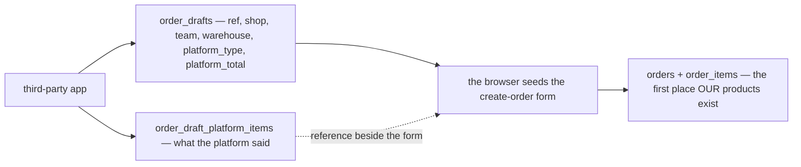

**Why it is right.** The table had **no writer**. With
[the-frontend-finalizes-a-draft-not-the-backend](#the-frontend-finalizes-a-draft-not-the-backend), mapping
happens in the create-order form and goes straight to `orders`; nothing ever saved a mapping back to a draft.
A table nobody writes is a table that reads as a promise the system does not keep.

**What it completes.** *"Nothing at draft"* is now total rather than nearly true: a draft cannot know whose
goods a line is, what they cost, or whether a limit is breached — because it holds no product at all. Every
check therefore lands at create, which is the one door.

⚠ **The cost, stated plainly:** mapping progress is **not saved**. A person who maps six lines of an
eight-line scrape and closes the tab starts again — the form is browser state until it is submitted. That is
acceptable while an order is minutes of work, and is the thing to revisit if drafts ever get large.

⚠ **It also corrects the ownership note** in the superseded decision above: the app owns **everything** a
draft contains. A person writes nothing to a draft — they read it, and write an order.

---

## superseded-finalizing-deletes-the-draft-from-the-frontend

> ⛔ **REVERSED — NOT IN FORCE.** Superseded by [create-order-takes-the-draft-id-and-deletes-it](#create-order-takes-the-draft-id-and-deletes-it)
> the same day: the create call now carries `order_draft_id` and removes the draft itself, so the browser no
> longer makes two calls. Kept because this file is append-only. **Do not build from it.**

> Owner (2026-09-16), §Order Draft Behavior diagram: a fork out of *"Create Order Frontend"* to both
> *"Draft Deleted"* and *"New Order Created"* — answering *"what removes the draft?"*

**The verdict.** The browser does both: it creates the order and deletes the draft. There is no backend
promote, so the two are **separate calls**.

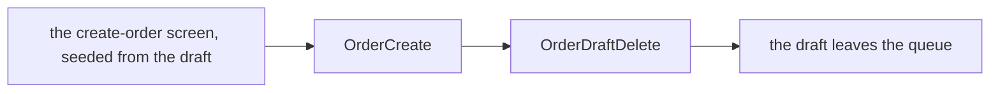

⚠ **The fork draws them as one act; they are two, and the order between them decides which failure you get.**

| sequence | if the second call fails |
| --- | --- |
| **create, then delete** | the order exists, the draft stays in the queue. Someone opens it again — and the duplicate order is refused by [an-order-is-unique-by-shop-and-marketplace-ref](#an-order-is-unique-by-shop-and-marketplace-ref). **Wasted work, nothing lost** |
| ⛔ **delete, then create** | the draft is gone and **no order exists**. The scrape is lost, and nobody is told |

**→ Recommend, in order of preference:**

1. **`OrderCreate` takes `order_draft_id` and removes the draft in its own transaction.** One call, one fact,
   nothing to sequence. The seeding stays in the browser — only the cleanup moves back.
2. Failing that: **create first, delete second, never the reverse**, with the delete retried on failure.

⚠ **And a re-scrape can resurrect a finalized draft.** The app's push is create-or-update on the reference,
so a deleted draft reappears the next time the app reads that order. **→ A push whose reference already
belongs to a live order should be refused**, which is the same check the uniqueness rule already defines.

⚠ **Drafts nobody finalizes have no ending.** *"Avoid — customer service still busy"* loops back to the list,
and nothing ages a draft out, so the queue only grows. Not a question for this decision; worth a rule of its
own.

---

## create-order-takes-the-draft-id-and-deletes-it

> Owner (2026-09-16), §Order Draft Behavior 5: *"create order optionally take `order_draft_id`, its used for
> when create order succeed, draft order is deleted"* — and [order_creation.md](./order_creation.md) draws
> `if success → Delete Draft Order`. As recommended.

**The verdict.** `order_draft_id` is an **optional** field on create. A typed order omits it; an order
finalized from a draft carries it, and a successful create removes that draft. The browser makes **one call**.

```mermaid
flowchart LR
  D["the draft seeds the form in the browser"] --> C["OrderCreate — with order_draft_id"]
  C -->|"success"| X["the draft is deleted"]
  C -->|"refused"| K["the draft is still there, and can be retried"]
  T["a typed order"] --> C2["OrderCreate — no draft id"]
```

**What it removes.** The ordering hazard the two-call version had: there is no sequence in which the draft can
be deleted while the order fails, so a scrape can never be lost. A refused create leaves the draft exactly
where it was.

**The spec.**

| | |
| --- | --- |
| the field | `order_draft_id`, optional. Absent = a typed order |
| on success | the draft is deleted |
| on refusal | nothing is deleted — the person fixes the form and submits again |
| a draft id that does not exist, or belongs to another team | the create is refused, rather than silently ignoring it |

⚠ **Still outside the transaction, as drawn.** [order_creation.md](./order_creation.md) puts the delete on the
`if success` branch **after** the commit, so a failed delete still leaves a finalized draft in the queue —
the benign failure, but an avoidable one. Drafts and orders are the same service and the same database, so
**→ recommend the delete run inside the order's transaction**, which makes *"the order exists and the draft is
gone"* one fact.

⚠ **And a re-scrape can still resurrect it.** The app's push is create-or-update on the reference, so a
deleted draft returns the next time the app reads that platform order. **→ A push whose reference already
belongs to a live order should be refused** — the same check the uniqueness rule already defines.

---

## an-address-is-plain-names

> Owner (2026-09-16): **"use plain names in addresses"** — asked as *"keep the region codes beside the
> names?"*. **Against my recommendation.**

**The verdict.** `order_addresses` stores **names only**: `provinsi_name`, `kabupaten_name`,
`kecamatan_name`, `desa_name`, `postal_code`, `address_line`, plus `customer_name` and `customer_phone`. No
`region_service` codes are kept on the order.

```mermaid
flowchart LR
  P["region_service — 91.599 rows keyed by kode wilayah"] --> PICK["the person picks a place"]
  PICK --> A["order_addresses — the NAMES only"]
  PICK -.->|"the code is not kept"| A
  A --> LABEL["what gets printed on the parcel"]
```

**Why it holds up.** An order's address is read by a **courier**, not by a query. We no longer price
shipping at all ([an-order-records-no-shipping-cost](#an-order-records-no-shipping-cost)), so the one thing
the codes were needed for — rate calculation by region — is not ours to do. What remains is a label that
must still read correctly in five years, and a frozen name does that without `region_service` existing.

**What it gives up, recorded so it is not rediscovered as a bug:**

| | |
| --- | --- |
| grouping by region | *"how many orders to Cikarang Utara"* is unanswerable — the name repeats across the country, and nothing says which one this was |
| re-validating an old address | the stored text cannot be matched back to the current region list once a name changes upstream |
| the picker's own answer | `AddressPicker` selects a coded row and the code is discarded on write |

**→ If region analytics are ever wanted**, this is the decision to revisit first — the cheapest fix is
adding the four codes back at write time, not deriving them later from text.

⚠ **The build stores codes today** — `provinsi_code`, `kabupaten_code`, `kecamatan_code`, `desa_code` on
`orders` — so this is a column drop, and `kode_pos` becomes `postal_code` in the same move.

---

## a-draft-carries-the-scraped-address

> Owner (2026-09-16): `order_draft_addresses` added, mirroring `order_addresses` field for field — asked as
> *"should a draft hold the scraped address?"*. As recommended, and in a stronger shape than I proposed.

**The verdict.** A draft carries the buyer: `customer_name`, `customer_phone`, the four region **names**,
`postal_code` and `address_line` — the same columns an order's address has.

```mermaid
flowchart LR
  APP["third-party app scrapes the platform"] --> DA["order_draft_addresses"]
  DA --> F["seeds the create-order form"]
  F --> OA["order_addresses — frozen on the order"]
```

**Why mirroring beats free text.** I had proposed one raw blob, on the grounds that a scrape cannot be
trusted to split an address. Mirroring is better: whatever the app **can** split arrives in the right box and
needs no re-reading, and whatever it cannot is simply left empty for the person to fill. A blob would have
made every draft need the same manual work, including the ones the app got right.

**The spec.**

| | |
| --- | --- |
| written by | the app, on push — like everything else on a draft ([a-draft-holds-only-the-platforms-lines](#a-draft-holds-only-the-platforms-lines)) |
| completeness | **best effort.** Every field may be empty; a draft is defined by being incomplete |
| what completes it | the person, in the create-order form — the draft itself is never corrected |
| what is frozen | only `order_addresses`, written at create. A draft's copy is working material |

⚠ **Where an unsplittable address should land:** `address_line`, holding whatever text the platform gave,
so nothing is lost when the app cannot parse the region tiers.

---

## one-address-per-order-and-per-draft

> Owner (2026-09-16): **"yes"** to *"one address row per order and per draft — unique on `order_id` /
> `order_draft_id`?"*

**The verdict.** `order_addresses.order_id` and `order_draft_addresses.order_draft_id` are **unique**. An
order has exactly one address, and so does a draft.

```mermaid
erDiagram
  orders ||--|| order_addresses : "exactly one"
  order_drafts ||--|| order_draft_addresses : "exactly one"
```

**What it buys.** Nothing that reads an address has to choose between rows or define what "the current one"
means — the join is total, and an order detail can read it as if it were columns.

**The spec.**

| | |
| --- | --- |
| the constraint | `UNIQUE (order_id)` · `UNIQUE (order_draft_id)` |
| written | in the **same transaction** as its parent — an order without an address must not be reachable |
| corrections | update the one row. There is no second address and no history of addresses |
| a later billing address | would be a **new decision**, not a second row in this table |

⚠ **The build's `customer_name` is required** (`orders_customer_present CHECK`). Splitting the table moves
that rule: the address row must exist and carry a name, or the same guarantee is quietly lost.

---

## shipment-channel-is-an-id-into-shipment-service

> Owner (2026-09-16): *"we later have shipment_service and have id mapped to shipment channel"* — asked as
> *"`shipment_channel_id` or the courier code, as the build has it?"*

**The verdict.** `orders.shipment_channel_id` and `order_drafts.shipment_channel_id` hold an **opaque id**
owned by a `shipment_service` that does not exist yet. Not a code, not a name.

```mermaid
flowchart LR
  O["orders.shipment_channel_id"] -->|"opaque id, no FK — HARD RULE 3"| S["shipment_service (planned)"]
  S --> N["the channel's name, for a screen"]
  D["order_drafts.shipment_channel_id"] --> S
```

**The spec.**

| | |
| --- | --- |
| type | an id, opaque to `order_service`, **no cross-service FK** |
| who resolves it | `shipment_service`, by RPC, when a screen needs the name |
| on a draft | the app sets it when it knows the channel; empty otherwise |

⚠ **It replaces the build's `orders.shipping_code`** — an opaque courier code resolved against
`shipping_service`'s `shippings` table. Two services cannot both own the courier catalogue, so when
`shipment_service` arrives, `shipping_service`'s role in the order path ends.

⚠ **This is the opposite habit from the address beside it.** [an-address-is-plain-names](#an-address-is-plain-names)
freezes text so a past order renders alone; this stores a reference that must be resolved every time. So a
renamed or retired channel changes what an old order appears to have shipped by — and a deleted one leaves a
blank. **→ Recommend freezing the channel's NAME beside the id**, the way the receipt already freezes its
filename. Open, not decided.

---

## the-channel-name-is-not-frozen

> Owner (2026-09-16): **"no, we use id no channel name/code"** — closing the open half of
> [shipment-channel-is-an-id-into-shipment-service](#shipment-channel-is-an-id-into-shipment-service).
> **Against my recommendation.**

**The verdict.** The order stores `shipment_channel_id` and **nothing else** about the channel. Every screen
that shows a courier resolves the name from `shipment_service` at read time.

```mermaid
flowchart LR
  O["orders.shipment_channel_id"] --> R["resolve at read time"]
  R --> S["shipment_service"]
  S --> N["the channel's CURRENT name"]
```

**Why it is coherent.** A courier is a **live counterparty**, not a historical fact the way an address is: if
a channel is renamed, the current name is the useful one — it is what support, the tracking page and the
courier themselves use. Freezing a superseded label would make an old order harder to act on, not easier.
It also keeps one name in one place, so a correction reaches every order at once.

**What it costs:**

| | |
| --- | --- |
| a renamed channel | rewrites what **every past order** appears to have shipped by |
| a **deleted** channel | leaves old orders pointing at nothing, with no text to fall back on |
| rendering | an order detail cannot show a courier without calling `shipment_service` |

**→ The mitigation belongs to `shipment_service`, not here: a channel is RETIRED, never deleted.** Orders
reference it forever, so a hard delete breaks history that this decision has no fallback for. Worth writing
into that context when it is designed.
