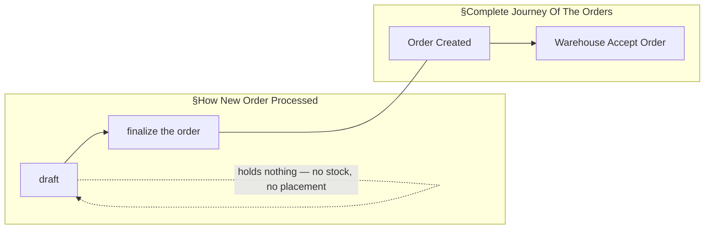
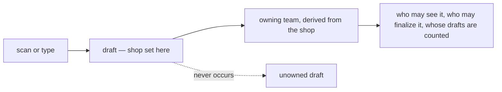
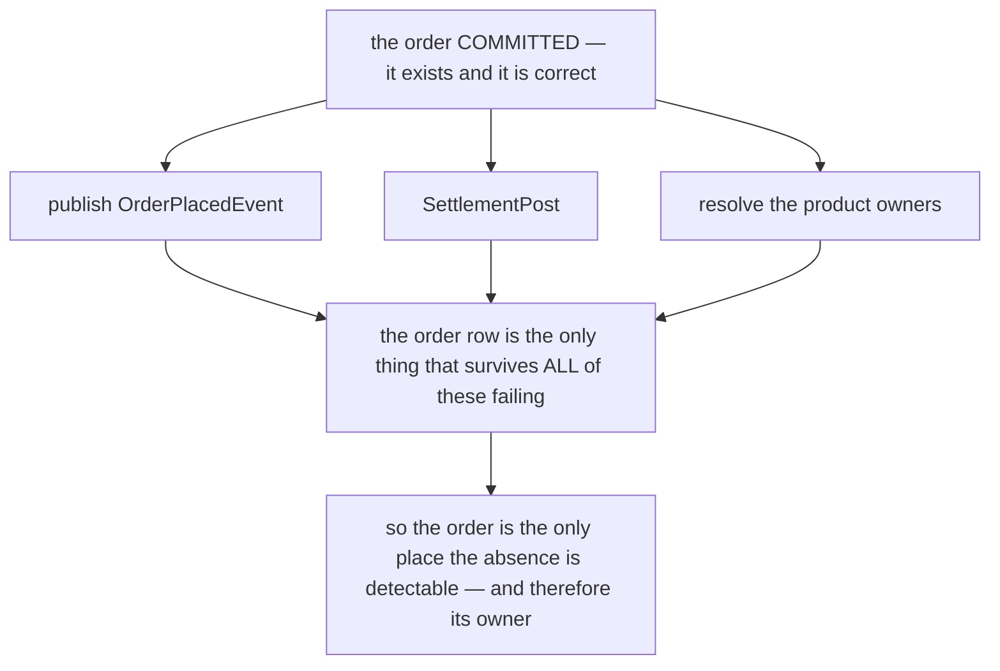

# Decisions — `order_context.md`

What the owner settled, recorded before it is acted on. **Append-only** — a decision that is later
reversed is renamed and its references grepped (RULE 12), never quietly edited away.

| decision | what it decided |
| --- | --- |
| [order-created-is-finalize](#order-created-is-finalize) | the two flows share one vertex — `finalize the order` **is** `Order Created` |
| [a-draft-carries-its-shop](#a-draft-carries-its-shop) | a draft has its shop, and therefore its owning team, from the moment it exists |

---

## order-created-is-finalize

> Asked as *"Is `Order Created` the same moment as `finalized`?"* — the seam between §How New Order
> Processed, which ends at *"finalize the order"*, and §Complete Journey Of The Orders, which begins at
> *"Order Created"*. **Owner: yes.**

**The verdict.** They are **one moment under two names**. `finalize` is the act; `Order Created` is the
state it produces. There is no gap between them and nothing happens in between.

**The spec this makes buildable.**

| | |
| --- | --- |
| **before** | a **draft**. Facts only — marketplace, warehouse, shipping, customer, **external** product info. No stock, no rack placement. *(§Order Draft)* |
| **at** | **one atomic act.** Map each external SKU to our product · resolve each line's owner · commit stock · write the money · publish `Order Created`. All of it, or none. |
| **after** | the journey. The order is the warehouse's to accept. |
| **therefore** | **finalize may REFUSE.** Availability seen while drafting can go stale, and every check runs here — so a refusal is an ordinary outcome, not an error path. |

**What it closes.** The seam is gone, so *"when is stock committed?"* has one answer: **at finalize, which
is creation**. The words *"at creation"* are no longer ambiguous, and the diagrams now join.

**What it leaves open.** Only the **money** half of the same question — whether a draft posts a ledger
entry or trips the debt threshold, the shared lock or the reserve. §Order Draft names two physical things
and no financial one. See [Question 4](./context_clarify.md#question).

---

## a-draft-carries-its-shop

> Asked as *"Does a draft carry its shop?"* — the §Responsbility list names marketplace, warehouse,
> shipping, customer and external product info, and not the shop. **Owner: yes.**

**The verdict.** A draft carries its **shop** from the moment it exists. Since a shop belongs to a selling
team, a draft therefore has an **owning team** from the moment it exists. **There is no unowned draft.**

**Why it matters more than it looks.** Every other rule about a draft needs a team to point at: which
team's list it appears in, who may open it, whose [debt threshold](../balance/context_clarify.md#debt-threshold-limits-liability)
would be consulted if one ever were, and who is accountable for a bad one. *"Unowned"* is a state nothing
else in this system can handle, and this decision means it never arises.

**The spec.** `shop` is set at draft creation — the scanner knows which storefront it read, and a person
typing one picks it. A draft with no shop is refused at creation, not carried and resolved later.

**What it closes.** Critique 15, deleted from the clarify file. **What it does not touch:** the shop is not
in the owner's §Responsbility list, so the list and this decision have to be read together until the
list gains it.

---

## ensuring-an-order-is-whole-is-order-services-job

> Owner, in chat (2026-09-10) — *"this question should be in order context section, not in settlement,
> for ensure order half success or not its order service responsbility"*.

**The verdict.** Detecting and repairing a **half-succeeded order** belongs to `order_service`. The
question *"how is a half-succeeded order found afterwards"* is asked here, not in the settlement or
architecture clarifies.

### Why the order, and not the consumers

Each downstream service can only see what it **received**. None of them can see what it **should have**
received and did not — settlement cannot enumerate the orders that never opened an account, because it
never learned they existed. **The order row is the one record that survives every one of these failures**,
which makes it both the only detector and the right owner.

### Where the question moved

| from | to |
| --- | --- |
| `technical/architecture/context_clarify.md` Q2 | a pointer |
| `business/settlement/context_clarify.md` Awaiting | a pointer |
| — | **[order Q14](./context_clarify.md#question)** |

### ⚠ What the routing exposed, which the split had hidden

Asked in three places it read as three problems. In one place it is **one gap at three sites**, and the
third is the worst — and had gone unremarked while it sat in settlement's file:

| site | what is lost | does it look like a failure? |
| --- | --- | --- |
| `OrderPlacedEvent` not published | liability never charges the order fee | a log line |
| `SettlementPost` fails | no settlement account opens | a log line ([the-order-commits-without-settlement](../settlement/context_decision.md#the-order-commits-without-settlement) flagged the finding as its own open half) |
| ⛔ **product owners unresolved** | the product fee, permanently | ⛔ **no** — `0` is written and read downstream as *"nobody to pay"*, so a transient catalogue blip is indistinguishable from a legitimately unowned line |

### ⛔ What is NOT decided by this

**How** the finder works. The recommendation in [order Q14](./context_clarify.md#question) is a nullable
timestamp per leg on the order's own row (`WHERE settlement_posted_at IS NULL`), chosen because it needs
no RPC from another service and over-reports only in the safe direction — a false positive costs one
idempotent retry. **That is a recommendation, not this decision.**

⚠ And it carries one precondition the stamp alone does not meet: `0` must stop meaning both *unresolved*
and *nobody to pay*, or the finder reports every legitimate case forever.
