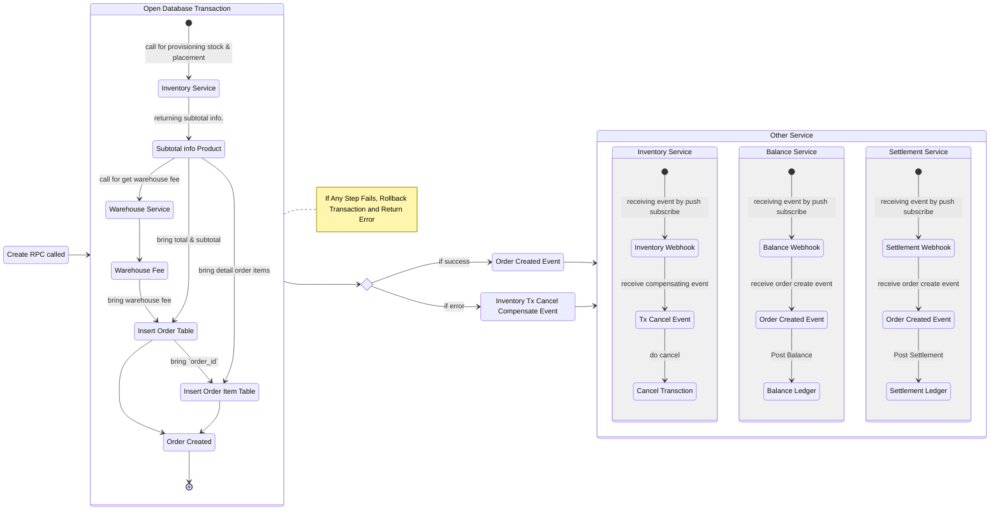

# Inside Order Creation.

```mermaid
stateDiagram-v2
direction LR
state "Create RPC called" as rpc
state create_err <<choice>>

rpc-->tx

tx: Open Database Transaction

note right of tx
    If Any Step Fails, Rollback Transaction and Return Error 
end note

state tx {
    direction TB

    

    state "Order Created" as create
    state "Insert Order Table" as ordtable
    state "Insert Order Item Table" as orditem
    state "Warehouse Fee" as whfee
    state "Subtotal info Product" as sub

    state "Inventory Service" as inv
    state "Warehouse Service" as wh

    [*]-->inv: call for provisioning stock & placement 
    inv-->sub: returning subtotal info.
    sub-->wh: call for get warehouse fee
    
    wh-->whfee

    whfee-->ordtable: bring warehouse fee
    sub-->ordtable: bring total & subtotal
    ordtable-->orditem: bring `order_id`
    sub-->orditem: bring detail order items
    
    ordtable-->create
    orditem-->create
    create-->[*]

}

srv: Other Service
state srv {

    invsrv: Inventory Service
    state invsrv {
        state "Inventory Webhook" as invwebhook
        state "Tx Cancel Event" as evtcom
        state "Cancel Transction" as txcancel

        [*]-->invwebhook: receiving event by push subscribe
        invwebhook-->evtcom: receive compensating event
        evtcom-->txcancel: do cancel
    }

    balance: Balance Service
    state balance {
        state "Balance Webhook" as bwebhook
        state "Order Created Event" as bocreate
        state "Balance Ledger" as b

        [*]-->bwebhook: receiving event by push subscribe
        bwebhook-->bocreate: receive order create event
        bocreate-->b: Post Balance

    }

    

    settle: Settlement Service
    state settle {
        state "Settlement Webhook" as swebhook
        state "Order Created Event" as socreate
        state "Settlement Ledger" as s

        [*]-->swebhook: receiving event by push subscribe
        swebhook-->socreate: receive order create event
        socreate-->s: Post Settlement
    }
}

tx-->create_err
state "Order Created Event" as createdevt
state "Inventory Tx Cancel Compensate Event" as cominvevt

create_err-->createdevt: if success
create_err-->cominvevt: if error
createdevt-->srv
cominvevt-->srv

```