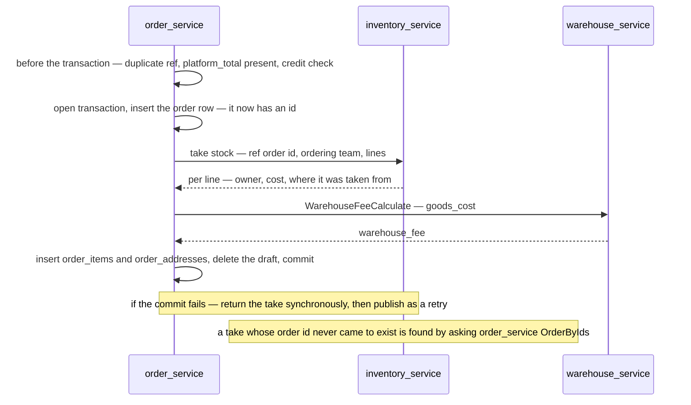
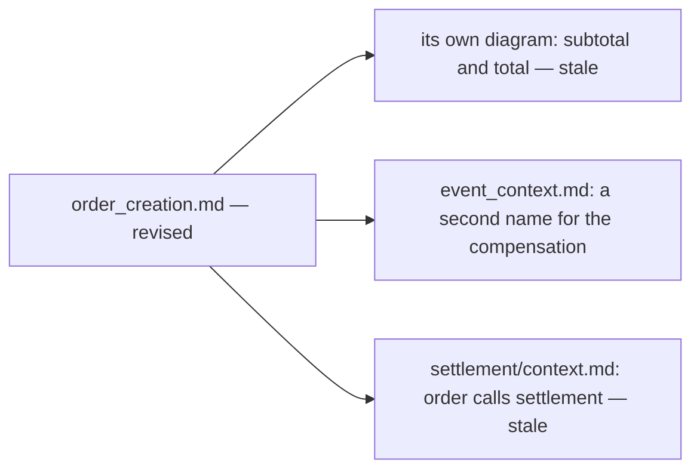

# Clarity — order `order_creation.md`

What [order_creation.md](./order_creation.md) leaves open. **That doc is yours — this one is mine.** Answered
points are deleted, so this file is always the current open set. Decisions land in
[context_decision.md](./context_decision.md).

> **Opened 2026-09-17**, re-examining the whole flow after the owner's correction: *"provision"* was the wrong
> word — **calling inventory takes the stock directly.** That withdraws two of my earlier recommendations (a
> confirm call, and an expiry on unconfirmed holds): a take has nothing to confirm and nothing to expire.

> ✅ **Answered 2026-09-17 and deleted:** what a take reduces ([a-take-reduces-stock-and-placement](./context_decision.md#a-take-reduces-stock-and-placement), its shelf half
> re-routed to inventory) · money as `double` ([rupiah-is-floating-point](./context_decision.md#rupiah-is-floating-point)) · retries ([the-take-is-never-retried](./context_decision.md#the-take-is-never-retried)) · who computes the markup ([inventory-computes-the-markup](./context_decision.md#inventory-computes-the-markup)).

Siblings: [order context](./context_clarify.md) · [event_context](./event_context.md) ·
[warehouse](../warehouse/context_clarify.md) · [inventory](../inventory/context_clarify.md).

---

## Proposed Design

### A take is a stock movement that names its order

| | |
| --- | --- |
| the order row first | the take carries a **real order id** as its reference — the same reason the build inserts first |
| the take commits in inventory | at once, in inventory's own transaction. It is a real movement, not a hold |
| compensation | a **return** movement on the same reference — synchronous first, the event only as a retry |
| an orphaned take | a take whose order never committed. Inventory finds it by asking `OrderByIds` — an RPC, not a join (HARD RULE 3) |
| idempotent | inventory refuses a second take on the same order reference, so a retried call cannot take twice |

### What a take reduces — moved to inventory

Decided: a take **reduces stock and placement**, and shelves, counts and available-versus-on-hand are **inventory's** to
design ([a-take-reduces-stock-and-placement](./context_decision.md#a-take-reduces-stock-and-placement)). The shelf-count
hazard is re-routed to [inventory Q11](../inventory/context_clarify.md#question).

---

## Critique

| | Problem | → Recommend |
| --- | --- | --- |
| **a-timed-out-take-cannot-be-named** | the take is never retried ([the-take-is-never-retried](./context_decision.md#the-take-is-never-retried)), but a call can time out after inventory committed — the order fails, the stock is gone, and the request carries nothing the compensation could name | the take carries a reference the order holds **before** calling, so the compensation can return it without the response |
| **one-line-many-batches** | FIFO can draw one line from two batches at different costs, so a single `unit_cost` × `qty` only approximates `total` | `total` is authoritative; `unit_cost` is informational |
| **team-id-is-ambiguous** | `ProductItem.team_id` could be the product's **owner** or the **ordering** team, and inventory needs both — own-or-cross and the reserve check are decided against the orderer | name them: `owner_team_id` per line, `team_id` (the orderer) on the request |
| **the-checks-are-not-drawn** | nothing checks the duplicate ref, a present `platform_total` or the debt threshold before stock is taken | a pre-transaction block — see the sequence |
| **the-draft-delete-is-outside-the-transaction** | *"Delete Draft Order"* hangs off `if success`, after the commit | delete inside the transaction — same service, same database |
| **the-fee-call-is-inside-the-transaction** | `WarehouseFeeCalculate` holds the order's transaction open across a network call | acceptable, since its basis only exists after the take — but it is a pure calculation, so reading the rate before the transaction and computing locally removes the call |

---

## Question

### which-team-is-team-id
Is `ProductItem.team_id` the product's owner or the ordering team? **→ Both are needed**, named apart.

---

# Contradiction

## the-diagram-still-names-the-old-totals

*"Subtotal info Product"* and *"bring total & subtotal"* (lines 26, 32, 38) — while §Table That Must Have in
[context.md](./context.md) replaced both with `goods_cost` and `total_cost`
([the-warehouse-fee-is-a-percentage-of-the-goods](./context_decision.md#the-warehouse-fee-is-a-percentage-of-the-goods)).
**Which is wrong:** the diagram. **→ Recommend** the take returns lines, the order sums `goods_cost`, the fee is
taken on it, and `total_cost = goods_cost + warehouse_fee`.

## the-compensation-event-has-two-names

*"Inventory Tx Cancel Compensate Event"* (line 90) and `InventoryTxCancel` in
[event_context.md](./event_context.md). **→ Recommend** one name, as a fact — the take was **returned** because
the order was never created.

## settlement-subscribes-here-and-is-called-in-its-own-doc

Settlement is a push subscriber of *Order Created Event* here (lines 76–85), while
[settlement/context.md](../settlement/context.md) §Type `initial_total` says *"`order_service` calling -->
`settlement_service`"*. **→ Recommend** the settlement doc changes, and its reversal is recorded there.

