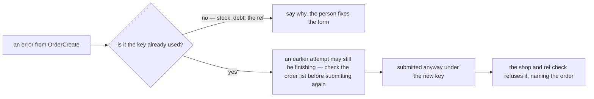
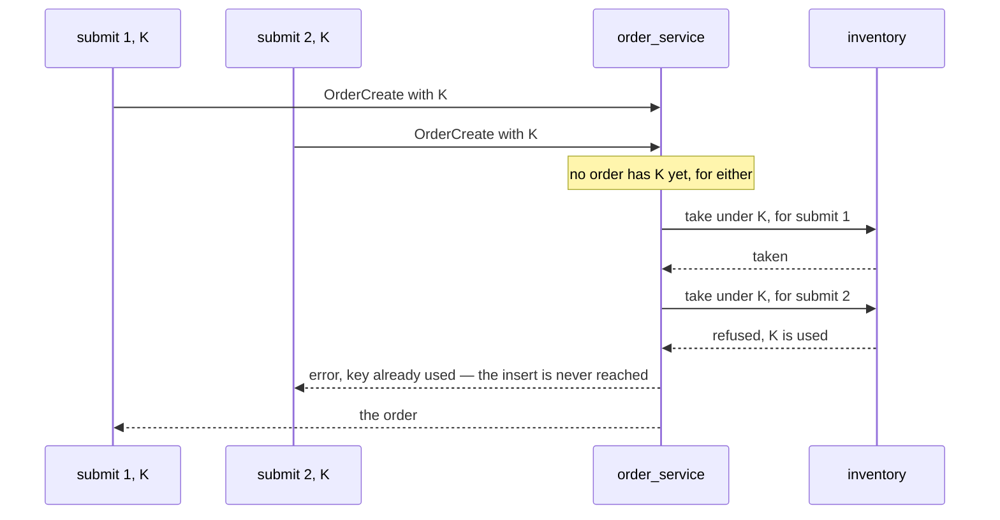
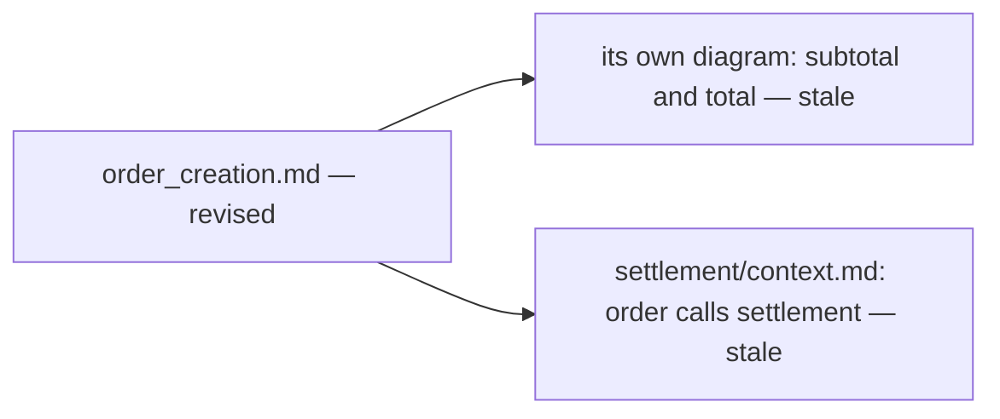

# Clarity — order `order_creation.md`

What [order_creation.md](./order_creation.md) leaves open. **That doc is yours — this one is mine.** Answered
points are deleted, so this file is always the current open set. Decisions land in
[context_decision.md](./context_decision.md).

> **Opened 2026-09-17**, re-examining the whole flow after the owner's correction: *"provision"* was the wrong
> word — **calling inventory takes the stock directly.** That withdraws two of my earlier recommendations (a
> confirm call, and an expiry on unconfirmed holds): a take has nothing to confirm and nothing to expire.

> ✅ **Answered 2026-09-17 and deleted:** what a take reduces ([a-take-reduces-stock-and-placement](./context_decision.md#a-take-reduces-stock-and-placement), its shelf half
> re-routed to inventory) · money as `double` ([rupiah-is-floating-point](./context_decision.md#rupiah-is-floating-point)) · retries ([the-take-is-never-retried](./context_decision.md#the-take-is-never-retried)) · who computes the markup ([inventory-computes-the-markup](./context_decision.md#inventory-computes-the-markup)).

> 🔄 **Re-examined 2026-10-12 — the owner added an idempotency key**
> ([the-frontend-mints-the-idempotency-key](./context_decision.md#the-frontend-mints-the-idempotency-key)) and then
> `orders.idempotency_id` ([the-order-stores-its-idempotency-key](./context_decision.md#the-order-stores-its-idempotency-key)).
> ✅ It answers `a-timed-out-take-cannot-be-named` — a timeout publishes the cancel by key. 🔄 It replaces my
> order-row-first proposal, and the owner's *"if we call inventory service and timeout, we can publish cancel inv
> transaction"* withdrew my own replay spec, which was what let a resend sell stock twice.
> ✅ **Answered the same day, all three as recommended, and deleted:**
> [the-idempotency-key-is-unique](./context_decision.md#the-idempotency-key-is-unique) ·
> [inventory-takes-a-key-once](./context_decision.md#inventory-takes-a-key-once) ·
> [a-key-is-spent-by-any-answer](./context_decision.md#a-key-is-spent-by-any-answer).
> 🆕 **Two more found on a second look the same day.** ✅ `the-cancel-finds-the-take-by-key` is answered as
> recommended and deleted — [every-release-goes-by-the-key](./context_decision.md#every-release-goes-by-the-key).

> 🔄 **Re-examined 2026-10-15 — the owner edited both docs.** ✅ Three contradictions resolved and deleted:
> `the-table-still-says-idempotency-id` (the column is `idempotency_key` now) · `the-key-reached-the-diagram-and-nothing-else`
> (`OrderTransactionCreateRequest` carries `idempotency_key`; the two decision sentences were already amended by the later
> decisions' *What it amends*) · `the-compensation-event-has-two-names` — decided as
> [the-compensation-event-is-inventory-tx-cancel](./context_decision.md#the-compensation-event-is-inventory-tx-cancel).
> 🆕 The form's loop was proposed — and drawn by the owner the same day: [the-form-locks-until-it-is-answered](./context_decision.md#the-form-locks-until-it-is-answered).
> ⛔ **Found while summarising the key:** two decisions of 2026-10-12 disagree about two submits in the same second —
> [Contradiction](#a-same-key-resend-never-reaches-the-unique-index).
> ⚠ **Corrected:** this file's key table was headed *"as decided"* while its format row — a UUID — and *"the server never
> invents one"* were only ever my proposal. Both are now marked as proposals.
> ✅ **Answered later the same day and deleted:** the owner drew the loop into the frontend box as proposed —
> [the-form-locks-until-it-is-answered](./context_decision.md#the-form-locks-until-it-is-answered). One part did not make
> the diagram: [key-already-used-gets-its-own-message](#key-already-used-gets-its-own-message).

Siblings: [order context](./context_clarify.md) · [event_context](./event_context.md) ·
[warehouse](../warehouse/context_clarify.md) · [inventory](../inventory/context_clarify.md).

---

## Proposed Design

### The key, end to end

Decided except where a row says *proposed*.

```mermaid
sequenceDiagram
  participant F as frontend
  participant O as order_service
  participant I as inventory_service
  F->>F: open the form, mint K
  F->>O: OrderCreate with K
  O->>O: an order already has idempotency_key K? return it, take nothing
  O->>O: before the transaction — duplicate ref, platform_total present, credit check
  O->>I: take stock with K — ordering team, lines
  I-->>O: per line — owner, cost, where it was taken from
  O->>O: fee, insert orders with K, order_items, order_addresses, delete the draft, commit
  O-->>F: the order, and K is spent
  Note over O,I: on failure or timeout — publish InventoryTxCancel with K, inventory releases the take under K
  Note over O,I: later, Order Cancel carries K too — the same release
```

| | |
| --- | --- |
| format | ⚠ **proposed, never decided** — a UUID from `crypto.randomUUID()`, **required** on the request and checked by `protovalidate`, so the server never invents one: a create with no key has nothing to name its take by |
| on the order | `orders.idempotency_key`, UNIQUE — [the-order-stores-its-idempotency-key](./context_decision.md#the-order-stores-its-idempotency-key), [the-idempotency-key-is-unique](./context_decision.md#the-idempotency-key-is-unique) |
| the take | one take per K, ever — [inventory-takes-a-key-once](./context_decision.md#inventory-takes-a-key-once) |
| spent | by any answer — [a-key-is-spent-by-any-answer](./context_decision.md#a-key-is-spent-by-any-answer) |
| the release | one path, by K, for `InventoryTxCancel` and the Order Cancel — [every-release-goes-by-the-key](./context_decision.md#every-release-goes-by-the-key) |
| the pre-transaction checks | ⚠ **proposed** — [the-checks-are-not-drawn](#critique) |
| the resend shortcut | ⚠ open — matched on K alone today: [a-key-returns-only-its-own-teams-order](#a-key-returns-only-its-own-teams-order) |

### key already used, told apart

For [key-already-used-gets-its-own-message](#key-already-used-gets-its-own-message). A resend that arrives while the first
attempt is still running is refused by inventory ([Contradiction](#a-same-key-resend-never-reaches-the-unique-index)) — and
the first attempt may still commit. A plain error invites the person to submit again.

```mermaid
flowchart LR
  E["an error from OrderCreate"] --> Q{"is it the key already used?"}
  Q -->|"no — stock, debt, the ref"| M1["say why, the person fixes the form"]
  Q -->|"yes"| M2["an earlier attempt may still be finishing — check the order list before submitting again"]
  M2 --> S["submitted anyway under the new key"]
  S --> R["the shop and ref check refuses it, naming the order"]
```

| | |
| --- | --- |
| the contract | `OrderCreate` returns the refusal as its own error — `ALREADY_EXISTS` with a reason the form can read — not a generic failure |
| the form | the message above, and a link to the order list. The key is still spent — a new one is minted, as decided |
| what stops a double order | the shop + ref check, which is why [one-uniqueness-check-covers-drafts-and-orders](./context_clarify.md#one-uniqueness-check-covers-drafts-and-orders) needs its index |

### What a take reduces — moved to inventory

Decided: a take **reduces stock and placement**, and shelves, counts and available-versus-on-hand are **inventory's** to
design ([a-take-reduces-stock-and-placement](./context_decision.md#a-take-reduces-stock-and-placement)). The shelf-count
hazard is re-routed to [inventory Q11](../inventory/context_clarify.md#question).

---

## Critique

| | Problem | → Recommend |
| --- | --- | --- |
| **one-line-many-batches** | FIFO can draw one line from two batches at different costs, so a single `unit_cost` × `qty` only approximates `total` | `total` is authoritative; `unit_cost` is informational |
| **team-id-is-ambiguous** | `TransactionItem.team_id` could be the product's **owner** or the **ordering** team, and inventory needs both — own-or-cross and the reserve check are decided against the orderer | name them: `owner_team_id` per line, `team_id` (the orderer) on the request |
| **the-checks-are-not-drawn** | nothing checks the duplicate ref, a present `platform_total` or the debt threshold before stock is taken | a pre-transaction block — see the sequence |
| **the-draft-delete-is-outside-the-transaction** | *"Delete Draft Order"* hangs off `if success`, after the commit | delete inside the transaction — same service, same database |
| **the-fee-call-is-inside-the-transaction** | `WarehouseFeeCalculate` holds the order's transaction open across a network call | acceptable, since its basis only exists after the take — but it is a pure calculation, so reading the rate before the transaction and computing locally removes the call |

---

## Question

### which-team-is-team-id
Is `TransactionItem.team_id` the product's owner or the ordering team? **→ Both are needed**, named apart — and the
ordering team goes on `OrderTransactionCreateRequest`, beside the `idempotency_key` it now carries.

### a-key-returns-only-its-own-teams-order
The resend shortcut — *"an order already has K? return it"* — looks up K alone. The key comes from the browser, so a
bug or a hostile caller sending another team's K would be handed **another team's order**. The access check passes,
because it checks the request's `team_id`, not the order found.
**→ Match K and the request's team.** A K found under another team is refused as a used key, never returned. One site
only — the lookup: the unique-violation path never runs
([Contradiction](#a-same-key-resend-never-reaches-the-unique-index)).

### key-already-used-gets-its-own-message
*(successor to [the-form-locks-until-it-is-answered](./context_decision.md#the-form-locks-until-it-is-answered))* Your
loop sends every error down one branch. Is *"key already used"* told apart from the others? It is the one error that can
arrive while the order is still being created.
**→ Yes** — its own error from `OrderCreate`, and a message pointing at the order list — [the design](#key-already-used-told-apart).

---

# Contradiction

## a-same-key-resend-never-reaches-the-unique-index

*(2026-10-15)* Two decisions of the same day, read against one flow:

| [the-idempotency-key-is-unique](./context_decision.md#the-idempotency-key-is-unique) | [inventory-takes-a-key-once](./context_decision.md#inventory-takes-a-key-once) |
| --- | --- |
| *"a unique violation on this column is a resend that lost the race, so it is answered with the order that won"* | *"A second take on a key inventory has already seen … is refused"* — and the take runs **before** the `orders` insert |

Two submits with K in the same second: neither finds an order, because the first has not committed. Both ask inventory,
inventory refuses the second, and it fails **before it reaches the insert**. The unique index never sees it, so *"answered
with the order that won"* cannot happen.

**Which is wrong:** the unique decision's last line — written against a flow where the second submit reached the insert.
**→ Recommend** keeping UNIQUE as the backstop, but a violation is an **error, never an order**. The team match then has one
site, and the second submit's *"key already used"* is what
[key-already-used-gets-its-own-message](#key-already-used-gets-its-own-message) has to answer.

```mermaid
sequenceDiagram
  participant S1 as submit 1, K
  participant S2 as submit 2, K
  participant O as order_service
  participant I as inventory
  S1->>O: OrderCreate with K
  S2->>O: OrderCreate with K
  Note over O: no order has K yet, for either
  O->>I: take under K, for submit 1
  I-->>O: taken
  O->>I: take under K, for submit 2
  I-->>O: refused, K is used
  O-->>S2: error, key already used — the insert is never reached
  O-->>S1: the order
```

## the-diagram-still-names-the-old-totals

*"Subtotal info Product"* and *"bring total & subtotal"* (lines 42, 48, 54) — while §Table That Must Have in
[context.md](./context.md) replaced both with `goods_cost` and `total_cost`
([the-warehouse-fee-is-a-percentage-of-the-goods](./context_decision.md#the-warehouse-fee-is-a-percentage-of-the-goods)).
**Which is wrong:** the diagram. **→ Recommend** the take returns lines, the order sums `goods_cost`, the fee is
taken on it, and `total_cost = goods_cost + warehouse_fee`.

## settlement-subscribes-here-and-is-called-in-its-own-doc

Settlement is a push subscriber of *Order Created Event* here (lines 92–101), while
[settlement/context.md](../settlement/context.md) §Type `initial_total` says *"`order_service` calling -->
`settlement_service`"*. **→ Recommend** the settlement doc changes, and its reversal is recorded there.

```mermaid
flowchart LR
  D["order_creation.md — revised"] --> A["its own diagram: subtotal and total — stale"]
  D --> C["settlement/context.md: order calls settlement — stale"]
```
