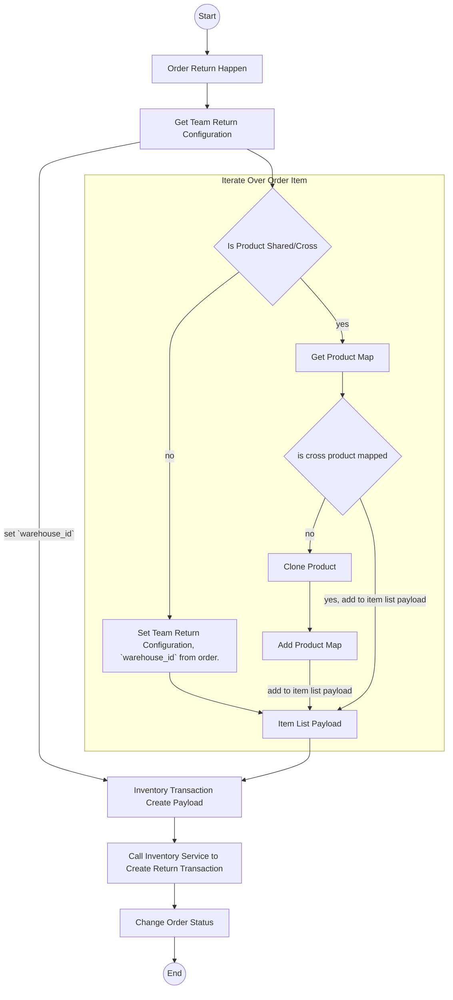
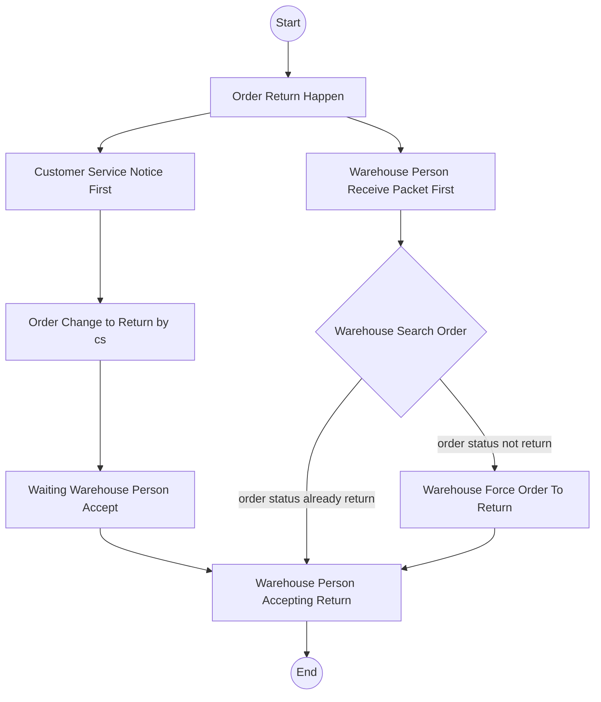

# Order Return Flow.

## General.
1. Team Selling Have Order Return Warehouse Location Configuration.
2. if Order Return Warehouse Location not configured, Selling Team Cannot Create Orders.

## Table Must Have.
1. `team_return_configurations`.

    that have fields:
    - `id` primary key
    - `team_id`, its unique.
    - `warehouse_id`

2. `product_return_maps`

    that have fields:
    - `id` primary key
    - `team_id`, team that have map
    - `shared_product_id`, composite unique with `to_product_id`, shared/cross product 
    - `own_product_id`, product id that owned by `team_id`
    - `warehouse_id`
    - `updated_at`
    - `created_at`

## Order Return Flow.

## Who Change The Returns.

