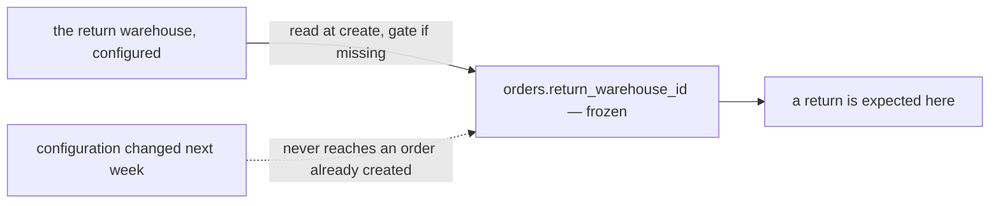

# Clarity — order `order_return.md`

What [order_return.md](./order_return.md) leaves open. **That doc is yours — this one is mine.** Answered points
are deleted, so this file is always the current open set. Decisions land in
[context_decision.md](./context_decision.md).

> **Opened 2026-09-17** with the doc's first two sections: a selling team configures one return warehouse, and
> cannot create orders without one.

Siblings: [order context](./context_clarify.md) · [order_creation](./order_creation_clarify.md) ·
[inventory](../inventory/context_clarify.md).

---

## Proposed Design

### the-return-warehouse-is-frozen-on-the-order

A returned parcel arrives days or weeks after the order was created. If the configuration changes in between,
the order must still say where its return was expected.

| | |
| --- | --- |
| gate | create refuses when no return warehouse is configured — as the doc says |
| frozen | `orders.return_warehouse_id`, copied at create, never updated |
| why | the gate exists so every order knows where a return goes; freezing it is what keeps that true |

---

## Critique

| | Problem | → Recommend |
| --- | --- | --- |
| **the-platform-decides-where-a-parcel-returns** | a courier returns a parcel to the **return address printed on the platform's label**, which is set **per shop** on the platform. A team with three shops may have three return addresses — one configured warehouse per team cannot match all of them, and a parcel arrives at a warehouse that was never told to expect it | configure it **per shop**, and state that it must match the shop's return address on the platform |
| **a-change-reaches-orders-in-transit** | nothing freezes the return warehouse on the order, so changing the configuration silently re-points every return already on its way | freeze it on the order at create — see Proposed Design |
| **any-warehouse-can-be-named** | nothing limits which warehouse a team may name, so returns can be sent to a warehouse that holds none of the team's stock and never agreed to receive them | only a warehouse the team already uses |
| **every-team-stops-at-rollout** | the gate applies to teams that exist today, none of which has a return warehouse configured — on the day it ships, **no team can create an order** | configure a default per team before the gate is switched on |

---

## Question

### per-shop-or-per-team
Is the return warehouse configured per **shop** or per **team**? **→ Per shop** — the platform sets the return
address per shop, and the courier follows the label, not our configuration.

### frozen-on-the-order
Is the return warehouse copied onto the order at create? **→ Yes**, so a change never re-points parcels already
in transit.

### which-warehouses-may-be-named
May a team name any warehouse, or only one it already works with? **→ Only one it works with.**
