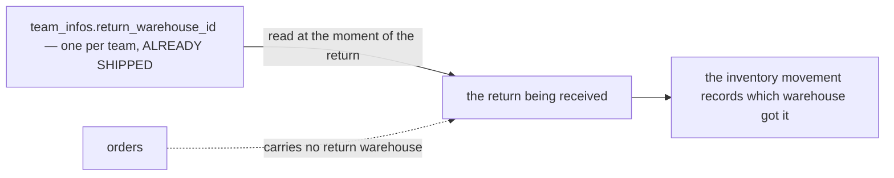
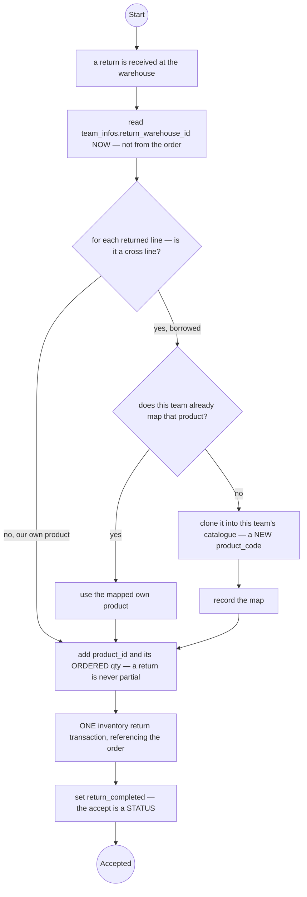
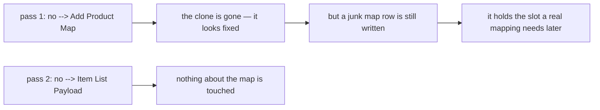
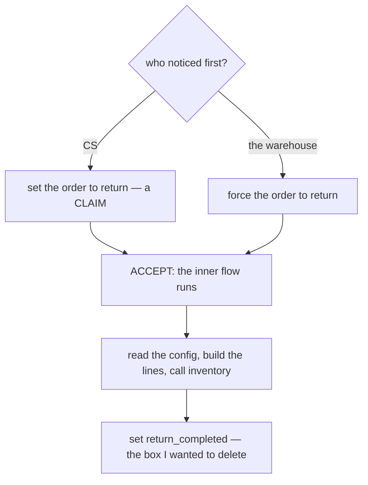

# Clarity — order `order_return.md`

What [order_return.md](./order_return.md) leaves open. **That doc is yours — this one is mine.** Answered points
are deleted, so this file is always the current open set. Decisions land in
[context_decision.md](./context_decision.md).

> **Opened 2026-09-17** with the doc's first two sections: a selling team configures one return warehouse, and
> cannot create orders without one.

> 🔄 **Re-examined 2026-09-21 — the owner added `## Order Return Flow.` and a second table, `product_return_maps`.**
> ✅ **The new diagram parses** (`npm run lint:mermaid`) — nothing to report under RULE 3.
> ⛔ **What is still open in it:** the own-product branch is routed through the cross-product machinery, and the
> flow reads the return warehouse **two contradictory ways in one picture** (✅ now settled — the top box wins).
> ⛔ **And checked against the build this round:** `team_return_configurations` **already exists as a column**, in
> another service — see [the-config-already-ships-elsewhere](#critique).

> 🔄 **The doc moved again while this was being written (14:11).** `Change Order Status` now follows the
> inventory call, so the order no longer stays `shipped` after its goods are back on a shelf.

> ✅ **Answered 2026-09-21 and deleted:** the map's key, its stale column name and its `warehouse_id`
> ([the-map-is-unique-on-its-source](./context_decision.md#the-map-is-unique-on-its-source)) · a map is written once
> ([a-return-map-is-written-once](./context_decision.md#a-return-map-is-written-once)) · a return is never partial,
> so the status is always `return` and no line carries a returned quantity
> ([a-return-is-never-partial](./context_decision.md#a-return-is-never-partial)).
> 🔄 **The second reverses my recommendation and vindicates the doc**: I read the missing per-line quantity as an
> omission, and with the whole order returning it is not one — the ordered quantity **is** the returned quantity,
> so the flow's line-by-line iteration is correct as drawn. ⛔ **One successor**: a parcel that comes back with an
> item missing is now not a return at all, and has no home.

> ✅ **And the cluster's fork is settled** —
> [a-return-may-land-in-another-warehouse](./context_decision.md#a-return-may-land-in-another-warehouse). A return
> need not come back where it shipped from, so the configuration and the gate stay real.
> ⛔ **The stock drift is ACCEPTED, not solved**: every return moves a unit from a fulfilling warehouse to the
> return warehouse and nothing moves it back. One successor: who notices the drift.

> ✅ **And the grain is settled: per TEAM, not per shop** —
> [the-return-warehouse-is-per-team](./context_decision.md#the-return-warehouse-is-per-team). 🔄 **This reverses my
> recommendation.** I argued the platform prints the return address per shop, so three shops could mean three
> addresses; the owner's shops resolve to one building, which would have made a `shops.return_warehouse_id`
> override permanently NULL. ✅ **The whole configuration is therefore already built** — `team_infos.return_warehouse_id` —
> and what remains is an **editor** and a **reader**. ⚠ Recorded with its **reversal trigger**: the day a
> shop is set to return elsewhere on a platform, this decision is renamed and the override is added.

> ✅ **And the order carries nothing about returns** —
> [the-return-warehouse-is-read-when-the-return-happens](./context_decision.md#the-return-warehouse-is-read-when-the-return-happens),
> which also makes the flow's top box the authoritative one. 🔄 **A second reversal of mine, and my argument was
> the weaker one**: `orders.warehouse_id` is frozen because it records a **fact**, while a return warehouse on the
> order would have frozen an **expectation** — and the fact is recorded anyway by the inventory movement.
> ⛔ **And its successor is settled too** — [a-stale-return-location-is-accepted](./context_decision.md#a-stale-return-location-is-accepted).
> The configuration is trusted over the printed label, because a return is a repetitive job and a form that asks
> *"which warehouse?"* asks a question whose answer never changes.
> ⛔ **The scanner proposal is withdrawn** — it assumed the receiving warehouse creates the return, which was
> never established.

> 🆕 **The owner added `## Who Change The Returns.` (2026-09-21), and it answers who creates a return with a THIRD
> option: BOTH** ([both-cs-and-the-warehouse-can-return-an-order](./context_decision.md#both-cs-and-the-warehouse-can-return-an-order)).
> ✅ Its diagram parses. ⛔ **A return is now TWO acts** — somebody sets `return`, and the warehouse person
> **accepts** — and the accept is the only step at which anybody holds the goods.

> 🆕 **And the owner added a NINTH STATUS, `return_completed` (2026-09-21)** —
> [the-accept-is-the-status-return-completed](./context_decision.md#the-accept-is-the-status-return-completed),
> which supersedes [the eight-status decision](./context_decision.md#superseded-the-order-has-eight-statuses).
> 🔄 **It reverses my recommendation** that the accept be a return RECORD, and ✅ **it dissolves a contradiction I
> had raised an hour earlier** — the inner flow’s `Change Order Status` box, which I wanted deleted as redundant,
> is the box that sets `return_completed`. The two sections were different ALTITUDES, not rival sequences
> ([resolved](#resolved-the-two-return-sections-order-the-steps-differently)).

> ✅ **And §Order Return Flow is now CORRECT on the own branch** —
> [an-own-line-never-touches-the-map](./context_decision.md#an-own-line-never-touches-the-map). Fixed in two
> passes: `setretconf --> prodlink` became `setretconf --> mapadd` (the clone gone, a junk map WRITE remaining),
> then `setretconf --> itemlist`. ⚠ The intermediate state is recorded because **a half-fixed branch reads as a
> fixed one** ([resolved](#resolved-the-own-line-goes-through-the-cross-product-machinery)).
> ⛔ **What survives:** the `Set Team Return Configuration, warehouse_id from order` box is still on the branch,
> and is stale twice over — the warehouse comes from the configuration, and the diagram’s own first box already
> read it.

Siblings: [order context](./context_clarify.md) · [order_creation](./order_creation_clarify.md) ·
[inventory](../inventory/context_clarify.md) · [product](../product/context_clarify.md).

---

## Proposed Design

### the-return-warehouse-as-decided

✅ Settled in three answers: **one per team**, **read when the return happens**, and it **need not be the
warehouse that shipped the order**. The order carries nothing about returns.

| | | |
| --- | --- | --- |
| the configuration | `team_infos.return_warehouse_id` | ✅ exists |
| a `team_return_configurations` table | not built | ⚠ the owner's §Table Must Have still asks for it |
| `shops.return_warehouse_id` | not built | [the-return-warehouse-is-per-team](./context_decision.md#the-return-warehouse-is-per-team) |
| `orders.return_warehouse_id` | not built | [the-return-warehouse-is-read-when-the-return-happens](./context_decision.md#the-return-warehouse-is-read-when-the-return-happens) |
| **an editor** | ⛔ **missing** — no screen sets the column | this is what blocks the gate |
| **a reader** | ⛔ **missing** — no server reads it | |
| the gate | create refuses a team with no configuration | still [where it lives](#the-gate-is-on-the-order-not-the-config) is open |

### the-return-flow-corrected

One change left to the owner’s diagram: an own line never touches the map. The warehouse is read once, from the
team configuration — the flow’s own first box.

### the-map-as-decided

✅ Settled — [the-map-is-unique-on-its-source](./context_decision.md#the-map-is-unique-on-its-source) and
[a-return-map-is-written-once](./context_decision.md#a-return-map-is-written-once). Kept here as the spec the
owner's §Table Must Have still has to be amended to (RULE 7b — reported, never edited).

| column | | |
| --- | --- | --- |
| `team_id` | the team that owns the map | |
| `shared_product_id` | the borrowed product | |
| `own_product_id` | the clone in this team's catalogue | `to_product_id` never existed |
| `created_at` / `updated_at` | | `updated_at` can only mirror `created_at` — the row is written once |
| **unique** | `(team_id, shared_product_id)` | the SOURCE, not the pair |
| ~~`warehouse_id`~~ | **dropped** | a map is a catalogue fact, not a location |

---

## Critique

| | Problem | → Recommend |
| --- | --- | --- |
| **the-config-already-ships-elsewhere** | `team_return_configurations` duplicates [`team_infos.return_warehouse_id`](../../../backend/services/team_service/db_migrations/00001_create_teams.sql), shipped in `team_service` beside its outbound twin `default_warehouse_id`. Two rows, two editors, and nothing says which is true when they differ | **no new table.** Keep the column, read it by RPC (HARD RULE 3) |
| **the-gate-contradicts-its-own-twin** | the twin's migration argues the opposite deliberately — *"It is a DEFAULT, not a rule… a fallback applied server-side would quietly undo that refusal"*. The outbound warehouse is named BY THE ORDER and refused if absent, while the doc gates on a CONFIG ROW | same shape for both: the order names it, create refuses when absent |
| **the-own-branch-still-reads-the-order-for-its-warehouse** | `setretconf["Set Team Return Configuration, warehouse_id from order."]` survives the change, and [the-return-warehouse-is-read-when-the-return-happens](./context_decision.md#the-return-warehouse-is-read-when-the-return-happens) settled that the warehouse comes from the CONFIGURATION. `retconf` at the top already has it | delete the box — for an own line there is nothing left for it to do |
| **a-clone-needs-a-code-nobody-generates** | there is no clone RPC ([product_v1](../../../backend/services/product_service/product_v1/) has create/update/delete/restore and nothing else), and the code is now composed and globally unique ([the-code-is-composed-from-the-team-code](../product/context_decision.md#the-code-is-composed-from-the-team-code)) — so a clone **cannot** copy the lender's code | the clone takes the borrowing team's prefix and a generated tail, and the map is what preserves the link |
| **the-return-warehouse-is-a-SECOND-warehouse** | the order is fulfilled from `orders.warehouse_id` and returns to the configured one. Stock is keyed `(warehouse_id, product_id)` ([stock_levels](../../../backend/services/inventory_service/db_migrations/00001_create_inventory.sql)), so a unit taken from **X** comes back onto **Y**'s shelf — two different piles. Nothing in the design says that is intended, and over months every return drains the fulfilling warehouses into the return one | say plainly whether a return may land in a warehouse the order did not ship from. If yes, the drift is a real operational cost and needs a transfer back. If no, the return warehouse must **be** the fulfilling warehouse and the whole configuration collapses to a validation |
| **a-return-warehouse-may-have-no-terms** | `liability_terms` means *no row = charge nothing* ([00002_create_liability_terms.sql](../../../backend/services/liability_service/db_migrations/00002_create_liability_terms.sql)). A team names warehouse Y for returns, Y has no terms row for that team — so Y receives, inspects and stores returned goods **for free, silently**, for a team it has no commercial relationship with | the named warehouse must have a terms row, which is the same constraint as [which-warehouses-may-be-named](#which-warehouses-may-be-named) approached from the money side |
| **any-warehouse-can-be-named** | nothing limits which warehouse a team may name, so returns can be sent somewhere holding none of its stock and under no obligation to receive them | only a warehouse the team has a `liability_terms` pair with — that relation already means "works with" |
| **every-team-stops-at-rollout** | every `return_warehouse_id` is NULL today, **no screen sets one**, and no server reads one. Ship the gate as written and no team can create an order | the editor and a backfill first, the gate second — two commits, never one |
| **the-accept-is-not-in-the-other-flow** | §Order Return Flow moves stock and THEN sets the status. §Who Change The Returns sets the status FIRST and ends at an accept the other diagram does not contain. The two sections order the same three steps differently — see [Contradiction](#the-two-return-sections-order-the-steps-differently) | the ACCEPT is the moment stock moves. §Order Return Flow is what happens inside it, not a rival sequence |
| **the-money-still-does-not-move** | the flow ends at status. COGS is not reversed, and a borrowed line's payable to its owner still stands — while the unit has just become the borrower's own by clone | the money is the same pass as the status — see [the order clarify's Awaiting](./context_clarify.md#awaiting) |

---

## Question

### the-gate-is-on-the-order-not-the-config
Does create refuse because the TEAM has no configuration, or because the REQUEST names no return warehouse?
**→ The request** — it matches `default_warehouse_id` and cannot be undone by a silent server-side fallback.

### which-warehouses-may-be-named
May a team name any warehouse, or only one it already works with? **→ Only one it works with**, which
`liability_terms` already records. ⚠ Sharper now that
[a-return-may-land-in-another-warehouse](./context_decision.md#a-return-may-land-in-another-warehouse) is
decided: the receiving warehouse is a **real second counterparty**, not a formality.

### who-moves-the-drifted-stock-back
*(successor to [a-return-may-land-in-another-warehouse](./context_decision.md#a-return-may-land-in-another-warehouse))*
Every return moves a unit from a fulfilling warehouse to the return warehouse, permanently. Who notices, and who
moves it back? **→ Nobody automatically** — but the selling team needs a screen that shows *where my stock
actually is versus where I sell from*, or the drift is invisible until a warehouse cannot fulfil. A transfer
already has to exist for other reasons, so this is a **report**, not a new mechanism.

### what-bounds-a-forced-return
*(new)* *"Warehouse Force Order To Return"* lets the warehouse move an order to `return` from wherever it was.
[context.md](./context.md)'s status diagram allows it only from `shipped`, `problem` and `completed`. May a
warehouse force a `pending` or `processed` order — one whose stock was never even picked? **→ No.** Force means
*skip the CS step*, not *skip the status rules*: the parcel is in the person's hands, so the order can only have
been one that left. ⚠ If it can be forced from anywhere, say so, because it makes every earlier transition
optional.

### a-claimed-return-that-never-arrives
*(new)* CS sets `return`, and the parcel is lost on its way back. The order sits in `return` forever, the stock
never comes back, and nothing distinguishes it from a return sitting in a queue. **→ It is `lost`** — but
[lost-is-final](./context_decision.md#lost-is-final) says `lost` never moves again, and
[context.md](./context.md)'s diagram has no `return --> lost` edge. Either the edge is added or the claim needs
an expiry.

### does-the-accept-record-where-it-was-accepted
*(new — and it is new EVIDENCE, not a re-litigation of
[a-stale-return-location-is-accepted](./context_decision.md#a-stale-return-location-is-accepted))* That decision
rested on there being nobody in the receiving building at the keyboard. §Who Change The Returns puts one there:
the **warehouse person accepting** is holding the goods, in the building. **→ Keep reading the configuration for
the form** — the ops argument is unchanged and the operator still picks nothing — **but record the accepting
person's warehouse on the return record**, so the rare mismatch is visible afterwards rather than invisible
forever. That costs a column, not a decision.

### who-names-a-cloned-product
A clone cannot reuse the lender's `product_code` now that it is composed and globally unique. Who generates the
borrowing team's part, and what else does the clone inherit — price, categories, images, `cross_markup`,
`is_private`? **→ Generated tail, catalogue attributes copied, all money and sharing fields reset.**

### a-short-delivered-parcel-has-no-home
*(successor to [a-return-is-never-partial](./context_decision.md#a-return-is-never-partial))* A parcel comes back
with two of its three items. It is not a return, because a return is the whole order — and it is not `completed`
either. **→ `problem`**, which already exists and already means *"something went wrong in transit"*, with the
missing goods written off rather than returned to stock. Is that where it goes, or does it need its own path?

### return_user_id-is-unread
`team_infos.return_user_id` sits beside the warehouse column, written by nobody and read by nobody. Is a return
addressed to a **person** as well as a building? **→ Say if it is dead, and it gets dropped.**

## resolved-the-own-line-goes-through-the-cross-product-machinery

✅ **RESOLVED 2026-09-21, in two passes** —
[an-own-line-never-touches-the-map](./context_decision.md#an-own-line-never-touches-the-map). The own branch now
goes `is cross --> no --> Set Team Return Configuration --> Item List Payload`, agreeing with
[context.md](./context.md) §Stock Ownership When Order Return.

⚠ **The intermediate state is why this stays recorded.** The first pass moved the branch from `Get Product Map`
to `Add Product Map` — the clone disappeared, so it *looked* fixed, while a write remained that would have put a
self-referential row in `product_return_maps` and **occupied the unique slot** a genuine mapping needed later.
**A half-fixed branch reads as a fixed one**, and the damage it does is invisible until the first real cross
return of that product months afterwards.

⚠ **The pattern:** the same return rule was drawn in **two** files and only one was revised — the same way
§Complete Journey went stale against the status diagram
([the-journey-still-sets-the-old-statuses](./context_clarify.md#the-journey-still-sets-the-old-statuses)).

## resolved-the-two-return-sections-order-the-steps-differently

✅ **RESOLVED by the ninth status, hours after it was raised** — and my recommendation was wrong.

I reported that §Order Return Flow moves stock and *then* changes the status, while §Who Change The Returns
changes the status and *then* accepts, and that only one contained the accept. **→ I recommended deleting the
inner flow's `Change Order Status` box as redundant.** It is not redundant: with
[the-accept-is-the-status-return-completed](./context_decision.md#the-accept-is-the-status-return-completed),
that box sets **`return_completed`**, and the two sections stop competing — one is the outer flow, the other is
what happens inside its final step.

⚠ **The lesson, per HARD RULE 11:** two diagrams disagreeing is not always one of them being stale. Here they
were describing **different altitudes** of the same act, and the missing piece was a status neither of them had
yet. **Deleting a box because it looks duplicated is how the newer statement gets destroyed** — the right move
was the one the owner made, adding the state that made both readings true at once.
