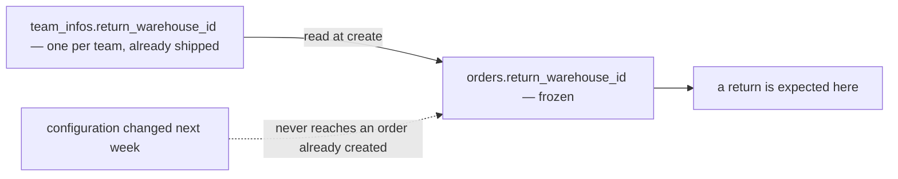
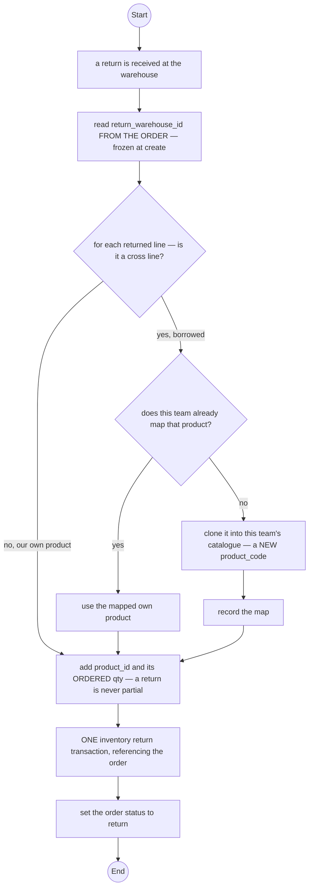
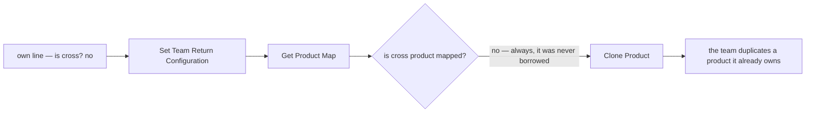

# Clarity — order `order_return.md`

What [order_return.md](./order_return.md) leaves open. **That doc is yours — this one is mine.** Answered points
are deleted, so this file is always the current open set. Decisions land in
[context_decision.md](./context_decision.md).

> **Opened 2026-09-17** with the doc's first two sections: a selling team configures one return warehouse, and
> cannot create orders without one.

> 🔄 **Re-examined 2026-09-21 — the owner added `## Order Return Flow.` and a second table, `product_return_maps`.**
> ✅ **The new diagram parses** (`npm run lint:mermaid`) — nothing to report under RULE 3.
> ⛔ **What is still open in it:** the own-product branch is routed through the cross-product machinery, and the
> flow reads the return warehouse **two contradictory ways in one picture**.
> ⛔ **And checked against the build this round:** `team_return_configurations` **already exists as a column**, in
> another service — see [the-config-already-ships-elsewhere](#critique).

> 🔄 **The doc moved again while this was being written (14:11).** `Change Order Status` now follows the
> inventory call, so the order no longer stays `shipped` after its goods are back on a shelf.

> ✅ **Answered 2026-09-21 and deleted:** the map's key, its stale column name and its `warehouse_id`
> ([the-map-is-unique-on-its-source](./context_decision.md#the-map-is-unique-on-its-source)) · a map is written once
> ([a-return-map-is-written-once](./context_decision.md#a-return-map-is-written-once)) · a return is never partial,
> so the status is always `return` and no line carries a returned quantity
> ([a-return-is-never-partial](./context_decision.md#a-return-is-never-partial)).
> 🔄 **The second reverses my recommendation and vindicates the doc**: I read the missing per-line quantity as an
> omission, and with the whole order returning it is not one — the ordered quantity **is** the returned quantity,
> so the flow's line-by-line iteration is correct as drawn. ⛔ **One successor**: a parcel that comes back with an
> item missing is now not a return at all, and has no home.

> ✅ **And the cluster's fork is settled** —
> [a-return-may-land-in-another-warehouse](./context_decision.md#a-return-may-land-in-another-warehouse). A return
> need not come back where it shipped from, so the configuration, the gate and the freeze all stay real.
> ⛔ **The stock drift is ACCEPTED, not solved**: every return moves a unit from a fulfilling warehouse to the
> return warehouse and nothing moves it back. Two successors opened — who notices the drift, and how a warehouse
> identifies a parcel for an order it never fulfilled.

> ✅ **And the grain is settled: per TEAM, not per shop** —
> [the-return-warehouse-is-per-team](./context_decision.md#the-return-warehouse-is-per-team). 🔄 **This reverses my
> recommendation.** I argued the platform prints the return address per shop, so three shops could mean three
> addresses; the owner's shops resolve to one building, which would have made a `shops.return_warehouse_id`
> override permanently NULL. ✅ **The whole configuration is therefore already built** — `team_infos.return_warehouse_id` —
> and what remains is an editor, a reader, and the order column. ⚠ Recorded with its **reversal trigger**: the day a
> shop is set to return elsewhere on a platform, this decision is renamed and the override is added.

Siblings: [order context](./context_clarify.md) · [order_creation](./order_creation_clarify.md) ·
[inventory](../inventory/context_clarify.md) · [product](../product/context_clarify.md).

---

## Proposed Design

### the-return-warehouse-is-frozen-on-the-order

A returned parcel arrives days or weeks after the order was created. If the configuration changes in between,
the order must still say where its return was expected — the argument `orders.warehouse_id` already won
([00005_order_warehouse.sql](../../../backend/services/selling_service/db_migrations/00005_order_warehouse.sql):
*"what an order says happened must stay what happened"*).

| | |
| --- | --- |
| no new table, no new column | the config is `team_infos.return_warehouse_id`, one per team ([the-return-warehouse-is-per-team](./context_decision.md#the-return-warehouse-is-per-team)) |
| resolved where | the order form, exactly as it resolves `default_warehouse_id` today |
| gate | create refuses a request that names no return warehouse — on the ORDER, not on a config row |
| frozen | `orders.return_warehouse_id`, copied at create, never updated — **the one part still open** |

### the-return-flow-corrected

Two changes to the owner's diagram: an own line never touches the map, and the warehouse is read once, from the
order.

### the-map-as-decided

✅ Settled — [the-map-is-unique-on-its-source](./context_decision.md#the-map-is-unique-on-its-source) and
[a-return-map-is-written-once](./context_decision.md#a-return-map-is-written-once). Kept here as the spec the
owner's §Table Must Have still has to be amended to (RULE 7b — reported, never edited).

| column | | |
| --- | --- | --- |
| `team_id` | the team that owns the map | |
| `shared_product_id` | the borrowed product | |
| `own_product_id` | the clone in this team's catalogue | `to_product_id` never existed |
| `created_at` / `updated_at` | | `updated_at` can only mirror `created_at` — the row is written once |
| **unique** | `(team_id, shared_product_id)` | the SOURCE, not the pair |
| ~~`warehouse_id`~~ | **dropped** | a map is a catalogue fact, not a location |

---

## Critique

| | Problem | → Recommend |
| --- | --- | --- |
| **the-config-already-ships-elsewhere** | `team_return_configurations` duplicates [`team_infos.return_warehouse_id`](../../../backend/services/team_service/db_migrations/00001_create_teams.sql), shipped in `team_service` beside its outbound twin `default_warehouse_id`. Two rows, two editors, and nothing says which is true when they differ | **no new table.** Keep the column, read it by RPC (HARD RULE 3) |
| **the-gate-contradicts-its-own-twin** | the twin's migration argues the opposite deliberately — *"It is a DEFAULT, not a rule… a fallback applied server-side would quietly undo that refusal"*. The outbound warehouse is named BY THE ORDER and refused if absent, while the doc gates on a CONFIG ROW | same shape for both: the order names it, create refuses when absent |
| **the-own-line-is-sent-through-the-map** | `is cross --> no --> Set Team Return Configuration --> Get Product Map`: a product the team already owns looks for a map it can never have, finds none, and is **cloned** — the team duplicates its own catalogue on every return. See [Contradiction](#the-own-line-goes-through-the-cross-product-machinery) | the `no` branch joins the item list directly, as [context.md](./context.md) already draws it |
| **the-warehouse-is-read-twice** | `Get Team Return Configuration` at the top and `Set Team Return Configuration, warehouse_id from order` inside the loop are two different sources for one value, in one picture | read it **once, from the order** — which is what the second box already implies |
| **a-clone-needs-a-code-nobody-generates** | there is no clone RPC ([product_v1](../../../backend/services/product_service/product_v1/) has create/update/delete/restore and nothing else), and the code is now composed and globally unique ([the-code-is-composed-from-the-team-code](../product/context_decision.md#the-code-is-composed-from-the-team-code)) — so a clone **cannot** copy the lender's code | the clone takes the borrowing team's prefix and a generated tail, and the map is what preserves the link |
| **the-return-warehouse-is-a-SECOND-warehouse** | the order is fulfilled from `orders.warehouse_id` and returns to the configured one. Stock is keyed `(warehouse_id, product_id)` ([stock_levels](../../../backend/services/inventory_service/db_migrations/00001_create_inventory.sql)), so a unit taken from **X** comes back onto **Y**'s shelf — two different piles. Nothing in the design says that is intended, and over months every return drains the fulfilling warehouses into the return one | say plainly whether a return may land in a warehouse the order did not ship from. If yes, the drift is a real operational cost and needs a transfer back. If no, the return warehouse must **be** the fulfilling warehouse and the whole configuration collapses to a validation |
| **a-return-warehouse-may-have-no-terms** | `liability_terms` means *no row = charge nothing* ([00002_create_liability_terms.sql](../../../backend/services/liability_service/db_migrations/00002_create_liability_terms.sql)). A team names warehouse Y for returns, Y has no terms row for that team — so Y receives, inspects and stores returned goods **for free, silently**, for a team it has no commercial relationship with | the named warehouse must have a terms row, which is the same constraint as [which-warehouses-may-be-named](#which-warehouses-may-be-named) approached from the money side |
| **any-warehouse-can-be-named** | nothing limits which warehouse a team may name, so returns can be sent somewhere holding none of its stock and under no obligation to receive them | only a warehouse the team has a `liability_terms` pair with — that relation already means "works with" |
| **every-team-stops-at-rollout** | every `return_warehouse_id` is NULL today, **no screen sets one**, and no server reads one. Ship the gate as written and no team can create an order | the editor and a backfill first, the gate second — two commits, never one |
| **the-status-write-is-after-the-inventory-call** | `calinv --> change`: stock is back in inventory, then the order is updated. If that second step fails the goods exist twice — on the shelf and as a delivered order | the status write is local and the inventory call is not, so do the local write **last inside a transaction** that the inventory call precedes, and reconcile on the order reference (the take's own rule — [the-take-is-never-retried](./context_decision.md#the-take-is-never-retried)) |
| **the-money-still-does-not-move** | the flow ends at status. COGS is not reversed, and a borrowed line's payable to its owner still stands — while the unit has just become the borrower's own by clone | the money is the same pass as the status — see [the order clarify's Awaiting](./context_clarify.md#awaiting) |

---

## Question

### the-gate-is-on-the-order-not-the-config
Does create refuse because the TEAM has no configuration, or because the REQUEST names no return warehouse?
**→ The request** — it matches `default_warehouse_id` and cannot be undone by a silent server-side fallback.

### frozen-on-the-order
Is the return warehouse copied onto the order at create? **→ Yes**, so a change never re-points parcels already
in transit. ⚠ The new flow's *"warehouse_id from order"* suggests you already think so — confirm and it is recorded.

### which-warehouses-may-be-named
May a team name any warehouse, or only one it already works with? **→ Only one it works with**, which
`liability_terms` already records. ⚠ Sharper now that
[a-return-may-land-in-another-warehouse](./context_decision.md#a-return-may-land-in-another-warehouse) is
decided: the receiving warehouse is a **real second counterparty**, not a formality.

### who-moves-the-drifted-stock-back
*(successor to [a-return-may-land-in-another-warehouse](./context_decision.md#a-return-may-land-in-another-warehouse))*
Every return moves a unit from a fulfilling warehouse to the return warehouse, permanently. Who notices, and who
moves it back? **→ Nobody automatically** — but the selling team needs a screen that shows *where my stock
actually is versus where I sell from*, or the drift is invisible until a warehouse cannot fulfil. A transfer
already has to exist for other reasons, so this is a **report**, not a new mechanism.

### how-does-the-receiving-warehouse-know-what-is-coming
*(successor, and the warehouse-floor half)* A parcel arrives at warehouse Y for an order Y never fulfilled, never
picked and has no row for. The person holding it has a receipt number and nothing else. **→ Y resolves the order
by its receipt through an RPC** — the same `OrderByIds`-shaped read the take's orphan case already needs — and
the return screen is keyed on the parcel, not on a list Y already holds.

### the-own-line-needs-no-map
Is the `no` branch routing own products into `Get Product Map` deliberate, or the slip it looks like?
**→ A slip** — an own line joins the payload directly.

### who-names-a-cloned-product
A clone cannot reuse the lender's `product_code` now that it is composed and globally unique. Who generates the
borrowing team's part, and what else does the clone inherit — price, categories, images, `cross_markup`,
`is_private`? **→ Generated tail, catalogue attributes copied, all money and sharing fields reset.**

### a-short-delivered-parcel-has-no-home
*(successor to [a-return-is-never-partial](./context_decision.md#a-return-is-never-partial))* A parcel comes back
with two of its three items. It is not a return, because a return is the whole order — and it is not `completed`
either. **→ `problem`**, which already exists and already means *"something went wrong in transit"*, with the
missing goods written off rather than returned to stock. Is that where it goes, or does it need its own path?

### return_user_id-is-unread
`team_infos.return_user_id` sits beside the warehouse column, written by nobody and read by nobody. Is a return
addressed to a **person** as well as a building? **→ Say if it is dead, and it gets dropped.**

---

# Contradiction

## the-own-line-goes-through-the-cross-product-machinery

| [context.md](./context.md) §Stock Ownership When Order Return | [order_return.md](./order_return.md) §Order Return Flow |
| --- | --- |
| `Is Product Cross --> no --> Create Return` | `is cross --> no --> Set Team Return Configuration --> Get Product Map` |

**Which is wrong:** the new flow. An own product has no cross owner to map away from, so the map lookup misses
and the branch continues into `Clone Product` — a team cloning **its own catalogue** once per return.
**→ Recommend** the `no` branch joins the item list directly
([the-own-line-needs-no-map](#the-own-line-needs-no-map)).

⚠ **The pattern:** the same return rule is now drawn in **two** files, and only one was revised — the same way
§Complete Journey went stale against the status diagram
([the-journey-still-sets-the-old-statuses](./context_clarify.md#the-journey-still-sets-the-old-statuses)).

