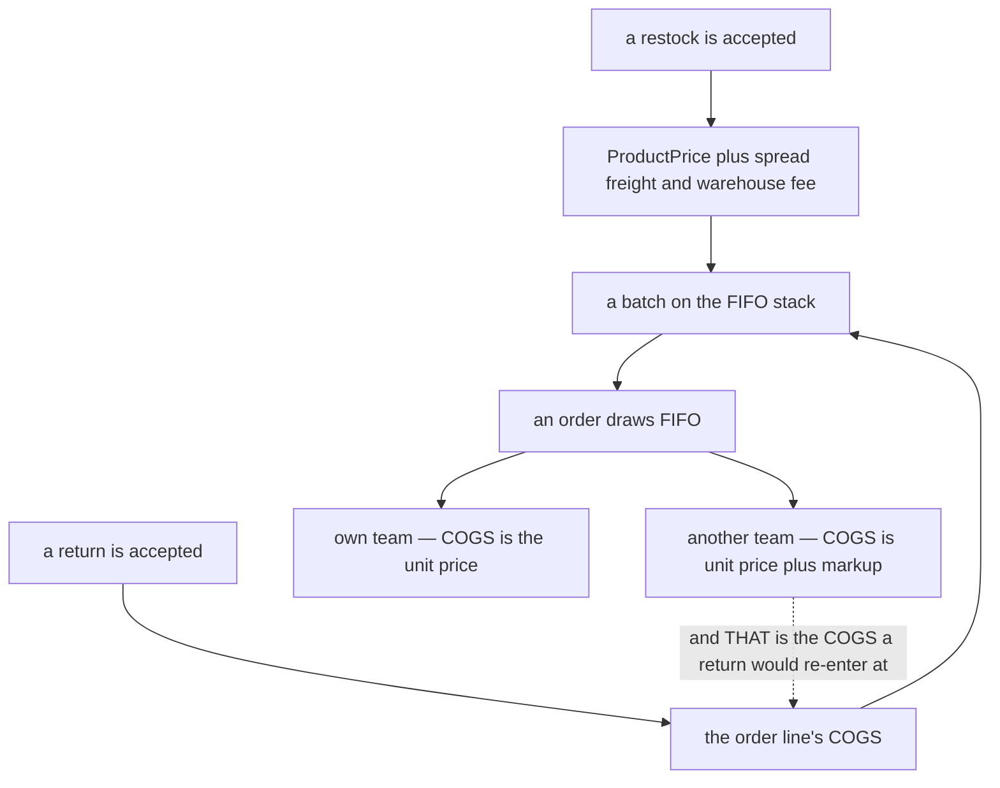
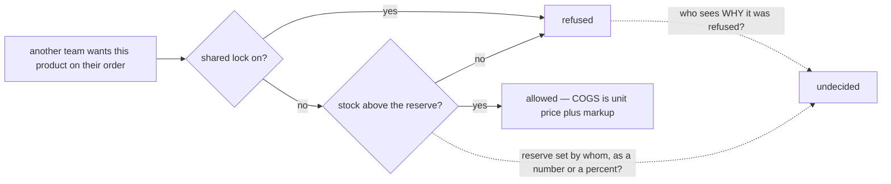
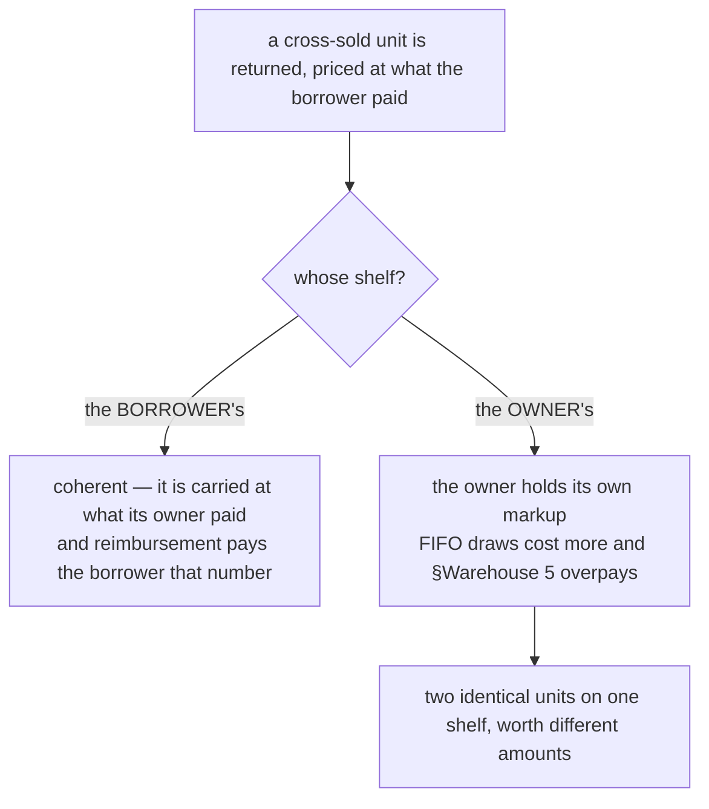
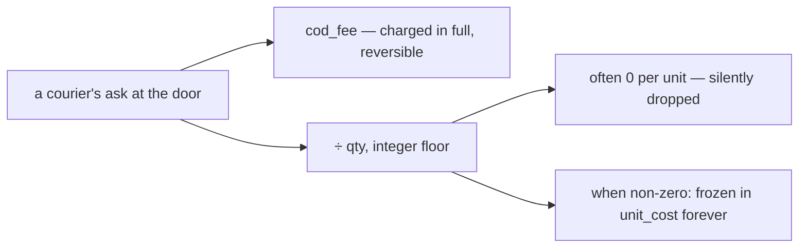

# Clarity — `product_context.md`

The pricing rules I read out of [product_context.md](./context.md), and
what they do not yet decide. **That doc is yours — this one is mine.** Answered points are **deleted**,
so this file is always the current open set.

> **Re-examined after you RESTORED §Unit Price Components 2.** ✅ **Closed and deleted:** *what price does a
> returned unit re-enter stock at* — the clause is back and it answers exactly the case that was missing. You
> chose the **ordering team's** COGS, which on a cross line is `UnitPrice + fee`; I had recommended the
> owner's cost. **Recorded as your decision, not re-argued** —
> [return-price-is-the-orders-cogs](#return-price-is-the-orders-cogs).
>
> ⚠ **What the clause does not say is where the unit goes**, and the price is only coherent on one of the two
> shelves. That is the successor question and it is now the sharpest one in the set:
> [Question 1](#question) · [Contradiction](#the-return-path-prices-the-unit-as-the-borrowers-while-the-order-path-leaves-it-the-owners).

Siblings: [business_level](../business_level_clarify.md) · [user_context](../user/context_clarify.md) ·
[balance_context](../balance/context_clarify.md) · [stock_context](../stock/context_clarify.md) ·
[systems/systems_product_context](./systems_clarify.md).

---

## Proposed Design

> **The operating reading, and why I am recording it rather than still arguing it.** On the ORDER path,
> four things point at **loan** and none at sale: the `loan["Loan"]` node in `order_context.md`'s
> diagram · **no arrow between the two selling teams** in that same picture · §Warehouse 5 reimbursing at
> **`(Unit Price)`**, the owner's markup-free cost · and *"when product in order is cross team, its calculate
> as **liability**"*, which denies the borrower a cost of goods that a purchase would have given it.
>
> ⚠ **So I read the rules below as LOAN — the goods stay the owner's and the charge is for lending — but no
> line of prose in `docs/business/` says the word outside a diagram label and a bullet.** That is a
> reading, not a decision, and it is yours to write down. **→ Recommend one sentence in
> `product_context.md`:** *a cross/shared line does not transfer ownership — the goods remain the owning
> team's and the borrowing team owes for what it consumed.* Three open questions collapse the moment it exists.
>
> ⚠ **Amended this round, and it cuts against the reading above — say so rather than let it be discovered.**
> The restored [return-price-is-the-orders-cogs](#return-price-is-the-orders-cogs) values a returned unit at
> **what the borrower paid**, and a thing is normally carried at what *its owner* paid. On the **return path
> specifically the doc set now leans SALE**, while the order path stays loan-shaped — `order_context.md`
> bullet 3 gives the owner a **receivable**, which is money owed, not goods sold.
>
> **So the set points both ways, and only on returns.** I am not flipping the operating reading and not
> quietly keeping it: the rules below still read as loan for the *order*, and the *return* is unresolved
> until [Question 1](#question) is answered. If the answer is "the borrower's shelf", the two paths are
> genuinely different — a loan that converts to a sale when the goods come back — and that is a coherent
> design, but it is one nobody has written down yet.

### The rules, named

#### a-product-has-no-price-until-it-is-stocked
The catalogue carries **no price**. A price exists only after a restock — **or a return** — is accepted
and the unit price is calculated from it. *(§Unit Pricing System and its diagram)*

#### unit-price-is-landed-cost
On a restock, `UnitPrice = ProductPrice + ((ShipmentFee + AdditionalWarehouseFee) / AllProductQtyRestock)`
— freight and the warehouse's receiving fee are **capitalised into the goods**, spread across the **whole
restock by quantity**. *(§Unit Price Components 1)*

#### return-price-is-the-orders-cogs
*"on return, unit price come from **COGS**. So if its contain cross product the unit price became to **how
much the team have order buyed**."* — a returning unit re-enters at the **ordering team's** cost for that
line, which on a cross line is `UnitPrice + fee`. *(§Unit Price Components 2)*

⚠ **This is a decision, and it picks the borrower's number.** It closes the gap I filed when the clause was
absent, and it does **not** match what I recommended (the owner's frozen batch cost) — recorded here as
yours, not re-argued. What it leaves open is **whose shelf the unit lands on**, which is what decides
whether the number is coherent: see
[Contradiction](#the-return-path-prices-the-unit-as-the-borrowers-while-the-order-path-leaves-it-the-owners).
#### batch-fifo-pricing
Because the same product arrives at many prices, cost is held in **batches** and drawn **FIFO** — oldest
layer first. *(§Unit Pricing System, closing line)*

#### product-is-a-selling-teams-catalogue
A product is a **catalogue entry owned by one selling team**. The warehouse holds its stock but does not
own the catalogue. *(§Product in business View 1–2)*

#### cross-markup-is-a-product-attribute
Each product carries a **percent markup**, set by its owning team, used when **another** selling team puts
it on their order. `fee = UnitPrice × markup`. *(§Cross/Shared Fee Markup)*

#### reserved-stock-is-never-shared
An owner can hold a **reserve**: below it, the product **cannot be shared** with another team.
*(§Cross/Shared Products Rule 1)*

#### shared-lock-stops-sharing-entirely
An owner can turn on a **shared lock**, which prevents the product being shared at all.
*(§Cross/Shared Products Rule 2)*

#### own-line-cogs-is-the-unit-price
A line whose product the **ordering team owns** → `COGS = UnitPrice`. *(§Pricing Behavior 1)*

#### cross-line-cogs-adds-the-fee
A line whose product **another selling team owns** → `COGS = UnitPrice + fee`. The borrowing team's cost
of goods **is** the money it owes that owner. *(§Pricing Behavior 2)*

✅ **`order_context.md` now agrees with this rule.** Its cross-line bullet reads *"the debit is **COGS** and
the credit is payable to cross team"* — the same debit this rule names, with the credit leg named beside it.
The dispute that stood here last round is resolved and deleted. ⚠ What neither doc says twice is the
**amount**: this formula is the only place `UnitPrice + fee` appears
([order_context residue](../order/context_clarify.md#contradiction)).

⚠ **Both are properties of a LINE, not of an order.**
[an-order-mixes-own-and-borrowed-lines](../order/context_clarify.md#an-order-mixes-own-and-borrowed-lines)
means one order carries both kinds at once — so a single order can owe **several different owners**, and
the reserve and the lock have to be tested line by line.

### Where a unit price comes from — two sources, one stack

⚠ **The dotted arrow is what is left of the contradiction.** It is only a defect under one reading of
what a cross order *is* — see below.

### The two sharing controls, and what they still leave open

⚠ **And no role may set either control.** [user_context.md](../user/context.md) names
Owner, Admin and Customer Service on the selling side and assigns none of them the markup, the reserve or
the lock — [user_context_clarity Critique 4](../user/context_clarify.md#critique).

### What a system still needs before it can price anything

| Question the formulas assume is answered | Where it must be answered |
| --- | --- |
| is `AllProductQtyRestock` the **ordered** or the **arrived** quantity | here ([Critique 1](#critique)) |
| what event **consumes** a FIFO layer, at what moment, and where the cost freezes | here ([Critique 3](#critique)) |
| what price a **returned** unit re-enters at — the formula was deleted, the diagram still asks for it | here ([Contradiction](#the-return-path-prices-the-unit-as-the-borrowers-while-the-order-path-leaves-it-the-owners)) |
| who sets the reserve, in what unit, and whether it binds the owner's own orders | here ([Critique 5](#critique)) |
| when the fee freezes, and how the percent rounds | here ([Critique 7](#critique), [Critique 8](#critique)) |
| **which role** may set a markup, a reserve or a lock | [user_context](../user/context_clarify.md#question) |

---

## Critique

| | Problem | → Recommend |
| --- | --- | --- |
| **1** | **`AllProductQtyRestock` is not defined as ordered or arrived, and the two differ on most deliveries.** A short delivery is ordinary, and [selling-team-bears-the-receiving-loss](../stock/context_clarify.md#selling-team-bears-the-receiving-loss) makes it the selling team's own loss — so the same freight is spread either over what was hoped for or over what turned up. Divide by ordered and the arrived units are undervalued, so a later breakage under-reimburses. Divide by arrived and the missing units' freight silently inflates the survivors. | **Divide by the ARRIVED quantity.** The freight was spent to land *these* units, they are what is on the shelf, so their cost is honest and a later reimbursement is right. The missing units' loss is then a separate, visible number — which is what the selling team needs in order to argue with the supplier. |
| **2** | **Freight is spread by COUNT, so a heavy item and a tiny one absorb the same rupiah.** 100 phone cases and 2 rice cookers on one delivery share the freight equally per piece: the cases become expensive, the cookers cheap, and every margin computed off them is wrong in opposite directions. | Fine as a v1 rule **if stated as a deliberate simplification** rather than read as an accounting truth. If deliveries routinely mix very different goods, spread by **line value** — same formula shape, different divisor. Say which, because it is invisible once it is inside a batch. |
| **3** | **[batch-fifo-pricing](#batch-fifo-pricing) names the method and nothing else.** FIFO is a *consumption* rule, and the doc never says what consumes: the order being **created**, the goods being **picked**, or the parcel being **shipped** — hours apart. Nor what happens when a draw **spans two layers** (one line, two costs). Two orders drawing the last layer in the same second is the normal case here, not an edge case. | Consume at the moment stock is **committed to the order**, and **freeze the resulting cost on the line** — a cost still being recomputed hours later is a cost two screens can disagree about. A multi-layer draw produces a **weighted line cost**, frozen once. |
| **4** | **An unstocked product still has no cost.** An order for it has no COGS, so margin, the cross fee and the reimbursement in [warehouse-reimburses-unit-price](../business_level_clarify.md#warehouse-reimburses-unit-price) are all zero — and a zero cost reads as "free" rather than "unknown". | Say what the business does with an **unpriced** product: refuse the order, allow it with cost **unknown** and flag it, or require a manual cost. **I would allow it and flag it** — refusing a real sale over a bookkeeping gap costs more than the gap — but "unknown" must never be stored as `0`. |
| **5** | **[reserved-stock-is-never-shared](#reserved-stock-is-never-shared) has no number, no owner and no scope.** *"when stock < several"* — several of what? A count per product, a percentage, or one figure for the team? Does it bind **the owner's own orders**, or only other teams'? If only others, it is a lending limit; if everyone, it is safety stock and a different feature. | **A per-product integer, set by the owning team, binding only OTHER teams' orders** — that matches the section's own title, *For Fair Sharing*, and keeps the owner able to sell down its own goods. Also decide the boundary: `stock < reserve` or `stock − requested < reserve`? Only the second actually protects the reserve, because the first still lets one big cross order empty it. |
| **6** | **[shared-lock-stops-sharing-entirely](#shared-lock-stops-sharing-entirely) has no scope and no timing.** Per **product** only, or aimable at one counterparty? And what happens to **orders already placed** by another team when it goes on — honoured, or cut? A switch that cancels somebody else's live orders is a very different feature from one that stops new ones. | **Per product, all-or-nothing, affecting only NEW orders.** Retroactive cancellation would let one team break another's promise to a customer. If per-counterparty blocking is ever wanted, make it an explicit second control, never an overload of this one. |
| **7** | **Nothing says the fee is FROZEN.** The owner edits the markup from 10% to 15%. Do last month's orders, already shipped and already owed, change? If the fee is recomputed on read, an invoice changes after both teams agreed it — and with a [debt threshold](../balance/context_clarify.md#debt-threshold-limits-liability) able to block a team, a retroactive rate change can block somebody retroactively. **The `(COGS)` edit raises the stakes**: a frozen line COGS is now also the price a *return* re-enters at, so an unfrozen fee would rewrite stock valuations too. | State: **the fee is computed once, when the order consumes the stock, and stored.** A rate change applies to future orders only. One sentence can cover this and the cost freeze in [Critique 3](#critique). |
| **8** | **Two divisions and a percentage, and no rounding rule anywhere.** `(ShipmentFee + AdditionalWarehouseFee) / AllProductQtyRestock` rarely divides evenly into whole rupiah, and `UnitPrice × markup` almost never does. Rounding per unit versus per line changes the total on a line of 7, and two teams reconciling to the rupiah will find that difference. | Round **once, half-up, on the line total**, never per unit, and store whole rupiah. Keep the rate a percent — the rate is not the money. And say where the remainder goes when freight does not divide evenly: I would put it on the **first** unit rather than lose it. |
| **9** | **A return is now neither priced NOR placed.** The price rule was deleted this round ([Contradiction](#the-return-path-prices-the-unit-as-the-borrowers-while-the-order-path-leaves-it-the-owners)), and even before that nothing said **whose stock** the unit re-enters, whether the **fee reverses**, or what happens when it comes back **unsellable** — which per [receiving-losses-are-not-the-warehouses](../business_level_clarify.md#receiving-losses-are-not-the-warehouses) the warehouse does not bear, and per `stock_context.md` may be borne by nobody. | Answer it with the loan-vs-sale question below, in one place: if a cross order is a **loan**, the unit returns to the **owner** at the owner's cost and the fee reverses. And say **which** selling team eats an unsellable cross return — I would say the **borrower**, because it chose the customer. |
| **10** | **Two teams selling the same physical item are two products, and the doc does not say what that means on the shelf.** [product-is-a-selling-teams-catalogue](#product-is-a-selling-teams-catalogue) makes a product team-scoped, so identical goods are different rows with different batches and owners. If the warehouse commingles them the FIFO layers are a fiction — and so is the reserve in [Critique 5](#critique), because you cannot protect a reserve you cannot tell apart. **A Packer is the person this instruction is for**, and no rule reaches them. | State the physical rule: **stock is segregated by owning team** — a shelf may hold two owners' units side by side, never mixed into one count. |
| **11** | **§System Requirements still links to an empty file whose one line is about a different subject.** | See [systems/systems_product_context_clarity](./systems_clarify.md). |

---

## Question

1. **WHOSE SHELF does a returned cross-sold unit land on — the borrower's or the owner's?** The price is
   now decided (*what the ordering team paid*); the custody is not, and it is what makes that price
   coherent or not.
   ([Contradiction](#the-return-path-prices-the-unit-as-the-borrowers-while-the-order-path-leaves-it-the-owners))
   **→ I recommend the BORROWER's stock, because that is the only shelf on which your chosen price is what
   its owner paid.** If you mean it to go home to the owner, the price clause needs the owner's cost instead
   — the two answers travel together and cannot be picked separately.
2. **Is `AllProductQtyRestock` the ordered or the arrived quantity?** ([Critique 1](#critique))
   **→ I recommend arrived.**
   ⚠ **`stock_context.md`'s new receiving flow answers this by arrow order, and it answers ORDERED**:
   *Calculate Unit Price* runs **before** *Is Any Lost* and *Calculate valid Qty*. That contradicts the
   recommendation above, so the question is now *"is that sequence deliberate?"* —
   [stock_context Q1](../stock/context_clarify.md#question).
3. **What is the reserve — a per-product count set by the owner, and does it bind the owner's own orders?**
   ([Critique 5](#critique)) **→ I recommend a per-product count, binding only other teams.**
4. **Does turning on the shared lock affect orders already placed?** ([Critique 6](#critique))
   **→ I recommend no — new orders only.**
5. **What moment consumes a FIFO layer, and is the fee frozen there too?**
   ([Critique 3](#critique), [Critique 7](#critique)) **→ I recommend at commitment, both frozen on the line.**
   ⚠ **Now also a boundary question:** the layers are `inventory_service`'s and COGS is `ledger_service`'s,
   so *where the frozen number is stored and who owns it* travels with this answer —
   [architectures Q3](../../technical/architecture/context_clarify.md#question).
6. **🆕 Does `AdditionalWarehouseFee` belong inside `UnitPrice` at all?** `balance_context.md` has now
   defined that money as the courier's **accidental ask at the door** — *"coffe tip or other"*
   ([cod-fee-is-the-couriers-incidental-ask](../balance/context_decision.md#cod-fee-is-the-couriers-incidental-ask)).
   §Unit Price Components freezes it into the goods' cost forever. ⚠ That doc's own sequence diagram
   calls the charge a **reimbursement**, which is an argument against capitalising it made in the
   owner's own words. ([Contradiction](#contradiction))
   **→ I recommend taking it OUT and leaving `ShipmentFee` in.** Freight is agreed before the journey
   and is genuinely part of what the goods cost. A tip is unpredictable, small, and — because
   `freightPerUnit` floors — frequently contributes **0 per unit** while being charged in full on the
   balance. That is the worst possible input to a permanently frozen number.

---

# Contradiction

## the return path prices the unit as the borrower's while the order path leaves it the owner's

**The gap this replaces is CLOSED** — §Unit Price Components 2 is back and it names the number. What the new
clause does not name is **whose stock the unit re-enters**, and the two docs lean opposite ways about that:

> [`product_context.md`](./context.md) §Unit Price Components 2: *"on return,
> unit price come from COGS … the unit price became to **how much the team have order buyed**."* — the unit
> is valued at what the **borrowing** team paid. A thing is normally carried at what **its owner** paid, so
> this reads as the borrower owning it.
>
> [`order_context.md`](../order/context.md) §What Make Our Order Unique, bullet 3: *"in
> team that have product side, its also increase **receivable from team that have order**."* — a receivable
> means the owner is **owed money**, not that it sold its goods. That is the lending shape, in which the unit
> was the owner's throughout and comes back to the owner.

**Neither line is wrong on its own — they cannot both be right about the same shelf.** Value a unit at the
borrower's cost and stand it on the **owner's** shelf, and the owner's inventory carries a markup the owner
itself charged: every later FIFO draw off that layer costs more, and
[warehouse-reimburses-unit-price](../business_level_clarify.md#warehouse-reimburses-unit-price) — which pays
*"the team that own the goods"* at *"Unit Price"* — pays the owner **its own markup** the day that unit
breaks. Two physically identical units on one shelf would then be worth different amounts, and reimburse
differently, purely because one had once been lent out.

⚠ **So this is not a line to fix but a line to ADD.** Under the borrower's-shelf reading everything above is
coherent and no rule needs changing. **→ Recommend** §Unit Price Components 2 gain its missing half — *"and
the unit re-enters the **ordering** team's stock"* — or, if the goods are meant to go home to the owner, that
the same clause price them at the owner's cost instead. Six words either way, and it decides three other
rules.

**What stops this recurring:** this is the fourth time a rule has named **one side of a two-sided fact** —
after the two leg-naming contradictions in `order_context` and the reimbursement noun. A rule about goods
moving needs to say **what it is worth AND where it sits**, in the same sentence.

## `AdditionalWarehouseFee` is capitalised into UnitPrice, and `balance_context.md` has now defined it as a TIP

**Raised by a decision in another doc, and the fix belongs here** — §Unit Price Components is what
decides the formula.

> `product_context.md` §Unit Price Components: `UnitPrice = ProductPrice + ((ShipmentFee + `**`AdditionalWarehouseFee`**`) / AllProductQtyRestock)`
> `balance_context.md` §Why `cod_fee` Exists: *"shipping channel person who brought the goods ask accidental fee (`cod_fee`) … for the cost like coffe tip or other."*

They are the **same money** — *"additional warehouse fee **on accept stock (optional)**"* and
*"**optionally** set warehouse when accept restock"* describe one line item
([cod-fee-is-the-couriers-incidental-ask](../balance/context_decision.md#cod-fee-is-the-couriers-incidental-ask)).
So a discretionary tip handed over at a door is currently **frozen into the goods' cost forever**,
and every later COGS, margin and breakage reimbursement reads it.

**Three consequences, and the third is the one that decides it:**

1. **It is permanent where the debt is not.** The ledger entry can be reversed; `stock_batches.unit_cost`
   is frozen at acceptance and has no correction path.
2. **It sets what the warehouse owes itself back.** A `broken_good` reimbursement is `qty × unit_cost` —
   so a bigger tip today means a bigger payout if the warehouse breaks the goods tomorrow.
3. ⚠ **The same rupiah is EXACT in the ledger and rounds to ZERO in the cost.** `freightPerUnit` is
   integer division (`restock_request_fulfill.go`), so a 5.000 tip across 1.000 units contributes
   **0** to unit price while being charged **in full** on the balance. The capitalisation is therefore
   already unreliable for exactly the amounts this fee is described as being.

**→ Recommend: keep `cod_fee` OUT of `UnitPrice`.** ⚠ **`balance_context.md`'s own diagram already
names it** — *"Charge to selling as **reimbursement**"*. A reimbursement is money going back to
whoever fronted it, not a component of what the goods cost. Add that it is unpredictable and small,
and it is the worst possible input to a permanently frozen number. `ShipmentFee` stays inside: it is
agreed before the journey and is genuinely part of what the goods cost. Asked as [Q6](#question).

---

# Awaiting

- **Nothing says who may SEE another team's unit price.** The cross fee exposes the owner's cost by
  arithmetic — `COGS = UnitPrice + fee` with a known markup gives `UnitPrice`. If cost is meant to be
  private, the fee must be quoted as one number and the derivation hidden.
- **No rule for a batch that is emptied, split, or corrected.** FIFO implies layers, and layers imply one
  running out mid-order and one whose cost was typed wrong. Neither is mentioned.
