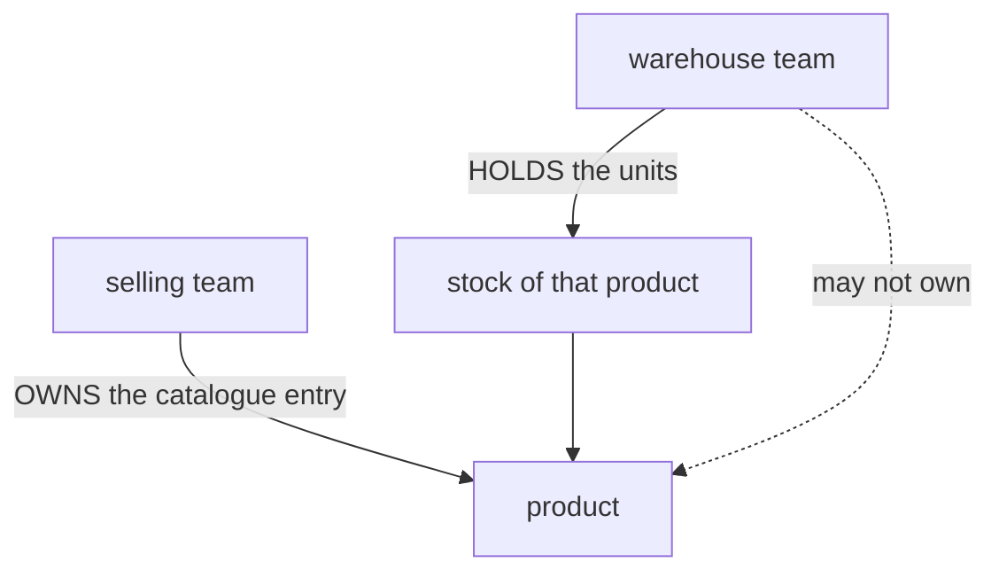
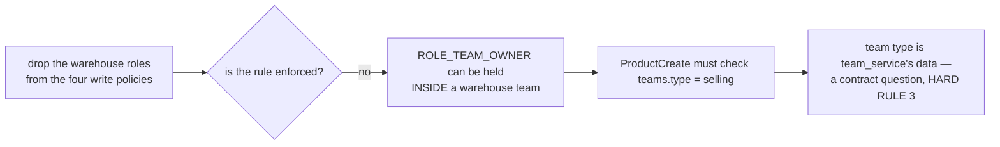
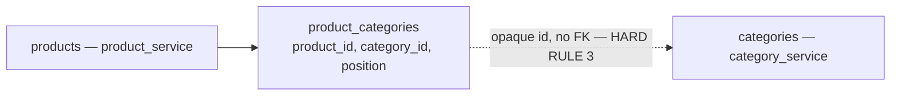
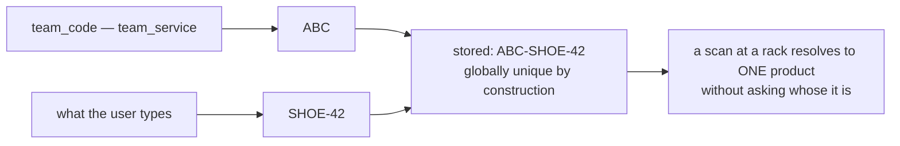
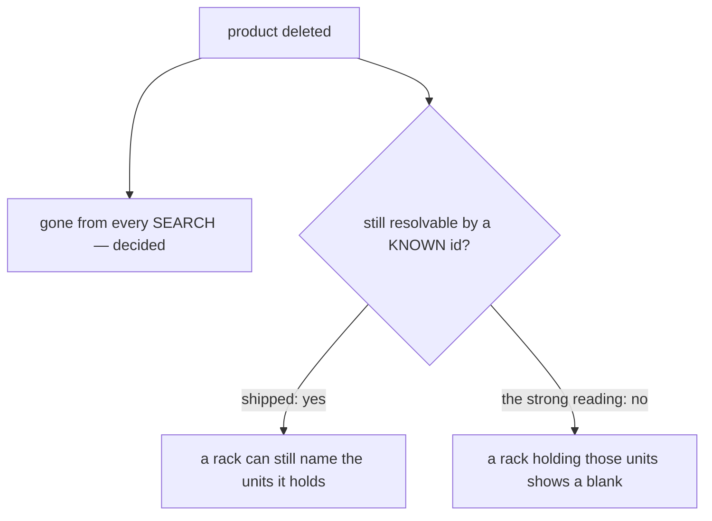
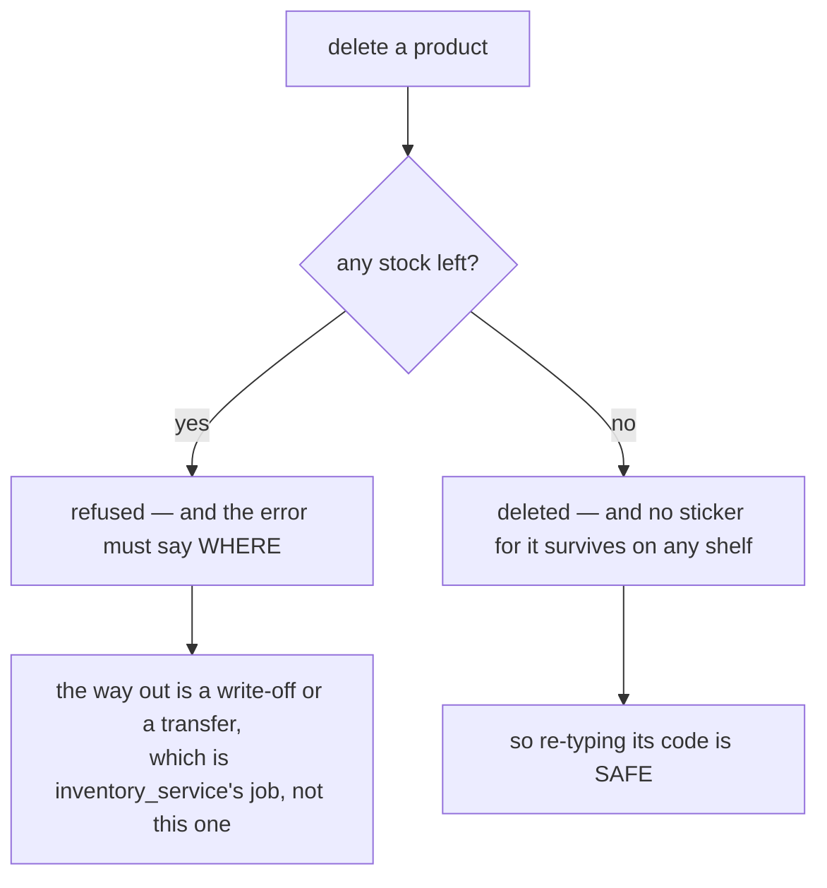

# Decisions — `product_context.md`

What the owner decided about [context.md](./context.md), recorded before it is acted on.
**Append-only** — the opposite lifecycle to [context_clarify.md](./context_clarify.md), which holds only
what is still open. Each entry carries what it decided, why, and the spec that makes it buildable
(RULE 8b.11).

Siblings: [balance](../balance/context_decision.md) · [analytic](../analytic/context_decision.md) ·
[project/member](../project/member_decision.md).

---

## only-a-selling-team-owns-a-catalogue

> *"warehouse cannot have own product"* (owner, 2026-09-12)

`## General.` 1 stands exactly as written: **a product belongs to a selling team, and to no other kind
of team.** A warehouse team holds stock — it never owns the catalogue entry that stock is counted
against.



**Why it matters beyond the ACL.** §Pricing Behavior splits every line into *the ordering team owns this
product* → `COGS = UnitPrice`, or *another selling team owns it* → `COGS = UnitPrice + fee`. A
warehouse-owned product would be a third case, and a warehouse team places no orders — so it could never
be the *own team* of anything it owned. This decision makes that split total: every product has an owner
that can also be a buyer.

### The spec

**1. Four WRITE requests lose the two warehouse roles** — [product.proto](../../../proto/warehouse/product/v1/product.proto):

| request | roles today | roles after |
| --- | --- | --- |
| `ProductCreateRequest` | ROOT, ADMIN, TEAM_OWNER, TEAM_ADMIN, **WAREHOUSE_OWNER, WAREHOUSE_ADMIN** | ROOT, ADMIN, TEAM_OWNER, TEAM_ADMIN |
| `ProductUpdateRequest` | same | same |
| `ProductDeleteRequest` | same | same |
| `ProductRestoreRequest` | same | same |

**2. Every READ keeps them.** `ProductList`, `ProductByIds` and `ProductDetail` stay open to
`WAREHOUSE_OWNER`/`ADMIN`/`STAFF` — a packer holding a physical unit must be able to read its name. Not
owning a catalogue is not the same as not being allowed to look at one.

**3. `product.proto`'s service comment is corrected.** It currently reads *"a selling/warehouse team owns
its own catalogue"*, which is now wrong on the second word.

**4. ⚠ The ACL narrowing does NOT enforce this on its own — the handler must check the TEAM TYPE.**
Roles are granted per team and **nothing forbids granting `ROLE_TEAM_OWNER` inside a warehouse team**
(no grant path validates a role against `teams.type`). So after the four edits above, a `TEAM_OWNER` of a
warehouse team still passes the policy and still creates a product there.



**What is decided** is the business rule. **What is not decided** is how product_service learns a team's
type — it has no read path to `team_service` today, and HARD RULE 3 makes that an RPC rather than a
shared model. That successor question is open in
[context_clarify.md](./context_clarify.md#question).

---

## a-product-files-under-many-categories

> *"categories is plural"* (owner, 2026-09-12)

`## Attribute / Field That Product Must Have` 4 is right and the schema is wrong: **a product is filed
under SEVERAL taxonomy nodes, not one.** `products.category_id` — a single `BIGINT` — becomes a link
table owned by product_service.



⚠ **I had recommended one node and was wrong about the direction of the risk.** My argument was that
one → many is additive later — true of the *schema* and false of the *contract*, because `buf breaking`
now runs in CI and the proto change is breaking whenever it happens. The cheap moment is therefore now,
not later, which is the opposite of what I said.

### The spec

**1. A new table, in product_service's own migrations** (HARD RULE 3):

| column | | |
| --- | --- | --- |
| `product_id` | `BIGINT NOT NULL` | |
| `category_id` | `BIGINT NOT NULL` | opaque id from category_service — **no FK** |
| `position` | `INT NOT NULL DEFAULT 0` | the order they were filed, first = primary (see the open question) |
| | `UNIQUE (product_id, category_id)` | a product files under a node once |
| | `INDEX (category_id)` | *"what is in this node"* is the read that needs it |

**Backfill and drop in the SAME migration** — one row per product with `category_id > 0`, then
`products.category_id` goes. Leaving both is two sources of truth for one fact, which is the drift the
model comment already says this project exists to avoid.

**2. Four proto sites, and the change is BREAKING** — field 7 is reserved and a `repeated` one added
beside it, rather than changing 7's cardinality in place (a singular `uint64` is a varint on the wire and
a `repeated` one is length-delimited — same number, different encoding):

| message | today | after |
| --- | --- | --- |
| `Product` | `uint64 category_id = 7` | `reserved 7` · `repeated uint64 category_ids = 14` |
| `ProductCreateRequest` | `uint64 category_id = 5`, `gt = 0` | `repeated uint64 category_ids`, `min_items: 1` |
| `ProductRowItem` | `uint64 category_id = 6` | `repeated uint64 category_ids` |
| `ProductUpdateRequest` | `optional uint64 category_id = 6` | a **`ProductCategories` wrapper**, exactly like `ProductImages` — a message field has presence, so nil = *leave alone* and present = *replace with exactly these* |

⚠ `buf breaking` fires on that commit. That is the accepted situation, not a surprise — same shape as
[breaking-the-old-protos-is-accepted](../../technical/event_architecture/context_decision.md#breaking-the-old-protos-is-accepted).

**3. ✅ Nothing FILTERS by category today**, which is most of why this is cheap: `category_id` is carried
on the row and read by nobody. `ProductList` and `ProductDiscover` have no category filter to rewrite as
an `EXISTS`. When one is added it is a subquery, not a join — a join multiplies rows per category and
silently breaks the page count.

**4. ⚠ The list read must not become N+1.** One `WHERE product_id IN (…)` for the whole page, grouped in
memory — not a lookup per row. `ProductDetail` may read its own.

**5. The picker stays SINGLE, and is not forked.** `CategorySelect` has four callers and **three of them
pick a parent node**, not a product's categories (`CreateCategoryDialog`, `EditCategoryDialog`,
`AddressPicker`). Only [product-edit](../../../frontend/src/pages/product-edit/index.tsx) files a product. So the multi-value control is a
**chips wrapper that composes `CategorySelect`** for adding and renders removable tags — the tree logic
stays in one place.

---

## the-code-is-composed-from-the-team-code

> *"composed"* (owner, 2026-09-12)

`product_code` is **globally unique** (`### Whats is \`product_code\`` 2) and the stored string is
**composed on write** from the owning team's code and the team's own part:

```
product_code = <team_code>-<the team's own code>
```



**What it buys.** Global uniqueness stops being a namespace two teams compete for. Two teams selling one
supplier's item can both carry that supplier's code as their own part, no create is ever refused because
of another team's row, and no refusal can leak that another team holds a code.

### The spec

**1. The user types their part only.** The prefix is a static adornment in the form, not an editable
field — a user who can type the prefix can collide with another team again.

**2. The prefix is FROZEN at write time, not recomputed on read.** ⚠ Teams can be renamed
(`TeamInfoUpdate`), and a prefix recomputed from the current `team_code` would silently rewrite every
printed label a team ever produced. The composed string is stored whole, exactly as it was composed.
*(→ Recommended, not stated by the owner — say so if it should follow the team instead.)*

**3. ⚠ It needs the same cross-service read as
[only-a-selling-team-owns-a-catalogue](#only-a-selling-team-owns-a-catalogue), and that is a reason to build ONE.** Composing the code needs
`teams.team_code`, and enforcing the ownership rule needs `teams.type` — both team_service's, neither
reachable from product_service today (HARD RULE 3). One cached team read at write time serves both.
Open as [Q8](./context_clarify.md#question).

**4. The uniqueness constraint is on the composed string**, one index over `product_code`. Whether it
excludes soft-deleted rows is the still-open [Q11](./context_clarify.md#question).

---

## a-deleted-product-is-unfindable

> *"deleted product is cannot search anywhere"* (owner, 2026-09-12)

A deleted product **leaves every search surface**. It is not in `ProductList`, not in `ProductDiscover`,
not in a typeahead, and not reachable by its code.

⚠ **Recorded with its boundary, because the rule and the shipped code disagree about one case.**
`ProductByIds` — a lookup by an id the caller ALREADY HOLDS, not a search — deliberately **does** return
soft-deleted products, and its comment says why: *"stock outlives a catalogue entry, and a shelf holding a
deleted product should name it rather than show a blank."* Whether this decision overrides that is the
open [Q11](./context_clarify.md#question); the contradiction is written up in
[context_clarify.md](./context_clarify.md#a-deleted-product-is-unfindable-and-a-shelf-of-its-units-still-needs-its-name).



---

## deleting-a-product-requires-zero-stock

> *"for \"Can a product be deleted while it still has stock?\" no"* (owner, 2026-09-12)

A product **cannot be deleted while it still has stock.** `ProductDelete` checks the quantity first and
refuses — today it checks nothing, so this is a new guard, not a restatement.



**It resolves the contradiction with `ProductByIds`** — there is no longer a shelf holding a deleted
product's units, so *unfindable anywhere* and *a rack should name what it holds* stop competing
([the contradiction](./context_clarify.md#a-deleted-product-is-unfindable-and-a-shelf-of-its-units-still-needs-its-name)).

### The spec

**1. The check is cross-service and must NOT be cached.** Stock is inventory_service's, so this is an RPC
(HARD RULE 3) — and unlike the team read that
[the-code-is-composed-from-the-team-code](#the-code-is-composed-from-the-team-code) needs, a quantity served from a cache would wave
through the very delete it exists to stop.

**2. ⚠ The refusal must NAME the stock, not just refuse.** *"This product still has stock"* leaves an
operator with nowhere to go. The error carries the warehouses and quantities holding it, because the way
out — a write-off or a transfer — happens somewhere else and the person needs to know where to go.

**3. ⚠ It makes delete BLOCKABLE, and that is the accepted cost.** A product with units nobody can find
can never be archived until those units are written off. That is the correct trade — the alternative is
archiving a catalogue entry while the warehouse still physically holds it — but it means the write-off
path has to exist and be reachable, or this rule turns into a permanently stuck row.

**4. ✅ It makes code reuse SAFE, and that retires my own argument against it.** I had recommended burning
a deleted code because a re-typed one would make an old sticker scan as a new product. With zero stock
required, no sticker for a deleted product survives, so the argument falls with it. Recorded rather than
quietly dropped.

**5. ⚠ The `[code]_deleted_ts` rename is still not needed for that.** A partial unique index
(`WHERE deleted = FALSE`) frees the code without mutating a string somebody printed — and the rename
collides with itself when a code is created and deleted twice inside one `ts` tick, which fails the
**delete**. If a rename is wanted anyway, suffix the row **id**.
