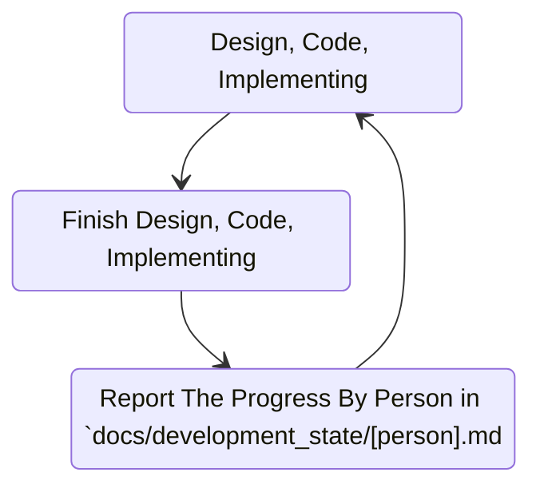

# Member Responsbility

This Is Explanation about Who person in this project and the Responsbility.
1. Heri
2. Hendra
3. Toni

## Scope Responsbility.
1. `Toni`, Design, Concept and Implementing:
    - Stock & Inventory
    - Products
    - Analytic

2. `Heri`, Design, Concept and implementing:
    - Order
    - Order Settlements.
    - Team Balance.
    - Users & Role System.
    - Documents
    - region
    - shipping
    - expense

3. `Hendra`, Still work legacy, join later.

## Reporting and Documenting The Progress.
