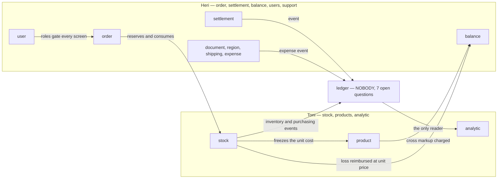
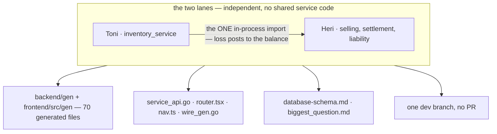
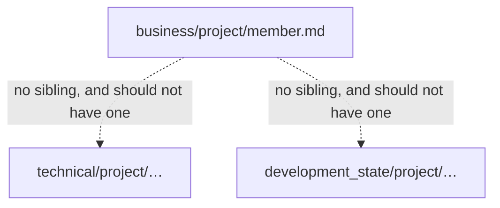

# Clarity — `member.md`

**That doc is yours — this one is mine.** Answered points are **deleted**, so this file is always
the current open set.

This is the **first doc in the repo that names a person**. Until now every `_clarify.md` — 16 of
them, [93 open questions](../../biggest_question.md) — addresses *"the owner"* as one person, and
`CLAUDE.md` says a merge to `main` happens *"when the owner asks"*. Naming three people makes
*"the owner"* ambiguous everywhere at once, so the value of this doc is not the list — it is
**who answers what**.

> # ⚠ Re-examined after Documents / region / shipping / expense went to Heri — **and I am reversing my ledger recommendation**
>
> ✅ Recorded as [support-services-sit-with-order](./member_decision.md#support-services-sit-with-order),
> and **verified to create no new fence**: `inventory_service` does not use `document_service` or
> `region_service` at all, and touches shipping only as a *string* on its own `restock_request`.
>
> **The tally is now lopsided in built surface:** Heri **8 of the 12 services, 75 RPC / ~13.1k
> lines**; Toni **2 services, 60 RPC / ~9.8k**. The four new ones are reference and CRUD, so the
> *design* load barely moves — but it makes my own ledger recommendation the thing that would tip it.
>
> ### 🔄 `ledger` → **Toni**, not Heri. I had it wrong.
>
> Reading [ledger/context.md](../ledger/context.md) properly: the ledger is a **Pub/Sub subscriber**
> with **four** producers — Settlement, Purchasing, Inventory, Other Expense — spanning **both**
> lanes. So:
>
> | my old argument | why it fails |
> | --- | --- |
> | *"a projection is owned by what projects into it"* | four things project into it, in both lanes. The rule names nobody |
> | *"the writer should own it"* | **no producer ever calls it.** They publish an event and are done — nothing waits on the ledger, so its owner need not be a writer |
>
> **What is left pointing anywhere points at Toni:** `analytic` is the ledger's **only reader**, and
> it is Toni's. Ledger + analytic is **one reporting lane in one head** — which is the same
> reader-independence argument you already made when you took analytic away from the numbers. What
> the producers owe is an **event contract**, and `event_config` already makes that declarative in
> each producer's own `.proto`.
>
> ⛔ **One thing to know before deciding it:** *Purchasing* is a first-class producer in your ledger
> diagram and **has no service and no context doc anywhere** — already asked in
> [ledger C5](../ledger/context_clarify.md#critique). Whoever takes the ledger inherits that hole.

> **Earlier round — §Scope gained *"Analytic"* and *"Users & Role System"***
>
> ✅ **Three of the four unowned contexts are now assigned** — `product` and `analytic` to Toni,
> `user` to Heri ([products-follow-the-unit-price](./member_decision.md#products-follow-the-unit-price)
> · [analytic-sits-with-stock](./member_decision.md#analytic-sits-with-stock) ·
> [identity-sits-with-order](./member_decision.md#identity-sits-with-order)). The lanes are close to
> even again — Toni **60 RPCs / ~9.8k lines**, Heri **68 / ~11.9k**.
>
> ⛔ **One context is left, and it is now the bridge between the two lanes rather than a leftover.**
> `analytic` reads the **ledger**, and the ledger is written by `settlement` — so the last unowned
> context sits directly between Heri's writer and Toni's reader. Every arrow into or out of it
> crosses the fence, and **nobody is on the other end of either.** That is [Question 1](#question),
> and it is now a single question rather than four.
>
> 🆕 **Four small services were never named** — `document`, `region`, `shipping`, `expense` (16
> RPCs) — ✅ since answered, see the round above.

> **Earlier round — §Scope 3, *"`Hendra`, Still work legacy, join later."***
>
> ✅ **Closed and deleted:** *what is Hendra's scope?* → [hendra-joins-later](./member_decision.md#hendra-joins-later).
> ⚠ It moved the gap rather than shrinking it: nothing can be parked on an absent member, so what
> is unowned needs an owner among the **two people present**. 🆕 The doc gained a TIME dimension
> and has no handover rule — [Critique 6](#critique).

## Critique

| # | The gap | → Recommend |
| --- | --- | --- |
| **1** | ⛔ **`ledger` is the last unowned context** — **7 open questions**, and both parties can point at the other. It is a **Pub/Sub subscriber** with four producers in both lanes ([ledger/context.md](../ledger/context.md)), so no producer waits on it and no producer's owner is picked out by it. | 🔄 **`ledger` → Toni**, reversing what this file said last round. Its **only reader is analytic**, which is Toni's — ledger + analytic is one reporting lane in one head. Producers owe it an **event contract**, which `event_config` already declares in each producer's own `.proto`. It also stops Heri holding 10 of 13. |
| **2** | **"Responsibility" is three different powers, and the doc grants an unnamed one.** *Design, Concept and Implementing* reads as all three, but they separate in practice: **who writes** `docs/business/<x>/context.md`, **who decides** an open question (HARD RULE 8), **who builds** `backend/services/<svc>`. Only the second changes how the docs work. | **Say it grants DECISION authority per context**, and let building follow but stay reassignable. Then a `_clarify.md` addresses a named person and [biggest_question.md](../../biggest_question.md) can rank per-person instead of per-system. |
| **3** | **Every scope boundary is a contract, and no boundary has an owner.** Live today, not hypothetical: warehouse loss → the owning team's balance ([business_level §Warehouse 5](../business_level.md)) crosses Toni→Heri · order reserve/consume crosses Heri→Toni · the frozen unit cost is minted in receiving and read as `product` · the cross markup is [already stored in two services and charged from the wrong one](../../biggest_question.md). | **The CALLER's owner proposes the RPC, the CALLEE's owner accepts it, and it is recorded in the CALLEE's `_decision.md`.** One rule, no committee, and the record lands where the constraint lives. |
| **4** | **No tiebreak — and `CLAUDE.md` assumes there is one.** Per-context authority answers most things and cannot answer *"we disagree about the boundary"* or *"merge `dev` → `main`"*. ⚠ With two deciders rather than three, a disagreement has no majority either. | Name **one final decider** for the cross-cutting calls — the hard rules, the proto contract, the branch. Per-context authority stands everywhere else. |
| **5** | **Nothing says who reviews.** With a clean-slate design and two people working disjoint halves, the risk is not slow work — it is two contexts quietly disagreeing about the same fact. The markup already did exactly that. | **The boundary's other owner reviews the change that crosses it**, and nothing else needs a reviewer. Cheap, and it catches the one failure that has actually happened here. |
| **6** | 🆕 **"join later" has no arrival rule.** No date is needed — but nothing says what Hendra picks up, and the default is *whatever is left*, which is the worst allocation available: the contexts nobody chose. ⚠ There is also a HARD RULE 1 edge here — someone arriving from the legacy system carries its accumulated design, and that system is explicitly **not a design input** here. | **One line: on arrival, scope is decided from what is undesigned THEN**, and the handover is the `_decision.md` files — which is already true by construction, so it costs nothing to promise. Nothing needs to be reserved now. |

### Recommendation

The cross-cutting one: **make `member.md` a routing table, not a roster.** One row per context, so
*"who answers this `_clarify.md`?"* is a single lookup — that is the job this doc can do that no
other doc can. **Two names fill it today**; a third is added when there is a third.

Nine arrows. **Three cross a named fence** (order→stock, stock→balance, product→balance), **two
became internal** (stock→product, user→order — the unit cost and the ACL no longer cross anything),
and **four run into or out of the one context nobody owns**. ⚠ Note their shape: everything into
the ledger is an **event**, and the only thing out of it is a **read**. That is what makes it
ownable by the reader.

## Proposed Design

A shape for `member.md` — yours to take or reject (HARD RULE 7b: I never write it into your doc).
**Revised for two deciders**, since [hendra-joins-later](./member_decision.md#hendra-joins-later)
removed the third.

| Context | Decides | Service | Why |
| --- | --- | --- | --- |
| [stock](../stock/context.md) | Toni ✅ | `inventory` — 52 RPC | as written |
| [product](../product/context.md) | Toni ✅ | `product` — 8 RPC | [products-follow-the-unit-price](./member_decision.md#products-follow-the-unit-price) |
| [analytic](../analytic/context.md) | Toni ✅ | — not built | [analytic-sits-with-stock](./member_decision.md#analytic-sits-with-stock) |
| [order](../order/context.md) | Heri ✅ | `selling` — 25 RPC | as written |
| [settlement](../settlement/context.md) | Heri ✅ | `settlement` — 3 RPC | as written |
| [balance](../balance/context.md) | Heri ✅ | `liability` — 12 RPC | as written |
| [user](../user/context.md) | Heri ✅ | `user` — 19 RPC | [identity-sits-with-order](./member_decision.md#identity-sits-with-order) |
| `document` · `region` · `shipping` · `expense` | Heri ✅ | 16 RPC | [support-services-sit-with-order](./member_decision.md#support-services-sit-with-order) |
| **[ledger](../ledger/context.md)** | ⛔ **nobody** | — not built | 🔄 **→ Toni**, with analytic. Every input is an event, the only output is a read |
| *riders — never named* | | | |
| `category` — 4 RPC | **Toni?** | the product taxonomy | implied by Products, not stated |
| `team` — 9 RPC | **Heri?** | teams, the scope of every role | implied by Users & Roles, not stated |
| *purchasing* | ⛔ **does not exist** | no service, no context doc | a first-class ledger producer that was never built — [ledger C5](../ledger/context_clarify.md#critique) |
| cross-cutting — `business_level`, architecture, the hard rules, `main` | **whoever writes `business_level.md`** | — | the tiebreak from [Critique 4](#critique) |
| — | *Hendra, on arrival* | — | decided then, from what is undesigned then — [hendra-joins-later](./member_decision.md#hendra-joins-later) |

**The boundary rule, in one line:** *the caller proposes, the callee accepts, the callee's
`_decision.md` records it.*

## Working concurrently — the split is fine, the shared FILES are the problem

**The domains barely touch.** Across all twelve services there is exactly **one** in-process Go
import that crosses the fence — `inventory_service` → `liability_service`, the warehouse's loss
posting onto the owning team's balance. Everything else crosses over the **proto contract**, which
is the form that lets two people work the same day. `selling_service` calls inventory as a client,
not as a package.

**So nothing serialises the work except six shared files, and one branch:**

| Collision surface | Why it bites | → Recommend |
| --- | --- | --- |
| `backend/gen/` + `frontend/src/gen/` — **70 committed generated files** | both run `buf generate`, which rewrites **all** of them, so two people touching different `.proto` still produce overlapping diffs | **never merge a conflict here — regenerate after the merge.** `git checkout --theirs` then `buf generate` |
| [docs/database-schema.md](../../database-schema.md) — 1,370 lines, **8 of the last 40 commits** | the highest-churn shared file in the repo, and a schema change must update it in the same commit (HARD RULE 3) | it is already **one section per service** — keep it strictly so, and **never reorder sections**, so two edits land in disjoint line ranges |
| `service_api.go` · `router.tsx` · `nav.ts` · `wire_gen.go` | every new service or screen appends to a registry list — a textbook same-line conflict | **append at the end, never insert mid-list.** Git merges appends to different lists cleanly; `wire_gen.go` is regenerated, never hand-merged |
| [docs/biggest_question.md](../../biggest_question.md) | derived, single file, rebuilt whenever *any* `_clarify.md` changes | rebuild after merge, never resolve hunks |
| the **`dev` branch, no PR per task** | written when one person worked here. With two, both halves of unfinished work sit in the tree the owner previews, and a red `dev` blocks the other person | see [Question 5](#question) — this one is yours, not mine |
| the local Postgres and `warehouse_test` | fine **per machine**; a shared dev database via the tunnel is not — the e2e resets and drops `warehouse_test` on every run | each person runs their own `docker compose up -d`. Nobody's e2e should reach the other's database |

**→ The verdict: yes, concurrently is workable, and the reason is the contract, not the roster.**
Two people collide over *generated and registry files*, all of which are mechanical to resolve, and
over **one real dependency** — which is the boundary [Critique 3](#critique) already wants an owner
for. ⚠ The thing that would break it is not either scope growing: it is a second in-process import
across the fence. **Keep the count at one.**

## The progress report — ✅ decided, and the AUDIENCE moved it

§Reporting is settled: an entry fires **once per finished slice**, and its reader is a **product
manager** — [a-report-fires-per-slice](./member_decision.md#a-report-fires-per-slice), on top of
[progress-is-reported-per-person](./member_decision.md#progress-is-reported-per-person).

The audience is what changed the design, not the cadence: the two files in `development_state/`
are now split by **reader** as much as by tense — the context file is for the next agent, the
person file for a PM who will not open it. The entry template is in the decision.

⚠ **Small thing, yours to fix or ignore:** the §Reporting diagram's third label opens a backtick
it never closes — <code>in \`docs/development_state/[person].md</code>. It parses, so it is
cosmetic only.

# Contradiction

## the readme enumerates the domains as a closed list, and the tree has since grown two that are not in it

> [business/readme.md](../readme.md): *"One `<big_context>` per domain (`stock`, `order`,
> `product`, `balance`, `ledger`, `settlement`, `user`)"*
>
> …and the tree today also holds **`analytic/`** and **`project/`**.

`analytic/` is a domain the list forgot. **`project/` is not a domain at all** — the readme says
`<small_context>` is *"the smallest slice that can go through the lifecycle"*, and `member.md` never
goes through one: no `technical/project/` sibling, no `development_state/`, no screen. The rule that
governs the rest of the tree does not describe this file.

**→ Recommend:** add `analytic` to the readme's list, and mark `project/` explicitly as **meta —
exempt from the three-tree mirror**, so the next agent does not go looking for its technical half or
write one. One cause, two sites. Both edits are yours — I have touched neither file.

## Question

1. ⛔ **Who owns `ledger`?** The last unowned context — **7 open questions**, and each party can
   point at the other. 🔄 **→ Toni**, reversing my last answer: every input is an *event* so no
   producer waits on it, and its **only reader is analytic**, which is his. Ledger + analytic is one
   reporting lane. ⚠ Whoever takes it inherits **purchasing**, which is a producer in your own
   diagram and has no service and no doc ([ledger C5](../ledger/context_clarify.md#critique)).
   **Two riders never named:** does `category` (4 RPC) go with Products, and `team` (9 RPC) with
   Users & Roles? I read yes to both.
2. **Does this doc grant DECISION authority, or only the work?** Concretely: from now on, does a
   `_clarify.md` in `stock/` address **Toni** rather than *"the owner"*?
3. **Who settles a BOUNDARY?** Today's instance: the warehouse's loss reimbursement writes Toni's
   event onto Heri's balance. My proposal is *caller proposes, callee accepts*.
4. **Who is the TIEBREAK?** ▼ narrowed — the addressee half is answered: this machine is **Heri's**,
   and every one of the **389 commits** in the repository has one author, so *"the owner"* in
   `CLAUDE.md` and in all 16 `_clarify.md` files has meant Heri throughout. What is still open is
   whether that continues once Toni decides his own contexts: **who settles a cross-cutting call** —
   the hard rules, the proto contract, merging to `main` — when two deciders have no majority
   ([Critique 4](#critique))?
5. 🆕 **Does the single-`dev`-branch rule survive two people?** It was written when one person
   worked here, for a reason that still holds — you preview the running app on `dev`. With two, it
   also means each person's half-finished work is in the tree the other pulls, and a red `dev`
   stops both. **→ Recommend:** keep `dev` as the preview branch, and each person works on
   `dev-<name>`, merging into `dev` only green. It costs one merge and changes nothing you look at.
   ⚠ It edits a rule in `CLAUDE.md`, so it is yours to decide (HARD RULE 8).
