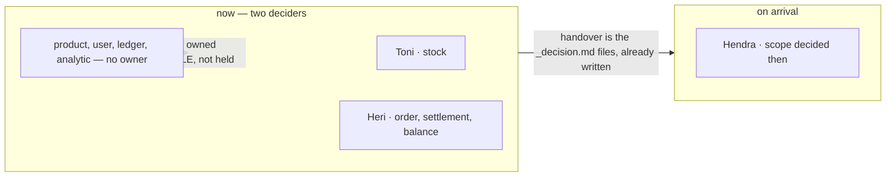
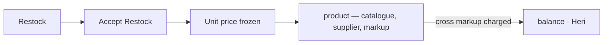
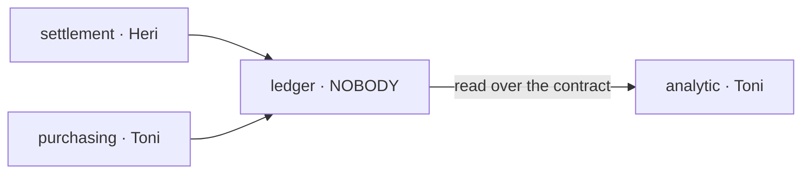
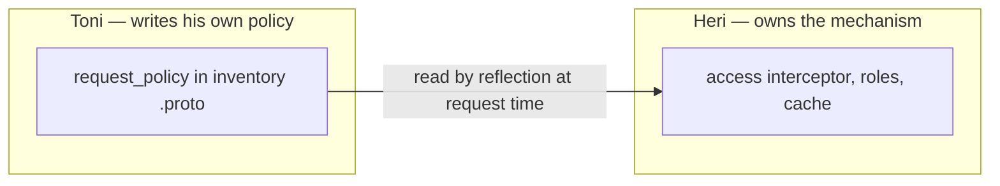
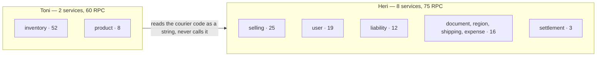
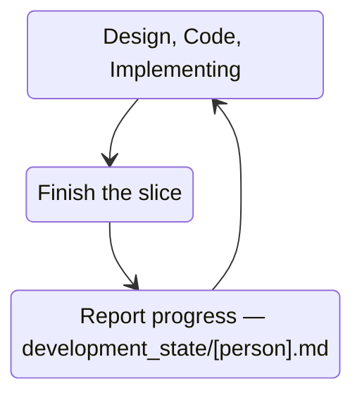
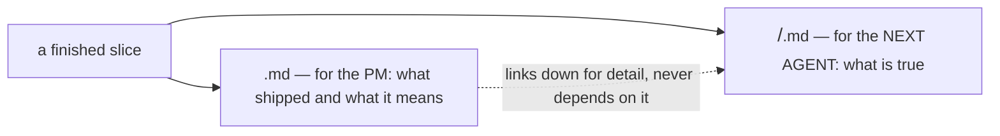

# Decisions — `member.md`

Append-only. What the owner decided, recorded before it is acted on.

## hendra-joins-later

**Decided** in [member.md](./member.md) §Scope Responsbility 3 — *"`Hendra`, Still work legacy, join
later."* — answering *"what is Hendra's scope?"*, which is now deleted from
[member_clarify.md](./member_clarify.md).

**The verdict:** Hendra is a member of this project with **no scope today**, and no date.

**What follows directly, and is binding:**

| | |
| --- | --- |
| the roster is **three**, the people deciding are **two** | Toni and Heri |
| **no context is reserved** for an absent member | a reserved scope and an unowned scope are the same thing for every question asked in between |
| Hendra's scope is decided **on arrival**, not now | it depends on what is still undesigned then, which nobody can name today |



**What it does NOT settle:** who decides `product`, `user`, `ledger` and `analytic` in the
meantime — still open in [member_clarify.md](./member_clarify.md#question).

## products-follow-the-unit-price

**Decided** in [member.md](./member.md) §Scope Responsbility 1 — `Toni` now owns *"Stock &
Inventory"* **and** *"Products"* — answering half of *"who owns the four unowned contexts?"*, which
narrows in [member_clarify.md](./member_clarify.md#question) rather than closing.

**The verdict:** [`product`](../product/context.md) is **Toni's**, with stock.

**Why it holds together:** the whole of §Unit Pricing System is minted at *accept restock* — a
product has no price until it is received — so the catalogue and the receiving desk are one
decision, not two. It was also already true in the code: **`supplier` and `supplier_channel` live
in `inventory_service`**, not in `product_service`, so the supplier half of the product context was
Toni's before this was written down.



**What it changes elsewhere:** the two lanes are no longer even —
Toni holds **60 RPCs / ~9.8k lines**, Heri **40 / ~8.1k**. Not a reason to rebalance: Heri carries
the undesigned half (`ledger`, `analytic`, the cross-service saga) and 4 of the 7 boundary arrows.

**What it does NOT settle:** `user`, `ledger` and `analytic` — still unowned, **12 open questions**
between them. And whether `category_service` rides along with Products
([member_clarify.md Q1](./member_clarify.md#question)).

## analytic-sits-with-stock

**Decided** in [member.md](./member.md) §Scope Responsbility 1 — `Toni` also owns *"Analytic"*.
⚠ **Against my recommendation**, which was to give it to whoever owns the ledger it reads.

**The verdict:** [`analytic`](../analytic/context.md) is **Toni's**.

**The argument for it, which I had underweighted:** analytics is a **reader**. Nothing it does
writes, so it does not need to sit with the data it reports on — and a reader owned by someone other
than the writer is the one arrangement where a metric cannot quietly be redefined to match what the
writer already produces.

**The cost, which is now real and must be paid somewhere:** every metric over Heri's numbers becomes
a **cross-lane contract**. Toni cannot define *"cost of goods sold this week"* without settlement's
and the ledger's agreement on what a row means.



**What follows, and is binding:** the ledger's **read RPC is the contract between the two lanes** —
a `Stat`-shaped read per [guidelines/service-guideline.md](../../../guidelines/service-guideline.md),
not a direct table read from the analytic side. A projection read by another owner cannot be reached
around.

## identity-sits-with-order

**Decided** in [member.md](./member.md) §Scope Responsbility 2 — `Heri` owns *"Users & Role
System"*, which had belonged to neither scope while gating both.

**The verdict:** [`user`](../user/context.md) — identity, roles and the ACL — is **Heri's**.

**Why it is safe despite gating both lanes:** it is the one context that is **already built** —
`request_policy`, the access interceptor, the role cache — so most of what is open there is
ratification, not design. And the ACL is declared **in the `.proto` of the message being guarded**
(`CLAUDE.md`, *the "roling" system*), so Toni writes his own policies in his own files. What Heri
owns is the **mechanism**, not each service's policy.



**What it does NOT settle:** whether `team_service` rides along with Users & Roles
([member_clarify.md Q1](./member_clarify.md#question)). Roles are per-team, so I read yes.

## support-services-sit-with-order

**Decided** in [member.md](./member.md) §Scope Responsbility 2 — `Heri` also owns **Documents**,
**region**, **shipping** and **expense**, the four services the doc had never named.

**The verdict:** `document_service`, `region_service`, `shipping_service`, `expense_service` — 16
RPCs, ~2.5k lines — are **Heri's**.

**✅ Checked, and it creates no new fence into Toni's lane.** The worry was that receiving consumes
them, which would have pointed three new dependencies at the most contested number in the system
(the frozen unit cost). It does not:

| | what `inventory_service` actually does |
| --- | --- |
| `document_service` | **no use at all** — the only hits are the word *"document"* in prose comments |
| `region_service` | **no use at all** |
| `shipping_service` | ⚠ a *string*, not a call — `ShippingCode` and `ShippingCost` are columns on inventory's own `restock_request`. The courier catalogue is read to fill a dropdown, nothing more |

**What it changes:** Heri now owns **8 of the 12 built services** — 75 RPCs and ~13.1k lines against
Toni's 60 and ~9.8k (before the `category` and `team` riders). The four are reference and CRUD, so
the *design* load barely moves; the *surface* does.



## progress-is-reported-per-person

**Decided** in [member.md](./member.md) §Reporting and Documenting The Progress — a finished slice
of *Design, Code, Implementing* is followed by a progress report at
**`docs/development_state/[person].md`**, and the loop repeats.

**The verdict:** progress reporting is **per person**, and it is a **loop**, not a one-off — the
report is the step that closes a slice before the next one starts.



**⚠ What it collides with, and what is still open.** `docs/development_state/` is today addressed by
**coordinate** — `<big_context>/<small_context>.md`, the same coordinates as the owner's two trees,
so one context is one lookup in three files. A per-person file is a **second index over the same
facts**. How the two coexist is proposed, not decided:
[member_clarify.md](./member_clarify.md#the-progress-report-and-the-state-file-are-different-tenses).

## a-report-fires-per-slice

**Decided** by the owner, answering *"is one report a slice or a day?"* — **A: per slice.**
*"its for general summary for Product Manager Review."*

**The verdict:** an entry in `docs/development_state/[person].md` fires **once per finished slice**,
at the same moment the lifecycle's `state_report` fires — after `Audit RPC`. Never on a clock.

**⚠ The reason changes the file more than the cadence does: the reader is a PRODUCT MANAGER, not the
next agent.** That splits the two files by audience as well as by tense, and it is the stronger
split of the two:

| file | reader | reads for |
| --- | --- | --- |
| `development_state/<big>/<small>.md` | the **next agent** | what exists, what does not, what to pick up. Dense, code-facing — the balance one opens by explaining that the business word is `balance` and the code word is `liability` |
| `development_state/<person>.md` | the **product manager** | what got done, what it means, what is next |



**The entry, specified.** It must be readable by someone who will not open the link:

```markdown
## 2026-08-27 · order / draft-promote
**Shipped:** a CS can turn a marketplace draft into a real order without retyping it.
**State:** ✅ done · ⚠ partial · ⛔ blocked — one line of why, in business words
**Next:** receiving
<sub>agent detail: [development_state/order/draft.md](../order/draft.md)</sub>
```

⚠ **An accepted, known gap — recorded so it is not re-litigated.** Per-slice means the file is
**silent while a slice runs**, and *"still working"* and *"stopped"* look identical in it. The owner
took A knowing this: the question being answered is *"what did each person ship"*, not *"how is it
going right now"*. If the second question is ever asked, the answer is the `## Now` block from
option C, not a move to daily entries.
