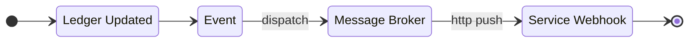
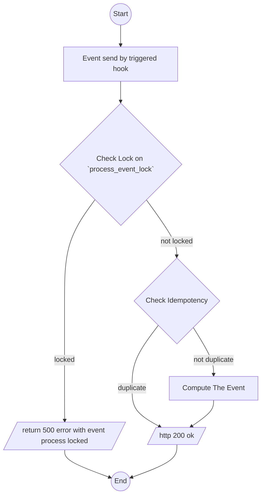
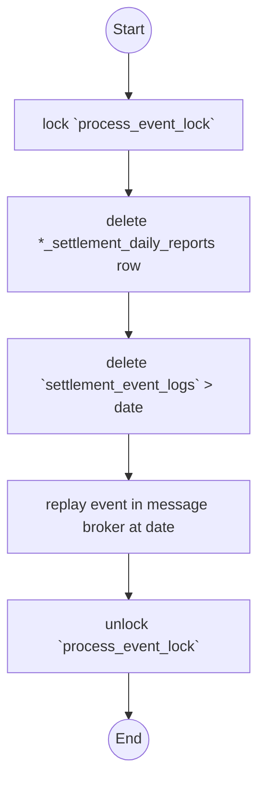

# Settlement Analytical Reports Design.
we serve analitical report of settlements.

## What rpc that Settlement Service Must be Exposed.
### Rpc for Manage Streaming Report.
1. `AnalyticReplayCompute`, When error happen and root need to recompute.
2. `AnalyticMaintenanceRun`, run data maintenance. its used in [maintain table](#idempotency-layer)

### Webhook.
Webhook is used by `Messsage Broker` to trigger event. And further to calculate Analytical Reports.
1. webhook path is `/event/[sub_id]/push`

## How We Calculate the Analytical Reports.
1. General Flow Overview.

### Events.
Event contain:
1. changes of the ledger. its contain new row inserted at `settlement_logs` when change happen.
2. `shop_id`
3. `team_id`
4. `order_created_by_user_id`

## How We Compute inside Hooks.
### We Must Aware Of this
1. **event can be late**.

### Idempotency Layer.
Settlement service have table `settlement_event_logs`.

`settlement_event_logs` have field :
- `id` string, its primary key, its message id from message broker.
- `raw` bytes, content of event.
- `created_at` timestampz, timestamp when event received.

How we check idempotency event.
1. insert to `settlement_event_logs`. 
2. when it fails its mean event already processed.

Table `settlement_event_logs` can be very large. for maintain performance we delete row that have `created_at` older that 1 month.
Its called on `AnalyticMaintenanceRun`


### Flow


How we computed balance when event arrived. We use `fund` for example.
1. extract `created_at` from `settlement_logs`. convert to GMT+7 and get the date as `day`.

2. the day's own row — one atomic statement, no branch, no race

    ```sql
    INSERT INTO shop_settlement_daily_reports AS d
        (day, shop_id, team_id, fund, change, open_balance, close_balance, last_updated)
    VALUES (@day, @shop_id, @team_id, @change, @change,
            COALESCE((SELECT close_balance FROM shop_settlement_daily_reports
                    WHERE shop_id = @shop_id AND team_id = @team_id AND day < @day
                    ORDER BY day DESC LIMIT 1), 0),
            COALESCE((SELECT close_balance FROM shop_settlement_daily_reports
                    WHERE shop_id = @shop_id AND team_id = @team_id AND day < @day
                    ORDER BY day DESC LIMIT 1), 0) + @change,
            now())
    ON CONFLICT (day, shop_id, team_id) DO UPDATE
    SET fund          = d.fund          + @change,
        change        = d.change        + @change,
        close_balance = d.close_balance + @change,
        last_updated  = now();
    ```

3. every later day — a SHIFT, never a recomputation

    ```sql
    UPDATE shop_settlement_daily_reports
    SET open_balance  = open_balance  + @change,
        close_balance = close_balance + @change,
        last_updated  = now()
    WHERE shop_id = @shop_id AND team_id = @team_id AND day > @day;
    ```
4. update `shop_settlement_reports` with latest from daily reports.
5. For other type like `initial_total`, `initial_total_cancel` and other is same. And for `user_settlement_daily_reports` is same too.


## How `AnalyticReplayCompute` works.



## Smallest Grain Reports.
### Daily Reports.
1. `shop_settlement_daily_reports`

    field must exists.
    - `id`, for primary key
    - `day`
    - `shop_id`
    - `team_id`
    - `last_updated`

    field that must indexed:
    - `day`
    - `shop_id`
    - `team_id`
    and its composite unique index.

    there is composite unique.
    - `day`
    - `shop_id`
    - `team_id`

    field that tracked read [this](#field-that-tracked)

2. `user_settlement_daily_reports`
    the user is **who created the order**
    
    field must exists.
    - `id`, for primary key
    - `day`
    - `user_id`
    - `team_id`
    - `last_updated`

    field that must indexed:
    - `day`
    - `user_id`
    - `team_id`
    and its composite unique index.

    there is composite unique.
    - `day`
    - `user_id`
    - `team_id`

    field that tracked read [this](#field-that-tracked)

### Field that tracked.
- `initial_total`
- `initial_total_cancel`
- `other`
- `fund`
- `external_ads_fee`
- `affiliate_fee`
- `marketplace_adjustment`
- `open_balance`
- `close_balance`

### Balance State Reports.
1. `shop_settlement_reports`

    field must exists.
    - `id`, for primary key
    - `shop_id`
    - `team_id`
    - `last_updated`

    field that must indexed:
    - `shop_id`
    - `team_id`
    and its composite unique index.

    there is composite unique.
    - `shop_id`
    - `team_id`

    field that tracked:
    - `close_balance`

2. `user_settlement_reports`
    the user is **who created the order**
    
    field must exists.
    - `id`, for primary key
    - `user_id`
    - `team_id`
    - `last_updated`

    field that must indexed:
    - `user_id`
    - `team_id`
    and its composite unique index.

    there is composite unique.
    - `user_id`
    - `team_id`

    field that tracked:
    - `close_balance`


## How Rpc Api Deliver The Data.


## [defer development] Shape of Reports.

1. Timeframe Shape.

    its have mode:
    - daily
    - monthly
    - yearly

    its have filter:
    - daterange filter
    - team filter
    - shop filter
    - customer service filter

2. Group by Team Shape.

    its have filter:
    - daterange filter

3. Group by Shop Shape.

    its have filter:
    - daterange filter

4. Group by User Shape.

    its have filter:
    - daterange filter


