# Clarity — `analytic_context.md`

What I read out of [analytic_context.md](./analytic_context.md). **That doc is yours — this one is
mine.** Answered points are deleted, so this file is always the current open set. Decisions go in
[context_decision.md](./context_decision.md), one settlement decision log.

## 🔁 This round — two new sections, 2026-09-10

The owner added `## How Rpc Api Deliver Analytical Data.` and
`## How Developer Repairing Analytical Report if error happen.` Both answer things this file was asking.
Both also introduce something new.

### ✅ `system_adjustment` closes the hole the reach decision left open

[the-replay-reaches-31-days-and-that-is-accepted](./context_decision.md#the-replay-reaches-31-days-and-that-is-accepted)
said damage older than the window is repaired *"by other means or not at all"* and did not say which.
**This section says which**, and the shape is right: a replay for what the broker still holds, a written
adjustment for what it does not.

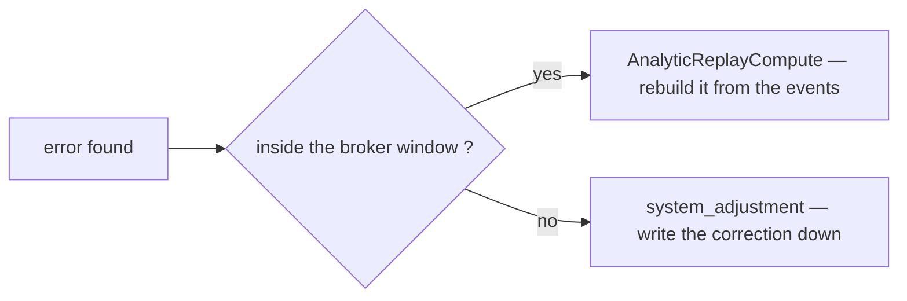

⛔ **But WHERE the adjustment is written is not stated, and the two readings are opposites.**

| | a `settlement_logs` row | a REPORT-table row |
| --- | --- | --- |
| what gets corrected | the ledger | the projection |
| the ledger stays true | ⛔ **no** — a fake movement is inserted to make a derived table look right | ✅ yes |
| `order_id NOT NULL` ([superseded-every-entry-names-an-order](./context_decision.md#superseded-every-entry-names-an-order)) | ⛔ **which order?** A report-level error spans many. There is no legal value | ✅ not needed — the grain is shop-day / user-day |
| `order_settlements.last_balance` | ⛔ **moves for an order that never moved**, and the order detail panel shows a phantom row somebody has to explain | ✅ untouched |
| auditability | ⛔ the repair is indistinguishable from real money | ✅ its own column, visible in every report |

✅ **DECIDED AGAINST THIS (owner, 2026-09-10)** — `system_adjustment` is an eighth `settlement_type`,
so it is a ledger row. **The recommendation below is withdrawn**, kept because the table above still says
what each reading costs — and the one cost that turned out to matter is in
[context_clarify](./context_clarify.md#-system_adjustment-in-the-log-repairs-one-class-of-damage-and-cannot-repair-the-other).

**→ Recommend the REPORT-table reading, explicitly** — a `system_adjustment` column on
`shop_settlement_daily_reports` and `user_settlement_daily_reports`, at the day grain, never a
`settlement_logs` row. **The ledger is the truth and the report is the projection; a projection that is
wrong is repaired in the projection.** Writing the ledger to fix the report inverts the one relationship
the design rests on — and `order_id NOT NULL` already forbids it, so the ledger reading is not merely
worse, it is unbuildable without reversing a decision.

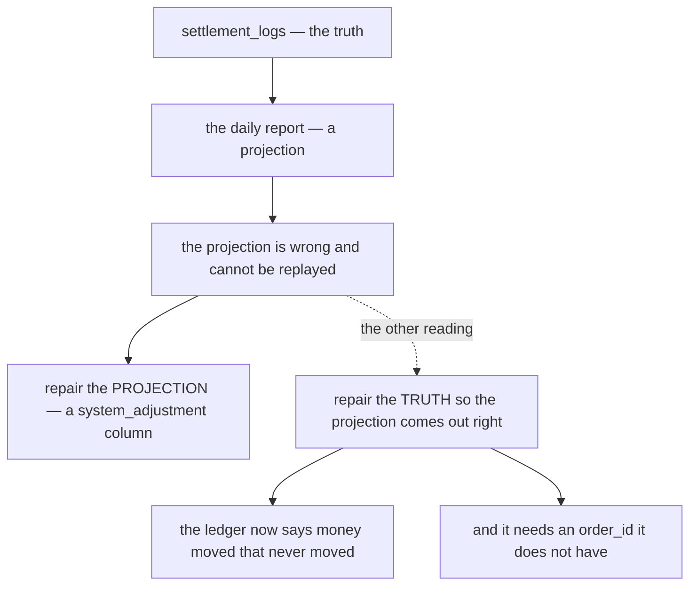

⚠ **Three consequences that follow either way, and the doc states none of them:**

| | |
| --- | --- |
| **it is not in `### Field that tracked.`** | nine entries, and `system_adjustment` is not one. The same drift again — a new case, and the list where every case appears together did not follow (HARD RULE 11) |
| ⛔ **it breaks the reconcile pass by design** | [Q4](#question) proposes checking `close_balance(D) = Σ change WHERE posted_on <= D`. An adjustment living in the report and not the log makes that check fail **forever, on purpose**. It must become `Σ change + Σ system_adjustment` — otherwise the one mechanism that detects drift reports drift permanently and gets switched off |
| **who may write it** | it moves reported money with no event behind it. `[ROLE_ROOT, ROLE_ADMIN]`, unscoped — the set [Critique 7](#critique) already asks for on the other two maintenance RPCs |

### ⚠ *"30 days"* — right to be cautious, wrong to be written down

`## How Developer Repairing…` 1 says *"pubsub that limit event can replay is 30 days"*. Pub/Sub's
**maximum** retention is **31 days** and its **default is 7**. So 30 is safely inside the maximum and
catastrophically outside the default: on a subscription nobody reconfigured, everything between 8 and 30
days old routes to *"run the replay"*, and the replay finds nothing to replay.

**→ Recommend the branch test read the CONFIGURED retention, not a literal** — the same
`message_retention`-in-`settlement_service_metadata` the replay's ceiling already needs
([Awaiting](#awaiting)). One value, two readers, and neither of them a number typed into prose.

### ⛔ The 30-day branch does not cover GENESIS — and the gap is the first month

The flowchart routes on age alone. That is sufficient **once genesis is older than the window**, and it
is not sufficient before that — which is exactly the launch period, when the reports are most likely to
look wrong and *"just rebuild it from the beginning"* is the most likely thing to type.

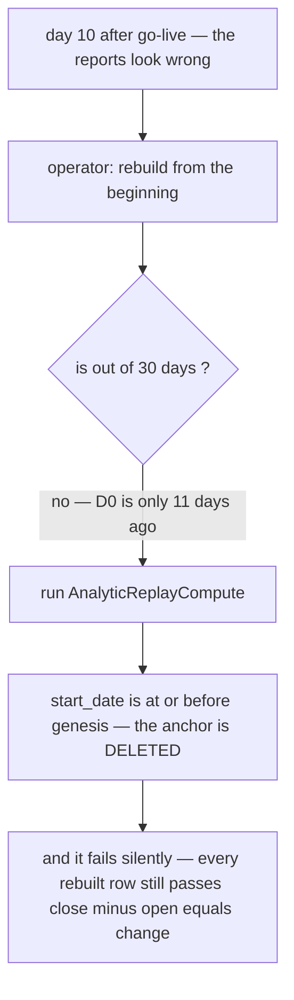

**→ Recommend the floor be a bound on the RPC, not a step in the operator's flowchart.** The two bounds
in [Awaiting](#awaiting) already cover it. What this section adds is that **the age test alone reads as
if they were unnecessary** — and for the first month it is the age test that is wrong.

### ⛔ `## How Rpc Api Deliver Analytical Data.` — the sketch collides with the governed shapes

➡ **ROUTING WATCH — a `rpc_context.md` stub appeared beside these docs (2026-09-10, one heading, no
content).** If the RPC design moves there, this critique moves with it into `rpc_context_clarify.md`
(RULE 7b: a question goes in the clarify of the doc that can ANSWER it, and a doc that gains a
downstream doc re-routes what is misfiled). **Nothing is moved yet** — the stub is empty, and *"RPC
Context Related"* could as easily mean settlement's WRITE surface as the analytic reads. ⚠ One line from
the owner settles which, and it is cheaper to ask than to move this twice.

Not recorded before this round. The section is at the right level of detail; the shapes are a service's
worth of divergence from what is already built and enforced.

| | Problem | → Recommend |
| --- | --- | --- |
| **1** | ⛔ **`Filter { uint64 team_id }` — the server REFUSES TO BOOT.** `ValidateDescriptors()` asserts `use_scope` is a **top-level** uint field. [`list.proto`](../../../proto/warehouse/common/v1/list.proto) records this as a deliberate deviation from the guideline's own drawing, because a scope tag the interceptor cannot see leaves the RPC silently unscoped | **`uint64 team_id = 1 [(use_scope) = true]` on the request message.** `Filter` keeps `date_range`, `user_id`, `shop_id` |
| **2** | ⛔ **Neither request declares `request_policy`, so both are DENIED — to everyone, root included.** [no-role-policy-yet](./context_decision.md#no-role-policy-yet) already recorded that *"no policy" is not a buildable state* | The six-role read set `ExpenseDailyRequest` carries |
| **3** | ⛔ **`Pagination { int64 limit, int64 offset }` is a third pagination model.** `warehouse.common.v1.CommonPagination` is `uint32 page` + `uint32 limit`, capped at **200** by `buf.validate`. Offset appears nowhere in this repo | `CommonPagination`. And `SortType` → **`CommonSortType`**, which exists, with its numbering pinned to the guideline |
| **4** | ⛔ **A paginated time series contradicts the shape the statement screen already reads.** `ExpenseDaily` / `LiabilityDaily` are deliberately UNPAGINATED — the span is the bound, capped at **366 days**, and the caps *"must be identical"* because the series are read side by side. Sorted `DESC` and paged, page 2 is *older days*, which no date spine can merge | **Drop `Pagination` and `SortType` from `AnalyticTimeSearch`** — `{from, to}`, ascending, sparse, one shared cap |
| **5** | ⚠ **`google.protobuf.Timestamp At` on a daily bucket** re-opens [the timezone contradiction](#the-bucket-day-is-derived-twice-in-two-timezones-and-the-two-disagree-for-a-third-of-the-clock) — the table stores a DATE, and a Timestamp renders in the *viewer's* zone | **`string at`** — `2026-08-18` / `2026-08` / `2026`, as every other Daily RPC does |
| **6** | ⚠ **The two-call grouped pattern re-invents `ListResponse`**, which already returns `repeated uint64 ids` **sorted** *and* `items`, in one call. Split, the two calls hit different snapshots under `staleTime: 0` — so a row can rank #1 on a number it no longer shows | **One `SettlementGroupList`** on the governed List shape, the group axis an enum, `data_request` selecting metrics. The split is right when the ids come from a DIFFERENT service — here both halves are one table in one service |
| **7** | ⚠ **`Team Grouped` crosses team scope**, and `team_id` is `use_scope` and required. Only ROOT/ADMIN in team 1 bypass | Declare it an **admin screen** — no new mechanism needed. [Q6](#question) |

### ⭐ And the tracked-field list does not aggregate uniformly — the grouped RPCs walk into it

`### Field that tracked.` is one list of nine, and `TimeframeMetric` returns all nine under one implied
rule. **Two different rules are needed:**

```
initial_total, fund, external_ads_fee, …   →  SUM     (movements)
open_balance, close_balance                →  LAST    (carried positions)
```

⛔ **`Team Grouped` is where this breaks, and it has no table of its own** — it must aggregate the shop
rows, and **those rows are SPARSE**. A shop with no movement on day D has no row on day D, so
`SUM(close_balance) WHERE day = D` silently drops that shop's standing balance from the team total.
Monthly and yearly hit the identical wall: a month's `close_balance` is the **last** row in the month,
never the sum of its days.

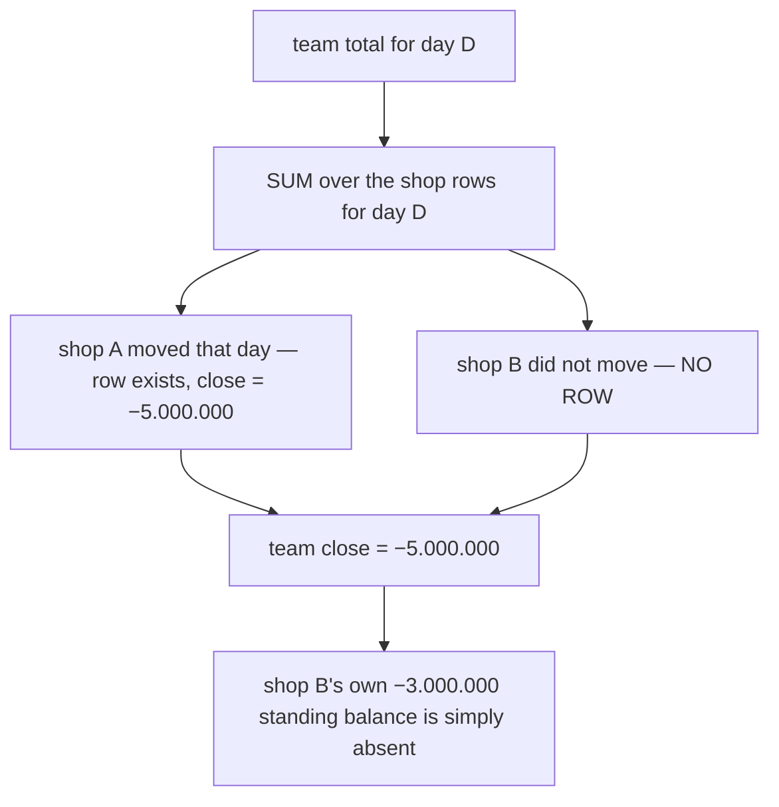

**→ Recommend `### Field that tracked.` be split into `movement` (SUM) and `position` (LAST at-or-before)**,
and every rollup — grain, group, range — state which rule it uses per column. The same HARD RULE 11
shape as the source list and the type list: one table where every case appears together.

---

## What the PREVIOUS round adopted, and what it broke

✅ **The two statements went into the doc verbatim**, and with them **A1–A3, B1–B6, C1 and C2 are
closed** — the syntax runs, `close_balance` has one definition, the cascade is a shift, `prev` filters
`day < @day`, and the `is Event Received late ?` branch is **gone**. ✅ `balance` was dropped from both
tables. ✅ The report shapes are marked `[defer development]`, which parks three of my questions rather
than answering them — the right call while the fold is unfinished.

⛔ **Two schema edits landed in the same pass and both contradict the SQL above them.** This is the
recurring shape HARD RULE 11 exists for: a change to a shared list that the statements depending on it
did not follow.

| | |
| --- | --- |
| ⛔ **`change` was dropped from `field that tracked`, and the adopted statement writes it** | `INSERT … (…, fund, change, open_balance, close_balance, …)` and `SET change = d.change + @change`. Against the declared schema that is **`ERROR: column "change" does not exist`** — the statement cannot run at all. ⚠ It went out with `balance`, which *was* the right one to drop. **→ Recommend `change` comes back**: it is the day's net, and it is the only movement figure `close_balance` needs. `balance` stays gone |
| ⛔ **the composite unique's column ORDER serves neither query** | it is `(day, shop_id, team_id)`, and both statements filter **equality on `shop_id`, `team_id`** with a **range on `day`** — `prev` is `WHERE shop_id=? AND team_id=? AND day < ? ORDER BY day DESC LIMIT 1`, and the cascade is `WHERE shop_id=? AND team_id=? AND day > ?`. With `day` leading, neither can use it. **→ Recommend `(shop_id, team_id, day)`** — identical uniqueness, and it serves the upsert, the `prev` lookup and the cascade. ✅ **It is free**: `ON CONFLICT` infers its index by column **set**, not order, so the adopted statement does not change by a character |

⚠ **And `field that must indexed: day, shop_id, team_id` reads as three single-column indexes.** On a
table only ever queried by all three they earn almost nothing and cost write throughput on every event.
**→ Recommend one composite unique and nothing else for now** — add `(team_id, day)` if and when a
cross-shop report needs it.

✅ **`## How `AnalyticReplayCompute` works.` is written**, and the shape is right — lock, delete, rebuild,
unlock. ⛔ **But it rebuilds by seeking the MESSAGE BROKER**, and against the dedup table and the lock
that is destructive rather than merely different: every replayed message carries its original id, is
recognised as already processed, and is dropped — so the delete succeeds and **nothing is rebuilt**.
[Worked through here](#the-replay-as-drawn--three-self-defeating-interactions).

✅ **And three decisions landed in chat the same day** —
[dedup-and-compute-share-one-transaction](./context_decision.md#dedup-and-compute-share-one-transaction),
[the-event-webhook-is-open](./context_decision.md#the-event-webhook-is-open) and
[the-carry-is-stored-not-derived](./context_decision.md#the-carry-is-stored-not-derived). Two went
against my recommendation and are recorded with what they accept. ⚠ **`### Flow` has not caught up
with the first**: it still draws the dedup **before** the compute, with no transaction boundary and no
advisory lock — so the diagram now contradicts a decision rather than merely worrying me.

⚠ **Step 1 still says `extract created_at … convert to GMT+7`**, directly above SQL that treats `@day`
as a stored date. And `AnalyticReplayCompute`'s `start_date` is *"date with GMT+7"* too, so the same
re-derivation now exists in **two** places —
[the timezone contradiction](#the-bucket-day-is-derived-twice-in-two-timezones-and-the-two-disagree-for-a-third-of-the-clock).

---

## Critique

| | Problem | → Recommend |
| --- | --- | --- |
| **1** | ✅ **SETTLED — one transaction** ([dedup-and-compute-share-one-transaction](./context_decision.md#dedup-and-compute-share-one-transaction)). The mark-then-compute hole is closed: a failure now rolls the dedup row back with the fold, so the redelivery genuinely reprocesses. | ⚠ **What the doc still has to say**: the duplicate test is `ON CONFLICT DO NOTHING` + **rows affected = 0**, never a caught PK violation — a raw constraint error aborts the whole transaction. And `pg_advisory_xact_lock` per scope in a **fixed order** (shop, then user), because one event writes both tables and the shift takes an unbounded row range. |
| **2** | ✅ **SETTLED — the replay clears its range** ([a-replay-deletes-its-range-first](./context_decision.md#a-replay-deletes-its-range-first)), which removes the doubling. ✅ And the user-table half of the data loss is gone too, now that the creator is on the state row. ⛔ **What survives is the genesis anchor**: a `start_date` at or before the genesis day deletes the only record of everything before it, and the re-fold does not read that prehistory either. | **A floor on `start_date`, refused at or below the genesis day** — worked through in [the replay floor](#the-replay-floor--elaborated), where the obvious repair turns out to be wrong. [Q1](#question). |
| **3** | ✅ **SETTLED — `order_settlements.created_by_user_id`** ([the-creator-is-stamped-on-the-state-row](./context_decision.md#the-creator-is-stamped-on-the-state-row)), stamped once when the account opens. It closes all three at once: the live fold, the genesis seed (`GROUP BY created_by_user_id, team_id`) and the replay — the state row survives the DELETE, so the user is available on every replayed row. **The data-loss path is gone.** | ⚠ **It is not free yet.** `selling_service` must record an author on the order first ([`orders`](backend/services/selling_service/selling_service_models/order.go) has no creator column and `AuthorUserID` lives on `order_drafts`), and `SettlementPostRequest` needs the field — **two migrations in two lanes**, and until both land the opening call has nothing to pass. ⚠ And `0` must read as *not recorded*: an account opened by an exporter's `fund` before any `initial_total` has no creator, so the report needs an explicit **unattributed** bucket or its columns will silently fail to sum to the shop report. |
| **4** | ✅ **SETTLED — the webhook is open** ([the-event-webhook-is-open](./context_decision.md#the-event-webhook-is-open)), against my recommendation. The reasoning that makes it survivable is recorded there: a forged POST corrupts a **projection**, not the ledger, and `settlement_logs` is not reachable from this path. | ⚠ **Two things follow and belong in the doc.** **(a)** `AnalyticReplayCompute` is now the **repair path for a reachable failure**, not a maintenance convenience — which is why [Q2](#question) has to be finished. **(b)** The app layer is settled, so the cheap mitigation is at the **ingress**: allow only Pub/Sub's ranges or a service account at the load balancer. No code, contradicts nothing. |
| **5** | ⚠ **A 500 while `process_event_lock` is held feeds the DEAD-LETTER QUEUE with good events.** Pub/Sub counts every non-2xx as a delivery attempt, so a maintenance window longer than `max_delivery_attempts × backoff` dead-letters messages that were never malformed. ⚠ **The replay algorithm makes this reachable rather than theoretical** — a replay is exactly when the lock is held, and exactly when events keep arriving. | **State the maximum safe window**, derived from the subscription's retry policy — or **detach the subscription** during a replay, which stops delivery without consuming attempts. ⚠ Prefer 503 to 500 either way: it is the honest code for *"try later"*. |
| **6** | ✅ **SETTLED — stored** ([the-carry-is-stored-not-derived](./context_decision.md#the-carry-is-stored-not-derived)), against my recommendation. The cascade stays, the `prev` lookup stays, the read is one row. ⚠ **It half-reverses [open-and-close-are-log-sums-at-the-day-boundaries](./context_decision.md#open-and-close-are-log-sums-at-the-day-boundaries)** — the definition survives as the invariant, "no carry" and "rebuildable per day" do not. | ⛔ **What it makes urgent is GENESIS** — a carry's first row anchors the chain, and every live shop already holds balances, so `0` is wrong for all of them and wrong **silently**. **→ Seed day zero from `SUM(order_settlements.last_balance)` per scope at migration time.** That is [Q1](#question), and it is cheap exactly once. |
| **7** | ⚠ **The two RPCs that rewrite or halt everyone's reported money have no policy**, and `AnalyticMaintenanceRun` also deletes dedup rows. `## Access Role.` defers roles ([no-role-policy-yet](./context_decision.md#no-role-policy-yet)) — right for the ledger's reads, wrong for these. | **`[ROLE_ROOT, ROLE_ADMIN]`, unscoped** — service-wide, so per CLAUDE.md an unscoped policy must not carry team-level roles. Same for writing `process_event_lock`. |
| **8** | ⚠ **`last_updated` is a write stamp, not a watermark.** It says when the row was touched, not whether the fold has seen every log row for that day — the state a maintenance window, a replay or a broker outage all leave behind. | **`folded_through` — the highest `settlement_log.id` folded into this row.** It makes *"is this number complete?"* answerable against the log. |

---
## Proposed Design — the fold contract

The parts I would build, drawn against what you have already drawn. Two changes only: **the event
carries a key rather than an amount**, and **open/close are derived**.

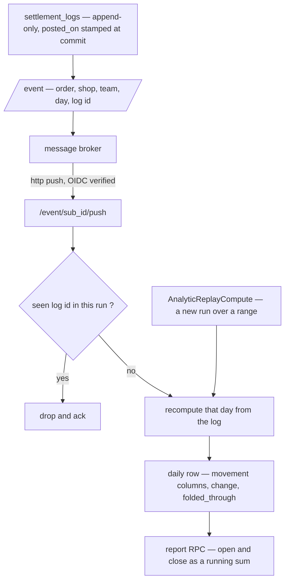

**Why recompute-the-day rather than add-a-delta.** A recompute makes redelivery, reordering and replay
the same harmless operation, so the dedup step becomes an optimisation rather than a correctness
control — and a day is small (one shop, one day, tens of rows). A delta is only correct while every
event arrives exactly once, which is the one thing a broker does not promise.

**Why derived open/close.** `balance` on the log is a running total of `change`, so the decided
snapshot definition is **identically** a running sum of each day's net — same number, no window over
the log, and no chain to repair:

| | stored carry (as drawn) | derived |
| --- | --- | --- |
| a late event | rewrites every later row for that scope | touches ONE row |
| genesis on a shop that already trades | opens at a false `0`, silently, forever | correct with no bootstrap |
| a missed day | understates every later row, permanently | one gap, neighbours unaffected |
| `close − open = Σ movements` | an invariant something must check | an identity that cannot break |
| `InitOpeningBalance` | needed — two writers race on one row | ⛔ **unnecessary** — two recomputes give the same number, and `UNIQUE (day, shop_id, team_id)` settles the insert |
| cost | one read | `SUM() OVER` across ≈365 rows per shop-year |

⚠ **If open/close are derived, `InitOpeningBalance` can be deleted** — with it the cross-service call
held inside the ledger's transaction, and the rollback that refuses to record money because a report
row could not be made ([context Q8](./context_clarify.md#question)).

### The write path, checked statement by statement

`## Flow` now carries real SQL, which is the most checkable thing in any of these docs — so I ran it
against Postgres semantics and the shipped schema rather than reading it. **Three statements do not
execute, and the arithmetic is wrong independently of that.** None of this is a reason to change the
design: the shape — upsert the day, cascade to later days — is right, and the corrected version is
shorter than what is written.

#### A · will not execute

| | the line | why Postgres rejects it |
| --- | --- | --- |
| **A1** | `set d.fund += @fund_change` | **Postgres has no `+=` operator.** It is `SET fund = fund + @change` |
| **A2** | `set d.fund = …`, `set d.close_balance = …` | **the target of `SET` may not be qualified.** `UPDATE t d SET d.x = …` fails with *column "d" of relation "t" does not exist* — the alias is legal everywhere in the statement EXCEPT the left of `SET` |
| **A3** | `values (…, coalesce(prev.close_balance, 0), …)` | **a `VALUES` list cannot see a CTE.** *missing FROM-clause entry for table "prev"*. ⚠ And the obvious repair is a second bug: `INSERT … SELECT … FROM prev` inserts **nothing at all** on a shop's first ever day, because `prev` has no rows and `coalesce` never runs |

#### B · executes, computes the wrong number

| | Problem | → Recommend |
| --- | --- | --- |
| **B1** | ⛔ **`d.fund` appears TWICE in the `close_balance` sum** — in step 2 and in both halves of step 4. The day's fund is counted twice in every close balance the fold writes. | Never re-derive `close_balance` from a list of columns. See [the shape that removes the whole class](#the-write-path-fixed) — the long sum is what makes this invisible, and it is not needed. |
| **B2** | ⛔ **Step 2 drops the carry, so the SECOND event of a day silently un-does step 3.** Step 3 inserts `close_balance = prev.close + @fund` — carried. Step 2 recomputes `close_balance = Σ movement columns + @change` — **no `open_balance` term**. So a day is correct until its second movement arrives and then loses every rupiah of prior position, permanently. ⚠ This is the single most damaging line, because the row still *looks* internally consistent. | `close_balance = open_balance + change`, maintained by increment. |
| **B3** | ⛔ **Step 4 assigns the SAME expression to `open_balance` and `close_balance`.** Every later day ends with `open == close`, which says the day had no movement — and it breaks `close − open = Σ movements` for every row it touches. | A late event **shifts** both by the same amount, it does not recompute either. |
| **B4** | ⛔ **Step 4 rebuilds each later day from that day's OWN movement columns plus `@fund_change`** — so all accumulated position from every earlier day is discarded on every late event. Day 200's close becomes *day 200's movements + one change*. | Same fix as B3: `open_balance = open_balance + @change`. |
| **B5** | ⛔ **`prev` has no `day < @day` filter.** `order by day desc limit 1` is the *latest* row, not the *previous* one — so a late event creating a missing past day opens from a FUTURE day's close. | `and d.day < @day`. One line, and it is the difference between a backfill that repairs and one that corrupts. |
| **B6** | ⚠ **`change` is written by no statement, and `open_balance` is written by no update.** Both are declared as tracked fields. `last_updated` is maintained, which is what makes the omission easy to miss. | Maintain `change` as the day's net — then it is the only movement figure the close balance needs. |

#### C · executes, right number, wrong behaviour

| | Problem | → Recommend |
| --- | --- | --- |
| **C1** | ✅ **FIXED this round** — the doc now says *"when in step 2 returning **row** is 0"*, which is the affected-row count and is correct. Kept as one line so nobody reintroduces it: an `UPDATE … RETURNING` matching nothing returns zero ROWS, never a row containing `0`. | ⚠ Simpler still as one `INSERT … ON CONFLICT DO UPDATE` — then there is no branch to get right. |
| **C2** | ⛔ **Update-then-insert is check-then-act, and two events for one new day race.** Both update, both match nothing, both insert — one gets a unique violation. It is *safe* only because `UNIQUE (day, shop_id, team_id)` exists, and only if the loser retries, which nothing says it does. The broker will redeliver on the 500, so it works by accident. | The upsert is atomic and needs no retry. |
| **C3** | ⛔ **PROMOTED to [Critique 2](#critique)** — it is no longer *"nothing says"*. `### Idempotency Layer.` now specifies the order, and it is the losing one: **mark first, compute second**, so a compute that fails after the mark commits is redelivered, recognised as done, and dropped. | One transaction, `INSERT … ON CONFLICT DO NOTHING`, duplicate = 0 rows affected. Full working in [Critique 2](#critique). |
| **C4** | ⚠ **The cascade takes an unbounded row-range lock and can deadlock against a second late event.** `day > @day` for one shop can be hundreds of rows, and two late events at different days lock overlapping ranges in different orders. This is precisely what `san_race` exists to catch. | Serialize per `(shop_id, team_id)` — the broker's ordering key, or a `pg_advisory_xact_lock` on the pair. Then the cascade cannot interleave with itself. |

#### D · and the day is derived twice, two different ways

⛔ **Step 1 derives `day` from `created_at` converted to GMT+7. The report was decided to bucket on
`posted_on`** ([posted-on-buckets-the-report](./context_decision.md#posted-on-buckets-the-report)) — and
`posted_on` is `DATE NOT NULL DEFAULT CURRENT_DATE` in the shipped migration
([00001_create_settlement_ledger.sql:62](backend/services/settlement_service/db_migrations/00001_create_settlement_ledger.sql#L62)),
stamped `time.Now()` in Go ([post_entry.go:201](backend/services/settlement_service/settlement_v1/post_entry.go#L201)),
with **no timezone configured anywhere in the repo** — so it lands on the UTC date.

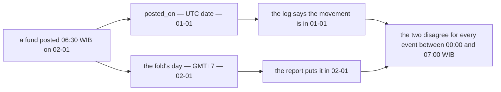

**→ Recommend the fold read `posted_on` and never re-derive a day**, and `posted_on` be stamped as the
**Jakarta** date at write. A bucket day computed in two places is a bucket day that will disagree the
first time either place is touched — and the whole reason `posted_on` is a stored column is that the
answer should exist once.

#### E · is it safe for a LATE event? — traced with numbers

**No — and step 4 is the smaller of the two reasons.** Three of the four statements are wrong
*specifically* in the late case, and one of them undoes any repair the others make.

**The setup.** Shop 7, team 3, three days already folded and correct:

| day | the day's movement | `open_balance` | `close_balance` |
| --- | --- | ---: | ---: |
| 01-01 | `initial_total` −120,000 | 0 | −120,000 |
| 01-02 | `fund` +100,000 | −120,000 | −20,000 |
| 01-03 | `external_ads_fee` −10,000 | −20,000 | −30,000 |

**The event.** A `fund` of **+50,000** whose day is **01-01**, delivered now. Every later day's position
should move by +50,000, and nothing else should change.

**Step 2, on 01-01** — `fund` 0 → 50,000, then
`close = fund(0) + initial_total(−120,000) + … + fund(0) + 50,000` = **−70,000**. ✅ Correct — and
correct *by luck*: `open_balance` was 0 so omitting it cost nothing, and `fund` was 0 so counting it
twice cost nothing. **Both bugs are invisible on exactly the row a test would check first.**

**Step 4, on 01-02 and 01-03** — each later row is rebuilt from **its own movement columns**, not from
its existing position:

| | as the query computes it | what it should be |
| --- | ---: | ---: |
| 01-02 `close` | `fund(100,000) + fund(100,000) + 50,000` = **250,000** | 30,000 |
| 01-02 `open` | same expression = **250,000** | −70,000 |
| 01-03 `close` | `ads(−10,000) + 50,000` = **40,000** | 20,000 |
| 01-03 `open` | same expression = **40,000** | 30,000 |

⛔ **A shop that is owed 70,000 now reports having received 250,000** — the sign flips. And because both
columns get the same expression, `close − open = 0` on every repaired row: the report states that a day
carrying 100,000 of `fund` had no movement at all.

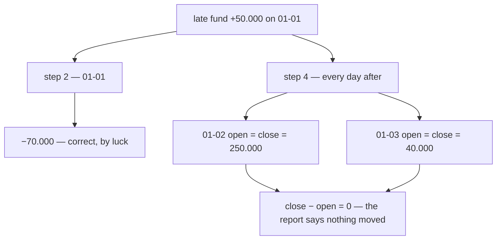

**And two more that only bite when an event is late:**

| | |
| --- | --- |
| ⛔ **step 3 carries from a FUTURE day** | `prev` is `order by day desc limit 1` with **no `day < @day`**. On a late event for a day that has no row yet — a quiet day, or one the fold missed — the "previous" row is a *later* one, so the new past day opens from a future close. This is wrong **only** in the late case, which is why it reads as harmless |
| ⛔ **step 2 ERASES step 4** | step 2 recomputes `close_balance` from the day's own movement columns with **no `open_balance` term**. So the next ordinary event that lands on 01-02 wipes the shift step 4 just wrote. ⚠ **This holds even if step 4 is corrected** — the repair is only as durable as the next event on that row |

**The root cause is one thing, and it is not lateness.** `close_balance` has **three different
definitions** across three statements:

| | says `close_balance` is |
| --- | --- |
| step 3 (insert) | `prev.close + change` — **carried** |
| step 2 (update) | `Σ the day's own movement columns` — **not carried** |
| step 4 (cascade) | `Σ the day's own movement columns + one change` |

A column defined three ways cannot be repaired by a fourth statement. **Fix the definition and lateness
stops being a special case** — see [the write path, FIXED](#the-write-path-fixed):

- **step 2 increments**: `close_balance = close_balance + @change`, never a re-derivation.
- **step 4 shifts**: `open_balance = open_balance + @change, close_balance = close_balance + @change`.
- **step 3 filters**: `and day < @day`.
- **all of it in ONE transaction**, or a cascade that fails leaves later days stale with nothing to notice.

⚠ **Then the `is late` test disappears** — `day > @day` matches nothing for an on-time event, so the
cascade can run unconditionally. ✅ **And ordering stops mattering**: once every write is a delta rather
than an absolute, two events interleaving compose to the same answer. What is still owed is a
`pg_advisory_xact_lock` on `(shop_id, team_id)` — two range updates over overlapping rows can still
deadlock if their scan orders differ, and that is a `san_race` case, not a review one.

### The write path, FIXED

> A drop-in replacement for `## How We Compute inside Hooks.`

**Yes, it is fixable, and it gets shorter.** Everything below is a proposal *for* your doc (RULE 7b —
I do not edit it): lift it wholesale if you agree with it. ⚠ **Reviewed against Postgres semantics, not
executed** — Docker was not running here. It should be run once before it is built on.

**The single change that fixes most of it**: `close_balance` stops being *re-derived from the movement
columns* and becomes *maintained by increment*. Three statements each carrying their own definition of
one column is what made every other defect possible.

| the invariant | |
| --- | --- |
| `change` | the sum of the day's own movements |
| `close_balance` | `open_balance + change` — **always**, by construction |
| `open_balance` | the previous day's `close_balance` |

#### The flow

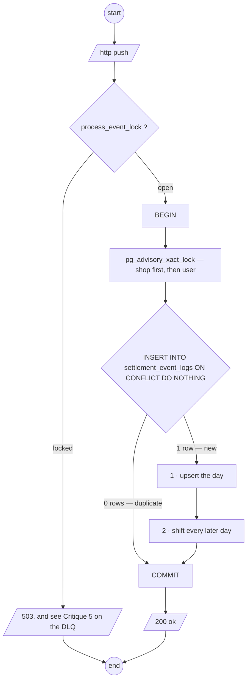

⚠ **The dedup insert is INSIDE the transaction**, which is the whole point: a compute that fails rolls
the mark back with it, so the redelivery reprocesses instead of being dropped as done (Critique 2). And
it is `ON CONFLICT DO NOTHING` + rows-affected, **never a caught PK violation** — a raw constraint error
aborts the transaction, so the "catch it and carry on" shape cannot work here.

⚠ **Two advisory locks, always in the same order** (shop, then user), because one event updates both
report tables. A fixed order is what stops two events deadlocking against each other; taking them in
whatever order the code happens to reach is how a deadlock appears only under load.

#### 0 · the day

```
day := settlement_logs.posted_on        -- read, never re-derived
```

Not `created_at` converted to GMT+7. `posted_on` is a stored `DATE`, and the report was decided to
bucket on it — deriving it a second time is
[the timezone contradiction](#the-bucket-day-is-derived-twice-in-two-timezones-and-the-two-disagree-for-a-third-of-the-clock).
⚠ Which leaves one thing to settle: `posted_on` is stamped `CURRENT_DATE` on a server with no timezone
configured, so it is the **UTC** date. It should be the **Jakarta** date.

#### 1 · the day's own row — one atomic statement, no branch, no race

```sql
INSERT INTO shop_settlement_daily_reports AS d
       (day, shop_id, team_id, fund, change, open_balance, close_balance, last_updated)
VALUES (@day, @shop_id, @team_id, @change, @change,
        COALESCE((SELECT close_balance FROM shop_settlement_daily_reports
                   WHERE shop_id = @shop_id AND team_id = @team_id AND day < @day
                   ORDER BY day DESC LIMIT 1), 0),
        COALESCE((SELECT close_balance FROM shop_settlement_daily_reports
                   WHERE shop_id = @shop_id AND team_id = @team_id AND day < @day
                   ORDER BY day DESC LIMIT 1), 0) + @change,
        now())
ON CONFLICT (day, shop_id, team_id) DO UPDATE
   SET fund          = d.fund          + @change,
       change        = d.change        + @change,
       close_balance = d.close_balance + @change,
       last_updated  = now();
```

- **`day < @day`** in both subqueries — without it a late event opens its day from a *future* close.
- **A scalar subquery is legal inside `VALUES`**, so no CTE, and no *"insert nothing on the shop's
  first day"* trap.
- **`ON CONFLICT` replaces the update-then-check-rowcount-then-insert dance** — atomic, no branch, and
  the concurrent-insert race cannot occur.
- Only the movement column changes per type — `fund` here, `initial_total` elsewhere. One statement
  with a substituted column name, not seven statements.

#### 2 · every later day — a SHIFT, never a recomputation

```sql
UPDATE shop_settlement_daily_reports
   SET open_balance  = open_balance  + @change,
       close_balance = close_balance + @change,
       last_updated  = now()
 WHERE shop_id = @shop_id AND team_id = @team_id AND day > @day;
```

⚠ **Run it unconditionally — the `is Event Received late ?` test is not needed.** `posted_on` can never
be in the future, so for an on-time event `day > @day` matches no rows and this is a no-op. The `WHERE`
clause already knows what the branch was trying to decide.

✅ **And because every write is now a delta, ORDER STOPS MATTERING.** Two events interleaving compose to
the same answer, a repair is no longer erased by the next ordinary event on the same row, and the whole
class of *"which statement ran last"* bugs is gone.

#### 3 · the same two statements again for `user_settlement_daily_reports`

Substituting `user_id` for `shop_id`, in the same transaction. ⚠ The user is
`order_created_by_user_id` — which is on the event and on no table, so a replay cannot reproduce it
([Critique 3](#critique)).

#### What each change repairs

| defect | fixed by |
| --- | --- |
| **A1** `+=` is not a Postgres operator | `SET col = col + @change` |
| **A2** `SET d.col` is rejected | unqualified target |
| **A3** `VALUES` cannot see a CTE | scalar subquery |
| **B1** `d.fund` counted twice | the long sum is gone entirely |
| **B2** the second event of a day wipes the carry | `close_balance` is incremented, never re-derived |
| **B3/B4** the cascade rebuilds later days from their own columns | it shifts them |
| **B5** `prev` carries from a future day | `day < @day` |
| **B6** `change` written by nothing | maintained in statement 1 |
| **C1** branching on a rowcount | no branch — one upsert |
| **C2** concurrent insert race | `ON CONFLICT` |
| **C3** mark-then-compute loses events | dedup insert inside the transaction |
| **C4** cascade deadlock | advisory lock per scope, fixed order |
| **D** the day derived twice | read `posted_on` |
| **E** every late-event failure above | all of the above — lateness stops being a case |

#### What this does NOT fix, stated so it is not assumed

| | |
| --- | --- |
| ✅ **replay doubling** | **settled** — the replay deletes the range first ([the-replay-cuts-three-tables-on-one-line](./context_decision.md#the-replay-cuts-three-tables-on-one-line)), so the increment is applied to an empty range |
| ✅ **it is still a carry** | **settled and kept** — [a-past-date-position-is-a-real-screen](./context_decision.md#a-past-date-position-is-a-real-screen) confirmed a reader, so statement 2, the `prev` lookup and the genesis seed are paid for |
| ✅ **the webhook is unauthenticated** | **accepted deliberately** — [the-event-webhook-is-open](./context_decision.md#the-event-webhook-is-open) |
| ⛔ **the `prev` lookup can lose an update** | two folds on one shop, one late and one live, and neither sees the other's row ([Q2](#question)). No statement fixes it — it is a lock-ordering decision |


### `AnalyticReplayCompute` — the algorithm your own statements already imply

`## How we do AnalyticReplayCompute.` stops at *"1. define `start"*. **Nothing new is needed to finish
it** — the two statements you adopted already do the work, provided the range is cleared first. And it
is what gives `process_event_lock` a real purpose rather than a maintenance-only one.

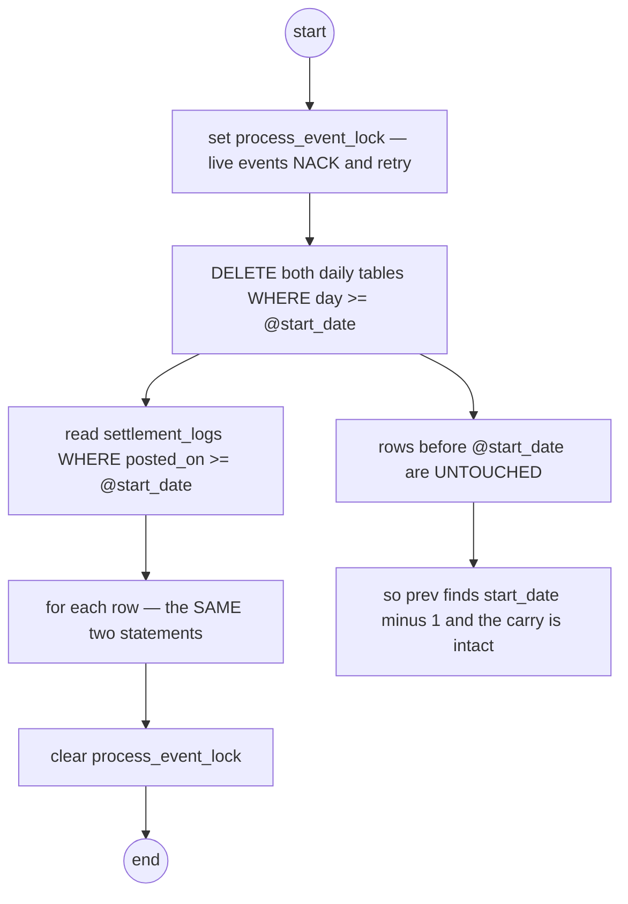

| step | |
| --- | --- |
| **1** | take `process_event_lock`, so a live event cannot fold into a range being rebuilt |
| **2** | `DELETE FROM shop_settlement_daily_reports WHERE day >= @start_date` — and the same for the user table. ⚠ **No scope filter**: `start_date` is the only payload field, so this is every shop and every team. Say that out loud, because it is a full-table operation |
| **3** | read `settlement_logs` where `posted_on >= @start_date` and apply **statement 1 then statement 2** to each row, exactly as the hook does |
| **4** | release the lock |

**Why deleting first is what makes it correct**, and it follows from the shape rather than from care:

| | |
| --- | --- |
| ✅ **the carry survives** | `@start_date − 1` is not deleted, so `prev` finds a real row and the rebuilt range opens from the true position. **Genesis is not re-created** — which is the one thing a full rebuild usually gets wrong |
| ✅ **order does not matter** | every write is now a delta, so replaying the log in any order composes to the same answer. No `ORDER BY posted_on` is required for correctness — only for the cascade to be a cheap no-op |
| ✅ **it is re-runnable** | run it twice and the second run deletes what the first built. An interrupted replay is repaired by running it again, which is the property the RPC exists for |
| ⛔ **without the delete it DOUBLES** | the statements increment. This is [Q2](#question), and it is the difference between a repair tool and a corruption tool |

⚠ **Three things the algorithm cannot do, and they are properties of the data, not of the code:**

- ⛔ **it cannot rebuild `user_settlement_daily_reports`.** The user is `order_created_by_user_id`, which
  is on the event and on no table — so a replay from the log has no user to group by
  ([Critique 3](#critique)). Until it is persisted, replay covers the shop table only, and the doc
  should say so rather than implying both.
- ⚠ **the reports are WRONG while it runs**, not merely stale — the range is deleted and refilling. A
  reader during a replay sees zeros. `process_event_lock` stops writes, not reads.
- ⚠ **it holds the lock for the length of the rebuild**, which is where [Critique 5](#critique) bites:
  every live event NACKs and burns a delivery attempt for the whole window.

⚠ **`start_date` is *"date with GMT+7"*, which re-derives the bucket day a second time** — the doc now
converts a timezone in two places. See
[the timezone contradiction](#the-bucket-day-is-derived-twice-in-two-timezones-and-the-two-disagree-for-a-third-of-the-clock);
a replay whose date boundary disagrees with the fold's rebuilds the wrong range by one day.

### The replay as drawn — three self-defeating interactions

✅ `## How `AnalyticReplayCompute` works.` is written, and the shape is right: lock → delete → rebuild →
unlock. ⛔ **But `replay event in message broker at date` is a different mechanism from the one that was
decided**, and against the dedup table and the lock it is not merely different — it is destructive.

⚠ **I had assumed the other implementation.** My earlier warning was that a replay *doubles*, on the
reasoning that it re-publishes under new message ids. Replaying **in the broker** redelivers the *same*
messages with the *same* ids, so the failure inverts: not double, **nothing**.

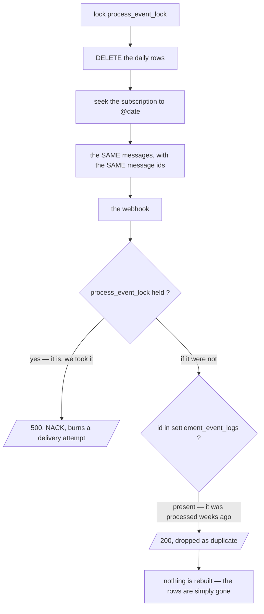

| | the interaction | → Recommend |
| --- | --- | --- |
| **1** | ⛔ **The dedup table drops every replayed message.** `settlement_event_logs.id` **is** the broker's message id, and a broker replay redelivers the same ids — so each one is recognised as *already processed* and ACKed without computing. **The DELETE succeeds and the rebuild is a no-op.** ⚠ It is not a narrow window: `AnalyticMaintenanceRun` keeps dedup rows for a month, so any replay of the last month is a guaranteed wipe. | **Re-fold from `settlement_logs`, not from the broker** — the source is a table this service owns, it goes back years, and it needs no dedup at all because the delete already cleared the range. ⚠ If the broker replay is kept, the dedup key must become `(message_id, run_id)` so a replay is a new run. |
| **2** | ⛔ **The lock rejects the replay's own traffic.** Every redelivered message arrives at the same webhook, which checks `process_event_lock` **first** — and the replay is holding it. Each one gets a 500, NACKs, backs off, and burns a delivery attempt toward the dead-letter policy. The lock that exists to protect the rebuild is what prevents it. | **The rebuild must not re-enter the webhook.** A `settlement_logs` re-fold runs inside the RPC and never touches the lock's path — which removes this interaction rather than working around it. |
| **3** | ⚠ **`delete *_settlement_daily_reports row` has no predicate and no floor.** [a-replay-deletes-its-range-first](./context_decision.md#a-replay-deletes-its-range-first) says `day >= @start_date`; the diagram says *"delete row"*. If it means every row, the genesis anchor goes with them, and every rebuilt day opens at `0`. | **`WHERE day >= @start_date`, and refuse `start_date ≤ genesis_day`** — [the replay floor](#the-replay-floor--elaborated). ⚠ And **the delete and the rebuild must cover the same range**, or the prehistory lands in neither. |
| **4** | ⚠ **Broker retention bounds how far a replay can reach.** Pub/Sub keeps acknowledged messages for **7 days** by default (31 at most, and only if configured). A replay dated older than that deletes rows and has nothing to seek to. ⚠ This is the exact reason [the-report-is-the-pipeline-from-day-one](./context_decision.md#the-report-is-the-pipeline-from-day-one) already owed *"the fold must be re-runnable from the log, because Pub/Sub retains messages for days and a definition change needs years"*. | Same fix as 1 — the log has no retention window. |
| **5** | ⚠ **A seek is asynchronous, so `unlock` runs before the replay finishes.** The diagram unlocks immediately after triggering the replay; the messages arrive over the following minutes. Nothing tells the RPC the rebuild is done, and the lock is released while it is still in flight. | A synchronous re-fold ends when it ends — the RPC returns when the work is complete, which is also what makes it re-runnable. |

#### → The version that keeps everything already decided

Only one box changes.

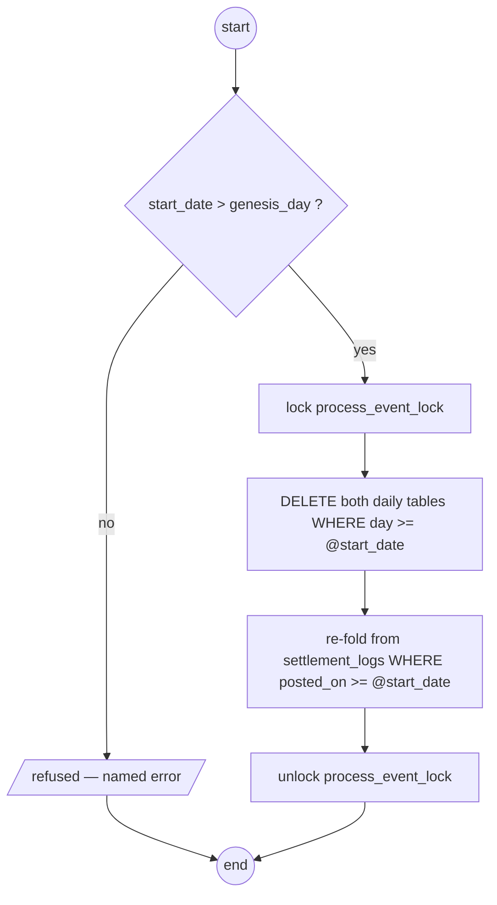

| | as drawn | with the log as the source |
| --- | --- | --- |
| what the rebuild reads | the broker, at a date | `settlement_logs`, a table this service owns |
| how far back | 7 days, silently | all of it |
| the dedup table | ⛔ drops every message — nothing is rebuilt | not involved; the delete already cleared the range |
| the lock | ⛔ rejects the replay's own traffic | never on the path |
| when it is finished | unknowable — the seek is async | when the RPC returns |
| ordering | whatever the broker delivers | irrelevant — every write is a delta |

⚠ **`settlement_logs` carries everything the fold needs**: `change`, `settlement_type`, `posted_on`,
`shop_id`, `team_id` — and the creator by joining `order_settlements`
([the-creator-is-stamped-on-the-state-row](./context_decision.md#the-creator-is-stamped-on-the-state-row)),
whose rows the delete does not touch. **Nothing about a log re-fold needs the broker.**

---
### ✅ The carry is SETTLED — what survives is two smaller things

[a-past-date-position-is-a-real-screen](./context_decision.md#a-past-date-position-is-a-real-screen)
answered it: a screen reads a shop's position at a past date, so `open_balance` / `close_balance` stay
and the cascade, the genesis seed, the floor and the reseed are paid for. **The long argument for
dropping them is deleted** — it was answered. The three requirements the answer creates (the gap-day
fallback, the label, the reconcile query) are written into the decision.

Two things it did **not** cover, both small:

#### ⚠ The USER table's carry was not part of the answer

The question and the answer were both about a **shop**. `user_settlement_daily_reports.close_balance` is
a different number wearing the same name: *one CS person's lifetime running total of hidden platform
cost*.

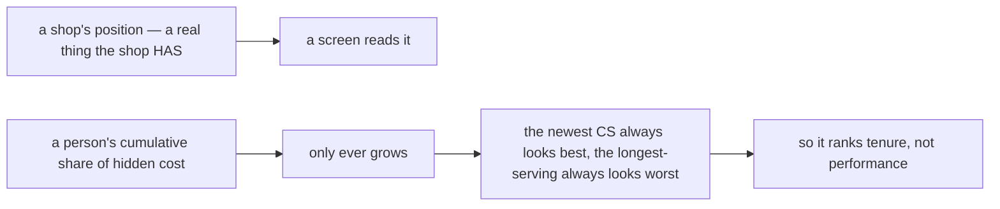

**→ Recommend dropping `open_balance` / `close_balance` from the user table only**, keeping the per-day
movement columns. A window's `gap` and `take_rate` compare people fairly; a lifetime running total
cannot. ⚠ It also halves the cascade — statement 2 stops running on the user table, which is the busier
of the two, since one CS touches many shops. Keep them only if the same past-date screen exists per
person.

#### ⚠ `orders` is still missing from both tables

[the-measure-is-sales-received-and-gap](./context_decision.md#the-measure-is-sales-received-and-gap)
names `orders` — *distinct `order_id` with a live sale in the window* — and neither table has it. No sum
of movement columns reconstructs it: a day with one 10-million order and a day with fifty small ones are
indistinguishable.

It folds with a plain `+=`, exactly parallel to `sales`:

| event type | `orders` | `sales` |
| --- | --- | --- |
| `initial_total` | `+1` | `−Σ change` |
| `initial_total_cancel` | `−1` | `−Σ change` |
| everything else | untouched | untouched |

One `initial_total` per order and at most one cancel, so the counter is exact — no `DISTINCT`, no second
table. ⚠ **One price, already decided and not new:** under
[posted-on-buckets-the-report](./context_decision.md#posted-on-buckets-the-report) a cancel can post in a
later window than its sale, so a single day's `orders` can read negative and a range sum is a net rather
than a distinct count. That is the movement-dated trade already recorded.

**→ Recommend `orders` be added to `field that tracked` on both tables**, in the same edit that puts
`change` back (see [Contradiction](#contradiction)).


---
### What the replay DELETES — elaborated

`delete *_settlement_daily_reports row` is one box with no predicate, and
[the-replay-seeks-the-broker](./context_decision.md#the-replay-seeks-the-broker) makes it carry the whole
correctness of the rebuild. **Three tables, one predicate, one transaction.**

#### ⭐ The dedup table should carry `day` — and then everything uses ONE predicate

⚠ **This supersedes my earlier recommendation of a generation counter** (`run_id`). Working it through, a
generation is machinery for something a column already gives you.

`settlement_event_logs` has `id`, `raw`, `created_at` — no `day`. **Add `day`**, written by the handler
from the log row it just folded. Then the replay is one predicate applied three times:

```sql
BEGIN;
  DELETE FROM shop_settlement_daily_reports  WHERE day >= @start_date;
  DELETE FROM user_settlement_daily_reports  WHERE day >= @start_date;
  DELETE FROM settlement_event_logs          WHERE day >= @start_date;
COMMIT;
-- then seek the subscription to @start_date 00:00 WIB
```

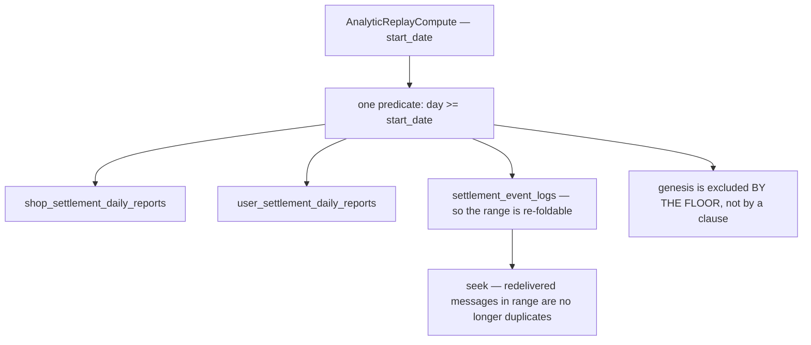

#### ✅ Why this is better than a generation counter — the straddler handles itself

The awkward case was a movement whose transaction starts before Jakarta midnight and **publishes after**:
the seek redelivers it, but its day is outside the range and its report row was never deleted. I
recommended a handler-side guard for it. **With `day` on the dedup row, no guard is needed:**

| the redelivered message | its dedup row | what happens | |
| --- | --- | --- | --- |
| `day >= start_date` | **deleted** with the range | not a duplicate → **recomputed** | ✅ its report row was deleted too |
| **a straddler**, `day = start_date − 1` | **survives** — it is outside the predicate | recognised as a duplicate → **dropped** | ✅ its report row was never deleted |
| a live event arriving mid-replay | none yet | folded once, dedup row written | ✅ and the seek's later copy of it is then dropped |
| an ordinary NACK retry inside the range | deleted | reprocessed | ✅ correct — its report row is gone too |

**The dedup table and the report tables are cut on the same line, so they cannot disagree.** The guard,
the generation column and the "is this message in range" question all disappear into one predicate.

#### ⛔ The three deletes must be ONE transaction

If the report rows are deleted and the dedup delete then fails, the seek redelivers into a table that
still says *already processed* — **every message is dropped and the range stays empty**. That is the
same total-wipe failure, reached by a partial commit instead of a missing feature.

#### ⛔ A retention gap that exists right now

`AnalyticMaintenanceRun` deletes dedup rows older than **1 month**, and the broker retains messages for
up to **31 days**. Those are the same number, which is the one value they must not share:

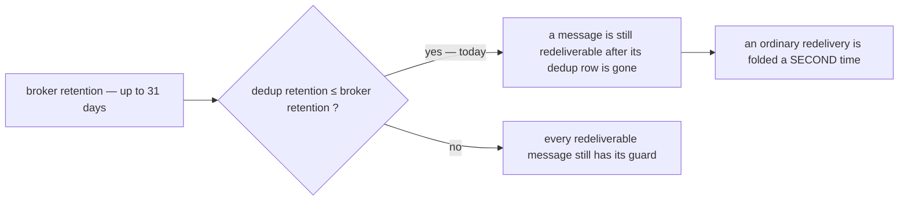

**→ Recommend dedup retention be strictly greater than broker retention** — 45 days against 31. It costs
rows nobody reads and it closes a double-count that needs no replay to trigger, only a slow retry near
the boundary.

#### What is NOT deleted

| | |
| --- | --- |
| **the genesis row** | excluded **by the floor**, not by a clause — `start_date > genesis_day` ([Q2](#question)) means `day >= start_date` can never reach it. One rule, not two |
| `settlement_logs` | the evidence the whole report is derived from |
| `order_settlements` | including `created_by_user_id` — the replay **depends** on it surviving, since the log carries no creator |
| **days in range with no events** | deleted and correctly never recreated — a day with no movement has no row, and the `prev` lookup skips it |

#### ⚠ Two things this leaves, both small and both real

- **An index on `settlement_event_logs (day)`** — the delete is now a range scan over every event in the
  window, which is the largest of the three by far.
- **Nothing stops a SECOND replay starting while the first is still in flight.** The seek is
  asynchronous and the replay deliberately does not hold `process_event_lock`
  ([the-replay-seeks-the-broker](./context_decision.md#the-replay-seeks-the-broker)), so a second call
  would delete a range that is mid-rebuild. **→ Recommend a distinct `replay_in_progress` marker that
  refuses a second replay without rejecting webhook traffic** — the maintenance lock cannot serve this,
  because blocking the webhook is exactly what it must not do here.

---
### If the seek is a Jakarta day too

**Yes — and it kills the seven-hour class outright.** `start_date` becomes one value with one meaning:
the delete takes `day >= start_date`, the seek takes `start_date 00:00 WIB`, and nobody has to hold two
timezones in their head. That is strictly better than what is drawn.

⚠ **What it does NOT do is make the two sets equal.** They are measured on different clocks, and lining
up the *labels* does not line up the *instants*.

#### The two clocks, and which way they can slip

| | |
| --- | --- |
| the fold's `day` | derived from `settlement_logs.created_at`, which is `NOW()` — **transaction START time** in Postgres |
| the seek | selects by **publish time**, which is after the transaction **commits** |

So for any given movement, **publish ≥ created_at**, always. Which makes the error one-directional:

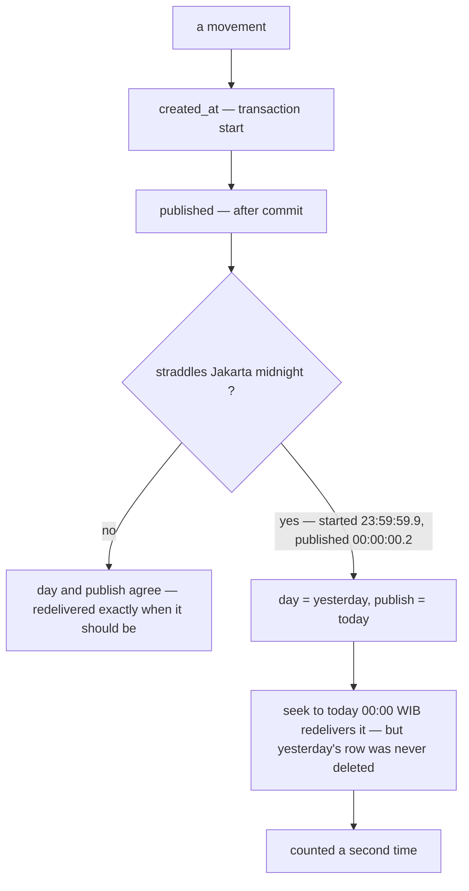

| | can it happen? | |
| --- | --- | --- |
| **a gap** — a message with `day >= start_date` that the seek does NOT redeliver | ⛔ **no.** If `day >= start_date` then `created_at >= midnight`, and `publish >= created_at`, so `publish >= T`. **Guaranteed** | ✅ nothing is ever lost |
| **an excess** — a message the seek redelivers whose `day < start_date` | ⚠ **yes**, for anything that started before midnight and published after | ⛔ **double-counted** |

✅ **That asymmetry is the good news**: seeking at the Jakarta midnight can never *lose* a movement. It
can only include a few it should not — and the one that is silent and permanent (a gap) is impossible by
construction.

⚠ **The window is small but not zero**: transaction duration plus publish latency, so tens to hundreds of
milliseconds per midnight. It only bites when a replay's `start_date` is exactly that day. Rare — and it
is money, it is silent, and it is a *double*, which is the direction that survives every reconciliation
anyone would think to run.

#### → Recommend: stop trying to make the clocks agree — make the seek a SUPERSET and filter

Since a gap is impossible and only excess is possible, the boundary does not have to be exact. **Let the
handler drop what does not belong to the run:**

```
during a replay run:
    if  log_row.day  <  run.start_date  →  ACK, do not compute
```

Two lines, and it makes the alignment **exact regardless of clock skew**. Better still, it inverts the
risk: the seek can then be deliberately set **a few minutes early** as a safety margin, because excess is
now free and a gap was already impossible.

| | seek must be exact | seek is a superset + filter |
| --- | --- | --- |
| a straddling movement | ⛔ double-counted | dropped by the guard |
| clock skew between app and broker | ⛔ becomes a correctness problem | irrelevant |
| a safety margin on the seek | ⛔ makes it worse | ✅ makes it safer |
| what has to be right | two clocks, to the millisecond | one comparison the handler already has the data for |

⚠ **The guard needs the run's `start_date` where the handler can see it** — which the dedup generation
already requires ([the-replay-seeks-the-broker](./context_decision.md#the-replay-seeks-the-broker) needs
a `run_id` in `settlement_service_metadata`). Keep `start_date` on the same run record and the guard costs
one read that is already happening.

#### ⚠ The prerequisite: the fold's `day` has to be Jakarta as well

This only works if all three agree on the calendar: the fold's `day`, the delete's `day`, and the seek's
instant. Today the doc derives `day` from `created_at` in GMT+7 while
[posted-on-buckets-the-report](./context_decision.md#posted-on-buckets-the-report) fixed the bucket on
`posted_on` — which is `DEFAULT CURRENT_DATE` on a server with **no timezone configured**, so it is the
**UTC** date. Those are seven hours apart, and a Jakarta seek against a UTC bucket reintroduces exactly
the error it was meant to remove.

**→ Recommend `posted_on` be stamped as the JAKARTA date at write**, and the fold read it rather than
re-deriving anything. Then `start_date`, `day`, `posted_on` and the seek instant are four names for one
calendar, and [the timezone contradiction](#the-bucket-day-is-derived-twice-in-two-timezones-and-the-two-disagree-for-a-third-of-the-clock)
closes with them.

---
### The replay floor — elaborated

#### Shown, with numbers

⚠ **Corrected (owner, 2026-09-10).** An earlier draft of this said the delete reads *"all of history"*.
It does not — it is `WHERE day >= @start_date`, bounded exactly as
[a-replay-deletes-its-range-first](./context_decision.md#a-replay-deletes-its-range-first) specifies.
**The narrower statement is the true one, and it makes the problem smaller:**

> The DELETE always honours `start_date`, however far back it points.
> The REBUILD cannot reach further than the broker retains.
> They only disagree when `start_date` is OLD.

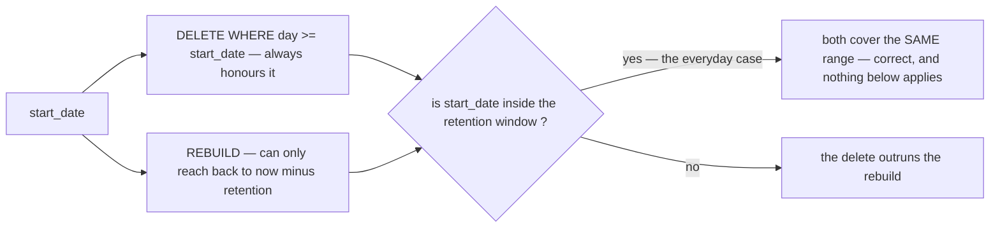

**So there are three zones, and only the newest one is used in practice.**

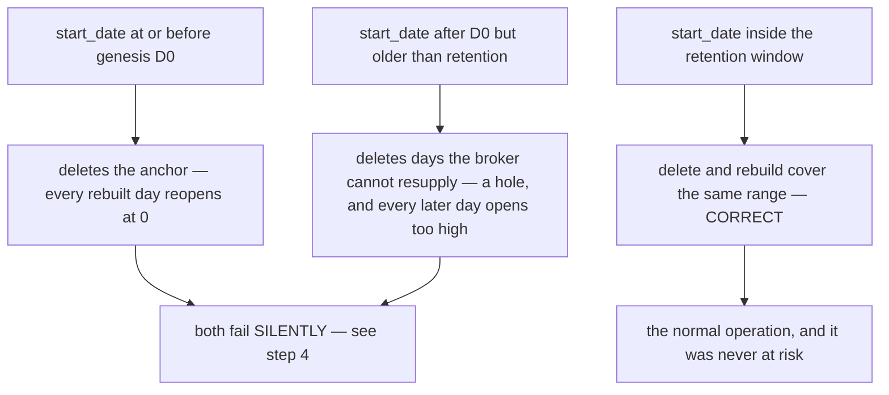

⚠ **Zone 2 is the one that is easy to miss**, because genesis survives it and it still breaks: the days
between `start_date` and the retention edge are deleted and never come back, so the first rebuilt day's
`prev` lookup skips over the gap and picks up a position that predates the lost movements.

**Step 1 — one shop, as it stands today.** Genesis is not a number someone chose: it is every log row
from before go-live, added up and written as one row.

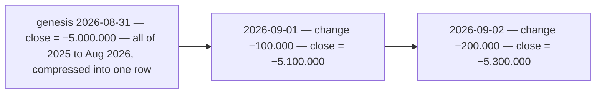

**Step 2 — an operator replays from 15 August**, meaning *"rebuild me the last few weeks"*. That date
is BEFORE genesis, and nothing refuses it.

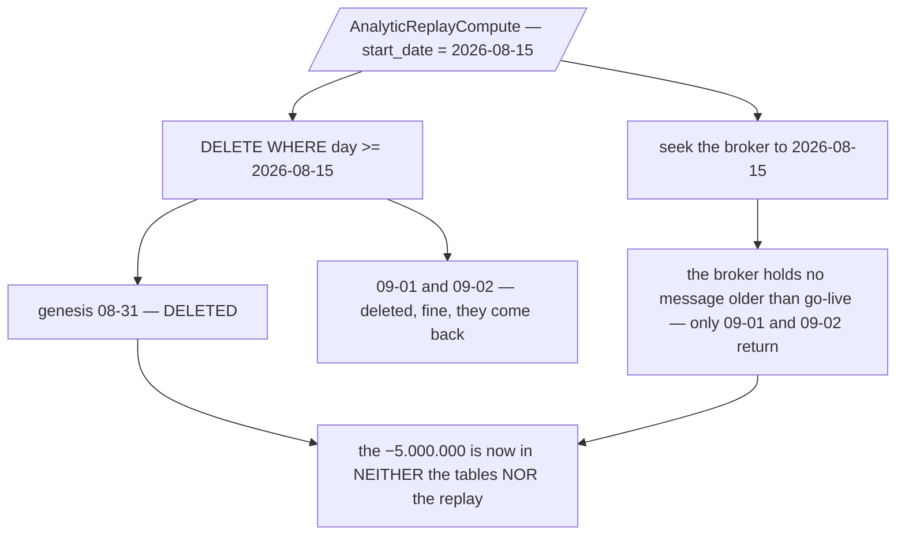

**Step 3 — what the shop reads afterwards.** `prev` finds nothing before 09-01, so the day opens at
zero.

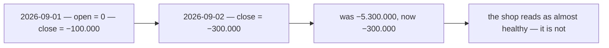

**Step 4 — and this is why it is the dangerous kind of wrong.** The only check the tables can perform
on themselves passes on every single row.

```mermaid
flowchart TB
  C["the invariant — close minus open equals change"]
  C --> R1["09-01 — −100.000 − 0 = −100.000 ✓"]
  C --> R2["09-02 — −300.000 − −100.000 = −200.000 ✓"]
  R1 --> P["every row passes"]
  R2 --> P
  P --> X["the rows agree with EACH OTHER, and every one of them is wrong by the same −5.000.000"]
  X --> Y["no reconcile against these rows can see it — they are internally perfect"]
```

**Step 5 — and re-running the migration's seed to repair it makes it worse**, because that query
returns the position NOW, not the position at `D0`.

```mermaid
flowchart TB
  F["genesis is gone — re-run the seed to fix it"]
  F --> SEED["SUM(last_balance) = −5.300.000 — today's position"]
  SEED --> W2["written into 2026-08-31, a day BEFORE those movements happened"]
  W2 --> ADD["the re-fold then adds 09-01 and 09-02 on top again"]
  ADD --> R3["close = −5.600.000 — the September movements counted twice"]
```

**→ One comparison removes the whole failure**: refuse `start_date <= genesis_day`. Everything below is
why that one line is the fix, and why the two obvious alternatives are not.


The short form is *"a replay must not delete the genesis row"*. Working it through, the rule is sharper
than that and one of the obvious fixes is wrong.

#### What the genesis row actually is

Not a special value — a **compression**. `SUM(order_settlements.last_balance)` is by definition
`SUM(change)` over **every log row that ever existed** for that scope, because `last_balance` is itself
that sum. So genesis is *the log's entire prehistory folded into one row*, written so the report tables
do not have to materialise a daily row for every day since `settlement_logs` shipped.

```mermaid
flowchart LR
  L1["settlement_logs — rows from the day the ledger shipped"] --> P["prehistory"]
  P -->|"compressed by the migration"| G["genesis row at D0 — close_balance = SUM(last_balance)"]
  G --> D1["go-live day 1 — opens from G"]
  D1 --> D2["day 2"] --> D3["day 3 …"]
```

**That is what makes the floor necessary**: the genesis row is the *only* record of everything before
`D0`, because no daily row exists for those days and none ever will.

#### The three regimes, and only the middle one is broken

`start_date` decides both the DELETE and the re-fold, and where it lands changes the answer completely:

| `@start_date` | what happens | correct? |
| --- | --- | --- |
| **> D0** | genesis survives, the rebuilt range opens from it (or from a later surviving day) | ✅ **yes** |
| **≤ D0, but after the log's first row** | genesis is deleted, and the re-fold only reads `posted_on >= @start_date` — so every log row before that date is in neither the anchor nor the replay | ⛔ **no, and silent** |
| **≤ the log's first row** | genesis is deleted and the *entire* log is re-folded. Day one truly opens at `0`, which is correct — at the cost of materialising a daily row for every day of prehistory | ✅ correct, ⚠ expensive |

⛔ **The middle case is silent because every invariant still holds.** `close − open = Σ movements` is true
on every rebuilt row; the chain is internally consistent and uniformly wrong by the prehistory total.
Nothing in the schema, the statements or a reconcile against those rows can see it.

```mermaid
flowchart TB
  S["start_date lands between the log's first row and D0"]
  S --> DEL["DELETE removes genesis — the only record of the prehistory"]
  S --> FOLD["the re-fold reads posted_on >= start_date — it does not read the prehistory either"]
  DEL --> GONE["the prehistory is in NEITHER"]
  FOLD --> GONE
  GONE --> W["every rebuilt day understated by the same amount, forever"]
  W --> INV["and close − open = Σ movements still holds on every row"]
```

#### ⛔ The obvious repair is wrong — do not re-seed from `order_settlements`

*"If the delete removes genesis, just re-run the migration's seed"* fails, and it fails quietly.
`order_settlements.last_balance` is the position **now**, not the position at `D0`. Re-seeding `D0` with
today's sum writes today's total into a day that predates every movement since — and the re-fold then
adds those same movements on top.

| | |
| --- | --- |
| the migration's seed was correct | because it ran **at** `D0`, when *now* and `D0` were the same instant |
| the same query later | ⛔ **double-counts everything between `D0` and today** |
| the only correct re-seed | `SUM(change) FROM settlement_logs WHERE posted_on <= D0 GROUP BY …` — a historical scan, exact, and no longer the cheap one-row-per-account read that made genesis attractive |

⚠ **And a related trap**: excluding genesis from the DELETE while still re-folding `posted_on >= start_date`
with `start_date < D0` **double-counts the prehistory** — genesis already contains it. **The DELETE range
and the re-fold range must be the same range**, and that is the real invariant here, not "protect one row".

#### → Recommend: one floor, governing both statements, read from one place

```
@start_date  >  genesis_day        -- refused otherwise, with a named error
DELETE  … WHERE day >= @start_date
re-fold … WHERE posted_on >= @start_date
```

| | |
| --- | --- |
| **the floor** | `AnalyticReplayCompute` refuses `start_date ≤ genesis_day` — one comparison, and it removes the entire broken regime |
| **where the day lives** | `settlement_service_metadata`, key `genesis_day`. It is **written by a migration and depended on by an RPC**, with nothing linking them today — the same shape as the tracked-field list drifting from the SQL that reads it. A value assumed in one place and defined in another is the recurring failure in this doc |
| **the error** | a distinct one, not "invalid argument" — an operator reaching for a replay during an incident needs to be told *why* the floor exists, not that their date is malformed |
| ⚠ **what the floor gives up** | with it, **nothing can ever repair the genesis figure itself**. If the seed was wrong, the floor makes it permanently wrong |
| **→ so pair it with a separate operation** | `AnalyticReseedGenesis` — recompute `D0` from `SUM(change) WHERE posted_on <= D0`, deliberately, under the lock, as its own explicit act. Rare, expensive, and never something a `start_date` typo can trigger |

⚠ **One more edge, cheap to state now**: `start_date` is *"date with GMT+7"* while `genesis_day` will be
a stored `DATE`. If they are derived differently the comparison is off by one at the boundary — which is
[the timezone contradiction](#the-bucket-day-is-derived-twice-in-two-timezones-and-the-two-disagree-for-a-third-of-the-clock)
reaching the one comparison that guards the anchor.

⚠ **A scope with no genesis row is fine**, and worth saying so nobody adds a per-scope check: a shop that
first traded after go-live has no prehistory, so `prev` finding nothing and opening at `0` is correct.
The floor is **global** — one `genesis_day` for the whole service — not per scope.


---
### ✅ `### Balance State Reports.` — now coherent, and one real finding is left

Two fixes landed this round and both were the right ones:

| | |
| --- | --- |
| ✅ `user_settlement_reports` | the name collision with the daily table is gone — a migration can now create both |
| ✅ the state tables carry **`close_balance` alone** | not the shared nine-column list. `open_balance` (which named no period) is gone, and so is the ambiguity about whether the seven type columns were "latest" or lifetime sums |

**That last one dissolves my previous critique rather than answering it.** With exactly one tracked
column, *"update `shop_settlement_reports` with latest from daily reports"* is **precisely defined**: the
latest daily row's `close_balance` **is** the cumulative position, by the carry's own definition
([the-carry-materialises-the-day-boundary-position](./context_decision.md#the-carry-materialises-the-day-boundary-position)).

#### ⛔ And I have to retract the replay claim — B self-heals

I said the derived writer leaves the state row *"holding the number the replay was run to fix, forever
for a dormant shop"*. **Traced properly against the one-column table, that is wrong:**

```mermaid
flowchart TB
  R["replay deletes daily rows WHERE day >= start_date"]
  R --> S1["a shop with NO rows in the range — nothing deleted, its state row was and stays correct"]
  R --> S2["a shop WITH rows in the range — those same events are redelivered"]
  S2 --> S3["each re-fold rewrites the daily row AND re-derives the state row from it"]
  S3 --> OK["so the state row converges as the range rebuilds — transiently low, never stuck"]
  S2 --> X["the only permanent failure is a message the broker can no longer redeliver"]
  X --> Q["which is the retention question, and it breaks the DAILY rows too"]
```

**A dormant shop is exactly the case that is safe** — it has no rows in the deleted range, so nothing of
its was destroyed. ✅ **The state tables therefore do NOT need naming in the replay's delete**, and
[the contradiction recorded against it](#a-decided-delete-names-three-tables-and-there-are-now-five)
narrows to a note rather than a defect.

⚠ **Two conditions make that true, and neither is written down:**

1. **Step 4 runs in the SAME transaction as statements 1 and 2.** A separate transaction can read a
   daily row that a concurrent fold is about to cascade over.
2. **"latest" means `ORDER BY day DESC LIMIT 1`, not "the row for `@day`".** A late event folds into an
   earlier day, and that day's close is not the shop's position.

#### ⛔ The one finding left: a lost update the state table would inherit

Two folds for **one shop**, concurrent, where one posts to an earlier day and the other creates a new
later day — which is exactly the *"event can be late"* case `### We Must Aware Of this` names.

```mermaid
sequenceDiagram
  participant T1 as fold — late event, day 05
  participant T2 as fold — live event, day 07
  T2->>T2: statement 1 — prev lookup, day 07 does not exist yet
  Note over T2: prev excludes T1, which is uncommitted
  T1->>T1: statement 1 — day 05
  T1->>T1: statement 2 — UPDATE WHERE day > 05
  Note over T1: day 07 is not visible, so nothing is cascaded to it
  T2->>T2: inserts day 07 with the stale prev
  Note over T1,T2: both commit — day 07 is understated by T1's change
```

⛔ **Nothing detects it.** `close − open = change` still holds on day 07, and the state row copies day
07's close, so **both tables are wrong and consistent**. No unique constraint is violated and no
statement errors.

⭐ **→ Recommend the fix be an ORDERING change, not a lock table: take the state row FIRST.**

```sql
-- at the top of the fold's transaction, before statement 1
SELECT close_balance FROM shop_settlement_reports
 WHERE shop_id = @shop_id AND team_id = @team_id FOR UPDATE;
-- (INSERT ... ON CONFLICT DO NOTHING first, so the row exists to lock)
```

One row per shop, so **every fold for a shop serialises on it** — and the race disappears for the daily
tables too. The state table stops being a thing that inherits a race and becomes the thing that
**prevents** it, at the cost of one row lock the transaction was going to take at step 4 anyway.

⚠ **This is what the `audit-sql` pass exists for** (CLAUDE.md), and it cannot be tested with
`san_testdb.DB(t)` — two goroutines inside one transaction never block on each other. It needs
`san_race.New` and the `raceaudit` build tag.

#### ⚠ And `## How Rpc Api Deliver The Data.` is still an empty heading

Per RULE 8b.11 that reads as *not designed yet*, not as an open question — so the **read side has no
shape**. Every table and the whole write path can be built from this doc, and there is still no RPC to
serve them.

---
### 📥 The RECEIVER side, once publishing is out of scope

> Owner, in chat (2026-09-07) — *"for 'Nothing publishes' its okay, in this context we just ensure that
> settlement can receive event properly with webhook, who send it is other service responsbility and out
> of this context topic."*

✅ **Accepted, and it is the right cut** — this doc is the fold, not the ledger. **The "nothing
publishes" blocker is withdrawn from here** and re-routed (RULE 7b) to
[context_clarify.md](./context_clarify.md#question), which is the doc for the write path that would emit
it. ⚠ **One line back on that**: *"other service"* is worth confirming — **nothing but `SettlementPost`
writes `settlement_logs`**, so if a different service is meant to publish ledger changes, that is new and
belongs in the architecture clarify instead.

⛔ **But one half of it does NOT move, and it is the half this doc owns**: a receiver cannot be built
against an undefined payload. [`DecodeEvent`](../../../backend/pkgs/event_source/push.go) unmarshals into
a **typed proto message** — there is no way to write it without one.

```mermaid
flowchart LR
  S["WHO publishes, and when"] --> O["out of scope — the ledger context"]
  C["WHAT the payload contains"] --> H["THIS context — the fold has to parse it"]
  H --> R["and the receiver's need is stateable without knowing the sender"]
```

#### ⭐ The receiver's requirement, statable here and now

**The fold needs the `settlement_logs` row id and nothing else.** Everything else it can read itself,
in-process, from tables this service owns — no HARD RULE 3 problem:

| the fold needs | where it comes from |
| --- | --- |
| `change`, `settlement_type`, `posted_on`, `shop_id`, `team_id` | the `settlement_logs` row, read by id |
| the creator | `order_settlements`, joined on `order_id` ([the-creator-is-stamped-on-the-state-row](./context_decision.md#the-creator-is-stamped-on-the-state-row)) |
| the dedup key | `msg.Message.MessageID` — already on the push request, never in the payload |

⛔ **So `### Events.` listing four fields is a FAT event, and that is the one shape that breaks a
replay.** A redelivered or replayed message carrying VALUES folds whatever was true when it was
published; the log stops being the source of truth and becomes a cache the broker holds a stale copy of.
**→ Recommend the doc state the receiver's contract as *"a message carrying a `settlement_logs` id"***,
and let whoever publishes satisfy it. Two of the four fields listed (`shop_id`, `team_id`) are already
columns on that row.

#### ⛔ Two receiving gaps the doc does not cover — and one can lose money silently

**1 · `sub_id` selects nothing.** `NewMuxPushHandler` takes **one** handler and never reads the path —
`/event/[sub_id]/push` records `sub_id` as a trace attribute and nothing more. Either it routes to
different handlers (undesigned) or it is decoration. **→ Recommend saying which**; a path segment that
looks like routing and is not is the kind of thing a second implementer builds against.

**2 · ⛔ The lock returns 500, and a NACK loop ends in the dead-letter topic.** This is the one with
teeth:

```mermaid
flowchart TB
  L["process_event_lock is held"] --> N["the webhook returns 500 — Pub/Sub treats any non-2xx as a NACK"]
  N --> R["redelivered, with backoff"]
  R --> M{"still locked?"}
  M -->|"yes"| R
  M -->|"no"| OK["folded"]
  R --> D["maxDeliveryAttempts exceeded — the message goes to the DEAD-LETTER topic"]
  D --> X["it is NEVER folded. The daily tables silently miss that movement"]
  X --> Y["and no invariant can see it — close minus open equals change on every row that DOES exist"]
```

⚠ **A dead-letter policy is mandatory, not optional** — `NewMuxPushHandler`'s own contract says a
permanently malformed message is otherwise redelivered forever, and CLAUDE.md requires one. So the DLQ
**will** exist, which is exactly what makes this reachable: a long enough lock window turns a healthy
message into a dead-lettered one.

**→ Recommend `AnalyticMaintenanceRun` NOT take the lock at all.** It deletes dedup rows *older than
retention*; a live fold *inserts a new* one. **They cannot conflict**, so the long-running job never
needs to block the webhook. That leaves the lock held only by the replay's delete — one short
transaction, where a NACK-and-retry is exactly right.

⚠ **And whatever the lock window ends up being, `maxDeliveryAttempts` × backoff must exceed it**, or the
guard that protects a rebuild becomes the thing that loses movements. That is a subscription setting,
invisible from the code — the third one in this design after `retain_acked_messages` and
`message_retention`.

---
### ✅ Build readiness — checked against the code, not the docs

**Scoped to RECEIVING** (owner, 2026-09-07), so the publisher is not counted here. On that scope the
answer is **yes: this doc is buildable**. Everything below was verified in the checkout.

| the design says | specified? | in the code? |
| --- | --- | --- |
| the two daily tables and their columns | ✅ | ⛔ no migration — `00001` creates `settlement_logs` and `order_settlements` only |
| the two **state** tables (`Balance State Reports`) | ✅ `close_balance` alone, derived from the latest daily row | ⛔ no migration |
| the write path (both statements) | ✅ adopted verbatim | ⛔ not written |
| `settlement_event_logs` + `day` | ✅ decided | ⛔ no table |
| the replay's delete — 3 tables, 1 predicate, 1 transaction | ✅ decided | ⛔ no RPC |
| `AnalyticReplayCompute` · `AnalyticMaintenanceRun` | ✅ named | ⛔ neither is in the proto — it has 3 RPCs: `OrderSettlementList`, `OrderSettlementDetail`, `SettlementPost` |
| the webhook `/event/[sub_id]/push` | ⚠ named — but `sub_id` selects nothing ([Q1](#question)) | ⛔ not mounted |
| `process_event_lock` | ⚠ named — who holds it, and for how long, decides whether messages are lost ([Q1](#question)) | ⛔ no table |
| the event **payload** | ⚠ **four field names, no message** — and `DecodeEvent` needs a typed proto | ⛔ none |
| ➡ who publishes it | **out of scope** — [context Q3](./context_clarify.md#question) | ⛔ nothing publishes |

**None of the ⛔s in the right-hand column is a question.** They are the build: eight migrations-worth of
tables, two RPCs, one mounted webhook, one fold.

#### ⛔ Three decided-but-unbuilt items, and the first one blocks the user tables

| | |
| --- | --- |
| **`created_by_user_id` is not on `order_settlements`** | [the-creator-is-stamped-on-the-state-row](./context_decision.md#the-creator-is-stamped-on-the-state-row) decided it; the model has `OrderID`, `InitialTotal`, `LastBalance`, `TeamID`, `ShopID` and no user column — so **`user_settlement_daily_reports` cannot be folded at all** |
| **no order opens an account** | nothing in `selling_service` imports `settlement_v1`, so `initial_total` is never posted and every table downstream is empty |
| ⚠ **`posted_on` is not indexed** | both log indexes are `(team_id, occurred_on)` and `(shop_id, occurred_on)`, and [posted-on-buckets-the-report](./context_decision.md#posted-on-buckets-the-report) made `occurred_on` the date **no aggregate reads**. The reconcile query and any log re-fold scan the table |

**→ Recommend the index pair be corrected to `posted_on` in the same migration that adds the daily
tables** — one line, and wrong in exactly the direction that only shows up under data.

⚠ **And step 1 still derives the day from `created_at`**, which
[posted-on-buckets-the-report](./context_decision.md#posted-on-buckets-the-report) replaced with
`posted_on`. Recorded in [Contradiction](#contradiction); it is a one-word fix in the doc and a
different column in the code.

---

## Proposed Design — the reconcile

> ⛔ **`folded_count` is DEFERRED** ([folded-count-is-deferred](./context_decision.md#folded-count-is-deferred),
> owner 2026-09-10). Everything below about the **value** check stands and is the design. The
> completeness column is not built, and my claim that *"neither substitutes"* was overstated — the value
> check localises the failing day on its own. What is given up is the **compensating-error** case only
> (two offsetting losses on one day), and that is permanent: `folded_count` cannot be backfilled.

The concrete answer to [Q4](#question). Two mechanisms, and they answer different questions: one says
*"this day is INCOMPLETE"*, the other says *"this chain is WRONG"*. Neither substitutes.

```mermaid
flowchart TB
  L["settlement_logs — the truth, complete from day one"]
  R["the daily report — a stored, incremented copy"]
  L --> C1["COMPLETENESS: does the day hold every row the log has for it ?"]
  R --> C1
  L --> C2["VALUE: does close_balance equal the log's running sum ?"]
  R --> C2
  C1 --> W["a work list of days that disagree"]
  C2 --> W
```

### ⚠ I am revising `folded_through` — it does not work

My earlier recommendation was a **`folded_through`** column holding the highest `settlement_log.id`
folded into the row. **That is unreliable, and the reason is ordinary Postgres.** `id` comes from a
`BIGSERIAL`, which assigns at INSERT and not at COMMIT — so a higher id can commit *before* a lower one.
A watermark set to the max id then claims to have passed rows it never saw, and the gap is invisible.

```mermaid
flowchart TB
  A["txn A takes id 100"] --> B["txn B takes id 101"]
  B --> C["B commits first — folded, folded_through = 101"]
  C --> D["A commits later with id 100"]
  D --> E["a check for id > 101 never looks at 100"]
  E --> F["the row claims completeness it does not have"]
```

**→ Use `folded_count` instead** — how many log rows have been folded into this day. It compares against
`COUNT(*)` from the log, which is exact and has no ordering assumption at all. It is also **symmetric**:
too few means a lost movement, too many means one was folded twice (a redelivery past the dedup).

| | `folded_through` (withdrawn) | `folded_count` |
| --- | --- | --- |
| assumption | ids commit in order — **false** | none |
| catches a lost row | ⚠ only if its id is above the mark | ✅ always |
| catches a double-fold | ⛔ no | ✅ yes |
| cost | one BIGINT | one BIGINT |

⛔ **It must be in the migration that CREATES the tables.** Added later it cannot be backfilled — the
number of rows already folded into a given day is not recoverable from anything, so every pre-existing
day would carry a value that is either wrong or unknown.

### The schema

```
shop_settlement_daily_reports.folded_count  BIGINT NOT NULL DEFAULT 0
user_settlement_daily_reports.folded_count  BIGINT NOT NULL DEFAULT 0
```

The fold's own statement already touches the row — it costs one more `SET`:

```sql
ON CONFLICT (shop_id, team_id, day) DO UPDATE
SET ...,
    folded_count = d.folded_count + 1
```

⚠ **The genesis row's `folded_count` is 0**, and correctly so — no log rows were folded into a synthetic
day. The reconcile must know to skip the completeness check there while still checking its VALUE, which
is the check that would have caught
[the genesis seed reading one state table when there are two](../settlement/context_clarify.md#-the-genesis-seed-reads-one-state-table-and-there-are-now-two).

### The check, as one query per scope

**The log is complete from day one**, so its running sum is the definition — including the prehistory
that genesis compresses. That is what makes this able to validate genesis itself rather than trusting it.

```sql
WITH truth AS (
    SELECT posted_on                                   AS day,
           COUNT(*)                                    AS rows_in_log,
           SUM(SUM(change)) OVER (ORDER BY posted_on)  AS running
    FROM settlement_logs
    WHERE shop_id = @shop_id AND team_id = @team_id
    GROUP BY posted_on
)
SELECT COALESCE(d.day, t.day) AS day,
       d.close_balance, t.running,
       d.folded_count,  t.rows_in_log
FROM shop_settlement_daily_reports d
FULL JOIN truth t
       ON t.day = d.day AND d.shop_id = @shop_id AND d.team_id = @team_id
WHERE d.close_balance IS DISTINCT FROM t.running
   OR (d.folded_count IS DISTINCT FROM t.rows_in_log AND d.day > @genesis_day)
ORDER BY day;
```

| | |
| --- | --- |
| `FULL JOIN` | a day in one and not the other is itself a finding — an inner join would hide exactly the missing-row case |
| `IS DISTINCT FROM` | `NULL` compares correctly, so a missing side reports rather than silently passing |
| the window sum | one pass over the scope's log, not one query per day |
| the genesis guard | the seed row legitimately has no log rows behind it |

### The RPC

Governed shape, and deliberately **not** paginated — the span is the bound, capped at 366 days like every
other period read, so the settlement reconcile cannot load part of a period and look complete.

```proto
message SettlementReconcileFilter {
  string from = 1;          // YYYY-MM-DD, required
  string to   = 2;          // YYYY-MM-DD, required
  uint64 shop_id = 3;       // 0 = every shop in the team
}

message SettlementReconcileRequest {
  option (warehouse.role_base.v1.request_policy) = { roles: [ROLE_ROOT, ROLE_ADMIN] };
  uint64 team_id = 1 [(warehouse.role_base.v1.use_scope) = true];
  SettlementReconcileFilter filter = 2 [(buf.validate.field).required = true];
}

message ReconcileFinding {
  string date = 1;
  uint64 shop_id = 2;
  int64  stored_close = 3;
  int64  log_close = 4;      // the truth
  int64  drift = 5;          // stored − log, signed, so the sign says which way
  int64  stored_rows = 6;
  int64  log_rows = 7;
}

message SettlementReconcileResponse {
  repeated ReconcileFinding findings = 1;   // SPARSE — only days that disagree
  uint64 days_checked = 2;                  // so "nothing found" is distinguishable from "nothing ran"
}
```

⛔ **SPARSE is the design, not an optimisation.** A reconcile that returns every day is a report nobody
reads; one that returns only breaks is a work list. And `days_checked` is what stops an empty response
meaning two different things.

✅ **Read-only. It never repairs.** Same rule the performance and concurrency audits follow: the report
is input to a decision. Repair is `AnalyticReplayCompute`, a day re-fold, or `AnalyticReseedGenesis` —
each a deliberate act.

### What it catches, and what it cannot

| | |
| --- | --- |
| ✅ a lost movement (the dead-letter path) | value AND count disagree |
| ✅ a cascade that did not run | value disagrees from that day forward |
| ✅ **a wrong genesis** | every day's value is off by the same amount — the one check that can see it, since the floor makes it otherwise unrepairable |
| ✅ a replay that skipped a day | count disagrees on that day |
| ✅ a double-fold | count is too HIGH |
| ⛔ **a log row that was never written** | — the log and the report agree, and both are short. That is [order Q14](../order/context_clarify.md#question)'s finder, not this |
| ⚠ **a `system_adjustment` posted to repair a fold-only loss** | reports a difference **forever** — see [the note on system_adjustment](../settlement/context_clarify.md#-system_adjustment-in-the-log-repairs-one-class-of-damage-and-cannot-repair-the-other). Building this makes that problem visible, which is good, and makes answering it urgent, which is the point |

### Cost, and when it runs

| | |
| --- | --- |
| the fold | one extra `SET` on a row it already writes — immeasurable |
| the reconcile | one window pass over a scope's log. On a shop-year that is thousands of rows, not millions |
| when | **on demand**, not nightly, to start with. It is a diagnostic, and a nightly job that nobody reads is how a wrong number gets a green tick beside it |

→ **Recommend both**, and `folded_count` **in the create-tables migration** — it is the only part with a
deadline, because it cannot be backfilled.

---

## Proposed Design — the settlement event

`### Events.` says the event contains *"changes of the ledger … new row inserted at `settlement_logs`"*
plus `shop_id`, `team_id`, `order_created_by_user_id`. That is the right instinct and two of the four
items are already **on the row** — so what it actually specifies is *the row, plus the creator*. This
is that, written out.

⚠ **The generic rules this is built from live in
[`event_architecture/context_clarify.md`](../../technical/event_architecture/context_clarify.md#four-rules-that-belong-here-not-in-each-contexts-doc)** —
what a `oneof` variant is for, what an ordering key names, why an event is fat. Only settlement's own
answers are here. Written against the shipped model
([settlement_log.go](../../../backend/services/settlement_service/settlement_service_models/settlement_log.go)),
which carries five fields `context.md` does not list.

```protobuf
// proto/warehouse/settlement/v1/events.proto — beside settlement.proto, same package
message SettlementEvent {
  option (warehouse.event_base.v1.event_config) = {
    event_topic: "settlement-events"
    ordering_key_field: "meta.aggregate_id"     // "shop:<shop_id>"
  };

  warehouse.event_base.v1.EventMetadata meta = 1 [(buf.validate.field).required = true];

  oneof payload {
    SettlementLogPosted posted = 100;           // ONE variant today, deliberately
  }
}

// One immutable row of settlement_logs, published whole.
message SettlementLogPosted {
  uint64 log_id    = 1;                          // settlement_logs.id
  string unique_id = 2;                          // the caller's key, unique across the whole log

  optional uint64 order_id = 3;                  // ABSENT addresses the SHOP, never 0
  uint64 shop_id  = 4;
  uint64 team_id  = 5;
  uint64 actor_id = 6;

  // The ONLY genuinely new item in `### Events.` — and it is on no settlement table, which is why
  // a replay cannot reproduce `user_settlement_daily_reports` rows today.
  uint64 order_created_by_user_id = 7;

  SettlementType settlement_type = 8;
  SourceType     source_type     = 9;

  int64 change  = 10;                            // positive is money toward us
  int64 balance = 11;                            // the position AFTER this row — audit, never folded

  string posted_on   = 12;                       // the day the fold buckets on
  string occurred_on = 13;                       // the day the money belongs to — carried, not bucketed

  optional uint64 reverses_id = 14;
  string note = 15;
}
```

| settlement's answer | why |
| --- | --- |
| **ONE variant, not one per `settlement_type`** | `SettlementType` is already a proto enum with **eight** values, and the fold runs the **same** `INSERT … ON CONFLICT` for every one — only the incremented column differs. Eight variants would be eight near-identical messages and an eight-arm switch doing one thing, and a **ninth type would become a proto variant plus a handler arm** in every consumer instead of an enum value. Every settlement fact has one shape: *a new immutable row* — the doc says so itself (*"settlement just can adjustment by added record log, not updated the log"*) |
| **`meta.aggregate_id = "shop:<shop_id>"`** — the shop, **not** the order | the model states the reason: `ShopID`/`TeamID` are on **every** row regardless of whether it addresses an order or a shop, *"which is what lets both fold into the same daily report"*. The fold's key is `(day, shop_id, team_id)` and `close_balance` reads the **previous day's row** — so the stream that must not reorder is the **shop's**. An order-keyed stream lets two rows for one shop interleave across a day boundary and the carry reads a value that was about to change. ⚠ Not to be confused with [Q5](#question)'s grain, which is the report's period |
| **`meta.event_id = "settlement-log:<log_id>"`** | ⛔ **the retry, not the replay.** A publish that times out is **retried**, and the retry mints a **new broker message id for the same fact** — so dedup keyed on `settlement_event_logs.id` sees something new and folds the same row **twice**. That is a wrong number in a money report, and it is the one case a derived id exists for. ✅ **The replay half of this is already solved** by [the-replay-cuts-three-tables-on-one-line](./context_decision.md#the-replay-cuts-three-tables-on-one-line) — the `day` column lets the rebuild clear dedup by range, so a seek redelivering the same message ids is no longer a no-op. **My earlier claim that it was is withdrawn** |
| **the event carries the ROW, not a pointer** | a thin event makes the webhook read `settlement_logs` back, so a **replay folds current state instead of the historical fact** — precisely what a rebuild must not do, and this design has a rebuild. ⚠ It saves nothing either: Pub/Sub bills a **1 KB minimum per delivery** and this message is well under it |
| **`posted_on` / `occurred_on` are `YYYY-MM-DD` strings** | both are `DATE` columns. A `Timestamp` hands the consumer a timezone decision to re-derive, which is exactly [the bucket-day contradiction](#the-bucket-day-is-derived-twice-in-two-timezones-and-the-two-disagree-for-a-third-of-the-clock). The fold reads `posted_on` and never converts anything |

```mermaid
flowchart LR
  W["SettlementPost — one transaction"] --> L[("settlement_logs row")]
  L --> EV["SettlementEvent — the row, whole"]
  EV -->|"OrderingKey shop:5"| T["topic settlement-events"]
  T --> H["settlement webhook — the fold"]
  H --> R[("shop_settlement_daily_reports")]
  T --> DL["settlement-events.dlq"]
```

⚠ **Nothing publishes this today.**
[`post_entry.go`](../../../backend/services/settlement_service/settlement_v1/post_entry.go) writes the
log, updates both states and sends **no event at all** — so the webhook, the dedup layer and the
replay are fully specified against a message that is never sent. Who publishes it is
[context Q3](./context_clarify.md#question), where the owner scoped it.

---

## Question

**Five open.** ✅ **`system_adjustment` is DECIDED** — `context.md` made it an eighth `settlement_type`, so it is a **LEDGER row**, shop-addressed, reaching the report through the broker. **My report-column recommendation is withdrawn as the default.** ⚠ What survives is not an argument against it but a gap it leaves: the adjustment moves the log and the report **together**, which repairs damage where both were wrong and **cannot** repair damage where only the fold was lost — which is what every known drift cause produces. That is now a note in [context_clarify](./context_clarify.md#-system_adjustment-in-the-log-repairs-one-class-of-damage-and-cannot-repair-the-other), recommending a targeted day re-fold from the log. 🆕 **One question arrived this round** — whether the grain goes on the wire ([Q5](#question)). ✅ **The replay's reach also closed** ([the-replay-reaches-31-days-and-that-is-accepted](./context_decision.md#the-replay-reaches-31-days-and-that-is-accepted)): the seek stands, my `settlement_logs` re-fold recommendation is withdrawn, the archive's deadline is retired for settlement, and what it left is a BUILD task in [Awaiting](#awaiting). ✅ Scoped to RECEIVING (owner), so publishing is re-routed to [context Q3](./context_clarify.md#question). **The tables, the write path, the dedup layer and the replay are all fully specified** — none of what is left stops the first migration.
[a-past-date-position-is-a-real-screen](./context_decision.md#a-past-date-position-is-a-real-screen)
confirmed a reader, so `open_balance` / `close_balance` and the five mechanisms that maintain them are
paid for, and my recommendation to drop them is **withdrawn**. ✅ **And what that position MEANS is
settled** — [the-position-is-the-shortfall-not-the-wallet](./context_decision.md#the-position-is-the-shortfall-not-the-wallet):
the cumulative shortfall, never the marketplace wallet, which is out of scope entirely. That closed a
question that was upstream of the carry decision itself, and it **de-escalated the withdrawal gap** —
settlement is no longer waiting on [context Q1](./context_clarify.md#question) /
[architecture Q7](../../technical/architecture/context_clarify.md#question). ✅ The delete is settled too
([the-replay-cuts-three-tables-on-one-line](./context_decision.md#the-replay-cuts-three-tables-on-one-line)) —
three tables, one predicate, one transaction, `settlement_event_logs` gaining a `day` column. It retired
two earlier recommendations of mine: the generation counter and the handler-side range filter are **not
built**.

1. ⛔ **Does the lock's 500 lose messages to the dead-letter topic — and does `AnalyticMaintenanceRun`
   need the lock at all?** ⬆ **The receiving question that replaced the publishing one.** ✅ *"Who sends
   it"* is out of scope here and re-routed to [context_clarify.md](./context_clarify.md#question).
   ⛔ **The webhook returns 500 while locked, Pub/Sub treats any non-2xx as a NACK, and a dead-letter
   policy is mandatory** ([`push.go`](../../../backend/pkgs/event_source/push.go) — *"a permanently
   malformed message is redelivered FOREVER"*, and CLAUDE.md requires the DLQ). So a lock window longer
   than `maxDeliveryAttempts` × backoff turns a **healthy** message into a dead-lettered one: it is never
   folded, the daily tables silently miss that movement, and **no invariant can see it** — `close − open
   = change` holds on every row that does exist.
   **→ I recommend `AnalyticMaintenanceRun` NOT take the lock.** It deletes dedup rows *older than
   retention* while a live fold *inserts a new* one — **they cannot conflict**, so the long-running job
   never needs to block the webhook. That leaves the lock held only by the replay's delete: one short
   transaction, where NACK-and-retry is exactly right.
   ⚠ **And whatever the window is, `maxDeliveryAttempts` × backoff must exceed it** — the third
   subscription setting that is load-bearing and invisible from the code, after `retain_acked_messages`
   and `message_retention`.
   ⚠ **Two smaller receiving gaps beside it**: `sub_id` in `/event/[sub_id]/push` **selects nothing** —
   `NewMuxPushHandler` takes one handler and never reads the path, so either it routes (undesigned) or it
   is decoration; and the payload contract is still owed here even though the sender is not — the fold
   needs **the `settlement_logs` row id and nothing else**, since everything else is readable in-process,
   and `### Events.`'s four-field list is a **fat** event, which is the one shape that makes a replay fold
   stale values.
   ([the working](#-the-receiver-side-once-publishing-is-out-of-scope))

2. ⛔ **Does the fold take one lock per shop — or does a late event and a live one lose an update?**
   ⬇ **Shrunk hard this round.** ✅ `user_settlement_reports` is renamed, ✅ the state tables carry
   `close_balance` alone, and ✅ that makes *"latest from daily reports"* precisely defined — so the
   ambiguity is gone. ⛔ **And I retract my replay claim**: traced against the one-column table, the
   derived writer **self-heals** — a shop with rows in the deleted range gets those same events
   redelivered, and each re-fold re-derives its state row. A dormant shop had nothing deleted. **The
   state tables do not need naming in the replay's delete.**
   ⛔ **What is left is a real lost update**, and it is exactly the *"event can be late"* case
   `### We Must Aware Of this` names. Two folds on one shop: a late event posting to day 05 and a live one
   creating day 07. The live fold's `prev` lookup cannot see the uncommitted late fold, and the late
   fold's `UPDATE … WHERE day > 05` cannot see the not-yet-inserted day 07. **Both commit, day 07 is
   understated, and `close − open = change` still holds** — so nothing detects it, and the state row
   copies the wrong close.
   ⭐ **→ I recommend an ORDERING change, not a lock table: take the state row `FOR UPDATE` at the top of
   the fold's transaction.** One row per shop, so every fold for that shop serialises on it, and the race
   disappears for the daily tables too — the state table stops inheriting a race and starts **preventing**
   one, at the cost of a lock the transaction was going to take at step 4 anyway.
   ⚠ **Two conditions the doc should state either way**: step 4 runs in the **same transaction** as
   statements 1–2, and *"latest"* means `ORDER BY day DESC LIMIT 1` — not the row for `@day`, which a late
   event makes a different thing.
   ⚠ This is what the `audit-sql` pass is for, and it cannot use `san_testdb.DB(t)` — two goroutines in
   one transaction never block on each other.
   ([the working](#-balance-state-reports--now-coherent-and-one-real-finding-is-left))

3. ⚠ **Does the past-date position screen exist per USER as well as per shop?** The answer that settled
   the carry was about a **shop**. On `user_settlement_daily_reports` the same two columns mean something
   different: *one CS person's lifetime running total of hidden platform cost*, which only ever grows —
   so **the newest CS always looks best and the longest-serving always looks worst**, regardless of
   performance.
   **→ I recommend dropping `open_balance` / `close_balance` from the USER table only**, keeping its
   movement columns. A window's `gap` and `take_rate` compare people fairly. ⚠ It also halves the
   cascade, and the user table is the busier of the two — one CS touches many shops, so a backdated event
   walks more rows there than on any single shop.
   Keep them if the same screen exists per person.
   ([the working](#-the-carry-is-settled--what-survives-is-two-smaller-things))

4. ⚠ **A reconcile pass is now load-bearing — is it in scope?** ⭐ **Now written as a buildable spec** — [the reconcile design](#proposed-design--the-reconcile-and-the-column-it-needs-in-the-first-migration). ⚠ **It revises my own earlier `folded_through` recommendation**: a max-id watermark is unreliable because `BIGSERIAL` assigns at INSERT and not at COMMIT, so a lower id can commit after a higher one and be skipped forever. **`folded_count` replaces it** — exact, no ordering assumption, and it catches a double-fold too. ⛔ **`folded_count` must be in the migration that CREATES the tables**: it cannot be backfilled, because how many rows were folded into a past day is not recoverable from anything.
   [the-carry-materialises-the-day-boundary-position](./context_decision.md#the-carry-materialises-the-day-boundary-position)
   named the bug class: the stored copy can drift from its own definition and **`close − open = change`
   still holds on every row**, so no invariant on the table detects it. With a screen reading the number,
   that is a wrong figure a person acts on.
   **→ I recommend one RPC that checks a scope against the log it materialises** —
   `close_balance(D) = Σ change WHERE posted_on <= D`, same service, no HARD RULE 3 problem — run on
   demand rather than nightly to start with. It is the only check the eager write path cannot do itself.


5. ⚠ **Does the GRAIN go on the wire, or stay a client rollup?** 🆕 `TimeframeType {DAILY, MONTHLY,
   YEARLY}` puts it on the wire. **The app currently answers the other way**, and it already ships:
   `ExpenseDaily` / `LiabilityDaily` return a flat daily series and
   [`daily-statement`](../../../frontend/src/pages/daily-statement/index.tsx) rolls it up with
   `PeriodGrainPicker` + `bucketOf`. [`period.ts`](../../../frontend/src/lib/period.ts) states the
   position outright: *"THE SERIES UNDERNEATH IS ALWAYS DAILY … a coarser grain is a ROLLUP the client
   does"*.
   ⚠ **Your version fixes a limitation that file admits to** — the 366-day cap means a yearly view
   reaches one year — so this is a real trade, not a style point.
   ⛔ **But whichever wins has to win for BOTH screens.** Settlement's series and the statement's are read
   side by side; if one buckets in SQL (`date_trunc`, in the database's timezone) and the other in the
   browser (`date.slice`), *"August"* is computed two ways and they disagree exactly where
   [the timezone contradiction](#the-bucket-day-is-derived-twice-in-two-timezones-and-the-two-disagree-for-a-third-of-the-clock)
   already bites.
   **→ I recommend keeping the grain client-side** and leaving the multi-year limitation open, because it
   is one rollup definition instead of two and touches no other service. **→ If it goes on the wire, do it
   as a SPAN-UNLOCK** — grain widens the cap (366 days / 60 months / 20 years) rather than being a display
   preference — and change all three Daily RPCs together.
   ⚠ **Beside it, one confirmation**: `Team Grouped` crosses team scope, which only ROOT/ADMIN in team 1
   can do. **→ Declare it an admin screen** — no new mechanism needed, and it is the cheapest of the three
   options.

⚠ **The order seam is no longer open here** — it was answered in full
([the-order-commits-without-settlement](./context_decision.md#the-order-commits-without-settlement) ·
[the-creator-is-read-from-the-token-at-placement](./context_decision.md#the-creator-is-read-from-the-token-at-placement) ·
[a-missing-account-is-fixed-by-hand](./context_decision.md#a-missing-account-is-fixed-by-hand)).
What it leaves is a build task, not a question: **nothing in `selling_service` imports `settlement_v1`
yet**, so no order opens an account today.


# Contradiction

## a decided delete names three tables and there are now five

> [the-replay-cuts-three-tables-on-one-line](./context_decision.md#the-replay-cuts-three-tables-on-one-line)
> *(2026-09-02)* — *"a replay deletes from **three tables under one predicate**, in one transaction …
> `DELETE FROM shop_settlement_daily_reports WHERE day >= @start_date`"*.
>
> `analytic_context.md` `### Balance State Reports.` *(this round)* — two new tables,
> `shop_settlement_reports` and its user twin, **keyed without a `day`**.

> ✅ **NARROWED to a note (2026-09-07), and the doc is why.** With the state tables carrying
> `close_balance` **alone**, derived from the latest daily row, a replay **self-heals**: a shop with rows
> in the deleted range receives those same events back and each re-fold re-derives its state row, while a
> shop with none had nothing deleted. **No delete-transaction fix is needed** — I recommended one and
> retract it. ⚠ **Kept as a record** (HARD RULE 11): the decision still *says* "three tables" while five
> exist, and the reason that is harmless is a property of the derived writer, not of the rule.

**The predicate that unified three tables cannot reach the other two.** `day >= @start_date` does not
match a row that has no `day`, so the state tables are untouched by a replay. Under a `+=` writer that
would be **doubling**; under the derived writer the doc specifies, it is harmless — but **the rule does
not say which, and a later change of writer would make it fatal silently.**

```mermaid
flowchart TB
  R["AnalyticReplayCompute — start_date"] --> P["one predicate — day >= start_date"]
  P --> A["shop_settlement_daily_reports"]
  P --> B["user_settlement_daily_reports"]
  P --> C["settlement_event_logs"]
  P -.->|"cannot match — no day column"| S1["shop_settlement_reports"]
  P -.->|"cannot match — no day column"| S2["its user twin"]
  S1 --> X["so a replay leaves them holding the pre-replay total"]
  S2 --> X
  X --> Y["and every re-folded delta lands on top of it"]
```

**→ Recommend the state tables be named EXPLICITLY in the replay** — **re-seeded inside the delete
transaction** from the daily rows that survive it, never inheriting a predicate they cannot match, and
never as a step *after* the replay: the seek is asynchronous and the RPC returns before the range is
rebuilt ([the working](#-this-breaks-my-own-earlier-recommendation-and-here-is-the-repair)). **→ And what
stops it recurring**: the decision was written as *"three tables"*, a **count**, when what it meant was
*"every table the fold writes"*. A rule stated as a list goes stale the moment the list grows; the same
rule stated as **the set the fold touches** would have covered these two on the day they appeared.

⚠ **This is the third instance of one shape in this doc** — a rule restated per case, going stale when a
case is added. The first two were the tracked-field list and the day derivation. ✅ **And the field list
has now been fixed the right way** (`### Field that tracked.` — one list, four references), which is
exactly the move this recommendation asks for.

## a tracked-field list was edited and the SQL that depends on it was not

> ⚠ **HALF FIXED (2026-09-07), and fixed the right way.** `### Field that tracked.` is now **one list
> with four references** — the recurrence mechanism is gone, and this is the move
> [the five-tables entry](#a-decided-delete-names-three-tables-and-there-are-now-five) asks for as well.
> ⛔ **The defect itself stands**: `change` is still absent while the adopted SQL still writes it, and
> `orders` is absent too. It is now **one place to fix instead of four** — which is the whole value of
> the centralisation. ⚠ **Kept as a record** (HARD RULE 11): the fix was to the shape, not the content,
> and those are worth telling apart.
>
> `analytic_context.md` `## Smallest Grain Reports.` *(2026-09-02)* — `field that tracked:` now lists
> `initial_total … marketplace_adjustment, open_balance, close_balance`. **`change` is not in it.**
>
> `analytic_context.md` `### Flow` step 2, the same pass — `INSERT INTO shop_settlement_daily_reports
> (…, fund, **change**, open_balance, close_balance, last_updated)` and `SET **change** = d.change +
> @change`.

**The statement cannot run against the schema declared 40 lines below it** — `ERROR: column "change"
does not exist`. `change` went out in the same edit that correctly dropped `balance`.

**This is the shape HARD RULE 11 predicts, and it is the second time in this doc**: *any list where
every case appears together* is where a changed rule has to be restated N times, so it is where staleness
collects. Here the list is `field that tracked`, and it has **two** dependents that must move with it —
the `INSERT` column list and the `DO UPDATE` set — plus a mirrored copy for the user table.

```mermaid
flowchart TB
  E["one edit — drop balance and change from field that tracked"]
  E --> D1["the INSERT column list still names change"]
  E --> D2["the DO UPDATE set still assigns change"]
  E --> D3["the user table's copy of both"]
  D1 --> F["column change does not exist — nothing runs"]
  D2 --> F
  D3 --> F
```

**→ Recommend `change` comes back** — it is the day's net, the one movement figure `close_balance`
needs, and dropping it makes the adopted statement unrunnable. `balance` stays gone: it was a duplicate
of `close_balance` under every reading. **→ And what stops it recurring**: the tracked list and the
statements are one unit — an edit to either is an edit to both, in the same pass.

## the bucket day is derived twice, in two timezones, and the two disagree for a third of the clock

> ✅ **RESOLVED (2026-09-02) by [the-system-runs-on-jakarta-time](../../technical/architecture/context_decision.md#the-system-runs-on-jakarta-time)** —
> WIB is the system's calendar, set once at the database session, so `posted_on`, the fold's `day`,
> `start_date` and the seek instant are four names for one calendar. ⚠ **Kept as a record** (HARD RULE
> 11): this took three rounds to surface and it was found in three different places before it was found
> once. ⛔ **Two columns and one DSN still carry the old calendar** — the fix is listed in the decision.

> [posted-on-buckets-the-report](./context_decision.md#posted-on-buckets-the-report) — *"the `from` /
> `to` of every report compare against **`posted_on`** … the daily / monthly / yearly bucket keyed on
> `posted_on`"*.
>
> `analytic_context.md` `## Flow` 1 *(2026-09-02)* — *"extract **`created_at`** from `settlement_logs`.
> convert to **GMT+7** and get the date as `day`."*

**Two derivations of one day, and they are not the same day.** `posted_on` is
`DATE NOT NULL DEFAULT CURRENT_DATE` ([migration:62](backend/services/settlement_service/db_migrations/00001_create_settlement_ledger.sql#L62))
and stamped `time.Now()` ([post_entry.go:201](backend/services/settlement_service/settlement_v1/post_entry.go#L201)),
with no timezone set anywhere in the repo — so it lands on the **UTC** date, while the fold computes a
**Jakarta** date. For every movement written between 00:00 and 07:00 WIB the log says one day and the
report says the next.

**→ Recommend the fold read `posted_on` and derive nothing** — and `posted_on` be stamped as the Jakarta
date at write. The whole reason it is a stored column is that the answer should be computed once. Full
working in [D · the day is derived twice](#d--and-the-day-is-derived-twice-two-different-ways).

## `open_balance` has two definitions, and the new doc chose the one that cannot be rebuilt

> ✅ **RESOLVED (2026-09-07) by [the-carry-materialises-the-day-boundary-position](./context_decision.md#the-carry-materialises-the-day-boundary-position)** —
> owner, in chat: *"open balance is start balance of the day, and close balance is end balance of the
> day"*. **There was never a second definition.** The boundary position is what the number MEANS; the
> carry is how it is KEPT, and the cascade is the bridge. ⚠ **Kept as a record** (HARD RULE 11): the two
> readings sat in two docs for three rounds, and what made them look like rival definitions is that
> `the-carry-is-stored-not-derived` was written as a reversal rather than as a mechanism for the same
> number. ⛔ **What it converts to is a BUG CLASS**, not a settled point — any path where the cascade
> does not run leaves the stored copy unequal to its own definition, and `close − open = change` still
> holds on every row, so nothing detects it. ⚠ **This does not close
> [Q1](#question)** — a coherent definition is not a reader.
>
> **Moved here from [context_clarify.md](./context_clarify.md)** with the reports — and it is no longer
> a suspicion, because this round chose a side by drawing it.
>
> Owner, in chat (2026-09-01) — *"open and close balance is **sum of balance log** of start and end of
> the day"*, recorded as [open-and-close-are-log-sums-at-the-day-boundaries](./context_decision.md#open-and-close-are-log-sums-at-the-day-boundaries).
>
> `analytic_context.md` `## How *_settlement_daily_reports Created` *(2026-09-02)* — *"is last
> `*_settlement_daily_reports` exist? → yes → **get last `close_balance`** → new `open_balance`"*, and
> **`close_balance = 0`** when there is none. The new `is late → update and recount upper date` branch
> only makes sense under this second reading — a snapshot has no chain to recount.

**They are not the same number.** One is aggregated from `settlement_logs`, the other is copied from the
previous report row. They agree only while every day's row exists, was written exactly once, and nothing
arrived late.

| | the SNAPSHOT (your chat answer) | the CARRY (the drawn flow) |
| --- | --- | --- |
| definition | this scope's summed position at the boundary | the previous row's `close_balance` |
| computed from | `settlement_logs` / `order_settlements` | the report table itself |
| day 200 needs | day 200 | days 1 … 199 |
| ⛔ genesis | correct on a shop that already trades | opens at `0`, and **silently** stays wrong by the accumulated position — `close − open = Σ movements` still holds on every row while every absolute figure is offset |
| ⛔ a missed day | day 6 is still right | day 6 carries day 4's close, and **every later row is understated forever** — a transient loss made permanent |
| ⛔ a re-fold | any day recomputes independently, in parallel | must be replayed in order from genesis, which is what `AnalyticReplayCompute` is now signed up to do |
| ✅ a backdated row | cannot happen — `posted_on` is stamped at commit and the log is append-only | same |

```mermaid
flowchart TB
  L["settlement_logs"] -->|"the DEFINITION"| S["snapshot at the boundary"]
  P["yesterday's close_balance"] -->|"the DRAWN PATH"| C["carry"]
  S --> A["any day rebuildable alone"]
  C --> B["day 200 needs days 1 to 199"]
  C --> D["a missed day is wrong forever after"]
```

**→ Recommend the derived reading** — store each day's `change` and compute open/close as a running sum
over the stored days ([the fold contract](#proposed-design--the-fold-contract)). It **is** your chat
definition, computed the cheap way: `balance` is a running total of `change`, so *"each account's latest
row at or before T, summed"* is identically `Σ change over every row with posted_on ≤ T`. Same number,
no `DISTINCT ON`, no chain, and [Q4](#question) is what decides it.

## a past window was promised FINAL, and the fold now rewrites one

> [posted-on-buckets-the-report](./context_decision.md#posted-on-buckets-the-report) — *"**A past window
> is FINAL.** Once a day closes, nothing that arrives afterwards can change its number — so a figure
> quoted in a meeting, exported to a spreadsheet or acted on stays true."*
>
> `analytic_context.md` `## How *_settlement_daily_reports Created` *(this round)* — *"is Event Received
> late ? → yes → **update and recount upper date**"*.

**Both are defensible and they are not compatible as written.** The resolution is a distinction neither
doc makes: **the LOG is final at midnight, the REPORT is final only once the fold has caught up.** A
late event never adds a new fact to a closed day — the row was already committed inside it — so what
moves is not the day's truth but our knowledge of it.

```mermaid
flowchart LR
  A["log row committed 01-04 — posted_on 01-04"] --> B["01-04 is FINAL in the log, at midnight"]
  A --> C["event delivered 01-06"]
  C --> D["the 01-04 report row was INCOMPLETE, not wrong"]
  D --> E["stored carry — 01-05 and 01-06 must be rewritten too"]
  D --> F["derived — nothing else is touched"]
```

**→ Recommend two things, and the second removes the contradiction rather than documenting it.**
Add `folded_through` so a row states whether it is complete (Critique 8), and **derive open/close**
(Critique 4) so catching up on a late event changes exactly the day it belongs to. Finality then means
what the decision claimed: *no new fact can enter a closed day*, which is true and enforced by
`posted_on` being stamped at commit.

---

# Awaiting

- ✅ **SETTLED — the replay has exactly ONE bound, read from Pub/Sub**
  ([the-replay-is-bounded-by-the-subscription-retention](./context_decision.md#the-replay-is-bounded-by-the-subscription-retention),
  owner 2026-09-10). `start_date` older than the subscription's `message_retention_duration` is refused
  with a named error carrying the window.
  ✅ **The FLOOR is gone entirely** — [genesis-is-not-needed-when-the-log-starts-empty](./context_decision.md#genesis-is-not-needed-when-the-log-starts-empty)
  removed the anchor, so there is nothing at the beginning left to destroy. `genesis_day` in metadata and
  `AnalyticReseedGenesis` are both **withdrawn** with it.
  ⭐ **The bound is READ, not written down**, and that is what makes the doc's own
  *"is out of 30 days ?"* branch correct too: Pub/Sub defaults retention to **7** days and caps it at
  **31**, so a literal 30 is wrong in the dangerous direction on any subscription nobody configured. One
  value, two readers, and neither can drift from the setting.
  ⚠ **What remains is a build task**: read it at startup, cache it, and **refuse rather than fall back to
  a default** if the admin API is unavailable — a guard that guesses is not a guard.

- ⛔ **`settlement_event_logs` needs a `day` column, and the doc does not have it yet.**
  [the-replay-cuts-three-tables-on-one-line](./context_decision.md#the-replay-cuts-three-tables-on-one-line)
  requires it, `### Idempotency Layer.` still lists only `id`, `raw`, `created_at`, and
  `## How `AnalyticReplayCompute` works.` still shows one delete box. ⚠ **Also owed there**: the delete
  is three tables in ONE transaction, retention moves to **45 days** (against a broker 31 — they are the
  same number today, which is the one value they must not share), and retention keeps cutting on
  `created_at` while the replay cuts on `day`. **Yours to write** (RULE 7b).

- ➡ **MOVED to [Q1](#question)** — the event's shape is now the one thing blocking a build, so it is a
  question rather than a note.
- ⛔ **`created_by_user_id` is decided and unbuilt** —
  [the-creator-is-stamped-on-the-state-row](./context_decision.md#the-creator-is-stamped-on-the-state-row)
  put it on `order_settlements`; the model has no user column, so `user_settlement_daily_reports` cannot
  be folded at all. It is a migration in this service, not a question.
- ⚠ **`posted_on` is not indexed, and `occurred_on` is** — `settlement_logs_team_occurred_idx` and
  `settlement_logs_shop_occurred_idx` are both on the date that
  [posted-on-buckets-the-report](./context_decision.md#posted-on-buckets-the-report) made *"read by no
  aggregate"*. **→ Recommend correcting the pair to `posted_on` in the same migration that adds the
  daily tables** — one line, and wrong in the direction that only shows up under data.
- ⚠ **Shape 1's filter still says *customer service* where its group-by says *user*.** Same person,
  two names, and only one of them is a column anywhere.
- ⛔ **Shape 2 groups by TEAM and cannot be authorized for a team user** — `team_id` is `use_scope` and
  required on every settlement request. **→ Recommend declaring it an ADMIN screen**, which needs no new
  mechanism since ROOT/ADMIN in team 1 bypass scope. Re-routed here from `context_clarify.md`.
- ⚠ **No `orders` count on either table**, though
  [the-measure-is-sales-received-and-gap](./context_decision.md#the-measure-is-sales-received-and-gap)
  names it. No sum of movement columns reconstructs it — a day with one large order reads identically to
  a day with fifty small ones. **It folds with a plain `+=`**: `+1` on `initial_total`, `−1` on
  `initial_total_cancel`, exactly parallel to `sales`, so it costs a column and no new mechanism. Cheap
  now, a backfill later.
- ⚠ **The past-date screen adds a rule the doc does not state**: a day with **no movement has no row**,
  so a position query must fall back to the last row at or before the date rather than return "no data"
  ([a-past-date-position-is-a-real-screen](./context_decision.md#a-past-date-position-is-a-real-screen)).
- ⚠ **Monthly and yearly modes have no stated source.** Rolled up from the daily rows at read, or their
  own tables? Recommend rolled up — the daily row is small and a second grain is a second thing to
  reconcile.
