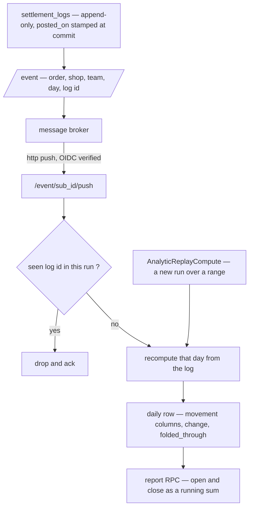
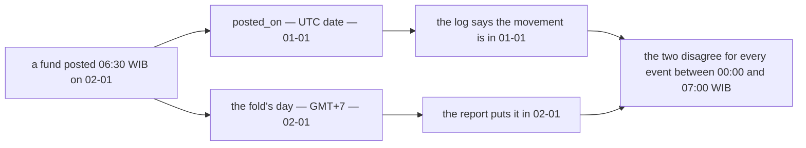
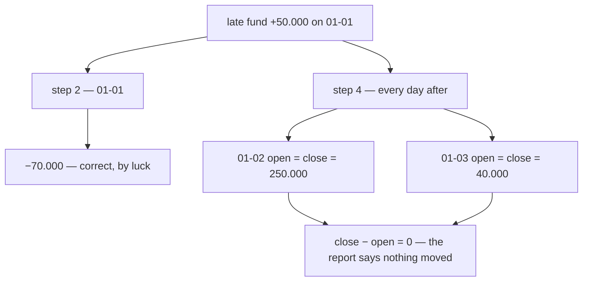
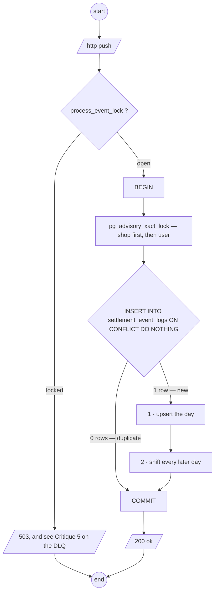
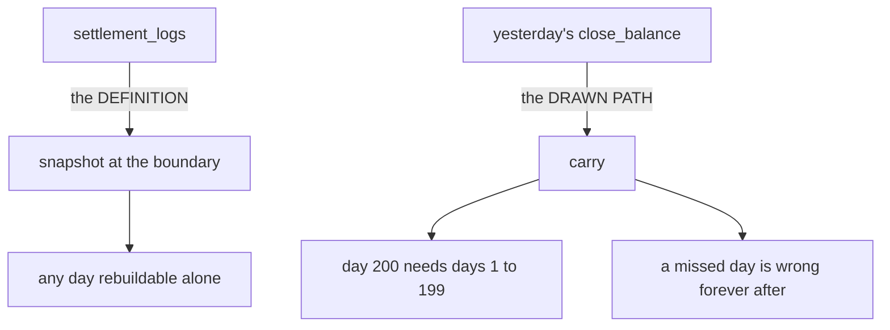
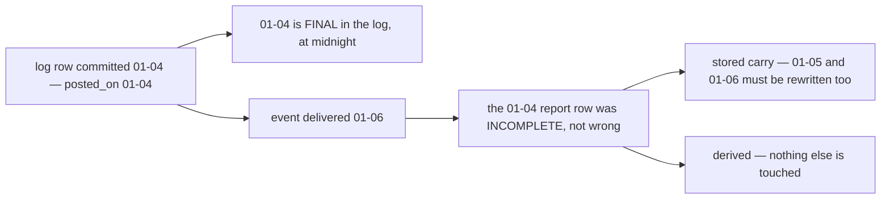

# Clarity — `analytic_context.md`

What I read out of [analytic_context.md](./analytic_context.md). **That doc is yours — this one is
mine.** Answered points are deleted, so this file is always the current open set. Decisions go in
[context_decision.md](./context_decision.md), one settlement decision log.

## What this round answered — five of them

| | you wrote | it settles |
| --- | --- | --- |
| ✅ | `### Events.` 4 — `order_created_by_user_id` on the event | **where the user dimension comes from.** It was my biggest blocker: nothing in settlement or `orders` records the order's creator. ⛔ **It solves the LIVE fold and not the REPLAY** — see [Critique 3](#critique) |
| ✅ | `### Idempotency Layer.` — `settlement_event_logs`, PK = the broker's message id, insert-fails-means-duplicate | **the dedup key**, and it resolves the collision I raised in the right direction: `AnalyticReplayCompute` republishes under NEW message ids, so a replay is correctly not deduped. ⛔ **And that is exactly what makes [Q1](#question) dangerous** |
| ✅ | 1-month retention, swept by `AnalyticMaintenanceRun` | the unbounded-growth problem. ✅ **And the margin is right**: Pub/Sub retains at most 7 days, so a redelivery can never outlive its dedup row |
| ✅ | *"when in step 2 returning row is 0"* | my *"an `UPDATE … RETURNING` that matches nothing returns zero ROWS, not `id = 0`"*. Correct as now written |
| ✅ | `duplicate → http 200 ok` | a duplicate must ACK, not NACK. Right, and it is the half people get wrong |

⚠ **What `process_event_lock` does NOT do**, said plainly because it looks like it should: it is a
developer's maintenance switch (`{ lock: true|false }`), not a per-key mutex. Two events for the same
shop-day still race each other, and the late-event cascade can still deadlock against itself —
[C2 and C4](#c--executes-right-number-wrong-behaviour) stand unchanged.

---

## Critique

| | Problem | → Recommend |
| --- | --- | --- |
| **1** | ⛔ **`AnalyticReplayCompute` DOUBLE-COUNTS, and the two things that cause it were both decided correctly.** The fold is incremental (`fund += @change`), and dedup is keyed on the broker's message id — so a replay, publishing new messages, is deliberately *not* deduped. Replay a range that was already folded and every movement in it is added a **second** time. Run it twice, three times. ⚠ The RPC exists *"when error happen and root need to recompute"* — the moment it is reached for is a moment the rows already hold numbers. | **Recompute the day instead of incrementing it** ([the fold contract](#proposed-design--the-fold-contract)) — then replay, redelivery and reorder are all the same harmless operation and the dedup table becomes an optimisation rather than a correctness control. If the increment stays, replay must **zero the affected rows inside the same transaction** before it starts, and the doc must say so — an incremental fold with a non-idempotent replay is a corruption waiting for its first incident. |
| **2** | ⛔ **The dedup row is written BEFORE the compute, so a failed compute loses the movement permanently.** *"1. insert to `settlement_event_logs`. 2. when it fails its mean event already processed."* If that insert commits and the compute then fails, the 500 makes Pub/Sub redeliver — and the redelivery now hits a row that says *already processed*, ACKs, and the money is never folded. **Nothing reports it**: the log has the row, the report does not, and no counter disagrees. | **One transaction: dedup insert and compute together**, so a failure rolls back both. ⚠ **And it must be `INSERT … ON CONFLICT DO NOTHING` with a rows-affected check, not a caught PK violation** — in Postgres a raw constraint error *aborts the whole transaction*, so "insert, catch the error, carry on" cannot work inside the transaction that also does the compute. |
| **3** | ⚠ **`order_created_by_user_id` rides on the event and is persisted NOWHERE, so the user table can be folded but never rebuilt.** Checked again: it is not on `settlement_logs`, not on `order_settlements`, and `orders` has no creator column at all ([order.go](backend/services/selling_service/selling_service_models/order.go)) — `AuthorUserID` lives on `order_drafts`. `AnalyticReplayCompute` replays *the log*, and the log does not carry this field. ⚠ It also puts the burden on **every writer forever**: `export_service` posting a `fund` must know who created the order, and `SettlementPostRequest` has no such field today. | **`order_settlements.creator_user_id`, stamped once by the opening row** — set at the account's first entry, read by the fold from the state table (one service, HARD RULE 3 clean), and durable, so a replay is correct years later. The event can still carry it; it just stops being the only copy. ⚠ It still needs `selling_service` to record an author on the order — two migrations in two lanes. |
| **4** | ⛔ **`/event/[sub_id]/push` is an UNAUTHENTICATED write to financial reports.** [push.go:41](backend/pkgs/event_source/push.go#L41) reads the body, decodes and calls the handler — no token, no signature, no origin check. The roling ACL cannot reach it: it reads `request_policy` off a Connect request message and a webhook is not one. Anyone who can reach the port POSTs JSON and moves a shop's reported balance. `sub_id` is a URL, not a secret — it is in logs, proxies and this doc. | **Verify Pub/Sub's OIDC token inside `event_source` before the body is decoded** — Google signs a JWT with the subscription's service account; check issuer, audience and email. ~30 lines in one shared package and every future consumer inherits it. ⚠ **Write it into the doc**, because "the ACL covers everything" is true of RPCs and false of this seam. |
| **5** | ⚠ **A 500 while `process_event_lock` is held feeds the DEAD-LETTER QUEUE with perfectly good events.** Pub/Sub treats any non-2xx as a NACK and counts a delivery attempt, so a maintenance window longer than `max_delivery_attempts × backoff` dead-letters events that were never malformed. `CLAUDE.md` already requires a dead-letter policy on push subscriptions, which is what makes this reachable rather than theoretical. | **State the maximum safe maintenance window in the doc**, derived from the subscription's retry policy — or **detach the subscription** for maintenance instead of rejecting in the handler, which stops delivery without consuming attempts. ⚠ Either way the lock is a *switch*, so also say what it does **not** cover: it does not serialize two events for one shop-day. |
| **6** | ⛔ **`update and recount upper date` rewrites days that a decision promised were FINAL, and it is unbounded.** One late event on 01-04 rewrites 01-05 … today for that scope, while the live fold writes the same rows. ⚠ **This is a cost of STORING the carry, not of being late**: a day's own movement columns never change, only the carried figures do. | **Derive `open_balance` / `close_balance`** — a late event then touches exactly one row. If they stay stored, the doc must say how far the recount walks and that a closed day is mutable. [Q5](#question). |
| **7** | ⚠ **Four balance-shaped columns, two of them defined.** `balance`, `change`, `open_balance`, `close_balance` — only the last two have a meaning on record ([open-and-close-are-log-sums-at-the-day-boundaries](./context_decision.md#open-and-close-are-log-sums-at-the-day-boundaries)), and no statement in `## Flow` writes `change` or `balance` at all. | **Keep `change` as the day's net and DROP `balance`.** An undefined money column on a report table is how two screens start disagreeing. |
| **8** | ⚠ **The two RPCs that rewrite or halt everyone's reported money have no policy**, and `AnalyticMaintenanceRun` also *deletes* dedup rows. `## Access Role.` defers roles ([no-role-policy-yet](./context_decision.md#no-role-policy-yet)) — right for the ledger's reads, wrong for these. | **`[ROLE_ROOT, ROLE_ADMIN]`, unscoped** — they are service-wide, so per CLAUDE.md an unscoped policy must not carry team-level roles. Same for writing `process_event_lock`. |
| **9** | ⚠ **`last_updated` is a write stamp, not a watermark.** It says when the row was touched, not whether the fold has seen every log row for that day — which is exactly the state a maintenance window or a broker outage leaves behind. | **`folded_through` — the highest `settlement_log.id` folded into this row.** It makes *"is this number complete?"* answerable against the log, which is also the whole test a reconcile needs. |
| **10** | ⚠ **Small ones, together.** The RPC list numbers `1.` then `3.` — `AnalyticStatus` was removed and the numbering was not · `value` is a `string` holding `{ lock: true|false }`, so it is JSON in a text column and a boolean wrapped in an object · nothing says whether `AnalyticReplayCompute` republishes through the broker or folds directly, and only the first gets deduped at all. | Renumber · make `value` `jsonb` or state that it is an opaque encoded blob · **say replay goes through the broker**, so there is one path into the fold rather than two. |

---
## Proposed Design — the fold contract

The parts I would build, drawn against what you have already drawn. Two changes only: **the event
carries a key rather than an amount**, and **open/close are derived**.



**Why recompute-the-day rather than add-a-delta.** A recompute makes redelivery, reordering and replay
the same harmless operation, so the dedup step becomes an optimisation rather than a correctness
control — and a day is small (one shop, one day, tens of rows). A delta is only correct while every
event arrives exactly once, which is the one thing a broker does not promise.

**Why derived open/close.** `balance` on the log is a running total of `change`, so the decided
snapshot definition is **identically** a running sum of each day's net — same number, no window over
the log, and no chain to repair:

| | stored carry (as drawn) | derived |
| --- | --- | --- |
| a late event | rewrites every later row for that scope | touches ONE row |
| genesis on a shop that already trades | opens at a false `0`, silently, forever | correct with no bootstrap |
| a missed day | understates every later row, permanently | one gap, neighbours unaffected |
| `close − open = Σ movements` | an invariant something must check | an identity that cannot break |
| `InitOpeningBalance` | needed — two writers race on one row | ⛔ **unnecessary** — two recomputes give the same number, and `UNIQUE (day, shop_id, team_id)` settles the insert |
| cost | one read | `SUM() OVER` across ≈365 rows per shop-year |

⚠ **If open/close are derived, `InitOpeningBalance` can be deleted** — with it the cross-service call
held inside the ledger's transaction, and the rollback that refuses to record money because a report
row could not be made ([context Q8](./context_clarify.md#question)).

### The write path, checked statement by statement

`## Flow` now carries real SQL, which is the most checkable thing in any of these docs — so I ran it
against Postgres semantics and the shipped schema rather than reading it. **Three statements do not
execute, and the arithmetic is wrong independently of that.** None of this is a reason to change the
design: the shape — upsert the day, cascade to later days — is right, and the corrected version is
shorter than what is written.

#### A · will not execute

| | the line | why Postgres rejects it |
| --- | --- | --- |
| **A1** | `set d.fund += @fund_change` | **Postgres has no `+=` operator.** It is `SET fund = fund + @change` |
| **A2** | `set d.fund = …`, `set d.close_balance = …` | **the target of `SET` may not be qualified.** `UPDATE t d SET d.x = …` fails with *column "d" of relation "t" does not exist* — the alias is legal everywhere in the statement EXCEPT the left of `SET` |
| **A3** | `values (…, coalesce(prev.close_balance, 0), …)` | **a `VALUES` list cannot see a CTE.** *missing FROM-clause entry for table "prev"*. ⚠ And the obvious repair is a second bug: `INSERT … SELECT … FROM prev` inserts **nothing at all** on a shop's first ever day, because `prev` has no rows and `coalesce` never runs |

#### B · executes, computes the wrong number

| | Problem | → Recommend |
| --- | --- | --- |
| **B1** | ⛔ **`d.fund` appears TWICE in the `close_balance` sum** — in step 2 and in both halves of step 4. The day's fund is counted twice in every close balance the fold writes. | Never re-derive `close_balance` from a list of columns. See [the shape that removes the whole class](#the-write-path-fixed) — the long sum is what makes this invisible, and it is not needed. |
| **B2** | ⛔ **Step 2 drops the carry, so the SECOND event of a day silently un-does step 3.** Step 3 inserts `close_balance = prev.close + @fund` — carried. Step 2 recomputes `close_balance = Σ movement columns + @change` — **no `open_balance` term**. So a day is correct until its second movement arrives and then loses every rupiah of prior position, permanently. ⚠ This is the single most damaging line, because the row still *looks* internally consistent. | `close_balance = open_balance + change`, maintained by increment. |
| **B3** | ⛔ **Step 4 assigns the SAME expression to `open_balance` and `close_balance`.** Every later day ends with `open == close`, which says the day had no movement — and it breaks `close − open = Σ movements` for every row it touches. | A late event **shifts** both by the same amount, it does not recompute either. |
| **B4** | ⛔ **Step 4 rebuilds each later day from that day's OWN movement columns plus `@fund_change`** — so all accumulated position from every earlier day is discarded on every late event. Day 200's close becomes *day 200's movements + one change*. | Same fix as B3: `open_balance = open_balance + @change`. |
| **B5** | ⛔ **`prev` has no `day < @day` filter.** `order by day desc limit 1` is the *latest* row, not the *previous* one — so a late event creating a missing past day opens from a FUTURE day's close. | `and d.day < @day`. One line, and it is the difference between a backfill that repairs and one that corrupts. |
| **B6** | ⚠ **`change` is written by no statement, and `open_balance` is written by no update.** Both are declared as tracked fields. `last_updated` is maintained, which is what makes the omission easy to miss. | Maintain `change` as the day's net — then it is the only movement figure the close balance needs. |

#### C · executes, right number, wrong behaviour

| | Problem | → Recommend |
| --- | --- | --- |
| **C1** | ✅ **FIXED this round** — the doc now says *"when in step 2 returning **row** is 0"*, which is the affected-row count and is correct. Kept as one line so nobody reintroduces it: an `UPDATE … RETURNING` matching nothing returns zero ROWS, never a row containing `0`. | ⚠ Simpler still as one `INSERT … ON CONFLICT DO UPDATE` — then there is no branch to get right. |
| **C2** | ⛔ **Update-then-insert is check-then-act, and two events for one new day race.** Both update, both match nothing, both insert — one gets a unique violation. It is *safe* only because `UNIQUE (day, shop_id, team_id)` exists, and only if the loser retries, which nothing says it does. The broker will redeliver on the 500, so it works by accident. | The upsert is atomic and needs no retry. |
| **C3** | ⛔ **PROMOTED to [Critique 2](#critique)** — it is no longer *"nothing says"*. `### Idempotency Layer.` now specifies the order, and it is the losing one: **mark first, compute second**, so a compute that fails after the mark commits is redelivered, recognised as done, and dropped. | One transaction, `INSERT … ON CONFLICT DO NOTHING`, duplicate = 0 rows affected. Full working in [Critique 2](#critique). |
| **C4** | ⚠ **The cascade takes an unbounded row-range lock and can deadlock against a second late event.** `day > @day` for one shop can be hundreds of rows, and two late events at different days lock overlapping ranges in different orders. This is precisely what `san_race` exists to catch. | Serialize per `(shop_id, team_id)` — the broker's ordering key, or a `pg_advisory_xact_lock` on the pair. Then the cascade cannot interleave with itself. |

#### D · and the day is derived twice, two different ways

⛔ **Step 1 derives `day` from `created_at` converted to GMT+7. The report was decided to bucket on
`posted_on`** ([posted-on-buckets-the-report](./context_decision.md#posted-on-buckets-the-report)) — and
`posted_on` is `DATE NOT NULL DEFAULT CURRENT_DATE` in the shipped migration
([00001_create_settlement_ledger.sql:62](backend/services/settlement_service/db_migrations/00001_create_settlement_ledger.sql#L62)),
stamped `time.Now()` in Go ([post_entry.go:201](backend/services/settlement_service/settlement_v1/post_entry.go#L201)),
with **no timezone configured anywhere in the repo** — so it lands on the UTC date.



**→ Recommend the fold read `posted_on` and never re-derive a day**, and `posted_on` be stamped as the
**Jakarta** date at write. A bucket day computed in two places is a bucket day that will disagree the
first time either place is touched — and the whole reason `posted_on` is a stored column is that the
answer should exist once.

#### E · is it safe for a LATE event? — traced with numbers

**No — and step 4 is the smaller of the two reasons.** Three of the four statements are wrong
*specifically* in the late case, and one of them undoes any repair the others make.

**The setup.** Shop 7, team 3, three days already folded and correct:

| day | the day's movement | `open_balance` | `close_balance` |
| --- | --- | ---: | ---: |
| 01-01 | `initial_total` −120,000 | 0 | −120,000 |
| 01-02 | `fund` +100,000 | −120,000 | −20,000 |
| 01-03 | `external_ads_fee` −10,000 | −20,000 | −30,000 |

**The event.** A `fund` of **+50,000** whose day is **01-01**, delivered now. Every later day's position
should move by +50,000, and nothing else should change.

**Step 2, on 01-01** — `fund` 0 → 50,000, then
`close = fund(0) + initial_total(−120,000) + … + fund(0) + 50,000` = **−70,000**. ✅ Correct — and
correct *by luck*: `open_balance` was 0 so omitting it cost nothing, and `fund` was 0 so counting it
twice cost nothing. **Both bugs are invisible on exactly the row a test would check first.**

**Step 4, on 01-02 and 01-03** — each later row is rebuilt from **its own movement columns**, not from
its existing position:

| | as the query computes it | what it should be |
| --- | ---: | ---: |
| 01-02 `close` | `fund(100,000) + fund(100,000) + 50,000` = **250,000** | 30,000 |
| 01-02 `open` | same expression = **250,000** | −70,000 |
| 01-03 `close` | `ads(−10,000) + 50,000` = **40,000** | 20,000 |
| 01-03 `open` | same expression = **40,000** | 30,000 |

⛔ **A shop that is owed 70,000 now reports having received 250,000** — the sign flips. And because both
columns get the same expression, `close − open = 0` on every repaired row: the report states that a day
carrying 100,000 of `fund` had no movement at all.



**And two more that only bite when an event is late:**

| | |
| --- | --- |
| ⛔ **step 3 carries from a FUTURE day** | `prev` is `order by day desc limit 1` with **no `day < @day`**. On a late event for a day that has no row yet — a quiet day, or one the fold missed — the "previous" row is a *later* one, so the new past day opens from a future close. This is wrong **only** in the late case, which is why it reads as harmless |
| ⛔ **step 2 ERASES step 4** | step 2 recomputes `close_balance` from the day's own movement columns with **no `open_balance` term**. So the next ordinary event that lands on 01-02 wipes the shift step 4 just wrote. ⚠ **This holds even if step 4 is corrected** — the repair is only as durable as the next event on that row |

**The root cause is one thing, and it is not lateness.** `close_balance` has **three different
definitions** across three statements:

| | says `close_balance` is |
| --- | --- |
| step 3 (insert) | `prev.close + change` — **carried** |
| step 2 (update) | `Σ the day's own movement columns` — **not carried** |
| step 4 (cascade) | `Σ the day's own movement columns + one change` |

A column defined three ways cannot be repaired by a fourth statement. **Fix the definition and lateness
stops being a special case** — see [the write path, FIXED](#the-write-path-fixed):

- **step 2 increments**: `close_balance = close_balance + @change`, never a re-derivation.
- **step 4 shifts**: `open_balance = open_balance + @change, close_balance = close_balance + @change`.
- **step 3 filters**: `and day < @day`.
- **all of it in ONE transaction**, or a cascade that fails leaves later days stale with nothing to notice.

⚠ **Then the `is late` test disappears** — `day > @day` matches nothing for an on-time event, so the
cascade can run unconditionally. ✅ **And ordering stops mattering**: once every write is a delta rather
than an absolute, two events interleaving compose to the same answer. What is still owed is a
`pg_advisory_xact_lock` on `(shop_id, team_id)` — two range updates over overlapping rows can still
deadlock if their scan orders differ, and that is a `san_race` case, not a review one.

### The write path, FIXED

> A drop-in replacement for `## How We Compute inside Hooks.`

**Yes, it is fixable, and it gets shorter.** Everything below is a proposal *for* your doc (RULE 7b —
I do not edit it): lift it wholesale if you agree with it. ⚠ **Reviewed against Postgres semantics, not
executed** — Docker was not running here. It should be run once before it is built on.

**The single change that fixes most of it**: `close_balance` stops being *re-derived from the movement
columns* and becomes *maintained by increment*. Three statements each carrying their own definition of
one column is what made every other defect possible.

| the invariant | |
| --- | --- |
| `change` | the sum of the day's own movements |
| `close_balance` | `open_balance + change` — **always**, by construction |
| `open_balance` | the previous day's `close_balance` |

#### The flow



⚠ **The dedup insert is INSIDE the transaction**, which is the whole point: a compute that fails rolls
the mark back with it, so the redelivery reprocesses instead of being dropped as done (Critique 2). And
it is `ON CONFLICT DO NOTHING` + rows-affected, **never a caught PK violation** — a raw constraint error
aborts the transaction, so the "catch it and carry on" shape cannot work here.

⚠ **Two advisory locks, always in the same order** (shop, then user), because one event updates both
report tables. A fixed order is what stops two events deadlocking against each other; taking them in
whatever order the code happens to reach is how a deadlock appears only under load.

#### 0 · the day

```
day := settlement_logs.posted_on        -- read, never re-derived
```

Not `created_at` converted to GMT+7. `posted_on` is a stored `DATE`, and the report was decided to
bucket on it — deriving it a second time is
[the timezone contradiction](#the-bucket-day-is-derived-twice-in-two-timezones-and-the-two-disagree-for-a-third-of-the-clock).
⚠ Which leaves one thing to settle: `posted_on` is stamped `CURRENT_DATE` on a server with no timezone
configured, so it is the **UTC** date. It should be the **Jakarta** date.

#### 1 · the day's own row — one atomic statement, no branch, no race

```sql
INSERT INTO shop_settlement_daily_reports AS d
       (day, shop_id, team_id, fund, change, open_balance, close_balance, last_updated)
VALUES (@day, @shop_id, @team_id, @change, @change,
        COALESCE((SELECT close_balance FROM shop_settlement_daily_reports
                   WHERE shop_id = @shop_id AND team_id = @team_id AND day < @day
                   ORDER BY day DESC LIMIT 1), 0),
        COALESCE((SELECT close_balance FROM shop_settlement_daily_reports
                   WHERE shop_id = @shop_id AND team_id = @team_id AND day < @day
                   ORDER BY day DESC LIMIT 1), 0) + @change,
        now())
ON CONFLICT (day, shop_id, team_id) DO UPDATE
   SET fund          = d.fund          + @change,
       change        = d.change        + @change,
       close_balance = d.close_balance + @change,
       last_updated  = now();
```

- **`day < @day`** in both subqueries — without it a late event opens its day from a *future* close.
- **A scalar subquery is legal inside `VALUES`**, so no CTE, and no *"insert nothing on the shop's
  first day"* trap.
- **`ON CONFLICT` replaces the update-then-check-rowcount-then-insert dance** — atomic, no branch, and
  the concurrent-insert race cannot occur.
- Only the movement column changes per type — `fund` here, `initial_total` elsewhere. One statement
  with a substituted column name, not seven statements.

#### 2 · every later day — a SHIFT, never a recomputation

```sql
UPDATE shop_settlement_daily_reports
   SET open_balance  = open_balance  + @change,
       close_balance = close_balance + @change,
       last_updated  = now()
 WHERE shop_id = @shop_id AND team_id = @team_id AND day > @day;
```

⚠ **Run it unconditionally — the `is Event Received late ?` test is not needed.** `posted_on` can never
be in the future, so for an on-time event `day > @day` matches no rows and this is a no-op. The `WHERE`
clause already knows what the branch was trying to decide.

✅ **And because every write is now a delta, ORDER STOPS MATTERING.** Two events interleaving compose to
the same answer, a repair is no longer erased by the next ordinary event on the same row, and the whole
class of *"which statement ran last"* bugs is gone.

#### 3 · the same two statements again for `user_settlement_daily_reports`

Substituting `user_id` for `shop_id`, in the same transaction. ⚠ The user is
`order_created_by_user_id` — which is on the event and on no table, so a replay cannot reproduce it
([Critique 3](#critique)).

#### What each change repairs

| defect | fixed by |
| --- | --- |
| **A1** `+=` is not a Postgres operator | `SET col = col + @change` |
| **A2** `SET d.col` is rejected | unqualified target |
| **A3** `VALUES` cannot see a CTE | scalar subquery |
| **B1** `d.fund` counted twice | the long sum is gone entirely |
| **B2** the second event of a day wipes the carry | `close_balance` is incremented, never re-derived |
| **B3/B4** the cascade rebuilds later days from their own columns | it shifts them |
| **B5** `prev` carries from a future day | `day < @day` |
| **B6** `change` written by nothing | maintained in statement 1 |
| **C1** branching on a rowcount | no branch — one upsert |
| **C2** concurrent insert race | `ON CONFLICT` |
| **C3** mark-then-compute loses events | dedup insert inside the transaction |
| **C4** cascade deadlock | advisory lock per scope, fixed order |
| **D** the day derived twice | read `posted_on` |
| **E** every late-event failure above | all of the above — lateness stops being a case |

#### What this does NOT fix, stated so it is not assumed

| | |
| --- | --- |
| ⛔ **replay still doubles** | statement 1 increments, so `AnalyticReplayCompute` over an already-folded range adds it again ([Q1](#question)). Either replay zeroes the range in the same transaction, or the fold recomputes the day instead of incrementing |
| ⛔ **it is still a carry** | correct now, but it still opens every live shop at `0` on the day the tables ship, still loses a day permanently if one is missed, and still needs statement 2 at all ([Q5](#question)). Derived open/close needs neither statement 2 nor the `prev` lookup |
| ⚠ **the webhook is still unauthenticated** | ([Q4](#question)) — no SQL fixes that |


## Question

**Five, ranked by what is blocked.** ⚠ The SQL defects are **not** among them — a bug with a known fix
is not an open question, and the corrections are in
[the write path, FIXED](#the-write-path-fixed). Two of the five below are new this round and
both were *created* by answers that were individually right.

1. ⛔ **What does `AnalyticReplayCompute` do to rows that already hold numbers?** The fold increments
   (`fund += @change`) and dedup is keyed on the broker's message id — so a replay publishes new
   messages, is correctly not deduped, and **adds every movement in the range a second time**. Both
   halves are right on their own; together they double the reports. And the RPC is reached for precisely
   when the rows are already populated.
   **→ I recommend the fold RECOMPUTE the day rather than increment it**, which makes replay,
   redelivery and reorder the same harmless operation. If the increment stays, replay must zero the
   affected rows in the same transaction first, and the doc must say so. ([Critique 1](#critique))
2. ⛔ **Are the dedup insert and the compute ONE transaction?** As written the mark comes first — so a
   compute that fails after it commits is redelivered, recognised as *already processed*, ACKed, and the
   movement is lost with nothing reporting it. ⚠ And the fix has a Postgres detail that decides the
   shape: a raw PK violation **aborts the transaction**, so it must be `INSERT … ON CONFLICT DO NOTHING`
   with a rows-affected check, never a caught error.
   **→ I recommend one transaction, `ON CONFLICT DO NOTHING`, duplicate = 0 rows affected.**
   ([Critique 2](#critique))
3. ⚠ **Where is `order_created_by_user_id` PERSISTED?** Putting it on the event answers the live fold and
   nothing else: it is on no table, so a replay from the log cannot reproduce it, and every writer —
   including `export_service` — must supply it forever on a request that has no such field.
   **→ I recommend `order_settlements.creator_user_id`, stamped once by the opening row.** The event may
   still carry it; it should not be the only copy. ([Critique 3](#critique))
4. ⛔ **Who is allowed to POST `/event/[sub_id]/push`?** Nothing authenticates it, and the proto-based
   ACL structurally cannot — it reads a policy off a Connect request message and a webhook is not one.
   **→ I recommend verifying Pub/Sub's OIDC token in `event_source` before decode**, so every consumer
   inherits it. ([Critique 4](#critique))
5. ⛔ **Are `open_balance` / `close_balance` STORED or DERIVED — and is a closed day mutable?**
   `update and recount upper date` says mutable and walks an unbounded number of rows.
   **→ I recommend derived**: a late event then changes one row instead of cascading, genesis stops
   opening every live shop at a false `0`, and the cascade statement disappears. If they stay stored,
   the doc needs to say how far the recount walks. ([Critique 6](#critique))

⚠ **One smaller thing that needs a word rather than a decision:** whether the fold buckets on
`posted_on` or on a re-derived Jakarta date
([Contradiction](#the-bucket-day-is-derived-twice-in-two-timezones-and-the-two-disagree-for-a-third-of-the-clock)).
I recommend `posted_on`.

# Contradiction

## the bucket day is derived twice, in two timezones, and the two disagree for a third of the clock

> [posted-on-buckets-the-report](./context_decision.md#posted-on-buckets-the-report) — *"the `from` /
> `to` of every report compare against **`posted_on`** … the daily / monthly / yearly bucket keyed on
> `posted_on`"*.
>
> `analytic_context.md` `## Flow` 1 *(2026-09-02)* — *"extract **`created_at`** from `settlement_logs`.
> convert to **GMT+7** and get the date as `day`."*

**Two derivations of one day, and they are not the same day.** `posted_on` is
`DATE NOT NULL DEFAULT CURRENT_DATE` ([migration:62](backend/services/settlement_service/db_migrations/00001_create_settlement_ledger.sql#L62))
and stamped `time.Now()` ([post_entry.go:201](backend/services/settlement_service/settlement_v1/post_entry.go#L201)),
with no timezone set anywhere in the repo — so it lands on the **UTC** date, while the fold computes a
**Jakarta** date. For every movement written between 00:00 and 07:00 WIB the log says one day and the
report says the next.

**→ Recommend the fold read `posted_on` and derive nothing** — and `posted_on` be stamped as the Jakarta
date at write. The whole reason it is a stored column is that the answer should be computed once. Full
working in [D · the day is derived twice](#d--and-the-day-is-derived-twice-two-different-ways).

## `open_balance` has two definitions, and the new doc chose the one that cannot be rebuilt

> **Moved here from [context_clarify.md](./context_clarify.md)** with the reports — and it is no longer
> a suspicion, because this round chose a side by drawing it.
>
> Owner, in chat (2026-09-01) — *"open and close balance is **sum of balance log** of start and end of
> the day"*, recorded as [open-and-close-are-log-sums-at-the-day-boundaries](./context_decision.md#open-and-close-are-log-sums-at-the-day-boundaries).
>
> `analytic_context.md` `## How *_settlement_daily_reports Created` *(2026-09-02)* — *"is last
> `*_settlement_daily_reports` exist? → yes → **get last `close_balance`** → new `open_balance`"*, and
> **`close_balance = 0`** when there is none. The new `is late → update and recount upper date` branch
> only makes sense under this second reading — a snapshot has no chain to recount.

**They are not the same number.** One is aggregated from `settlement_logs`, the other is copied from the
previous report row. They agree only while every day's row exists, was written exactly once, and nothing
arrived late.

| | the SNAPSHOT (your chat answer) | the CARRY (the drawn flow) |
| --- | --- | --- |
| definition | this scope's summed position at the boundary | the previous row's `close_balance` |
| computed from | `settlement_logs` / `order_settlements` | the report table itself |
| day 200 needs | day 200 | days 1 … 199 |
| ⛔ genesis | correct on a shop that already trades | opens at `0`, and **silently** stays wrong by the accumulated position — `close − open = Σ movements` still holds on every row while every absolute figure is offset |
| ⛔ a missed day | day 6 is still right | day 6 carries day 4's close, and **every later row is understated forever** — a transient loss made permanent |
| ⛔ a re-fold | any day recomputes independently, in parallel | must be replayed in order from genesis, which is what `AnalyticReplayCompute` is now signed up to do |
| ✅ a backdated row | cannot happen — `posted_on` is stamped at commit and the log is append-only | same |



**→ Recommend the derived reading** — store each day's `change` and compute open/close as a running sum
over the stored days ([the fold contract](#proposed-design--the-fold-contract)). It **is** your chat
definition, computed the cheap way: `balance` is a running total of `change`, so *"each account's latest
row at or before T, summed"* is identically `Σ change over every row with posted_on ≤ T`. Same number,
no `DISTINCT ON`, no chain, and [Q4](#question) is what decides it.

## a past window was promised FINAL, and the fold now rewrites one

> [posted-on-buckets-the-report](./context_decision.md#posted-on-buckets-the-report) — *"**A past window
> is FINAL.** Once a day closes, nothing that arrives afterwards can change its number — so a figure
> quoted in a meeting, exported to a spreadsheet or acted on stays true."*
>
> `analytic_context.md` `## How *_settlement_daily_reports Created` *(this round)* — *"is Event Received
> late ? → yes → **update and recount upper date**"*.

**Both are defensible and they are not compatible as written.** The resolution is a distinction neither
doc makes: **the LOG is final at midnight, the REPORT is final only once the fold has caught up.** A
late event never adds a new fact to a closed day — the row was already committed inside it — so what
moves is not the day's truth but our knowledge of it.



**→ Recommend two things, and the second removes the contradiction rather than documenting it.**
Add `folded_through` so a row states whether it is complete (Critique 8), and **derive open/close**
(Critique 4) so catching up on a late event changes exactly the day it belongs to. Finality then means
what the decision claimed: *no new fact can enter a closed day*, which is true and enforced by
`posted_on` being stamped at commit.

---

# Awaiting

- ⚠ **The event's fields are now written down and settlement still publishes nothing.** `### Events.`
  names four — the inserted `settlement_logs` row, `shop_id`, `team_id`, `order_created_by_user_id` — but
  no event exists in the proto and `settlement_v1.Service` holds no `EventSender`. ⚠ **`shop_id` and
  `team_id` are already ON the log row**, so listing them separately invites two copies that can
  disagree. **→ Recommend the event carry the log row and the creator id only.**
- ⚠ **Carrying the whole row makes the fold's arithmetic depend on the MESSAGE, not the table.** That is
  what allows a redelivery or a replay to fold a value the log no longer agrees with. It costs nothing to
  re-read the row by id inside the fold's transaction, and it is what makes the event a doorbell rather
  than a delivery.
- ⚠ **Shape 1's filter still says *customer service* where its group-by says *user*.** Same person,
  two names, and only one of them is a column anywhere.
- ⛔ **Shape 2 groups by TEAM and cannot be authorized for a team user** — `team_id` is `use_scope` and
  required on every settlement request. **→ Recommend declaring it an ADMIN screen**, which needs no new
  mechanism since ROOT/ADMIN in team 1 bypass scope. Re-routed here from `context_clarify.md`.
- ⚠ **No `orders` count on either table.** No sum of movement columns can reconstruct it, and a day with
  one large order reads identically to a day with fifty small ones. Cheap now, a backfill later.
- ⚠ **Monthly and yearly modes have no stated source.** Rolled up from the daily rows at read, or their
  own tables? Recommend rolled up — the daily row is small and a second grain is a second thing to
  reconcile.
