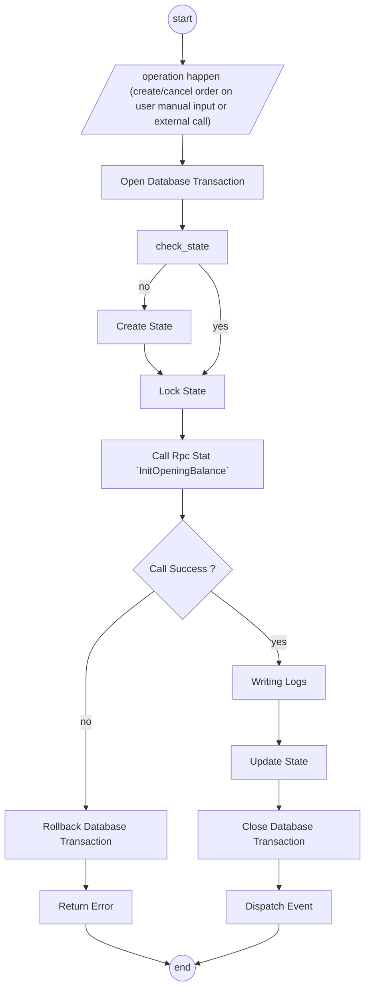
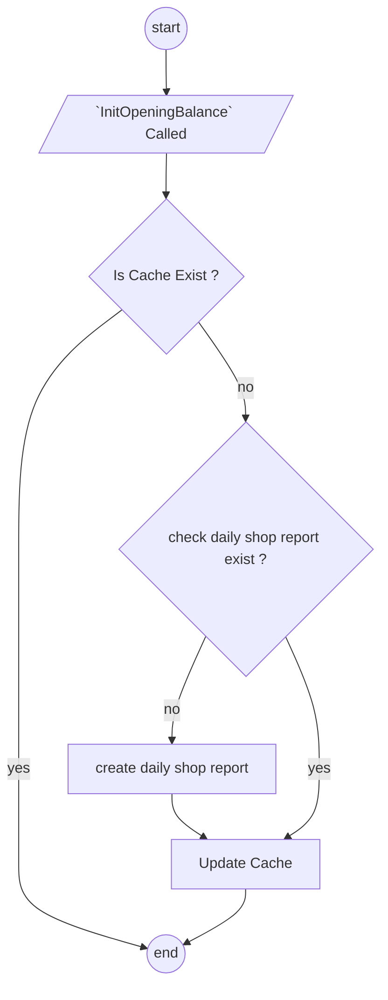

# Settlement Contexts.

## Reference.
1. for analytical design, [read this](./analytic_context.md)
2. other info, [read this](./meta_context.md)

## The Existing Problems.
1. our order live in other platform outside our system, we record that twice in our system.
2. in order, when complete, it can have fund. but sometimes, also can charge shipping cost, ads fee, platform fee, problem funding and other unperdictable +/- fund or cost/fee
3. and total order in begining, its often have diff payout at the end, and its also still happen other fee in next day

## What Frontend Expected from this.
1. User can Manually add settlement entry from order detail page.

## What External Service expected from this.
1. settlement can call by api to settlement entry

## Purpose
1. create `settlement_service` to cover order settlement

## Responsbility
1. Its cover order settlement, for owe and balance across teams, its `liability_service`
2. Provide Analitical data reports. Read [this](./analytic_context.md) for more information. 

## General Brief.
1. its order grain.
2. we have `Settlement Log` part of `ledger_context` and it publish to the broker and post to the Financial Ledger
3. this `settlement_service` not covered automatic importing file. its `export_service` responsbility [defer for now, talk later]
4. in many case settlement balance doesn't fully settle, always any urecorded adjustment for the order, its come from the platform and its okay.
5. Settlement doesn't rely on our order status. its can be happen anytime.
6. settlement just can adjustment by added record log, not updated the log.

## Access Role.
1. for now, there is no specific role for this service. [defer later].

# Settlement Ledger.
in settlement ledger we have 3 things.
- `logs` that named `settlement_logs`
- `state` that named `settlement_states`

## How Ledger Behave when ledger updated.
1. when `InitOpeningBalance` called, its bring data `state` and `time.Now()` that after locked.

2. What happen when call `InitOpeningBalance`

## Settlement Log Ledger Shapes
1. It has field :
    - `id`, common primary key id
    - `unique_id`, string type, custom idempotency key with `order_id`.
    - `order_id`
    - `shop_id`
    - `team_id`
    - `actor_id`
    - `source_type`
    - `settlement_type`
    - `change`, it can -/+
    - `balance`
    - `created_at`

2. what is `settlement_type`
    - `initial_total`, its estimated revenue marketplace platform total
    - `fund`, its real revenue we get, usualy after customer received the order, its not net, platform still charge in other day sometimes
    - `external_ads_fee`
    - `affiliate_fee`
    - `marketplace_adjustment`
    - `other`
    - `initial_total_cancel`

3. what is `source_type`, its for determined how entry added:
    - by external service, `exporter`
    - or by manual in frontend, `manual`

4. `actor_id` is who create the entry, its pic

## Idempotency Key.
### The Problem.
1. we have 2 way about record settlement, manual and export.
2. we have many different marketplace platform outside, `shopee`, `tiktok`, `tokopedia` and etc. its doesn't have Idempotency Key that can be used.

### Best Effort.
1. we must set `unique_id` in outside `settlement_service`, so exporter and manual can decide how they generate `unique_id`. For example its can from `hash(date+order_ref_id)`
 

### Settlement Behaviors
| .. | Order ID | At | Type | Change | Desc | Balance | 
| ------------- | ------------- | ------------- | ------------- | ------------- | ------------- | ------------- |
| .. | 1 | 01-01-2026 20:30 | `initial_total` | - 120.000  | On Order Created (write opposite from `order_marketplace_total` )  | - 120.000
| .. | 1 | 02-01-2026 09:30 | `fund` | + 100.000  | On Order Completed  | - 20.000
| .. | 1 | 04-01-2026 09:30 | `external_ads_fee` | - 10.000 | Ads Fee External Platform | - 30.000
| .. | 1 | 04-01-2026 09:30 | `marketplace_adjustment` | + 20.000 | reimbursement | - 10.000

## Settlement State
1. We have settlement state, we called `order_settlements`. it has:
    - `order_id`
    - `initial_total`
    - `last_balance`

## Type `initial_total` and `initial_total_cancel`
1. its trigered on order created, `order_service` calling --> `settlement_service`
2. when order cancel, its create `initial_total_cancel` and make opposite of `initial_total`, `order_service` calling --> `settlement_service`

## The Reason `InitOpeningBalance` is existed.
1. It's to prevent race condition, because we calculate window aggregation of `open_balance` and `open_balance`.

