# Clarity — `settlement_context.md`

What I read out of [settlement_context.md](./context.md), and what has to be settled before a screen
can exist. **That doc is yours — this one is mine.** Answered points are **deleted**, so this file is
always the current open set.

> ## 🔁 The two-grain round — `order_id` is nullable now (2026-09-10)
>
> Four edits to `context.md` in one pass: `order_id` **nullable**, `unique_id` no longer scoped to it,
> `system_adjustment` added as an **eighth type**, and a new `## Two Type Of Settlement.` naming the
> second grain. ✅ **Three of my open points close here.**
>
> | | |
> | --- | --- |
> | ✅ **the second grain is NAMED** | *"settlement that addressed to `shop_id`"* — my recommendation was to name it rather than let it read as *"`order_id` happens to be null"*, and it is named |
> | ✅ **`system_adjustment` reached BOTH lists** | the `settlement_type` list **and** `### Field that tracked.` — the HARD RULE 11 drift I recorded is closed in the same pass it was created |
> | ✅ **the WITHDRAWAL has a home** | [superseded-every-entry-names-an-order](./context_decision.md#superseded-every-entry-names-an-order) said outright *"by this decision the answer cannot be a settlement row with no order"*. It can now — see [Q1](#question), which this may close outright |
>
> ⛔ **And it REVERSES two recorded decisions**, which is the owner's to record (RULE 7b) and mine to
> flag (RULE 12 — a reversed decision is renamed and its references grepped):
>
> | decision | said | now |
> | --- | --- | --- |
> | [superseded-every-entry-names-an-order](./context_decision.md#superseded-every-entry-names-an-order) | *"`order_id` is **NOT NULL** on both settlement tables"* | nullable on the log |
> | [superseded-the-grain-is-the-order](./context_decision.md#superseded-the-grain-is-the-order) | the grain is *"the order, **absolutely**"* | two grains, order and shop |

## ✅ SETTLED — the idempotency key is GLOBAL

[the-idempotency-key-is-global](./context_decision.md#the-idempotency-key-is-global) (owner,
2026-09-10) — `UNIQUE (unique_id)`, shipped as
[`00002_settlement_unique_id_is_global.sql`](../../../backend/services/settlement_service/db_migrations/).
The finding was that `order_id` went nullable while the index stayed `(order_id, unique_id)`, and
Postgres treats NULL as distinct from NULL — so shop-addressed rows would have lost the duplicate
guarantee **silently**, which is the one property all three writers rest on.

⚠ **One thing the fix required that the question did not raise**: the handler's idempotency lookup is
now global too, so a hit on ANOTHER order would have been returned as this caller's own successful
write. It is refused (`errUniqueIDTaken`) instead — a wrong success reads as correct, and an error
does not.

⚠ **Still open beside it**: `order_id` is nullable in the DOC and `NOT NULL` in `00001` and in the
model. The index is now correct for a column that has not changed yet — safe in that order, and the
reverse would not have been.

## ⛔ `system_adjustment` in the LOG repairs one class of damage and cannot repair the other

**Q5 is answered** — it is a `settlement_type`, so it is a ledger row, shop-addressed, and it reaches the
report through the broker like everything else. ⚠ **My report-column recommendation is withdrawn as the
default**, and what survives of it is a gap this design leaves open rather than an argument against it.

**The adjustment moves the log AND the report by the same +X.** Whether that repairs anything depends on
whether they were wrong *together*:

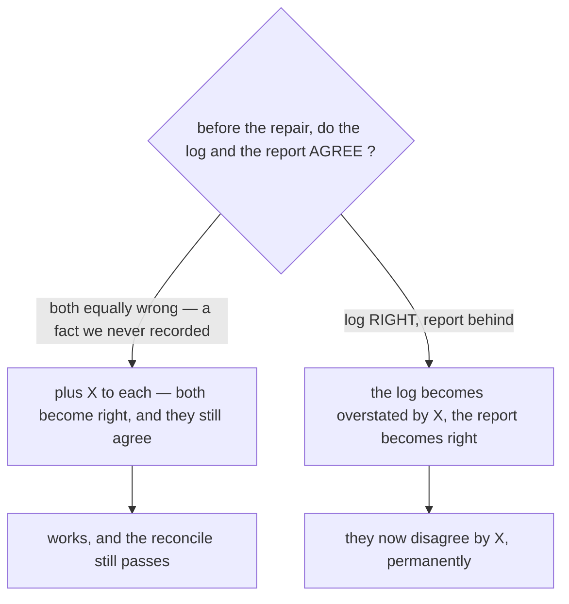
```mermaid
flowchart TB
  S{"before the repair, do the log and the report AGREE ?"}
  S -->|"both equally wrong — a fact we never recorded"| A["plus X to each — both become right, and they still agree"]
  A --> OK["works, and the reconcile still passes"]
  S -->|"log RIGHT, report behind"| B["the log becomes overstated by X, the report becomes right"]
  B --> BAD["they now disagree by X, permanently"]
```

⛔ **The second column is what every known drift cause produces.** A dead-lettered event, a cascade that
did not run, a genesis seeded wrong, a replay that skipped a day — in all four **the log already holds
the truth and only the fold was lost**. Adding a log row there does not restore agreement, it destroys
it: the reconcile (`close_balance(D) = Σ change`) then reports a difference forever, which is how a
check gets switched off.

| the damage | what actually repairs it |
| --- | --- |
| a fact was never recorded at all | ✅ `system_adjustment` — exactly what it is for |
| a `SettlementPost` never landed | `SettlementPost`, idempotent on the key — not an adjustment |
| ⛔ **the fold missed a row the log has** | ⛔ **nothing in the drawn flow** — the replay cannot reach it, and an adjustment breaks the reconcile |

**→ Recommend a targeted DAY RE-FOLD from the log** for the third row — re-read one day's rows for one
scope and rewrite that day. It reaches **any** date because the log has no retention limit, it needs no
adjustment row, and it leaves the ledger true.
⚠ **It is a second reader of the log**, which
[the-replay-seeks-the-broker](./context_decision.md#the-replay-seeks-the-broker) deliberately avoided —
but that decision was about a **range replay through the webhook**, and this is one day, on demand, for
repair. Worth deciding on its own rather than inheriting that answer.

## ⚠ Two smaller things the second grain opens

| | |
| --- | --- |
| **what does `balance` hold on a shop-addressed row?** | it is *"the running position AFTER this row"*, and it runs inside an account. `order_settlements` is keyed by `order_id`, so a shop-addressed row has **no account to run in** and no state table of its own. `NULL` reads as *not applicable*, `0` reads as *a position of zero*, and only one of those is true |
| **it appears on no panel** | `OrderSettlementDetail` is *"one order's whole log"*. A shop-addressed row folds into the daily reports (it still carries `shop_id` and `team_id`) but is visible on no screen — so a withdrawal or an adjustment can be posted and never read back |


## ✅ `shop_settlements` landed — the lock finding closes, and the GENESIS SEED breaks

`## Settlement State` gained a second table (`shop_id`, `team_id`, `last_balance`). ✅ **The lost-update
path from the last round is gone** — a shop-addressed writer now has a row to lock, exactly as
`order_settlements.order_id` serialises order posts.

⚠ **One line still owed: which column is the KEY.** `order_settlements` states that `order_id` is the
primary key *"enforced by the table's shape rather than by an index somebody could forget"*. This one
lists two columns and names neither. **→ Recommend `shop_id` as the primary key**, `team_id`
denormalised beside it — a shop belongs to one team, and a single-column key is what makes the row
lockable by one value.

### ⛔ The genesis seed reads one state table and there are now two

> [superseded-genesis-is-seeded-from-the-state-table](./context_decision.md#superseded-genesis-is-seeded-from-the-state-table)
> — *"`SELECT shop_id, team_id, SUM(last_balance) FROM order_settlements GROUP BY shop_id, team_id`"*

Both state tables now back movements that fold into the **same** daily report row, and the seed reads
only the first.

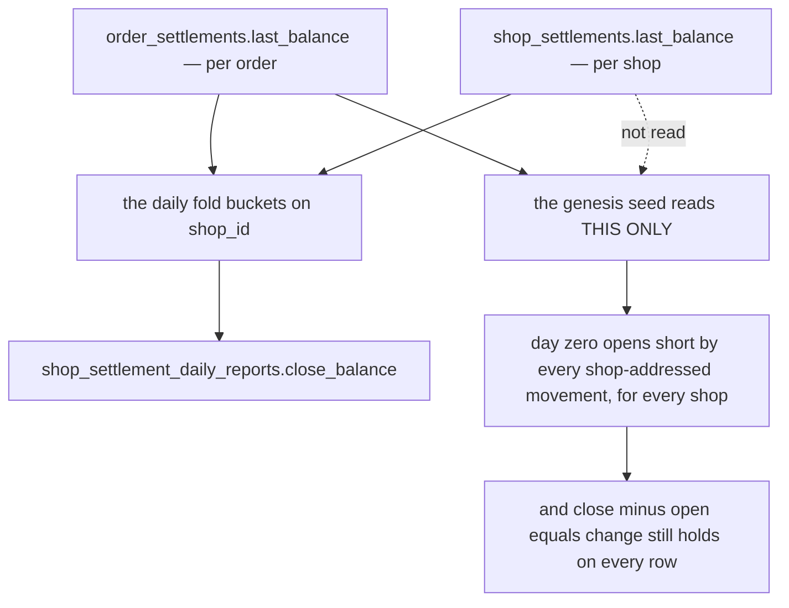
```mermaid
flowchart TB
  O["order_settlements.last_balance — per order"] --> F["the daily fold buckets on shop_id"]
  S["shop_settlements.last_balance — per shop"] --> F
  F --> R["shop_settlement_daily_reports.close_balance"]
  O --> G["the genesis seed reads THIS ONLY"]
  S -.->|"not read"| G
  G --> W["day zero opens short by every shop-addressed movement, for every shop"]
  W --> X["and close minus open equals change still holds on every row"]
```

**→ Recommend the seed become `SUM(order_settlements.last_balance) + shop_settlements.last_balance`**
per `(shop_id, team_id)`.

⚠ **This is the worst shape of miss, for two reasons already recorded here:**

| | |
| --- | --- |
| it is **cheap exactly once** | the seed runs in the migration and never again |
| ⛔ **nothing can repair it afterwards** | the [replay floor](./analytic_context_clarify.md#the-replay-floor--elaborated) refuses any `start_date` at or below the genesis day, and `AnalyticReseedGenesis` is recommended but **not decided and not built**. A wrong genesis is therefore permanent and invisible |

⚠ **And it is the third time this exact shape has appeared this week** — a new case added, and the one
place that enumerates every case not updated with it (HARD RULE 11). Here the enumerating place is a
**decision**, not a table, which is why a grep for lists would not have caught it.

### ⚠ `last_balance` is narrower here than the name reads

Per `### Settlement Behaviors` table 2, the shop chain runs over **shop-addressed rows only** — it opens
at −20.000 rather than from the orders' accumulated position.

| | holds |
| --- | --- |
| `shop_settlements.last_balance` | the shop's **own direct** movements |
| `shop_settlement_daily_reports.close_balance` | the shop's **whole** position, order rows included |

**→ Recommend one line saying which.** A reader meeting a table called `shop_settlements` will assume
the first IS the second — and that assumption is precisely the one that produced the genesis bug above,
so stating it is what makes the fix read as obvious rather than as a special case.


## ✅ `### Settlement Behaviors` grew a second table — and it answers `balance`, then re-asks it

The shop-addressed example carries a running `balance` (`−20.000 → −30.000 → −10.000`), so the question
from the last round is answered: **it is not NULL, and each grain runs its own chain.**

⛔ **Which means a shop-addressed write has nothing to serialise on.**

An order-addressed write is safe by construction: `order_settlements.order_id` is the PRIMARY KEY and,
per the migration, *"the row a writer LOCKS to serialise concurrent posts against the same order"*.
`## Settlement State` still names only that table, so a shop-addressed writer has no equivalent — it must
read the last shop row and compute the next `balance` with nothing held.

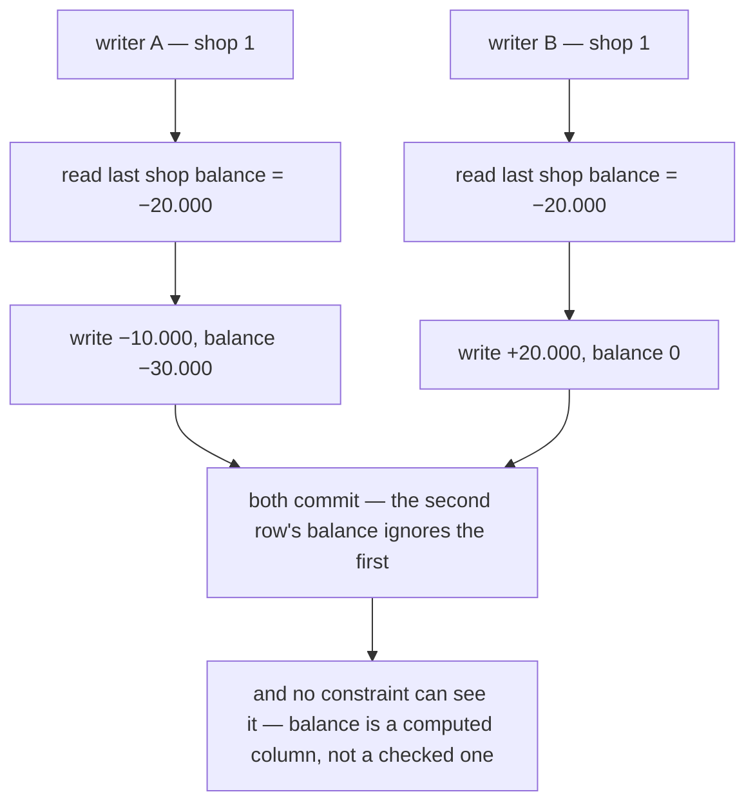
```mermaid
flowchart TB
  A["writer A — shop 1"] --> R1["read last shop balance = −20.000"]
  B["writer B — shop 1"] --> R2["read last shop balance = −20.000"]
  R1 --> W1["write −10.000, balance −30.000"]
  R2 --> W2["write +20.000, balance 0"]
  W1 --> X["both commit — the second row's balance ignores the first"]
  W2 --> X
  X --> Y["and no constraint can see it — balance is a computed column, not a checked one"]
```

**→ Recommend a shop-level state row**, the same shape `order_settlements` has: keyed on `shop_id`,
holding `last_balance`, created on first post. It gives the writer a row to lock and makes *"this shop's
current position"* a one-row read rather than a scan to the end of the log.

| | |
| --- | --- |
| ⚠ why it is not optional | this is the case the requirement set calls normal — two people on one shop at the same second. Order rows got a lock row for exactly this reason and shop rows did not |
| ⚠ how to prove it | the `audit-sql` skill and `san_race`. **Not `san_testdb.DB(t)`** — two goroutines inside one transaction never block on each other, so the bug cannot reproduce there |
| ⚠ the alternative | derive `balance` at read instead of storing it, and the lock disappears with the column. That is a bigger change and it contradicts the order side, which stores it |

## ⛔ "The shop's balance" now names two different numbers, and neither is labelled

Both grains carry `shop_id`, so the daily fold buckets **both kinds** into the same shop row. The log's
own `balance` column does not.

| | runs over | 01-01 in the doc's own example |
| --- | --- | --- |
| `settlement_logs.balance` on a shop-addressed row | **shop-addressed rows only** | −20.000 |
| `shop_settlement_daily_reports.close_balance` | **every row carrying that `shop_id`** — the order-addressed ones too | −140.000, once `initial_total` folds in |

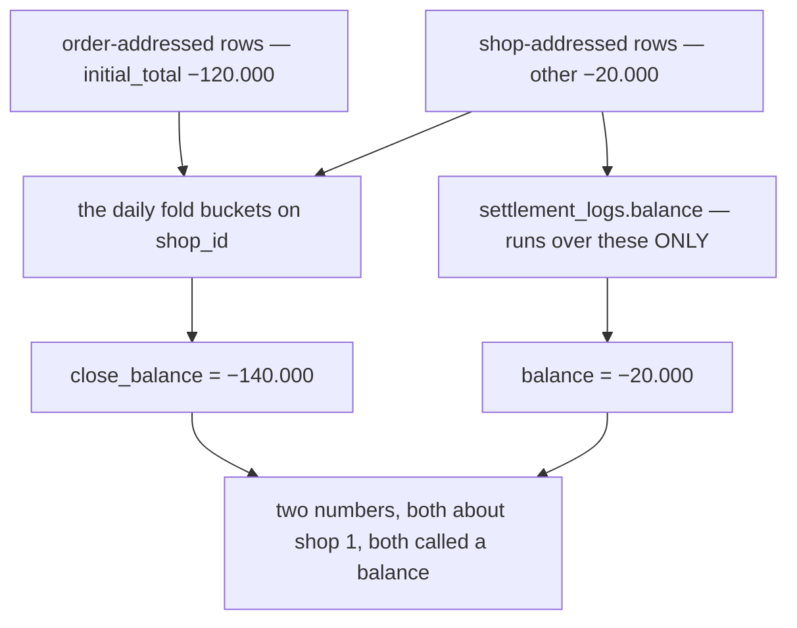
```mermaid
flowchart TB
  O["order-addressed rows — initial_total −120.000"] --> F["the daily fold buckets on shop_id"]
  S["shop-addressed rows — other −20.000"] --> F
  S --> L["settlement_logs.balance — runs over these ONLY"]
  F --> R["close_balance = −140.000"]
  L --> B["balance = −20.000"]
  R --> C["two numbers, both about shop 1, both called a balance"]
  B --> C
```

**→ Recommend naming them apart in the doc** — the log column is the shop's **own direct movements**, the
report column is the shop's **whole position**. ⚠ This is the trap already recorded here as
[one concept, three service names](#one-concept-three-service-names-and-each-is-written-down-as-authoritative),
and [the-position-is-the-shortfall-not-the-wallet](./context_decision.md#the-position-is-the-shortfall-not-the-wallet)
already warned that **the bare word "balance"** is the one term that had named two different shop-level
numbers. It now names two again.

⚠ **Also unchanged**: `fund | On Order Completed` in the first table still contradicts General Brief 5 —
[recorded here](#fund-is-dated-by-an-order-status-the-same-doc-says-settlement-ignores). And the
shop-addressed table does not use `system_adjustment`, though that is the shop-addressed type par
excellence — worth one row, since the table is what a reader copies.


> ## Re-examined against the SHIPPED code (2026-09-10)
>
> **The doc has not moved since 2026-09-07 — the CODE has.** So this pass checked `context.md` against
> the migration, the models and the proto rather than against the decision log, and found **three things
> stale, one of them inside this file**. All three are in [Contradiction](#contradiction), grouped by
> cause (HARD RULE 11).
>
> | what is stale | where | worst consequence |
> | --- | --- | --- |
> | ⛔ **`source_type` is listed as TWO — three shipped** | doc §Log Shapes 3, §Idempotency — **and this file, twice** | the doc has `order_service` posting the cancel and gives it no source value to post under |
> | ⛔ **both shape lists are behind the tables** | doc §Log Shapes 1, §Settlement State | `initial_total` is NEGATIVE on the log and POSITIVE on the state, and the doc that defines both says so nowhere |
> | ⚠ **`fund` is dated *"On Order Completed"*** | doc §Settlement Behaviors row 2 | gated on a status the same doc forbids gating on |
>
> ✅ **Nothing in the ledger's MECHANICS moved.** The grain, the seven types, the caller-generated
> idempotency key, the sign convention and the state-as-projection all match what shipped. This is
> doc-lag behind decisions you already took — not a design fault, and none of it blocks a build.
>
> ⚠ **Two of the five stale sites were MINE and are fixed in this pass** — `### The schema` and
> `### The proposed contract` both drew `source_type "exporter or manual"`, thirteen days after you
> decided otherwise. Recorded rather than quietly corrected, because that is the whole point of
> HARD RULE 11.


> **Re-examined after §Idempotency Key, the `fund` clause and §Settlement State.** ✅ **My longest-standing
> blocker is closed** — the duplicate-write hole. `unique_id` unique with `order_id`, generated by the
> caller, and the recipe is explicitly out of settlement's scope (owner, in chat). Five recorded:
>
> | § | what it settled | recorded as |
> | --- | --- | --- |
> | §Idempotency Key | `unique_id`, caller-generated, unique with `order_id` | [the-unique-id-is-generated-outside-settlement](./context_decision.md#the-unique-id-is-generated-outside-settlement) |
> | owner, in chat | the recipe is the caller's problem, not settlement's | [the-recipe-is-the-callers-problem](./context_decision.md#the-recipe-is-the-callers-problem) |
> | §Settlement State | `order_settlements` — `order_id`, `initial_total`, `last_balance` | [the-state-holds-initial-total-and-last-balance](./context_decision.md#the-state-holds-initial-total-and-last-balance) |
> | Shapes 2, `fund` | *"its not net, platform still charge in other day sometimes"* — no single row is ever "the payout" | [fund-is-not-the-final-figure](./context_decision.md#fund-is-not-the-final-figure) |
> | §Settlement State | the state-plus-log shape | [the-state-table-is-order-settlement](./context_decision.md#the-state-table-is-order-settlement) |
>
> **Keeping `initial_total` in the state is the good call.** It makes the number every screen wants a
> single-row read: `net received = last_balance + initial_total`, which on the worked example is
> `−10.000 + 120.000 = 110.000` ✓ — no scan of the log for one row of one type.
>
> **`fund` being "not net" is the same idea as [a-residual-balance-is-normal](./context_decision.md#a-residual-balance-is-normal),
> one level down.** Not only does the *account* never close — the *payout* is not a single event either.
> A screen labelling `fund` as "what we got paid for this order" is wrong on any order with later
> charges, which `§3` says is most of them.
>
> ✅ **The commission argument is closed and deleted, and I was wrong about the premise.** The 20.000 in
> the worked example is *"any hidden cost, we cant record and leave it"* (owner) — the platform never
> itemises it, so there is nothing to discard. My whole `platform_fee` case assumed a number we were
> being given and choosing to throw away.
> [hidden-cost-is-left-in-the-balance](./context_decision.md#hidden-cost-is-left-in-the-balance) records
> it, **and it makes the balance a better object than I had it**: not a variance, but the only measure
> of what the platform takes without saying so. Summed per shop per month it is an implied take-rate.
>
> ✅ **And `marketplace_total` is a FACT, not an estimate** (owner) — what the buyer actually paid.
> [marketplace-total-is-a-fact-not-an-estimate](./context_decision.md#marketplace-total-is-a-fact-not-an-estimate).
> That sharpens the balance rather than just renaming it: measured against a fact, the gap is not
> "drift from a guess" but exactly **how much of what the buyer paid never reached us** — the
> platform's take, literally, so `hidden ÷ initial_total` is a real take rate. The screens now say
> **Sold for** and **% of sales**.
>
> ✅ **§Access Role is answered, and one answer REVERSED my recommendation** (owner). The write set is
> `[ROOT, ADMIN, TEAM_OWNER, TEAM_ADMIN, CS]` scoped on `team_id`
> ([the-write-set-is-cs-and-up](./context_decision.md#the-write-set-is-cs-and-up)), and `initial_total`
> **is** hand-postable — by everyone in that set except `team_admin`
> ([initial-total-is-postable-by-cs-and-owners](./context_decision.md#initial-total-is-postable-by-cs-and-owners)).
> I had recommended nobody may type it; that assumed the sale figure is always machine-derived, and it
> is not — `marketplace_total = 0` means *not recorded*, so the ban left those accounts permanently
> uncomputable with no way to repair them. ⚠ **What the permission does NOT settle is the duplicate**:
> a second `initial_total` adds rather than replaces, so the ACCOUNT vetoes the type once one exists.

> **Re-examined after §Access Role, the seventh type and §Type `initial_total` / `initial_total_cancel`.**
> Two more recorded, and **one of them reverses me**:
>
> | § | what it settled | recorded as |
> | --- | --- | --- |
> | §Type 1–2 | `order_service` **CALLS** settlement — on create and on cancel | [order-service-calls-settlement](./context_decision.md#order-service-calls-settlement) ⛔ |
> | §Shapes 2, §Type 2 | `initial_total_cancel` — a **seventh** type, the exact opposite of `initial_total` | [a-cancel-is-an-opposite-row](./context_decision.md#a-cancel-is-an-opposite-row) |
> | owner, in chat | the state's `initial_total` holds the **LIVE** sale — the cancel row zeroes it | [cancel-zeroes-the-live-sale](./context_decision.md#cancel-zeroes-the-live-sale) |
>
> ✅ **Q4 is closed and deleted** — I recommended a subscription so that placing an order could not fail
> on settlements availability. The arrow is a **call**, drawn twice, so it is the shape and not a
> shorthand. **What the answer does not settle is the failure**: an order that has genuinely happened on
> the marketplace must not be lost because a ledger is unreachable, so *what a failed call does to the
> order* is now [Question 3](#question) in its place — a smaller question than the one it replaces.
>
> ✅ **The formula break is CLOSED, and the fix keeps the column a projection.** A cancelled order was
> reading as having netted the **full sale** *and* having lost the whole sale to hidden platform cost —
> two wrong numbers from one column, and `/settlement` ranks by exactly those. The state now tracks the
> **live** sale, so all four derived figures stay written verbatim: no branch, no flag, no new column.
> And it is still recomputable from the log — `−Σ(change)` over **both** initial types — so nothing is
> rewritten, only projected from one more row.
>
> ✅ **It simplifies a decision you had already made.** The *is there a live `initial_total`* test that
> [initial-total-is-postable-by-cs-and-owners](./context_decision.md#initial-total-is-postable-by-cs-and-owners)
> needs is now `initial_total != 0` — one column, not a sum over log rows — and *reverse, then repost*
> works with no special case.
>
> ⚠ **One consequence is NOT settlement's, and is named so it is not found on a screen**: `true margin`
> becomes `0 − cogs` on a cancelled order unless `order_service` releases `order.cogs` on cancel.
>
> ⚠ **And it lands outside the write-set decision.** [the-write-set-is-cs-and-up](./context_decision.md#the-write-set-is-cs-and-up)
> and [initial-total-is-postable-by-cs-and-owners](./context_decision.md#initial-total-is-postable-by-cs-and-owners)
> were settled when there were six types. Whether a human may hand-post the **seventh** — a cancel, on a
> live order, from the ledger tab — was not in front of you. [Question 2](#question).

> **Re-examined against `# Settlement Reports.` — new this round, and the first workload this ledger has
> ever been given.** Four report shapes, and **not one of them is answerable from what is built**:
>
> | what the section settles | what it opens |
> | --- | --- |
> | reports are **settlement's own**, at three grains — team, shop, customer service — over a daterange, at daily / monthly / yearly resolution | ✅ **the measure is now settled** — [the-measure-is-sales-received-and-gap](./context_decision.md#the-measure-is-sales-received-and-gap) · ✅ **and the date is `posted_on`** — [posted-on-buckets-the-report](./context_decision.md#posted-on-buckets-the-report), so a past window is final · ⛔ **"customer service" is a column that exists in no table**, here or in `selling_service` ([Q6](#question)) |
>
> ⚠ **And it collides with a live architecture argument.** [analytic/context.md](../analytic/context.md)
> proposes a broker-fed report table for exactly this shape, so *who computes a settlement report* —
> settlement's own `GROUP BY`, or an event-fed fold — is now a concrete instance of
> [biggest_question #7](../../biggest_question.md) rather than a hypothetical one.
> **→ Recommend settlement's own aggregate first.** The precedent is in this repo: `revenue_service`
> was the pipeline version and was deleted for losing to a plain `GROUP BY`.

> **Re-examined against `## General.` and `## Whats Number to be reported.` — added 2026-09-01.**
> One line reversed the biggest recommendation in this file, and one list turned out to agree with a
> decision taken hours earlier.
>
> | § | what it settles | recorded as |
> | --- | --- | --- |
> | `## General.` 1 | the report is built the **analytic** way — log → broker → stream → report table | [the-report-follows-the-analytic-principle](./context_decision.md#the-report-follows-the-analytic-principle) ⛔ |
> | `## Whats Number to be reported.` | the seven types — an **additive basis**, not a replacement measure | ✅ consistent with [the-measure-is-sales-received-and-gap](./context_decision.md#the-measure-is-sales-received-and-gap): `sales`, `net_received` and `gap` are all derivable from those seven |
>
> ✅ **And it makes `posted_on` look better than my own argument did.** A stream processor learns of a
> row when its event arrives — which is what [posted-on-buckets-the-report](./context_decision.md#posted-on-buckets-the-report)
> already means. The two answers fit each other.
>
> ⛔ **The SEQUENCING was answered and then REVERSED, both in one day.** *Query first* is cancelled —
> [the-report-is-the-pipeline-from-day-one](./context_decision.md#the-report-is-the-pipeline-from-day-one)
> strikes [the-report-ships-as-a-query-first](./context_decision.md#the-report-ships-as-a-query-first), so there is
> **no `GROUP BY` phase**: the report exists when the publisher, the broker, the fold and the table do,
> and today settlement has none of them. ⚠ **Two things are owed BECAUSE that phase is gone** — keep the
> aggregate as a **test oracle** even though it is never an RPC, and make the fold **re-runnable from the
> log by cursor**. Without either, a fold that is quietly wrong has nothing to be wrong against and no
> way to produce correct history.
>
> **Re-examined again after `## Shape of Reports.` 4 — *Group by Customer Service* became *Group by
> User*.** ✅ That closes the question I ranked second-biggest twice: the dimension is `actor_id`, which
> settlement already has on every row, so **no column in `selling_service` and no cross-service read**
> — [the-fourth-shape-groups-by-user](./context_decision.md#the-fourth-shape-groups-by-user). It also takes
> shape 4 out of the scope problem, leaving only shape 2 there.
>
> ⚠ **Two leftovers from the rename, both small and both real.** `## Shape of Reports.` 1 still lists a
> *"customer service filter"* while its group-by sibling is now *user* — if that means the same thing it
> should read **user filter**, and if it does not, it is the one place a CS concept survives. And
> `actor_id` is **not one person per order**, which is [Question 5](#question).

> **Re-examined against `# Settlement Ledger.` — added 2026-09-01, and it is the first section to
> describe HOW a write happens rather than what it means.** None of it is built: there is no
> `InitOpeningBalance`, no `settlement_states`, and no daily shop report anywhere in the repo.
>
> | what it settles | what it opens |
> | --- | --- |
> | ✅ **settlement DOES publish** — `Dispatch Event` gives [settlement-publishes-to-the-book](./context_decision.md#settlement-publishes-to-the-book) a drawn path at last · ✅ the write is transactional, and the state is **locked** before it is read-modified-written, which is the right shape for two people on one shop | ⛔ **a cross-service RPC INSIDE the transaction, holding that lock** · ⛔ **a report failure ROLLS BACK the ledger write** · ⛔ **a third architecture for one report table** · ⚠ an **opening balance**, which the decided measure has no place for |
>
> ⚠ **And the state table now has two names.** This section calls it `settlement_states`; the shipped
> table, the model and [the-state-holds-initial-total-and-last-balance](./context_decision.md#the-state-holds-initial-total-and-last-balance)
> all say `order_settlements`. See the Contradiction.
>
> ⚠ **`# Settlement Ledger.` says *"we have 3 things"* and lists 2.** The third is unstated — the cache,
> the event, or the report table are all candidates, and they are not the same kind of thing.
>
> Read in full: [the ledger write protocol](#the-ledger-write-protocol--read-against-the-two-decisions-taken-today).

> **Re-examined against `## Smallest Grain Reports.` — added 2026-09-01.** It names the table the whole
> report rests on, `shop_settlement_daily_report`, and answers the opening-balance question by being
> **both**: per-type movements *and* a carried open/close balance
> ([the-smallest-grain-is-the-shop-day-statement](./context_decision.md#the-smallest-grain-is-the-shop-day-statement)).
> ✅ That shape only works because `posted_on` already guarantees a closed day never moves — the two
> decisions fit.
>
> ⛔ **Two defects in the column list, and both are the silent kind.**
>
> | | |
> | --- | --- |
> | **`affiliate_fee` is missing** | six of the seven types are tracked, so an affiliate cut moves `close_balance` while appearing in no column — `close − open ≠ Σ movements`, and the difference has no name. That is the one failure this shape exists to make impossible |
> | **no user dimension** | the grain is `(day, shop, team)`, which serves shapes 1, 2 and 3 exactly and **cannot serve shape 4 at all** — nor shape 1’s own *customer service filter* |
>
> ⚠ **The user report cannot be a statement, and that is not a detail.** A running position belongs to an
> ACCOUNT, and an account’s later movements are posted by different people — so a per-user open/close is
> not a smaller grain, it is a meaningless one. The second table has to be **sums only**.
> → [Question 9](#question) · [Question 10](#question)

> **Re-examined again — `## The Reason `InitOpeningBalance` is existed.` and a SECOND grain table,
> both added 2026-09-01.**
>
> | § | what it settles | what it leaves |
> | --- | --- | --- |
> | `user_settlement_daily_reports` | ✅ shape 4 has a grain, and it is a **second table** rather than a wider key — the shape I recommended ([the-user-grain-is-a-second-table](./context_decision.md#the-user-grain-is-a-second-table)) | ⛔ it copies `open_balance` / `close_balance`, which is the half I argued cannot mean anything per user — [Question 9](#question) |
> | `## The Reason …` | ✅ the RPC exists to stop a **lost update** on the window aggregation — a real race, and worth stating | ⛔ it justifies a GUARD, not this guard: a network call inside the ledger’s transaction, holding a lock, that rolls the ledger back — [Question 8](#question) |
>
> ✅ **`## How We Create `shop_settlement_daily_reports`` is an empty heading**, which under RULE 8b.11
> means *not designed yet* rather than *open question*. It is the slot [Question 7](#question) is asking
> about — fold or writer — and the proposal for it is
> [the protocol I would draw instead](#the-ledger-write-protocol--read-against-the-two-decisions-taken-today).
>
> ⚠ **Two typos worth a glance, reported not fixed** (RULE 7b): the reason section says *"`open_balance`
> and `open_balance`"* where the second is presumably `close_balance`; and the table renamed itself from
> `shop_settlement_daily_report` to `…_reports` between two sections, so the plural is the current one.

> **Re-examined after the open/close definition** (owner, in chat) — *"sum of balance log of start and
> end of the day"*. ✅ **They are SNAPSHOTS, not accumulators**
> ([open-and-close-are-log-sums-at-the-day-boundaries](./context_decision.md#open-and-close-are-log-sums-at-the-day-boundaries)),
> and that is simpler than what I had been arguing against:
>
> | | |
> | --- | --- |
> | **no carry** | a day never reads the previous day’s row, so an inactive shop costs nothing and my *"which previous row?"* note is void |
> | **rebuildable** | any day recomputes from `settlement_logs` alone — which is what the cancelled query phase was going to provide and no longer does |
> | **an identity** | `close − open = Σ movements` now FOLLOWS from the definition, so the missing `affiliate_fee` is provable rather than suspected |
>
> ✅ **And it is only well-formed because the date is `posted_on`.** `balance` is stamped in WRITE order,
> so *"the position at the end of day D"* means *"the last row written by D"* — `occurred_on` could not
> express it, because a backdated row carries a balance from its write moment. Third time those two
> answers have turned out to depend on each other.
>
> ⛔ **What it sharpens rather than closes**: a shop snapshot partitions the book exactly once; a user
> snapshot only does if the set is *the orders that user opened* — which would **force**
> [Question 5](#question). [Question 9](#question).

> **Re-examined again — `affiliate_fee` is now in both grain tables.** ✅ The identity
> `close − open = Σ movements` can hold, and the one defect that would have made a statement silently
> fail to reconcile is gone. Both tables now track all seven types.
>
> ⚠ **Two column leftovers moved to Awaiting rather than staying questions**: `balance` is still
> undefined beside the two that now have a definition, and neither table counts `orders`.
>
> ⚠ **And two questions became one.** Shape 4’s grouping and the user snapshot’s set cannot be answered
> separately — [Question 5](#question) now carries both, with the table that makes the trade-off visible.

> **Re-examined after *"the user is who created the order"*** — ✅ the attribution is settled, and
> settled the branch that makes the table consistent
> ([the-user-is-the-order-creator](./context_decision.md#the-user-is-the-order-creator)). Shape 4 is a
> **sales report**, the snapshot partitions, and imported fees no longer pile onto the importer.
>
> ⛔ **What the answer creates is a field settlement does not have.** `actor_id` is *who wrote the row*
> and stays that — so the creator needs a home, and an account whose `initial_total` never arrives has no
> creator at all. [Question 5](#question) carries both halves.
>
> ⚠ **It also raises the price of the order seam.** With no `order_service → settlement` call built,
> nothing stamps a creator on anything — so the user report is not merely empty, it has no dimension.
> [Question 1](#question) is now blocking two tables rather than one.

> **Re-examined after `## How `*_settlement_daily_reports` Created` — the empty heading is filled, and
> `## General.` is GONE.**
>
> | | |
> | --- | --- |
> | ✅ **the creation logic is specified** | find the last row, carry its `close_balance` into today’s `open_balance`, or start at 0 — and it applies to **both** grain tables |
> | ⛔ **it contradicts the definition given in chat** | *"sum of balance log at start and end of the day"* is a **snapshot**; *"get last `close_balance`"* is a **carry**. Not the same number, and the carry is not rebuildable — see the [Contradiction](#contradiction) |
> | ⛔ **`## General.` 1 has been deleted** | the *"Design Analytic Principle is follow this"* line is no longer in the doc, and it is the entire basis of [the-report-follows-the-analytic-principle](./context_decision.md#the-report-follows-the-analytic-principle). A deletion is not a statement, so I have not treated it as a reversal — [Question 7](#question) |
>
> ⚠ **The two point the same way, which is why they are worth reading together.** A row created on
> demand from the previous row is the WRITER’s path; a row folded from the log is the pipeline’s. Removing
> the analytic line and adding a carry-forward creation step are both moves away from the fold.

> **Re-examined after *"because its not mature"*** — the `## General.` deletion was deliberate, and
> settlement is not binding its report to an unfinished design
> ([the-analytic-pointer-is-withdrawn-until-it-is-mature](./context_decision.md#the-analytic-pointer-is-withdrawn-until-it-is-mature)).
>
> ⚠ **Two of the three architectures are now struck, and the survivor is the one the doc details.** The
> `GROUP BY` phase was cancelled and the pipeline is withdrawn — what is left standing is the write path,
> which `# Settlement Ledger.` and `## How … Created` specify step by step. That is an **inference**, and
> [Question 7](#question) asks for the one line that confirms it. If it holds, settlement needs no
> publisher, no broker and no consumer to have a working report.
>
> ⚠ **It costs a sibling context its example.** [reports-belong-to-the-consumer](../analytic/context_decision.md#reports-belong-to-the-consumer)
> cites settlement pointing at analytic *"for the principle"* — the line withdrawn here. That decision may
> still be right, but its evidence is gone.
>
> ⚠ **And `open_balance` is elaborated in full** — [snapshot, carry, and what I would actually build](#open_balance--snapshot-carry-and-what-i-would-actually-build).
> The short version: the snapshot is the definition, the carry is the implementation, genesis must never
> be `0` for a shop that already trades, and a reconcile is the only thing that can notice the chain
> breaking.

Siblings: [order_context](../order/context_clarify.md) · [ledger_context](../ledger/context_clarify.md) ·
[architecture_context](../../technical/architecture/context_clarify.md).
Decisions: [context_decision.md](./context_decision.md).

---

## Proposed Design

### What settlement is now

Brief 3 shrank it to something much easier to build and much easier to describe.

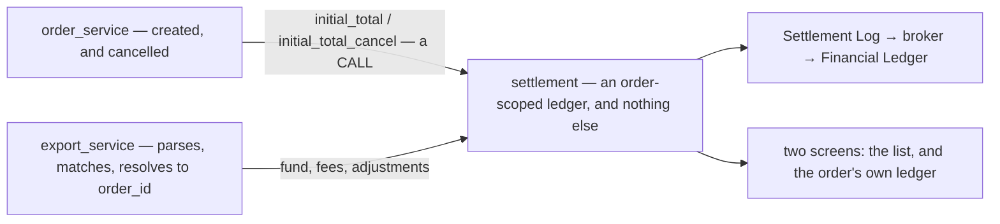
```mermaid
flowchart LR
  OC["order_service — created, and cancelled"] -->|"initial_total / initial_total_cancel — a CALL"| S
  EX["export_service — parses, matches, resolves to order_id"] -->|"fund, fees, adjustments"| S
  S["settlement — an order-scoped ledger, and nothing else"]
  S --> L["Settlement Log → broker → Financial Ledger"]
  S --> UI["two screens: the list, and the order's own ledger"]
```

| settlement owns | `export_service` owns |
| --- | --- |
| the log, the running balance, the **seven** types | the file and its evidence |
| `initial_total` from order creation | the per-marketplace parser |
| the write API, and its idempotency | matching a platform ref to an `order_id` |
| the two read screens | the unmatched tray |

### The rules, named

> **Twenty-four are decided** and live in [context_decision.md](./context_decision.md) — one of them ⛔
> reversed. Everything below is still a proposal.

#### an-account-never-closes
*"its also still happen other fee in next day"* (`§3`), and
[a-residual-balance-is-normal](./context_decision.md#a-residual-balance-is-normal) makes it explicit: a
row can arrive at any time, and the account has **no terminal state**.

⚠ **Two things follow that are easy to get wrong.** There is no "settled" flag driven by `balance = 0` —
nothing would ever be settled. And there is no worklist of non-zero balances — it would contain almost
every order.

#### a-cancel-undoes-the-sale-not-the-account
[a-cancel-is-an-opposite-row](./context_decision.md#a-cancel-is-an-opposite-row) — a cancelled order keeps
its account and gets a seventh-type row that is the exact opposite of `initial_total`.

| | |
| --- | --- |
| the LOG | is undone — the two rows cancel to zero, and both stay visible |
| the ACCOUNT | is **not** closed — a late ads fee on a cancelled order still has somewhere to land |
| the STATE | ✅ **decided — zeroed.** [cancel-zeroes-the-live-sale](./context_decision.md#cancel-zeroes-the-live-sale): the column holds the LIVE sale, so a cancel drives it to 0 |

✅ **SETTLED that way** — [cancel-zeroes-the-live-sale](./context_decision.md#cancel-zeroes-the-live-sale).
The state table is not append-only — `last_balance` mutates on every write — so mutating `initial_total`
beside it is the same kind of write, not a rewriting of history. The log keeps both rows; the state keeps
the current position; `net received = last_balance + initial_total` stays correct in all three cases with
no flag, no second column and no change to any screen.

✅ **It also completes the repair path.** [initial-total-is-postable-by-cs-and-owners](./context_decision.md#initial-total-is-postable-by-cs-and-owners)
says a wrong sale figure is fixed by *reverse, then repost*, and until now nothing was the reverse.
`initial_total_cancel` is — which means the *"is there a LIVE initial_total"* test the handler must run is
**not** `EXISTS(type = initial_total)`. It is `Σ(change) over both initial types ≠ 0`.

#### two-dates-occurred-and-posted
§Settlement Behaviors has one `At` column, and `§3` says fees arrive the next day — so that column is
doing two jobs.

| | |
| --- | --- |
| `occurred_on` | the day the platform says the charge belongs to |
| `posted_on` | the day we learned it |

Reports read `occurred_on`, reconciliation reads `posted_on`, and a late fee is visible as exactly that
— the gap between them. Without the split, a fee arriving on the 2nd for the 31st either corrupts a
closed month or silently lands in the wrong one. There is precedent: `ExpenseRecord.occurred_at` is
already *"the day the money BELONGS to"*, deliberately separate from `created_at`.

#### a-repeat-is-reported-not-just-absorbed
✅ **The key is settled and the recipe is out of scope** —
[the-unique-id-is-generated-outside-settlement](./context_decision.md#the-unique-id-is-generated-outside-settlement)
and [the-recipe-is-the-callers-problem](./context_decision.md#the-recipe-is-the-callers-problem).

**What is still inside the boundary is the RESPONSE.** If a duplicate key returns the existing row with
no signal, a caller cannot tell *"already recorded"* from *"recorded just now"* — so a caller whose
scheme is wrong gets no feedback from anywhere, and
[a-residual-balance-is-normal](./context_decision.md#a-residual-balance-is-normal) means no screen will
show it either.

**→ Recommend a `created` / `already_existed` flag on the write response.** One field. It keeps the
recipe entirely the caller's problem while giving the caller the one signal that lets it find its own
bug — which is the whole point of putting the responsibility there.

#### the-sale-is-recorded-once-and-copied-verbatim
⚠ **Renamed twice, and the second rename is the important one.**
[marketplace-total-is-a-fact-not-an-estimate](./context_decision.md#marketplace-total-is-a-fact-not-an-estimate)
means these are not "copies of an estimate" — they are copies of a **recorded fact**, which is a
stricter thing. An estimate may reasonably differ between two places; a fact may not.

| | holds | who owns it |
| --- | --- | --- |
| `order.marketplace_total` | **what the buyer paid** — the fact | selling_service |
| ~~`order_revenues.revenue`~~ | ⛔ retired by [settlement-owns-revenue](./context_decision.md#settlement-owns-revenue) | — |
| `initial_total` | a frozen copy of that fact | settlement_service |

**→ Recommend:** `order.marketplace_total` is **authoritative** and `initial_total` is a **verbatim
frozen copy** taken at creation, never re-read. Under
[a-correction-is-a-new-row](./context_decision.md#a-correction-is-a-new-row) settlement could not move
its copy even if it wanted to — so if the order's figure is later corrected, the two diverge on purpose
and the ledger keeps the number the whole account was measured against.

⚠ **`order.total` is NOT a third copy.** It is `subtotal + shipping` — *our price*, before the
platform's vouchers. Both are facts, about different things, which is why
[Critique 4](#critique)'s fallback is a judgement call rather than an equivalence.

#### withheld-is-not-spent
`§2` lists *"shipping cost, ads fee, platform fee"* — two already have a home
(`order.shipping_cost`, `EXPENSE_KIND_ADS`). The dividing line is the **mechanism**, not the category:

| | it is | goes to |
| --- | --- | --- |
| money that **left our bank** — an ads top-up we paid | an **expense** | `expense_service` |
| money the platform **withheld** before paying out | a **settlement row** | `settlement_service` |

⚠ `external_ads_fee` is the second kind. So `EXPENSE_KIND_ADS` must only ever hold ads we *paid for*,
never ads the platform *withheld* — otherwise the same ad money is in both books.

### The schema

Your field list, plus the three columns it needs to be operable. Added marked **+**.

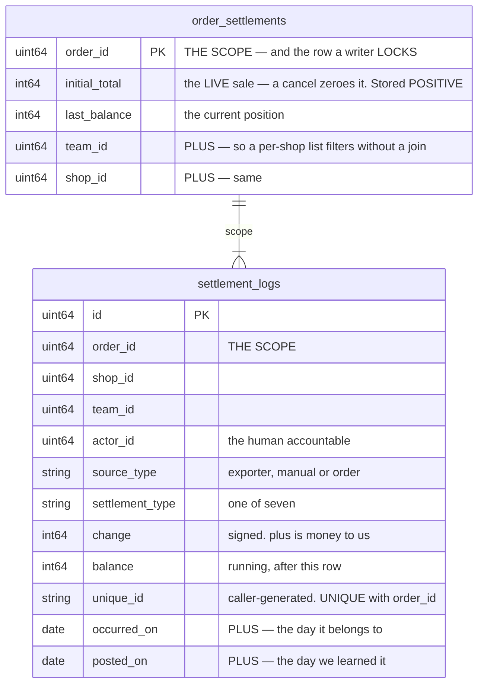
```mermaid
erDiagram
  log[settlement_logs] {
    uint64 id PK
    uint64 order_id "THE SCOPE"
    uint64 shop_id
    uint64 team_id
    uint64 actor_id "the human accountable"
    string source_type "exporter, manual or order"
    string settlement_type "one of seven"
    int64 change "signed. plus is money to us"
    int64 balance "running, after this row"
    string unique_id "caller-generated. UNIQUE with order_id"
    date occurred_on "PLUS — the day it belongs to"
    date posted_on "PLUS — the day we learned it"
  }

  st[order_settlements] {
    uint64 order_id PK "THE SCOPE — and the row a writer LOCKS"
    int64 initial_total "the LIVE sale — a cancel zeroes it. Stored POSITIVE"
    int64 last_balance "the current position"
    uint64 team_id "PLUS — so a per-shop list filters without a join"
    uint64 shop_id "PLUS — same"
  }

  st ||--|{ log : scope
```

**`net received = last_balance + initial_total`** — a single-row read, which is why keeping the sale
beside the balance is the right call. On the worked example, `−10.000 + 120.000 = 110.000` ✓.

**`shop_id` and `team_id` are denormalised on purpose.** Both derive from `order_id`, and both are here
anyway: every screen filters by shop or team, and a ledger that had to join `orders` to answer *"what
did this shop net in January"* would join on every read. Frozen copies, like `order.cogs` — an order
does not move between shops.

### The prototype — built, and previewable now

`implementation_analysis` is done. **Two screens in Storybook, 15 interaction tests, no backend and no
proto** — so a reject at `design_accept` costs only this.

```sh
cd frontend && npm run storybook     # Pages → Order Settlement
```

| story set | what it holds |
| --- | --- |
| **Ledger Panel** — 7 stories | §Settlement Behaviors rendered row-for-row, plus the cases the design makes a claim about |
| **List** — 7 stories | orders ranked by loss, the implied take-rate card, the shop filter |

Every story pins a rule that is otherwise invisible until somebody "tidies" it:

| the rule | the story that fails if it breaks |
| --- | --- |
| the balance is **LOST**, never "outstanding" | `WorkedExample` asserts the page contains no debt vocabulary at all |
| a positive balance is a **GAIN**, not a smaller loss | `CameOutAhead` — a red-only design is wrong in the one direction nobody checks |
| a late fee shows the **gap** between its two dates | `LateFee` — and only the late row is marked |
| append-only: no edit, no delete | `ManualAndReversal` — the typo, its reversal and the fix all stay on screen |
| `marketplace_total = 0` refuses to compute | `NoEstimate` — measured against zero the order reads as pure profit |
| manual rows are attributed on screen | `ManualEntriesVisible` — visibility is the only review this design supports |

⚠ **Two open questions are ON SCREEN rather than in prose.** `NoEstimate` is
[Question 5](#question) rendered; the `canPost` prop now implements a settled role policy, but it knows
**six** types — the seventh is [Question 2](#question). Reject either and the fix is a prop, not a migration.

⚠ **The contract was NOT written as a `.proto`.** `warehouse.settlement.v1` is still the team-debt
service until [the-name-settlement-moves-to-the-payout](./context_decision.md#the-name-settlement-moves-to-the-payout)
lands, and that rename is 37 Go files in the service, and 110 files across the repo mention the word — exactly the expensive work this gate exists to protect. The
proposed contract is [below](#the-proposed-contract), derived from what the screens actually need, and
`frontend/src/pages/order-settlement/model.ts` is the same shape in TypeScript.

### The proposed contract

Derived from the two screens (HARD RULE 6), not the reverse.

| RPC | serves | note |
| --- | --- | --- |
| `SettlementPost` | both write paths | takes `unique_id`; returns the row **and a `created` flag** ([Question 4](#question)) |
| `OrderSettlementList` | the list screen | paginated (HARD RULE 9), filter by shop, sort by loss |
| `OrderSettlementDetail` | the panel | one `order_settlements` row plus its log, newest last |

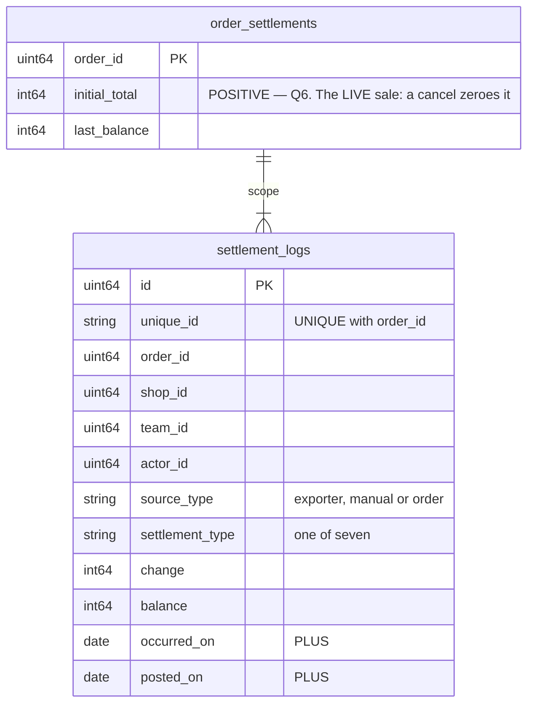
```mermaid
erDiagram
  st[order_settlements] {
    uint64 order_id PK
    int64 initial_total "POSITIVE — Q6. The LIVE sale: a cancel zeroes it"
    int64 last_balance
  }
  log[settlement_logs] {
    uint64 id PK
    string unique_id "UNIQUE with order_id"
    uint64 order_id
    uint64 shop_id
    uint64 team_id
    uint64 actor_id
    string source_type "exporter, manual or order"
    string settlement_type "one of seven"
    int64 change
    int64 balance
    date occurred_on "PLUS"
    date posted_on "PLUS"
  }
  st ||--|{ log : scope
```

**Three derived figures the screens need and the schema does not store** — all computable, so none of
them becomes a column:

```
net received = last_balance + initial_total
lost         = −last_balance
hidden cost  = initial_total − Σ(fund)      ← the implied take-rate, summed
true margin  = net received − order.cogs
```

✅ **All four read `initial_total`, and all four are correct on a cancelled order** because the column
tracks the LIVE sale — [cancel-zeroes-the-live-sale](./context_decision.md#cancel-zeroes-the-live-sale).
⚠ Except `true margin`, which becomes `0 − cogs` unless the order releases its COGS on cancel — an
`order_service` concern, not settlement's.

⚠ Every request message carries the `request_policy` from
[the-write-set-is-cs-and-up](./context_decision.md#the-write-set-is-cs-and-up), `use_scope` on `team_id`.

### The screens — frontend-first (HARD RULE 6)

Down from six to two, because [importing-is-not-settlements-job](./context_decision.md#importing-is-not-settlements-job)
took the other four.

| screen | who opens it | the one question it answers |
| --- | --- | --- |
| `/settlement` | selling manager | per shop: which orders drifted furthest from face value |
| order detail, **a third tab** | a manager on the order | **the running ledger itself** — your §Settlement Behaviors table, rendered, with **Add entry** and a per-row **Reverse**. ✅ settled by [order-detail-manages-the-ledger](./context_decision.md#order-detail-manages-the-ledger) |

⚠ `/settlement` and `/settlement/:counterpartyId` are currently the superseded liability pages
(`router.tsx:275-276`), deleted by
[the-name-settlement-moves-to-the-payout](./context_decision.md#the-name-settlement-moves-to-the-payout).

### Who may post what — SETTLED

[the-write-set-is-cs-and-up](./context_decision.md#the-write-set-is-cs-and-up) and
[initial-total-is-postable-by-cs-and-owners](./context_decision.md#initial-total-is-postable-by-cs-and-owners)
close what was this file's longest-standing blocker. Kept here as the shape the screens implement:

| role | the five ordinary types | `initial_total` |
| --- | --- | --- |
| root · admin · team_owner | ✅ | ✅ |
| customer_service | ✅ | ✅ |
| team_admin | ✅ | ⛔ |
| everyone else | ⛔ — no form at all | ⛔ |

⚠ **The role is only half the gate.** A second `initial_total` ADDS to the account rather than
replacing it, so the type is withheld — from every role — once a live one exists. The repair path is
**reverse, then repost**. See the decision for the diagram.


### The order seam — what is actually missing, checked in code

[order-service-calls-settlement](./context_decision.md#order-service-calls-settlement) decided the shape
a while ago and nothing has been built. Re-checked against the code, **the gap is three things, and two
of them already have a pattern in this repo.**

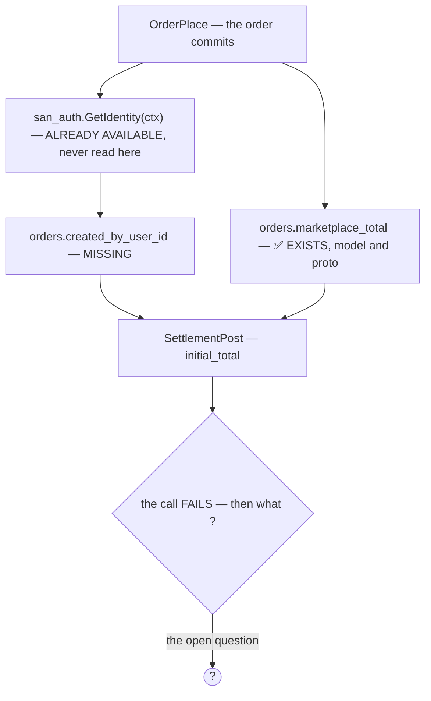
```mermaid
flowchart TB
  P["OrderPlace — the order commits"] --> ID["san_auth.GetIdentity(ctx) — ALREADY AVAILABLE, never read here"]
  ID --> COL["orders.created_by_user_id — MISSING"]
  P --> MT["orders.marketplace_total — ✅ EXISTS, model and proto"]
  COL --> CALL["SettlementPost — initial_total"]
  MT --> CALL
  CALL --> Q{"the call FAILS — then what ?"}
  Q -->|"the open question"| E(("?"))
```

| | state today | |
| --- | --- | --- |
| **the amount** | ✅ **`orders.MarketplaceTotal` exists** — on the model ([order.go:71](backend/services/selling_service/selling_service_models/order.go#L71)) and in the contract ([order.proto:228](proto/warehouse/selling/v1/order.proto#L228)). Nothing to build | |
| **the creator** | ⛔ **`OrderPlace` never reads who is calling** — no actor, no identity, nothing. But `san_auth.GetIdentity(ctx)` is right there and **three services already use it** ([document_service](backend/services/document_service/document_v1/request_upload.go#L45), [expense_service](backend/services/expense_service/expense_v1/service.go#L75)) | it is one read and one column, following a pattern already established |
| **the idempotency key** | ✅ **already solved by accident.** `SettlementPostRequest.unique_id` is caller-supplied ([the-recipe-is-the-callers-problem](./context_decision.md#the-recipe-is-the-callers-problem)), and `order_place.go` already derives a stable one for its event — `"order-placed:" + order_id`, explicitly *"DERIVED from the order, never a fresh UUID: a redelivery and a replay are the same logical fact and must collide"* | **use the same recipe** — a retry then cannot double-open an account |
| **the call** | ⛔ does not exist. Nothing in `selling_service` imports `settlement_v1` | |
| **the failure rule** | ⛔ **unwritten — this is the question** | |

#### The failure rule, and why the neighbour's answer is not automatically the right one

`order_place.go` already takes a position **for its event**, in a long comment: *"A publish failure does
NOT fail the order … it is logged loudly instead, because the alternative — swallowing it — is how a
month-end report quietly goes wrong."* ⚠ **That is an argument about an EVENT, and the decision made
this a CALL.** The two differ in what the failure leaves behind:

| | a lost publish | a failed call |
| --- | --- | --- |
| what is missing | a consumer never heard | the account was never opened |
| who can repair it | a backfill from the order, which still holds every figure | ✅ the same — `marketplace_total` is frozen on the order |
| how anyone finds out | a log line | a log line |

**→ Recommend the same answer for the same reason, but state it rather than inherit it**: the order
commits. `initial_total` records a fact that already happened on the marketplace — refusing the order
loses it, and **a missing account is repairable where a lost order is not**.

⚠ **What a log line is not, is a queue.** Both paths currently end at *"logged loudly"*, and nothing
lists the orders whose account never opened. **→ Recommend a nullable
`orders.settlement_opened_at`** — set when the call succeeds, `NULL` meaning *not yet*. Then the repair
is a query rather than a grep, a retry job has something to iterate, and a screen can show it. One
column, and it is the difference between a repairable failure and a theoretically repairable one.

### A missing account — SETTLED, and the section is pruned

✅ **A person fixes it on the order detail page**
([a-missing-account-is-fixed-by-hand](./context_decision.md#a-missing-account-is-fixed-by-hand)). The
flag, the `san` repair command and the cross-service reconcile I worked through were all **declined**,
and the argument for them is deleted rather than left standing (RULE 8b.9).

**Nothing new is built** — [order-detail-manages-the-ledger](./context_decision.md#order-detail-manages-the-ledger)
already put the ledger on the order page and
[initial-total-is-postable-by-cs-and-owners](./context_decision.md#initial-total-is-postable-by-cs-and-owners)
already permits the entry. Discovery is human: the gap surfaces when somebody reconciles against the
marketplace payout report.

⚠ **The one consequence worth keeping**: manual posting is now the repair path, so **the handler must
refuse a second LIVE `initial_total`** — the form hiding the option is a convenience, not a control. It
was already owed and it stops being optional.

### The ledger write protocol — read against the two decisions taken today

`# Settlement Ledger.` draws a write path in which **a cross-service RPC runs inside the ledger's
transaction, while holding the state's lock, and a failure ROLLS THE LEDGER WRITE BACK.** Nothing of it
is built — no `InitOpeningBalance`, no `settlement_states`, no daily shop report anywhere in the repo.

| | Problem | → Recommend |
| --- | --- | --- |
| **A** | ⚠ **PARTLY ANSWERED — the `GROUP BY` phase is cancelled** ([the-report-is-the-pipeline-from-day-one](./context_decision.md#the-report-is-the-pipeline-from-day-one)), leaving **two** architectures for one table: the fold adding the numbers, and the WRITER maintaining them synchronously, which this protocol also draws. They are still not stages of one plan — the second puts the report on the ledger’s critical path, which is what the first exists to avoid. | **The fold owns the NUMBERS; the writer owns nothing but its own log row.** A derived thing is built by reading the source, never by the source stopping to build it — and the event this protocol already dispatches is the whole mechanism. |
| **B** | ⛔ **A network call inside a transaction, holding a row lock.** The ledger's transaction is now as long as another service's worst latency, with the state row locked for all of it. Two people working one shop is the normal case here, so this is the exact shape `san_race` exists to catch — and settlement's write availability becomes *settlement AND the stat service*. | **Move the bootstrap OUT of the transaction, or delete it.** If a daily row must exist, create it before opening the transaction, or let the fold create its own on first arrival. Nothing about appending a ledger row requires a report row to exist. |
| **C** | ⛔ **A report failure refuses to record money that really arrived.** `init_check → no → rollback` means the platform's payment cannot be written down because a *report* row could not be made. That inverts source and derived — and it is the opposite of the answer already given one seam upstream, where a publish failure must not fail the order. | **Never roll back the ledger for a downstream failure.** Log it, write the row, let the report catch up. The ledger is evidence; the report is a view of it. |
| **D** | ⚠ **The daily report has an OPENING BALANCE, which the decided measure does not have.** An opening balance means *opening → movements → closing*, carried day to day — a **statement**. [the-measure-is-sales-received-and-gap](./context_decision.md#the-measure-is-sales-received-and-gap) is seven **additive sums per window**, which need no opening figure and never carry one forward. | **Say which the daily shop report is.** They are different tables. A statement is the right shape for *"what is this shop's running position"*; the sums are right for *"what happened in January"* — and only the second answers the four shapes in `## Shape of Reports.` |
| **E** | ⚠ **A cache decides whether a row exists, across a service boundary.** `Is Cache Exist? → yes → end` skips the check entirely, and per `CLAUDE.md` the memory implementation is **per-process**, so two instances hold different answers with no invalidation path. | **Make creation idempotent and drop the cache from the correctness path** — `INSERT … ON CONFLICT DO NOTHING`. Then a stale cache costs a wasted insert instead of a missing row. |
| **F** | ✅ **It answers something I raised as a blocker: `Dispatch Event` means settlement DOES publish** — [settlement-publishes-to-the-book](./context_decision.md#settlement-publishes-to-the-book) finally has a drawn path. ⚠ It is drawn **after** `txend`, so it inherits the repo's known hole: a crash between commit and dispatch loses the fact forever. | **Not re-argued here** — it is [mutation_and_ledger C5](../../technical/ledger/mutation_and_ledger_clarify.md#critique) (an outbox), and analytic's [log-is-the-source-broker-is-the-trigger](../analytic/context_clarify.md#log-is-the-source-broker-is-the-trigger) closes it without one: the event only wakes a worker that folds from the log by cursor. |

**The protocol I would draw instead** — same steps, two of them moved:

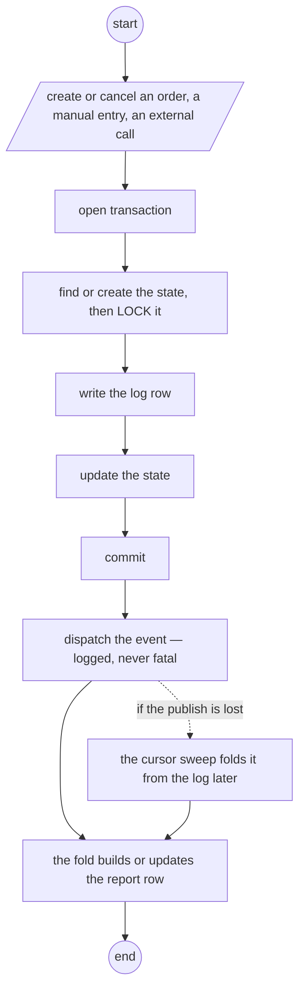
```mermaid
flowchart TD
  s(("start")) --> ops[/"create or cancel an order, a manual entry, an external call"/]
  ops --> txstart["open transaction"]
  txstart --> state["find or create the state, then LOCK it"]
  state --> log["write the log row"]
  log --> upd["update the state"]
  upd --> txend["commit"]
  txend --> ev["dispatch the event — logged, never fatal"]
  ev --> fold["the fold builds or updates the report row"]
  fold --> e(("end"))
  ev -.->|"if the publish is lost"| cur["the cursor sweep folds it from the log later"]
  cur --> fold
```

### The reports and the fold — MOVED

> `## Smallest Grain Reports.`, `## How *_settlement_daily_reports Created` and `## Shape of Reports.`
> left this doc on 2026-09-02 and are now [analytic_context.md](./analytic_context.md). Everything I had
> written about the reconcile, the fold, the daily tables and the four report shapes went with them —
> **[analytic_context_clarify.md](./analytic_context_clarify.md)** (RULE 7b: a question goes in the
> clarify of the doc that can answer it).
>
> ✅ One of them was answered by the move itself: the drawn `Ledger Updated → Event → Broker → webhook`
> path settles that **the fold owns the report, not the writer** —
> [the-fold-owns-the-report-not-the-writer](./context_decision.md#the-fold-owns-the-report-not-the-writer).
>
> **What stays here** is only what `context.md` itself can answer: the log, the state, the order seam,
> and `InitOpeningBalance` — which is still drawn in this doc, inside the ledger's transaction.


## The settlement event set — ONE out, TWO in

*"What events should settlement have"* has two halves, and the second is the one with something
already built sitting unused in the tree.

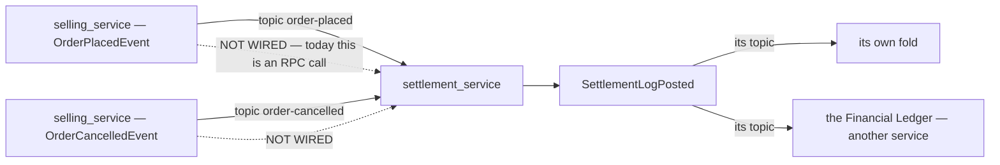
```mermaid
flowchart LR
  OP["selling_service — OrderPlacedEvent"] -->|"topic order-placed"| S["settlement_service"]
  OC["selling_service — OrderCancelledEvent"] -->|"topic order-cancelled"| S
  S --> SE["SettlementLogPosted"]
  SE -->|"its topic"| F["its own fold"]
  SE -->|"its topic"| FL["the Financial Ledger — another service"]
  OP -.->|"NOT WIRED — today this is an RPC call"| S
  OC -.->|"NOT WIRED"| S
```

### Out — exactly one

**`SettlementLogPosted`.** One variant, because every settlement fact has one shape: a new immutable
row. `settlement_type` is a **field**, not eight variants — the fold runs the same statement for all
of them. Specified in
[analytic_context_clarify](./analytic_context_clarify.md#proposed-design--the-settlement-event).

⚠ **A `oneof` with one arm still earns its place** — a genuinely different fact later (a maintenance
signal, a replay marker) is then a free, non-breaking addition.

⚠ **`settlement_type` must ride as a Pub/Sub ATTRIBUTE, not only a field.** With one variant every
message carries the same `event_type`, so a subscription filter cannot discriminate at all. A
consumer that wants only `fund`, or wants to exclude `system_adjustment`, needs it in the attributes
— the broker cannot see inside `data`.

### In — two, and both already exist with no consumer

`context.md` says *"its trigered on order created, `order_service` calling --> `settlement_service`"*
— a synchronous RPC. But `selling_service` **already publishes both facts** and the proto says
outright that nothing listens:

| shipped today | carries | settlement would write |
| --- | --- | --- |
| [`OrderPlacedEvent`](../../../proto/warehouse/selling/v1/events.proto) — topic `order-placed` | `team_id`, `order_id`, `revenue`, `cogs`, `shipping_cost`, `warehouse_id`, actor | `initial_total` |
| [`OrderCancelledEvent`](../../../proto/warehouse/selling/v1/events.proto) — topic `order-cancelled` | `team_id`, `order_id`, `actor_id` | `initial_total_cancel` |

> *"⚠ IT CURRENTLY HAS NO CONSUMER, AND IS PUBLISHED ANYWAY — deliberately … **Do not stop publishing
> it because nothing listens.**"* — `events.proto`

**→ Recommend settlement SUBSCRIBE rather than be called.** It is the same fact, already on the wire,
and it replaces *"logged loudly and nobody knows which orders"* with at-least-once delivery plus a
dead-letter topic — which is the thing [the-order-commits-without-settlement](./context_decision.md#the-order-commits-without-settlement)
accepts the risk of and [a-missing-account-is-fixed-by-hand](./context_decision.md#a-missing-account-is-fixed-by-hand)
answers with a person. ⚠ **Both were decided deliberately and I am not reopening them** — I am saying
the mechanism that makes them unnecessary is already published, and nothing is built yet, so this is
the cheapest moment it will ever be to choose.

**Three things to check before it could work:**

| ⛔ | |
| --- | --- |
| **`revenue` vs `marketplace_total`** | `initial_total` is *"a frozen copy of `order.marketplace_total` — what the buyer ACTUALLY PAID"*. `OrderPlacedEvent.revenue` is *"the order's total — what the buyer paid"*. They read as the same number under two names — **confirm it, do not assume it**. If they differ, the event needs the other field before it can feed settlement |
| **two topics means NO ordering between them** | a cancel can be delivered before the placement it cancels — the exact sequence the guideline's `topic-per-context` diagram draws. ✅ **Settlement survives it**, because the ledger is a delta: `+120.000` then `−120.000` nets the same either way. ⛔ **But `order_settlements.initial_total` is a frozen copy, not a delta**, and a cancel arriving first has nothing to oppose — so the handler must decide whether that is an error or an open-then-close |
| **`order_created_by_user_id`** | the fold needs it and **neither event carries it under that name**. `OrderPlacedEvent` has an actor; whether it is the same person is a question, not a given |

## Critique

| | Problem | → Recommend |
| --- | --- | --- |
| **1** | **`marketplace_total = 0` means NOT RECORDED, not "worth nothing"** (`order.proto:224` — a phone order has no marketplace figure). Such an order opens at `initial_total = 0`, and every `fund` pushes its balance **positive**, reading as the platform overpaying. | **Do not open an account when `marketplace_total` is 0** — a non-marketplace order has no payout to settle. Same shape as `cost_known` on `order_revenues`: zero is both a legitimate value and the unknown marker, so something else must disambiguate. |
| **2** | **The `At` column is one date doing two jobs.** `§3` says fees arrive the next day, so every row has a day it *belongs to* and a day we *learned it*. | **[two-dates-occurred-and-posted](#two-dates-occurred-and-posted).** |
| **3** | ⛔ **ANSWERED — the order service CALLS settlement** ([order-service-calls-settlement](./context_decision.md#order-service-calls-settlement)), reversing my subscription recommendation. **What the answer leaves standing is the failure, and it is now the sharper question**: a call on the critical path means an order that genuinely happened on the marketplace cannot be recorded while settlement is unreachable. | **Do not fail the order.** `initial_total` is bookkeeping, not a control — nothing about it can make a placed order not have happened. I recommend the call be **retried, not gating**: the order commits, and a missing account is a repairable state a screen can show. See [Question 3](#question). |
| **4** | **Retiring `revenue_service` silently changes what `/revenue`, `/profit` and `/daily-statement` show.** [settlement-owns-revenue](./context_decision.md#settlement-owns-revenue) is right — it was always the same subscription freezing the same fact twice — but it is **not a rename**. `order_revenues.revenue` was `order.total`; `initial_total` is `order.marketplace_total`. Different fields, different values. And `marketplace_total = 0` means *not recorded*, so every phone order reports **zero revenue** where `order.total` always had a figure. | **`marketplace_total`, falling back to `order.total` when it is 0**, with the screen naming which it used. Margin still works because `order.cogs` is frozen on the order: **true margin = `balance + marketplace_total − cogs`**, which is a number `revenue_service` could never produce. ⚠ **That service has since been REMOVED** ([decision](./context_decision.md#revenue-service-is-removed-and-statistics-deferred)) and `/revenue` and `/profit` with it — so this critique no longer describes a migration, only the shape `initial_total` should have. |
| **5** | **A report grouped by TEAM cannot be scoped to a team** — `team_id` is `use_scope` and required on every settlement request, and shapes 2 and 4 ask for one row PER team. | → **Promoted to [Question 6](#question)** — it needs a yes, not a recommendation. |
| **6** | ✅ **ANSWERED — the report follows the ANALYTIC design** ([the-report-follows-the-analytic-principle](./context_decision.md#the-report-follows-the-analytic-principle)), reversing my `GROUP BY` recommendation. | → What the answer leaves standing is the **sequencing**, and it is the sharper question: every part of that pipeline is missing, starting with a publisher settlement does not have. [Question 6](#question). |

---

## Question

**Three open here**, and none is about the ledger's mechanics — those are all settled. 🆕 The third arrived by re-routing: the analytic doc was scoped to RECEIVING, so publishing lands here. ⚠ **Numbering was
compacted** when eight questions were answered or moved in one week; older references in this file's
narrative point at the numbers they had then, and every answer lives in
[context_decision.md](./context_decision.md).

1. **Where does a platform WITHDRAWAL live?** Wallet to bank, naming no order — so it is none of
   settlement's seven types, and [superseded-every-entry-names-an-order](./context_decision.md#superseded-every-entry-names-an-order)
   made `order_id NOT NULL`, which forbids the obvious workaround. It needs a real home.
   ⚠ **The same question is asked in [architecture Q7](../../technical/architecture/context_clarify.md#question)**,
   which is the one this file is waiting on.
   ✅ **It was briefly about to become blocking, and is not.**
   [a-past-date-position-is-a-real-screen](./context_decision.md#a-past-date-position-is-a-real-screen)
   confirmed a screen showing *"a shop's position"*, and that phrase had two referents — under the
   **wallet** reading a withdrawal is money leaving that wallet, so the screen could not have been built
   without answering this.
   [the-position-is-the-shortfall-not-the-wallet](./context_decision.md#the-position-is-the-shortfall-not-the-wallet)
   settled it as the **shortfall**, so **settlement is not waiting on this** — it stays open on its own
   merits, at its own pace. ⚠ `fund`'s undecided destination (the wallet, or our bank) is unblocked the
   same way, and equally unanswered.
   **→ I recommend answering it once, in the architecture clarify, and having settlement follow** —
   `order_service`, because the wallet is fed by that shop's orders and a withdrawal is reconciled
   against them.

2. **Is `problem funding` from `§2` the same as `marketplace_adjustment`?** Your worked example uses that
   type for a *reimbursement*, which is what I would call problem funding.
   **→ I recommend yes, one type covers both** — but if it is a claim **we file** rather than one the
   platform pays unprompted, it needs a screen to file it from, and that is a different thing to build.

3. ⛔ **Who publishes a ledger change, and does `SettlementPost` become the publisher?** ➡ **Re-routed
   here** (RULE 7b) from [analytic Q1](./analytic_context_clarify.md#question) — the owner scoped that
   doc to *receiving*: *"who send it is other service responsbility and out of this context topic"*. This
   is the doc for the write path, so the question lands here.
   ⛔ **Checked in the checkout: nothing publishes anything.** There is no event message in
   [settlement.proto](../../../proto/warehouse/settlement/v1/settlement.proto), no `EventSender` in
   `settlement_v1.Service`, and nothing emitted from
   [post_entry.go](../../../backend/services/settlement_service/settlement_v1/post_entry.go).
   ⚠ **And *"other service"* is worth confirming** — **nothing but `SettlementPost` writes
   `settlement_logs`**, so if a service outside settlement is meant to publish ledger changes, that is new
   and belongs in the architecture clarify.
   **→ I recommend `SettlementPost` publish, after commit, carrying the ROW.**
   ⚠ **This REVERSES my own earlier recommendation of a thin id-only event**, which rested on *"everything
   else is readable in-process"*. That is true of the fold and **false of every other consumer**: the
   Financial Ledger (`context.md` §General Brief 2) is a **different service** and cannot read
   `settlement_logs` at all (HARD RULE 3), so a thin event forces a cross-service RPC per event and
   rebuilds the coupling the event removes. And `order_created_by_user_id` — which the user report keys
   on — **is on no settlement table**, so it must ride regardless. Once one field must travel, the
   log-is-the-source-of-truth purity is already spent, and Pub/Sub's **1 KB minimum per delivery** makes
   the rest free.
   ⚠ **What was RIGHT in the thin argument, and does not apply here**: a fat event normally risks a
   replay folding *current* state — but `settlement_logs` is **append-only and immutable**, so reading a
   row back later returns exactly what it said. That hazard is absent, which is why this had to be argued
   on the other consumers rather than on the replay.
   ⚠ **Same precedent as `OrderPlacedEvent`** — [order_place.go:285](../../../backend/services/selling_service/selling_v1/order_place.go#L285) already
   publishes with *"a publish failure does NOT fail the order"*. That is the right trade here too, and it
   is what makes the reconcile pass ([analytic Q5](./analytic_context_clarify.md#question)) necessary
   rather than optional: a dropped publish is a movement the report never sees.


# Contradiction

## my own two clarify files specified the same event two different ways

Not a contradiction in your docs — one in mine, recorded because RULE 11 asks for the *cause*, and the
cause is worth naming.

| file | said |
| --- | --- |
| this file, [Q3](#question) | *"carrying the `settlement_logs` row id and **nothing else**"* |
| [analytic_context_clarify](./analytic_context_clarify.md#proposed-design--the-settlement-event) | the row, **whole** — fifteen fields |

**The cause: each was written with a different consumer in view.** Q3 was written when the fold was
the only reader, and the fold shares a process with the writer, so *"it can just read the row"* is
true. The payload spec was written against the event architecture, where a consumer is assumed to be
somewhere else.

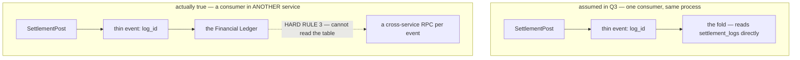
```mermaid
flowchart TB
  subgraph one ["assumed in Q3 — one consumer, same process"]
    W1["SettlementPost"] --> E1["thin event: log_id"]
    E1 --> F1["the fold — reads settlement_logs directly"]
  end
  subgraph two ["actually true — a consumer in ANOTHER service"]
    W2["SettlementPost"] --> E2["thin event: log_id"]
    E2 --> F2["the Financial Ledger"]
    F2 -.->|"HARD RULE 3 — cannot read the table"| X["a cross-service RPC per event"]
  end
```

**→ Resolved in favour of the row**, and Q3 is annotated rather than silently rewritten.
**→ What stops it recurring**: an event's payload is decided against **the furthest consumer**, never
the nearest. A same-process reader can always ignore fields it does not need — a reader in another
service cannot fetch fields that were never sent.

## a third source was decided on 2026-08-28 and five sites still say two

> [the-third-source-is-order](./context_decision.md#the-third-source-is-order) *(owner, 2026-08-28)* —
> *"`source_type` has **three** values, not two. `order_service` writes as **`order`**."* Shipped in
> [settlement.proto](../../../proto/warehouse/settlement/v1/settlement.proto): `SOURCE_TYPE_EXPORTER`,
> `SOURCE_TYPE_MANUAL`, `SOURCE_TYPE_ORDER`.
>
> `context.md` §Settlement Log Ledger Shapes 3 *(unchanged)* — *"what is `source_type`, its for
> determined how entry added: by external service, `exporter`, or by manual in frontend, `manual`."*

**The doc contradicts ITSELF, and that is the provable half.** §`Type initial_total and
initial_total_cancel` says *"when order cancel, its create `initial_total_cancel`, `order_service`
calling → `settlement_service`"*. So the doc has `order_service` writing a row, and the doc's own list
of sources holds no value that row could carry.

| site | what it says | whose |
| --- | --- | --- |
| §Settlement Log Ledger Shapes 3 | two values | yours |
| §Idempotency Key → Best Effort | *"so exporter and manual can decide"* — two generators | yours |
| §Type `initial_total` / `initial_total_cancel` | `order_service` calls, source unstated | yours |
| `### The schema` | `source_type "exporter or manual"` | ⛔ **mine — fixed this pass** |
| `### The proposed contract` | the same | ⛔ **mine — fixed this pass** |

**→ RECOMMEND the third value be written into §Log Shapes 3, and Best Effort name three generators.**
⚠ The Best Effort clause needs more than a third bullet: it says the recipe is always the caller's, and
that is now true of **two sources out of three**. `order_service`'s recipe is the one settlement DOES
prescribe — `hash(order_id + act_date + "cancel")`
([the-cancel-key-is-order-plus-act-date](./context_decision.md#the-cancel-key-is-order-plus-act-date)) —
because a retried cancel on a fresh key credits the account twice.

**→ What stops it recurring**: the source list and the type list are the two places an enum value has to
be restated in prose, which is exactly the *"table where every case appears together"* HARD RULE 11
names. The type list survived its widening (six to seven) because the cancel decision named this doc;
the source list did not, because that decision named the enum only.

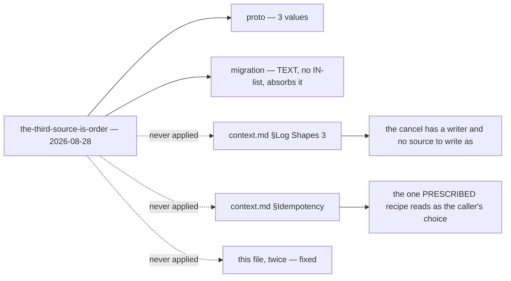
```mermaid
flowchart LR
  D["the-third-source-is-order — 2026-08-28"] --> P["proto — 3 values"]
  D --> M["migration — TEXT, no IN-list, absorbs it"]
  D -.->|"never applied"| C1["context.md §Log Shapes 3"]
  D -.->|"never applied"| C2["context.md §Idempotency"]
  D -.->|"never applied"| C3["this file, twice — fixed"]
  C1 --> X["the cancel has a writer and no source to write as"]
  C2 --> Y["the one PRESCRIBED recipe reads as the caller's choice"]
```

## both shape lists are behind the tables, and the gap hides a SIGN FLIP

> `context.md` §Settlement Log Ledger Shapes 1 — eleven fields: `id`, `unique_id`, `order_id`,
> `shop_id`, `team_id`, `actor_id`, `source_type`, `settlement_type`, `change`, `balance`, `created_at`.
>
> [`00001_create_settlement_ledger.sql`](../../../backend/services/settlement_service/db_migrations/)
> *(shipped)* — those eleven **plus `occurred_on`, `posted_on`, `reverses_id`, `note`**.
>
> `context.md` §Settlement State — three fields: `order_id`, `initial_total`, `last_balance`.
>
> Shipped — those three **plus `team_id`, `shop_id`, `created_at`, `updated_at`**. And
> [the-creator-is-stamped-on-the-state-row](./context_decision.md#the-creator-is-stamped-on-the-state-row)
> owes it a sixth, `created_by_user_id`, which is **not built in either place**.

**The dangerous one is not a missing column — it is one name meaning two opposite things.**

| | `settlement_logs` | `order_settlements` |
| --- | --- | --- |
| `initial_total` | **NEGATIVE** — the account opens in deficit | **POSITIVE** — the sale as a person says it |

The migration calls this *"the ONLY sign flip in the system"* and states it twice, in both tables.
`context.md` defines **both tables** and states it **nowhere**: its Behaviors table shows `- 120.000`
and §Settlement State lists `initial_total` bare. Read the owner's doc alone and
`net received = last_balance + initial_total` computes as `−10.000 + −120.000` — the screens' headline
figure, with the sign of a loss twice over.

**→ RECOMMEND one line under §Settlement State** — *"`initial_total` is stored POSITIVE, the opposite of
the log's sign, and the only place the convention inverts"*
([initial-total-is-stored-positive](./context_decision.md#initial-total-is-stored-positive)).
**→ And the four log columns added to §Log Shapes 1**, `posted_on` first:
[posted-on-buckets-the-report](./context_decision.md#posted-on-buckets-the-report) made it the date every
aggregate reads, and the doc that defines the row does not say it exists.

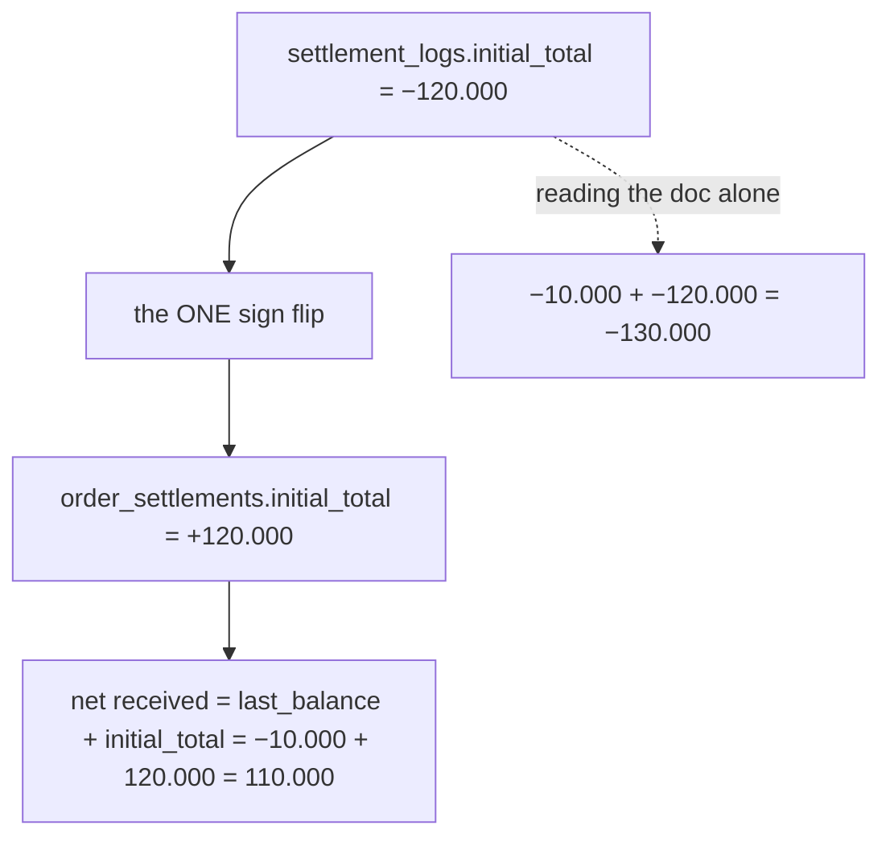
```mermaid
flowchart TB
  L["settlement_logs.initial_total = −120.000"] --> F["the ONE sign flip"]
  F --> S["order_settlements.initial_total = +120.000"]
  S --> N["net received = last_balance + initial_total = −10.000 + 120.000 = 110.000"]
  L -.->|"reading the doc alone"| W["−10.000 + −120.000 = −130.000"]
```

## `fund` is dated by an order status the same doc says settlement ignores

> `context.md` §General Brief 5 — *"Settlement doesn't rely on our order status. its can be happen
> anytime."* Recorded as
> [settlement-ignores-our-order-status](./context_decision.md#settlement-ignores-our-order-status), and
> the proto repeats it: *"Nothing is gated on `OrderStatus`."*
>
> `context.md` §Settlement Behaviors, row 2 — `fund | + 100.000 | `**`On Order Completed`**.

**One line of the doc gates a row on order status and another forbids gating on it.** It is only the
Desc column, so nothing downstream was built wrong — but this table is the doc's worked example, and a
worked example is what a reader copies.

**→ RECOMMEND the Desc read *"payout received from the platform"*** — the thing that actually causes the
row. ⚠ **Row 1's *"On Order Created"* is correct and should stay**: that one IS our own event
([the-account-opens-at-order-creation](./context_decision.md#the-account-opens-at-order-creation)), which
is what makes row 2 the only one out of place rather than the table being written on the wrong axis.


## the daily row now has TWO creators, and the older one can refuse money

> ✅ **RESOLVED (2026-09-02) by [init-opening-balance-is-deleted](./context_decision.md#init-opening-balance-is-deleted)** —
> the fold's upsert is the only creator. **Kept here because the record is the point** (HARD RULE 11):
> this is the second time a decision moved work between `context.md` and `analytic_context.md` and only
> one file followed. ⚠ **`context.md` has not been edited yet** — it still draws the call, the rollback
> and `## The Reason `InitOpeningBalance` is existed.`

> `context.md` `## How Ledger Behave when ledger updated.` *(unchanged)* — inside the ledger's
> transaction, with the state row locked: *"Call Rpc Stat `InitOpeningBalance`"* → *"Call Success ?"* →
> **no → Rollback Database Transaction**. And `InitOpeningBalance` itself: *"check daily shop report
> exist ? → no → **create daily shop report**"*.
>
> `analytic_context.md` `### Flow` *(adopted 2026-09-02)* — the fold's own statement creates it:
> `INSERT INTO shop_settlement_daily_reports … ON CONFLICT (day, shop_id, team_id) DO UPDATE`.

**Both create the same row, and only one of them can exist.** This was not a conflict when it was
written — it became one when
[the-fold-owns-the-report-not-the-writer](./context_decision.md#the-fold-owns-the-report-not-the-writer)
made the consumer the owner of the daily tables, and again when the upsert made row creation atomic and
race-free without any lock at all.

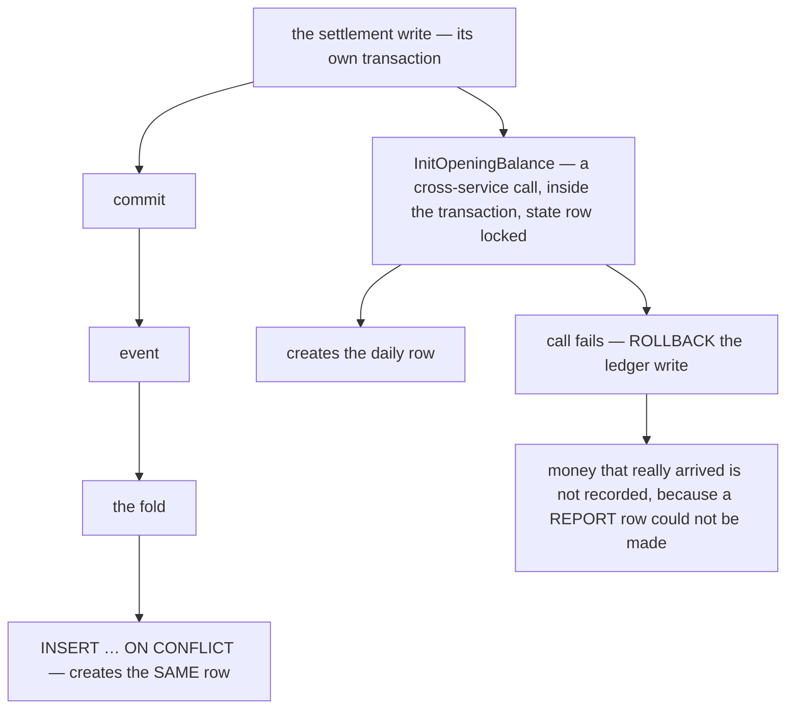
```mermaid
flowchart TB
  W["the settlement write — its own transaction"] --> IOB["InitOpeningBalance — a cross-service call, inside the transaction, state row locked"]
  IOB --> RB["call fails — ROLLBACK the ledger write"]
  IOB --> ROW["creates the daily row"]
  W --> C["commit"] --> EV["event"] --> F["the fold"]
  F --> UP["INSERT … ON CONFLICT — creates the SAME row"]
  RB --> X["money that really arrived is not recorded, because a REPORT row could not be made"]
```

| | `InitOpeningBalance` | the adopted upsert |
| --- | --- | --- |
| who runs it | the ledger's transaction, synchronously | the fold, after the commit |
| what it costs the write | the transaction is as long as another service's worst latency, with the state row **locked** for all of it | nothing |
| on failure | ⛔ **rolls back the ledger** | the fold retries — the ledger already committed |
| the race it exists to prevent | two writers computing one `(day, shop)` row | ⛔ **already solved** — `UNIQUE (day, shop_id, team_id)` + `ON CONFLICT` is race-free with no lock |
| what created the row | a cache-guarded check-then-create across a service boundary — and the cache is **per-process** in the memory implementation, so two instances hold different answers | one atomic statement |

**→ Recommend `InitOpeningBalance` be DELETED**, along with `## The Reason InitOpeningBalance is
existed.` and the `init_check → rollback` branch. Everything it does is now done by the statement the
doc already adopted, and done better: no network call inside a transaction, no lock held across it, no
cache on the correctness path, and no way for a report to refuse a payment that genuinely arrived.

**→ What stops it recurring**: the ledger's write protocol and the fold's write path are **two
descriptions of one flow living in two files**. A decision that moves work from one side to the other has
to be applied to both in the same pass — the same rule as HARD RULE 3's *"a migration updates
`docs/database-schema.md` in the same commit"*.

⚠ **If it stays**, one thing must change regardless of everything above: `init_check → no` must **not**
roll back. That is the answer already given one seam upstream — a publish failure must not fail the
order — and it is the same argument: the ledger is evidence, the report is a view of it.

## the state table is named twice, and the second name is the one that shipped

> `settlement_context.md` `# Settlement Ledger.` *(this round)* — *"`state` that named
> **`settlement_states`**"*
>
> `settlement_context.md` `## Settlement State` — *"we have settlement state, we called
> **`order_settlements`**"*
>
> shipped: [order_settlement.go](backend/services/settlement_service/settlement_service_models/order_settlement.go)
> — `TableName() = "order_settlements"`, the proto message is `OrderSettlement`, and
> [the-state-holds-initial-total-and-last-balance](./context_decision.md#the-state-holds-initial-total-and-last-balance)
> recorded that name.

**Which line I think is wrong: the new one.** Two sections of one doc name the same table differently,
and the older name is the one in the migration, the model, the proto and a recorded decision. ⚠ But the
new name is arguably the BETTER one — `settlement_states` reads as *this service’s state table*, where
`order_settlements` reads as *a table of orders*. If the rename is wanted it is a migration and a proto
change, not a slip to correct silently.

**→ RECOMMEND** keep `order_settlements` — it is shipped, it is the grain
([superseded-the-grain-is-the-order](./context_decision.md#superseded-the-grain-is-the-order)), and the rename buys a word.
What stops this recurring is the property the last contradiction already named: **a thing is named
once, and every later mention links to that line instead of restating it.** This is the second time in
this context that one concept has been written down under two names.

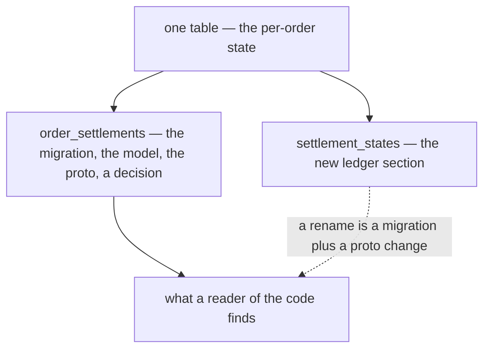
```mermaid
flowchart TB
  C["one table — the per-order state"]
  C --> N1["order_settlements — the migration, the model, the proto, a decision"]
  C --> N2["settlement_states — the new ledger section"]
  N1 --> W["what a reader of the code finds"]
  N2 -.->|"a rename is a migration plus a proto change"| W
```

## a decision I recorded about a MEASURE also asserted an ARCHITECTURE, and the architecture was answered against it

> [the-measure-is-sales-received-and-gap](./context_decision.md#the-measure-is-sales-received-and-gap), *What it
> binds* — *"It is a fold over facts, not a stored table. **No new store, no new write path**"*
>
> `settlement_context.md` `## General.` 1 *(this round)* — *"Design Analytic Principle is follow
> [this](../analytic/context.md)"* — which is a broker, a stream processor and **a report table**.

**Which line is wrong: mine.** The owner’s doc is the source of truth (RULE 7b), so the fold-at-read
clause is dead and the report is a stored table folded forward. ⚠ **The rest of that decision is
untouched** — the columns, the arithmetic and the `gap = −Σ change` identity are all about what the
numbers ARE, and they hold whether the sum is computed at read or at write.

**→ RECOMMEND** the annotation already added to the decision index, and the property that stops it
recurring: **a decision about a MEASURE must not also assert WHERE it is computed.** I folded a
storage claim into a measurement answer, so an architecture decision taken hours later invalidated
part of a decision that was otherwise still correct — and a reader of the index would have had no way
to see which part.

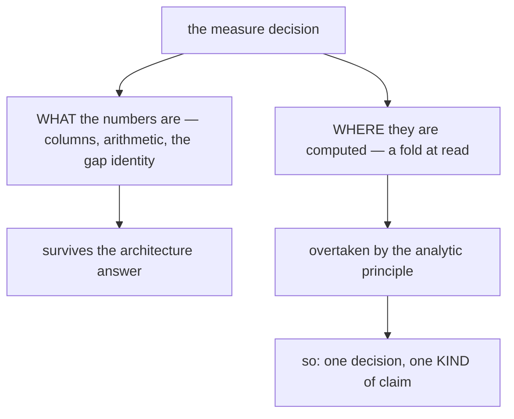
```mermaid
flowchart TB
  D["the measure decision"] --> M["WHAT the numbers are — columns, arithmetic, the gap identity"]
  D --> W["WHERE they are computed — a fold at read"]
  M --> OK["survives the architecture answer"]
  W --> X["overtaken by the analytic principle"]
  X --> P["so: one decision, one KIND of claim"]
```

## the field settlement computes from is documented as the one field nothing computes from

> `settlement_context.md` §Settlement Behaviors row 1 — *"On Order Created (write opposite from
> `order_marketplace_total`)"*
>
> `order.proto:216` — *"What this order SOLD FOR on the marketplace — **a NOTE, and nothing computes
> from it** (owner)."*
> `order.proto:226` — *"⚠ **Never add it to margin or revenue.**"*

**Which line I think is wrong.** The proto comment, but only **half** of it. Line 226's ⚠ is still
correct and must stay — `marketplace_total` must never enter margin or revenue, and settlement does not
put it there. What has gone stale is *"nothing computes from it"*: settlement now opens every account
from it, which makes it **load-bearing**. A field nobody reads can be blank, mistyped or edited later
without consequence. This one cannot.

**→ RECOMMEND** amend `order.proto` in the same change that adds `initial_total`: keep the ⚠, replace
"nothing computes from it" with what now does, and say it is **frozen at creation** for settlement. What
stops this recurring is naming the property: **a comment asserting that nothing reads a field goes stale
the moment a service is added, so it should name the readers rather than claim there are none.**

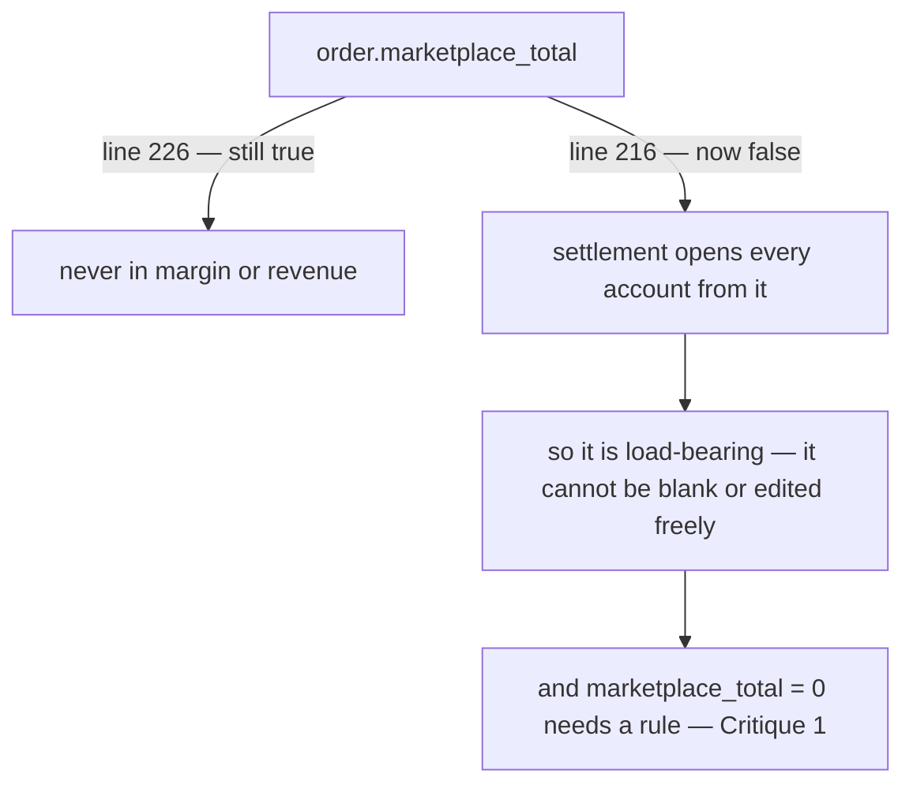
```mermaid
flowchart TB
  M["order.marketplace_total"]
  M -->|"line 226 — still true"| X["never in margin or revenue"]
  M -->|"line 216 — now false"| Y["settlement opens every account from it"]
  Y --> Z["so it is load-bearing — it cannot be blank or edited freely"]
  Z --> Q["and marketplace_total = 0 needs a rule — Critique 1"]
```

## one concept, three service names, and each is written down as authoritative

> `settlement_context.md` §Responsbility 1 — *"for owe and balance across teams, its
> **`liability_service`**"*
>
> `architecture/context.md:7` — *"**`balance_service`**, mirrored pair rows, debt threshold, **the
> gate**, payments between teams"*
>
> shipped: ✅ **the rename has landed** — `backend/services/liability_service/` now holds
> `liability_balances`, `liability_terms`, `liability_payments`, and there is **no `settlement_service`
> directory at all**. The name is free, which is what
> [design-accepted](./context_decision.md#design-accepted) step 1 was for.

**All three describe the same thing.** "Mirrored pair rows" is `settlement_balances`, "debt threshold"
is `settlement_terms`, "payments between teams" is `settlement_payments`.
[architecture_context_clarify](../../technical/architecture/context_clarify.md) currently proposes
**splitting** the shipped service into a `balance_service` it believes does not exist yet.

**Which line I think is wrong.** `architecture/context.md:7`, and it is now the **only** site left saying
`balance_service` — the code, the frontend and §Responsbility all say `liability_service`. Two of the three
names are now settled by what shipped; one line in your architecture doc is what still disagrees.

⚠ **But it is not only a name.** The architecture clarify splits that box for a *reason* — a gate must be
synchronous while a book may lag. Renaming settles the noun and leaves that argument untouched.

⚠ **`export_service` now has the same problem in advance.** Brief 3 names it, and
`architecture/context.md` does not list it at all — so it is a service named in one doc and absent from
the one that is supposed to name services.

**→ RECOMMEND** `liability_service` everywhere, and add `export_service` to
`architecture/context.md` when you come back to it. What stops this recurring is naming the property:
**a service is named once, in `architecture/context.md`, and every other doc links to that line instead
of restating it** — three docs each naming the same box independently is what produced three names.

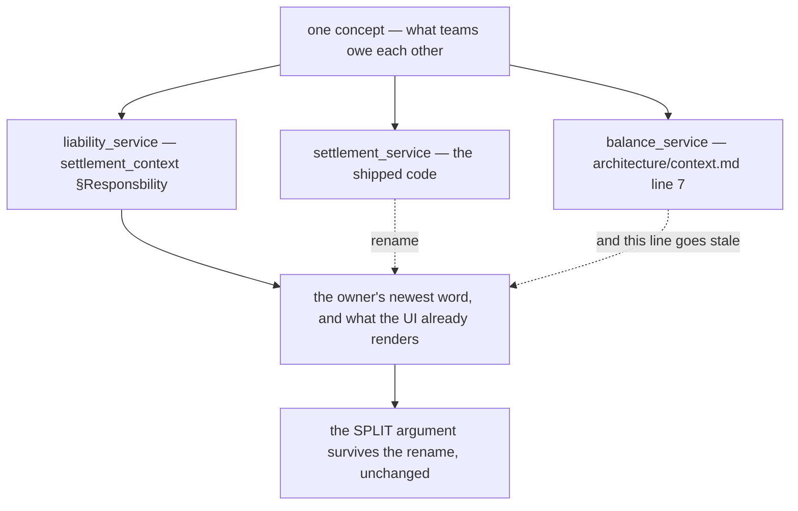
```mermaid
flowchart TB
  C["one concept — what teams owe each other"]
  C --> N1["settlement_service — the shipped code"]
  C --> N2["balance_service — architecture/context.md line 7"]
  C --> N3["liability_service — settlement_context §Responsbility"]
  N3 --> W["the owner's newest word, and what the UI already renders"]
  N1 -.->|rename| W
  N2 -.->|"and this line goes stale"| W
  W --> S["the SPLIT argument survives the rename, unchanged"]
```

## the calling service is named twice and neither name is in the tree

**New this round**, and it arrived with the arrow that answers Q4.

> `settlement_context.md` §Type 1–2 *(this round)* — *"`order_service` calling --> `settlement_service`"*
>
> `architecture/context.md:9` — *"`order_service`, draft→finalize→accept→pack→handover…"*
>
> shipped: `backend/services/` contains **`selling_service`** — and no `order_service`.

**Which line I think is wrong: the folder.** Both of your docs independently say *order*, and the domain
noun in the requirement set is the order — `selling_service` was never written down anywhere as a name.
That is the same verdict [architecture_context_clarify](../../technical/architecture/context_clarify.md#reconciling-with-the-twelve-directories-already-in-backendservices)
already reached, and the settlement→liability rename has just proved the manoeuvre is affordable.

⚠ **It is a smaller rename than the last one and a bigger one than it looks.** The proto package is
`warehouse.selling.v1`, so it is a contract change, not only a directory move.

**→ RECOMMEND** rename `selling_service` → `order_service` before the payout service is written, for the
same reason the liability rename went first: the seam being built right now is `order_service` →
`settlement_service`, and writing it against a folder called `selling_service` bakes the disagreement into
new code. What stops this recurring is the property already named in the contradiction above — **a service
is named once, in `architecture/context.md`, and the folder follows that line rather than the reverse.**

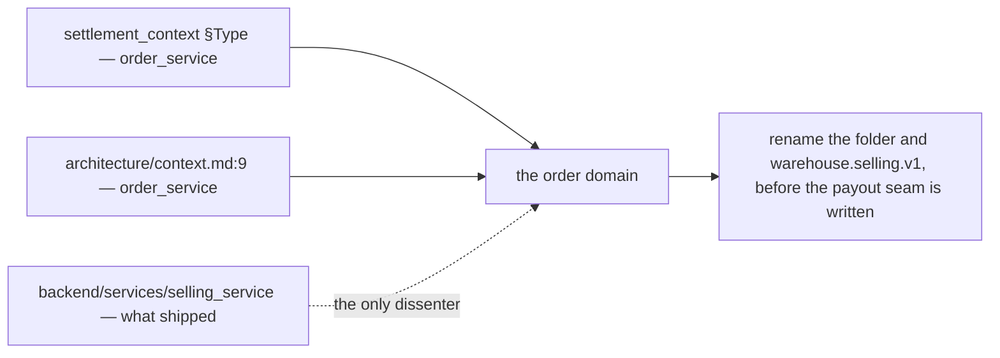
```mermaid
flowchart LR
  D1["settlement_context §Type — order_service"] --> N["the order domain"]
  D2["architecture/context.md:9 — order_service"] --> N
  T["backend/services/selling_service — what shipped"] -.->|"the only dissenter"| N
  N --> R["rename the folder and warehouse.selling.v1, before the payout seam is written"]
```

---

# Awaiting

- ➡ **MOVED — *how is a missing settlement account FOUND?* is now [order Q14](../order/context_clarify.md#question).**
  [the-order-commits-without-settlement](./context_decision.md#the-order-commits-without-settlement) flagged
  it as its own undecided half, and the owner routed it (2026-09-10): *"for ensure order half success or
  not, its order service responsibility"*. ⚠ **It is one gap at three sites**, and settlement is only one
  of them — the event publish and the product-owner resolution lose a fee the same way. Deciding it here
  would have answered a third of it.


- ⛔ **§Access Role still defers a policy that is decided AND shipped.** It reads *"for now, there is no
  specific role for this service. [defer later]"*, but
  [the-write-set-is-cs-and-up](./context_decision.md#the-write-set-is-cs-and-up) fixed the set
  (`ROOT, ADMIN, TEAM_OWNER, TEAM_ADMIN, CS`, scoped on `team_id`),
  [initial-total-is-postable-by-cs-and-owners](./context_decision.md#initial-total-is-postable-by-cs-and-owners)
  fixed who may type `initial_total`, and the proto carries both on every request message.
  ⚠ The deferral is not harmless wording: [no-role-policy-yet](./context_decision.md#no-role-policy-yet)
  records that *"no policy" is not a buildable state* — a message with none is DENIED to everybody. A
  reader following §Access Role literally ships an RPC nobody can call. **Yours to update** (RULE 7b).

- ⛔ **`created_by_user_id` is decided, unbuilt, and it is THIS doc's table.**
  [the-creator-is-stamped-on-the-state-row](./context_decision.md#the-creator-is-stamped-on-the-state-row)
  puts it on `order_settlements` — §Settlement State's table, not the analytic doc's — so the shape
  belongs here even though the column exists for `user_settlement_daily_reports`. The model has no user
  column, so that report cannot be folded at all. Re-routed from
  [analytic_context_clarify.md](./analytic_context_clarify.md#awaiting) per RULE 7b: the doc that defines
  the table is the doc that can answer its shape.
  ⚠ **And `0` must read as *not recorded***: an account opened by an exporter's `fund` before any
  `initial_total` has no creator, so the user report needs an explicit **unattributed** bucket or its
  columns will silently fail to sum to the shop report.

- ⚠ **§Settlement Ledger says *"we have 3 things"* and lists two** — `settlement_logs` and
  `settlement_states`. ⚠ The name in that list is a third spelling: the table shipped as
  `order_settlements`, which the doc's own §Settlement State calls it. Already recorded as
  [the state table is named twice](#the-state-table-is-named-twice-and-the-second-name-is-the-one-that-shipped);
  noted here only because the count says a third thing is missing and it may be the one that was dropped.

- ⛔ **`context.md` still contains three things that are now DELETED by decision** —
  [init-opening-balance-is-deleted](./context_decision.md#init-opening-balance-is-deleted). The
  `## How Ledger Behave when ledger updated.` flowchart still calls `InitOpeningBalance` inside the
  transaction and still branches `init_check → no → rollback`, the second diagram still describes what
  the call does, and `## The Reason `InitOpeningBalance` is existed.` is still there. **Yours to remove**
  (RULE 7b) — noted so the doc and the decision do not drift.

- ⚠ **`balance` is still undefined, in both grain tables.** It sits beside `open_balance` and
  `close_balance` under *"field must exists"* with no stated meaning. If it is the closing figure it is a
  duplicate of a column that now has a definition; if it is something else it needs one sentence.
  **→ Recommend dropping it** and keeping the two that are defined.

- ⚠ **No `orders` count on either grain table.** [the-measure-is-sales-received-and-gap](./context_decision.md#the-measure-is-sales-received-and-gap)
  carries one, and no sum of movement columns can reconstruct it — a day with one 10-million order and a
  day with fifty small ones are indistinguishable without it. **→ Recommend one `orders` column per
  table**, counted as distinct accounts touched that day. Cheap now, a backfill later.

- ⚠ **`occurred_on` is now read by no aggregate.** [posted-on-buckets-the-report](./context_decision.md#posted-on-buckets-the-report)
  puts every window on `posted_on`, so the other date survives only as evidence on the row — it is what
  tells a reader that a charge posted today belongs to last week. **→ Recommend it stays REQUIRED on the
  write**, exactly as the proto already argues: without it a late charge and a backdated one are
  indistinguishable, and that distinction is the whole reason the panel shows two dates. Not a question
  — a note for the pass that writes the report RPC, so nobody deletes a column that no `GROUP BY` names.

- ⚠ **The shipped list filter uses a THIRD date.** `OrderSettlementListFilter.from/to` is documented as
  *"the period the ACCOUNT was last moved in"* — neither `posted_on` nor `occurred_on`, but a property of
  the projection. Now that reports are fixed on `posted_on`, a person filtering the list to January and
  the report to January gets two different sets. **→ Recommend the list moves to `posted_on` too**, so one
  word means one thing on both screens. `backend_analysis` decides whether that is an index or a join.

- **Which column is the HEADLINE, and the default sort?** [the-measure-is-sales-received-and-gap](./context_decision.md#the-measure-is-sales-received-and-gap) fixes the
  columns and not their ranking, and the two readings disagree about what a "bad" row is: sorted by
  `gap` the worst shop is the one **leaking most**, sorted by `net_received` it is the one **collecting
  least**. **→ Recommend `gap` descending**, on the precedent already shipped —
  `ORDER_SETTLEMENT_SORT_LOSS` is the order list’s default and is documented as *"the reason the screen
  exists"*. Worth one word of confirmation, not a question.

- ⚠ **The second-`initial_total` refusal must live in the HANDLER, not only the form.**
  [initial-total-is-postable-by-cs-and-owners](./context_decision.md#initial-total-is-postable-by-cs-and-owners)
  is enforced in the prototype by hiding the option — which is a convenience, not a control. The write
  API is open to `export_service` as well, and `UNIQUE (order_id, unique_id)` cannot see that two rows
  mean the same sale. **→ Recommend the handler refuse a second LIVE `initial_total` outright**, and
  `backend_analysis` decide whether a partial unique index can express "live" or whether it has to be a
  query. Not a question for the owner — a note for the pass that writes the RPC.

- **No currency, rounding or percentage rule.** Every money field here is whole rupiah `int64`, and
  platform fees are quoted as percentages — so the rounding is frozen at write and never revisited.
- **`export_service` is named and nowhere described.** Brief 3 defers it, which is fine — but settlement's
  write contract is the seam between them, which is why [Question 4](#question) cannot wait for it.
- **No `status` in the row shape.** With [a-residual-balance-is-normal](./context_decision.md#a-residual-balance-is-normal)
  I no longer think one is needed — but the list screen still has to sort and filter by *something*, and
  "drift from face value" is the only candidate. Worth confirming that is the intended reading.
- **Nothing says what a NEGATIVE order looks like.** A full refund would drive `fund` negative or post a
  large `marketplace_adjustment`; whether that is a settlement concern or a returns concern is unstated.
