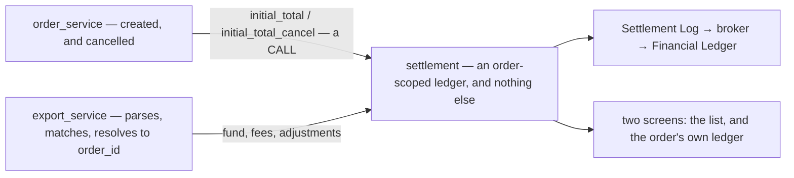
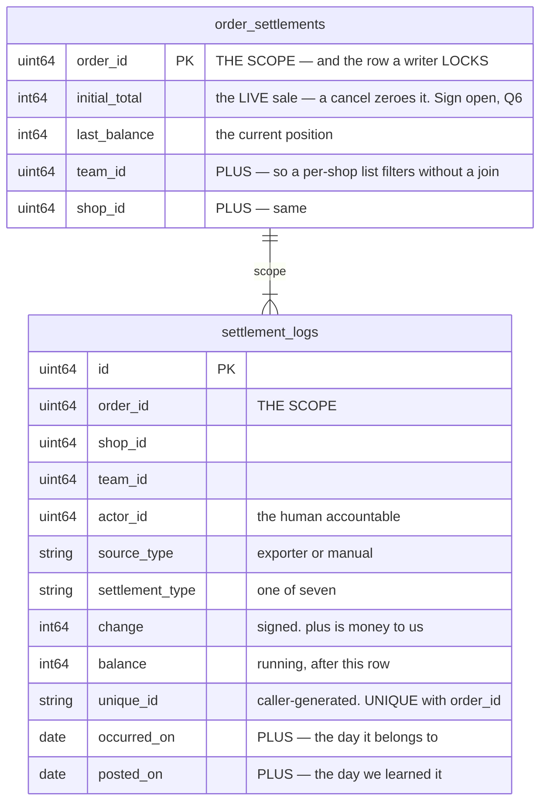
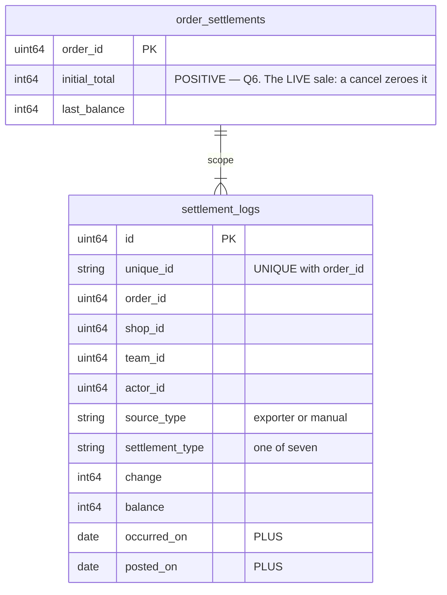
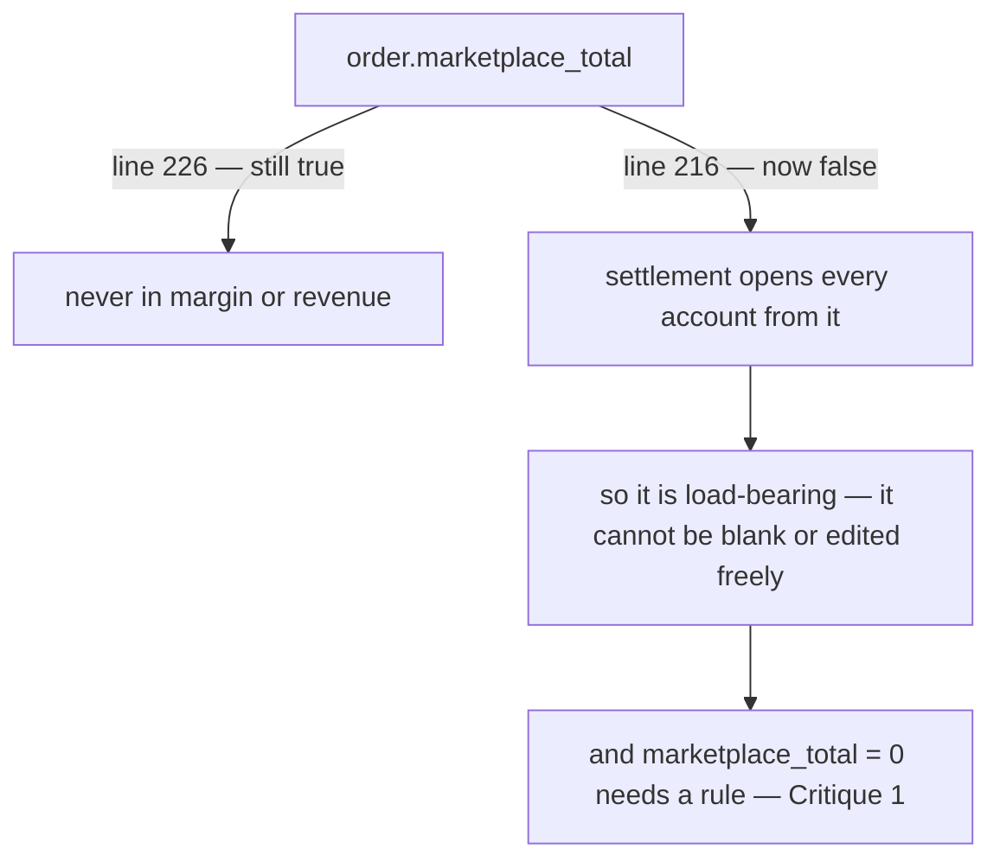
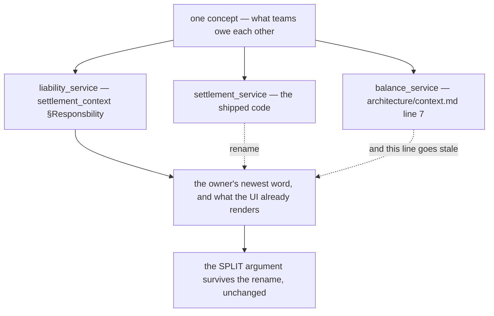
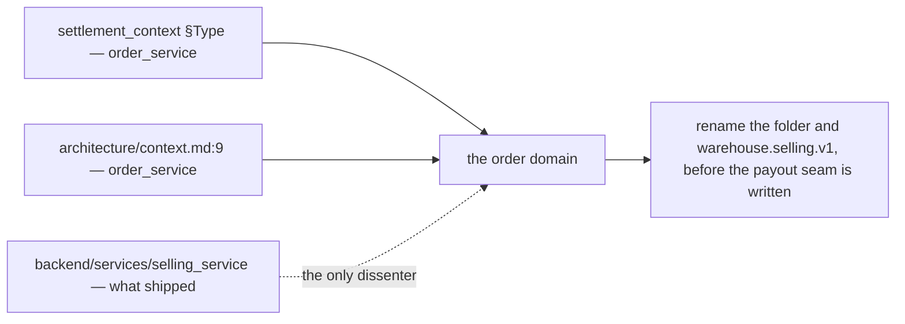

# Clarity — `settlement_context.md`

What I read out of [settlement_context.md](./context.md), and what has to be settled before a screen
can exist. **That doc is yours — this one is mine.** Answered points are **deleted**, so this file is
always the current open set.

> **Re-examined after §Idempotency Key, the `fund` clause and §Settlement State.** ✅ **My longest-standing
> blocker is closed** — the duplicate-write hole. `unique_id` unique with `order_id`, generated by the
> caller, and the recipe is explicitly out of settlement's scope (owner, in chat). Five recorded:
>
> | § | what it settled | recorded as |
> | --- | --- | --- |
> | §Idempotency Key | `unique_id`, caller-generated, unique with `order_id` | [the-unique-id-is-generated-outside-settlement](./context_decision.md#the-unique-id-is-generated-outside-settlement) |
> | owner, in chat | the recipe is the caller's problem, not settlement's | [the-recipe-is-the-callers-problem](./context_decision.md#the-recipe-is-the-callers-problem) |
> | §Settlement State | `order_settlements` — `order_id`, `initial_total`, `last_balance` | [the-state-holds-initial-total-and-last-balance](./context_decision.md#the-state-holds-initial-total-and-last-balance) |
> | Shapes 2, `fund` | *"its not net, platform still charge in other day sometimes"* — no single row is ever "the payout" | [fund-is-not-the-final-figure](./context_decision.md#fund-is-not-the-final-figure) |
> | §Settlement State | the state-plus-log shape | [the-state-table-is-order-settlement](./context_decision.md#the-state-table-is-order-settlement) |
>
> **Keeping `initial_total` in the state is the good call.** It makes the number every screen wants a
> single-row read: `net received = last_balance + initial_total`, which on the worked example is
> `−10.000 + 120.000 = 110.000` ✓ — no scan of the log for one row of one type.
>
> **`fund` being "not net" is the same idea as [a-residual-balance-is-normal](./context_decision.md#a-residual-balance-is-normal),
> one level down.** Not only does the *account* never close — the *payout* is not a single event either.
> A screen labelling `fund` as "what we got paid for this order" is wrong on any order with later
> charges, which `§3` says is most of them.
>
> ✅ **The commission argument is closed and deleted, and I was wrong about the premise.** The 20.000 in
> the worked example is *"any hidden cost, we cant record and leave it"* (owner) — the platform never
> itemises it, so there is nothing to discard. My whole `platform_fee` case assumed a number we were
> being given and choosing to throw away.
> [hidden-cost-is-left-in-the-balance](./context_decision.md#hidden-cost-is-left-in-the-balance) records
> it, **and it makes the balance a better object than I had it**: not a variance, but the only measure
> of what the platform takes without saying so. Summed per shop per month it is an implied take-rate.
>
> ✅ **And `marketplace_total` is a FACT, not an estimate** (owner) — what the buyer actually paid.
> [marketplace-total-is-a-fact-not-an-estimate](./context_decision.md#marketplace-total-is-a-fact-not-an-estimate).
> That sharpens the balance rather than just renaming it: measured against a fact, the gap is not
> "drift from a guess" but exactly **how much of what the buyer paid never reached us** — the
> platform's take, literally, so `hidden ÷ initial_total` is a real take rate. The screens now say
> **Sold for** and **% of sales**.
>
> ✅ **§Access Role is answered, and one answer REVERSED my recommendation** (owner). The write set is
> `[ROOT, ADMIN, TEAM_OWNER, TEAM_ADMIN, CS]` scoped on `team_id`
> ([the-write-set-is-cs-and-up](./context_decision.md#the-write-set-is-cs-and-up)), and `initial_total`
> **is** hand-postable — by everyone in that set except `team_admin`
> ([initial-total-is-postable-by-cs-and-owners](./context_decision.md#initial-total-is-postable-by-cs-and-owners)).
> I had recommended nobody may type it; that assumed the sale figure is always machine-derived, and it
> is not — `marketplace_total = 0` means *not recorded*, so the ban left those accounts permanently
> uncomputable with no way to repair them. ⚠ **What the permission does NOT settle is the duplicate**:
> a second `initial_total` adds rather than replaces, so the ACCOUNT vetoes the type once one exists.

> **Re-examined after §Access Role, the seventh type and §Type `initial_total` / `initial_total_cancel`.**
> Two more recorded, and **one of them reverses me**:
>
> | § | what it settled | recorded as |
> | --- | --- | --- |
> | §Type 1–2 | `order_service` **CALLS** settlement — on create and on cancel | [order-service-calls-settlement](./context_decision.md#order-service-calls-settlement) ⛔ |
> | §Shapes 2, §Type 2 | `initial_total_cancel` — a **seventh** type, the exact opposite of `initial_total` | [a-cancel-is-an-opposite-row](./context_decision.md#a-cancel-is-an-opposite-row) |
> | owner, in chat | the state's `initial_total` holds the **LIVE** sale — the cancel row zeroes it | [cancel-zeroes-the-live-sale](./context_decision.md#cancel-zeroes-the-live-sale) |
>
> ✅ **Q4 is closed and deleted** — I recommended a subscription so that placing an order could not fail
> on settlements availability. The arrow is a **call**, drawn twice, so it is the shape and not a
> shorthand. **What the answer does not settle is the failure**: an order that has genuinely happened on
> the marketplace must not be lost because a ledger is unreachable, so *what a failed call does to the
> order* is now [Question 3](#question) in its place — a smaller question than the one it replaces.
>
> ✅ **The formula break is CLOSED, and the fix keeps the column a projection.** A cancelled order was
> reading as having netted the **full sale** *and* having lost the whole sale to hidden platform cost —
> two wrong numbers from one column, and `/settlement` ranks by exactly those. The state now tracks the
> **live** sale, so all four derived figures stay written verbatim: no branch, no flag, no new column.
> And it is still recomputable from the log — `−Σ(change)` over **both** initial types — so nothing is
> rewritten, only projected from one more row.
>
> ✅ **It simplifies a decision you had already made.** The *is there a live `initial_total`* test that
> [initial-total-is-postable-by-cs-and-owners](./context_decision.md#initial-total-is-postable-by-cs-and-owners)
> needs is now `initial_total != 0` — one column, not a sum over log rows — and *reverse, then repost*
> works with no special case.
>
> ⚠ **One consequence is NOT settlement's, and is named so it is not found on a screen**: `true margin`
> becomes `0 − cogs` on a cancelled order unless `order_service` releases `order.cogs` on cancel.
>
> ⚠ **And it lands outside the write-set decision.** [the-write-set-is-cs-and-up](./context_decision.md#the-write-set-is-cs-and-up)
> and [initial-total-is-postable-by-cs-and-owners](./context_decision.md#initial-total-is-postable-by-cs-and-owners)
> were settled when there were six types. Whether a human may hand-post the **seventh** — a cancel, on a
> live order, from the ledger tab — was not in front of you. [Question 2](#question).

Siblings: [order_context](../order/context_clarify.md) · [ledger_context](../ledger/context_clarify.md) ·
[architecture_context](../../technical/architecture/context_clarify.md).
Decisions: [context_decision.md](./context_decision.md).

---

## Proposed Design

### What settlement is now

Brief 3 shrank it to something much easier to build and much easier to describe.



| settlement owns | `export_service` owns |
| --- | --- |
| the log, the running balance, the **seven** types | the file and its evidence |
| `initial_total` from order creation | the per-marketplace parser |
| the write API, and its idempotency | matching a platform ref to an `order_id` |
| the two read screens | the unmatched tray |

### The rules, named

> **Twenty-four are decided** and live in [context_decision.md](./context_decision.md) — one of them ⛔
> reversed. Everything below is still a proposal.

#### an-account-never-closes
*"its also still happen other fee in next day"* (`§3`), and
[a-residual-balance-is-normal](./context_decision.md#a-residual-balance-is-normal) makes it explicit: a
row can arrive at any time, and the account has **no terminal state**.

⚠ **Two things follow that are easy to get wrong.** There is no "settled" flag driven by `balance = 0` —
nothing would ever be settled. And there is no worklist of non-zero balances — it would contain almost
every order.

#### a-cancel-undoes-the-sale-not-the-account
[a-cancel-is-an-opposite-row](./context_decision.md#a-cancel-is-an-opposite-row) — a cancelled order keeps
its account and gets a seventh-type row that is the exact opposite of `initial_total`.

| | |
| --- | --- |
| the LOG | is undone — the two rows cancel to zero, and both stay visible |
| the ACCOUNT | is **not** closed — a late ads fee on a cancelled order still has somewhere to land |
| the STATE | ✅ **decided — zeroed.** [cancel-zeroes-the-live-sale](./context_decision.md#cancel-zeroes-the-live-sale): the column holds the LIVE sale, so a cancel drives it to 0 |

✅ **SETTLED that way** — [cancel-zeroes-the-live-sale](./context_decision.md#cancel-zeroes-the-live-sale).
The state table is not append-only — `last_balance` mutates on every write — so mutating `initial_total`
beside it is the same kind of write, not a rewriting of history. The log keeps both rows; the state keeps
the current position; `net received = last_balance + initial_total` stays correct in all three cases with
no flag, no second column and no change to any screen.

✅ **It also completes the repair path.** [initial-total-is-postable-by-cs-and-owners](./context_decision.md#initial-total-is-postable-by-cs-and-owners)
says a wrong sale figure is fixed by *reverse, then repost*, and until now nothing was the reverse.
`initial_total_cancel` is — which means the *"is there a LIVE initial_total"* test the handler must run is
**not** `EXISTS(type = initial_total)`. It is `Σ(change) over both initial types ≠ 0`.

#### two-dates-occurred-and-posted
§Settlement Behaviors has one `At` column, and `§3` says fees arrive the next day — so that column is
doing two jobs.

| | |
| --- | --- |
| `occurred_on` | the day the platform says the charge belongs to |
| `posted_on` | the day we learned it |

Reports read `occurred_on`, reconciliation reads `posted_on`, and a late fee is visible as exactly that
— the gap between them. Without the split, a fee arriving on the 2nd for the 31st either corrupts a
closed month or silently lands in the wrong one. There is precedent: `ExpenseRecord.occurred_at` is
already *"the day the money BELONGS to"*, deliberately separate from `created_at`.

#### a-repeat-is-reported-not-just-absorbed
✅ **The key is settled and the recipe is out of scope** —
[the-unique-id-is-generated-outside-settlement](./context_decision.md#the-unique-id-is-generated-outside-settlement)
and [the-recipe-is-the-callers-problem](./context_decision.md#the-recipe-is-the-callers-problem).

**What is still inside the boundary is the RESPONSE.** If a duplicate key returns the existing row with
no signal, a caller cannot tell *"already recorded"* from *"recorded just now"* — so a caller whose
scheme is wrong gets no feedback from anywhere, and
[a-residual-balance-is-normal](./context_decision.md#a-residual-balance-is-normal) means no screen will
show it either.

**→ Recommend a `created` / `already_existed` flag on the write response.** One field. It keeps the
recipe entirely the caller's problem while giving the caller the one signal that lets it find its own
bug — which is the whole point of putting the responsibility there.

#### the-sale-is-recorded-once-and-copied-verbatim
⚠ **Renamed twice, and the second rename is the important one.**
[marketplace-total-is-a-fact-not-an-estimate](./context_decision.md#marketplace-total-is-a-fact-not-an-estimate)
means these are not "copies of an estimate" — they are copies of a **recorded fact**, which is a
stricter thing. An estimate may reasonably differ between two places; a fact may not.

| | holds | who owns it |
| --- | --- | --- |
| `order.marketplace_total` | **what the buyer paid** — the fact | selling_service |
| ~~`order_revenues.revenue`~~ | ⛔ retired by [settlement-owns-revenue](./context_decision.md#settlement-owns-revenue) | — |
| `initial_total` | a frozen copy of that fact | settlement_service |

**→ Recommend:** `order.marketplace_total` is **authoritative** and `initial_total` is a **verbatim
frozen copy** taken at creation, never re-read. Under
[a-correction-is-a-new-row](./context_decision.md#a-correction-is-a-new-row) settlement could not move
its copy even if it wanted to — so if the order's figure is later corrected, the two diverge on purpose
and the ledger keeps the number the whole account was measured against.

⚠ **`order.total` is NOT a third copy.** It is `subtotal + shipping` — *our price*, before the
platform's vouchers. Both are facts, about different things, which is why
[Critique 4](#critique)'s fallback is a judgement call rather than an equivalence.

#### withheld-is-not-spent
`§2` lists *"shipping cost, ads fee, platform fee"* — two already have a home
(`order.shipping_cost`, `EXPENSE_KIND_ADS`). The dividing line is the **mechanism**, not the category:

| | it is | goes to |
| --- | --- | --- |
| money that **left our bank** — an ads top-up we paid | an **expense** | `expense_service` |
| money the platform **withheld** before paying out | a **settlement row** | `settlement_service` |

⚠ `external_ads_fee` is the second kind. So `EXPENSE_KIND_ADS` must only ever hold ads we *paid for*,
never ads the platform *withheld* — otherwise the same ad money is in both books.

### The schema

Your field list, plus the three columns it needs to be operable. Added marked **+**.



**`net received = last_balance + initial_total`** — a single-row read, which is why keeping the sale
beside the balance is the right call. On the worked example, `−10.000 + 120.000 = 110.000` ✓.

**`shop_id` and `team_id` are denormalised on purpose.** Both derive from `order_id`, and both are here
anyway: every screen filters by shop or team, and a ledger that had to join `orders` to answer *"what
did this shop net in January"* would join on every read. Frozen copies, like `order.cogs` — an order
does not move between shops.

### The prototype — built, and previewable now

`implementation_analysis` is done. **Two screens in Storybook, 15 interaction tests, no backend and no
proto** — so a reject at `design_accept` costs only this.

```sh
cd frontend && npm run storybook     # Pages → Order Settlement
```

| story set | what it holds |
| --- | --- |
| **Ledger Panel** — 7 stories | §Settlement Behaviors rendered row-for-row, plus the cases the design makes a claim about |
| **List** — 7 stories | orders ranked by loss, the implied take-rate card, the shop filter |

Every story pins a rule that is otherwise invisible until somebody "tidies" it:

| the rule | the story that fails if it breaks |
| --- | --- |
| the balance is **LOST**, never "outstanding" | `WorkedExample` asserts the page contains no debt vocabulary at all |
| a positive balance is a **GAIN**, not a smaller loss | `CameOutAhead` — a red-only design is wrong in the one direction nobody checks |
| a late fee shows the **gap** between its two dates | `LateFee` — and only the late row is marked |
| append-only: no edit, no delete | `ManualAndReversal` — the typo, its reversal and the fix all stay on screen |
| `marketplace_total = 0` refuses to compute | `NoEstimate` — measured against zero the order reads as pure profit |
| manual rows are attributed on screen | `ManualEntriesVisible` — visibility is the only review this design supports |

⚠ **Two open questions are ON SCREEN rather than in prose.** `NoEstimate` is
[Question 5](#question) rendered; the `canPost` prop now implements a settled role policy, but it knows
**six** types — the seventh is [Question 2](#question). Reject either and the fix is a prop, not a migration.

⚠ **The contract was NOT written as a `.proto`.** `warehouse.settlement.v1` is still the team-debt
service until [the-name-settlement-moves-to-the-payout](./context_decision.md#the-name-settlement-moves-to-the-payout)
lands, and that rename is 37 Go files in the service, and 110 files across the repo mention the word — exactly the expensive work this gate exists to protect. The
proposed contract is [below](#the-proposed-contract), derived from what the screens actually need, and
`frontend/src/pages/order-settlement/model.ts` is the same shape in TypeScript.

### The proposed contract

Derived from the two screens (HARD RULE 6), not the reverse.

| RPC | serves | note |
| --- | --- | --- |
| `SettlementPost` | both write paths | takes `unique_id`; returns the row **and a `created` flag** ([Question 4](#question)) |
| `OrderSettlementList` | the list screen | paginated (HARD RULE 9), filter by shop, sort by loss |
| `OrderSettlementDetail` | the panel | one `order_settlements` row plus its log, newest last |



**Three derived figures the screens need and the schema does not store** — all computable, so none of
them becomes a column:

```
net received = last_balance + initial_total
lost         = −last_balance
hidden cost  = initial_total − Σ(fund)      ← the implied take-rate, summed
true margin  = net received − order.cogs
```

✅ **All four read `initial_total`, and all four are correct on a cancelled order** because the column
tracks the LIVE sale — [cancel-zeroes-the-live-sale](./context_decision.md#cancel-zeroes-the-live-sale).
⚠ Except `true margin`, which becomes `0 − cogs` unless the order releases its COGS on cancel — an
`order_service` concern, not settlement's.

⚠ Every request message carries the `request_policy` from
[the-write-set-is-cs-and-up](./context_decision.md#the-write-set-is-cs-and-up), `use_scope` on `team_id`.

### The screens — frontend-first (HARD RULE 6)

Down from six to two, because [importing-is-not-settlements-job](./context_decision.md#importing-is-not-settlements-job)
took the other four.

| screen | who opens it | the one question it answers |
| --- | --- | --- |
| `/settlement` | selling manager | per shop: which orders drifted furthest from face value |
| order detail, **a third tab** | a manager on the order | **the running ledger itself** — your §Settlement Behaviors table, rendered, with **Add entry** and a per-row **Reverse**. ✅ settled by [order-detail-manages-the-ledger](./context_decision.md#order-detail-manages-the-ledger) |

⚠ `/settlement` and `/settlement/:counterpartyId` are currently the superseded liability pages
(`router.tsx:275-276`), deleted by
[the-name-settlement-moves-to-the-payout](./context_decision.md#the-name-settlement-moves-to-the-payout).

### Who may post what — SETTLED

[the-write-set-is-cs-and-up](./context_decision.md#the-write-set-is-cs-and-up) and
[initial-total-is-postable-by-cs-and-owners](./context_decision.md#initial-total-is-postable-by-cs-and-owners)
close what was this file's longest-standing blocker. Kept here as the shape the screens implement:

| role | the five ordinary types | `initial_total` |
| --- | --- | --- |
| root · admin · team_owner | ✅ | ✅ |
| customer_service | ✅ | ✅ |
| team_admin | ✅ | ⛔ |
| everyone else | ⛔ — no form at all | ⛔ |

⚠ **The role is only half the gate.** A second `initial_total` ADDS to the account rather than
replacing it, so the type is withheld — from every role — once a live one exists. The repair path is
**reverse, then repost**. See the decision for the diagram.


## Critique

| | Problem | → Recommend |
| --- | --- | --- |
| **1** | **`marketplace_total = 0` means NOT RECORDED, not "worth nothing"** (`order.proto:224` — a phone order has no marketplace figure). Such an order opens at `initial_total = 0`, and every `fund` pushes its balance **positive**, reading as the platform overpaying. | **Do not open an account when `marketplace_total` is 0** — a non-marketplace order has no payout to settle. Same shape as `cost_known` on `order_revenues`: zero is both a legitimate value and the unknown marker, so something else must disambiguate. |
| **2** | **The `At` column is one date doing two jobs.** `§3` says fees arrive the next day, so every row has a day it *belongs to* and a day we *learned it*. | **[two-dates-occurred-and-posted](#two-dates-occurred-and-posted).** |
| **3** | ⛔ **ANSWERED — the order service CALLS settlement** ([order-service-calls-settlement](./context_decision.md#order-service-calls-settlement)), reversing my subscription recommendation. **What the answer leaves standing is the failure, and it is now the sharper question**: a call on the critical path means an order that genuinely happened on the marketplace cannot be recorded while settlement is unreachable. | **Do not fail the order.** `initial_total` is bookkeeping, not a control — nothing about it can make a placed order not have happened. I recommend the call be **retried, not gating**: the order commits, and a missing account is a repairable state a screen can show. See [Question 3](#question). |
| **4** | **Retiring `revenue_service` silently changes what `/revenue`, `/profit` and `/daily-statement` show.** [settlement-owns-revenue](./context_decision.md#settlement-owns-revenue) is right — it was always the same subscription freezing the same fact twice — but it is **not a rename**. `order_revenues.revenue` was `order.total`; `initial_total` is `order.marketplace_total`. Different fields, different values. And `marketplace_total = 0` means *not recorded*, so every phone order reports **zero revenue** where `order.total` always had a figure. | **`marketplace_total`, falling back to `order.total` when it is 0**, with the screen naming which it used. Margin still works because `order.cogs` is frozen on the order: **true margin = `balance + marketplace_total − cogs`**, which is a number `revenue_service` could never produce. ⚠ **That service has since been REMOVED** ([decision](./context_decision.md#revenue-service-is-removed-and-statistics-deferred)) and `/revenue` and `/profit` with it — so this critique no longer describes a migration, only the shape `initial_total` should have. |

---

## Question

**Four open.** ✅ Four were answered in chat (2026-08-28) and are **deleted** from here —
[initial-total-is-stored-positive](./context_decision.md#initial-total-is-stored-positive),
[every-entry-names-an-order](./context_decision.md#every-entry-names-an-order),
[the-cancel-key-is-order-plus-act-date](./context_decision.md#the-cancel-key-is-order-plus-act-date) and
[only-machines-post-the-cancel](./context_decision.md#only-machines-post-the-cancel). **The schema is no
longer blocked** — what remains is contract shape and two type questions.

1. **What does a FAILED call to settlement do to the order?** ([Critique 3](#critique))
   [order-service-calls-settlement](./context_decision.md#order-service-calls-settlement) puts settlement
   on the critical path of order creation, which was the cost I flagged and you accepted.
   **→ I recommend the order still commits.** `initial_total` records a fact that has already happened on
   the marketplace — refusing to record the order loses it, and a missing account is repairable where a
   lost order is not. That means a retry and a visible *"account not opened"* state, not a rollback.
2. **Does the write response say whether the row was CREATED or ALREADY EXISTED?**
   ([a-repeat-is-reported-not-just-absorbed](#a-repeat-is-reported-not-just-absorbed)) The recipe is the
   caller's problem — but a caller with a broken recipe gets no feedback from anywhere unless the
   response tells it. ⚠ [the-cancel-key-is-order-plus-act-date](./context_decision.md#the-cancel-key-is-order-plus-act-date)
   makes this sharper, not smaller: `order_service` now follows a prescribed recipe, and a silent absorb
   is exactly how it would never learn it got the recipe wrong.
   **→ I recommend a `created` flag on the response.** One field, and it is the only thing that lets a
   caller find its own bug.
3. **Where does a platform WITHDRAWAL live?** Wallet to bank, naming no order — so it is not one of the
   seven types. [architecture Q7](../../technical/architecture/context_clarify.md#question) asks the same
   thing. ⚠ **Raised by [every-entry-names-an-order](./context_decision.md#every-entry-names-an-order)**:
   `order_id NOT NULL` now forbids the obvious workaround, so this needs a real home.
   **→ I recommend answering it once, in the architecture clarify, and having settlement follow.**
4. **Is `problem funding` from `§2` the same as `marketplace_adjustment`?** Your example uses that type
   for a *reimbursement*, which is what I would call problem funding.
   **→ I recommend yes, one type covers both** — but if it is a claim WE file rather than one the
   platform pays unprompted, it needs a screen to file it from.

---

# Contradiction

## the field settlement computes from is documented as the one field nothing computes from

> `settlement_context.md` §Settlement Behaviors row 1 — *"On Order Created (write opposite from
> `order_marketplace_total`)"*
>
> `order.proto:216` — *"What this order SOLD FOR on the marketplace — **a NOTE, and nothing computes
> from it** (owner)."*
> `order.proto:226` — *"⚠ **Never add it to margin or revenue.**"*

**Which line I think is wrong.** The proto comment, but only **half** of it. Line 226's ⚠ is still
correct and must stay — `marketplace_total` must never enter margin or revenue, and settlement does not
put it there. What has gone stale is *"nothing computes from it"*: settlement now opens every account
from it, which makes it **load-bearing**. A field nobody reads can be blank, mistyped or edited later
without consequence. This one cannot.

**→ RECOMMEND** amend `order.proto` in the same change that adds `initial_total`: keep the ⚠, replace
"nothing computes from it" with what now does, and say it is **frozen at creation** for settlement. What
stops this recurring is naming the property: **a comment asserting that nothing reads a field goes stale
the moment a service is added, so it should name the readers rather than claim there are none.**



## one concept, three service names, and each is written down as authoritative

> `settlement_context.md` §Responsbility 1 — *"for owe and balance across teams, its
> **`liability_service`**"*
>
> `architecture/context.md:7` — *"**`balance_service`**, mirrored pair rows, debt threshold, **the
> gate**, payments between teams"*
>
> shipped: ✅ **the rename has landed** — `backend/services/liability_service/` now holds
> `liability_balances`, `liability_terms`, `liability_payments`, and there is **no `settlement_service`
> directory at all**. The name is free, which is what
> [design-accepted](./context_decision.md#design-accepted) step 1 was for.

**All three describe the same thing.** "Mirrored pair rows" is `settlement_balances`, "debt threshold"
is `settlement_terms`, "payments between teams" is `settlement_payments`.
[architecture_context_clarify](../../technical/architecture/context_clarify.md) currently proposes
**splitting** the shipped service into a `balance_service` it believes does not exist yet.

**Which line I think is wrong.** `architecture/context.md:7`, and it is now the **only** site left saying
`balance_service` — the code, the frontend and §Responsbility all say `liability_service`. Two of the three
names are now settled by what shipped; one line in your architecture doc is what still disagrees.

⚠ **But it is not only a name.** The architecture clarify splits that box for a *reason* — a gate must be
synchronous while a book may lag. Renaming settles the noun and leaves that argument untouched.

⚠ **`export_service` now has the same problem in advance.** Brief 3 names it, and
`architecture/context.md` does not list it at all — so it is a service named in one doc and absent from
the one that is supposed to name services.

**→ RECOMMEND** `liability_service` everywhere, and add `export_service` to
`architecture/context.md` when you come back to it. What stops this recurring is naming the property:
**a service is named once, in `architecture/context.md`, and every other doc links to that line instead
of restating it** — three docs each naming the same box independently is what produced three names.



## the calling service is named twice and neither name is in the tree

**New this round**, and it arrived with the arrow that answers Q4.

> `settlement_context.md` §Type 1–2 *(this round)* — *"`order_service` calling --> `settlement_service`"*
>
> `architecture/context.md:9` — *"`order_service`, draft→finalize→accept→pack→handover…"*
>
> shipped: `backend/services/` contains **`selling_service`** — and no `order_service`.

**Which line I think is wrong: the folder.** Both of your docs independently say *order*, and the domain
noun in the requirement set is the order — `selling_service` was never written down anywhere as a name.
That is the same verdict [architecture_context_clarify](../../technical/architecture/context_clarify.md#reconciling-with-the-twelve-directories-already-in-backendservices)
already reached, and the settlement→liability rename has just proved the manoeuvre is affordable.

⚠ **It is a smaller rename than the last one and a bigger one than it looks.** The proto package is
`warehouse.selling.v1`, so it is a contract change, not only a directory move.

**→ RECOMMEND** rename `selling_service` → `order_service` before the payout service is written, for the
same reason the liability rename went first: the seam being built right now is `order_service` →
`settlement_service`, and writing it against a folder called `selling_service` bakes the disagreement into
new code. What stops this recurring is the property already named in the contradiction above — **a service
is named once, in `architecture/context.md`, and the folder follows that line rather than the reverse.**



---

# Awaiting

- ⚠ **The second-`initial_total` refusal must live in the HANDLER, not only the form.**
  [initial-total-is-postable-by-cs-and-owners](./context_decision.md#initial-total-is-postable-by-cs-and-owners)
  is enforced in the prototype by hiding the option — which is a convenience, not a control. The write
  API is open to `export_service` as well, and `UNIQUE (order_id, unique_id)` cannot see that two rows
  mean the same sale. **→ Recommend the handler refuse a second LIVE `initial_total` outright**, and
  `backend_analysis` decide whether a partial unique index can express "live" or whether it has to be a
  query. Not a question for the owner — a note for the pass that writes the RPC.

- **No currency, rounding or percentage rule.** Every money field here is whole rupiah `int64`, and
  platform fees are quoted as percentages — so the rounding is frozen at write and never revisited.
- **`export_service` is named and nowhere described.** Brief 3 defers it, which is fine — but settlement's
  write contract is the seam between them, which is why [Question 4](#question) cannot wait for it.
- **No `status` in the row shape.** With [a-residual-balance-is-normal](./context_decision.md#a-residual-balance-is-normal)
  I no longer think one is needed — but the list screen still has to sort and filter by *something*, and
  "drift from face value" is the only candidate. Worth confirming that is the intended reading.
- **Nothing says what a NEGATIVE order looks like.** A full refund would drive `fund` negative or post a
  large `marketplace_adjustment`; whether that is a settlement concern or a returns concern is unstated.
