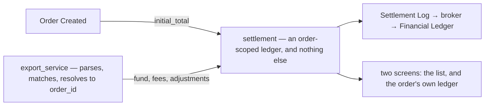
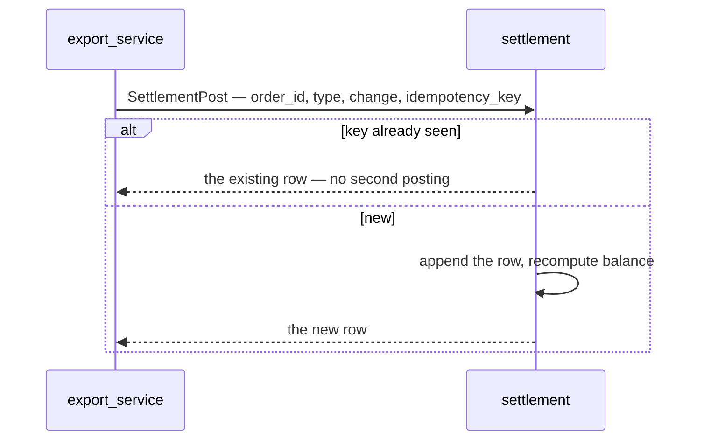
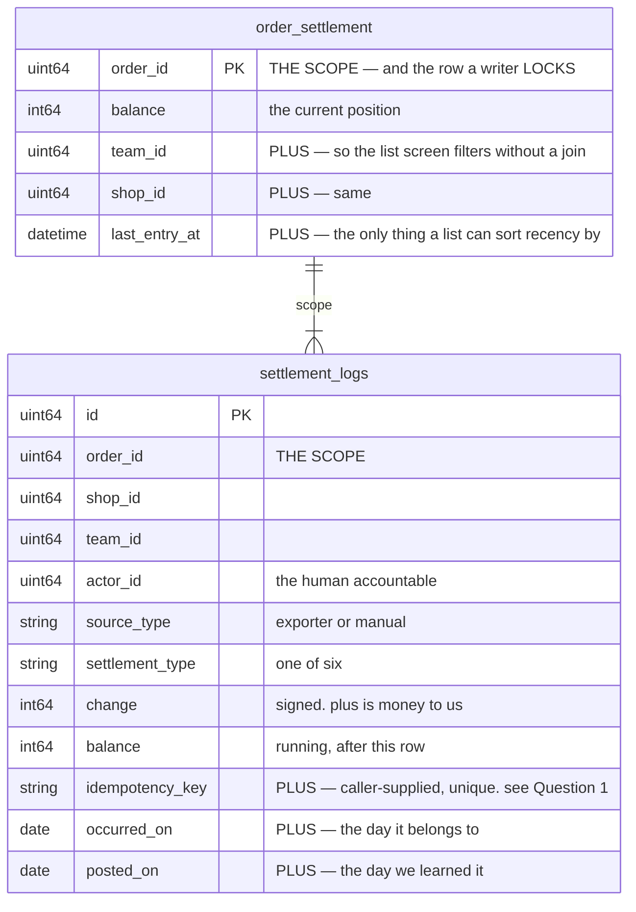
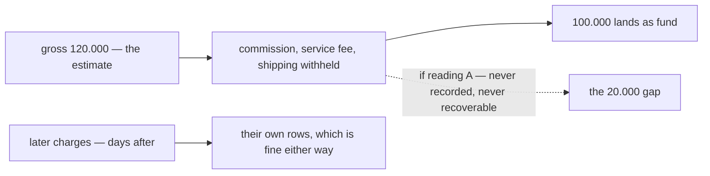
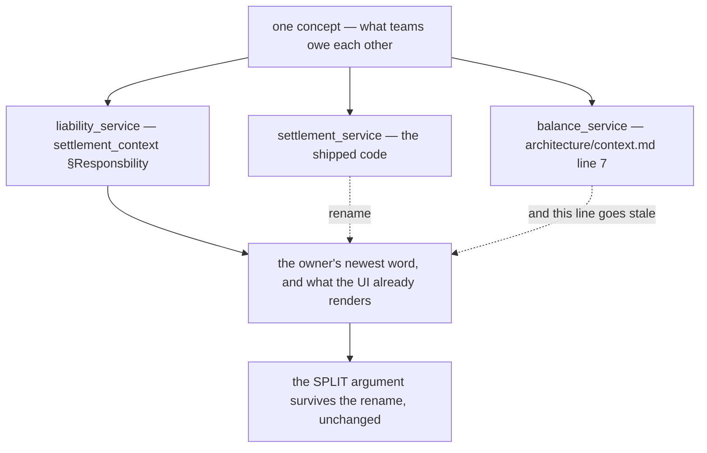

# Clarity — `settlement_context.md`

What I read out of [settlement_context.md](./context.md), and what has to be settled before a screen
can exist. **That doc is yours — this one is mine.** Answered points are **deleted**, so this file is
always the current open set.

> **Re-examined after the `fund` clause and §Settlement State.** Two more recorded:
>
> | § | what it settled | recorded as |
> | --- | --- | --- |
> | Shapes 2, `fund` | *"its not net, platform still charge in other day sometimes"* — no single row is ever "the payout" | [fund-is-not-the-final-figure](./context_decision.md#fund-is-not-the-final-figure) |
> | §Settlement State | the state-plus-log shape, state table named `order_settlement` | [the-state-table-is-order-settlement](./context_decision.md#the-state-table-is-order-settlement) |
>
> **`fund` being "not net" is the same idea as [a-residual-balance-is-normal](./context_decision.md#a-residual-balance-is-normal),
> one level down.** Not only does the *account* never close — the *payout* is not a single event either.
> A screen labelling `fund` as "what we got paid for this order" is wrong on any order with later
> charges, which `§3` says is most of them.
>
> ⚠ **It narrows my commission question rather than closing it.** *"Not net"* answers **when**; it does
> not say what is already deducted **inside** `fund` — and the worked example still shows `+100.000`
> against a `−120.000` estimate with no row for the missing 20.000. That is
> [Question 3](#question), now answerable in one sentence.
>
> ⚠ **Still the blocker:** a row posted twice can never be removed (only offset), and
> [a-residual-balance-is-normal](./context_decision.md#a-residual-balance-is-normal) guarantees nothing
> will notice it needs offsetting — [Critique 1](#critique).

Siblings: [order_context](../order/context_clarify.md) · [ledger_context](../ledger/context_clarify.md) ·
[architecture_context](../../technical/architecture/context_clarify.md).
Decisions: [context_decision.md](./context_decision.md).

---

## Proposed Design

### What settlement is now

Brief 3 shrank it to something much easier to build and much easier to describe.

| settlement owns | `export_service` owns |
| --- | --- |
| the log, the running balance, the six types | the file and its evidence |
| `initial_total` from order creation | the per-marketplace parser |
| the write API, and its idempotency | matching a platform ref to an `order_id` |
| the two read screens | the unmatched tray |

### The rules, named

> **Sixteen are decided** and live in [context_decision.md](./context_decision.md) — one of them ⛔
> reversed. Everything below is still a proposal.

#### an-account-never-closes
*"its also still happen other fee in next day"* (`§3`), and
[a-residual-balance-is-normal](./context_decision.md#a-residual-balance-is-normal) makes it explicit: a
row can arrive at any time, and the account has **no terminal state**.

⚠ **Two things follow that are easy to get wrong.** There is no "settled" flag driven by `balance = 0` —
nothing would ever be settled. And there is no worklist of non-zero balances — it would contain almost
every order.

#### two-dates-occurred-and-posted
§Settlement Behaviors has one `At` column, and `§3` says fees arrive the next day — so that column is
doing two jobs.

| | |
| --- | --- |
| `occurred_on` | the day the platform says the charge belongs to |
| `posted_on` | the day we learned it |

Reports read `occurred_on`, reconciliation reads `posted_on`, and a late fee is visible as exactly that
— the gap between them. Without the split, a fee arriving on the 2nd for the 31st either corrupts a
closed month or silently lands in the wrong one. There is precedent: `ExpenseRecord.occurred_at` is
already *"the day the money BELONGS to"*, deliberately separate from `created_at`.

#### the-caller-supplies-the-idempotency-key
**The rule Brief 3 forces.** Settlement no longer sees the file, so it cannot dedupe on a line
reference. Its write RPC therefore takes a caller-supplied **`idempotency_key`**, unique per row, and
refuses a repeat silently-successfully.

Without it, a statement imported twice doubles every fee, and **nothing downstream would notice** —
[a-residual-balance-is-normal](./context_decision.md#a-residual-balance-is-normal) means a wrong balance
looks exactly like a right one. That is why this is the blocker and not a detail.

#### one-copy-of-the-estimate-is-authoritative
⚠ **Renamed** — the old `estimate-and-actual-never-merge` is settled: settlement holds both sides on
purpose, and the balance between them is the point. What is left is the **duplication**, which the
glosses made worse rather than better. Three rows now hold the same estimate:

| | holds | who owns it |
| --- | --- | --- |
| `order.marketplace_total` | what the storefront took | selling_service |
| ~~`order_revenues.revenue`~~ | ⛔ retired by [settlement-owns-revenue](./context_decision.md#settlement-owns-revenue) | — |
| `initial_total` | *"estimated revenue marketplace platform total"* | settlement_service |

**→ Recommend:** `order.marketplace_total` is **authoritative** and `initial_total` is a **verbatim
frozen copy** taken at creation, never re-read. Retiring `revenue_service` removed the third copy, so
only two remain — and under
[a-correction-is-a-new-row](./context_decision.md#a-correction-is-a-new-row) settlement could not move
its copy even if it wanted to. See [Critique 8](#critique).

#### withheld-is-not-spent
`§2` lists *"shipping cost, ads fee, platform fee"* — two already have a home
(`order.shipping_cost`, `EXPENSE_KIND_ADS`). The dividing line is the **mechanism**, not the category:

| | it is | goes to |
| --- | --- | --- |
| money that **left our bank** — an ads top-up we paid | an **expense** | `expense_service` |
| money the platform **withheld** before paying out | a **settlement row** | `settlement_service` |

⚠ `external_ads_fee` is the second kind. So `EXPENSE_KIND_ADS` must only ever hold ads we *paid for*,
never ads the platform *withheld* — otherwise the same ad money is in both books.

### The schema

Your field list, plus the three columns it needs to be operable. Added marked **+**.

**`shop_id` and `team_id` are denormalised on purpose.** Both derive from `order_id`, and both are here
anyway: every screen filters by shop or team, and a ledger that had to join `orders` to answer *"what
did this shop net in January"* would join on every read. Frozen copies, like `order.cogs` — an order
does not move between shops.

### The screens — frontend-first (HARD RULE 6)

Down from six to two, because [importing-is-not-settlements-job](./context_decision.md#importing-is-not-settlements-job)
took the other four.

| screen | who opens it | the one question it answers |
| --- | --- | --- |
| `/settlement` | selling manager | per shop: which orders drifted furthest from face value |
| order detail, a new panel | a manager on the order | **the running ledger itself** — your §Settlement Behaviors table, rendered, with **Add entry** and a per-row **Reverse** ([Critique 7](#critique)) |

⚠ `/settlement` and `/settlement/:counterpartyId` are currently the superseded liability pages
(`router.tsx:275-276`), deleted by
[the-name-settlement-moves-to-the-payout](./context_decision.md#the-name-settlement-moves-to-the-payout).

### The one open fork — what is the 20.000 in your own example?

[Question 3](#question), elaborated. It is a **business** decision, not a schema one, and it cannot be
taken back later.

⚠ **Narrowed, and now answerable in one sentence.** *"its not net, platform still charge in other day
sometimes"* settles **when** — more charges follow — and leaves **what is already deducted inside
`fund`** open. The worked example is where the two readings come apart:

| | | balance |
| --- | --- | --- |
| `initial_total` | − 120.000 | −120.000 |
| `fund` | **+ 100.000** | −20.000 |

**Where did the other 20.000 go?** Three readings, and they are different systems:

| | reading | then commission is |
| --- | --- | --- |
| **A** | the platform paid out **net of its cut** — the 20.000 IS commission, absorbed into `fund` | **unrecordable**, forever |
| **B** | the platform paid **part** and will pay more later — the 20.000 is still coming | recordable, as its own later row |
| **C** | the estimate was simply wrong — a voucher, a partial refund | recordable, as an adjustment |

**→ Recommend deciding A explicitly, because only A is lossy** — and if A is what happens, it is worth
knowing *before* the first order settles rather than the first time somebody asks what Shopee charged us.

⚠ **`external_ads_fee` and `affiliate_fee` ARE itemised.** So the design already accepts that some
deductions deserve their own row — commission is simply not on the list, and it is normally the
**largest** one.

**What becomes unanswerable.** Not edge cases — these are the ordinary questions a marketplace business
asks about itself:

| the question | why it dies |
| --- | --- |
| *"What did the platform take from us this year?"* | the single biggest cost line, never recorded |
| *"Did our commission rate change in March?"* | platforms change rates and tiers without much notice |
| *"Which shop or category has the worst take rate?"* | take rate is `commission ÷ gross`, and commission does not exist |
| *"Was this order short because of commission, a missing shipping subsidy, or an underpayment?"* | all three compress into one gap |

That last one is the operational cost. [a-residual-balance-is-normal](./context_decision.md#a-residual-balance-is-normal)
says an unexplained residual is fine — and it is. But there is a difference between *a small residual we
cannot explain* and *the entire commission unexplained on purpose*, and only the first was decided.

**The options.**

| | | → cost |
| --- | --- | --- |
| **A** | **`fund` net, no commission row** — as written | one row per payout. Commission is gone permanently |
| **B** | **`fund` gross + a `platform_fee` row** | more rows per order. Needs the statement to itemise — which is `export_service`'s problem, deferred |
| **C** | **`fund` net, with `gross` and `fee` as extra columns on the row** | keeps one row per payout and the detail. ⚠ but the `change` column no longer tells the whole story, which is off-pattern for every other ledger here |

**→ Recommend B**, on two arguments that are not about taste:

1. **It is asymmetric.** Net is always computable from gross and fees; fees can never be recovered from
   net. Choosing A discards information that choosing B would let you throw away later at any time.
2. **Producing a net `fund` is probably MORE work, not less.** A marketplace statement generally
   itemises the deductions per order — so the exporter has to read them and **actively sum them away**
   to arrive at one net figure. Recording them as rows is fewer steps and more information.

⚠ **Argument 2 has a precondition worth checking before deciding**: if the statement gives only a single
settlement amount with no breakdown, A is not a choice — it is the only thing possible. That is one look
at a real file, and it is the same look [Question 5](#question) already needs.

**This is a one-way door.** Recording net now and wanting commission later means every order settled
before the change is permanently unexplained — there is no migration that recovers a number nobody
stored.

---

## Critique

| | Problem | → Recommend |
| --- | --- | --- |
| **1** ⛔ | **The suggested `unique_id` recipe COLLIDES — provably, on this doc's own example.** §Best Effort offers `hash(date + order_ref_id)`. §Settlement Behaviors rows 3 and 4 are **both order 1 on 04-01-2026** — `external_ads_fee −10.000` and `marketplace_adjustment +20.000` — so both hash to the same value and **the second is rejected as a duplicate**. ⚠ **And the rejection is silent by design**: an idempotent write returns success, so the caller sees no error, [a-residual-balance-is-normal](./context_decision.md#a-residual-balance-is-normal) means the wrong balance looks ordinary, and [a-correction-is-a-new-row](./context_decision.md#a-correction-is-a-new-row) means it can never be repaired. A colliding key is **worse than no key**: a missing key gives duplicates somebody might spot, a colliding one gives silent loss nobody can. | **The recipe must include everything that distinguishes two rows on one day** — at minimum the type and the amount: `hash(order_ref_id + date + settlement_type + change)`. Better, whatever line identity the platform does give, even a row number within the file. **Settlement cannot fix this** — the key is generated outside by decision, so this is guidance the exporter and the form must follow, and it belongs in the doc rather than in code. See [Question 1](#question). |
| **2** | **`platform_fee` and `shipping_fee` have no type, though `§2` names both.** Only ads and affiliate are typed; commission and shipping fall into `marketplace_adjustment` or `other`, so *"what did the marketplace take in commission this year"* has no answer — and commission is usually the largest deduction in the business. | **Add `platform_fee` and `shipping_fee`.** The set is append-only, so it is free now and a migration later. ⚠ Unless `fund` is already net of them — [Question 2](#question), and the two are the same question. |
| **3** | **`marketplace_total = 0` means NOT RECORDED, not "worth nothing"** (`order.proto:224` — a phone order has no marketplace figure). Such an order opens at `initial_total = 0`, and every `fund` pushes its balance **positive**, reading as the platform overpaying. | **Do not open an account when `marketplace_total` is 0** — a non-marketplace order has no payout to settle. Same shape as `cost_known` on `order_revenues`: zero is both a legitimate value and the unknown marker, so something else must disambiguate. |
| **4** | **The `At` column is one date doing two jobs.** `§3` says fees arrive the next day, so every row has a day it *belongs to* and a day we *learned it*. | **[two-dates-occurred-and-posted](#two-dates-occurred-and-posted).** |
| **5** | **Who writes `initial_total` is unstated, and it is a cross-service write.** It fires on order creation, which is `selling_service`'s event, but the row is settlement's. | **Settlement subscribes to `OrderCreatedEvent`** rather than `selling_service` calling settlement — the event library already exists, and placing an order should not fail because settlement is down. ⚠ Then `initial_total` needs the same idempotency as everything else: a redelivered event must not double the claim. See [Question 3](#question). |
| **6** ⛔ | **A person can type an arbitrary signed amount into a ledger nothing checks, and no policy says who or what.** §What Frontend Expected gives a human a form on the order page. `source_type = manual` records *that* it happened; nothing constrains **which types** — a manual `initial_total` rewrites the claim, a manual `fund` invents money we never received — or **who** may do it. `RevenueList` is manager-gated because customer service *"has no business reading the margin"*; this is the same money, being **written**. | **A role policy AND a type whitelist.** Manual entry is `marketplace_adjustment` and `other` only — `initial_total` is the system's, `fund` and the fee types are the platform's word, not ours. Roles: the same set that may read revenue, never customer service. See [Question 2](#question). |
| **7** | **The form will make people ask for a delete button.** [a-correction-is-a-new-row](./context_decision.md#a-correction-is-a-new-row) settles the rule; a create form that looks ordinary still invites *"just remove it"*. Enforcing append-only in the API and not showing it in the UI is how a support request becomes a schema argument. | **A per-row Reverse action** posting the negation with the same type and a link to the row it undoes — and the form saying plainly that entries cannot be edited. `SettlementPaymentReverse` on the shipped liability service is the precedent. |
| **8** | **Retiring `revenue_service` silently changes what `/revenue`, `/profit` and `/daily-statement` show.** [settlement-owns-revenue](./context_decision.md#settlement-owns-revenue) is right — it was always the same subscription freezing the same fact twice — but it is **not a rename**. `order_revenues.revenue` was `order.total`; `initial_total` is `order.marketplace_total`. Different fields, different values. And `marketplace_total = 0` means *not recorded*, so every phone order reports **zero revenue** where `order.total` always had a figure. | **`marketplace_total`, falling back to `order.total` when it is 0**, with the screen naming which it used. Margin still works because `order.cogs` is frozen on the order: **true margin = `balance + marketplace_total − cogs`**, which is a number `revenue_service` could never produce. See [Question 4](#question). |

---

## Question

1. **Will you change the `unique_id` recipe? `hash(date + order_ref_id)` collides on your own example.**
   ([Critique 1](#critique)) Rows 3 and 4 of §Settlement Behaviors are both order 1 on 04-01-2026, so
   they produce one key and the second row is silently dropped. **This is the blocker**, and it is a
   one-line fix to a sentence, not a design change.
   **→ I recommend `hash(order_ref_id + date + settlement_type + change)` as the documented minimum**,
   and any real line identity the platform gives in preference to a hash at all.
2. **Which `settlement_type`s may a PERSON post, and which roles may post them?**
   ([Critique 6](#critique)) The form exists; the constraints do not.
   **→ I recommend `marketplace_adjustment` and `other` only, restricted to the roles that may read
   revenue** — `initial_total` is the system's, and `fund` and the fee types are the platform's word
   rather than ours.
3. **In your worked example, what is the 20.000 that never becomes a row?**
   ([The one open fork](#the-one-open-fork--what-is-the-20000-in-your-own-example))
   *"its not net, platform still charge in other day sometimes"* answers **when**, not **what is already
   inside `fund`**. If the answer is *"the platform took its cut"*, marketplace commission is
   unrecordable forever — and it is normally the largest deduction in the business.
   **→ I recommend a `platform_fee` type, and `fund` recorded before the platform's cut.** Net is always
   computable from gross plus fees; fees can never be recovered from net. If you would rather absorb it,
   say so and I will stop asking — but no later migration can recover a number nobody stored.
4. **`initial_total` uses `marketplace_total`, which the retired `revenue_service` did NOT — so three
   money screens change what they show.** ([Critique 8](#critique))
   [settlement-owns-revenue](./context_decision.md#settlement-owns-revenue) retires `revenue_service`,
   but `order_revenues.revenue` was `order.total` (*subtotal + shipping*) while `initial_total` is
   `order.marketplace_total` (*what the storefront took, after platform vouchers*). Different fields,
   different values — and `marketplace_total = 0` means **not recorded**, so a phone order would report
   **zero revenue** where `order.total` always had a figure.
   **→ I recommend `marketplace_total` with a fallback to `order.total` when it is 0**, and the screen
   saying which it used. Retiring the service is right; silently changing every historical revenue
   figure while doing it is not.
5. **What does `order_settlement` hold besides `balance`?**
   ([the-state-table-is-order-settlement](./context_decision.md#the-state-table-is-order-settlement))
   The table is named and its columns are not. One obvious candidate is already excluded:
   [a-residual-balance-is-normal](./context_decision.md#a-residual-balance-is-normal) rules out a
   settled/unsettled status, because nothing would ever be settled.
   **→ I recommend `order_id`, `balance`, `team_id`, `shop_id`, `last_entry_at` — and nothing derived
   that a screen could compute.** Every extra stored column is a second thing the writer must keep in
   step with the log, and the log is the source of truth. ⚠ The list screen still needs *something* to
   sort and filter on; if drift-from-estimate is the answer, that is `balance` and needs no column.
6. **Does settlement SUBSCRIBE to order creation, or does `selling_service` call it?**
   ([Critique 5](#critique))
   **→ I recommend subscribe** — placing an order should not fail because settlement is down.
7. **Is `order_id` ever NULL?** Your example attaches even the ads fee to an order, so I read it as
   never. A subscription fee or a withdrawal genuinely has no order, though.
   **→ I recommend NOT NULL** — anything unattributable is `export_service`'s problem to resolve before
   it reaches settlement.
8. **Where does a platform WITHDRAWAL live?** Wallet to bank, naming no order — so it is not one of the
   six types. [architecture Q7](../../technical/architecture/context_clarify.md#question) asks the same
   thing.
   **→ I recommend answering it once, in the architecture clarify, and having settlement follow.**
9. **Is `problem funding` from `§2` the same as `marketplace_adjustment`?** Your example uses that type
   for a *reimbursement*, which is what I would call problem funding.
   **→ I recommend yes, one type covers both** — but if it is a claim WE file rather than one the
   platform pays unprompted, it needs a screen to file it from.

---

# Contradiction

## the field settlement computes from is documented as the one field nothing computes from

> `settlement_context.md` §Settlement Behaviors row 1 — *"On Order Created (write opposite from
> `order_marketplace_total`)"*
>
> `order.proto:216` — *"What this order SOLD FOR on the marketplace — **a NOTE, and nothing computes
> from it** (owner)."*
> `order.proto:226` — *"⚠ **Never add it to margin or revenue.**"*

**Which line I think is wrong.** The proto comment, but only **half** of it. Line 226's ⚠ is still
correct and must stay — `marketplace_total` must never enter margin or revenue, and settlement does not
put it there. What has gone stale is *"nothing computes from it"*: settlement now opens every account
from it, which makes it **load-bearing**. A field nobody reads can be blank, mistyped or edited later
without consequence. This one cannot.

**→ RECOMMEND** amend `order.proto` in the same change that adds `initial_total`: keep the ⚠, replace
"nothing computes from it" with what now does, and say it is **frozen at creation** for settlement. What
stops this recurring is naming the property: **a comment asserting that nothing reads a field goes stale
the moment a service is added, so it should name the readers rather than claim there are none.**

## one concept, three service names, and each is written down as authoritative

> `settlement_context.md` §Responsbility 1 — *"for owe and balance across teams, its
> **`liability_service`**"*
>
> `architecture/context.md:7` — *"**`balance_service`**, mirrored pair rows, debt threshold, **the
> gate**, payments between teams"*
>
> shipped: `backend/services/settlement_service/` — holds `settlement_balances`, `settlement_terms`,
> `settlement_payments`

**All three describe the same thing.** "Mirrored pair rows" is `settlement_balances`, "debt threshold"
is `settlement_terms`, "payments between teams" is `settlement_payments`.
[architecture_context_clarify](../../technical/architecture/context_clarify.md) currently proposes
**splitting** the shipped service into a `balance_service` it believes does not exist yet.

**Which line I think is wrong.** `architecture/context.md:7`. §Responsbility is the newer decision and
the frontend already renders "Liability"/"Kewajiban".

⚠ **But it is not only a name.** The architecture clarify splits that box for a *reason* — a gate must be
synchronous while a book may lag. Renaming settles the noun and leaves that argument untouched.

⚠ **`export_service` now has the same problem in advance.** Brief 3 names it, and
`architecture/context.md` does not list it at all — so it is a service named in one doc and absent from
the one that is supposed to name services.

**→ RECOMMEND** `liability_service` everywhere, and add `export_service` to
`architecture/context.md` when you come back to it. What stops this recurring is naming the property:
**a service is named once, in `architecture/context.md`, and every other doc links to that line instead
of restating it** — three docs each naming the same box independently is what produced three names.

---

# Awaiting

- **No currency, rounding or percentage rule.** Every money field here is whole rupiah `int64`, and
  platform fees are quoted as percentages — so the rounding is frozen at write and never revisited.
- **`export_service` is named and nowhere described.** Brief 3 defers it, which is fine — but settlement's
  write contract is the seam between them, which is why [Question 1](#question) cannot wait for it.
- **No `status` in the row shape.** With [a-residual-balance-is-normal](./context_decision.md#a-residual-balance-is-normal)
  I no longer think one is needed — but the list screen still has to sort and filter by *something*, and
  "drift from face value" is the only candidate. Worth confirming that is the intended reading.
- **Nothing says what a NEGATIVE order looks like.** A full refund would drive `fund` negative or post a
  large `marketplace_adjustment`; whether that is a settlement concern or a returns concern is unstated.
