# Decisions — `settlement_context.md`

What the owner settled, recorded before it is acted on. **Append-only** — a decision that is later
reversed is renamed and its references grepped (RULE 12), never quietly edited away.

| decision | what it decided |
| --- | --- |
| [the-name-settlement-moves-to-the-payout](#the-name-settlement-moves-to-the-payout) | `settlement_service` is the ORDER settlement; owe-and-balance across teams is `liability_service` |
| [the-grain-is-the-order](#the-grain-is-the-order) | the settlement ledger's scope is `order_id` — one account per order |
| ~~[every-marketplace-order-carries-a-unique-platform-ref](#every-marketplace-order-carries-a-unique-platform-ref)~~ | ⛔ **REVERSED** by [settlement-keys-on-our-order-id](#settlement-keys-on-our-order-id) — not in force |
| [settlement-publishes-to-the-book](#settlement-publishes-to-the-book) | `settlement_entries` IS the `Settlement Log` — it publishes to the broker and the Financial Ledger projects from it |
| [the-account-opens-at-order-creation](#the-account-opens-at-order-creation) | the first entry is `initial_total`, the marketplace total with the sign flipped, written when the order is created |
| [the-log-is-order-scoped-with-six-types](#the-log-is-order-scoped-with-six-types) | the row carries the order, its shop and its team; `settlement_type` is a closed list of six |
| [settlement-keys-on-our-order-id](#settlement-keys-on-our-order-id) | settlement uses our internal `order_id` and never sees the platform's reference |
| [importing-is-not-settlements-job](#importing-is-not-settlements-job) | file import, matching and the unmatched tray belong to `export_service` — settlement is a ledger with a write API |
| [a-residual-balance-is-normal](#a-residual-balance-is-normal) | the balance does NOT reach zero, and that is expected — it is a VARIANCE, not a receivable |
| [settlement-ignores-our-order-status](#settlement-ignores-our-order-status) | nothing is gated on `OrderStatus`; a row can post anytime |
| [entries-arrive-by-api-or-by-hand](#entries-arrive-by-api-or-by-hand) | two write paths — the exporter's API and a person on the order detail page — and `source_type` records which |
| [every-entry-names-its-actor](#every-entry-names-its-actor) | `actor_id` on every row: a human is accountable for every entry, including API ones |
| [a-correction-is-a-new-row](#a-correction-is-a-new-row) | append-only — no edit, no delete. A mistake is offset by a further row |
| [initial-total-is-an-estimate-and-fund-is-what-we-actually-got](#initial-total-is-an-estimate-and-fund-is-what-we-actually-got) | the two core types are an ESTIMATE and a REALISATION. ⚠ its "`fund` is net" reading is **narrowed** by [fund-is-not-the-final-figure](#fund-is-not-the-final-figure) |
| [actor-id-is-the-pic](#actor-id-is-the-pic) | `actor_id` is the person in charge, not the session that wrote the row |
| [settlement-owns-revenue](#settlement-owns-revenue) | `revenue_service` is RETIRED — order revenue, expected and actual, is settlement's |
| [fund-is-not-the-final-figure](#fund-is-not-the-final-figure) | `fund` is what arrived that day, not the payout — the platform keeps charging afterwards |
| [the-state-table-is-order-settlement](#the-state-table-is-order-settlement) | the state-plus-log shape, with the state table named `order_settlement`, scoped by `order_id`. ⚠ columns and plural name superseded below |
| [the-unique-id-is-generated-outside-settlement](#the-unique-id-is-generated-outside-settlement) | `unique_id`, unique with `order_id`, generated by the CALLER — settlement never invents one |
| [the-state-holds-initial-total-and-last-balance](#the-state-holds-initial-total-and-last-balance) | `order_settlements` holds `order_id`, `initial_total`, `last_balance` |
| [the-recipe-is-the-callers-problem](#the-recipe-is-the-callers-problem) | how a `unique_id` is derived is OUTSIDE settlement — it enforces uniqueness and nothing more |
| [no-role-policy-yet](#no-role-policy-yet) | role design deferred. ⚠ **ANSWERED** by [the-write-set-is-cs-and-up](#the-write-set-is-cs-and-up) — the policy is no longer deferred |
| [hidden-cost-is-left-in-the-balance](#hidden-cost-is-left-in-the-balance) | the unexplained gap is hidden platform cost the platform never itemises — it stays in the balance, and the balance IS that measure |
| [marketplace-total-is-a-fact-not-an-estimate](#marketplace-total-is-a-fact-not-an-estimate) | `marketplace_total` is what the buyer actually paid. The ESTIMATE is the expectation that it will all reach us — so the balance is literally the platform's take |
| [order-detail-manages-the-ledger](#order-detail-manages-the-ledger) | the order page MANAGES settlement — read, add, reverse — as a third tab. ⚠ widens the verbs, not the guarantees: append-only stands |
| [the-write-set-is-cs-and-up](#the-write-set-is-cs-and-up) | `[ROOT, ADMIN, TEAM_OWNER, TEAM_ADMIN, TEAM_CUSTOMER_SERVICE]` scoped on `team_id` — answers [no-role-policy-yet](#no-role-policy-yet)s liveness ⚠ |
| [initial-total-is-postable-by-cs-and-owners](#initial-total-is-postable-by-cs-and-owners) | the sale figure IS hand-postable — by root, admin, team_owner and CS, never team_admin. ⚠ REVERSES the clarifys Q2, and the account vetoes the role when one already exists |
| [design-accepted](#design-accepted) | ✅ the gate is PASSED — the prototype is the design `implementation` builds against |
| [order-service-calls-settlement](#order-service-calls-settlement) | `order_service` CALLS settlement on create and on cancel. ⛔ REVERSES the clarifys Q4 — it is not a subscription |
| [a-cancel-is-an-opposite-row](#a-cancel-is-an-opposite-row) | a cancel posts `initial_total_cancel`, the exact opposite of `initial_total` — a SEVENTH type. ⚠ it breaks `net received` |
| [cancel-zeroes-the-live-sale](#cancel-zeroes-the-live-sale) | `order_settlements.initial_total` holds the LIVE sale — the cancel row zeroes it. Closes the `net received` break above |
| [revenue-service-is-removed-and-statistics-deferred](#revenue-service-is-removed-and-statistics-deferred) | `revenue_service` is DELETED and its statistics deferred — `/revenue` and `/profit` go, `/statement` becomes warehouse-only, and the order events keep publishing with no consumer |
| [initial-total-is-stored-positive](#initial-total-is-stored-positive) | `order_settlements.initial_total` stores the sale POSITIVE — the log's `change` stays negative, and the projection holds the only sign flip |
| [every-entry-names-an-order](#every-entry-names-an-order) | `order_id` is NOT NULL on both tables — an unattributable cost never reaches settlement |
| [the-cancel-key-is-order-plus-act-date](#the-cancel-key-is-order-plus-act-date) | a cancel's `unique_id` is `hash(order_id + act_date + "cancel")` — derived from the ACT date, so a retry is absorbed |
| [only-machines-post-the-cancel](#only-machines-post-the-cancel) | `initial_total_cancel` is machine-only — `manualTypesFor` stays at six types |
| [the-third-source-is-order](#the-third-source-is-order) | `source_type` has THREE values — `order_service` writes as `order`, so the cancel rule is enforceable by the data |

---

## the-name-settlement-moves-to-the-payout

> `settlement_context.md` §Responsbility 1 — *"Its cover order settlement, for owe and balance across
> teams, its `liability_service`"*

**The verdict.** The word `settlement` belongs to the **marketplace payout**. The shipped service that
records **what teams owe each other** is renamed **`liability_service`**.

This is what the frontend already assumed: `nav.settlement` renders as **"Liability" / "Kewajiban"**
(`en.json:30`, `id.json:30`), the nav points at `/liability` (`nav.ts:137`), and `/settlement` is
documented in `router.tsx:275-276` as the *old* page kept reachable. The rename is the Go and the proto
catching up with a decision the UI made.

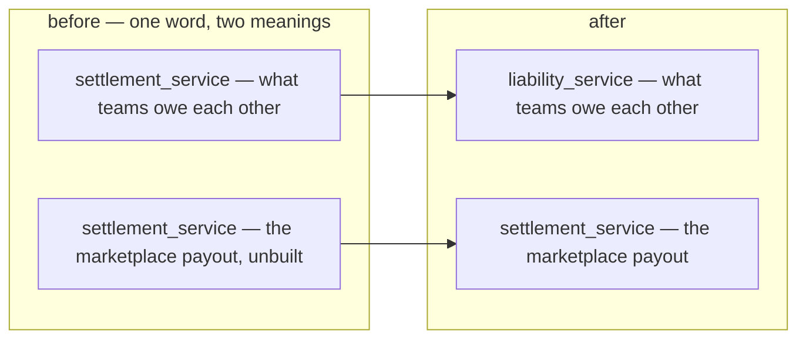

### The spec — what renames to what

| | from | to |
| --- | --- | --- |
| folder | `backend/services/settlement_service/` | `backend/services/liability_service/` |
| handler package | `settlement_v1/` | `liability_v1/` |
| models package | `settlement_service_models/` | `liability_service_models/` |
| proto dir + package | `proto/warehouse/settlement/v1/` · `warehouse.settlement.v1` | `proto/warehouse/liability/v1/` · `warehouse.liability.v1` |
| proto services | `SettlementService`, `SettlementPaymentService`, `SettlementTermsService` | `LiabilityService`, `LiabilityPaymentService`, `LiabilityTermsService` |
| the 9 RPCs | `SettlementPositionList`, `SettlementEntryList`, `SettlementDaily`, `SettlementPayment{Record,Confirm,Reverse,List}`, `SettlementTerms{List,Set,Delete}` | the same names with `Settlement` → `Liability` |
| tables | `settlement_entries`, `settlement_balances`, `settlement_payments`, `settlement_terms` | `liability_*` — a new migration in the renamed service, since `<service>_version` moves too |
| goose version table | `settlement_service_version` | `liability_service_version` |
| frontend | `features/settlement/` | `features/liability/` |
| routes | `/settlement`, `/settlement/:counterpartyId` | **deleted** — `/liability` and `/liability/:counterpartyId` already exist and the nav already points at them |
| i18n keys | `nav.settlement`, `settlement.*` | `nav.liability`, `liability.*` — the rendered STRINGS ("Liability"/"Kewajiban") do not change |

⚠ **The freed name is then taken by the new service**, so the rename must land *before* any
`warehouse.settlement.v1` file is written for the payout. Two things called settlement in one
checkout, even briefly, is how the wrong one gets imported.

⚠ **`/settlement` and `/settlement/:counterpartyId` are deleted, not renamed.** They are the superseded
pages kept reachable during the #221/#222 redesign; the new payout screens want those exact paths.

---

## the-grain-is-the-order

> `settlement_context.md` §General Brief 1 — *"its order grain."*

**The verdict.** The settlement ledger's **scope is `order_id`**. One account per order, following the
scope rule in [mutation_and_ledger](../../technical/ledger/mutation_and_ledger.md) — *"scope is use
smallest grain to track ledger balance"*.

This closes the two-scope proposal that was open in the clarify file: there is **one state table**, not
two, and the shop wallet is not a settlement state.

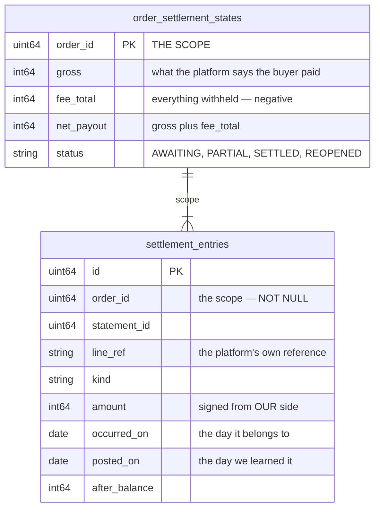

### What the grain forces

| | |
| --- | --- |
| `order_id` is **NOT NULL** on every entry | there is no other scope to post to |
| a statement line with no order **cannot be posted at all** | so the unmatched tray is not a convenience — it is the only place such a line can exist until a person resolves it |
| the shop wallet balance is **derived, not stored** | it is a reconciliation query, not a ledger state |
| **a shop-level charge — ads, subscription — has no scope** | see the open question below |

⚠ **This decision has one unresolved consequence.** `settlement_context.md` §2 names *"ads fee"* among
what an order can be charged, but a marketplace bills ads to the **shop**, not to an order. Under order
grain that charge has nowhere to post. It is the open question in
[context_clarify.md](./context_clarify.md#question) and is not settled by this entry.

> ⏭ **Superseded by [the-log-is-order-scoped-with-six-types](#the-log-is-order-scoped-with-six-types).**
> §Settlement Behaviors shows `external_ads_fee` attached to an ORDER, so in this model an ads fee names
> an order like any other charge. Only a narrow residual remains — whether `order_id` is ever null.
> Left standing above because this file is append-only.

---

## every-marketplace-order-carries-a-unique-platform-ref

> ⛔ **REVERSED — NOT IN FORCE.** Superseded by
> [settlement-keys-on-our-order-id](#settlement-keys-on-our-order-id): the owner removed
> `order_external_ref_id` from both §General Brief and the ledger's field list, and settlement now keys
> on our internal `order_id`. Kept below because this file is append-only. **Do not build from it.**

> `settlement_context.md` §General Brief 2 — *"`order_external_ref_id` become MANDATORY and UNIQUE per
> shop for marketplace orders"* — **this line has since been deleted from the doc.**

**The verdict.** `Order.order_external_ref_id` stops being an optional note and becomes the **join key**.
It is required for any order on a marketplace shop, and unique within that shop.

This is what makes [the-grain-is-the-order](#the-grain-is-the-order) workable at all: `order_id` is the
only scope a settlement entry has, so a statement line that cannot find its order cannot be posted. It
also closes `§1`'s *"we record that twice in our system"* from the other end — **a duplicate becomes
impossible to create**, rather than something to detect afterwards.

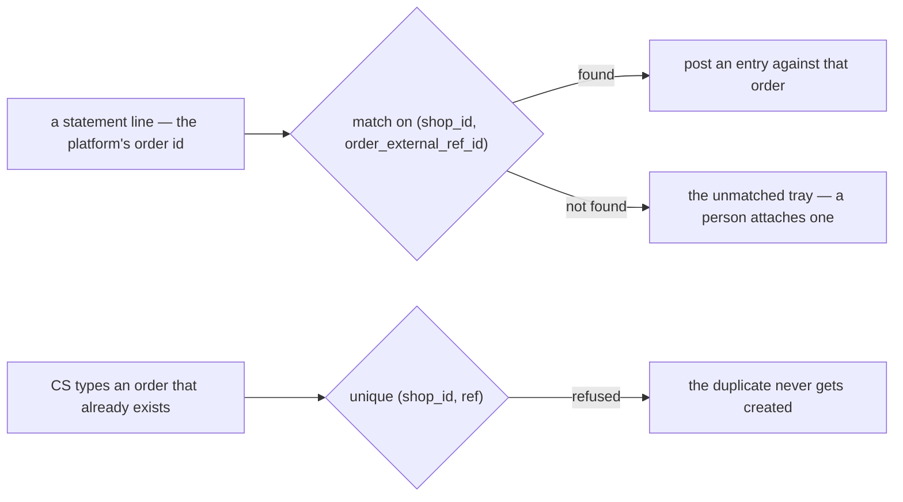

### The spec

| | |
| --- | --- |
| required when | the order's shop has a `Marketplace` — mandatory there, `""` still allowed for a phone order |
| unique on | `(shop_id, order_external_ref_id)` — a **partial** unique index, `WHERE order_external_ref_id <> ''`, so phone orders do not collide with each other |
| enforced where | a **handler check** in `OrderCreate`, not `buf.validate` — the rule depends on the shop's marketplace, which a field constraint cannot look up. A blanket `min_len: 1` would break phone orders |
| the draft path | `OrderDraft.external_id` already carries the platform's id and is unique on `(team_id, source, external_id)`. Promoting a draft **copies it into** `order_external_ref_id` — the two must not diverge |
| the form | the field becomes required-with-an-asterisk on the order form when a marketplace shop is picked, and optional otherwise |
| existing rows | orders already written with `""` stay legal — the partial index tolerates them. ⚠ **They can never be settled**, because nothing can match them. That is honest, not a migration to write |

⚠ **The field belongs to [order_context](../order/context.md)** — recorded here because settlement is
what forced it. `OrderCreateRequest`, the order form, the draft-promote path and the e2e seeds all
change with it.

---

## settlement-publishes-to-the-book

> `settlement_context.md` §General Brief 3 — *"we have `Settlement Log` part of `ledger_context` and it
> publish to the broker and post to the Financial Ledger"*

**The verdict.** `settlement_entries` **is** the `Settlement Log` in
[ledger_context.md](../ledger/context.md)'s first box. Settlement is a first-class money source: it
writes its log inside its own transaction, publishes, and the Financial Ledger projects from the event.

**This is where real revenue finally enters the book.** Until now the only thing an order produced was
a frozen estimate that `order_context.md:150` explicitly keeps out of the ledger.

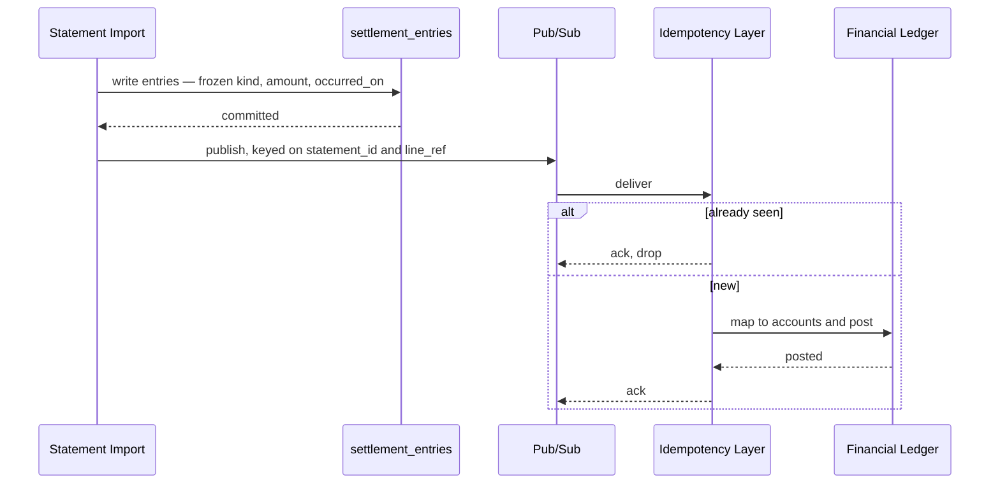

### The spec

| | |
| --- | --- |
| the log | `settlement_entries` — append only. A correction is a compensating entry, never an update |
| write order | entry first, inside settlement's own transaction, **then** publish — `every-source-writes-a-log-first` |
| the only path in | the broker. The ledger never reads settlement's tables — `the-broker-is-the-only-path-in` |
| what the event carries | the **frozen money**: `kind`, `amount`, `occurred_on`, `posted_on`, `order_id`. Settlement freezes the amounts; the ledger consumer decides the accounts — `log-carries-the-frozen-money` + `event-processing-owns-the-mapping` |
| the topic | declared on the event message via `warehouse.event_base.v1.event_config`, never named by the publisher |
| idempotency key | `(statement_id, line_ref)` — the same natural key that makes a re-import a no-op, so both layers dedupe on one fact |
| the DLQ | **required** on the push subscription. A dead-lettered settlement event is not a lost notification — it is a permanently wrong book, and no screen will show it as missing |
| reconciliation | settlement is one of the logs the daily reconciler compares against the projected book |

⚠ **The ledger cannot refuse this.** `ledger_context.md:4` makes the book a downstream projection, so
settlement must be right on its own — nothing downstream will catch a bad entry.

⚠ **This does not give settlement a gate.** It publishes; it never blocks. The debt threshold lives in
`liability_service` and has nothing to do with a payout.

---

## the-account-opens-at-order-creation

> `settlement_context.md` §Settlement Behaviors — row 1: `initial_total`, **− 120.000**, *"On Order
> Created (write opposite from `order_marketplace_total`)"*; row 2: `fund`, **+ 100.000**, *"On Order
> Completed"*.

**The verdict.** A settlement account is opened by the **order**, not by the statement. The first entry
is `initial_total` — the marketplace total with its sign **flipped** — so the account starts at what the
platform owes us, and every later entry works that number down.

This makes settlement a **receivable ledger**: the opening entry is the claim, and everything after it
is the platform paying, charging or correcting against that claim.

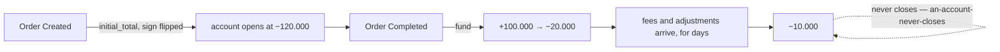

### The spec

| | |
| --- | --- |
| the opening entry | `settlement_type = initial_total`, `change = −order.marketplace_total` |
| when | on order creation — **not** on the statement, and not on `COMPLETED` |
| what feeds it | `Order.marketplace_total`, verbatim, sign flipped |
| the second entry | `fund`, positive, when the platform pays out |
| the balance | running, `balance = previous + change`, carried on every row |
| closing | there is none — [an-account-never-closes](./context_clarify.md#an-account-never-closes) still holds, and §3 is why |

⚠ **Settlement now has TWO write paths, not one.** `initial_total` is written by an order event;
everything else arrives from a statement import. `a-statement-is-imported-never-typed` describes the
second path only, and the first one needs its own trigger, its own idempotency and its own failure
story.

⚠ **`marketplace_total = 0` means NOT RECORDED, not "worth nothing"** (`order.proto:224`). An order taken
over the phone has no marketplace figure, so it would open at 0 and every `fund` would push the balance
positive. That case needs a rule — see [context_clarify.md](./context_clarify.md#question).

⚠ **This reverses `order.proto:226`.** That comment says *"⚠ Never add it to margin or revenue"* and
*"nothing computes from it"* — and now something does. See the contradiction in
[context_clarify.md](./context_clarify.md#contradiction).

---

## the-log-is-order-scoped-with-six-types

> `settlement_context.md` §Settlement Log Ledger Shapes — the field list and the `settlement_type` set.

**The verdict.** One row per movement, carrying the order **and** the shop **and** the team, with a
closed six-value type.

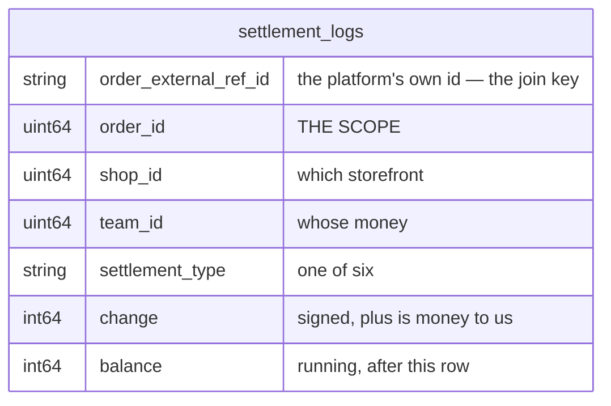

### The types

| type | sign in practice | what it is |
| --- | --- | --- |
| `initial_total` | − | the claim, opened at order creation |
| `fund` | + | the platform paid out |
| `external_ads_fee` | − | ads charged against this order |
| `affiliate_fee` | − | an affiliate's cut of this order |
| `marketplace_adjustment` | ± | a reimbursement or a clawback — the example uses it for one |
| `other` | ± | so nothing is unrecordable while the set is young |

**`shop_id` and `team_id` are denormalised onto the row on purpose.** Both are derivable from
`order_id`, and both are here anyway: every settlement screen filters by shop or by team, and a ledger
that had to join to `orders` to answer *"what did this shop net in January"* would join on every read.
They are frozen copies, like `order.cogs` — an order does not move between shops.

⚠ **`external_ads_fee` is shown attached to an ORDER** in §Settlement Behaviors. That is what closes
the shop-level-charge fork — in this model an ads fee names an order like any other charge. The residual
question is whether `order_id` is ever null; see [context_clarify.md](./context_clarify.md#question).

⚠ **No `platform_fee` and no `shipping_fee` in the list**, although §2 names both. They would have to be
`marketplace_adjustment` or `other`, which makes *"what did the marketplace take in commission"*
unanswerable. Raised as a critique, not applied.

⚠ **No idempotency key in the field list.** Nothing identifies the statement line a row came from, so a
re-imported file double-posts. Raised as a critique.

---

## settlement-keys-on-our-order-id

> `settlement_context.md` §Settlement Log Ledger Shapes — `order_external_ref_id` **removed** from the
> field list; §Settlement Behaviors — the `Ref` column replaced by **`Order ID`**, holding `1`;
> §General Brief — the line requiring a mandatory, unique platform ref **deleted**.

**The verdict.** Settlement is keyed on **our internal `order_id`** and never sees the platform's own
reference. Whoever imports a statement resolves the platform ref to an `order_id` first and hands
settlement an already-resolved order.

> ⛔ **THIS REVERSES [every-marketplace-order-carries-a-unique-platform-ref](#every-marketplace-order-carries-a-unique-platform-ref).**
> That entry stands above because this file is append-only — **it is no longer in force.** Its rename
> obligation (RULE 12) is discharged here rather than by editing it.
>
> ⚠ **It is reversed as a SETTLEMENT decision only.** Whether `Order.order_external_ref_id` should still
> be mandatory and unique is now purely an [order_context](../order/context.md) question, and settlement
> no longer forces it either way.

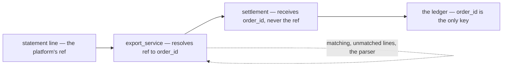

**What leaves settlement with it:** the match, the unmatched tray, and every failure mode of matching.
Settlement gets a resolved order or nothing.

---

## importing-is-not-settlements-job

> `settlement_context.md` §General Brief 3 — *"this `settlement_service` not covered automatic importing
> file. its `export_service` responsbility [defer for now, talk later]"*

**The verdict.** Settlement is a **ledger with a write API**, not an importer. File parsing, per-
marketplace formats, matching and the unmatched tray all belong to `export_service`, which is deferred.

This is a large simplification. Removed from settlement's scope:

| leaves settlement | goes to |
| --- | --- |
| `settlement_statements` — the file, the evidence, the stated-vs-parsed check | `export_service` |
| `settlement_unmatched_lines` — the tray | `export_service` |
| the per-marketplace parser adapter | `export_service` |
| `/settlement/import`, `/settlement/statements/:id`, `/settlement/unmatched` | `export_service` |

**What settlement keeps:** the log, the running balance, the six types, and the screens that read them.

⚠ **This creates settlement's real open question.** A ledger fed by someone else needs an
**idempotency key it does not own** — the same file imported twice must not double-post, and settlement
can no longer dedupe on a line reference it never sees. See
[context_clarify.md](./context_clarify.md#question).

---

## a-residual-balance-is-normal

> `settlement_context.md` §General Brief 4 — *"in many case settlement balance doesn't fully settle,
> always any urecorded adjustment for the order, its come from the platform and its okay."*

**The verdict.** An order's balance **does not reach zero**, and a residual is expected rather than an
error. The platform makes adjustments we never see, and that is accepted.

**This settles what the `balance` column MEANS.** It is a **variance** — how far this order drifted from
its face value — not a receivable to be chased. A non-zero balance is the normal end state, so no screen
should present one as an exception, a dunning list, or something a person must clear.

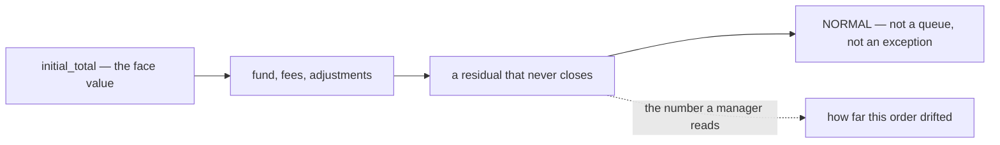

### What this forbids

| | |
| --- | --- |
| a "settled / unsettled" flag driven by `balance = 0` | nothing would ever be settled |
| an alert, badge or worklist on a non-zero balance | it would fire on almost every order |
| reconciling an order to zero by hand | the missing amount is not knowable to us |

⚠ **It also closes the ambiguity I raised** — that a shortfall and an accepted fee move the balance
identically. They do, and under this decision it does not matter, **because nobody acts on the
difference.** The residual open question is narrow: is there any drift large enough to be worth looking
at? See [context_clarify.md](./context_clarify.md#question).

---

## settlement-ignores-our-order-status

> `settlement_context.md` §General Brief 5 — *"Settlement doesn't rely on our order status. its can be
> happen anytime."*

**The verdict.** No settlement row is gated on an `OrderStatus`. A payout, a fee or an adjustment posts
whenever the platform produces it — including before the warehouse has shipped, and long after.

✅ **This resolves the `COMPLETED` contradiction.** `OrderStatus` ends at `SHIPPED` and has no
`COMPLETED`, and settlement was the thing that appeared to need it. It does not. §Settlement Behaviors'
*"On Order Completed"* therefore reads as **the platform completed it** — the payout arrived — not as a
status of ours.

⚠ **`COMPLETED` and `PROBLEM` are still missing from `OrderStatus`** while `order_context.md` draws
both. That is now purely an [order_context](../order/context.md) matter — settlement no longer forces it,
and the contradiction moves out of settlement's clarify.

⚠ **One dependency survives, and it is not a status.** `initial_total` is written *on order creation*,
which is an event, not a status transition. So settlement depends on the order **existing**, never on
where it has got to.

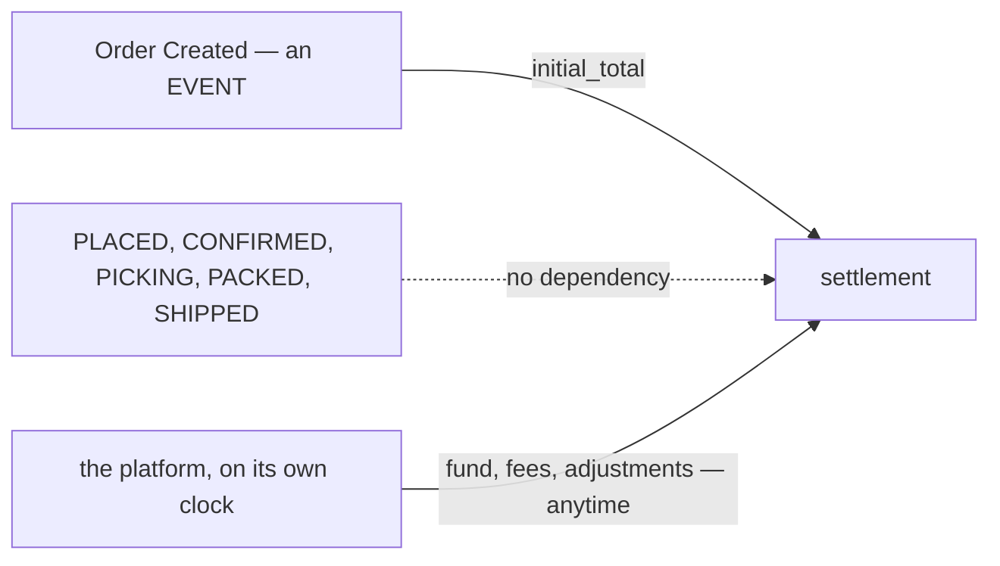

---

## entries-arrive-by-api-or-by-hand

> `settlement_context.md` §What External Service expected — *"settlement can call by api to settlement
> entry"* · §What Frontend Expected — *"User can Manually add settlement entry from order detail page"*
> · §Shapes 3 — `source_type`: *"by external service, `exporter`, or by manual in frontend, `manual`"*

**The verdict.** Settlement has **exactly two write paths**, and every row records which one it came
from. There is no third — a row is written by the exporter over the API, or by a person on the order
detail page.

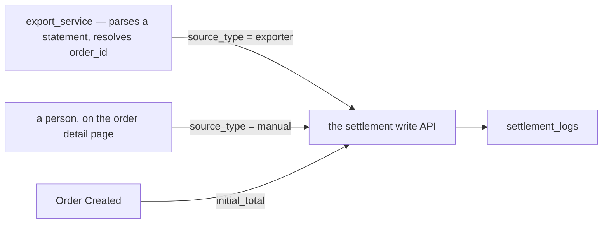

### The spec

| | |
| --- | --- |
| the API path | `source_type = exporter`. Called by `export_service` — deferred, but the contract is settlement's and exists now |
| the manual path | `source_type = manual`. A form on the order detail page, beside the ledger it appends to |
| `initial_total` | written on order creation — see [Question 3](./context_clarify.md#question) for whether that is a third source or one of these two |
| append-only | a manual mistake is corrected by a **compensating entry**, never an edit or a delete. The form must make that obvious, or people will ask for a delete button |

⚠ **This is a person typing an arbitrary signed amount into a ledger that publishes to the Financial
Ledger.** `source_type` records *that* it was manual; it does not constrain **who** may do it or **which
types** they may write. Both are open — see [context_clarify.md](./context_clarify.md#question).

---

## every-entry-names-its-actor

> `settlement_context.md` §Shapes 4 — *"`actor_id` is who create the entry"*

**The verdict.** Every settlement row carries `actor_id` — the person accountable for it. Not nullable,
including on rows written over the API.

This matches the rule `order_drafts` already set: *"There is no machine identity in this system and this
feature does not invent one, so every draft has a human accountable on it."* An exporter run therefore
posts under the login it runs as, and `actor_id` is never a system sentinel.

| `source_type` | `actor_id` is |
| --- | --- |
| `manual` | the person who filled the form |
| `exporter` | the person whose login the exporter runs under |
| `initial_total` | ⚠ nobody typed it — see [Question 3](./context_clarify.md#question) |

⚠ **`initial_total` is the one row no human causes.** It fires on order creation, so the honest
candidates are the person who placed the order, or a rule that this one type is exempt. It cannot be
left unset without making the column nullable and therefore unenforceable everywhere else.

---

## a-correction-is-a-new-row

> `settlement_context.md` §General Brief 6 — *"settlement just can adjustment by added record log, not
> updated the log."*

**The verdict.** The log is **append-only**. Nothing updates a row and nothing deletes one — an
adjustment is a **new row**, and that includes fixing our own mistakes.

✅ This confirms what the ledger template already required and what the shipped liability service already
does (`SettlementPaymentReverse` posts a compensating entry rather than editing).

### What it forces on the UI

| | |
| --- | --- |
| no Edit, no Delete | on any settlement row, ever |
| a per-row **Reverse** action | posts the negation, same `settlement_type`, `source_type = manual` |
| the form must SAY so | a create form that looks ordinary invites *"just delete it"* — the screen has to make the append-only rule visible, not just enforce it |

⚠ **This makes the duplicate problem permanent.** A row posted twice cannot be removed — only offset by
a third row. Combined with
[a-residual-balance-is-normal](#a-residual-balance-is-normal), a duplicate is both undetectable and
unremovable, which is why the idempotency key is the blocker and not a nicety. See
[context_clarify.md](./context_clarify.md#question).

---

## initial-total-is-an-estimate-and-fund-is-what-we-actually-got

> `settlement_context.md` §Shapes 2 — `initial_total`, *"its estimated revenue marketplace platform
> total"* · `fund`, *"its real revenue we get, usualy after customer received the order"*

**The verdict.** The two core types are an **estimate** and a **realisation**, and the ledger's whole job
is to hold the distance between them.

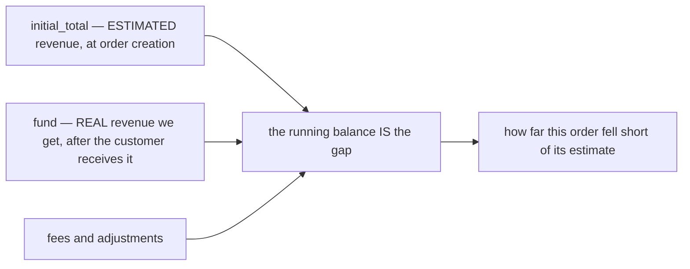

This is what makes [a-residual-balance-is-normal](#a-residual-balance-is-normal) coherent rather than
sloppy: you cannot "fully settle" against an **estimate**, so a residual is the expected outcome by
construction, not a failure to collect.

### Two consequences that are not obvious

**1. `fund` is NET.** *"real revenue we get"* is the money that actually arrives, so marketplace
commission is already deducted inside it. There is therefore **no `platform_fee` row and no way to
report commission** — §2 names *"platform fee"* as something that happens, and this ledger cannot show
it. Accepted or not, that is a decision; see [context_clarify.md](./context_clarify.md#question).

> ⏭ **NARROWED by [fund-is-not-the-final-figure](#fund-is-not-the-final-figure).** The gloss has since
> gained *"its not net, platform still charge in other day sometimes"*. That settles **when** — more
> charges follow — and leaves **what is already deducted inside `fund`** open. Read point 1 above as the
> question it raised, not as a settled answer. Left standing because this file is append-only.

**2. `revenue_service` loses its stated reason to exist.** Its own proto says the record exists as *"a
HOME FOR #76 — settlement compares what we expected against what the payout actually was, and 'actual'
has nowhere to live without a row beside it."* Settlement now holds **both sides**, so that argument no
longer applies. What survives is `cogs` and `expected_margin` — a margin record, which is a different
job from a revenue estimate. See [context_clarify.md](./context_clarify.md#question).

---

## actor-id-is-the-pic

> `settlement_context.md` §Shapes 4 — *"`actor_id` is who create the entry, its pic"*

**The verdict.** `actor_id` is the **person in charge** of the entry — the human answerable for it, not
merely whichever session happened to write the row.

| `source_type` | the PIC is |
| --- | --- |
| `manual` | the person who filled the form |
| `exporter` | the person whose login the exporter runs under — no machine identity, matching the rule `order_drafts` already set |
| `initial_total` | ⚠ nobody filled a form. The order's own PIC is the only honest candidate |

⚠ **`initial_total` still needs a rule.** It fires on order creation, so the person accountable is
whoever placed the order. Naming them keeps the column NOT NULL; exempting this one type makes it
nullable, and a nullable accountability column is unenforceable everywhere else.

---

## settlement-owns-revenue

> Owner, in chat: *"revenue service is stale, its actualy settlement_service job."*

**The verdict.** `revenue_service` is **retired**. Order revenue — expected and actual — is
settlement's, and there is no second service holding a copy.

**It was already the same mechanism.** `revenue_service` subscribes to `OrderPlacedEvent` and freezes
the order's money into `order_revenues`; `initial_total` subscribes to order creation and freezes the
order's money into the settlement log. One subscription, one fact, two tables.

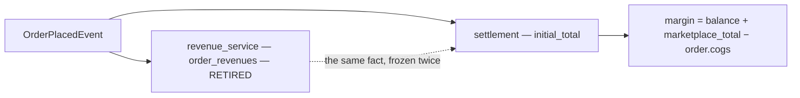

### Where each thing goes

| `revenue_service` held | now |
| --- | --- |
| `revenue` — what we expected | **`initial_total`**, already |
| the actual payout — it never had one | **`fund` + fees**, already |
| `cogs` | **`order.cogs`** — frozen on the order at placement, so settlement reads it and stores nothing |
| `expected_margin` | derived: `marketplace_total − order.cogs` |
| **true margin** — it could never compute this | derived: **`balance + marketplace_total − order.cogs`** |
| `voided` — a cancelled order stops counting | under [a-correction-is-a-new-row](#a-correction-is-a-new-row) a cancel posts a **reversing row** against `initial_total`, taking the balance to 0. A cancelled order is then worth nothing *by arithmetic*, with no flag to keep in sync |
| `RevenueRecord` | gone — the subscription writes `initial_total` |
| `RevenueList`, `RevenueDaily` | settlement RPCs |
| `RevenueVoid` | a compensating row |

**Why the true-margin formula works.** Net received is everything except the opening estimate, so
`net = balance − initial_total = balance + marketplace_total`. On the worked example:
`−10.000 + 120.000 = 110.000`, which is `100 − 10 + 20`. ✓

### What to delete

`backend/services/revenue_service/`, `proto/warehouse/revenue/v1/`, `order_revenues` and its two
migrations, the two push subscriptions, and the frontend's `pages/revenue/queries.ts`,
`pages/profit/queries.ts`, `pages/daily-statement/queries.ts` re-pointed at settlement.

⚠ **THIS CHANGES THE NUMBER ON THREE EXISTING SCREENS, and that is not a rename.**
`order_revenues.revenue` was `order.total` — *subtotal + shipping*. `initial_total` is
`order.marketplace_total` — *what the storefront actually took*, after the platform's vouchers and
subsidies. **They are different fields with different values**, so `/revenue`, `/profit` and
`/daily-statement` will all show different figures afterwards.

⚠ **And `marketplace_total = 0` means "not recorded"** (`order.proto:224`). Every phone order, and every
order placed before that field was filled in, would report **zero revenue** rather than unknown — where
`order.total` always had a value. That is the same hole as
[context_clarify.md Critique 3](./context_clarify.md#critique), and retiring `revenue_service` makes it
load-bearing for the whole revenue report rather than for settlement alone.

---

## fund-is-not-the-final-figure

> `settlement_context.md` §Shapes 2 — `fund`, *"its real revenue we get, usualy after customer received
> the order, **its not net, platform still charge in other day sometimes**"*

**The verdict.** `fund` is **not a settlement figure**. It is the money that arrived on that day, and
the platform keeps charging afterwards — so no single row is ever "the payout".

This is the same shape as [a-residual-balance-is-normal](#a-residual-balance-is-normal), stated one level
down: not only does the *account* never close, the *payout itself* is not a single event. A screen that
labels `fund` as "what we got paid for this order" is wrong on any order that has later charges — which
`§3` says is most of them.

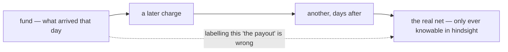

⚠ **It does NOT settle whether commission is inside `fund`.** *"Not net"* answers **when** — more comes
later — and leaves **what is already deducted** open. The worked example still shows `fund +100.000`
against a `−120.000` estimate with **no row explaining the 20.000**, which is exactly the gap this
phrase was reached for. See [context_clarify.md](./context_clarify.md#question).

---

## the-state-table-is-order-settlement

> `settlement_context.md` §Settlement State — *"We have settlement state, we called `order_settlement`"*

**The verdict.** Settlement follows the state-plus-log shape from
[mutation_and_ledger](../../technical/ledger/mutation_and_ledger.md): the log is the settlement log, and
the state table is **`order_settlement`**, scoped by `order_id`.

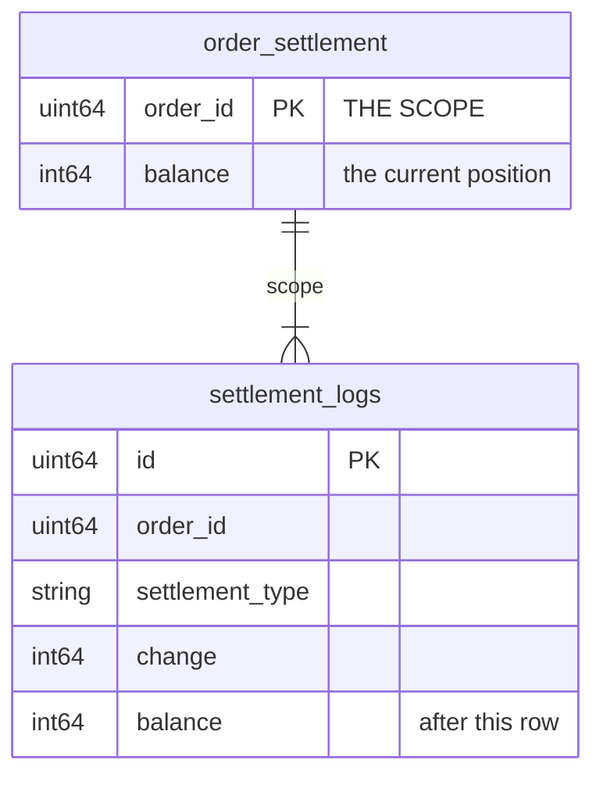

**Why it exists, and it is not for reading speed.** Per the template, *"service that implemented that
design cannot change the State without log recorded in Ledger Log"* — the state is the row a writer
**locks**. Two posts against one order in the same second (the exporter importing while a person types
an adjustment by hand) would otherwise both read the same running balance and both write it, losing one.
`order_settlement` is what serialises them.

⚠ **Its columns are not stated.** `balance` is certain. Everything else is open — and one candidate is
already excluded: [a-residual-balance-is-normal](#a-residual-balance-is-normal) rules out a
settled/unsettled status, because nothing would ever be settled. See
[context_clarify.md](./context_clarify.md#question).

---

## the-unique-id-is-generated-outside-settlement

> `settlement_context.md` §Shapes 1 — *"`unique_id`, string type, custom idempotency key with
> `order_id`"* · §Idempotency Key — *"we must set `unique_id` in outside `settlement_service`, so
> exporter and manual can decide how they generate `unique_id`"*

**The verdict.** Every row carries a **`unique_id`**, unique together with `order_id`, and the **caller**
generates it. Settlement refuses a repeat and never invents a key of its own.

✅ This is the right shape, and the reasoning in §The Problem is the reason: there are two write paths and
no marketplace supplies a usable key, so the only party that can produce a stable identity is the one
that saw the source.

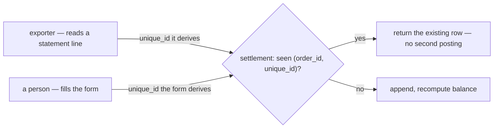

### The spec

| | |
| --- | --- |
| uniqueness | `(order_id, unique_id)` — a database constraint, not an application check |
| who generates it | the caller, always. Settlement neither generates nor validates the recipe |
| a repeat | returns the existing row **successfully** — a retry must be safe, not an error |
| storage | `string`, so any caller's scheme fits without settlement knowing it |

⚠ **The example recipe `hash(date + order_ref_id)` COLLIDES on this doc's own worked example.** Rows 3
and 4 are both order 1 on 04-01-2026 — `external_ads_fee −10.000` and `marketplace_adjustment
+20.000` — so both hash to the same value and **the second is silently dropped**. This is not a flaw in
the decision; it is a flaw in the suggested recipe. See
[context_clarify.md](./context_clarify.md#critique).

⚠ **Cross-path dedupe is impossible by construction, and that is fine to accept — but should be
accepted knowingly.** If the exporter and a person both record the same real fee, they generate
different `unique_id`s and both rows post. Only a shared recipe would prevent it, and a shared recipe is
exactly what §Best Effort declines.

---

## the-state-holds-initial-total-and-last-balance

> `settlement_context.md` §Settlement State — *"`order_settlements`. it has: `order_id`,
> `initial_total`, `last_balance`"*

**The verdict.** The state table is **`order_settlements`**, scoped by `order_id`, holding the opening
estimate and the current position.

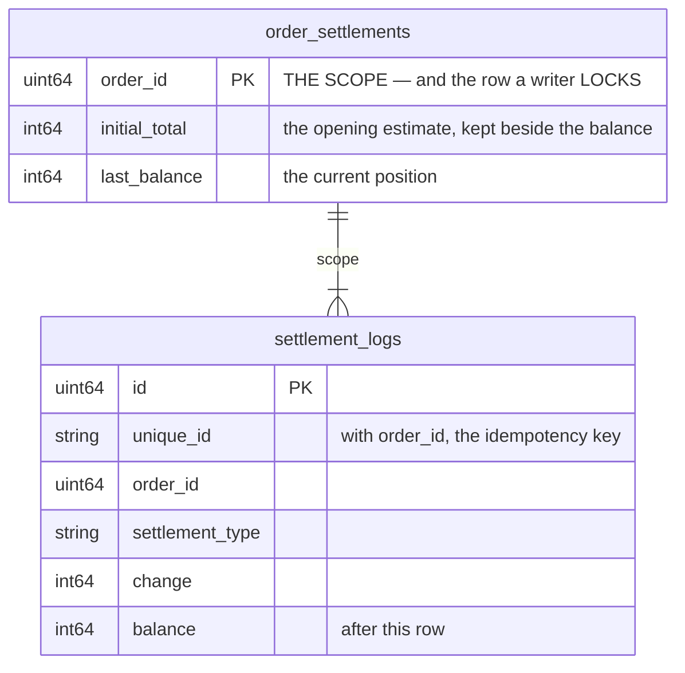

**Keeping `initial_total` beside the balance is the good part.** It makes the number every screen
actually wants a **single-row read**:

```
net actually received  =  last_balance + initial_total
true margin            =  last_balance + initial_total − order.cogs
```

On the worked example: `−10.000 + 120.000 = 110.000`, which is `100 − 10 + 20`. ✓ Without the column
that answer needs a scan of the log for one row of a particular type.

**It is also the row a writer locks** — per
[mutation_and_ledger](../../technical/ledger/mutation_and_ledger.md), the state cannot change without a
log row, so two concurrent posts against one order serialise here rather than both reading the same
running balance.

⚠ **The sign of `initial_total` is not stated**, and it flips the formula. The log's `change` is
**negative**; the column is named after the positive estimate. Both readings are defensible and only one
is right. See [context_clarify.md](./context_clarify.md#question).

⚠ **No `team_id` or `shop_id` on the state**, though both are on the log. A per-shop list therefore joins
to `orders` or to the log on every read — see [context_clarify.md](./context_clarify.md#critique).

⚠ **Named `order_settlements` here, `order_settlement` in the previous revision.** Plural is the
convention every other table in this system follows, so plural is right.

---

## the-recipe-is-the-callers-problem

> Owner, in chat: *"dont mind about how hashing, its outside responsbility"*

**The verdict.** How a `unique_id` is derived is **outside `settlement_service`**. Settlement enforces
that `(order_id, unique_id)` is unique and nothing more — it does not specify a recipe, validate one, or
carry guidance about one.

This closes the recipe critique and the question under it. The exporter and the manual form each own
their scheme, and a bad scheme is a bug in the caller, not in settlement.

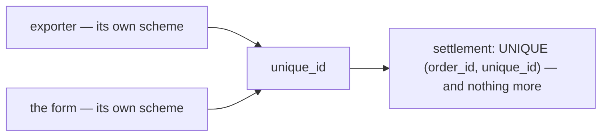

### What stays settlement's, and is worth being deliberate about

| | |
| --- | --- |
| the constraint | `UNIQUE (order_id, unique_id)` in the database, not an application check |
| the **response** | a repeat must be distinguishable from a write — see below |

⚠ **One thing does remain inside the boundary: what a repeat RETURNS.** If a duplicate key returns the
existing row with no signal, the caller cannot tell *"already recorded"* from *"recorded just now"* —
so a caller whose scheme is colliding gets no feedback, and
[a-residual-balance-is-normal](#a-residual-balance-is-normal) means no screen will show it either. A
`created` / `already_existed` flag on the response costs one field and lets a caller detect its own bug.
That is settlement's API contract, not a recipe.

---

## no-role-policy-yet

> `settlement_context.md` §Access Role — *"for now, there is no specific role for this service. [defer
> later]."*

**The verdict.** Settlement gets no service-specific role design in this pass. Deferred.

⚠ **BUT "no policy" IS NOT A BUILDABLE STATE IN THIS SYSTEM.** `CLAUDE.md:648` — *"A message with no
policy is DENIED. Deny by default."* The access interceptor reads `request_policy` off the request
message by reflection; a message without one is refused. So deferring the *design* is fine, and shipping
an RPC with *no* `request_policy` means **nobody can call it at all** — not "everybody can".

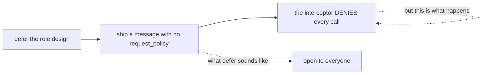

**→ RECOMMEND a placeholder that is deliberately narrow, not absent.** The deferral is about the
*design*, so borrow the one that already exists for the same money: `RevenueList`'s set —
**ROOT, ADMIN, TEAM_OWNER, TEAM_ADMIN** — scoped on `team_id` with `use_scope`.

| | |
| --- | --- |
| why that set | it is the existing answer to *"who may see this order's money"*, and settlement is the same money |
| why NARROW rather than wide | **widening later is safe; narrowing later takes away access people already use.** A placeholder that is too generous becomes permanent by habit |
| ⚠ the scope trap | a team-level role on a message with no `use_scope` field is evaluated against the ROOT team and becomes a dead letter (`CLAUDE.md`). `team_id` is already on the row — it must carry `use_scope` on the request too |

⚠ **This decision does NOT answer the other half of the question.** Which `settlement_type`s a person
may post is about **types, not roles**, and is untouched by §Access Role — see
[context_clarify.md](./context_clarify.md#question).

---

## hidden-cost-is-left-in-the-balance

> Owner, in chat, on *"why 100 and not 120?"*: *"its normally any hidden cost, we cant record and leave
> it"*

**The verdict.** The gap between `initial_total` and what actually arrives is **hidden platform cost**.
The platform does not itemise it, so there is nothing to record — and it is deliberately **left in the
balance** rather than forced into a row.

✅ **This closes the commission argument.** My case for a `platform_fee` type assumed the statement
itemises the deduction and we were choosing to discard it. It does not. **You cannot record a number
nobody gives you**, and inventing a row for it would be worse: a made-up split reads as fact.

### What this makes the `balance` — and it is better than "variance"

The residual is not noise and not a failure to collect. It is **the only measure we have of what the
platform takes without telling us**.

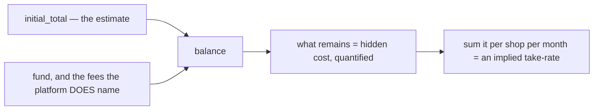

| | |
| --- | --- |
| an order at `−10.000` | the platform took 10.000 we cannot itemise |
| summed per shop per month | **the closest thing to a take-rate this system can produce** |
| compared across marketplaces | *"which platform is actually cheapest to sell on"*, answered indirectly |

**So the number I argued was being lost is not lost — it is the balance itself**, at a coarser grain.
`external_ads_fee` and `affiliate_fee` get their own rows precisely because the platform *does* name
those; everything it hides stays aggregated, which is the most honest place for it.

### What follows

| | |
| --- | --- |
| **name it on screen** | the balance is *hidden cost*, not "outstanding" or "unpaid". A label implying the platform owes us would be wrong, since nobody is going to collect it |
| **`initial_total` accuracy matters more, not less** | the whole hidden-cost measure is relative to it. A wrong or missing estimate makes the figure meaningless — which is why `marketplace_total = 0` needs a rule |
| **no `platform_fee` type** | there is nothing to put in it |

⚠ **[withheld-is-not-spent](./context_clarify.md#withheld-is-not-spent) gains a third category.** It had
two — withheld is a settlement row, spent is an expense. There is now a third: **withheld but
unknowable**, which is neither, and lives in the balance rather than in any row.

---

## marketplace-total-is-a-fact-not-an-estimate

> Owner, in chat: *"yes marketplace_total is not estimate"*

**The verdict.** `order.marketplace_total` is a **recorded fact** — what the storefront actually took
from the buyer, after the marketplace's own vouchers and subsidies (`order.proto:216-222`). It is not a
prediction and never was.

**What is estimated is the EXPECTATION**, not the number: that the payout will match what the buyer
paid. `initial_total` is a frozen copy of the fact; the estimate lives in the comparison, not in the
column.

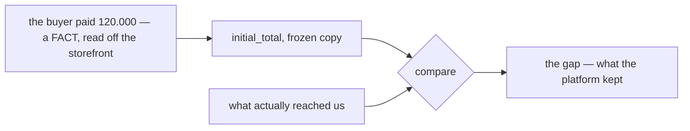

### Why the distinction earns its keep

It makes the balance **sharper**, not just better named. Measured against a fact rather than a guess,
the gap stops being "drift from an estimate" — a fuzzy thing nobody can act on — and becomes exactly:

> **how much of what the buyer paid never reached us.**

Which is the platform's take, literally. `hidden_cost ÷ initial_total` is then a **real take rate**, not
an approximation of one.

### What has to change

| | from | to |
| --- | --- | --- |
| the panel's figure | *"Estimated"* | **"Sold for"** — what the buyer paid |
| the list column | *"Estimated"* | **"Sold for"** |
| the take-rate card | *"% of estimate"* | **"% of sales"** |
| the empty case | *"no estimate recorded"* | **"marketplace total not recorded"** |
| the clarify's rule `one-copy-of-the-estimate-is-authoritative` | calls all three copies "the estimate" | renamed — they are copies of a **fact** |

⚠ **The zero case is unchanged and still open.** `marketplace_total = 0` means *not recorded*
(`order.proto:224`), which is a **missing fact**, not a zero one. Comparing anything against it still
produces fiction, so the screen still refuses to compute.

⚠ **It does NOT make the number authoritative for what we *charged*.** `order.total` is
`subtotal + shipping` — our price. `marketplace_total` is what the storefront took after the platform's
promotions. Both are facts, about different things, and `order.proto:226`'s *"never add it to margin or
revenue"* still holds.

---

## order-detail-manages-the-ledger

**The order detail page is where an order's settlement is MANAGED — not merely where an entry is
added.** (owner, 2026-08-28)

§What Frontend Expected 1 said *"manually add settlement entry from order detail page"*, which is one
verb. The owner's confirmation is the wider one: **manage**. That settles the seat and the verbs, and
it is what the built prototype already assumes.

### What "manage" covers, and where it stops

| | | |
| --- | --- | --- |
| **read** the running ledger | ✅ | every row, its running balance, and the four derived figures |
| **add** an entry | ✅ | §What Frontend Expected 1, verbatim |
| **reverse** a row | ✅ | confirms the recommendation that was Critique 5 — the negation, same type, linked to the row it undoes |
| **edit** a row | ⛔ | [a-correction-is-a-new-row](#a-correction-is-a-new-row). Unchanged — "manage" does not reopen append-only |
| **delete** a row | ⛔ | same |
| **decide WHO may do any of it** | ❓ | still open — [Question 1](./context_clarify.md#question) |
| **type `initial_total`** | ❓ | still open — [Question 2](./context_clarify.md#question) |

⚠ **Manage widens the VERBS, not the guarantees.** Append-only survives it intact: reversing posts a
further row rather than removing one, which is why Reverse is a management action and Delete is not.

### Why the order page and not a settlement screen

The ledger's grain IS the order ([the-grain-is-the-order](#the-grain-is-the-order)), so the order page
is the only screen where the whole account is in scope at once. A person adding a fee is looking at the
order to decide whether the fee is right — the lines, the shipping, what the buyer paid — and none of
that is on a settlement list.

```mermaid
flowchart TD
  subgraph OD["order detail — /orders/:orderId"]
    I["Info — lines, our total, the marketplace total"]
    T["Timeline — what happened to it"]
    S["Settlement — the running ledger"]
  end
  I -. "the same marketplace_total, frozen" .-> S
  S --> A["Add entry — 5 types, direction is a choice"]
  S --> R["Reverse — posts the negation"]
  S --> X["Edit / Delete — never"]
  L["/settlement — which orders drifted furthest"] -->|"a row opens its order"| OD
```

**The two screens are a pair with one direction of travel.** `/settlement` ranks orders by loss and
answers *which order should I look at*; the order page answers *what happened to this one, and what do
I do about it*. Every management verb lives on the second — the list never writes.

### The spec

**A third tab on the order detail page**, after Info and Timeline.

| | |
| --- | --- |
| where | `pages/order-detail/index.tsx`, `Tabs.Trigger value="settlement"` |
| why third | Info is what the order IS and Timeline is what happened to it — both settled by the time money starts arriving. Settlement is the only tab that keeps changing for days afterwards ([a-residual-balance-is-normal](#a-residual-balance-is-normal)) |
| what it renders | the ledger table, the four derived figures, **Add entry**, and a per-row **Reverse** behind the row's overflow menu |
| gating | one prop, `canPost`, resolved from the viewer's role — the single place [Question 1](./context_clarify.md#question)'s answer lands. Reading is never gated: the role gates writing, never looking |

⚠ **Built and previewable now**, but as a SEPARATE shell —
`pages/order-settlement/components/OrderDetailPreview.tsx`, story `Pages/Order Settlement/On Order
Detail`. Info and Timeline in it are the real shipped components; only the settlement tab is invented.
The real page is not touched until `design_accept`, because a fixture-fed ledger on `/orders/:orderId`
would show invented money on real orders. **On acceptance the tab moves into the real page and the
preview shell is deleted.**

---

## the-write-set-is-cs-and-up

**`[ROOT, ADMIN, TEAM_OWNER, TEAM_ADMIN, TEAM_CUSTOMER_SERVICE]`, scoped on `team_id`.** (owner,
2026-08-28)

Answers [no-role-policy-yet](#no-role-policy-yet)'s ⚠, which was not a design question but a
liveness one: `CLAUDE.md:648` — *a message with no policy is DENIED* — means deferring the policy
ships a service nobody can call.

```proto
message SettlementEntryCreateRequest {
  option (warehouse.role_base.v1.request_policy) = {
    roles: [
      ROLE_ROOT, ROLE_ADMIN, ROLE_TEAM_OWNER, ROLE_TEAM_ADMIN, ROLE_TEAM_CUSTOMER_SERVICE
    ]
  };
  uint64 team_id = 1 [(warehouse.role_base.v1.use_scope) = true];
}
```

**CS is IN the write set**, which is the owner's addition to the recommended four. It is the right
call and it follows from who does the work: CS is the seat that talks to the marketplace, chases a
missing payout and learns about a fee — so a design that let CS *see* the gap but not *record* it
would route every entry through a manager who knows less about it.

⚠ **`use_scope` on `team_id` is not optional.** Four of the five are TEAM-LEVEL roles, and
`CLAUDE.md` is explicit that a team-level role on a message with no scope field is evaluated against
the root team — where almost nobody is a member. Those entries become dead letters: the proto claims
something the system does not do.

---

## initial-total-is-postable-by-cs-and-owners

**`initial_total` MAY be typed by hand — by root, admin, team_owner and CS. Not by team_admin.**
(owner, 2026-08-28)

⚠ **This REVERSES the recommendation in the clarify's Question 2** (*"never, by anyone"*). Recorded
as a reversal rather than quietly dropped, per RULE 12.

**Why the owner is right and the recommendation was wrong.** The proposal assumed the sale figure is
always machine-derived, so a hand-typed one could only be a duplicate. It is not always derived:
`marketplace_total = 0` means **not recorded** (`order.proto:224`), and a phone order never has one.
Banning it left those accounts permanently uncomputable with no way to fix them — the screen refusing
to show a loss forever, and nobody able to do anything about it.

**Why CS and not team_admin.** The split reads oddly against seniority until you ask who *knows the
number*: authoring what the buyer paid is the **marketplace relationship**, which is CS's, while
`team_admin` is the operational seat that moves orders and never speaks to the platform.

| role | five ordinary types | `initial_total` |
| --- | --- | --- |
| root · admin · team_owner | ✅ | ✅ |
| **customer_service** | ✅ | ✅ |
| **team_admin** | ✅ | ⛔ |

### ⚠ The permission is only half the gate

A second `initial_total` is **not a correction — it is an addition.** The row is an ordinary ledger
entry, and `UNIQUE (order_id, unique_id)` cannot see that two rows mean the same sale, so posting one
where the automatic row already landed **doubles it**:

```mermaid
flowchart TD
  A["order created — initial_total −120.000 (automatic)"] --> B["balance −120.000"]
  B --> C{"a person posts initial_total −120.000 again"}
  C -->|"no second gate"| D["balance −240.000 — reads as catastrophic loss"]
  C -->|"the gate"| E["the type is not offered at all"]
```

So the type is offered only when **both** hold:

| condition | why |
| --- | --- |
| the role may author a sale | it is the marketplace relationship, not operations |
| the account holds **no live `initial_total`** | a second is a duplicate, and append-only makes it permanent |

"Live" means present and not reversed — so the repair path still works: **reverse the wrong one, then
post the right one.** That is the only sequence that can change a sale figure, and it leaves both rows
visible.

⚠ **The server enforces this, not only the form.** A UI that hides the option is a convenience; the
handler must refuse a second live `initial_total` outright, because the write API is open to
`export_service` too.

### Built

`model.ts` → `manualTypesFor(role, settlement)`, `canPostInitialTotal`, `hasLiveInitialTotal`.
Four stories pin it: `TeamAdminCannotAuthorTheSale`, `CustomerServiceMayAuthorTheSale`,
**`SaleAlreadyAuthoredHidesTheType`** (the account vetoing the role) and `TheSaleFigureWarnsLouder`.

---

## design-accepted

**The owner reviewed the Storybook prototype and ACCEPTED it.** (owner, 2026-08-28)

`design_accept` was the blocking gate of `implementation_analysis`. It is passed. The screens, the
proposed contract in `model.ts`, and the recommendations carried into them are the design
`implementation` now builds against.

| accepted | |
| --- | --- |
| `/settlement` | the list, ranked by loss, with the implied take-rate card |
| the order page's third tab | the running ledger — read, add, reverse |
| the manual-entry form | role-aware; direction is two buttons; the sale figure gated twice |
| the contract in `model.ts` | types, the four derived figures, and the recommendations on Q1–Q2 |

**What this unblocks, in order** — the first item is not negotiable:

```mermaid
flowchart LR
  R["1 · rename settlement_service → liability_service"] --> P["2 · payout proto + buf generate"]
  P --> B["3 · migration, models, the 3 RPCs"]
  B --> W["4 · rewire the prototype to the real client"]
  W --> V["5 · retire revenue_service"]
```

⚠ **The rename comes first because the NAME must be free**, not because it is easier. Writing
`warehouse.settlement.v1` for the payout while a `settlement_service` still means liabilities is how
the wrong one gets imported.

---

## order-service-calls-settlement

> `settlement_context.md` §Type `initial_total` and `initial_total_cancel` 1–2 — *"its trigered on order
> created, `order_service` calling --> `settlement_service`"* · *"when order cancel, its create
> `initial_total_cancel` ... `order_service` calling --> `settlement_service`"*

**The verdict.** The order service **CALLS** settlement synchronously. Settlement does **not** subscribe
to an order event.

⛔ **This REVERSES the clarify's Q4**, which recommended a subscription on the grounds that placing an
order should not fail because settlement is down. The owner's arrow is a call, and it is drawn twice —
on create and on cancel — so it is the shape, not a shorthand.

```mermaid
sequenceDiagram
  participant CS as Customer Service
  participant O as order_service
  participant S as settlement_service
  CS->>+O: finalize order
  O->>+S: SettlementPost — initial_total
  S-->>-O: row
  O-->>-CS: order created
  Note over O,S: and again, opposite, on cancel
```

### What the call buys, and what it costs

| | |
| --- | --- |
| ✅ buys | the account **exists the moment the order does** — no window where an order has no settlement row, and no redelivery to de-duplicate |
| ✅ buys | the caller gets the write's outcome, so `unique_id` collisions surface at the order, not in a dead-letter queue |
| ⚠ costs | settlement is now **on the critical path of order creation**. If it is down, the order is down |

⚠ **The cost is real and it is not settled here.** `initial_total` is bookkeeping, not a control — an
order that is genuinely placed on the marketplace has already happened, and refusing to record it because
a ledger is unreachable loses the fact. See [context_clarify.md](./context_clarify.md#question) — what a
failed call should do to the order is the open half.

---

## a-cancel-is-an-opposite-row

> `settlement_context.md` §Shapes 2 — a seventh `settlement_type`, `initial_total_cancel` ·
> §Type 2 — *"when order cancel, its create `initial_total_cancel` and make opposite of `initial_total`"*

**The verdict.** A cancelled order does **not** delete or close its settlement account. It gets one more
row, of a seventh type, carrying the exact opposite of the `initial_total` row. The list of types is now
**seven**, not six.

```mermaid
flowchart LR
  A["order created"] -->|"initial_total  −120.000"| B["balance −120.000"]
  B -->|"order cancelled"| C["initial_total_cancel  +120.000"]
  C --> D["balance 0 — the sale is undone IN THE LOG"]
  D -.->|"and a late fee can still arrive"| E["the account stays open"]
```

**This is consistent with everything already decided** and adds one thing:

| holds | because |
| --- | --- |
| [a-correction-is-a-new-row](#a-correction-is-a-new-row) | a cancel is a correction, and it is a row — not an edit, not a delete |
| [an account never closes](./context_clarify.md#an-account-never-closes) | a cancelled order can still be charged an ads fee the next day, and the account is there to take it |
| [settlement-ignores-our-order-status](#settlement-ignores-our-order-status) | settlement still never READS `OrderStatus` — the order service pushes, settlement does not poll |
| **new** | it supplies the missing half of the repair path in [initial-total-is-postable-by-cs-and-owners](#initial-total-is-postable-by-cs-and-owners): *reverse, then repost*. `initial_total_cancel` **is** the reverse |

⚠ **It breaks the derived figure every screen uses, and that is not a detail.**
`net received = last_balance + initial_total` is only correct while the sale is live:

| | `last_balance` | state `initial_total` | formula says | truth |
| --- | --- | --- | --- | --- |
| created | −120.000 | 120.000 | 0 | 0 ✓ |
| funded | −20.000 | 120.000 | 100.000 | 100.000 ✓ |
| **cancelled** | **0** | **120.000** | **120.000** | **0** ✗ |

A cancelled order reads as having netted the full sale, and it would be the single most profitable order
on the list screen. The fix is one line and it is [asked in the clarify](./context_clarify.md#question).

---

## cancel-zeroes-the-live-sale

> Owner, in chat (2026-08-28), answering [biggest_question.md](../../biggest_question.md) #1: **yes to B.**

**The verdict.** `order_settlements.initial_total` holds the **LIVE** sale, not the historical one. The
`initial_total_cancel` row **zeroes it** in the same write that posts the row.

```mermaid
flowchart LR
  A["initial_total posted"] --> S1["state: initial_total = the sale · last_balance = −sale"]
  S1 --> C["initial_total_cancel posted"]
  C --> S2["state: initial_total = 0 · last_balance = 0"]
  S2 --> L["the LOG still holds both rows — nothing is deleted"]
```

### The spec

| | |
| --- | --- |
| on `initial_total` | state `initial_total` ← the sale figure (sign per [the-state-holds-initial-total-and-last-balance](#the-state-holds-initial-total-and-last-balance)) |
| on `initial_total_cancel` | state `initial_total` ← **0**, in the same transaction as the log row |
| the log | **untouched** — both rows stay, and remain the source of truth |
| the four derived figures | **unchanged, verbatim** — no branch, no flag, no new column |

**It stays a PROJECTION, which is what makes it auditable.** The column is not a hand-maintained number
that can drift from the log — it is recomputable from it, just from *both* initial types rather than one
row:

```
live sale = −Σ(change) over types { initial_total, initial_total_cancel }

live:       −(−120.000)            = 120.000  ✓
cancelled:  −(−120.000 + 120.000)  =       0  ✓
```

### What it fixes

| | option A — keep the historical sale | **B — decided** |
| --- | ---: | ---: |
| `net received = last_balance + initial_total` | 120.000 ✗ | **0** ✓ |
| `hidden cost = initial_total − Σ(fund)` | 120.000 ✗ | **0** ✓ |
| `lost = −last_balance` | 0 ✓ | 0 ✓ |
| rank on `/settlement` | **the shop's most profitable order** ✗ | correctly nothing ✓ |

Under A a cancelled order reported *both* netting the full sale **and** losing the whole sale to hidden
platform cost — two wrong numbers out of one column, and the list screen ranks by exactly those.

### What it also simplifies

✅ **The liveness test becomes a single-column read.**
[initial-total-is-postable-by-cs-and-owners](#initial-total-is-postable-by-cs-and-owners) says the account
vetoes a second sale figure once a live one exists, with *reverse, then repost* as the repair. That test is
now `state.initial_total != 0` — not a sum over log rows — and after a cancel the repost becomes legal with
no special case, because the projection has already gone to zero.

⚠ **This supersedes the shape suggested in [a-cancel-is-an-opposite-row](#a-cancel-is-an-opposite-row)'s
warning**, which named the problem and left it open. It is now closed.

### The one thing it does NOT fix — and it is not settlement's

`true margin = net received − order.cogs` becomes `0 − cogs`, so a cancelled order shows a loss equal to
its cost **unless `order.cogs` is released on cancel**. That is an `order_service` question, not a
settlement one. Named here so it is not discovered on the screen.

### The cost, accepted

The historical sale figure leaves the state — *"what was this cancelled order sold for?"* becomes a log
read. Rare, and the log is right there keyed by order. The alternative (keep it historical, add an
`is_cancelled` flag) puts a branch in all four formulas and makes every future screen remember it.

---

## revenue-service-is-removed-and-statistics-deferred

> Owner, in chat (2026-08-28): *"can we remove revenue service ? for statistic, we develop later"* —
> then *"remove it now"*.

**The verdict.** `revenue_service` is **deleted**, not ported. The statistics it served are **deferred**,
not migrated onto settlement.

This is the execution half of [settlement-owns-revenue](#settlement-owns-revenue), and it settles the
open question the clarify had been carrying: settlement does **not** have to reproduce
`order_revenues`' six fields before the retirement can happen, because the screens that read them go
too.

### What was removed

| | |
| --- | --- |
| backend | `backend/services/revenue_service/`, `proto/warehouse/revenue/`, both generated trees |
| composition root | the provider, the mux registration, and its two Pub/Sub subscriptions |
| frontend | `/revenue`, `/profit`, `revenueClient`, their nav items and routes, 2 e2e specs |
| docs | `docs/services/revenue_service/` |

### What survives, and it is the whole reason this is deferral rather than loss

```mermaid
flowchart LR
  O["selling_service — order placed / cancelled"] -->|"OrderPlacedEvent · OrderCancelledEvent"| B["broker"]
  B -.->|"consumer REMOVED"| X["revenue_service"]
  B -.->|"re-addable, no change to selling_service"| S["a statistics consumer, later"]
```

`OrderPlacedEvent` carries **`revenue`, `cogs`, `shipping_cost`, `cost_known`, `warehouse_id` and the
lines** — every figure `order_revenues` held. `OrderCancelledEvent` carries the void.

⚠ **Both are still PUBLISHED with nothing listening, on purpose**, and both `.proto` comments now say so
in as many words. A consumer that saw placements but not cancellations would overstate from its first
day, so the pair must survive together. **Do not stop publishing because nothing listens.**

⚠ **`order_revenues` is NOT dropped.** Removing the code removes no data — the table and its rows stay
in the database, so a future service can backfill the history rather than starting at zero. No drop
migration was written, deliberately.

### The one screen that was not simply deleted

`/statement` was **dual-mode** — a selling team read expected margin from `revenue_service`, a warehouse
reads handling fees from `liability_service` (owner, 2026-08-14). The warehouse half has no dependency
on revenue at all, and it is *"the warehouse's money screen"* — its only one. So the page **stays,
warehouse-only**:

| | |
| --- | --- |
| `StatementMode` | a **one-member union** rather than a deleted parameter — the spine, the subtraction and the running total never varied by mode, so a second income column drops back in at one `bucketise` and one term |
| a non-warehouse team | is **told**, not shown zeroes. Real expenses with no income would report every day as a pure loss |
| `StatementRow` | keeps its five selling fields, **reserved and zero** — so the table's column sets and every consumer are unchanged when statistics return |
| the unknown-cost banner | **gone with the margin it warned about** — there is no longer a figure to overstate |

### What this consciously gives up

- **`expected_margin` frozen at order time.** It was stored rather than derived so a later actual could
  be reconciled against *what was actually promised*. Nothing freezes it now.
- **`cost_known`** — the marker separating a real zero cost from an unknown one. Two warning banners
  died with it.
- Both come back with the statistics, from the event, which still carries them.

---

## initial-total-is-stored-positive

> Owner, in chat (2026-08-28), answering the clarify's Q5.

**The verdict.** `order_settlements.initial_total` stores the sale as a **POSITIVE** figure. The log's
`change` stays negative — the state column is the *sale*, not a copy of a log row.

```mermaid
flowchart LR
  L["settlement_entries<br/>type initial_total<br/>change = −120.000"] --> P["projection"]
  P --> S["order_settlements<br/>initial_total = +120.000"]
  S --> F["net received = last_balance + initial_total"]
```

### The spec

| | |
| --- | --- |
| `settlement_entries.change` | **negative** for `initial_total` — unchanged |
| `order_settlements.initial_total` | **positive** — the sale figure as a person would say it |
| the projection | `initial_total = −Σ(change)` over the two initial types |
| `net received` | `last_balance + initial_total` — an **addition**, matching the field's name |

The sign flip lives in ONE place — the projection — so no screen ever negates by hand. Storing the
negative would have made the column a second copy of a log row rather than the thing it is named for,
and turned every screen's formula into a subtraction that reads backwards.

⚠ This settles the sign left open by
[the-state-holds-initial-total-and-last-balance](#the-state-holds-initial-total-and-last-balance), and
the zeroing rule in [cancel-zeroes-the-live-sale](#cancel-zeroes-the-live-sale) is unaffected — zero has
no sign.

---

## every-entry-names-an-order

> Owner, in chat (2026-08-28), answering the clarify's Q6.

**The verdict.** `order_id` is **NOT NULL** on both settlement tables. A row that cannot name an order
does not reach settlement.

```mermaid
flowchart TD
  E["a platform charge arrives"] --> Q{"does it name an order?"}
  Q -->|yes| S["settlement_entries<br/>order_id NOT NULL"]
  Q -->|no| X["export_service unmatched tray<br/>resolved BEFORE it is posted"]
```

### The spec

| | |
| --- | --- |
| `settlement_entries.order_id` | `NOT NULL`, FK to `orders` |
| `order_settlements.order_id` | `NOT NULL`, unique — one account per order |
| unattributable cost | **rejected at the write API**, held by `export_service` until a person attributes it |

This keeps [the-grain-is-the-order](#the-grain-is-the-order) absolute: every read is
`WHERE order_id = ?` with no `OR order_id IS NULL` branch, and no screen has to invent a home for
order-less rows.

⚠ It does **not** answer where a platform WITHDRAWAL lives — that is still open (clarify Q3), and by
this decision the answer cannot be "a settlement row with no order".

---

## the-cancel-key-is-order-plus-act-date

> Owner, in chat (2026-08-28), answering the clarify's Q1 — *"derive from order_id + date + act"*, and
> on the follow-up, **the ACT date**: when the cancel happened, not when we processed it.

**The verdict.** A cancel's `unique_id` is **derived, never invented**:

```
unique_id = hash(order_id + act_date + "cancel")
```

`act_date` is the date the cancel **actually happened**, carried in the payload. It is a fact about the
event, so it is identical on the first call and on every retry.

```mermaid
flowchart TD
  C1["cancel called 23:59"] --> K1["hash(123 + act_date + cancel)"]
  C2["retry 00:01, next day"] --> K2["hash(123 + act_date + cancel)"]
  K1 --> U{"UNIQUE(order_id, unique_id)"}
  K2 --> U
  U --> A["second write ABSORBED — credited once"]
```

### The spec

| | |
| --- | --- |
| the key | `hash(order_id + act_date + "cancel")` |
| `act_date` | the **cancel event's own date**, from the payload — never `now()` on our side |
| retry | same key → the uniqueness constraint absorbs it → **no double credit** |
| a second cancel of the same order | same key → also absorbed |

**Why the act date and not our clock.** A server-stamped date is safe only until a retry crosses
midnight, at which point it produces a new key and credits the account twice. The act date cannot drift,
so the window closes entirely.

⚠ This **narrows** [the-recipe-is-the-callers-problem](#the-recipe-is-the-callers-problem) for the cancel
case only. Settlement still enforces uniqueness and nothing more — but `order_service`, as the caller,
now has a recipe it must follow, because it is the one that would double-credit.

⚠ **`order_service` must pass the marketplace's cancel date through.** If it does not have one, this
decision is not implementable and comes back open.

---

## only-machines-post-the-cancel

> Owner, in chat (2026-08-28), answering the clarify's Q2.

**The verdict.** `initial_total_cancel` is **machine-only**. It never appears in the ledger tab's
manual-entry form, for any role.

```mermaid
flowchart LR
  M["order_service<br/>on cancel"] -->|"source_type = api"| R["initial_total_cancel"]
  H["a person, ledger tab"] -->|"NOT offered"| X["✗"]
  H -->|"the sale is wrong"| RP["reverse, then repost"]
```

### The spec

| | |
| --- | --- |
| `manualTypesFor(role)` | stays at **six** types — the prototype is correct as built |
| who may post `initial_total_cancel` | `order_service` only, `source_type = api` |
| the human need it might have served | *"the sale figure is wrong"* → **reverse then repost**, already decided by [a-correction-is-a-new-row](#a-correction-is-a-new-row) |

**Why.** A hand-posted cancel would zero the sale of an order that `order_service` still believes is
live. The two systems would then disagree, with no screen showing the disagreement — the worst shape a
bug can take. Reverse-then-repost serves the legitimate need without ever contradicting order state.

✅ **The prototype needs no change.** `manualTypesFor` was written against six types and stays.

---

## the-third-source-is-order

> Owner, in chat (2026-08-28), answering the question
> [entries-arrive-by-api-or-by-hand](#entries-arrive-by-api-or-by-hand) left open — *"whether that is a
> third source or one of these two"*.

**The verdict.** `source_type` has **three** values, not two. `order_service` writes as **`order`**.

```mermaid
flowchart LR
  EX["export_service<br/>parses a statement"] -->|"source_type = exporter"| API["the settlement write API"]
  P["a person<br/>order detail page"] -->|"source_type = manual"| API
  OS["order_service<br/>on create and on cancel"] -->|"source_type = order"| API
  API --> L["settlement_logs"]
```

### The spec

| source | who writes it | may post |
| --- | --- | --- |
| `exporter` | `export_service` — deferred, contract exists now | every type except the two initial ones |
| `manual` | a person on the order detail page | the six of [only-machines-post-the-cancel](#only-machines-post-the-cancel) |
| `order` | `order_service`, on create and on cancel | `initial_total` and `initial_total_cancel` **only** |

**Why a third rather than reusing `exporter`.** Three things follow from naming it, and none of them
are available if `order_service`'s rows are labelled as the exporter's:

1. **The cancel rule becomes enforceable by the data.** `only-machines-post-the-cancel` says
   `initial_total_cancel` is machine-only — with a source of its own that is a check the write API can
   make (`type = initial_total_cancel ⇒ source = order`), not a convention.
2. **The audit trail stops lying.** The panel shows where a row came from. `exporter` on a row
   `export_service` never wrote is a false statement in the one place people go to explain a number.
3. **`manualEntries()` keeps working.** It is the design's *only* review surface — "rows a person
   typed" — and it is defined as `source_type = manual`. That is unaffected here, but it is the reason
   `manual` was not the answer either.

⚠ This **widens** [entries-arrive-by-api-or-by-hand](#entries-arrive-by-api-or-by-hand) from two write
paths to three. The two it named are unchanged — this adds the one it explicitly deferred.
