# Decisions — `settlement_context.md`

What the owner settled, recorded before it is acted on. **Append-only** — a decision that is later
reversed is renamed and its references grepped (RULE 12), never quietly edited away.

| decision | what it decided |
| --- | --- |
| [the-name-settlement-moves-to-the-payout](#the-name-settlement-moves-to-the-payout) | `settlement_service` is the ORDER settlement; owe-and-balance across teams is `liability_service` |
| [superseded-the-grain-is-the-order](#superseded-the-grain-is-the-order) | the settlement ledger's scope is `order_id` — one account per order |
| ~~[every-marketplace-order-carries-a-unique-platform-ref](#every-marketplace-order-carries-a-unique-platform-ref)~~ | ⛔ **REVERSED** by [settlement-keys-on-our-order-id](#settlement-keys-on-our-order-id) — not in force |
| [settlement-publishes-to-the-book](#settlement-publishes-to-the-book) | `settlement_entries` IS the `Settlement Log` — it publishes to the broker and the Financial Ledger projects from it |
| [the-account-opens-at-order-creation](#the-account-opens-at-order-creation) | the first entry is `initial_total`, the marketplace total with the sign flipped, written when the order is created |
| [the-log-is-order-scoped-with-six-types](#the-log-is-order-scoped-with-six-types) | the row carries the order, its shop and its team; `settlement_type` is a closed list of six |
| [settlement-keys-on-our-order-id](#settlement-keys-on-our-order-id) | settlement uses our internal `order_id` and never sees the platform's reference |
| [importing-is-not-settlements-job](#importing-is-not-settlements-job) | file import, matching and the unmatched tray belong to `export_service` — settlement is a ledger with a write API |
| [a-residual-balance-is-normal](#a-residual-balance-is-normal) | the balance does NOT reach zero, and that is expected — it is a VARIANCE, not a receivable |
| [settlement-ignores-our-order-status](#settlement-ignores-our-order-status) | nothing is gated on `OrderStatus`; a row can post anytime |
| [entries-arrive-by-api-or-by-hand](#entries-arrive-by-api-or-by-hand) | two write paths — the exporter's API and a person on the order detail page — and `source_type` records which |
| [every-entry-names-its-actor](#every-entry-names-its-actor) | `actor_id` on every row: a human is accountable for every entry, including API ones |
| [a-correction-is-a-new-row](#a-correction-is-a-new-row) | append-only — no edit, no delete. A mistake is offset by a further row |
| [initial-total-is-an-estimate-and-fund-is-what-we-actually-got](#initial-total-is-an-estimate-and-fund-is-what-we-actually-got) | the two core types are an ESTIMATE and a REALISATION. ⚠ its "`fund` is net" reading is **narrowed** by [fund-is-not-the-final-figure](#fund-is-not-the-final-figure) |
| [actor-id-is-the-pic](#actor-id-is-the-pic) | `actor_id` is the person in charge, not the session that wrote the row |
| [settlement-owns-revenue](#settlement-owns-revenue) | `revenue_service` is RETIRED — order revenue, expected and actual, is settlement's |
| [fund-is-not-the-final-figure](#fund-is-not-the-final-figure) | `fund` is what arrived that day, not the payout — the platform keeps charging afterwards |
| [the-state-table-is-order-settlement](#the-state-table-is-order-settlement) | the state-plus-log shape, with the state table named `order_settlement`, scoped by `order_id`. ⚠ columns and plural name superseded below |
| [the-unique-id-is-generated-outside-settlement](#the-unique-id-is-generated-outside-settlement) | `unique_id`, unique with `order_id`, generated by the CALLER — settlement never invents one |
| [the-state-holds-initial-total-and-last-balance](#the-state-holds-initial-total-and-last-balance) | `order_settlements` holds `order_id`, `initial_total`, `last_balance` |
| [the-recipe-is-the-callers-problem](#the-recipe-is-the-callers-problem) | how a `unique_id` is derived is OUTSIDE settlement — it enforces uniqueness and nothing more |
| [no-role-policy-yet](#no-role-policy-yet) | role design deferred. ⚠ **ANSWERED** by [the-write-set-is-cs-and-up](#the-write-set-is-cs-and-up) — the policy is no longer deferred |
| [hidden-cost-is-left-in-the-balance](#hidden-cost-is-left-in-the-balance) | the unexplained gap is hidden platform cost the platform never itemises — it stays in the balance, and the balance IS that measure |
| [marketplace-total-is-a-fact-not-an-estimate](#marketplace-total-is-a-fact-not-an-estimate) | `marketplace_total` is what the buyer actually paid. The ESTIMATE is the expectation that it will all reach us — so the balance is literally the platform's take |
| [order-detail-manages-the-ledger](#order-detail-manages-the-ledger) | the order page MANAGES settlement — read, add, reverse — as a third tab. ⚠ widens the verbs, not the guarantees: append-only stands |
| [the-write-set-is-cs-and-up](#the-write-set-is-cs-and-up) | `[ROOT, ADMIN, TEAM_OWNER, TEAM_ADMIN, TEAM_CUSTOMER_SERVICE]` scoped on `team_id` — answers [no-role-policy-yet](#no-role-policy-yet)s liveness ⚠ |
| [initial-total-is-postable-by-cs-and-owners](#initial-total-is-postable-by-cs-and-owners) | the sale figure IS hand-postable — by root, admin, team_owner and CS, never team_admin. ⚠ REVERSES the clarifys Q2, and the account vetoes the role when one already exists |
| [design-accepted](#design-accepted) | ✅ the gate is PASSED — the prototype is the design `implementation` builds against |
| [order-service-calls-settlement](#order-service-calls-settlement) | `order_service` CALLS settlement on create and on cancel. ⛔ REVERSES the clarifys Q4 — it is not a subscription |
| [a-cancel-is-an-opposite-row](#a-cancel-is-an-opposite-row) | a cancel posts `initial_total_cancel`, the exact opposite of `initial_total` — a SEVENTH type. ⚠ it breaks `net received` |
| [cancel-zeroes-the-live-sale](#cancel-zeroes-the-live-sale) | `order_settlements.initial_total` holds the LIVE sale — the cancel row zeroes it. Closes the `net received` break above |
| [revenue-service-is-removed-and-statistics-deferred](#revenue-service-is-removed-and-statistics-deferred) | `revenue_service` is DELETED and its statistics deferred — `/revenue` and `/profit` go, `/statement` becomes warehouse-only, and the order events keep publishing with no consumer |
| [initial-total-is-stored-positive](#initial-total-is-stored-positive) | `order_settlements.initial_total` stores the sale POSITIVE — the log's `change` stays negative, and the projection holds the only sign flip |
| [superseded-every-entry-names-an-order](#superseded-every-entry-names-an-order) | `order_id` is NOT NULL on both tables — an unattributable cost never reaches settlement |
| [the-cancel-key-is-order-plus-act-date](#the-cancel-key-is-order-plus-act-date) | a cancel's `unique_id` is `hash(order_id + act_date + "cancel")` — derived from the ACT date, so a retry is absorbed |
| [only-machines-post-the-cancel](#only-machines-post-the-cancel) | `initial_total_cancel` is machine-only — `manualTypesFor` stays at six types |
| [the-third-source-is-order](#the-third-source-is-order) | `source_type` has THREE values — `order_service` writes as `order`, so the cancel rule is enforceable by the data |
| [the-measure-is-sales-received-and-gap](#the-measure-is-sales-received-and-gap) | a report row is `sales`, `net_received` and `gap` (+ take rate), explained by one column per type — never a single "net". ⚠ its *fold-at-read* clause is OVERTAKEN by [the-report-follows-the-analytic-principle](#the-report-follows-the-analytic-principle) |
| [the-report-is-movement-dated](#the-report-is-movement-dated) | every row folds into the window its OWN date falls in — cohort attribution is a later `basis` mode, not built. ⚠ **COMPLETED** by [posted-on-buckets-the-report](#posted-on-buckets-the-report) — the date is `posted_on` |
| [posted-on-buckets-the-report](#posted-on-buckets-the-report) | a report window slices on `posted_on`, the day we LEARNED it — so a past window is final and never moves. ⚠ against recommendation |
| ~~[the-report-follows-the-analytic-principle](#the-report-follows-the-analytic-principle)~~ | ⛔ **WITHDRAWN** by [the-analytic-pointer-is-withdrawn-until-it-is-mature](#the-analytic-pointer-is-withdrawn-until-it-is-mature) — not in force |
| [the-analytic-pointer-is-withdrawn-until-it-is-mature](#the-analytic-pointer-is-withdrawn-until-it-is-mature) | settlement does NOT bind its report to `analytic/context.md` while that design is immature |
| ~~[the-report-ships-as-a-query-first](#the-report-ships-as-a-query-first)~~ | ⛔ **REVERSED** by [the-report-is-the-pipeline-from-day-one](#the-report-is-the-pipeline-from-day-one) — not in force |
| [the-report-is-the-pipeline-from-day-one](#the-report-is-the-pipeline-from-day-one) | there is **no `GROUP BY` phase** — the report table is built off the log through the broker from the start |
| [the-smallest-grain-is-the-shop-day-statement](#the-smallest-grain-is-the-shop-day-statement) | `shop_settlement_daily_report` — one row per (day, shop, team), per-type movements PLUS open and close balances |
| [the-user-grain-is-a-second-table](#the-user-grain-is-a-second-table) | `user_settlement_daily_reports` — a SECOND grain table keyed (day, user, team), not a wider key on the first |
| [open-and-close-are-log-sums-at-the-day-boundaries](#open-and-close-are-log-sums-at-the-day-boundaries) | ⚠ **HALF REVERSED** by [the-carry-is-stored-not-derived](#the-carry-is-stored-not-derived) — the DEFINITION stands (the summed position at the boundary, now the invariant a reconcile checks), the MECHANISM does not: they are carried, not aggregated 
| [the-user-is-the-order-creator](#the-user-is-the-order-creator) | the user dimension is who CREATED the order, not who wrote the row — so shape 4 is a sales report and the snapshot partitions |
| [the-fourth-shape-groups-by-user](#the-fourth-shape-groups-by-user) | shape 4 groups by USER, not by a customer-service role — so it is `actor_id`, a column settlement already has |
| [the-fold-owns-the-report-not-the-writer](#the-fold-owns-the-report-not-the-writer) | the daily tables are built by a CONSUMER of the event, not by the transaction that writes the ledger row |
| [dedup-and-compute-share-one-transaction](#dedup-and-compute-share-one-transaction) | the idempotency insert and the fold live in ONE transaction, so a failure rolls the mark back with it |
| [the-event-webhook-is-open](#the-event-webhook-is-open) | `/event/[sub_id]/push` authenticates nobody — accepted, because it can only corrupt a rebuildable projection |
| [the-carry-is-stored-not-derived](#the-carry-is-stored-not-derived) | `open_balance` / `close_balance` are real columns maintained by increment — ⛔ reverses the "no carry" half of [open-and-close-are-log-sums-at-the-day-boundaries](#open-and-close-are-log-sums-at-the-day-boundaries). ✅ **Reconciled** by [the-carry-materialises-the-day-boundary-position](#the-carry-materialises-the-day-boundary-position) — this is the STORAGE, that one is the MEANING |
| [init-opening-balance-is-deleted](#init-opening-balance-is-deleted) | the RPC, its section and its rollback branch go — the fold's `INSERT … ON CONFLICT` is the only creator of a daily row |
| [superseded-genesis-is-seeded-from-the-state-table](#superseded-genesis-is-seeded-from-the-state-table) | the migration writes a day-zero row per scope from `SUM(order_settlements.last_balance)`, so no live shop opens at a false `0` |
| [a-replay-deletes-its-range-first](#a-replay-deletes-its-range-first) | `AnalyticReplayCompute` clears `day >= @start_date` and rebuilds — it never folds on top of what is there |
| [the-creator-is-stamped-on-the-state-row](#the-creator-is-stamped-on-the-state-row) | `order_settlements.created_by_user_id`, written once when the account opens — so genesis and replay can both attribute |
| [the-replay-seeks-the-broker](#the-replay-seeks-the-broker) | the rebuild redelivers through the same webhook, not a second re-fold path — ⚠ which requires generation-scoped dedup, `retain_acked_messages`, and accepts a retention ceiling |
| [the-order-commits-without-settlement](#the-order-commits-without-settlement) | a failed `SettlementPost` never fails the order — a missing account is repairable, a lost order is not |
| [the-creator-is-read-from-the-token-at-placement](#the-creator-is-read-from-the-token-at-placement) | `orders.created_by_user_id` comes from `san_auth.GetIdentity(ctx)` at `OrderPlace` — never client-supplied |
| [a-missing-account-is-fixed-by-hand](#a-missing-account-is-fixed-by-hand) | a person repairs it on the order detail page — no flag, no repair command, no reconcile job |
| [the-replay-cuts-three-tables-on-one-line](#the-replay-cuts-three-tables-on-one-line) | `settlement_event_logs` gains `day`, and a replay deletes from all three tables under `day >= @start_date` in one transaction |
| [the-carry-materialises-the-day-boundary-position](#the-carry-materialises-the-day-boundary-position) | the day-boundary position is what the number MEANS, the carry is how it is KEPT — reconciling the two decisions above, and closing the "two definitions" contradiction |
| [a-past-date-position-is-a-real-screen](#a-past-date-position-is-a-real-screen) | `open_balance` / `close_balance` STAY — a screen reads a shop's position at a past date, so the cascade, the genesis seed, the floor and the reseed are all paid for |
| [the-position-is-the-shortfall-not-the-wallet](#the-position-is-the-shortfall-not-the-wallet) | that position is the cumulative SHORTFALL, not the marketplace wallet — the wallet is out of scope, and the withdrawal question stops being blocking |

---

## the-name-settlement-moves-to-the-payout

> `settlement_context.md` §Responsbility 1 — *"Its cover order settlement, for owe and balance across
> teams, its `liability_service`"*

**The verdict.** The word `settlement` belongs to the **marketplace payout**. The shipped service that
records **what teams owe each other** is renamed **`liability_service`**.

This is what the frontend already assumed: `nav.settlement` renders as **"Liability" / "Kewajiban"**
(`en.json:30`, `id.json:30`), the nav points at `/liability` (`nav.ts:137`), and `/settlement` is
documented in `router.tsx:275-276` as the *old* page kept reachable. The rename is the Go and the proto
catching up with a decision the UI made.

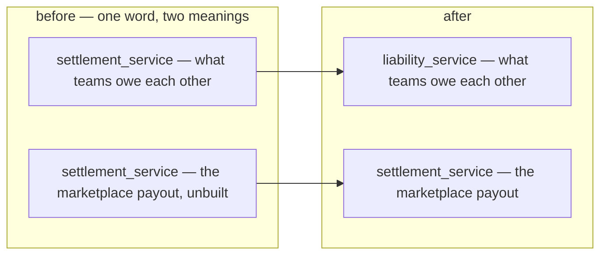

### The spec — what renames to what

| | from | to |
| --- | --- | --- |
| folder | `backend/services/settlement_service/` | `backend/services/liability_service/` |
| handler package | `settlement_v1/` | `liability_v1/` |
| models package | `settlement_service_models/` | `liability_service_models/` |
| proto dir + package | `proto/warehouse/settlement/v1/` · `warehouse.settlement.v1` | `proto/warehouse/liability/v1/` · `warehouse.liability.v1` |
| proto services | `SettlementService`, `SettlementPaymentService`, `SettlementTermsService` | `LiabilityService`, `LiabilityPaymentService`, `LiabilityTermsService` |
| the 9 RPCs | `SettlementPositionList`, `SettlementEntryList`, `SettlementDaily`, `SettlementPayment{Record,Confirm,Reverse,List}`, `SettlementTerms{List,Set,Delete}` | the same names with `Settlement` → `Liability` |
| tables | `settlement_entries`, `settlement_balances`, `settlement_payments`, `settlement_terms` | `liability_*` — a new migration in the renamed service, since `<service>_version` moves too |
| goose version table | `settlement_service_version` | `liability_service_version` |
| frontend | `features/settlement/` | `features/liability/` |
| routes | `/settlement`, `/settlement/:counterpartyId` | **deleted** — `/liability` and `/liability/:counterpartyId` already exist and the nav already points at them |
| i18n keys | `nav.settlement`, `settlement.*` | `nav.liability`, `liability.*` — the rendered STRINGS ("Liability"/"Kewajiban") do not change |

⚠ **The freed name is then taken by the new service**, so the rename must land *before* any
`warehouse.settlement.v1` file is written for the payout. Two things called settlement in one
checkout, even briefly, is how the wrong one gets imported.

⚠ **`/settlement` and `/settlement/:counterpartyId` are deleted, not renamed.** They are the superseded
pages kept reachable during the #221/#222 redesign; the new payout screens want those exact paths.

---

## superseded-the-grain-is-the-order

> ⛔ **SUPERSEDED (2026-09-10) by [an-entry-names-an-order-or-a-shop](#an-entry-names-an-order-or-a-shop).**
> The grain is no longer *"the order, absolutely"* — a row is addressed to an order OR to a shop. Kept,
> renamed rather than deleted (RULE 12), because the scope reasoning below is what the new decision had
> to answer.

> `settlement_context.md` §General Brief 1 — *"its order grain."*

**The verdict.** The settlement ledger's **scope is `order_id`**. One account per order, following the
scope rule in [mutation_and_ledger](../../technical/ledger/mutation_and_ledger.md) — *"scope is use
smallest grain to track ledger balance"*.

This closes the two-scope proposal that was open in the clarify file: there is **one state table**, not
two, and the shop wallet is not a settlement state.

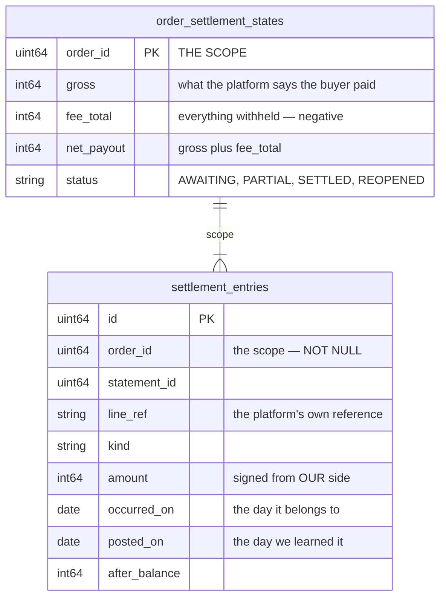

### What the grain forces

| | |
| --- | --- |
| `order_id` is **NOT NULL** on every entry | there is no other scope to post to |
| a statement line with no order **cannot be posted at all** | so the unmatched tray is not a convenience — it is the only place such a line can exist until a person resolves it |
| the shop wallet balance is **derived, not stored** | it is a reconciliation query, not a ledger state |
| **a shop-level charge — ads, subscription — has no scope** | see the open question below |

⚠ **This decision has one unresolved consequence.** `settlement_context.md` §2 names *"ads fee"* among
what an order can be charged, but a marketplace bills ads to the **shop**, not to an order. Under order
grain that charge has nowhere to post. It is the open question in
[context_clarify.md](./context_clarify.md#question) and is not settled by this entry.

> ⏭ **Superseded by [the-log-is-order-scoped-with-six-types](#the-log-is-order-scoped-with-six-types).**
> §Settlement Behaviors shows `external_ads_fee` attached to an ORDER, so in this model an ads fee names
> an order like any other charge. Only a narrow residual remains — whether `order_id` is ever null.
> Left standing above because this file is append-only.

---

## every-marketplace-order-carries-a-unique-platform-ref

> ⛔ **REVERSED — NOT IN FORCE.** Superseded by
> [settlement-keys-on-our-order-id](#settlement-keys-on-our-order-id): the owner removed
> `order_external_ref_id` from both §General Brief and the ledger's field list, and settlement now keys
> on our internal `order_id`. Kept below because this file is append-only. **Do not build from it.**

> `settlement_context.md` §General Brief 2 — *"`order_external_ref_id` become MANDATORY and UNIQUE per
> shop for marketplace orders"* — **this line has since been deleted from the doc.**

**The verdict.** `Order.order_external_ref_id` stops being an optional note and becomes the **join key**.
It is required for any order on a marketplace shop, and unique within that shop.

This is what makes [superseded-the-grain-is-the-order](#superseded-the-grain-is-the-order) workable at all: `order_id` is the
only scope a settlement entry has, so a statement line that cannot find its order cannot be posted. It
also closes `§1`'s *"we record that twice in our system"* from the other end — **a duplicate becomes
impossible to create**, rather than something to detect afterwards.

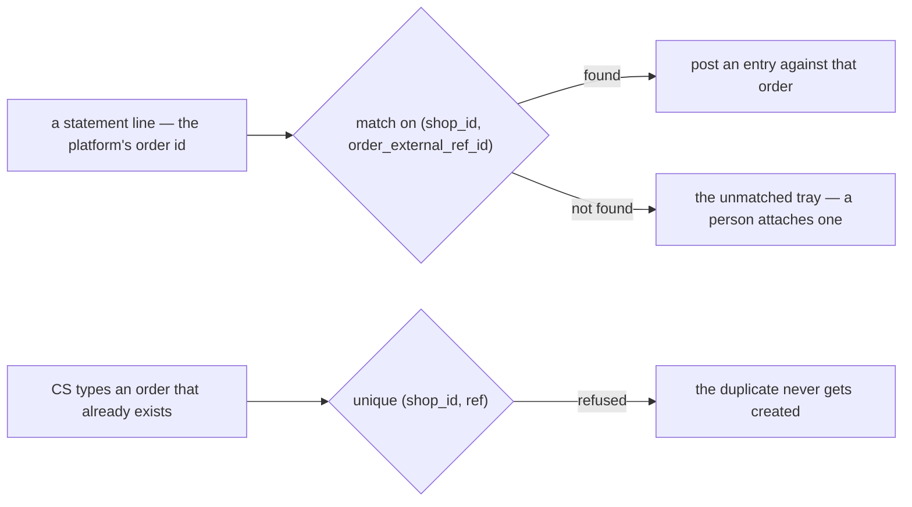

### The spec

| | |
| --- | --- |
| required when | the order's shop has a `Marketplace` — mandatory there, `""` still allowed for a phone order |
| unique on | `(shop_id, order_external_ref_id)` — a **partial** unique index, `WHERE order_external_ref_id <> ''`, so phone orders do not collide with each other |
| enforced where | a **handler check** in `OrderCreate`, not `buf.validate` — the rule depends on the shop's marketplace, which a field constraint cannot look up. A blanket `min_len: 1` would break phone orders |
| the draft path | `OrderDraft.external_id` already carries the platform's id and is unique on `(team_id, source, external_id)`. Promoting a draft **copies it into** `order_external_ref_id` — the two must not diverge |
| the form | the field becomes required-with-an-asterisk on the order form when a marketplace shop is picked, and optional otherwise |
| existing rows | orders already written with `""` stay legal — the partial index tolerates them. ⚠ **They can never be settled**, because nothing can match them. That is honest, not a migration to write |

⚠ **The field belongs to [order_context](../order/context.md)** — recorded here because settlement is
what forced it. `OrderCreateRequest`, the order form, the draft-promote path and the e2e seeds all
change with it.

---

## settlement-publishes-to-the-book

> `settlement_context.md` §General Brief 3 — *"we have `Settlement Log` part of `ledger_context` and it
> publish to the broker and post to the Financial Ledger"*

**The verdict.** `settlement_entries` **is** the `Settlement Log` in
[ledger_context.md](../ledger/context.md)'s first box. Settlement is a first-class money source: it
writes its log inside its own transaction, publishes, and the Financial Ledger projects from the event.

**This is where real revenue finally enters the book.** Until now the only thing an order produced was
a frozen estimate that `order_context.md:150` explicitly keeps out of the ledger.

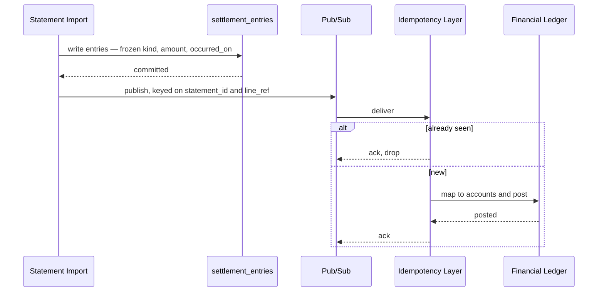

### The spec

| | |
| --- | --- |
| the log | `settlement_entries` — append only. A correction is a compensating entry, never an update |
| write order | entry first, inside settlement's own transaction, **then** publish — `every-source-writes-a-log-first` |
| the only path in | the broker. The ledger never reads settlement's tables — `the-broker-is-the-only-path-in` |
| what the event carries | the **frozen money**: `kind`, `amount`, `occurred_on`, `posted_on`, `order_id`. Settlement freezes the amounts; the ledger consumer decides the accounts — `log-carries-the-frozen-money` + `event-processing-owns-the-mapping` |
| the topic | declared on the event message via `warehouse.event_base.v1.event_config`, never named by the publisher |
| idempotency key | `(statement_id, line_ref)` — the same natural key that makes a re-import a no-op, so both layers dedupe on one fact |
| the DLQ | **required** on the push subscription. A dead-lettered settlement event is not a lost notification — it is a permanently wrong book, and no screen will show it as missing |
| reconciliation | settlement is one of the logs the daily reconciler compares against the projected book |

⚠ **The ledger cannot refuse this.** `ledger_context.md:4` makes the book a downstream projection, so
settlement must be right on its own — nothing downstream will catch a bad entry.

⚠ **This does not give settlement a gate.** It publishes; it never blocks. The debt threshold lives in
`liability_service` and has nothing to do with a payout.

---

## the-account-opens-at-order-creation

> `settlement_context.md` §Settlement Behaviors — row 1: `initial_total`, **− 120.000**, *"On Order
> Created (write opposite from `order_marketplace_total`)"*; row 2: `fund`, **+ 100.000**, *"On Order
> Completed"*.

**The verdict.** A settlement account is opened by the **order**, not by the statement. The first entry
is `initial_total` — the marketplace total with its sign **flipped** — so the account starts at what the
platform owes us, and every later entry works that number down.

This makes settlement a **receivable ledger**: the opening entry is the claim, and everything after it
is the platform paying, charging or correcting against that claim.

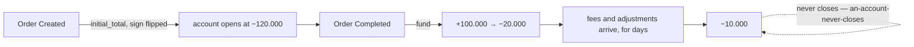

### The spec

| | |
| --- | --- |
| the opening entry | `settlement_type = initial_total`, `change = −order.marketplace_total` |
| when | on order creation — **not** on the statement, and not on `COMPLETED` |
| what feeds it | `Order.marketplace_total`, verbatim, sign flipped |
| the second entry | `fund`, positive, when the platform pays out |
| the balance | running, `balance = previous + change`, carried on every row |
| closing | there is none — [an-account-never-closes](./context_clarify.md#an-account-never-closes) still holds, and §3 is why |

⚠ **Settlement now has TWO write paths, not one.** `initial_total` is written by an order event;
everything else arrives from a statement import. `a-statement-is-imported-never-typed` describes the
second path only, and the first one needs its own trigger, its own idempotency and its own failure
story.

⚠ **`marketplace_total = 0` means NOT RECORDED, not "worth nothing"** (`order.proto:224`). An order taken
over the phone has no marketplace figure, so it would open at 0 and every `fund` would push the balance
positive. That case needs a rule — see [context_clarify.md](./context_clarify.md#question).

⚠ **This reverses `order.proto:226`.** That comment says *"⚠ Never add it to margin or revenue"* and
*"nothing computes from it"* — and now something does. See the contradiction in
[context_clarify.md](./context_clarify.md#contradiction).

---

## the-log-is-order-scoped-with-six-types

> `settlement_context.md` §Settlement Log Ledger Shapes — the field list and the `settlement_type` set.

**The verdict.** One row per movement, carrying the order **and** the shop **and** the team, with a
closed six-value type.

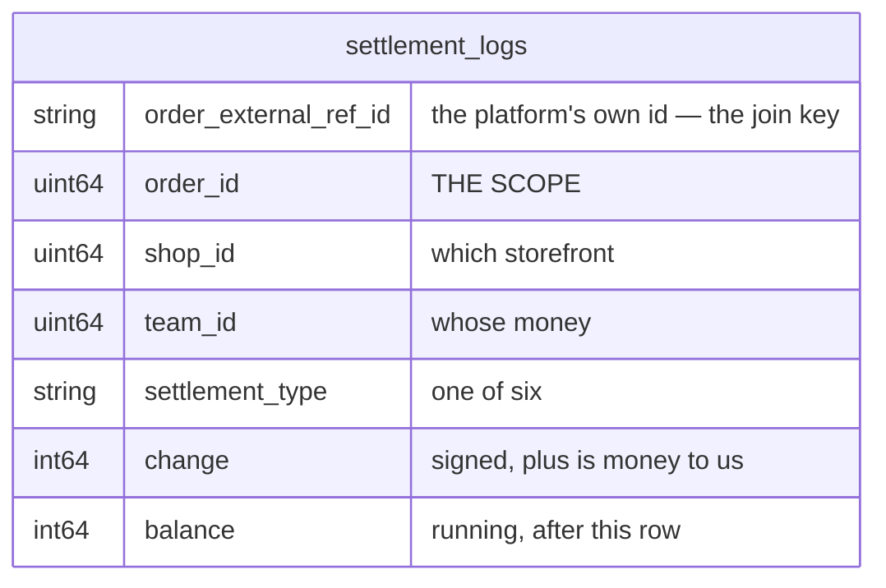

### The types

| type | sign in practice | what it is |
| --- | --- | --- |
| `initial_total` | − | the claim, opened at order creation |
| `fund` | + | the platform paid out |
| `external_ads_fee` | − | ads charged against this order |
| `affiliate_fee` | − | an affiliate's cut of this order |
| `marketplace_adjustment` | ± | a reimbursement or a clawback — the example uses it for one |
| `other` | ± | so nothing is unrecordable while the set is young |

**`shop_id` and `team_id` are denormalised onto the row on purpose.** Both are derivable from
`order_id`, and both are here anyway: every settlement screen filters by shop or by team, and a ledger
that had to join to `orders` to answer *"what did this shop net in January"* would join on every read.
They are frozen copies, like `order.cogs` — an order does not move between shops.

⚠ **`external_ads_fee` is shown attached to an ORDER** in §Settlement Behaviors. That is what closes
the shop-level-charge fork — in this model an ads fee names an order like any other charge. The residual
question is whether `order_id` is ever null; see [context_clarify.md](./context_clarify.md#question).

⚠ **No `platform_fee` and no `shipping_fee` in the list**, although §2 names both. They would have to be
`marketplace_adjustment` or `other`, which makes *"what did the marketplace take in commission"*
unanswerable. Raised as a critique, not applied.

⚠ **No idempotency key in the field list.** Nothing identifies the statement line a row came from, so a
re-imported file double-posts. Raised as a critique.

---

## settlement-keys-on-our-order-id

> `settlement_context.md` §Settlement Log Ledger Shapes — `order_external_ref_id` **removed** from the
> field list; §Settlement Behaviors — the `Ref` column replaced by **`Order ID`**, holding `1`;
> §General Brief — the line requiring a mandatory, unique platform ref **deleted**.

**The verdict.** Settlement is keyed on **our internal `order_id`** and never sees the platform's own
reference. Whoever imports a statement resolves the platform ref to an `order_id` first and hands
settlement an already-resolved order.

> ⛔ **THIS REVERSES [every-marketplace-order-carries-a-unique-platform-ref](#every-marketplace-order-carries-a-unique-platform-ref).**
> That entry stands above because this file is append-only — **it is no longer in force.** Its rename
> obligation (RULE 12) is discharged here rather than by editing it.
>
> ⚠ **It is reversed as a SETTLEMENT decision only.** Whether `Order.order_external_ref_id` should still
> be mandatory and unique is now purely an [order_context](../order/context.md) question, and settlement
> no longer forces it either way.

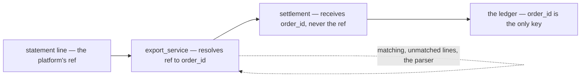

**What leaves settlement with it:** the match, the unmatched tray, and every failure mode of matching.
Settlement gets a resolved order or nothing.

---

## importing-is-not-settlements-job

> `settlement_context.md` §General Brief 3 — *"this `settlement_service` not covered automatic importing
> file. its `export_service` responsbility [defer for now, talk later]"*

**The verdict.** Settlement is a **ledger with a write API**, not an importer. File parsing, per-
marketplace formats, matching and the unmatched tray all belong to `export_service`, which is deferred.

This is a large simplification. Removed from settlement's scope:

| leaves settlement | goes to |
| --- | --- |
| `settlement_statements` — the file, the evidence, the stated-vs-parsed check | `export_service` |
| `settlement_unmatched_lines` — the tray | `export_service` |
| the per-marketplace parser adapter | `export_service` |
| `/settlement/import`, `/settlement/statements/:id`, `/settlement/unmatched` | `export_service` |

**What settlement keeps:** the log, the running balance, the six types, and the screens that read them.

⚠ **This creates settlement's real open question.** A ledger fed by someone else needs an
**idempotency key it does not own** — the same file imported twice must not double-post, and settlement
can no longer dedupe on a line reference it never sees. See
[context_clarify.md](./context_clarify.md#question).

---

## a-residual-balance-is-normal

> `settlement_context.md` §General Brief 4 — *"in many case settlement balance doesn't fully settle,
> always any urecorded adjustment for the order, its come from the platform and its okay."*

**The verdict.** An order's balance **does not reach zero**, and a residual is expected rather than an
error. The platform makes adjustments we never see, and that is accepted.

**This settles what the `balance` column MEANS.** It is a **variance** — how far this order drifted from
its face value — not a receivable to be chased. A non-zero balance is the normal end state, so no screen
should present one as an exception, a dunning list, or something a person must clear.

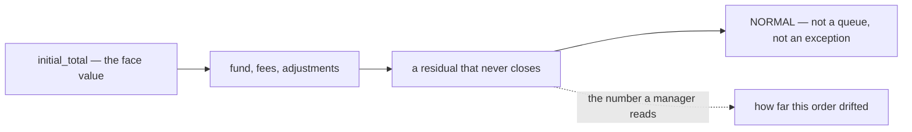

### What this forbids

| | |
| --- | --- |
| a "settled / unsettled" flag driven by `balance = 0` | nothing would ever be settled |
| an alert, badge or worklist on a non-zero balance | it would fire on almost every order |
| reconciling an order to zero by hand | the missing amount is not knowable to us |

⚠ **It also closes the ambiguity I raised** — that a shortfall and an accepted fee move the balance
identically. They do, and under this decision it does not matter, **because nobody acts on the
difference.** The residual open question is narrow: is there any drift large enough to be worth looking
at? See [context_clarify.md](./context_clarify.md#question).

---

## settlement-ignores-our-order-status

> `settlement_context.md` §General Brief 5 — *"Settlement doesn't rely on our order status. its can be
> happen anytime."*

**The verdict.** No settlement row is gated on an `OrderStatus`. A payout, a fee or an adjustment posts
whenever the platform produces it — including before the warehouse has shipped, and long after.

✅ **This resolves the `COMPLETED` contradiction.** `OrderStatus` ends at `SHIPPED` and has no
`COMPLETED`, and settlement was the thing that appeared to need it. It does not. §Settlement Behaviors'
*"On Order Completed"* therefore reads as **the platform completed it** — the payout arrived — not as a
status of ours.

⚠ **`COMPLETED` and `PROBLEM` are still missing from `OrderStatus`** while `order_context.md` draws
both. That is now purely an [order_context](../order/context.md) matter — settlement no longer forces it,
and the contradiction moves out of settlement's clarify.

⚠ **One dependency survives, and it is not a status.** `initial_total` is written *on order creation*,
which is an event, not a status transition. So settlement depends on the order **existing**, never on
where it has got to.

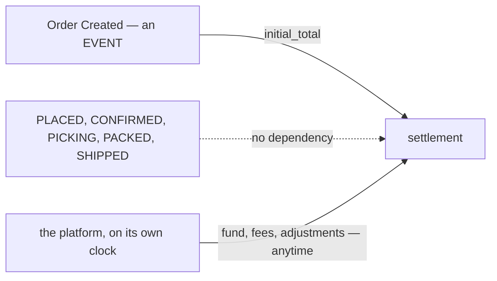

---

## entries-arrive-by-api-or-by-hand

> `settlement_context.md` §What External Service expected — *"settlement can call by api to settlement
> entry"* · §What Frontend Expected — *"User can Manually add settlement entry from order detail page"*
> · §Shapes 3 — `source_type`: *"by external service, `exporter`, or by manual in frontend, `manual`"*

**The verdict.** Settlement has **exactly two write paths**, and every row records which one it came
from. There is no third — a row is written by the exporter over the API, or by a person on the order
detail page.

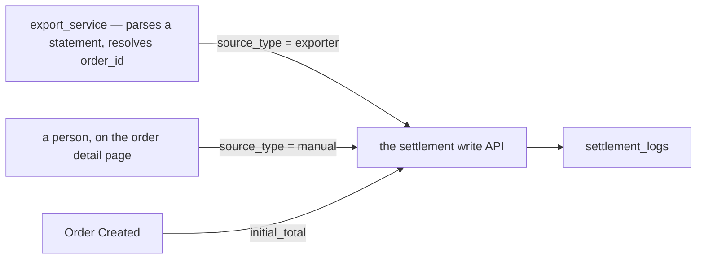

### The spec

| | |
| --- | --- |
| the API path | `source_type = exporter`. Called by `export_service` — deferred, but the contract is settlement's and exists now |
| the manual path | `source_type = manual`. A form on the order detail page, beside the ledger it appends to |
| `initial_total` | written on order creation — see [Question 3](./context_clarify.md#question) for whether that is a third source or one of these two |
| append-only | a manual mistake is corrected by a **compensating entry**, never an edit or a delete. The form must make that obvious, or people will ask for a delete button |

⚠ **This is a person typing an arbitrary signed amount into a ledger that publishes to the Financial
Ledger.** `source_type` records *that* it was manual; it does not constrain **who** may do it or **which
types** they may write. Both are open — see [context_clarify.md](./context_clarify.md#question).

---

## every-entry-names-its-actor

> `settlement_context.md` §Shapes 4 — *"`actor_id` is who create the entry"*

**The verdict.** Every settlement row carries `actor_id` — the person accountable for it. Not nullable,
including on rows written over the API.

This matches the rule `order_drafts` already set: *"There is no machine identity in this system and this
feature does not invent one, so every draft has a human accountable on it."* An exporter run therefore
posts under the login it runs as, and `actor_id` is never a system sentinel.

| `source_type` | `actor_id` is |
| --- | --- |
| `manual` | the person who filled the form |
| `exporter` | the person whose login the exporter runs under |
| `initial_total` | ⚠ nobody typed it — see [Question 3](./context_clarify.md#question) |

⚠ **`initial_total` is the one row no human causes.** It fires on order creation, so the honest
candidates are the person who placed the order, or a rule that this one type is exempt. It cannot be
left unset without making the column nullable and therefore unenforceable everywhere else.

---

## a-correction-is-a-new-row

> `settlement_context.md` §General Brief 6 — *"settlement just can adjustment by added record log, not
> updated the log."*

**The verdict.** The log is **append-only**. Nothing updates a row and nothing deletes one — an
adjustment is a **new row**, and that includes fixing our own mistakes.

✅ This confirms what the ledger template already required and what the shipped liability service already
does (`SettlementPaymentReverse` posts a compensating entry rather than editing).

### What it forces on the UI

| | |
| --- | --- |
| no Edit, no Delete | on any settlement row, ever |
| a per-row **Reverse** action | posts the negation, same `settlement_type`, `source_type = manual` |
| the form must SAY so | a create form that looks ordinary invites *"just delete it"* — the screen has to make the append-only rule visible, not just enforce it |

⚠ **This makes the duplicate problem permanent.** A row posted twice cannot be removed — only offset by
a third row. Combined with
[a-residual-balance-is-normal](#a-residual-balance-is-normal), a duplicate is both undetectable and
unremovable, which is why the idempotency key is the blocker and not a nicety. See
[context_clarify.md](./context_clarify.md#question).

---

## initial-total-is-an-estimate-and-fund-is-what-we-actually-got

> `settlement_context.md` §Shapes 2 — `initial_total`, *"its estimated revenue marketplace platform
> total"* · `fund`, *"its real revenue we get, usualy after customer received the order"*

**The verdict.** The two core types are an **estimate** and a **realisation**, and the ledger's whole job
is to hold the distance between them.

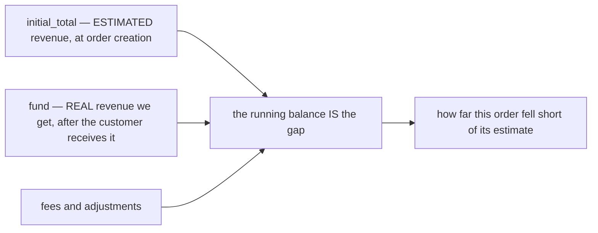

This is what makes [a-residual-balance-is-normal](#a-residual-balance-is-normal) coherent rather than
sloppy: you cannot "fully settle" against an **estimate**, so a residual is the expected outcome by
construction, not a failure to collect.

### Two consequences that are not obvious

**1. `fund` is NET.** *"real revenue we get"* is the money that actually arrives, so marketplace
commission is already deducted inside it. There is therefore **no `platform_fee` row and no way to
report commission** — §2 names *"platform fee"* as something that happens, and this ledger cannot show
it. Accepted or not, that is a decision; see [context_clarify.md](./context_clarify.md#question).

> ⏭ **NARROWED by [fund-is-not-the-final-figure](#fund-is-not-the-final-figure).** The gloss has since
> gained *"its not net, platform still charge in other day sometimes"*. That settles **when** — more
> charges follow — and leaves **what is already deducted inside `fund`** open. Read point 1 above as the
> question it raised, not as a settled answer. Left standing because this file is append-only.

**2. `revenue_service` loses its stated reason to exist.** Its own proto says the record exists as *"a
HOME FOR #76 — settlement compares what we expected against what the payout actually was, and 'actual'
has nowhere to live without a row beside it."* Settlement now holds **both sides**, so that argument no
longer applies. What survives is `cogs` and `expected_margin` — a margin record, which is a different
job from a revenue estimate. See [context_clarify.md](./context_clarify.md#question).

---

## actor-id-is-the-pic

> `settlement_context.md` §Shapes 4 — *"`actor_id` is who create the entry, its pic"*

**The verdict.** `actor_id` is the **person in charge** of the entry — the human answerable for it, not
merely whichever session happened to write the row.

| `source_type` | the PIC is |
| --- | --- |
| `manual` | the person who filled the form |
| `exporter` | the person whose login the exporter runs under — no machine identity, matching the rule `order_drafts` already set |
| `initial_total` | ⚠ nobody filled a form. The order's own PIC is the only honest candidate |

⚠ **`initial_total` still needs a rule.** It fires on order creation, so the person accountable is
whoever placed the order. Naming them keeps the column NOT NULL; exempting this one type makes it
nullable, and a nullable accountability column is unenforceable everywhere else.

---

## settlement-owns-revenue

> Owner, in chat: *"revenue service is stale, its actualy settlement_service job."*

**The verdict.** `revenue_service` is **retired**. Order revenue — expected and actual — is
settlement's, and there is no second service holding a copy.

**It was already the same mechanism.** `revenue_service` subscribes to `OrderPlacedEvent` and freezes
the order's money into `order_revenues`; `initial_total` subscribes to order creation and freezes the
order's money into the settlement log. One subscription, one fact, two tables.

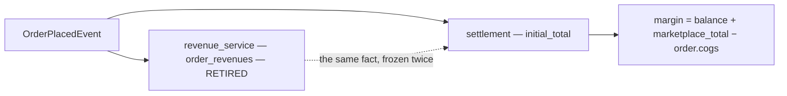

### Where each thing goes

| `revenue_service` held | now |
| --- | --- |
| `revenue` — what we expected | **`initial_total`**, already |
| the actual payout — it never had one | **`fund` + fees**, already |
| `cogs` | **`order.cogs`** — frozen on the order at placement, so settlement reads it and stores nothing |
| `expected_margin` | derived: `marketplace_total − order.cogs` |
| **true margin** — it could never compute this | derived: **`balance + marketplace_total − order.cogs`** |
| `voided` — a cancelled order stops counting | under [a-correction-is-a-new-row](#a-correction-is-a-new-row) a cancel posts a **reversing row** against `initial_total`, taking the balance to 0. A cancelled order is then worth nothing *by arithmetic*, with no flag to keep in sync |
| `RevenueRecord` | gone — the subscription writes `initial_total` |
| `RevenueList`, `RevenueDaily` | settlement RPCs |
| `RevenueVoid` | a compensating row |

**Why the true-margin formula works.** Net received is everything except the opening estimate, so
`net = balance − initial_total = balance + marketplace_total`. On the worked example:
`−10.000 + 120.000 = 110.000`, which is `100 − 10 + 20`. ✓

### What to delete

`backend/services/revenue_service/`, `proto/warehouse/revenue/v1/`, `order_revenues` and its two
migrations, the two push subscriptions, and the frontend's `pages/revenue/queries.ts`,
`pages/profit/queries.ts`, `pages/daily-statement/queries.ts` re-pointed at settlement.

⚠ **THIS CHANGES THE NUMBER ON THREE EXISTING SCREENS, and that is not a rename.**
`order_revenues.revenue` was `order.total` — *subtotal + shipping*. `initial_total` is
`order.marketplace_total` — *what the storefront actually took*, after the platform's vouchers and
subsidies. **They are different fields with different values**, so `/revenue`, `/profit` and
`/daily-statement` will all show different figures afterwards.

⚠ **And `marketplace_total = 0` means "not recorded"** (`order.proto:224`). Every phone order, and every
order placed before that field was filled in, would report **zero revenue** rather than unknown — where
`order.total` always had a value. That is the same hole as
[context_clarify.md Critique 3](./context_clarify.md#critique), and retiring `revenue_service` makes it
load-bearing for the whole revenue report rather than for settlement alone.

---

## fund-is-not-the-final-figure

> `settlement_context.md` §Shapes 2 — `fund`, *"its real revenue we get, usualy after customer received
> the order, **its not net, platform still charge in other day sometimes**"*

**The verdict.** `fund` is **not a settlement figure**. It is the money that arrived on that day, and
the platform keeps charging afterwards — so no single row is ever "the payout".

This is the same shape as [a-residual-balance-is-normal](#a-residual-balance-is-normal), stated one level
down: not only does the *account* never close, the *payout itself* is not a single event. A screen that
labels `fund` as "what we got paid for this order" is wrong on any order that has later charges — which
`§3` says is most of them.

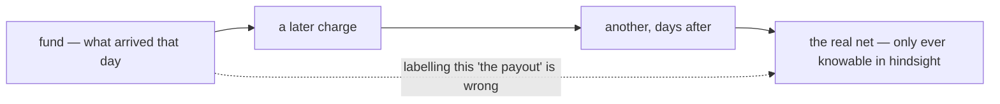

⚠ **It does NOT settle whether commission is inside `fund`.** *"Not net"* answers **when** — more comes
later — and leaves **what is already deducted** open. The worked example still shows `fund +100.000`
against a `−120.000` estimate with **no row explaining the 20.000**, which is exactly the gap this
phrase was reached for. See [context_clarify.md](./context_clarify.md#question).

---

## the-state-table-is-order-settlement

> `settlement_context.md` §Settlement State — *"We have settlement state, we called `order_settlement`"*

**The verdict.** Settlement follows the state-plus-log shape from
[mutation_and_ledger](../../technical/ledger/mutation_and_ledger.md): the log is the settlement log, and
the state table is **`order_settlement`**, scoped by `order_id`.

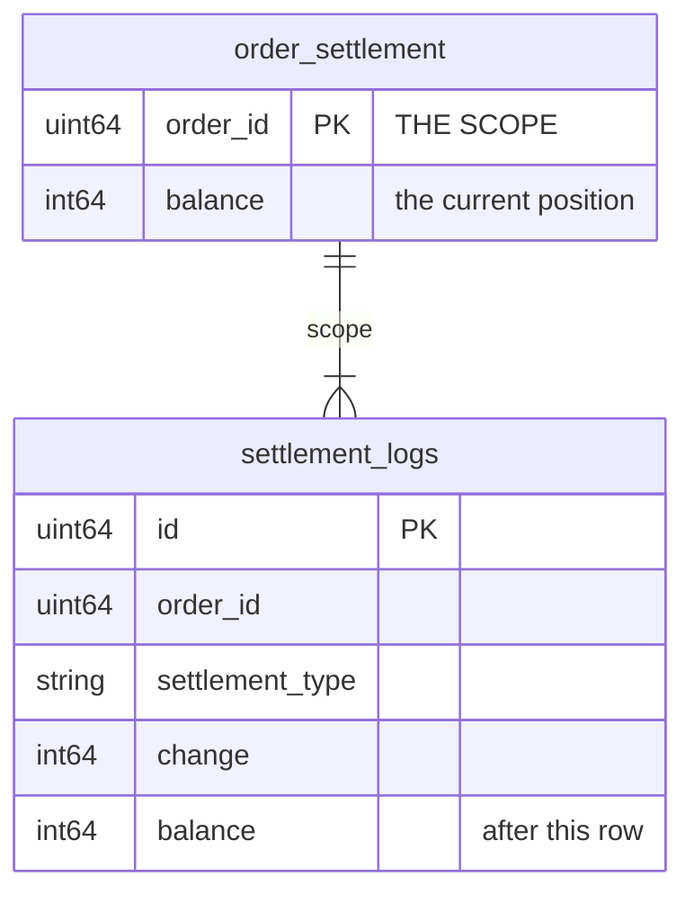

**Why it exists, and it is not for reading speed.** Per the template, *"service that implemented that
design cannot change the State without log recorded in Ledger Log"* — the state is the row a writer
**locks**. Two posts against one order in the same second (the exporter importing while a person types
an adjustment by hand) would otherwise both read the same running balance and both write it, losing one.
`order_settlement` is what serialises them.

⚠ **Its columns are not stated.** `balance` is certain. Everything else is open — and one candidate is
already excluded: [a-residual-balance-is-normal](#a-residual-balance-is-normal) rules out a
settled/unsettled status, because nothing would ever be settled. See
[context_clarify.md](./context_clarify.md#question).

---

## the-unique-id-is-generated-outside-settlement

> `settlement_context.md` §Shapes 1 — *"`unique_id`, string type, custom idempotency key with
> `order_id`"* · §Idempotency Key — *"we must set `unique_id` in outside `settlement_service`, so
> exporter and manual can decide how they generate `unique_id`"*

**The verdict.** Every row carries a **`unique_id`**, unique together with `order_id`, and the **caller**
generates it. Settlement refuses a repeat and never invents a key of its own.

✅ This is the right shape, and the reasoning in §The Problem is the reason: there are two write paths and
no marketplace supplies a usable key, so the only party that can produce a stable identity is the one
that saw the source.

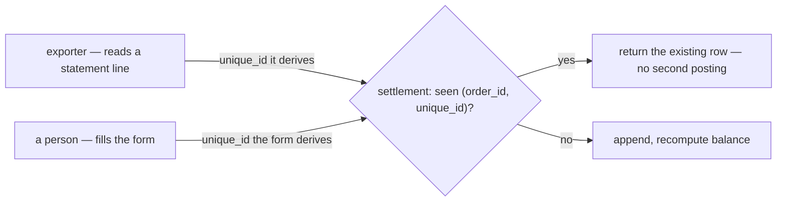

### The spec

| | |
| --- | --- |
| uniqueness | `(order_id, unique_id)` — a database constraint, not an application check |
| who generates it | the caller, always. Settlement neither generates nor validates the recipe |
| a repeat | returns the existing row **successfully** — a retry must be safe, not an error |
| storage | `string`, so any caller's scheme fits without settlement knowing it |

⚠ **The example recipe `hash(date + order_ref_id)` COLLIDES on this doc's own worked example.** Rows 3
and 4 are both order 1 on 04-01-2026 — `external_ads_fee −10.000` and `marketplace_adjustment
+20.000` — so both hash to the same value and **the second is silently dropped**. This is not a flaw in
the decision; it is a flaw in the suggested recipe. See
[context_clarify.md](./context_clarify.md#critique).

⚠ **Cross-path dedupe is impossible by construction, and that is fine to accept — but should be
accepted knowingly.** If the exporter and a person both record the same real fee, they generate
different `unique_id`s and both rows post. Only a shared recipe would prevent it, and a shared recipe is
exactly what §Best Effort declines.

---

## the-state-holds-initial-total-and-last-balance

> `settlement_context.md` §Settlement State — *"`order_settlements`. it has: `order_id`,
> `initial_total`, `last_balance`"*

**The verdict.** The state table is **`order_settlements`**, scoped by `order_id`, holding the opening
estimate and the current position.

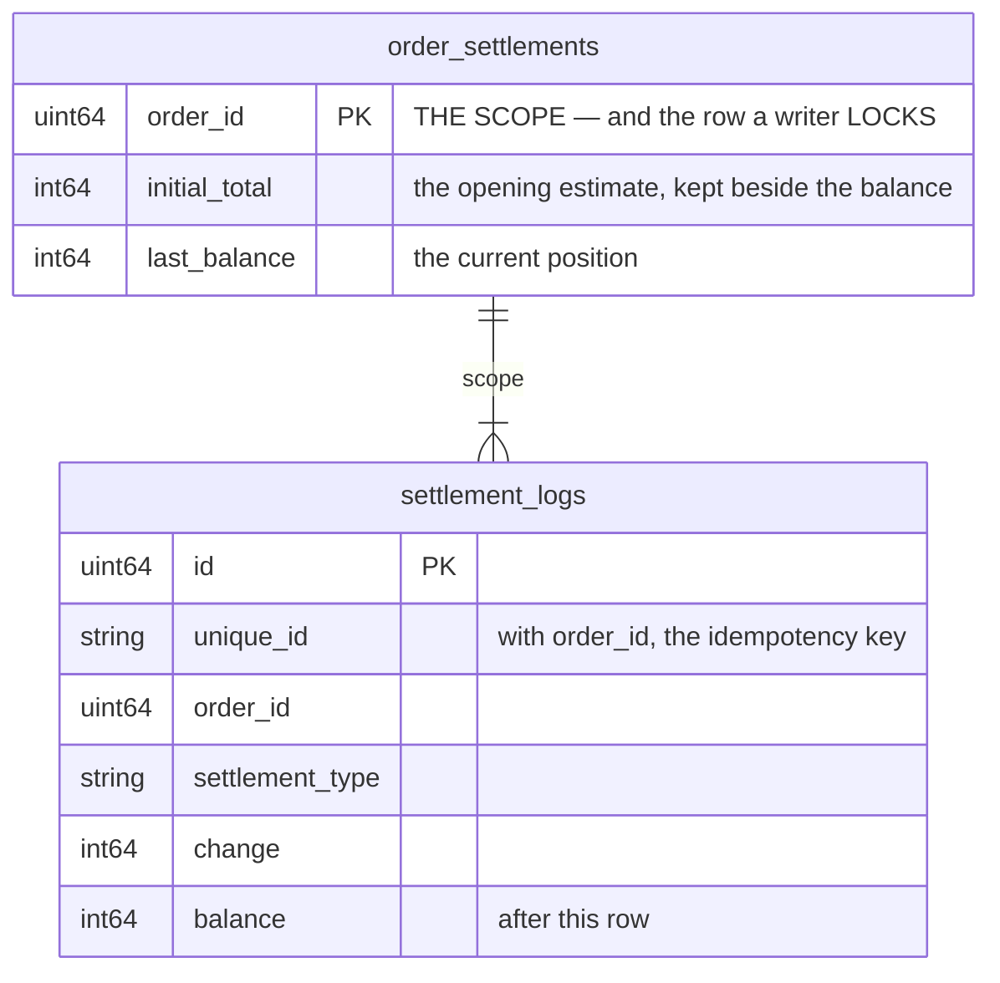

**Keeping `initial_total` beside the balance is the good part.** It makes the number every screen
actually wants a **single-row read**:

```
net actually received  =  last_balance + initial_total
true margin            =  last_balance + initial_total − order.cogs
```

On the worked example: `−10.000 + 120.000 = 110.000`, which is `100 − 10 + 20`. ✓ Without the column
that answer needs a scan of the log for one row of a particular type.

**It is also the row a writer locks** — per
[mutation_and_ledger](../../technical/ledger/mutation_and_ledger.md), the state cannot change without a
log row, so two concurrent posts against one order serialise here rather than both reading the same
running balance.

⚠ **The sign of `initial_total` is not stated**, and it flips the formula. The log's `change` is
**negative**; the column is named after the positive estimate. Both readings are defensible and only one
is right. See [context_clarify.md](./context_clarify.md#question).

⚠ **No `team_id` or `shop_id` on the state**, though both are on the log. A per-shop list therefore joins
to `orders` or to the log on every read — see [context_clarify.md](./context_clarify.md#critique).

⚠ **Named `order_settlements` here, `order_settlement` in the previous revision.** Plural is the
convention every other table in this system follows, so plural is right.

---

## the-recipe-is-the-callers-problem

> Owner, in chat: *"dont mind about how hashing, its outside responsbility"*

**The verdict.** How a `unique_id` is derived is **outside `settlement_service`**. Settlement enforces
that `(order_id, unique_id)` is unique and nothing more — it does not specify a recipe, validate one, or
carry guidance about one.

This closes the recipe critique and the question under it. The exporter and the manual form each own
their scheme, and a bad scheme is a bug in the caller, not in settlement.

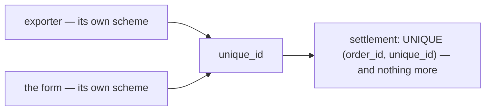

### What stays settlement's, and is worth being deliberate about

| | |
| --- | --- |
| the constraint | `UNIQUE (order_id, unique_id)` in the database, not an application check |
| the **response** | a repeat must be distinguishable from a write — see below |

⚠ **One thing does remain inside the boundary: what a repeat RETURNS.** If a duplicate key returns the
existing row with no signal, the caller cannot tell *"already recorded"* from *"recorded just now"* —
so a caller whose scheme is colliding gets no feedback, and
[a-residual-balance-is-normal](#a-residual-balance-is-normal) means no screen will show it either. A
`created` / `already_existed` flag on the response costs one field and lets a caller detect its own bug.
That is settlement's API contract, not a recipe.

---

## no-role-policy-yet

> `settlement_context.md` §Access Role — *"for now, there is no specific role for this service. [defer
> later]."*

**The verdict.** Settlement gets no service-specific role design in this pass. Deferred.

⚠ **BUT "no policy" IS NOT A BUILDABLE STATE IN THIS SYSTEM.** `CLAUDE.md:648` — *"A message with no
policy is DENIED. Deny by default."* The access interceptor reads `request_policy` off the request
message by reflection; a message without one is refused. So deferring the *design* is fine, and shipping
an RPC with *no* `request_policy` means **nobody can call it at all** — not "everybody can".

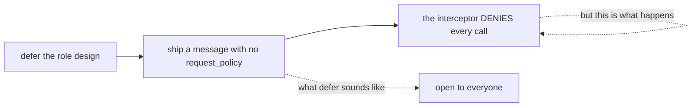

**→ RECOMMEND a placeholder that is deliberately narrow, not absent.** The deferral is about the
*design*, so borrow the one that already exists for the same money: `RevenueList`'s set —
**ROOT, ADMIN, TEAM_OWNER, TEAM_ADMIN** — scoped on `team_id` with `use_scope`.

| | |
| --- | --- |
| why that set | it is the existing answer to *"who may see this order's money"*, and settlement is the same money |
| why NARROW rather than wide | **widening later is safe; narrowing later takes away access people already use.** A placeholder that is too generous becomes permanent by habit |
| ⚠ the scope trap | a team-level role on a message with no `use_scope` field is evaluated against the ROOT team and becomes a dead letter (`CLAUDE.md`). `team_id` is already on the row — it must carry `use_scope` on the request too |

⚠ **This decision does NOT answer the other half of the question.** Which `settlement_type`s a person
may post is about **types, not roles**, and is untouched by §Access Role — see
[context_clarify.md](./context_clarify.md#question).

---

## hidden-cost-is-left-in-the-balance

> Owner, in chat, on *"why 100 and not 120?"*: *"its normally any hidden cost, we cant record and leave
> it"*

**The verdict.** The gap between `initial_total` and what actually arrives is **hidden platform cost**.
The platform does not itemise it, so there is nothing to record — and it is deliberately **left in the
balance** rather than forced into a row.

✅ **This closes the commission argument.** My case for a `platform_fee` type assumed the statement
itemises the deduction and we were choosing to discard it. It does not. **You cannot record a number
nobody gives you**, and inventing a row for it would be worse: a made-up split reads as fact.

### What this makes the `balance` — and it is better than "variance"

The residual is not noise and not a failure to collect. It is **the only measure we have of what the
platform takes without telling us**.

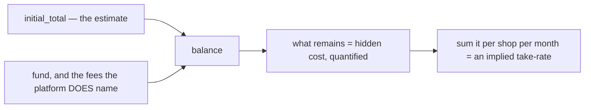

| | |
| --- | --- |
| an order at `−10.000` | the platform took 10.000 we cannot itemise |
| summed per shop per month | **the closest thing to a take-rate this system can produce** |
| compared across marketplaces | *"which platform is actually cheapest to sell on"*, answered indirectly |

**So the number I argued was being lost is not lost — it is the balance itself**, at a coarser grain.
`external_ads_fee` and `affiliate_fee` get their own rows precisely because the platform *does* name
those; everything it hides stays aggregated, which is the most honest place for it.

### What follows

| | |
| --- | --- |
| **name it on screen** | the balance is *hidden cost*, not "outstanding" or "unpaid". A label implying the platform owes us would be wrong, since nobody is going to collect it |
| **`initial_total` accuracy matters more, not less** | the whole hidden-cost measure is relative to it. A wrong or missing estimate makes the figure meaningless — which is why `marketplace_total = 0` needs a rule |
| **no `platform_fee` type** | there is nothing to put in it |

⚠ **[withheld-is-not-spent](./context_clarify.md#withheld-is-not-spent) gains a third category.** It had
two — withheld is a settlement row, spent is an expense. There is now a third: **withheld but
unknowable**, which is neither, and lives in the balance rather than in any row.

---

## marketplace-total-is-a-fact-not-an-estimate

> Owner, in chat: *"yes marketplace_total is not estimate"*

**The verdict.** `order.marketplace_total` is a **recorded fact** — what the storefront actually took
from the buyer, after the marketplace's own vouchers and subsidies (`order.proto:216-222`). It is not a
prediction and never was.

**What is estimated is the EXPECTATION**, not the number: that the payout will match what the buyer
paid. `initial_total` is a frozen copy of the fact; the estimate lives in the comparison, not in the
column.

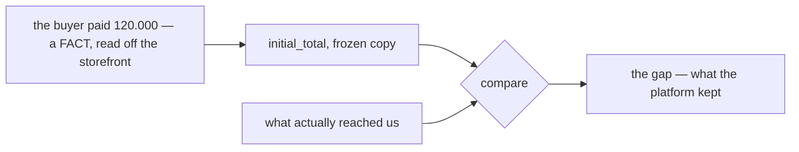

### Why the distinction earns its keep

It makes the balance **sharper**, not just better named. Measured against a fact rather than a guess,
the gap stops being "drift from an estimate" — a fuzzy thing nobody can act on — and becomes exactly:

> **how much of what the buyer paid never reached us.**

Which is the platform's take, literally. `hidden_cost ÷ initial_total` is then a **real take rate**, not
an approximation of one.

### What has to change

| | from | to |
| --- | --- | --- |
| the panel's figure | *"Estimated"* | **"Sold for"** — what the buyer paid |
| the list column | *"Estimated"* | **"Sold for"** |
| the take-rate card | *"% of estimate"* | **"% of sales"** |
| the empty case | *"no estimate recorded"* | **"marketplace total not recorded"** |
| the clarify's rule `one-copy-of-the-estimate-is-authoritative` | calls all three copies "the estimate" | renamed — they are copies of a **fact** |

⚠ **The zero case is unchanged and still open.** `marketplace_total = 0` means *not recorded*
(`order.proto:224`), which is a **missing fact**, not a zero one. Comparing anything against it still
produces fiction, so the screen still refuses to compute.

⚠ **It does NOT make the number authoritative for what we *charged*.** `order.total` is
`subtotal + shipping` — our price. `marketplace_total` is what the storefront took after the platform's
promotions. Both are facts, about different things, and `order.proto:226`'s *"never add it to margin or
revenue"* still holds.

---

## order-detail-manages-the-ledger

**The order detail page is where an order's settlement is MANAGED — not merely where an entry is
added.** (owner, 2026-08-28)

§What Frontend Expected 1 said *"manually add settlement entry from order detail page"*, which is one
verb. The owner's confirmation is the wider one: **manage**. That settles the seat and the verbs, and
it is what the built prototype already assumes.

### What "manage" covers, and where it stops

| | | |
| --- | --- | --- |
| **read** the running ledger | ✅ | every row, its running balance, and the four derived figures |
| **add** an entry | ✅ | §What Frontend Expected 1, verbatim |
| **reverse** a row | ✅ | confirms the recommendation that was Critique 5 — the negation, same type, linked to the row it undoes |
| **edit** a row | ⛔ | [a-correction-is-a-new-row](#a-correction-is-a-new-row). Unchanged — "manage" does not reopen append-only |
| **delete** a row | ⛔ | same |
| **decide WHO may do any of it** | ❓ | still open — [Question 1](./context_clarify.md#question) |
| **type `initial_total`** | ❓ | still open — [Question 2](./context_clarify.md#question) |

⚠ **Manage widens the VERBS, not the guarantees.** Append-only survives it intact: reversing posts a
further row rather than removing one, which is why Reverse is a management action and Delete is not.

### Why the order page and not a settlement screen

The ledger's grain IS the order ([superseded-the-grain-is-the-order](#superseded-the-grain-is-the-order)), so the order page
is the only screen where the whole account is in scope at once. A person adding a fee is looking at the
order to decide whether the fee is right — the lines, the shipping, what the buyer paid — and none of
that is on a settlement list.

```mermaid
flowchart TD
  subgraph OD["order detail — /orders/:orderId"]
    I["Info — lines, our total, the marketplace total"]
    T["Timeline — what happened to it"]
    S["Settlement — the running ledger"]
  end
  I -. "the same marketplace_total, frozen" .-> S
  S --> A["Add entry — 5 types, direction is a choice"]
  S --> R["Reverse — posts the negation"]
  S --> X["Edit / Delete — never"]
  L["/settlement — which orders drifted furthest"] -->|"a row opens its order"| OD
```

**The two screens are a pair with one direction of travel.** `/settlement` ranks orders by loss and
answers *which order should I look at*; the order page answers *what happened to this one, and what do
I do about it*. Every management verb lives on the second — the list never writes.

### The spec

**A third tab on the order detail page**, after Info and Timeline.

| | |
| --- | --- |
| where | `pages/order-detail/index.tsx`, `Tabs.Trigger value="settlement"` |
| why third | Info is what the order IS and Timeline is what happened to it — both settled by the time money starts arriving. Settlement is the only tab that keeps changing for days afterwards ([a-residual-balance-is-normal](#a-residual-balance-is-normal)) |
| what it renders | the ledger table, the four derived figures, **Add entry**, and a per-row **Reverse** behind the row's overflow menu |
| gating | one prop, `canPost`, resolved from the viewer's role — the single place [Question 1](./context_clarify.md#question)'s answer lands. Reading is never gated: the role gates writing, never looking |

⚠ **Built and previewable now**, but as a SEPARATE shell —
`pages/order-settlement/components/OrderDetailPreview.tsx`, story `Pages/Order Settlement/On Order
Detail`. Info and Timeline in it are the real shipped components; only the settlement tab is invented.
The real page is not touched until `design_accept`, because a fixture-fed ledger on `/orders/:orderId`
would show invented money on real orders. **On acceptance the tab moves into the real page and the
preview shell is deleted.**

---

## the-write-set-is-cs-and-up

**`[ROOT, ADMIN, TEAM_OWNER, TEAM_ADMIN, TEAM_CUSTOMER_SERVICE]`, scoped on `team_id`.** (owner,
2026-08-28)

Answers [no-role-policy-yet](#no-role-policy-yet)'s ⚠, which was not a design question but a
liveness one: `CLAUDE.md:648` — *a message with no policy is DENIED* — means deferring the policy
ships a service nobody can call.

```proto
message SettlementEntryCreateRequest {
  option (warehouse.role_base.v1.request_policy) = {
    roles: [
      ROLE_ROOT, ROLE_ADMIN, ROLE_TEAM_OWNER, ROLE_TEAM_ADMIN, ROLE_TEAM_CUSTOMER_SERVICE
    ]
  };
  uint64 team_id = 1 [(warehouse.role_base.v1.use_scope) = true];
}
```

**CS is IN the write set**, which is the owner's addition to the recommended four. It is the right
call and it follows from who does the work: CS is the seat that talks to the marketplace, chases a
missing payout and learns about a fee — so a design that let CS *see* the gap but not *record* it
would route every entry through a manager who knows less about it.

⚠ **`use_scope` on `team_id` is not optional.** Four of the five are TEAM-LEVEL roles, and
`CLAUDE.md` is explicit that a team-level role on a message with no scope field is evaluated against
the root team — where almost nobody is a member. Those entries become dead letters: the proto claims
something the system does not do.

---

## initial-total-is-postable-by-cs-and-owners

**`initial_total` MAY be typed by hand — by root, admin, team_owner and CS. Not by team_admin.**
(owner, 2026-08-28)

⚠ **This REVERSES the recommendation in the clarify's Question 2** (*"never, by anyone"*). Recorded
as a reversal rather than quietly dropped, per RULE 12.

**Why the owner is right and the recommendation was wrong.** The proposal assumed the sale figure is
always machine-derived, so a hand-typed one could only be a duplicate. It is not always derived:
`marketplace_total = 0` means **not recorded** (`order.proto:224`), and a phone order never has one.
Banning it left those accounts permanently uncomputable with no way to fix them — the screen refusing
to show a loss forever, and nobody able to do anything about it.

**Why CS and not team_admin.** The split reads oddly against seniority until you ask who *knows the
number*: authoring what the buyer paid is the **marketplace relationship**, which is CS's, while
`team_admin` is the operational seat that moves orders and never speaks to the platform.

| role | five ordinary types | `initial_total` |
| --- | --- | --- |
| root · admin · team_owner | ✅ | ✅ |
| **customer_service** | ✅ | ✅ |
| **team_admin** | ✅ | ⛔ |

### ⚠ The permission is only half the gate

A second `initial_total` is **not a correction — it is an addition.** The row is an ordinary ledger
entry, and `UNIQUE (order_id, unique_id)` cannot see that two rows mean the same sale, so posting one
where the automatic row already landed **doubles it**:

```mermaid
flowchart TD
  A["order created — initial_total −120.000 (automatic)"] --> B["balance −120.000"]
  B --> C{"a person posts initial_total −120.000 again"}
  C -->|"no second gate"| D["balance −240.000 — reads as catastrophic loss"]
  C -->|"the gate"| E["the type is not offered at all"]
```

So the type is offered only when **both** hold:

| condition | why |
| --- | --- |
| the role may author a sale | it is the marketplace relationship, not operations |
| the account holds **no live `initial_total`** | a second is a duplicate, and append-only makes it permanent |

"Live" means present and not reversed — so the repair path still works: **reverse the wrong one, then
post the right one.** That is the only sequence that can change a sale figure, and it leaves both rows
visible.

⚠ **The server enforces this, not only the form.** A UI that hides the option is a convenience; the
handler must refuse a second live `initial_total` outright, because the write API is open to
`export_service` too.

### Built

`model.ts` → `manualTypesFor(role, settlement)`, `canPostInitialTotal`, `hasLiveInitialTotal`.
Four stories pin it: `TeamAdminCannotAuthorTheSale`, `CustomerServiceMayAuthorTheSale`,
**`SaleAlreadyAuthoredHidesTheType`** (the account vetoing the role) and `TheSaleFigureWarnsLouder`.

---

## design-accepted

**The owner reviewed the Storybook prototype and ACCEPTED it.** (owner, 2026-08-28)

`design_accept` was the blocking gate of `implementation_analysis`. It is passed. The screens, the
proposed contract in `model.ts`, and the recommendations carried into them are the design
`implementation` now builds against.

| accepted | |
| --- | --- |
| `/settlement` | the list, ranked by loss, with the implied take-rate card |
| the order page's third tab | the running ledger — read, add, reverse |
| the manual-entry form | role-aware; direction is two buttons; the sale figure gated twice |
| the contract in `model.ts` | types, the four derived figures, and the recommendations on Q1–Q2 |

**What this unblocks, in order** — the first item is not negotiable:

```mermaid
flowchart LR
  R["1 · rename settlement_service → liability_service"] --> P["2 · payout proto + buf generate"]
  P --> B["3 · migration, models, the 3 RPCs"]
  B --> W["4 · rewire the prototype to the real client"]
  W --> V["5 · retire revenue_service"]
```

⚠ **The rename comes first because the NAME must be free**, not because it is easier. Writing
`warehouse.settlement.v1` for the payout while a `settlement_service` still means liabilities is how
the wrong one gets imported.

---

## order-service-calls-settlement

> `settlement_context.md` §Type `initial_total` and `initial_total_cancel` 1–2 — *"its trigered on order
> created, `order_service` calling --> `settlement_service`"* · *"when order cancel, its create
> `initial_total_cancel` ... `order_service` calling --> `settlement_service`"*

**The verdict.** The order service **CALLS** settlement synchronously. Settlement does **not** subscribe
to an order event.

⛔ **This REVERSES the clarify's Q4**, which recommended a subscription on the grounds that placing an
order should not fail because settlement is down. The owner's arrow is a call, and it is drawn twice —
on create and on cancel — so it is the shape, not a shorthand.

```mermaid
sequenceDiagram
  participant CS as Customer Service
  participant O as order_service
  participant S as settlement_service
  CS->>+O: finalize order
  O->>+S: SettlementPost — initial_total
  S-->>-O: row
  O-->>-CS: order created
  Note over O,S: and again, opposite, on cancel
```

### What the call buys, and what it costs

| | |
| --- | --- |
| ✅ buys | the account **exists the moment the order does** — no window where an order has no settlement row, and no redelivery to de-duplicate |
| ✅ buys | the caller gets the write's outcome, so `unique_id` collisions surface at the order, not in a dead-letter queue |
| ⚠ costs | settlement is now **on the critical path of order creation**. If it is down, the order is down |

⚠ **The cost is real and it is not settled here.** `initial_total` is bookkeeping, not a control — an
order that is genuinely placed on the marketplace has already happened, and refusing to record it because
a ledger is unreachable loses the fact. See [context_clarify.md](./context_clarify.md#question) — what a
failed call should do to the order is the open half.

---

## a-cancel-is-an-opposite-row

> `settlement_context.md` §Shapes 2 — a seventh `settlement_type`, `initial_total_cancel` ·
> §Type 2 — *"when order cancel, its create `initial_total_cancel` and make opposite of `initial_total`"*

**The verdict.** A cancelled order does **not** delete or close its settlement account. It gets one more
row, of a seventh type, carrying the exact opposite of the `initial_total` row. The list of types is now
**seven**, not six.

```mermaid
flowchart LR
  A["order created"] -->|"initial_total  −120.000"| B["balance −120.000"]
  B -->|"order cancelled"| C["initial_total_cancel  +120.000"]
  C --> D["balance 0 — the sale is undone IN THE LOG"]
  D -.->|"and a late fee can still arrive"| E["the account stays open"]
```

**This is consistent with everything already decided** and adds one thing:

| holds | because |
| --- | --- |
| [a-correction-is-a-new-row](#a-correction-is-a-new-row) | a cancel is a correction, and it is a row — not an edit, not a delete |
| [an account never closes](./context_clarify.md#an-account-never-closes) | a cancelled order can still be charged an ads fee the next day, and the account is there to take it |
| [settlement-ignores-our-order-status](#settlement-ignores-our-order-status) | settlement still never READS `OrderStatus` — the order service pushes, settlement does not poll |
| **new** | it supplies the missing half of the repair path in [initial-total-is-postable-by-cs-and-owners](#initial-total-is-postable-by-cs-and-owners): *reverse, then repost*. `initial_total_cancel` **is** the reverse |

⚠ **It breaks the derived figure every screen uses, and that is not a detail.**
`net received = last_balance + initial_total` is only correct while the sale is live:

| | `last_balance` | state `initial_total` | formula says | truth |
| --- | --- | --- | --- | --- |
| created | −120.000 | 120.000 | 0 | 0 ✓ |
| funded | −20.000 | 120.000 | 100.000 | 100.000 ✓ |
| **cancelled** | **0** | **120.000** | **120.000** | **0** ✗ |

A cancelled order reads as having netted the full sale, and it would be the single most profitable order
on the list screen. The fix is one line and it is [asked in the clarify](./context_clarify.md#question).

---

## cancel-zeroes-the-live-sale

> Owner, in chat (2026-08-28), answering [biggest_question.md](../../biggest_question.md) #1: **yes to B.**

**The verdict.** `order_settlements.initial_total` holds the **LIVE** sale, not the historical one. The
`initial_total_cancel` row **zeroes it** in the same write that posts the row.

```mermaid
flowchart LR
  A["initial_total posted"] --> S1["state: initial_total = the sale · last_balance = −sale"]
  S1 --> C["initial_total_cancel posted"]
  C --> S2["state: initial_total = 0 · last_balance = 0"]
  S2 --> L["the LOG still holds both rows — nothing is deleted"]
```

### The spec

| | |
| --- | --- |
| on `initial_total` | state `initial_total` ← the sale figure (sign per [the-state-holds-initial-total-and-last-balance](#the-state-holds-initial-total-and-last-balance)) |
| on `initial_total_cancel` | state `initial_total` ← **0**, in the same transaction as the log row |
| the log | **untouched** — both rows stay, and remain the source of truth |
| the four derived figures | **unchanged, verbatim** — no branch, no flag, no new column |

**It stays a PROJECTION, which is what makes it auditable.** The column is not a hand-maintained number
that can drift from the log — it is recomputable from it, just from *both* initial types rather than one
row:

```
live sale = −Σ(change) over types { initial_total, initial_total_cancel }

live:       −(−120.000)            = 120.000  ✓
cancelled:  −(−120.000 + 120.000)  =       0  ✓
```

### What it fixes

| | option A — keep the historical sale | **B — decided** |
| --- | ---: | ---: |
| `net received = last_balance + initial_total` | 120.000 ✗ | **0** ✓ |
| `hidden cost = initial_total − Σ(fund)` | 120.000 ✗ | **0** ✓ |
| `lost = −last_balance` | 0 ✓ | 0 ✓ |
| rank on `/settlement` | **the shop's most profitable order** ✗ | correctly nothing ✓ |

Under A a cancelled order reported *both* netting the full sale **and** losing the whole sale to hidden
platform cost — two wrong numbers out of one column, and the list screen ranks by exactly those.

### What it also simplifies

✅ **The liveness test becomes a single-column read.**
[initial-total-is-postable-by-cs-and-owners](#initial-total-is-postable-by-cs-and-owners) says the account
vetoes a second sale figure once a live one exists, with *reverse, then repost* as the repair. That test is
now `state.initial_total != 0` — not a sum over log rows — and after a cancel the repost becomes legal with
no special case, because the projection has already gone to zero.

⚠ **This supersedes the shape suggested in [a-cancel-is-an-opposite-row](#a-cancel-is-an-opposite-row)'s
warning**, which named the problem and left it open. It is now closed.

### The one thing it does NOT fix — and it is not settlement's

`true margin = net received − order.cogs` becomes `0 − cogs`, so a cancelled order shows a loss equal to
its cost **unless `order.cogs` is released on cancel**. That is an `order_service` question, not a
settlement one. Named here so it is not discovered on the screen.

### The cost, accepted

The historical sale figure leaves the state — *"what was this cancelled order sold for?"* becomes a log
read. Rare, and the log is right there keyed by order. The alternative (keep it historical, add an
`is_cancelled` flag) puts a branch in all four formulas and makes every future screen remember it.

---

## revenue-service-is-removed-and-statistics-deferred

> Owner, in chat (2026-08-28): *"can we remove revenue service ? for statistic, we develop later"* —
> then *"remove it now"*.

**The verdict.** `revenue_service` is **deleted**, not ported. The statistics it served are **deferred**,
not migrated onto settlement.

This is the execution half of [settlement-owns-revenue](#settlement-owns-revenue), and it settles the
open question the clarify had been carrying: settlement does **not** have to reproduce
`order_revenues`' six fields before the retirement can happen, because the screens that read them go
too.

### What was removed

| | |
| --- | --- |
| backend | `backend/services/revenue_service/`, `proto/warehouse/revenue/`, both generated trees |
| composition root | the provider, the mux registration, and its two Pub/Sub subscriptions |
| frontend | `/revenue`, `/profit`, `revenueClient`, their nav items and routes, 2 e2e specs |
| docs | `docs/services/revenue_service/` |

### What survives, and it is the whole reason this is deferral rather than loss

```mermaid
flowchart LR
  O["selling_service — order placed / cancelled"] -->|"OrderPlacedEvent · OrderCancelledEvent"| B["broker"]
  B -.->|"consumer REMOVED"| X["revenue_service"]
  B -.->|"re-addable, no change to selling_service"| S["a statistics consumer, later"]
```

`OrderPlacedEvent` carries **`revenue`, `cogs`, `shipping_cost`, `cost_known`, `warehouse_id` and the
lines** — every figure `order_revenues` held. `OrderCancelledEvent` carries the void.

⚠ **Both are still PUBLISHED with nothing listening, on purpose**, and both `.proto` comments now say so
in as many words. A consumer that saw placements but not cancellations would overstate from its first
day, so the pair must survive together. **Do not stop publishing because nothing listens.**

⚠ **`order_revenues` is NOT dropped.** Removing the code removes no data — the table and its rows stay
in the database, so a future service can backfill the history rather than starting at zero. No drop
migration was written, deliberately.

### The one screen that was not simply deleted

`/statement` was **dual-mode** — a selling team read expected margin from `revenue_service`, a warehouse
reads handling fees from `liability_service` (owner, 2026-08-14). The warehouse half has no dependency
on revenue at all, and it is *"the warehouse's money screen"* — its only one. So the page **stays,
warehouse-only**:

| | |
| --- | --- |
| `StatementMode` | a **one-member union** rather than a deleted parameter — the spine, the subtraction and the running total never varied by mode, so a second income column drops back in at one `bucketise` and one term |
| a non-warehouse team | is **told**, not shown zeroes. Real expenses with no income would report every day as a pure loss |
| `StatementRow` | keeps its five selling fields, **reserved and zero** — so the table's column sets and every consumer are unchanged when statistics return |
| the unknown-cost banner | **gone with the margin it warned about** — there is no longer a figure to overstate |

### What this consciously gives up

- **`expected_margin` frozen at order time.** It was stored rather than derived so a later actual could
  be reconciled against *what was actually promised*. Nothing freezes it now.
- **`cost_known`** — the marker separating a real zero cost from an unknown one. Two warning banners
  died with it.
- Both come back with the statistics, from the event, which still carries them.

---

## initial-total-is-stored-positive

> Owner, in chat (2026-08-28), answering the clarify's Q5.

**The verdict.** `order_settlements.initial_total` stores the sale as a **POSITIVE** figure. The log's
`change` stays negative — the state column is the *sale*, not a copy of a log row.

```mermaid
flowchart LR
  L["settlement_entries<br/>type initial_total<br/>change = −120.000"] --> P["projection"]
  P --> S["order_settlements<br/>initial_total = +120.000"]
  S --> F["net received = last_balance + initial_total"]
```

### The spec

| | |
| --- | --- |
| `settlement_entries.change` | **negative** for `initial_total` — unchanged |
| `order_settlements.initial_total` | **positive** — the sale figure as a person would say it |
| the projection | `initial_total = −Σ(change)` over the two initial types |
| `net received` | `last_balance + initial_total` — an **addition**, matching the field's name |

The sign flip lives in ONE place — the projection — so no screen ever negates by hand. Storing the
negative would have made the column a second copy of a log row rather than the thing it is named for,
and turned every screen's formula into a subtraction that reads backwards.

⚠ This settles the sign left open by
[the-state-holds-initial-total-and-last-balance](#the-state-holds-initial-total-and-last-balance), and
the zeroing rule in [cancel-zeroes-the-live-sale](#cancel-zeroes-the-live-sale) is unaffected — zero has
no sign.

---

## superseded-every-entry-names-an-order

> ⛔ **SUPERSEDED (2026-09-10) by [an-entry-names-an-order-or-a-shop](#an-entry-names-an-order-or-a-shop).**
> `order_id` is NULLABLE now. ⚠ Its closing warning — *"the answer cannot be a settlement row with no
> order"* — is exactly what the reversal unblocks: the platform withdrawal and `system_adjustment` are
> both shop-addressed.

> Owner, in chat (2026-08-28), answering the clarify's Q6.

**The verdict.** `order_id` is **NOT NULL** on both settlement tables. A row that cannot name an order
does not reach settlement.

```mermaid
flowchart TD
  E["a platform charge arrives"] --> Q{"does it name an order?"}
  Q -->|yes| S["settlement_entries<br/>order_id NOT NULL"]
  Q -->|no| X["export_service unmatched tray<br/>resolved BEFORE it is posted"]
```

### The spec

| | |
| --- | --- |
| `settlement_entries.order_id` | `NOT NULL`, FK to `orders` |
| `order_settlements.order_id` | `NOT NULL`, unique — one account per order |
| unattributable cost | **rejected at the write API**, held by `export_service` until a person attributes it |

This keeps [superseded-the-grain-is-the-order](#superseded-the-grain-is-the-order) absolute: every read is
`WHERE order_id = ?` with no `OR order_id IS NULL` branch, and no screen has to invent a home for
order-less rows.

⚠ It does **not** answer where a platform WITHDRAWAL lives — that is still open (clarify Q3), and by
this decision the answer cannot be "a settlement row with no order".

---

## the-cancel-key-is-order-plus-act-date

> Owner, in chat (2026-08-28), answering the clarify's Q1 — *"derive from order_id + date + act"*, and
> on the follow-up, **the ACT date**: when the cancel happened, not when we processed it.

**The verdict.** A cancel's `unique_id` is **derived, never invented**:

```
unique_id = hash(order_id + act_date + "cancel")
```

`act_date` is the date the cancel **actually happened**, carried in the payload. It is a fact about the
event, so it is identical on the first call and on every retry.

```mermaid
flowchart TD
  C1["cancel called 23:59"] --> K1["hash(123 + act_date + cancel)"]
  C2["retry 00:01, next day"] --> K2["hash(123 + act_date + cancel)"]
  K1 --> U{"UNIQUE(order_id, unique_id)"}
  K2 --> U
  U --> A["second write ABSORBED — credited once"]
```

### The spec

| | |
| --- | --- |
| the key | `hash(order_id + act_date + "cancel")` |
| `act_date` | the **cancel event's own date**, from the payload — never `now()` on our side |
| retry | same key → the uniqueness constraint absorbs it → **no double credit** |
| a second cancel of the same order | same key → also absorbed |

**Why the act date and not our clock.** A server-stamped date is safe only until a retry crosses
midnight, at which point it produces a new key and credits the account twice. The act date cannot drift,
so the window closes entirely.

⚠ This **narrows** [the-recipe-is-the-callers-problem](#the-recipe-is-the-callers-problem) for the cancel
case only. Settlement still enforces uniqueness and nothing more — but `order_service`, as the caller,
now has a recipe it must follow, because it is the one that would double-credit.

⚠ **`order_service` must pass the marketplace's cancel date through.** If it does not have one, this
decision is not implementable and comes back open.

---

## only-machines-post-the-cancel

> Owner, in chat (2026-08-28), answering the clarify's Q2.

**The verdict.** `initial_total_cancel` is **machine-only**. It never appears in the ledger tab's
manual-entry form, for any role.

```mermaid
flowchart LR
  M["order_service<br/>on cancel"] -->|"source_type = api"| R["initial_total_cancel"]
  H["a person, ledger tab"] -->|"NOT offered"| X["✗"]
  H -->|"the sale is wrong"| RP["reverse, then repost"]
```

### The spec

| | |
| --- | --- |
| `manualTypesFor(role)` | stays at **six** types — the prototype is correct as built |
| who may post `initial_total_cancel` | `order_service` only, `source_type = api` |
| the human need it might have served | *"the sale figure is wrong"* → **reverse then repost**, already decided by [a-correction-is-a-new-row](#a-correction-is-a-new-row) |

**Why.** A hand-posted cancel would zero the sale of an order that `order_service` still believes is
live. The two systems would then disagree, with no screen showing the disagreement — the worst shape a
bug can take. Reverse-then-repost serves the legitimate need without ever contradicting order state.

✅ **The prototype needs no change.** `manualTypesFor` was written against six types and stays.

---

## the-third-source-is-order

> Owner, in chat (2026-08-28), answering the question
> [entries-arrive-by-api-or-by-hand](#entries-arrive-by-api-or-by-hand) left open — *"whether that is a
> third source or one of these two"*.

**The verdict.** `source_type` has **three** values, not two. `order_service` writes as **`order`**.

```mermaid
flowchart LR
  EX["export_service<br/>parses a statement"] -->|"source_type = exporter"| API["the settlement write API"]
  P["a person<br/>order detail page"] -->|"source_type = manual"| API
  OS["order_service<br/>on create and on cancel"] -->|"source_type = order"| API
  API --> L["settlement_logs"]
```

### The spec

| source | who writes it | may post |
| --- | --- | --- |
| `exporter` | `export_service` — deferred, contract exists now | every type except the two initial ones |
| `manual` | a person on the order detail page | the six of [only-machines-post-the-cancel](#only-machines-post-the-cancel) |
| `order` | `order_service`, on create and on cancel | `initial_total` and `initial_total_cancel` **only** |

**Why a third rather than reusing `exporter`.** Three things follow from naming it, and none of them
are available if `order_service`'s rows are labelled as the exporter's:

1. **The cancel rule becomes enforceable by the data.** `only-machines-post-the-cancel` says
   `initial_total_cancel` is machine-only — with a source of its own that is a check the write API can
   make (`type = initial_total_cancel ⇒ source = order`), not a convention.
2. **The audit trail stops lying.** The panel shows where a row came from. `exporter` on a row
   `export_service` never wrote is a false statement in the one place people go to explain a number.
3. **`manualEntries()` keeps working.** It is the design's *only* review surface — "rows a person
   typed" — and it is defined as `source_type = manual`. That is unaffected here, but it is the reason
   `manual` was not the answer either.

⚠ This **widens** [entries-arrive-by-api-or-by-hand](#entries-arrive-by-api-or-by-hand) from two write
paths to three. The two it named are unchanged — this adds the one it explicitly deferred.

---

## the-measure-is-sales-received-and-gap

> Owner, in chat (2026-09-01) — *"im follow your recomendation in question 1"*, answering the clarify's
> *"what NUMBER does a report show?"*, raised by `# Settlement Reports.` naming four report shapes and
> no measure.

**The verdict.** A report row is **three headline numbers plus the per-type breakdown that explains
them**. There is no single "net" figure anywhere on these screens.

```mermaid
flowchart LR
  L["settlement_logs — one row per movement"]
  L -->|"−Σ change over the two initial types"| S["sales — what buyers paid, live"]
  L -->|"Σ change over everything else"| N["net_received — what the platform actually moved"]
  S --> G["gap = sales − net_received"]
  N --> G
  G --> T["take_rate = gap ÷ sales"]
  L -->|"Σ change per type"| B["fund · ads · affiliate · adjustment · other"]
  B -.->|"explains"| N
```

### The spec

| column | definition | 04-01-2026, worked example |
| --- | --- | ---: |
| `orders` | distinct `order_id` with a live sale in the window | 1 |
| **`sales`** | `−Σ change` over `initial_total` + `initial_total_cancel` — cancels already netted, so this is the **live** sale | 120.000 |
| **`net_received`** | `Σ change` over **every other type** — what the platform actually moved | 110.000 |
| **`gap`** | `sales − net_received` | 10.000 |
| `take_rate` | `gap ÷ sales` | 8,3% |
| `fund` | `Σ change` where type = `fund` | +100.000 |
| `external_ads_fee` | `Σ change` of that type | −10.000 |
| `affiliate_fee` | `Σ change` of that type | 0 |
| `marketplace_adjustment` | `Σ change` of that type | +20.000 |
| `other` | `Σ change` of that type | 0 |

**The identity that makes it auditable: `gap = −Σ change` over every row in the window.** On the
example, `−(−120.000 + 100.000 − 10.000 + 20.000) = 10.000`, and the order's own
`order_settlements.last_balance` is `−10.000`. So a report row reconciles against the accounts it was
folded from, one order at a time — which no bespoke measure would.

### Why this shape

1. **`gap` is the only number nothing else in the system can produce.** It is
   [hidden-cost-is-left-in-the-balance](#hidden-cost-is-left-in-the-balance) at a grain a person can
   act on: per shop per month it is the platform's unstated cut, which is what
   [marketplace-total-is-a-fact-not-an-estimate](#marketplace-total-is-a-fact-not-an-estimate) turned
   from a variance into a real measurement.
2. **The per-type columns are the explanation, not decoration.** A month eaten by ads and a month
   eaten by adjustments have the same `gap` and completely different answers, and splitting by type is
   the whole reason the ledger has seven of them
   ([the-log-is-order-scoped-with-six-types](#the-log-is-order-scoped-with-six-types), widened to
   seven).
3. **`sales` nets the cancels by construction.** Summing both initial types is the same rule
   [cancel-zeroes-the-live-sale](#cancel-zeroes-the-live-sale) applies per order, applied to a window
   — so a cancelled order contributes 0 to `sales` without a status, a flag or a special case.
4. **A single "net" would be wrong in both directions.** `Σ change` over everything is the gap with the
   sign flipped, not revenue, and it trends to a small negative on a healthy order — a screen labelling
   that "net" reports every good month as a loss.

### What it binds

- **The report reads the LOG, not `order_settlements`.** The state table carries no date and cannot
  answer a period question at any grain. The projection stays what the order page reads.
- **It is a fold over facts, not a stored table.** No new store, no new write path — see
  [the-report-is-movement-dated](#the-report-is-movement-dated) for the fold's date rule.

⚠ **What it does NOT settle**, and both are still open in the clarify: **which** of the row's two dates
a window slices on, and **which** column is the headline and the default sort.

---

## the-report-is-movement-dated

> Owner, in chat (2026-09-01), same answer — the recommendation accepted included *"build movement
> first"*.

**The verdict.** Every log row folds into the window **its own date** falls in. A row is never
re-attributed to the day its ORDER opened.

```mermaid
flowchart TB
  subgraph "movement — CHOSEN"
    M1["the sale, 01-01"] --> MD1["01-01 row"]
    M2["its ads fee, 04-01"] --> MD2["04-01 row"]
  end
  subgraph "cohort — a later mode, not built"
    C1["the sale, 01-01"] --> CD["01-01 row"]
    C2["its ads fee, 04-01"] --> CD
  end
```

### The spec

| | movement — **in force** | cohort — deferred |
| --- | --- | --- |
| a row folds into | the window its own date falls in | the window its ORDER's sale falls in |
| `gap` means | how much less arrived than was sold **in that window** | how much of **that window's sales** never arrived |
| needs | nothing — the dates are already on the row | a `cohort_date` frozen on every log row |
| is it stable? | yes — a past window never changes once its rows exist | no — it keeps moving as late fees land, forever |

**Why movement first.** Cohort attribution would need the order's open date on every settlement row,
and settlement may not read `orders` (HARD RULE 3) — so it is a schema change *and* another field
every caller must supply, including `export_service`, which does not exist yet. Movement runs on the
shipped schema. And at the monthly and yearly grains the two converge, because `§3` says the late
charges arrive *"in next day"*, not in the next month.

**The price, stated so it is not discovered on a screen.** At the **daily** grain a `gap` mixes
cohorts — day 1 holds a sale whose fee lands on day 4 — so a single day's `gap` is not any order's
loss. Read daily as cash movement, monthly and above as a take rate.

**If a true per-day take rate is ever wanted**, it is a `basis` enum on the same RPC, never a second
report.

⚠ **This is not the answer to *which* date.** A row carries `occurred_on` and `posted_on`
([two dates](./context_clarify.md#question)) — "its own date" means whichever of those the still-open
question picks. Movement vs cohort and occurred vs posted are two decisions, and only the first is
taken here.

---

## posted-on-buckets-the-report

> Owner, in chat (2026-09-01) — *"date is posted_on"*, answering the clarify's *"which DATE does a
> report bucket by?"*. ⚠ **Against my recommendation**, which was `occurred_on`.

**The verdict.** A report window slices on **`posted_on`** — the day we learned about the movement.
This completes [the-report-is-movement-dated](#the-report-is-movement-dated), which fixed *that* a row
folds on its own date and deliberately left *which* one open.

```mermaid
flowchart TB
  R1["the sale — occurred 01-01, posted 01-01"] --> B1["01-01"]
  R2["a fund — occurred 01-02, posted 01-02"] --> B2["01-02"]
  R3["an ads fee — occurred 01-04, POSTED 01-06"] --> B3["01-06 — the day we learned it"]
  B3 --> F["so the 01-04 figure was final on 01-04, and never moves again"]
```

### The spec

| | |
| --- | --- |
| the `from` / `to` of every report | compare against `posted_on` |
| the daily / monthly / yearly bucket | keyed on `posted_on` |
| `occurred_on` | ⚠ **read by no aggregate** — it stays on the row as evidence, and it is what the ledger panel shows to tell a **late charge** from a **backdated** one |

### What it buys, and it is the property I was arguing for the wrong way round

**A past window is FINAL.** Once a day closes, nothing that arrives afterwards can change its number —
so a figure quoted in a meeting, exported to a spreadsheet or acted on stays true. My `occurred_on`
recommendation had the report silently answering differently tomorrow than today, and dressed that up
as "restatement" when in a fold-at-read design there is nothing to restate: the number simply changes
under the reader. `posted_on` removes that entirely.

It also makes the report **reconcilable against what actually landed** — the money we heard about in a
window, which is the thing a person can check against a wallet or a statement.

### The price, stated so it is not discovered on a screen

**A window will not match the marketplace's own statement for the same window** when a charge for the
31st reaches us on the 2nd. That boundary effect is permanent and is the exact mirror of what
`occurred_on` would have cost. **It is the better half of the trade for the same reason the event
publish is after the commit and not inside it: the failure it keeps is the repairable one** — a reader
who needs the marketplace's own view has `occurred_on` on every row and can ask for it, where a number
that quietly moves after being read leaves nobody anything to reconcile.

⚠ A day's `gap` still mixes cohorts — the sale in one bucket, its fee in another — which
[the-report-is-movement-dated](#the-report-is-movement-dated) already priced. `posted_on` widens that
gap slightly (by the reporting lag on top of the fee lag), so the reading stands: **daily is cash
movement, monthly and above is a take rate.**

---

## the-report-follows-the-analytic-principle

> `settlement_context.md` `# Settlement Reports.` → `## General.` 1 — *"Design Analytic Principle is
> follow [this](../analytic/context.md)"*.
>
> ⛔ **REVERSES my recommendation.** I argued for settlement's own `GROUP BY` over `settlement_logs`,
> on the precedent that `revenue_service` was the pipeline version of exactly this and was deleted.

**The verdict.** The settlement report is built the way [analytic/context.md](../analytic/context.md)
prescribes — **source log → broker → stream processing → report table** — not as an aggregate computed
when somebody opens the screen.

```mermaid
flowchart LR
  L["settlement_logs — the source truth log"] -->|"publishes"| B["message broker"]
  B --> S["stream processing — dedup, then fold"]
  S --> R["report table — period x team | shop | cs"]
  R --> UI["the four report shapes"]
  L -.->|"⛔ this publisher does not exist"| B
```

### What it does NOT change

The three decisions taken hours earlier all survive, because every one of them is about **what the
numbers are**, not where they are computed:

| | still in force |
| --- | --- |
| [the-measure-is-sales-received-and-gap](#the-measure-is-sales-received-and-gap) | ✅ the columns and the arithmetic. ⚠ its *"a fold over facts, not a stored table"* clause is **overtaken** — see the clarify's Contradiction |
| [the-report-is-movement-dated](#the-report-is-movement-dated) | ✅ a row folds into the window its own date falls in |
| [posted-on-buckets-the-report](#posted-on-buckets-the-report) | ✅ and it fits this design **better** than the alternative would: a stream processor learns of a row when the event arrives, which is what `posted_on` already means |

**And the owner's own `## Whats Number to be reported.` is consistent with the measure decision, not a
replacement for it.** The seven types listed there are an **additive basis** — the three headline
numbers are all derivable from them, so the report table stores seven columns and the screen computes
the rest:

| derived | from the seven |
| --- | --- |
| `sales` | `−(initial_total + initial_total_cancel)` |
| `net_received` | `fund + external_ads_fee + affiliate_fee + marketplace_adjustment + other` |
| `gap` | `sales − net_received` |

### What it requires, none of which exists

| | state |
| --- | --- |
| settlement PUBLISHES its log rows | ⛔ `settlement_v1.Service` takes only a `*gorm.DB` — no `EventSender`, and there is no settlement event message in the proto. [settlement-publishes-to-the-book](#settlement-publishes-to-the-book) was decided and never built |
| a consumer that folds | ⛔ nothing consumes anything but `order-placed` / `order-cancelled` |
| a report table | ⛔ no migration anywhere |
| a service to own them | ⛔ there is no analytic or report service in `backend/services/` |

⚠ **What this decision does not say**, and the clarify asks: **which service owns the table**, and
whether the settlement report **waits** for that pipeline or ships as a query first.

---

## the-report-ships-as-a-query-first

> Owner, in chat (2026-09-01) — *"for 1, yes, query first"*, answering the clarify's sequencing
> question. ⚠ **Neither of the two things I recommended** — I argued for the publisher first, then the
> table.

**The verdict.** The report RPC is built **now**, as an aggregate over `settlement_logs`.
[the-report-follows-the-analytic-principle](#the-report-follows-the-analytic-principle) is unchanged and
still the target: the pipeline is where this **goes**, not where it **starts**.

```mermaid
flowchart LR
  subgraph "now"
    L1["settlement_logs"] -->|"GROUP BY posted_on and the dimension"| Q1["the report RPC"]
  end
  subgraph "later — the SAME RPC, a different source"
    L2["settlement_logs"] --> B["broker"]
    B --> S["stream fold"]
    S --> T["report table"]
    T --> Q2["the report RPC"]
  end
```

### Why this is safe here, and it is a property of the schema rather than a hope

**`posted_on` is server-stamped** — [post_entry.go:201](backend/services/settlement_service/settlement_v1/post_entry.go#L201)
writes `time.Now()`, and the write API has no field for it. So **no row can ever land in a past
bucket**: once a day closes, the set of rows in it is final, and the same query re-run next year returns
the same number.

Fold-at-read is only dangerous when a late row can change a window somebody already read.
[posted-on-buckets-the-report](#posted-on-buckets-the-report) forbids exactly that — so the two answers
compound, and this one is only cheap **because** that one was taken first.

### The three things that make the migration cheap, and they are owed now

| | |
| --- | --- |
| **1 · the contract never says which it is** | same request, same response, whether the numbers come from a `GROUP BY` or a table read. No cursor, no fold detail, no "as of" flag leaking into the proto |
| **2 · the query becomes the ORACLE** | when the folded table lands, a test asserts **table == query** over the same window. Two definitions of one measure is the classic drift, and building the query first is what makes the check possible at all |
| **3 · the migration has a named trigger** | when a year-scale window misses the `audit-rpc-performance` threshold — not "someday". A fold-at-read cost grows with the log, and that is the only thing wrong with it |

### What it does NOT change

- **[settlement-publishes-to-the-book](#settlement-publishes-to-the-book) is deferred, not cancelled.**
  The report no longer waits on it, but the ledger doc's other consumers still do, and the pipeline
  cannot start without it.
- **Every number is already decided** — [the-measure-is-sales-received-and-gap](#the-measure-is-sales-received-and-gap),
  [the-report-is-movement-dated](#the-report-is-movement-dated),
  [posted-on-buckets-the-report](#posted-on-buckets-the-report). Nothing about what the report SAYS
  changes with this; only where the sum happens.
- ⚠ **The report still returns zeros until something opens an account.** That is the order seam, and it
  is now the only thing between this decision and a working screen.

---

## the-fourth-shape-groups-by-user

> `settlement_context.md` `## Shape of Reports.` 4 — renamed from *"Group by Customer Service Shape"*
> to **"Group by User Shape"** (2026-09-01), answering the clarify's *"who is the customer service of
> an order, and which table holds them?"*.

**The verdict.** The fourth shape groups by **user**, not by a customer-service role. That removes the
blocker: settlement already records a user on every single row —
[every-entry-names-its-actor](#every-entry-names-its-actor) and
[actor-id-is-the-pic](#actor-id-is-the-pic) put `actor_id` on machine rows too. **No new column in
another service, and no cross-service read.**

```mermaid
flowchart LR
  A["actor_id — on every settlement_logs row, NOT NULL"] --> R["group by user"]
  X["a cs_user_id frozen on orders — what I recommended"] -.->|"no longer needed"| R
  R --> S["and it makes shape 4 team-scopable, unlike shape 2"]
```

### What it settles, and what it costs

| | |
| --- | --- |
| the dimension | `settlement_logs.actor_id` — already present, already NOT NULL, already resolved to a name by the detail handler |
| the scope | ✅ **shape 4 stops being an admin screen.** Users belong to a team, so a by-user report sits inside the ordinary `team_id` scope — only shape 2, by team, still crosses it |
| the cost | ⚠ `actor_id` is **who recorded the movement**, which is not the same person for every row of one order — see the clarify's open question |

⚠ **What it does NOT settle.** An `exporter` row carries the importer's PIC, so on a by-user report
every imported fee lands on one machine user while the sale lands on whoever placed the order. Whether
the report means *the person who wrote the row* or *the person whose order it was* is the question that
replaces the one this answered.

---

## the-report-is-the-pipeline-from-day-one

> Owner, in chat (2026-09-01) — *"for question 1, cancel ships as query first"*, answering the clarify's
> *"which of THREE architectures builds the report table?"*.
>
> ⛔ **REVERSES [the-report-ships-as-a-query-first](#the-report-ships-as-a-query-first)**, taken hours
> earlier. That decision is **not in force**: there is no `GROUP BY` phase.

**The verdict.** The report table is built the way `## General.` 1 points — off the log, through the
broker — **from the start**. Nothing ships as a query first.

```mermaid
flowchart LR
  L["settlement_logs"] --> B["broker"]
  B --> S["the fold"]
  S --> T["report table"]
  T --> RPC["the report RPC"]
  Q["a GROUP BY phase"] -.->|"cancelled"| X["not built"]
```

### What it costs, stated because nothing else records it

The report now **cannot exist until four missing pieces do**, and the first is settlement's own:

| | state today |
| --- | --- |
| settlement publishes its log rows | ⛔ `settlement_v1.Service` holds a `*gorm.DB` and no `EventSender`, and no settlement event message exists. The protocol's `Dispatch Event` is the drawn path, not a built one |
| a broker | ⚠ the dev server has **none** — [event_sender.go](backend/cmd/app_development/event_sender.go) is a synchronous in-process loopback with *"no retries, no redelivery, no dead-lettering"* |
| a consumer that folds | ⛔ nothing consumes anything but `order-placed` / `order-cancelled` |
| a report table, and a service to own it | ⛔ no migration, and no analytic or report service in `backend/services/` |

**→ Two things are owed BECAUSE the query phase is gone**, and both are cheap now and expensive later:

1. **Keep the query as a TEST ORACLE even though it is never an RPC.** The cancelled plan's real value
   was not the shipping order — it was that a `GROUP BY` over the log is an independent second opinion
   the folded table can be asserted against. Written as a test helper it costs an afternoon and it is
   the only thing that can catch a fold that is quietly wrong.
2. **The fold must be re-runnable from the log by cursor**, not only from the broker
   ([log-is-the-source-broker-is-the-trigger](../analytic/context_clarify.md#log-is-the-source-broker-is-the-trigger)).
   With no query to fall back on, a fold bug or a definition change has **no other way to produce
   correct history** — and Pub/Sub retains messages for days, not years.

⚠ **It does not narrow the architecture to one.** Two of the three remain: the fold adding the numbers,
and the WRITER maintaining them synchronously, which `# Settlement Ledger.` also draws. Which of those
owns the numbers is still open — see the clarify.

⚠ **Every number decision survives untouched** — [the-measure-is-sales-received-and-gap](#the-measure-is-sales-received-and-gap),
[the-report-is-movement-dated](#the-report-is-movement-dated),
[posted-on-buckets-the-report](#posted-on-buckets-the-report). This changes who computes them and when,
never what they are.

---

## the-smallest-grain-is-the-shop-day-statement

> `settlement_context.md` `## Smallest Grain Reports.` 1 *(2026-09-01)* — `shop_settlement_daily_report`,
> unique on `(day, shop_id, team_id)`, tracking the movement types plus `open_balance` and
> `close_balance`.
>
> Answers the clarify's *"what is the opening balance, and does it make the daily report a STATEMENT?"*

**The verdict.** It is **both**, and that is a coherent answer rather than a compromise: the row carries
**per-type movements** *and* an **opening and closing balance**, so one table serves the additive
questions and the running-position one.

```mermaid
flowchart LR
  O["open_balance — carried from this shop's last row"] --> M["the movement columns, one per type"]
  M --> C["close_balance"]
  C -.->|"becomes the next day's open"| O
  M --> A["and the additive shapes sum these columns over a window"]
```

### The spec, as written

| | |
| --- | --- |
| grain | one row per `(day, shop_id, team_id)` — composite unique |
| identity | `id`, plus `last_updated` |
| movements | `initial_total`, `initial_total_cancel`, `fund`, `external_ads_fee`, `marketplace_adjustment`, `other` |
| position | `open_balance`, `close_balance`, and a third field named `balance` |

**Why the statement shape earns its place.** `posted_on` already guarantees a closed day never changes
([posted-on-buckets-the-report](#posted-on-buckets-the-report)), so a closing balance written today stays
true — which is exactly the property a carried-forward figure needs and the reason this shape would have
been unsafe under the alternative. **The two decisions fit.**

⚠ **`open_balance` is the LAST ROW's close, not yesterday's.** A shop with no activity writes no row, so
the bootstrap has to find the most recent row for that shop rather than `day - 1`. Stated here because
the diagram of `InitOpeningBalance` does not say which it does.

⚠ **What it does not cover**, and all three are in the clarify: the column list is **missing
`affiliate_fee`**, so the statement does not reconcile\; there is no **user** dimension, so two of the
four report shapes have no source\; and it does not say **who writes the row** — the fold or the writer.

---

## the-user-grain-is-a-second-table

> `settlement_context.md` `## Smallest Grain Reports.` 2 *(2026-09-01)* — `user_settlement_daily_reports`,
> unique on `(day, user_id, team_id)`, added beside the shop table.
>
> Answers the clarify's *"the smallest grain has no user dimension"*. ✅ **The shape I recommended** — a
> second table rather than a wider key on the first.

**The verdict.** Two grain tables, not one: `(day, shop, team)` and `(day, user, team)`. Shapes 1–3 fold
off the shop table, shape 4 off the user table, and neither has to distort the other.

```mermaid
flowchart TB
  L["settlement_logs"] --> F["the fold"]
  F --> S["shop_settlement_daily_reports — day, shop, team"]
  F --> U["user_settlement_daily_reports — day, user, team"]
  S --> R123["shapes 1, 2 and 3"]
  U --> R4["shape 4 — group by user"]
```

**Why the second table beats a wider key**, recorded because the alternative looks cheaper and is not:
`(day, shop, user, team)` multiplies the shop table's rows by its contributors, and every shop-level
question then has to remember to sum across users first. Two tables keep each one's row count equal to
what its screen actually shows.

⚠ **It does NOT adopt the other half of that recommendation.** The user table carries `open_balance` and
`close_balance`, which I argued cannot be meaningful per user — an account's later movements are posted
by different people, so no user holds the position those two columns describe. That is now the narrower
open question in the clarify, and it is the only part of this table I would still change.

---

## open-and-close-are-log-sums-at-the-day-boundaries

> ⚠ **HALF REVERSED (2026-09-02) by [the-carry-is-stored-not-derived](#the-carry-is-stored-not-derived).**
> The **definition** below still holds and is now the invariant a reconcile verifies. The **mechanism**
> does not: "no carry" and "any day rebuildable alone" were the properties of a derived reading, and the
> owner chose stored. Read everything below as *what the stored numbers must equal*, not as how they are
> produced.

> Owner, in chat (2026-09-01) — *"open and close balance is sum of balance log of start and end of the
> day"*, answering what the two columns mean.

**The verdict.** They are **snapshots aggregated from the log**, not accumulators carried forward.
`open_balance` is the summed position at the start of the day and `close_balance` the summed position
at the end — each computed from `settlement_logs.balance`, the running per-order position
([the-log-is-order-scoped-with-six-types](#the-log-is-order-scoped-with-six-types)), by taking each
account's latest row at or before that instant and summing.

```mermaid
flowchart LR
  L["settlement_logs.balance — the running position, per order"]
  L -->|"each account's latest row at 00:00"| O["open_balance"]
  L -->|"each account's latest row at 23:59"| C["close_balance"]
  O --> I["close − open = Σ of the day's movement columns"]
  C --> I
```

### What this changes, and it simplifies more than it adds

| | |
| --- | --- |
| **no carry** | a day does not read the previous day's row, so a shop with no activity for a week costs nothing and the *"which previous row?"* problem never arises. Every row is derivable from the log alone |
| **rebuildable** | any day can be recomputed at any time from `settlement_logs` and nothing else — which is what [the-report-is-the-pipeline-from-day-one](#the-report-is-the-pipeline-from-day-one) needs, having cancelled the aggregate that would otherwise have been the second opinion |
| **an identity, not a convention** | `close_balance − open_balance = Σ movement columns` now follows from the definition. ⚠ Which makes the missing `affiliate_fee` a **provable** defect rather than a suspicion — the two sides cannot balance while a seventh type moves the position and no column names it |

### ⚠ It is only computable because the date is `posted_on`

`balance` is stamped **in write order** — each row's running total is computed as it is inserted. So
*"the position as of the end of day D"* means *"the last row written on or before D"*, which is
`posted_on` and could not be `occurred_on`: a backdated row carries a `balance` from its write moment,
not from the day it belongs to. **[posted-on-buckets-the-report](#posted-on-buckets-the-report) is what
makes this definition well-formed** — the third time those two answers have turned out to depend on
each other.

⚠ **The cost, named for the pass that writes the fold**: a snapshot is *"each account's latest row at or
before T"*, which is a `DISTINCT ON` / window query over the log, not a plain `SUM`. Cheap per day,
expensive if run over a year of days in one statement.

⚠ **What it does not answer: over WHICH SET the user table sums.** Every order has exactly one shop, so
the shop snapshot partitions cleanly. A user does not own an account — see the clarify.

---

## the-user-is-the-order-creator

> `settlement_context.md` `## Smallest Grain Reports.` 2 *(2026-09-01)* — *"the user is **who created the
> order**"*.
>
> ✅ **The branch I recommended**, and it is the only one under which the table already written is
> internally consistent.

**The verdict.** The user dimension is the person who **created the order**, not the person who wrote
each row. Shape 4 is a **sales report**, not an audit of who typed what.

```mermaid
flowchart TB
  A["order 1 — created by Ani"] --> R1["initial_total, posted by order_service"]
  A --> R2["fund, posted by the importer"]
  A --> R3["ads fee, posted by the importer"]
  R1 --> U["all three count to ANI"]
  R2 --> U
  R3 --> U
  U --> P["so the snapshot partitions — one account, one owner, summed once"]
```

### Why this is the consistent branch

[open-and-close-are-log-sums-at-the-day-boundaries](#open-and-close-are-log-sums-at-the-day-boundaries)
makes the two balance columns a **snapshot of positions**, and a position belongs to an account. Only a
per-account owner partitions: sum every user's `close_balance` and you get the book exactly once. Under
the other reading — the row's writer — one order's position would land in several users' sums, and every
imported fee would pile onto the importer's PIC.

### ⚠ It names a person settlement does not currently record

`settlement_logs.actor_id` is **who wrote the row** ([actor-id-is-the-pic](#actor-id-is-the-pic)), and
that stays what it is: the person answerable for that entry. It is **not** this dimension, and a fold
that groups on it would be wrong in exactly the way this decision rules out.

| where the creator could live | |
| --- | --- |
| a column on every `settlement_logs` row | ⚠ every caller must supply it, on every row, forever — and two rows of one account could disagree |
| **`order_settlements.creator_user_id`, stamped by the opening row** | ✅ one column, set once, no caller burden, and the fold joins log → state **inside one service**, which HARD RULE 3 permits |

⚠ **The hole it leaves**, and it is real rather than theoretical: an account whose `initial_total` never
arrives has **no creator**. Settlement ignores order status and rows may arrive in any order
([settlement-ignores-our-order-status](#settlement-ignores-our-order-status)), the exporter can post a
`fund` first, and an order with `marketplace_total = 0` opens no account at all. Those rows are real
money with no user to attribute them to. See the clarify.

---

## the-analytic-pointer-is-withdrawn-until-it-is-mature

> Owner, in chat (2026-09-01) — *"for 1, because its not mature"*, explaining why `## General.` 1
> (*"Design Analytic Principle is follow this"*) was **deleted** from `settlement_context.md`.

**The verdict.** The deletion was deliberate. Settlement does **not** bind its report to
`analytic/context.md` while that design is immature — so
[the-report-follows-the-analytic-principle](#the-report-follows-the-analytic-principle) is **withdrawn**,
and with it the reason [the-report-is-the-pipeline-from-day-one](#the-report-is-the-pipeline-from-day-one)
was taken.

```mermaid
flowchart TB
  A["analytic/context.md — a capability, not yet mature"]
  S["settlement's report"]
  A -.->|"pointer REMOVED — this decision"| S
  W["# Settlement Ledger. — InitOpeningBalance, create-today-from-last-close"] -->|"what the doc actually specifies"| S
  S --> Q["so the write path is the only architecture still standing"]
```

### What it leaves standing, and it is self-consistent

Three architectures were in play. Two are now struck: the `GROUP BY` phase was cancelled
([the-report-ships-as-a-query-first](#the-report-ships-as-a-query-first)), and the pipeline is withdrawn
here. **The third is the one the doc actually specifies in detail** — `# Settlement Ledger.` and
`## How `*_settlement_daily_reports` Created` describe the daily row being created and maintained on
the ledger's own write path.

⚠ **That reading is an INFERENCE, not something the owner said**, and it is the one line still worth
confirming: *does the write path own the report?* If yes, settlement needs no publisher, no broker and
no consumer to have a working report — a much smaller build than the last two rounds assumed — and my
[Critique B and C](./context_clarify.md#the-ledger-write-protocol--read-against-the-two-decisions-taken-today)
become the whole of the remaining argument, because the ledger's transaction is then genuinely doing
report work.

### It also costs a sibling context its example

`analytic/context_decision.md` records
[reports-belong-to-the-consumer](../analytic/context_decision.md#reports-belong-to-the-consumer) —
*"a consumer names its own reports"* — citing settlement as the proof, on the strength of settlement
pointing at analytic for the principle. **That pointer is the line withdrawn here.** The decision may
still be right, but its evidence is gone and it should be re-argued on its own terms.

---

## the-fold-owns-the-report-not-the-writer

> `analytic_context.md` `## How We Calculate the Analytical Reports.` *(2026-09-02)* — the reports moved
> into their own doc, and the flow was drawn end to end: `Ledger Updated → Event → Message Broker →
> http push → Service Webhook`.

**The verdict.** The daily report tables are built by a **consumer of the event**, not by the
transaction that writes the ledger row. This closes the last of the three architectures that
[the-report-is-the-pipeline-from-day-one](#the-report-is-the-pipeline-from-day-one) left standing — it
cancelled the `GROUP BY` phase but explicitly did **not** choose between the fold and a writer
maintaining the table synchronously. The drawn path chooses the fold.

```mermaid
flowchart LR
  W["the settlement write — its own transaction, its own row"] --> EV["event"]
  EV --> MB["message broker"]
  MB --> HK["webhook — /event/sub_id/push"]
  HK --> F["the fold"]
  F --> T["*_settlement_daily_reports"]
  SYNC["a writer maintaining the table inside its transaction"] -.->|"not chosen"| X["not built"]
```

### What it settles, and what it leaves standing

| | |
| --- | --- |
| ✅ **the report is never on the write's critical path** | which is what [Critique A](./context_clarify.md#the-ledger-write-protocol--read-against-the-two-decisions-taken-today) argued for: a derived thing is built by reading the source, never by the source stopping to build it |
| ✅ **a report failure cannot refuse money** | the ledger commits, the fold catches up — the same answer given one seam up, where a publish failure must not fail an order |
| ⛔ **`InitOpeningBalance` is NOT settled by this** | `context.md` still draws it as a cross-service call held inside the ledger's transaction, with `init_check → no → rollback`. If the fold owns the numbers, the thing that call protects is the fold's row, not the ledger's — see [context Q8](./context_clarify.md#question) and [analytic Critique 4](./analytic_context_clarify.md#critique) |
| ⛔ **four parts still do not exist** | settlement publishes no event, there is no settlement event message in the proto, nothing consumes one, and there is no report table migration. The path is drawn, not built |

⚠ **It also makes the webhook a first-class part of the design**, and the webhook is the one write path
in this system the proto-based ACL does not cover — [analytic Q3](./analytic_context_clarify.md#question).

---

## dedup-and-compute-share-one-transaction

> Owner, in chat (2026-09-02) — *"for q 1, yes"*, answering
> [analytic Q1](./analytic_context_clarify.md#question): are the dedup insert and the compute one
> transaction?

**The verdict.** The webhook opens ONE transaction. The `settlement_event_logs` insert, the daily-row
upsert and the later-day shift all live inside it, and a failure rolls back all three together.

```mermaid
flowchart TD
  s(("push")) --> tx["BEGIN"]
  tx --> dd{"INSERT settlement_event_logs ON CONFLICT DO NOTHING"}
  dd -->|"0 rows — duplicate"| c["COMMIT"]
  dd -->|"1 row — new"| up["upsert the day"]
  up --> sh["shift every later day"]
  sh --> c
  c --> ok[/"200"/]
  fail["any error"] --> rb["ROLLBACK — the mark goes with it"]
  rb --> e5[/"500 — Pub/Sub redelivers, and it WILL be reprocessed"/]
```

### The spec

| | |
| --- | --- |
| the dedup insert | `INSERT INTO settlement_event_logs (id, raw, created_at) VALUES (…) ON CONFLICT DO NOTHING` |
| how a duplicate is detected | **rows affected = 0**, never a caught error |
| ⚠ **why not a caught PK violation** | in Postgres a raw constraint error **aborts the whole transaction** — every later statement fails with *"current transaction is aborted"*. The catch-and-continue shape cannot work inside the transaction that also computes. A `SAVEPOINT` would work and is strictly more machinery for the same result |
| on duplicate | commit (nothing was written) and return **200** — a duplicate must ACK |
| on any failure | rollback and return **5xx** — the mark is rolled back with the compute, so the redelivery genuinely reprocesses |

### What it fixes

**The event can no longer be silently swallowed.** Under mark-then-compute, a compute that failed after
the mark committed was redelivered, recognised as *already processed*, ACKed — and the movement was
never folded, with the log holding the row, the report not, and nothing disagreeing. That was the last
correctness hole in the live fold.

⚠ **One thing it requires**: `pg_advisory_xact_lock` per scope, taken in a **fixed order** (shop, then
user), because one event writes both report tables and the shift statement takes an unbounded row range.
Two events taking those locks in different orders is a deadlock that only appears under load.

---

## the-event-webhook-is-open

> Owner, in chat (2026-09-02) — *"for q2 its all allow"*, answering
> [analytic Q2](./analytic_context_clarify.md#question): who may POST `/event/[sub_id]/push`?
>
> ⛔ **Against my recommendation**, which was OIDC verification in `event_source`.

**The verdict.** The push webhook authenticates nobody. Any caller that can reach the path may POST an
event, and the fold will process it.

```mermaid
flowchart LR
  PS["Pub/Sub push"] --> EP["/event/sub_id/push"]
  ANY["any other caller"] --> EP
  EP --> F["the fold — writes both daily report tables"]
  ACL["the roling ACL — request_policy on a Connect message"] -.->|"cannot reach a webhook"| EP
```

### What this accepts, recorded so it is a decision rather than a discovery

| | |
| --- | --- |
| **the ACL does not cover it** | authorization in this system is `request_policy` read by reflection off a **Connect request message**. A webhook is not one, so `use_scope` and the deny-by-default rule do not apply here and cannot be made to |
| **a Pub/Sub push endpoint is public by construction** | push delivers over the internet to an HTTPS URL, so this is not an internal-only path unless something outside the app makes it one |
| **`sub_id` is not a secret** | it is a URL segment — in logs, proxy records, and this doc |
| **what a forged POST can do** | move any shop's or user's reported balance on any day, in either direction. It cannot touch `settlement_logs` — the ledger stays intact, which is what makes the damage **repairable** |

### Why it is survivable, and what makes it so

**The reports are derived, and the ledger is not reachable from here.** A forged event corrupts a
projection that `AnalyticReplayCompute` can rebuild from `settlement_logs`. That is the difference
between this and an open write to the ledger itself, and it is worth stating because it is the whole
basis on which the risk is acceptable.

⚠ **→ Recommend one non-app mitigation, since the app layer is now settled**: restrict the path at the
ingress — Cloud Run/IAP/load-balancer rule allowing only Pub/Sub's ranges or a service account. It
changes no code, contradicts nothing here, and it is the layer this decision leaves free.
⚠ **And `AnalyticReplayCompute` becomes load-bearing** — it is now the repair path for a real, reachable
failure rather than a maintenance convenience.

---

## the-carry-is-stored-not-derived

> Owner, in chat (2026-09-02) — *"for 3, its stored"*, answering
> [analytic Q3](./analytic_context_clarify.md#question): are `open_balance` / `close_balance` stored or
> derived?
>
> ⛔ **Against my recommendation**, which was derived. ⚠ **And it reverses half of
> [open-and-close-are-log-sums-at-the-day-boundaries](#open-and-close-are-log-sums-at-the-day-boundaries)** —
> see below.

**The verdict.** Both columns are **stored on the row and maintained by increment**. A day's
`open_balance` is the previous day's `close_balance`, written when the row is created; a movement
increments `close_balance`, and a late movement shifts every later day's pair.

```mermaid
flowchart LR
  D1["01-01 — open 0, close −120.000"] --> D2["01-02 — open −120.000, close −20.000"]
  D2 --> D3["01-03 — open −20.000, close −30.000"]
  L["a late movement on 01-01"] --> S["shift 01-02 and 01-03 by the change"]
  S --> D2
  S --> D3
```

### What it settles

| | |
| --- | --- |
| the columns | `open_balance` and `close_balance` are **real columns**, not computed at read |
| the maintenance | statement 1 increments `close_balance`, statement 2 shifts both on every later day |
| the cascade | **stays** — it is what makes the carry survive a late movement |
| the `prev` lookup | **stays** — `WHERE … AND day < @day ORDER BY day DESC LIMIT 1` is how a new row opens |
| replay | must **DELETE the range then re-fold**, because the statements increment. A replay that only re-folds doubles every movement in its range |

### ⚠ It reverses the "no carry" half of an earlier decision, and keeps the other half

[open-and-close-are-log-sums-at-the-day-boundaries](#open-and-close-are-log-sums-at-the-day-boundaries)
said two things. **The DEFINITION survives** — the numbers still *mean* the scope's summed position at
the day boundary. **The MECHANISM is reversed** — that decision explicitly listed *"no carry — a day does
not read the previous day's row"* and *"rebuildable — any day can be recomputed from `settlement_logs`
alone"*, and neither is true of a stored carry.

**→ The old definition becomes the INVARIANT the stored carry must satisfy**, which is the useful thing
to keep: `close_balance` on day D must equal `Σ change` over every log row with `posted_on ≤ D`. That is
what a reconcile checks, and it is now a property to be *verified* rather than one that holds by
construction.

### What it costs, stated so it is not discovered later

| | |
| --- | --- |
| ⛔ **genesis** | `open_balance = 0` is true only for a scope that has never traded. On the day these tables ship, every live shop already holds accounts with balances, so every chain starts wrong by the accumulated position and stays wrong — **silently**, because `close − open = Σ movements` still holds on every row. **This needs an answer before the migration** — see the clarify |
| ⛔ **a missed day** | if a movement is ever lost, every later row is understated by it forever. Under a derived reading it would have been one gap |
| ⚠ **a re-fold is ordered** | history must be rebuilt from a boundary forward, not per-day in parallel |
| ⚠ **the index order matters now** | the `prev` lookup and the cascade both filter equality on `shop_id, team_id` with a range on `day`, so the composite unique should be `(shop_id, team_id, day)` |
| ✅ **the read is one row** | which is the point, and it is why `InitOpeningBalance` was drawn in the first place |

---

## init-opening-balance-is-deleted

> Owner, in chat (2026-09-02) — *"for q1, no"*, answering
> [context Q8](./context_clarify.md#question): does `InitOpeningBalance` still exist?

**The verdict.** It does not. `InitOpeningBalance`, `## The Reason `InitOpeningBalance` is existed.` and
the `init_check → no → rollback` branch all go. The daily row is created by the fold's own
`INSERT … ON CONFLICT`, and by nothing else.

```mermaid
flowchart TD
  s(("start")) --> ops[/"a settlement write"/]
  ops --> tx["open transaction"]
  tx --> st["find or create the state, then LOCK it"]
  st --> log["write the log row"]
  log --> upd["update the state"]
  upd --> commit["commit"]
  commit --> ev["dispatch the event"]
  ev --> fold["the fold — INSERT ON CONFLICT creates the daily row"]
  fold --> e(("end"))
  gone["Call Rpc Stat InitOpeningBalance, and its rollback"] -.->|"deleted"| X["not built"]
```

### What it removes, and each was a real cost

| | |
| --- | --- |
| **a network call inside a transaction** | the ledger's transaction was as long as another service's worst latency, with the state row locked for all of it — the exact shape `san_race` exists to catch |
| **a rollback for a downstream failure** | `init_check → no → rollback` meant money that genuinely arrived could not be recorded because a *report* row could not be made. That inverted source and derived |
| **a per-process cache on the correctness path** | `Is Cache Exist? → yes → end` skipped the check, and the memory `CacheManager` evicts per process, so two instances held different answers with no invalidation |
| **the second creator of one row** | `context.md` and `analytic_context.md` both created `shop_settlement_daily_reports`. Now one does |

**The race it guarded is still real and is now solved better.** Two writers computing one `(day, shop)`
row would interleave — and `UNIQUE (day, shop_id, team_id)` with `ON CONFLICT DO UPDATE` is race-free
with **no lock and no cross-service call at all**.

⚠ **What survives**: the state row is still found-or-created and **locked** inside the ledger's
transaction. That lock serialises concurrent posts *to one order* and is unrelated to the report.

---

## superseded-genesis-is-seeded-from-the-state-table

> ⛔ **SUPERSEDED (2026-09-10) by [genesis-is-not-needed-when-the-log-starts-empty](#genesis-is-not-needed-when-the-log-starts-empty).**
> No genesis row is seeded: the fold's own `prev` lookup opens a new scope at 0, and 0 is the true
> position when the log holds nothing older than the tables. ⚠ Its cost argument was also wrong — the log
> equivalent is a plain `SUM(change) GROUP BY shop_id, team_id`, not the `DISTINCT ON` it claimed.

> Owner, in chat (2026-09-02) — *"for question 2, yes"*, accepting the recommendation on
> [analytic Q1](./analytic_context_clarify.md#question): what does `open_balance` hold on day one?

**The verdict.** The migration that creates the report tables **writes a genesis row per scope**, whose
`close_balance` is that scope's accumulated position taken from `order_settlements`. Nothing opens at a
false `0`.

```mermaid
flowchart LR
  OS["order_settlements — one row per account, last_balance"]
  OS -->|"SUM(last_balance) GROUP BY shop_id, team_id"| G["genesis row — day zero"]
  G --> D1["the first real day opens from it via the prev lookup"]
  Z["open_balance = 0"] -.->|"true only for a scope that never traded"| N["not the default"]
```

### The spec

| | |
| --- | --- |
| when | in the migration that creates the tables — it is cheap at exactly this one moment |
| the source | `SELECT shop_id, team_id, SUM(last_balance) FROM order_settlements GROUP BY shop_id, team_id`. ✅ **`order_settlements` carries `ShopID` and `TeamID`** ([order_settlement.go](backend/services/settlement_service/settlement_service_models/order_settlement.go)), so this is one indexed aggregate with no join |
| `day` | the day **before** the tables go live, so the first real day's `prev` lookup (`day < @day`) finds it |
| ⚠ **the row's own columns** | `open_balance = close_balance = SUM(last_balance)`, and **every movement column 0**. Setting `open = 0, close = SUM` would break `close − open = Σ movements` on the seed row itself — no movements happened on a synthetic day |
| why the state table and not the log | `order_settlements.last_balance` is one row per account, exact by construction. The equivalent over `settlement_logs` is a `DISTINCT ON` across every row ever written |

⚠ **It seeds the SHOP table only.** `order_settlements` has no user column, so
`user_settlement_daily_reports` has no genesis source — the third place the unpersisted order creator
bites. See the clarify.

---

## a-replay-deletes-its-range-first

> Owner, in chat (2026-09-02) — *"for q3 yes"*, accepting the recommendation on
> [analytic Q2](./analytic_context_clarify.md#question): does `AnalyticReplayCompute` delete before it
> re-folds?

**The verdict.** A replay **clears its range and rebuilds it**. It does not fold on top of what is there.

```mermaid
flowchart TD
  s(("start")) --> lock["take process_event_lock"]
  lock --> del["DELETE both daily tables WHERE day >= @start_date"]
  del --> read["read settlement_logs WHERE posted_on >= @start_date"]
  read --> fold["apply the same two statements per row"]
  fold --> unlock["release the lock"]
  unlock --> e(("end"))
  keep["rows before @start_date — untouched"] --> anchor["so prev finds start_date minus 1, and the carry is intact"]
```

### Why the delete is what makes it correct

| | |
| --- | --- |
| ⛔ **without it, a replay DOUBLES** | the fold increments and dedup is keyed on the broker's message id, so a replay publishes new ids and is deliberately not deduped |
| ✅ **the carry survives** | `@start_date − 1` is not deleted, so the rebuilt range opens from the true position and genesis is never re-created |
| ✅ **order does not matter** | every write is a delta, so the log can be replayed in any order and compose to the same answer |
| ✅ **it is re-runnable** | an interrupted replay is repaired by running it again — the property the RPC exists for |
| ✅ **it is now the recovery path** | [the-event-webhook-is-open](#the-event-webhook-is-open) means a forged event is repaired by this or not at all |

### ⚠ Two ways it can destroy what it cannot rebuild

| | |
| --- | --- |
| ⛔ **the genesis row** | if `@start_date ≤` the genesis day, the DELETE removes the anchor and every rebuilt day opens at `0`. **The replay needs a floor** — see the clarify |
| ⛔ **`user_settlement_daily_reports`** | the log carries no order creator, so the delete removes rows the re-fold cannot reproduce. **Permanent loss, caused by the repair tool** — see the clarify |

---

## the-creator-is-stamped-on-the-state-row

> Owner, in chat (2026-09-02) — *"`order_settlements` should have `created_by_user_id`"*, answering
> [analytic Q1](./analytic_context_clarify.md#question): where is the order's creator persisted?

**The verdict.** `order_settlements` gains **`created_by_user_id`**, written when the account is opened
and never changed. The event may still carry it; the state row is the copy that lasts.

```mermaid
flowchart LR
  OPEN["the opening entry — initial_total"] -->|"stamps once"| ST["order_settlements.created_by_user_id"]
  EV["the event — order_created_by_user_id"] --> FOLD["the fold"]
  ST -->|"join by order_id, inside one service"| FOLD
  FOLD --> UT["user_settlement_daily_reports"]
  ST --> G["genesis — SUM(last_balance) GROUP BY created_by_user_id, team_id"]
  ST --> RP["replay — the state row survives the DELETE, so the user is still available"]
```

### The spec

| | |
| --- | --- |
| column | `created_by_user_id uint64` on `order_settlements`, beside the `ShopID` / `TeamID` it already carries |
| written | **once**, by the entry that opens the account. Never updated afterwards |
| `0` | **not recorded**, never user zero — an account opened by an exporter's `fund` before any `initial_total` has no creator |
| read by | the fold, joining log → state **inside settlement_service** (HARD RULE 3 clean — no cross-service join) |
| the event | keeps `order_created_by_user_id`. It is no longer the only copy, which is the whole point |

### What it unblocks — three things, and one of them was destructive

| | before | after |
| --- | --- | --- |
| the live fold | ✅ worked from the event | unchanged |
| **genesis** | ⛔ the seed groups by shop and team — no user to group by, so every user chain opened at a false `0` | ✅ `SUM(last_balance) GROUP BY created_by_user_id, team_id` |
| **replay** | ⛔ [a-replay-deletes-its-range-first](#a-replay-deletes-its-range-first) deleted user rows and rebuilt from a log with no user — **permanent loss, caused by the repair tool** | ✅ the DELETE touches report rows only, so the state row survives and the user is available on every replayed row |
| every writer | ⚠ had to supply the creator forever, on a request with no such field | only the **opening** call needs it |

### ⚠ What it still needs, and it is in another lane

`selling_service` has to record an author on the order — [`orders`](backend/services/selling_service/selling_service_models/order.go)
has no creator column at all, and `AuthorUserID` lives on `order_drafts`, so an order placed without a
draft has none. **Two migrations in two lanes**, and until both land the opening call has nothing to pass.
`SettlementPostRequest` also needs the field.

⚠ **Set-once is deliberate and has a cost worth naming.** If an account opens unattributed and the
creator becomes known later, updating the row would make a replay attribute differently from the live
fold — the same number computed twice, two answers. Freezing it keeps replay honest, and leaves an
**unattributed bucket** the report must show rather than drop.

---

## the-replay-seeks-the-broker

> Owner, in chat (2026-09-02) — *"for q1 is seek from message broker"*, answering
> [analytic Q1](./analytic_context_clarify.md#question): does the replay re-fold from the log, or seek
> the broker?
>
> ⛔ **Against my recommendation**, which was a `settlement_logs` re-fold inside the RPC.

**The verdict.** `AnalyticReplayCompute` rebuilds by **seeking settlement's own subscription** to
`start_date`, so the rebuild arrives through the same webhook as live traffic. One path into the fold,
not two.

```mermaid
flowchart LR
  RPC["AnalyticReplayCompute"] --> DEL["DELETE the daily rows in range"]
  DEL --> SEEK["seek the subscription to start_date"]
  SEEK --> MB["message broker redelivers"]
  MB --> HK["/event/sub_id/push — the same webhook"]
  HK --> FOLD["the same two statements"]
```

### What it buys

| | |
| --- | --- |
| **one code path** | the rebuild runs the identical handler as live traffic, so a fold bug cannot exist in one and not the other — a second re-fold path is a second thing to keep correct |
| **no second reader of the log** | the fold's SQL stays the only thing that reads `settlement_logs` for the report |

### ⛔ What it REQUIRES, and none of it is optional

Four things must be built or configured, or the replay deletes its range and rebuilds nothing.

| | why | → what to do |
| --- | --- | --- |
| **1 · the dedup must be generation-scoped** | `settlement_event_logs.id` **is** the broker's message id, and a seek redelivers the **same** ids — so every replayed message reads as *already processed* and is ACKed without computing | **`(id, run_id)` as the key**, with the current run id in `settlement_service_metadata`, bumped by each replay. A replay is then a new generation that legitimately re-reads, and ordinary redelivery inside a generation is still dropped. ⚠ The cheaper alternative — deleting dedup rows in the range — keys on `created_at` (when *received*), which is not the axis the seek uses, so it leaks |
| **2 · `retain_acked_messages` must be TRUE on the subscription** | it defaults to **false**, and a seek backwards over already-acknowledged messages then delivers **nothing**. The replay becomes a pure delete, silently | set it, and state it in the doc — it is a subscription property, invisible from the code |
| **3 · the lock must not reject the replay's own traffic** | redelivered messages arrive at the webhook, which checks `process_event_lock` first — held by the replay itself. Each one 500s, NACKs and burns a delivery attempt toward the dead-letter policy | **the replay must not take the maintenance lock.** With deltas and generation-scoped dedup it does not need one: a live event during a rebuild is folded once and deduped on redelivery. `process_event_lock` stays what it is — a developer's switch |
| **4 · the RPC cannot know when the rebuild finished** | a seek is asynchronous; the messages arrive over the following minutes | either the RPC returns *"started"* and completion is observed elsewhere, or it waits on the subscription backlog. **It must not report success on a trigger** |

### ⚠ The ceiling this accepts, permanently

**A replay can never reach further back than the subscription's message retention** — 7 days by default,
**31 at most**. This is exactly the property
[the-report-is-the-pipeline-from-day-one](#the-report-is-the-pipeline-from-day-one) flagged when it owed
*"re-runnable from the log … Pub/Sub retains messages for days and a definition change needs years"*.

**→ So a full historical rebuild is not possible, and that is now a design fact rather than an
oversight.** It makes two things load-bearing that were previously prudent: the **genesis row**, which is
the only record of everything older than the retention window, and the **floor** that stops a replay
deleting it. Set retention to its 31-day maximum, and keep dedup retention ≥ it.

---

## the-order-commits-without-settlement

> Owner, in chat (2026-09-02) — *"for q 1, no"*, answering
> [context Q1](./context_clarify.md#question): does a failed `SettlementPost` fail the order?

**The verdict.** No. The order commits whether or not settlement accepts `initial_total`. A failure is
recorded and repaired, never propagated backwards into the sale.

```mermaid
flowchart TD
  s(("start")) --> place["OrderPlace — validate, reserve stock, write the order"]
  place --> commit["COMMIT — the order EXISTS from here on"]
  commit --> post["SettlementPost — initial_total"]
  post -->|"ok"| done(("done"))
  post -->|"fails"| log["record the failure — the order is untouched"]
  log --> repair["repairable: marketplace_total is frozen on the order"]
  repair --> done
```

### Why, stated so it is not re-argued

`initial_total` records something that **already happened on the marketplace** — a buyer paid. Refusing
the order does not un-happen it; it loses the only record we have of it. **A missing account is
repairable and a lost order is not**, and the repair needs nothing we would not already have:
`marketplace_total` is frozen on the order, and the idempotency key is derived from the order id, so a
retry cannot double-open the account.

⚠ **This is the same answer the neighbouring publish already gives** — [order_place.go:285](backend/services/selling_service/selling_v1/order_place.go#L285),
*"A publish failure does NOT fail the order"* — but it is now **decided for the call**, not inherited from
an argument about an event. The two differ in what they leave behind; they agree on what to do about it.

### The spec

| | |
| --- | --- |
| when | **after** the order's transaction commits, never inside it |
| `unique_id` | derived from the order — the same recipe the event already uses, `"order-placed:" + order_id`. A retry collides instead of opening a second account |
| on failure | log loudly, do not return an error to the caller placing the order |
| ⛔ **what is NOT yet decided** | **how a missing account is FOUND.** Both this and the existing publish end at *"logged loudly"*, and nothing lists the orders whose account never opened — see the clarify |

---

## the-creator-is-read-from-the-token-at-placement

> Owner, in chat (2026-09-02) — *"its from `san_auth.GetIdentity(ctx)` when order created"*, answering
> [context Q2](./context_clarify.md#question): where does `created_by_user_id` come from?

**The verdict.** `orders.created_by_user_id` is read from the **authenticated caller** at `OrderPlace`
and stored on the order. It is not supplied by the client, and it is not inferred later.

```mermaid
flowchart LR
  T["the request's token"] --> ID["san_auth.GetIdentity(ctx)"]
  ID --> O["orders.created_by_user_id — stored at placement"]
  O --> S["SettlementPost — passes it on"]
  S --> ST["order_settlements.created_by_user_id — stamped once"]
  ST --> R["user_settlement_daily_reports — foldable AND rebuildable"]
```

### The spec

| | |
| --- | --- |
| source | `san_auth.GetIdentity(ctx).GetIdentityId()` — ✅ the pattern already used by [document_service](backend/services/document_service/document_v1/request_upload.go#L45) and [expense_service](backend/services/expense_service/expense_v1/service.go#L75) |
| stored | `orders.created_by_user_id`, at placement, never updated |
| ⚠ **not client-supplied** | a client-provided creator is a client that can attribute someone else's sales. Reading the token is what makes it trustworthy |
| passed to | `SettlementPost`, which stamps `order_settlements.created_by_user_id` once ([the-creator-is-stamped-on-the-state-row](#the-creator-is-stamped-on-the-state-row)) |
| `0` | still means **not recorded** — an account opened by an exporter's `fund` before any `initial_total` has no creator, and the report needs an explicit *unattributed* bucket |

### What it completes

**This was the last missing input to the settlement chain.** With it, every piece the fold and the
replay need exists or has an owner:

| | |
| --- | --- |
| the amount | ✅ `orders.marketplace_total`, already on the model and in the proto |
| the creator | ✅ this decision |
| the idempotency key | ✅ derived from the order id, the recipe the event already uses |
| the call | ⛔ still to be written — nothing in `selling_service` imports `settlement_v1` |

⚠ **It is a `selling_service` migration**, so the settlement work depends on another lane landing first.

---

## a-missing-account-is-fixed-by-hand

> Owner, in chat (2026-09-02) — *"its okay, user can manualy edited it, no need complex thinking"*,
> answering [context Q1](./context_clarify.md#question): how is a missing account found and repaired?

**The verdict.** By a person, on the order detail page. **No flag, no repair command, no reconcile job.**

```mermaid
flowchart LR
  F["SettlementPost fails — the order commits anyway"] --> L["logged"]
  L --> P["a person notices while reconciling a payout"]
  P --> S["order detail — add the entry by hand"]
  S --> A["the account opens"]
```

### Why this is enough, and it is not a shortcut

**The repair path already exists and is already permitted.** [order-detail-manages-the-ledger](#order-detail-manages-the-ledger)
put the ledger on the order's own page, and [initial-total-is-postable-by-cs-and-owners](#initial-total-is-postable-by-cs-and-owners)
lets CS and owners post `initial_total` from it. Nothing new is built — the failure lands in a screen that
was designed for it.

**And discovery is human by nature here.** The people doing settlement work against the marketplace's own
payout report; an order that is missing from the ledger surfaces the moment they reconcile against it.
A queue, a metric and a retry job would automate a signal that a person already gets from the work itself.

### What is accepted, stated so it is a choice rather than an omission

| | |
| --- | --- |
| **nothing tells anyone** | the gap is found by a person doing the reconciliation, not by the system announcing it. At this scale that is the same day; it would not be at ten times the volume |
| **no queue** | there is no list of orders whose account never opened. `settlement_opened_at`, a `san` repair command and a cross-service reconcile were all considered and **declined** |
| **the cancel has the same shape** | a failed `initial_total_cancel` leaves a live sale on a cancelled order, and is corrected the same way — by hand, from the same page |

⚠ **One thing this makes load-bearing.** A person repairing by hand can post an `initial_total` for an
account that *did* open — so **the handler must refuse a second LIVE `initial_total`**, not just the form.
That was already noted as owed (the form hides the option, which is a convenience and not a control) and
it stops being a nicety now that manual posting **is** the repair path.

---

## the-replay-cuts-three-tables-on-one-line

> Owner, in chat (2026-09-02) — *"okay, im follow the recomendation"*, answering
> [analytic Q1](./analytic_context_clarify.md#question): what exactly does the replay delete?

**The verdict.** `settlement_event_logs` gains a **`day`** column, and a replay deletes from **three
tables under one predicate, in one transaction**. The dedup table is cut on the same line as the report
tables, so the two cannot disagree.

```sql
BEGIN;
  DELETE FROM shop_settlement_daily_reports WHERE day >= @start_date;
  DELETE FROM user_settlement_daily_reports WHERE day >= @start_date;
  DELETE FROM settlement_event_logs         WHERE day >= @start_date;
COMMIT;
-- then seek the subscription to @start_date 00:00 WIB
```

```mermaid
flowchart TB
  R["AnalyticReplayCompute — start_date"] --> P["one predicate — day >= start_date"]
  P --> A["shop_settlement_daily_reports"]
  P --> B["user_settlement_daily_reports"]
  P --> C["settlement_event_logs — so the range is re-foldable"]
  P --> G["genesis excluded BY THE FLOOR, not by a clause"]
  C --> S["seek — in-range messages are no longer duplicates, out-of-range ones still are"]
```

### ⛔ It REPLACES two earlier recommendations of mine

| | |
| --- | --- |
| a generation counter (`run_id`) on the dedup key | **not built.** It was a schema dimension doing what a column does |
| a handler-side *"drop what is outside the run"* filter | **not built.** The dedup row's `day` already answers it |

### ✅ Why the straddler needs no special handling

A movement whose transaction starts before Jakarta midnight and **publishes after** is redelivered by a
seek at that midnight, but belongs to the previous day. Cutting both tables on one line settles it:

| the redelivered message | its dedup row | outcome | |
| --- | --- | --- | --- |
| `day >= start_date` | deleted with the range | not a duplicate → **recomputed** | ✅ its report row was deleted too |
| a straddler, `day = start_date − 1` | survives — outside the predicate | duplicate → **dropped** | ✅ its report row was never deleted |
| a live event arriving mid-replay | none yet | folded once | ✅ the seek's later copy is then dropped |
| an ordinary NACK retry in range | deleted | reprocessed | ✅ its report row is gone too |

### The spec

| | |
| --- | --- |
| **`settlement_event_logs.day`** | `DATE NOT NULL`, written by the handler from the log row it folded — the same Jakarta day the report row uses |
| **one transaction** | ⛔ not optional. Report rows deleted with the dedup delete failed = the seek redelivers into a table that still says *already processed*, and **the range stays empty** |
| **an index on `(day)`** | the dedup delete is the largest of the three by far |
| **retention stays on `created_at`** | ⚠ **the two axes are deliberately different and it is not an inconsistency.** The *replay* cuts on `day`, because that is what the report rows are cut on. *Retention* cuts on `created_at`, because the guard must outlive the broker's ability to redeliver, which is measured from receipt. A late event received today for a day last month must keep its guard — cutting retention on `day` would delete it immediately |
| **retention length** | **45 days**, against a broker retention of 31. ⛔ They are both ~1 month today, which is the one value they must not share: a message still redeliverable after its dedup row is gone is folded **twice**, with no replay involved |
| **genesis** | excluded by the floor (`start_date > genesis_day`), never by a clause. One rule, not two |
| **never deleted** | `settlement_logs` — the evidence · `order_settlements` — the replay depends on it surviving, since the log carries no creator |

### ⚠ Included on the reading that "the recommendation" covered the question beside it

**`replay_in_progress`** — a marker that refuses a **second** replay while one is in flight, without
rejecting webhook traffic. The seek is asynchronous and the replay deliberately does not hold
`process_event_lock` ([the-replay-seeks-the-broker](#the-replay-seeks-the-broker)), so nothing else stops
a second call deleting a range that is mid-rebuild. It cannot be the maintenance lock, because blocking
the webhook is precisely what must not happen here. **Say so if a narrower reading was meant.**

---

## the-carry-materialises-the-day-boundary-position

> Owner, in chat (2026-09-07) — *"open balance is start balance of the day, and close balance is end
> balance of the day"*, restating the definition while
> [Q1](./analytic_context_clarify.md#question) was open.

**The verdict.** The two prior decisions are **not in conflict — they answer different questions**, and
this says which is which. The **meaning** is the day-boundary position; the **storage** is the carry;
the cascade is what keeps the second equal to the first.

```mermaid
flowchart TB
  D["the DEFINITION — the position at the day's boundary"]
  D --> M["open(D) = Σ change over every row before D"]
  D --> N["close(D) = Σ change over every row up to and including D"]
  M --> I["so open(D) = close(D−1) is an IDENTITY, not a copy"]
  S["the STORAGE — a stored column maintained by increment"]
  I --> S
  S --> C["the cascade, the genesis seed and the floor exist to keep the stored copy equal to the definition"]
```

### The spec

| | |
| --- | --- |
| `open_balance(D)` | `Σ change` over every log row with `posted_on < D` |
| `close_balance(D)` | `Σ change` over every log row with `posted_on <= D` |
| the identity | `close(D) − open(D) = change(D)` on every row, and `open(D) = close(D−1)` across the gap of days that have no row |
| the mechanism | stored and incremented ([the-carry-is-stored-not-derived](#the-carry-is-stored-not-derived)) — unchanged by this |
| what the mechanism owes | the cascade, the genesis seed and the replay floor are the **cost of keeping the stored copy equal to the definition** — they are not features of their own |

### ✅ What this closes

**The contradiction *"`open_balance` has two definitions, and the new doc chose the one that cannot be
rebuilt"*** ([analytic clarify](./analytic_context_clarify.md#contradiction)). It read the drawn flow's
*"get last `close_balance` → new `open_balance`"* as a **second definition** competing with the chat
answer. It is not a definition at all — it is the increment that maintains the one definition. **The
snapshot is what the number MEANS; the carry is how it is KEPT.**

⚠ **Which makes the difference between them a bug class, not a design choice.** Any path where the
cascade does not run — a partial commit, a replay that skips a day, a genesis seeded wrong — leaves the
stored copy **unequal to its own definition**, and `close − open = change` still holds on every row, so
nothing detects it. That is the argument for a reconcile pass, and it is now stated in one place.

### ⛔ What it does NOT settle

**Whether the columns belong in the daily tables at all** — [Q1](./analytic_context_clarify.md#question)
stays open. A definition being coherent is not the same as a reader existing, and the open question is
still: *is there a screen that shows a shop's position at a past date?* ⚠ It also leaves untouched the
finding that on any day with an order mid-flight the boundary position is **two quantities added
together** — what has not arrived yet, and the cut that never will
([hidden-cost-is-left-in-the-balance](#hidden-cost-is-left-in-the-balance): *"NOT expected to reach
zero"*).

---

## a-past-date-position-is-a-real-screen

> Owner, in chat (2026-09-07) — *"yes, there is a screen that shows a shop's position at a past date"*,
> answering the one question [Q1](./analytic_context_clarify.md#question) turned on. ⚠ **Against my
> recommendation**, which was to drop both columns.

**The verdict.** `open_balance` / `close_balance` **stay** in `shop_settlement_daily_reports`, and with
them the cascade, the genesis seed, the replay floor and `AnalyticReseedGenesis`. There is a reader, so
the apparatus is paid for.

```mermaid
flowchart TB
  S["a screen — this shop's position on 5 January"]
  S --> Q["read the daily row at or before that day"]
  Q --> G["no row that day means NO MOVEMENT, not no position — fall back to the last row before it"]
  S --> L["label it hidden cost, never outstanding or owed"]
  S --> R["so the stored copy must be RECONCILABLE against the log"]
  R --> B["because close minus open equals change on every row even after the copy has drifted"]
```

### What it confirms — five mechanisms, no longer on probation

| | |
| --- | --- |
| the cascade (statement 2) | ✅ stays — a late event must shift every later day, or the screen shows a stale position |
| the `prev` lookup | ✅ stays |
| the genesis seed | ✅ stays — without it every absolute figure is offset by the pre-launch position |
| the replay floor · `AnalyticReseedGenesis` | ✅ **promoted from prudent to mandatory** ([Q1](./analytic_context_clarify.md#question), was Q2) — a destroyed anchor is now a wrong number in front of a person, not just a wrong row |
| `retain_acked_messages` · 31-day retention | ✅ load-bearing for the same reason |

### What it BINDS — three requirements the screen creates

**1 · The gap day.** A day with no movement has **no row**, and that is correct
([What is NOT deleted](./analytic_context_clarify.md#what-is-not-deleted)). A position query must
therefore fall back, never return "no data":

```sql
SELECT day, open_balance, close_balance
  FROM shop_settlement_daily_reports
 WHERE shop_id = @shop_id AND team_id = @team_id AND day <= @as_of
 ORDER BY day DESC LIMIT 1;
```

**2 · The label, and it is already decided.** The number is **two quantities added together** and
nothing separates them:

```mermaid
flowchart LR
  P["the position shown for 5 January"] --> A["part still in flight — it will arrive"]
  P --> B["part already lost — the platform's unitemised cut"]
  A --> N["the screen cannot split them"]
  B --> N
  N --> L["so the label must not promise a receivable"]
```

[hidden-cost-is-left-in-the-balance](#hidden-cost-is-left-in-the-balance) already ruled on this —
*"name it on screen: the balance is **hidden cost**, not 'outstanding' or 'unpaid'. A label implying the
platform owes us would be wrong, since nobody is going to collect it."* **That instruction was written
for the order page and now binds this screen too.**

**3 · A reconcile pass, because the invariant cannot detect drift.**
[the-carry-materialises-the-day-boundary-position](#the-carry-materialises-the-day-boundary-position)
named the bug class: any path where the cascade does not run leaves the stored copy unequal to its own
definition, and `close − open = change` still holds on every row. **With a screen reading the number, an
undetected drift is a wrong figure a person acts on.** The check is the definition itself:

```sql
-- for one scope, at one day: the stored copy against the log it materialises
SELECT d.close_balance,
       (SELECT COALESCE(SUM(l.change), 0) FROM settlement_logs l
         WHERE l.shop_id = d.shop_id AND l.team_id = d.team_id AND l.posted_on <= d.day)
  FROM shop_settlement_daily_reports d
 WHERE d.shop_id = @shop_id AND d.team_id = @team_id AND d.day = @day;
```

⚠ **It reads `settlement_logs`, which is the same service** — no HARD RULE 3 problem. It is the one
query the eager path cannot check itself with.

### ⛔ What it does NOT settle

| | |
| --- | --- |
| **the user table** | the answer was about a **shop's** position. `user_settlement_daily_reports.close_balance` is a lifetime running total of one person's share of hidden cost, so the newest CS always looks best — still open, and asked in the clarify |
| **`orders`** | the measure names it, neither table has it. Independent of this decision and still owed |

---

## the-position-is-the-shortfall-not-the-wallet

> Owner, in chat (2026-09-07) — *"we dont care about shop wallet, `shop_settlement_daily_reports` is
> enough"*, answering [analytic Q1](./analytic_context_clarify.md#question): which of two numbers the
> past-date screen shows.

**The verdict.** *"A shop's position"* is the **cumulative shortfall** — what buyers paid minus what
reached us, summed to shop grain. The marketplace **wallet is out of scope entirely**: not tracked, not
derived, not a screen. `shop_settlement_daily_reports` is the whole source.

```mermaid
flowchart TB
  L["settlement_logs — order-grain movements"] --> S["sum change per shop per day"]
  S --> C["close_balance — the cumulative shortfall. IN SCOPE"]
  C --> V["the past-date screen reads this and nothing else"]
  W["the marketplace wallet — what the platform still holds"] --> X["OUT OF SCOPE. Not a table, not a query, not a screen"]
```

### ✅ What it confirms — the tension was apparent, not real

[superseded-the-grain-is-the-order](#superseded-the-grain-is-the-order) said *"the shop wallet balance is derived, not stored
— a reconciliation query, not a ledger state"* and *"the shop wallet is not a settlement state"*. **That
stands unweakened.** `close_balance` was never the wallet, and now nothing claims it is. **There is no
contradiction to record** — one phrase had two possible referents and the owner picked the one already
in the table.

### The spec

| | |
| --- | --- |
| **what the screen shows** | `close_balance` at the requested date — `Σ change` over every log row of that shop with `posted_on <= @as_of` |
| **the gap day** | a day with no movement has **no row**, so read `WHERE day <= @as_of ORDER BY day DESC LIMIT 1` — never "no data" ([a-past-date-position-is-a-real-screen](#a-past-date-position-is-a-real-screen)) |
| **the label** | **hidden cost** — never *outstanding*, *unpaid*, *wallet* or *receivable*, per [hidden-cost-is-left-in-the-balance](#hidden-cost-is-left-in-the-balance). ⚠ **And avoid the bare word "balance"** on this screen: it was the one term naming two different shop-level numbers, and dropping the wallet is what makes it safe to use precisely — so use it precisely or not at all |
| **what it is NOT** | not a wallet balance, not a receivable, and not reconcilable against a marketplace statement — it deliberately contains the platform's unitemised take, which nobody will collect |

### ✅ What it DE-ESCALATES

**The withdrawal question drops back to a small gap.** It had been about to become blocking: a
withdrawal is money leaving the wallet, so under the other reading this screen could not have been built
without it. With the wallet out of scope, **settlement is not waiting on it** —
[context Q1](./context_clarify.md#question) and
[architecture Q7](../../technical/architecture/context_clarify.md#question) stay open on their own
merits, at their own pace.

⚠ **And `fund`'s destination stops mattering here.**
[fund-is-not-the-final-figure](#fund-is-not-the-final-figure) settled *when* more arrives and never
*where* — into the marketplace wallet, or into our bank. Under the shortfall reading the shortfall is
the same either way, so that ambiguity is no longer load-bearing on this screen. ⛔ **It is not
answered**, only unblocked — a future wallet feature would need it.

---

## the-replay-reaches-31-days-and-that-is-accepted

> Owner, in chat (2026-09-10), on *"a repair tool that reaches 31 days cannot repair anything older than
> a month"* — **"yes, its okay"**.
>
> Asked after the owner's own premise that
> **`AnalyticReplayCompute` is only ever used when something is already wrong**, which was raised as the
> argument for revisiting [the-replay-seeks-the-broker](#the-replay-seeks-the-broker).

**The verdict.** [the-replay-seeks-the-broker](#the-replay-seeks-the-broker) **STANDS**, and its reach
limit is accepted deliberately rather than inherited. A replay rebuilds what the broker still holds —
31 days at most — and **damage older than that is repaired by other means or not at all**. The
`settlement_logs` re-fold is not adopted.

```mermaid
flowchart LR
  D["damage inside the retention window"] --> R["AnalyticReplayCompute — rebuilds it"]
  O["damage older than the window"] --> N["out of the tool's scope, ACCEPTED"]
  N --> G["genesis is the only record of that era, and nothing will ever rebuild it"]
```

### ⚠ The distinction this decision does NOT collapse

**Accepting that the tool cannot REPAIR February is not accepting that asking it to may DESTROY March.**
They are different events and only the first was decided.

| | |
| --- | --- |
| *"I cannot rebuild February"* | ✅ **accepted here.** A stated limit, and an operator can plan around a limit |
| *"typing February deletes March through today, reports success, and the rows still pass every self-check"* | ⛔ **not accepted, and not implied.** That is the tool corrupting data that was intact |

**→ So the accepted limit makes the guard MORE necessary, not less.** Refusing an out-of-range
`start_date` is precisely how a stated limit is honoured — the alternative is a tool that silently does
part of what it was asked and calls it done.

### The spec that now follows, and none of it is optional

| | |
| --- | --- |
| **the floor** | `start_date > genesis_day`, refused with a named error. Genesis is now **permanently** the only record of everything older than the window — no later mechanism can recreate it |
| **the ceiling** | `start_date >= now() − message_retention`, refused with a named error. This is the accepted limit, **stated to the caller** |
| **`genesis_day`** | `settlement_service_metadata` — written by a migration, read by the RPC, and nothing links them otherwise |
| **`message_retention`** | ⚠ the same shape: the ceiling's value lives on the SUBSCRIPTION and is assumed by the RPC. It belongs beside `genesis_day`, or the guard drifts from the thing it guards |
| **`AnalyticReseedGenesis`** | a separate, deliberate operation — `SUM(change) WHERE posted_on <= D0`. With the floor in place nothing else can ever repair a wrong genesis figure, and it must never be reachable by a `start_date` typo |
| **the four subscription properties** | `retain_acked_messages = true`, retention at its 31-day maximum, dedup cut on `day` (not `created_at`), and the replay not taking the maintenance lock — all from [the-replay-seeks-the-broker](#the-replay-seeks-the-broker), all invisible from the code, all discovered during an incident if wrong |

### ✅ What it DE-ESCALATES

**The archive subscription loses its deadline — for settlement.** It was proposed to extend the replay's
reach past the broker's retention, and that reach is now declared unnecessary. So settlement no longer
forces an archive to exist before the window closes.

⛔ **It is not answered, only unforced.** The archive stays open in
[event_architecture](../../technical/event_architecture/context_clarify.md#critique) on its own merits —
audit, other services, a definition change needing years — and the *"an archive added later starts at
now"* property is unchanged. Settlement simply stops being the thing with a clock on it.

```mermaid
flowchart TB
  A["the archive question"] --> B["was: settlement's replay cannot reach past 31 days"]
  A --> C["still: audit, other services, a definition change needing years"]
  B --> D["RETIRED by this decision — 31 days is enough"]
  C --> E["stands, and still cannot be added retroactively"]
```

---

## the-idempotency-key-is-global

> Owner, in chat (2026-09-10) — *"change unique index to unique_id, dont include order_id"*.

**The verdict.** `settlement_logs.unique_id` is **UNIQUE across the whole log**. The index is
`(unique_id)`, not `(order_id, unique_id)`. Shipped as
[`00002_settlement_unique_id_is_global.sql`](../../../backend/services/settlement_service/db_migrations/).

### Why it could not stay scoped

`order_id` became **nullable** so a row can be addressed to a shop rather than an order
(`## Two Type Of Settlement.`). **Postgres treats NULL as DISTINCT from NULL in a unique index**, so the
scoped form would have admitted the same key twice on shop-addressed rows — silently, with no error and
two rows.

```mermaid
flowchart TB
  A["UNIQUE (order_id, unique_id)"] --> B["order row — (7, 'abc') twice is REFUSED"]
  A --> C["shop row — (NULL, 'abc') twice is ACCEPTED"]
  C --> D["the guarantee every writer rests on, gone for exactly the new rows"]
  E["UNIQUE (unique_id)"] --> F["both refused — one rule, both grains"]
```

⚠ **The guarantee is what the whole write API rests on** — *"a retry produces the same key and this index
absorbs it"* — and it is load-bearing for all three writers: the exporter re-imports an overlapping
statement, a person double-submits, and `order_service` retries a cancel across a timeout, which is the
dangerous one because a retried cancel on a fresh key **credits the account twice**.

### The spec

| | |
| --- | --- |
| the index | `CREATE UNIQUE INDEX settlement_logs_unique_idx ON settlement_logs (unique_id)` |
| ⚠ **strictly stronger** | a key that was legal on two different orders is now a collision. Intended: every recipe already embeds the order id or the platform reference (`hash(date + order_ref_id)`, and `hash(order_id + act_date + "cancel")`), so all of them are globally unique in practice. A recipe that was not is a caller bug this index surfaces instead of hiding |
| the handler's lookup | `WHERE unique_id = ?`, no longer `order_id = ? AND unique_id = ?` |
| ⛔ **a hit on ANOTHER order is refused, not returned** | `errUniqueIDTaken`. Without it the idempotency check would hand the caller a row from an account it never wrote to, **labelled as its own successful write** — worse than an error, because it reads as success |
| if the migration fails | that is the finding, not an obstacle: two rows already share a key across orders, and one writer's recipe does not identify what it records |

### ✅ What it closes

The clarify's finding that the index was left unstated while `order_id` went nullable — the one place
where the doc's edit pointed at the right fix (*"custom idempotency key"*, with *"with `order_id`"*
dropped) without making it.

⚠ **What it does NOT close**: `order_id NOT NULL` is still in `00001` and still in the model. The index
is now correct for a nullable column that is not yet nullable — safe in that order, and the reverse would
not have been.

---

## a-shop-addressed-row-is-attributed-to-its-actor

> Owner, in chat (2026-09-10) — *"for question 2, its from identity id"*, answering *who is the "user"
> for a shop-addressed row, since it has no order and therefore no creator*.

**The verdict.** A shop-addressed row is attributed in `user_settlement_daily_reports` to its
**`actor_id`** — the identity on the token that posted it. Order-addressed rows keep
[the-creator-is-stamped-on-the-state-row](#the-creator-is-stamped-on-the-state-row).

```mermaid
flowchart LR
  A["order-addressed row"] --> B["user = order_settlements.created_by_user_id"]
  C["shop-addressed row — no order, no creator"] --> D["user = actor_id, from the token"]
  B --> E["user_settlement_daily_reports"]
  D --> E
  E --> F["every row has a user — no unattributed bucket, and user totals still sum to shop totals"]
```

### Why it works without a new column

| | |
| --- | --- |
| `actor_id` is already there | `NOT NULL` on `settlement_logs`, set on every row including machine ones |
| it is already a PERSON | [actor-id-is-the-pic](#actor-id-is-the-pic) — the exporter runs *"under the person's login, no machine identity"*, so no service account appears in a user report |
| the handler already sets it | `ActorID: actorFrom(ctx)` in `post_entry.go` — the identity id, exactly as named |
| ⛔ **it removes the unattributed bucket** | which the clarify had recommended. Withdrawn: a bucket is only needed when a row genuinely has nobody answerable, and by `actor-id-is-the-pic` none does |

### ⚠ What it changes about the report's MEANING

`analytic_context.md` says *"the user is **who created the order**"*. That is now true of one grain only.
The dimension is really **who is ANSWERABLE** — which is what `actor_id` was defined as, so the widening
is coherent rather than a compromise.

**→ The doc owes one line**, and a screen built on this must not be labelled *per salesperson*: half its
rows are people who posted an adjustment, not people who sold anything.

### ⛔ Why this is NOT widened to order rows as well

Attributing **everything** to `actor_id` would remove `created_by_user_id` entirely — no unbuilt column,
no second migration in `selling_service`, and the fold reading a field it already has. It is rejected
because it splits the measure:

| row | its actor is | |
| --- | --- | --- |
| `initial_total` | the order's PIC | ✅ the salesperson |
| `fund`, posted by the exporter | the person whose login the exporter runs under | ⛔ an operations person |

[the-measure-is-sales-received-and-gap](#the-measure-is-sales-received-and-gap) is
`initial_total + fund`, so the two halves would land on **two different people** — a CS person's book
would carry their sales' expectations and none of their receipts. The order's creator is the only
attribution under which the gap means anything.

⚠ **So `created_by_user_id` remains decided and unbuilt**, and remains a blocker for the order half of
`user_settlement_daily_reports`. This decision closes the shop half only.

---

## an-entry-names-an-order-or-a-shop

> Owner, in `context.md` (2026-09-10) — `order_id`, *"its can be nullable"*, and a new section
> `## Two Type Of Settlement.`: *"1. settlement that addressed to `order_id` · 2. settlement that
> addressed to `shop_id`, so, its why `order_id` can be nullable"*.

**The verdict.** A settlement row is addressed to an **order** or to a **shop**. `order_id` is nullable;
`shop_id` and `team_id` are on every row either way.

⚠ **This RENAMES AND REVERSES two decisions** (RULE 12) — both kept below with a pointer here rather than
deleted, because the reasoning they carried is still the reasoning this one had to answer:

| was | said | now |
| --- | --- | --- |
| ~~`superseded-every-entry-names-an-order`~~ | *"`order_id` is **NOT NULL** on both settlement tables. A row that cannot name an order does not reach settlement"* | **this decision** |
| ~~`superseded-the-grain-is-the-order`~~ | the grain is *"the order, **absolutely**"* | **this decision** |

```mermaid
flowchart LR
  A["order-addressed row"] --> B["order_settlements — one account per order"]
  C["shop-addressed row — order_id NULL"] --> D["shop_settlements — one account per shop"]
  A --> E["both carry shop_id and team_id"]
  C --> E
  E --> F["so both fold into the same daily report row"]
```

### What it unblocks

| | |
| --- | --- |
| ✅ **the platform WITHDRAWAL** | the old decision said outright *"the answer cannot be a settlement row with no order"*. It can now — wallet-to-bank names no order and is shop-addressed |
| ✅ **`system_adjustment`** | see [system-adjustment-is-a-ledger-type](#system-adjustment-is-a-ledger-type) — a report-level repair spans many orders and could not have been written before |
| ✅ **`export_service`'s unmatched tray shrinks** | a cost that names no order was previously held until a person attributed it. Some of those are legitimately shop-level and never needed an order |

### What it cost, and what was done about it

| | |
| --- | --- |
| ⛔ the idempotency index | `UNIQUE (order_id, unique_id)` admits duplicates when `order_id` is NULL — Postgres treats NULL as distinct from NULL. **Fixed**: [the-idempotency-key-is-global](#the-idempotency-key-is-global) |
| ⛔ nothing to lock on a shop write | **Fixed**: `shop_settlements` (`context.md` §Settlement State) is the row a shop-addressed writer locks, mirroring `order_settlements` |
| ⛔ no creator for the user report | **Fixed**: [a-shop-addressed-row-is-attributed-to-its-actor](#a-shop-addressed-row-is-attributed-to-its-actor) |
| ⚠ **`balance` names two numbers** | the log's `balance` on a shop row runs over shop-addressed rows only; the daily report's `close_balance` folds both grains. Open — see the clarify |
| ⛔ **not built** | `00001` still has `order_id BIGINT NOT NULL`, and there is no `shop_settlements` table. The doc is ahead of the schema |

---

## system-adjustment-is-a-ledger-type

> Owner, in `context.md` (2026-09-10) — an eighth `settlement_type`: *"`system_adjustment`, its used for
> repair report in our internal system"*, and in `analytic_context.md`
> `## How Developer Repairing Analytical Report if error happen.`: out of 30 days → *"Create System
> Adjustment"* → *"send to message broker"*.

**The verdict.** `system_adjustment` is a **row in `settlement_logs`**, shop-addressed, reaching the
report through the broker like every other row. It is not a report-table column.

⛔ **Against the clarify's recommendation**, which was a report-only column. That proposal is
**withdrawn**.

```mermaid
flowchart LR
  E["damage found"] --> Q{"inside the broker window ?"}
  Q -->|"yes"| R["AnalyticReplayCompute"]
  Q -->|"no"| A["system_adjustment — a log row"]
  A --> B["published to the broker"]
  B --> F["the fold applies it, like any other row"]
```

### ⚠ The class it cannot repair, stated so it is not discovered later

The adjustment moves the log **and** the report by the same amount, so it restores agreement only when
both were wrong together.

| the damage | log and report | can an adjustment fix it? |
| --- | --- | --- |
| a fact we never recorded at all | both short | ✅ yes — this is what it is for |
| a `SettlementPost` that never landed | both short | ⚠ no — the repair is re-posting, idempotent on the key |
| ⛔ **the fold missed a row the log has** | **log right, report short** | ⛔ **no** — it overstates the log by exactly what it corrects the report by, and they disagree permanently |

⚠ **The third row is what every known drift cause produces** — a dead-lettered event, a cascade that did
not run, a replay that skipped a day. **→ Open**: a targeted day re-fold from the log is the recommended
answer, and it is board question #3.

---

## genesis-is-not-needed-when-the-log-starts-empty

> Owner, in chat (2026-09-10) — *"what if we dont need genesis, read section sql after 'How we computed
> balance when event arrived'. its covered right"*.

**The verdict.** Correct, and **no genesis row is seeded**. The fold's own `prev` lookup already opens a
new scope at 0 —
`COALESCE((SELECT close_balance … WHERE day < @day ORDER BY day DESC LIMIT 1), 0)` — and **0 is the true
position** for a shop whose log holds nothing before the daily tables existed.

⛔ **This REVERSES [superseded-genesis-is-seeded-from-the-state-table](#superseded-genesis-is-seeded-from-the-state-table)**,
and retires a cluster of machinery built on it.

```mermaid
flowchart TB
  Q{"does settlement_logs hold rows from BEFORE the daily tables exist ?"}
  Q -->|"no — the case today"| A["the first fold opens at 0, correctly. Genesis is dead weight"]
  Q -->|"yes"| B["the first fold opens at 0 while the shop holds a real position"]
  B --> C["every later day understated by the same amount, silently"]
```

**Why the left branch is where we are**: nothing writes to settlement in production — nothing in
`selling_service` imports `settlement_v1`, so no order has ever opened an account, and nothing publishes
events.

### ✅ What it retires

| | |
| --- | --- |
| the seed formula | including the bug that it read `order_settlements` and not `shop_settlements` — **dissolved rather than fixed** |
| ⛔ **the replay's FLOOR** | zone 1 was *"a `start_date` at or below genesis deletes the anchor"*. No anchor, no zone 1 |
| `AnalyticReseedGenesis` | it existed only because the floor made genesis unrepairable |
| `genesis_day` in `settlement_service_metadata` | one fewer value defined in one place and assumed in another |

⚠ **What SURVIVES**: the replay's **ceiling**. A `start_date` older than the broker's retention still
deletes days it cannot rebuild, and the first rebuilt day's `prev` then skips the hole. That bound is
still owed.

### ⚠ The one guard worth keeping

The conclusion depends on *"the log is empty when the tables are created"*, which is true in production
and **not guaranteed in the review database** — `SettlementPost` is mounted and the order-detail panel
can post by hand.

**→ Recommend the create-tables migration run the log-based seed anyway**, because it is correct in both
worlds and free in ours:

```sql
INSERT INTO shop_settlement_daily_reports (day, shop_id, team_id, open_balance, close_balance, ...)
SELECT @cutoff, shop_id, team_id, SUM(change), SUM(change), ...
FROM settlement_logs WHERE posted_on <= @cutoff
GROUP BY shop_id, team_id;
```

| the log is | what happens |
| --- | --- |
| empty (production) | **zero rows inserted** — exactly this decision's design |
| non-empty (a review DB) | a correct opening row, instead of a report that silently disagrees with its own log and reads as a fold bug |

⚠ **And it is one query, not a mechanism**: no metadata key, no floor, no reseed RPC. That is the whole
difference from what it replaces.

---

## folded-count-is-deferred

> Owner, in chat (2026-09-10) — *"no need folded count for now, its okay"*, on the reconcile design's
> completeness column.

**The verdict.** The daily tables ship **without** `folded_count`. The reconcile keeps its **value**
check only.

⚠ **And my case for it was overstated** — recorded here rather than quietly dropped. I wrote that the two
checks *"answer different questions"* and that *"neither substitutes"*. Re-examined, the value check does
most of the second one's job as well:

```mermaid
flowchart LR
  V["value check — stored close_balance vs the log's running sum, per day"]
  V --> A["detects the drift"]
  V --> B["and LOCALISES it — the FIRST day where they diverge is the day the movement was lost"]
  B --> C["so folded_count was not needed to say WHICH day"]
```

### What deferring actually costs

| | |
| --- | --- |
| ✅ every known drift cause | still caught by the value check — a dead-lettered event, a cascade that did not run, a replay that skipped a day |
| ✅ which day | still localised — the first divergent day |
| ⛔ **a COMPENSATING error** | two movements lost on one day that cancel (+50 and −50). The running sum matches and the value check passes. **Only a row count sees it** |
| ⛔ **a double-fold that nets zero** | same shape |
| ⚠ cheapness of the check | a count comparison is cheaper than a window sum. Not a correctness argument |

**So the residual risk is compensating errors only**, which need two losses on one scope on one day with
offsetting signs. Real, and rare enough to be a reasonable thing to not pay for.

### ⚠ What is genuinely given up permanently

`folded_count` **cannot be backfilled** — how many rows were folded into a past day is not recoverable
from anything. So this is not *"later"*, it is **never, unless the daily tables are rebuilt from
scratch**. Deferring it is choosing to live without the compensating-error check for the lifetime of
those tables.

**→ If it is ever wanted, the moment is a table rebuild**, not a follow-up migration.

---

## the-replay-is-bounded-by-the-subscription-retention

> Owner, in chat (2026-09-10) — *"guard start_date is in retention pubsub scope"*.

**The verdict.** `AnalyticReplayCompute` **refuses** a `start_date` older than what the subscription can
still deliver, and the bound is read from **Pub/Sub's own configured retention** — never a constant in
the code or a number in prose.

```
refuse when   start_date  <  now() − subscription.message_retention_duration
```

```mermaid
flowchart TB
  R["AnalyticReplayCompute — start_date"] --> Q{"inside the subscription's retention ?"}
  Q -->|"yes"| GO["delete the range and seek — the rebuild can supply every day it removed"]
  Q -->|"no"| NO["REFUSED, named error, nothing touched"]
  NO --> A["the caller is told the window, and reaches for system_adjustment instead"]
```

### Why the value is READ and not written down

Pub/Sub's retention **defaults to 7 days** and its maximum is **31**. A hardcoded 30 is therefore wrong
in the dangerous direction on any subscription nobody configured: it would admit a `start_date` three
weeks past what the broker can deliver, and the replay would delete days it cannot rebuild.

⚠ **The same number backs `analytic_context.md`'s repair branch** — *"is out of 30 days ?"*. One value,
two readers, and reading it from the subscription makes both correct at once:

| retention actually set to | the guard | the repair branch |
| --- | --- | --- |
| 31 days (the maximum) | refuses older than 31 | routes >31 to `system_adjustment` |
| 7 days (the untouched default) | refuses older than 7 | routes >7 to `system_adjustment` |
| changed later | **both follow automatically** | ✅ no edit anywhere |

**That self-correction is the point.** A literal has to be kept in step with a setting nobody looks at;
a read cannot drift from it.

### The spec

| | |
| --- | --- |
| the source | the subscription's `message_retention_duration`, from the Pub/Sub admin API |
| when read | at startup, cached — it is a configuration value, not a per-request fact. ⚠ A process that has run since before a retention change holds a stale bound until restart, which errs toward refusing |
| the error | a **named** one carrying the window (*"the replay can reach back to 2026-08-10"*), never a bare `invalid_argument` — an operator reaching for this mid-incident needs to be told the limit, not that their input is malformed |
| ⛔ **it replaces a literal, it does not add one** | if the admin API is unavailable, refuse rather than fall back to a default. A guard that guesses is not a guard |

### ✅ What this completes

The replay now has **exactly one bound**, not two. The floor died with
[genesis-is-not-needed-when-the-log-starts-empty](#genesis-is-not-needed-when-the-log-starts-empty) —
no anchor, nothing to destroy at the beginning — and this is the survivor.

⚠ **What it does NOT do**: it prevents damage, it does not widen reach. Repairing something older than
the window is still `system_adjustment` — with the class that cannot repair
([system-adjustment-is-a-ledger-type](#system-adjustment-is-a-ledger-type)), which stays open.
