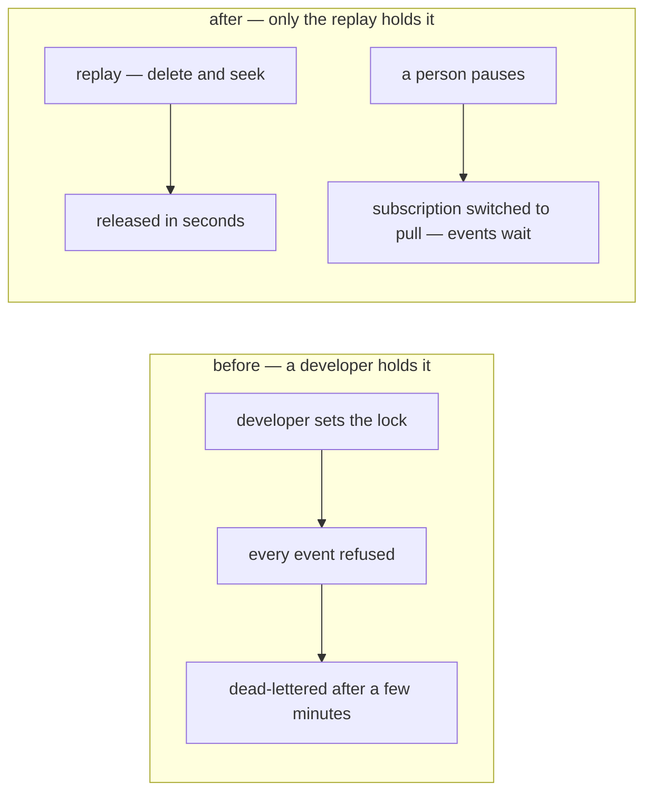

# Clarity — `meta_context.md`

What I read out of [meta_context.md](./meta_context.md). **That doc is yours — this one is mine.**

> 🔄 **Re-examined 2026-09-28** — [only-the-replay-holds-the-lock](./context_decision.md#only-the-replay-holds-the-lock)
> answered Q1: `process_event_lock` is **service state**, set only by the replay, for seconds, and a person
> pauses the fold by switching its subscription to pull. That reverses my own recommendation
> (configuration) and the doc's *"Used when Developer need maintain the event processing"*
> ([Contradiction](#contradiction)). What is left is what happens when the replay dies holding it.

## Critique

| | Problem | → Recommend |
| --- | --- | --- |
| **1** | ✅ **Resolved by the build** — `value` stays text, and an unparseable or missing value is an **error** the webhook surfaces, never *unlocked*. | — |
| **2** | ⛔ **The lock has no lease.** A row, unlike `pg_advisory_lock`, outlives the session that set it. The replay releases it on a context its caller cannot cancel — but a process that DIES between taking and releasing it (a deploy mid-replay) leaves it on for good. Every event is then refused and, after its retries — 5 attempts from a 10 s backoff, a few minutes — dead-lettered. With [the-reconcile-check-is-not-built](./context_decision.md#the-reconcile-check-is-not-built), nothing notices but a stale report. | **Give it a lease** — [Q2](#question). |
| **3** | ✅ **Resolved by the decision** — nobody writes the row but the replay, so no role policy is needed for it. | — |
| **4** | ✅ **Resolved by the build** — the fold reads the lock inside its own transaction, under a share lock. | — |

## Question

1. ✅ **Answered 2026-09-28 — the lock is state, and only the replay holds it**:
   [only-the-replay-holds-the-lock](./context_decision.md#only-the-replay-holds-the-lock). Kept as a line so
   the numbers hold.

2. 🆕 **What releases a lock the replay died holding?**
   **→ I recommend a one-minute lease**: the replay stamps the lock when it takes it, and the fold treats a
   lock older than a minute as released — and logs it loudly. A minute is far above the replay's window (a
   delete and a seek call: seconds) and well inside the retry budget (a few minutes), so a crashed replay
   costs each event one delayed retry instead of filling the dead-letter topic with good ones. No person and
   no command is needed, which keeps [the decision](./context_decision.md#only-the-replay-holds-the-lock)
   true.

## Awaiting

- **`key` is unique and scoped to nothing.** Fine while every key is service-global. Worth saying so
  **now** — *keys are service-global by definition, per-scope state gets its own table* — because the day
  a per-team key appears the uniqueness has to change shape.

# Contradiction

## the lock was drawn as a developer's switch, and is now the replay's alone

> `meta_context.md` §Whats Inside 1 — *"Process Event Lock. Used when Developer need maintain the event
> processing."*
>
> [only-the-replay-holds-the-lock](./context_decision.md#only-the-replay-holds-the-lock) *(2026-09-28)* —
> only `AnalyticReplayCompute` sets it, for seconds; a person pauses the fold by switching the subscription
> to pull.

**Which is wrong: the doc's line — the decision is newer, and was yours.** A developer holding the lock
refuses every event while they work, and past a few minutes those events are dead-lettered, not delayed.

| site | says | whose |
| --- | --- | --- |
| `meta_context.md` §Whats Inside 1 | a developer's maintenance switch | yours |
| `meta_context.md` §General 1 | *"metadata & configuration"* — its one row is now state | yours |
| `00005_settlement_analytics.sql` | the table is *"human-set, service-read"* | shipped comment |
| `analytic_replay_compute.go:45` | *"another replay or a developer's maintenance is in progress"* | shipped error text |

**→ Recommend** §Whats Inside 1 read *"Held by `AnalyticReplayCompute` across its delete and seek. To pause
the fold, switch its subscription to pull."* The two code sites follow in the build
([state report](../../development_state/settlement/context.md)). **What stops it recurring**: a pause stops
DELIVERY and never refuses it — refusing spends the retry budget. That is the rule to write beside any
future lock.

