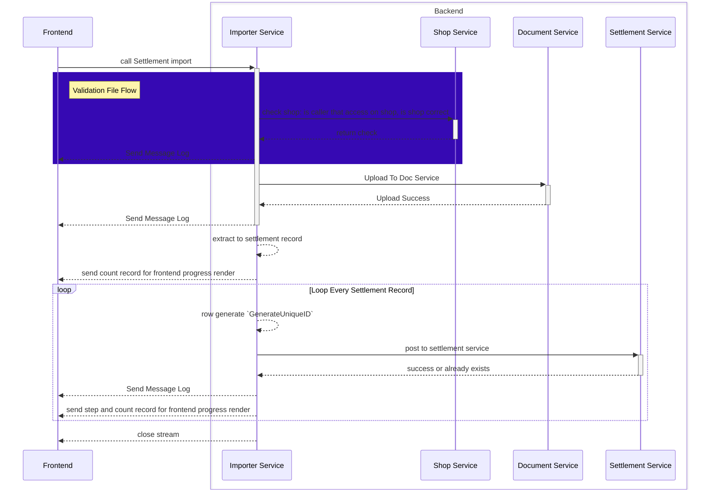
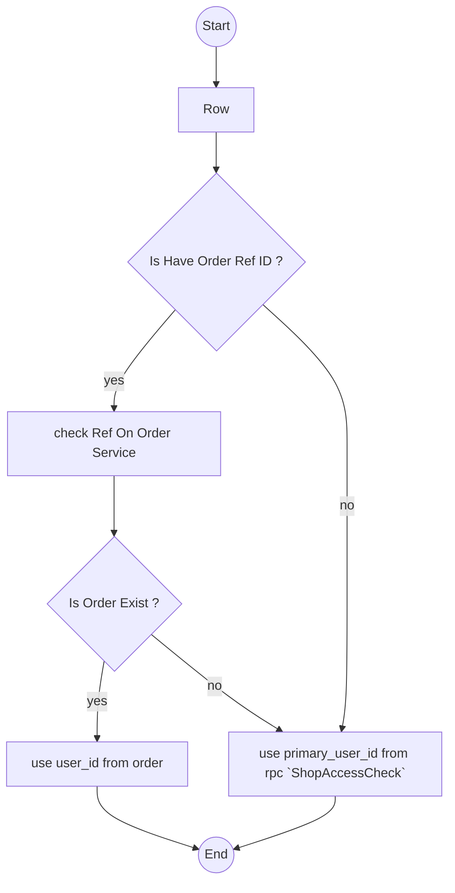

# Settlement Importer Service


## General.
1. we have service that named `settlement_importer_service`
2. for reading excel, we use [Excel Reader](../../technical/packages/excel_readers/context.md)

## Responsbility
1. Provide automatic record settlement from xls file that downloadable by user for external platforms. for now its supported 2 platform :
    - Shopee
    - Tiktok

## Rpc That Must Have.
1. `TiktokSettlementImport(request) return (stream response)`
2. `ShopeeSettlementImport(request) return (stream response)`
3. `UploadedFileList`

## Rpc Detail.
1. Tiktok
```proto

message Payload {
    uint64  shop_id
    bytes   file_content
}

```

2. Shopee
```proto

message Payload {
    uint64  shop_id
    bytes   file_content
}

```

3. For Response Stream 
```proto

enum LogLevel {
    LOG_LEVEL_UNSPECIFIED
    LOG_LEVEL_INFO
    LOG_LEVEL_WARN
    LOG_LEVEL_ERROR
}

message Response {
    LogLevel level
    string message
}

```


## Flow.
1. Check Shop use `ShopAccessCheck`, for more reference use [this](../shop/context.md)


## How We Decide `user_id` in Settlement importer in Every Rows.
