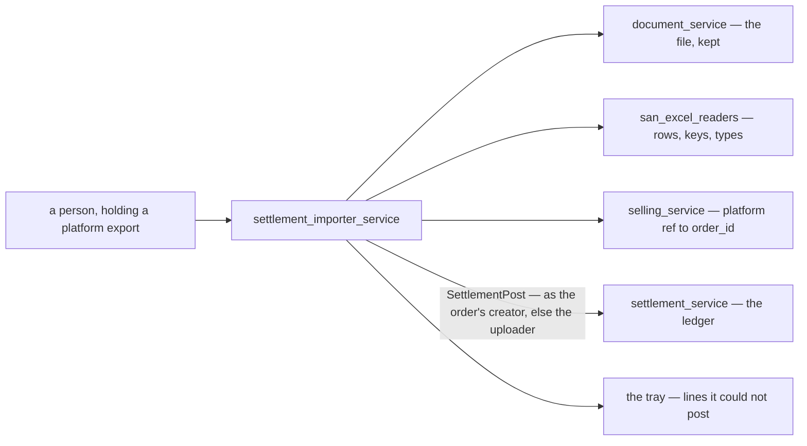
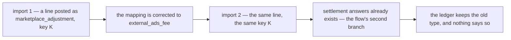
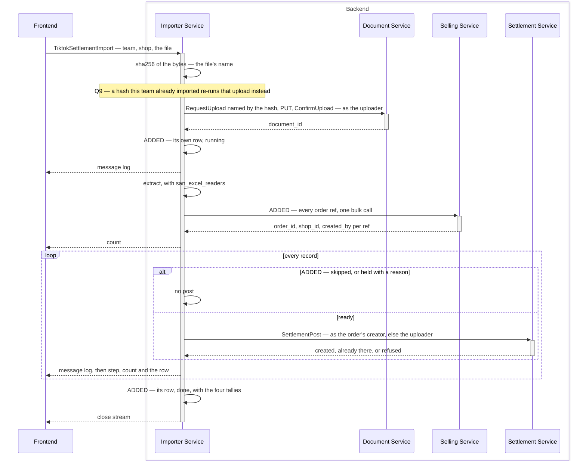
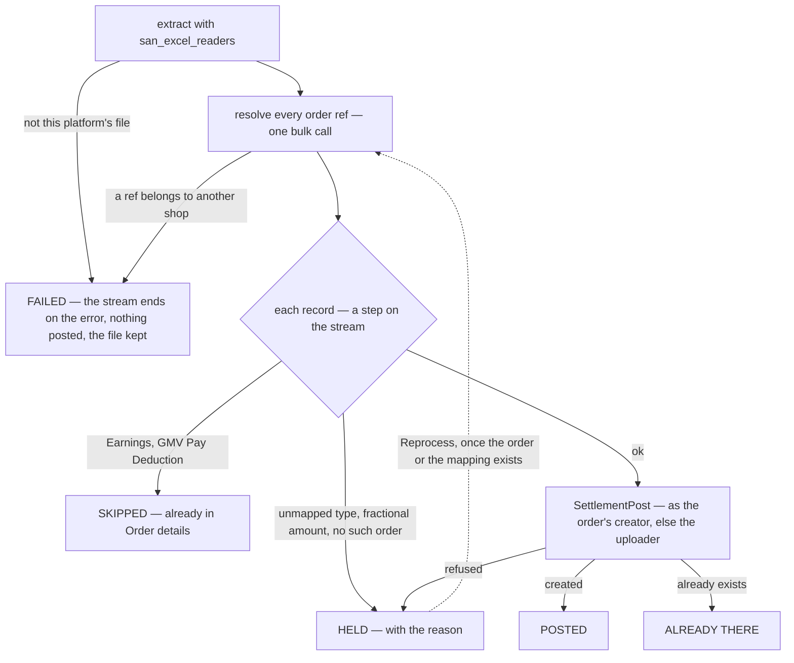
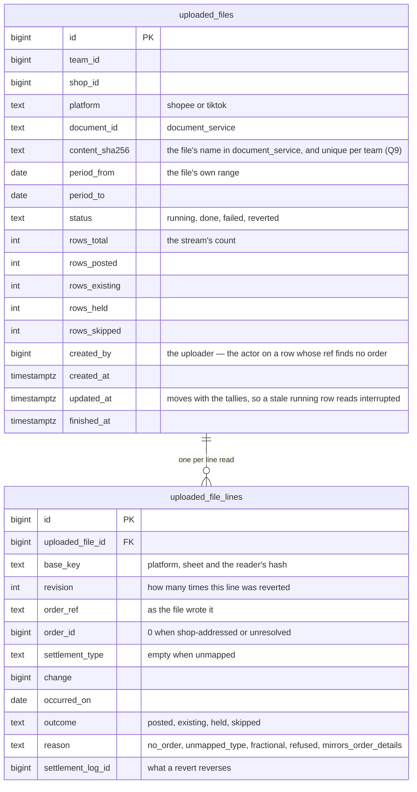
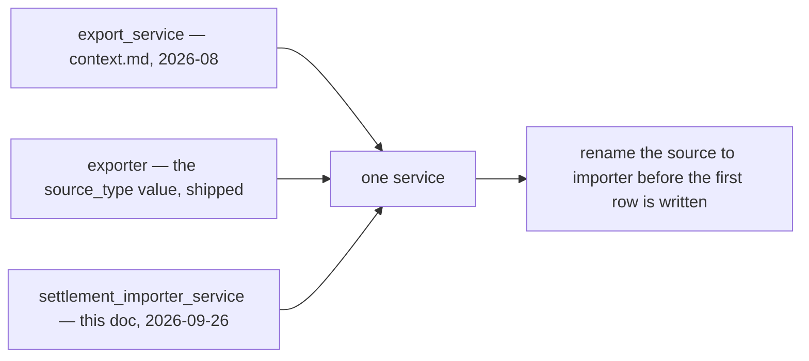
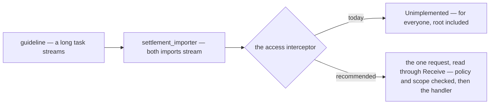
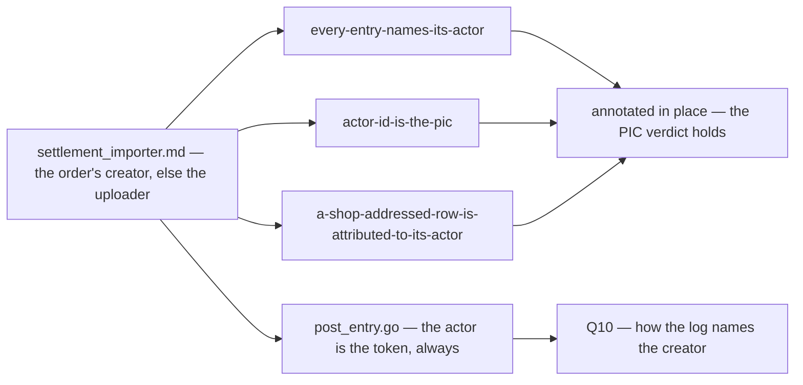

# Clarify — `settlement_importer.md`

What I read out of [settlement_importer.md](./settlement_importer.md), and what has to be settled before
its screens can be drawn. **That doc is yours — this one is mine.** An answered point is deleted; what you
settled is in [settlement_importer_decision.md](./settlement_importer_decision.md).

🔄 **Re-examined again 2026-09-28** — the doc gained `## How We Decide actor_id / user_id`. The rounds
before it made both imports streams, drew the `## Flow` and named the file by its hash — each recorded in
[settlement_importer_decision.md](./settlement_importer_decision.md); what they opened is Q7–Q9 below.

| | |
| --- | --- |
| ✅ recorded | a row whose ref finds an order names that order's creator; any other row names the uploader — [an-imported-row-names-its-orders-creator-else-the-uploader](./settlement_importer_decision.md#an-imported-row-names-its-orders-creator-else-the-uploader). It answers [analytic Q7](./analytic_context_clarify.md#question): the uploader carries an imported shop-level row, and my user-0 recommendation there is declined |
| 🆕 opened | [Q10](#question) — `SettlementPost` takes its actor from the caller's token, so no row can name the order's creator yet |
| 🔄 sharpened | #4 — your section names the lookup, as a query per record · #5 and [Q2](#question) — it posts a ref that finds no order, under the uploader, where I recommend holding it |
| ✅ checked | no new diagram. One new contradiction: [three recorded rows still give an imported row the uploader's login](#the-importer-names-the-orders-creator-and-three-recorded-rows-say-the-login-it-runs-under) |
| ✅ decided, in chat | a TikTok row finds its order by `Related order ID`, on every row — [a-tiktok-row-finds-its-order-by-related-order-id](./settlement_importer_decision.md#a-tiktok-row-finds-its-order-by-related-order-id). On all 2,710 sampled `Order` rows it equals the row's own id, so no lookup finds a different order |

## What the service already owns

The doc is short, but the service is not new. **Four decisions recorded while it was still called
`export_service` already hand it its job:**

| decision | hands this service |
| --- | --- |
| [importing-is-not-settlements-job](./context_decision.md#importing-is-not-settlements-job) | the stored file, the per-platform parser, the **unmatched tray**, the import screens |
| [settlement-keys-on-our-order-id](./context_decision.md#settlement-keys-on-our-order-id) | turning the platform's order ref into our `order_id` — and every way that fails |
| [the-recipe-is-the-callers-problem](./context_decision.md#the-recipe-is-the-callers-problem) | the `unique_id` recipe |
| [actor-id-is-the-pic](./context_decision.md#actor-id-is-the-pic) | a person answers for every row — no machine identity. 🔄 Which person is now [yours](./settlement_importer_decision.md#an-imported-row-names-its-orders-creator-else-the-uploader): the order's creator, else the uploader |

Three things it stands on are **built**: the readers
([san_excel_readers](../../../backend/pkgs/san_excel_readers/)), the write (`SettlementPost`, idempotent on
`unique_id`), and the file store (`document_service`, two-phase upload).

## Critique

Measured against all 26 sample workbooks, not read off the spec.

| # | Problem | → Recommend |
| --- | --- | --- |
| **1** | **RPCs before a person or a job** (HARD RULE 6). 🔄 The flow now starts at `Frontend` — still nobody holding a file. Nothing says who uploads, how often, or what they need back — and *what they need back* is most of this service: every TikTok sample holds rows that must NOT be posted, 5 of 14 hold a type nobody has mapped, and 25 of 26 hold a withdrawal the report cannot take yet. | Name the job — [Q1](#question). The design below is drawn from the likeliest answer. |
| **2** | ⛔ **Whatever a row is posted AS is frozen at its first import.** `unique_id` is global; a repeat returns the stored row unchanged (`created: false`), and a key held by another account is refused (`errUniqueIDTaken`). 🔄 **Your flow draws it**: *"success or already exists"* — a corrected type, grain or shop takes the second branch, and nothing changes (diagram below). | Build **revert** before the first real import — [Q4](#question). |
| **3** | ⛔ **Nothing names the shop.** A TikTok export carries no shop identity anywhere in the file. A Shopee export names a `Username (Penjual)` that our `Shop` does not store. By #2, a file imported into the wrong shop stays there. | **The file names its shop through its orders** — [Q3](#question). |
| **4** | 🔄 **Your new section names the lookup — the flow still does not draw it.** *"query in order by `order_external_ref_id`"* reads as one query per record, and `orders` is `selling_service`'s table, which the importer cannot read (HARD RULE 3). As drawn, every record still posts with no order — shop-addressed, and by #2 for good. The lookup it needs joins on a rule that is decided and not built: [an-order-is-unique-by-shop-and-marketplace-ref](../order/context_decision.md#an-order-is-unique-by-shop-and-marketplace-ref) — the ref is never empty and unique among live orders — while the shipped `order.proto` still says *"NOT unique, and nothing joins on it"*, and `selling_service` has no RPC that takes a ref. | Draw `selling_service` in the flow, between *extract* and the loop: **one bulk call**, `(team_id, refs[])` → `order_id`, `shop_id`, `created_by_user_id` — one answer addresses the row AND names its person. Build the uniqueness rule, and an index, first — the column has neither ([00012](../../../backend/services/selling_service/db_migrations/00012_order_external_ref.sql)). A file is up to ~1,500 refs — one call, never one per record. |
| **5** | **An unmatched line posted to the shop never reaches its order** — by #2, its key is then held by the shop account. 🔄 Your new section posts it, under the uploader. | Hold it in the tray. **Reprocessing the stored file is the retry**: the keys make it safe, so a line posts the day its order exists — [Q2](#question). |
| **6** | **TikTok's withdrawal sheet repeats money the order sheet already has — twice over.** `Earnings` is refused by design ([earnings-is-not-new-money](../../technical/packages/excel_readers/context_decision.md#earnings-is-not-new-money)). I measured the other one: **`GMV Pay Deduction` equals the `GMV Payment for TikTok Ads` rows to the rupiah** in all 3 files that carry it (−9,246,299 · −9,246,299 · −9,189,215), so booking it double-counts the ads fee. Both come back as `ErrNoSettlementTypeMapping` — the same error as a type never seen. | Book `Order details` + `Withdrawal` rows. **Skip** `Earnings` and `GMV Pay Deduction`, and show them as *skipped*, never *held*. The skip list is the importer's: the reader stays a function, the policy lives in its caller. |
| **7** | 🔄 **A record that cannot post must not end the stream.** The flow gives a record two outcomes; the samples give it five — *posted*, *already there*, *refused* by settlement, *held* (no such order · a type nobody mapped · a fractional amount) and *skipped* (#6). The reader refuses an unseen type — correctly. | **Every record gets its step on the stream, and the stream goes on.** Only a FILE-level failure ends it on an error: not this platform's file, or a ref in another shop ([Q3](#question)). Held records post on Reprocess once the mapping ships. |
| **8** | **Money crosses a type boundary.** The reader returns `float64` ([rupiah-is-floating-point](../order/context_decision.md#rupiah-is-floating-point)); `SettlementPost.change` is `int64` whole rupiah. **0 fractional amounts in 26 samples**, all IDR. | **Hold** a fractional amount, never round it — it has never happened, so it means the file is not what we think. Refuse a TikTok file whose stated currency is not `IDR`. |
| **9** | 🆕 **The stream is the import's only watcher.** The flow ends at *"close stream"* and has no branch for a stream that closes FIRST — a tab closed, a phone asleep, a deploy. If the import dies with its request, the file is half-posted and the list shows it *running* for ever. | **Finish whether or not anyone watches** — [Q8](#question). |
| **10** | **A late upload lands on its upload day.** Reports bucket on `posted_on` ([posted-on-buckets-the-report](./context_decision.md#posted-on-buckets-the-report)), which settlement stamps — a month uploaded on the 1st is a month of `fund` on the 1st. | Keep the decision: a past window stays final. Upload **often**, and let the list show each file's own date range so the lag is visible. |
| **11** | **[auto_import.md](./auto_import.md) sits beside this doc as an empty heading** — *"Auto Import Feature."* | If it is this service, drop one of the two. If it is something else — the platforms pulled on a schedule, with no file — say so, because nothing here covers it. |
| **12** | 🆕 ⛔ **Neither import can be called today.** The access interceptor answers every streaming RPC `Unimplemented` — root included — before any policy is read ([interceptor.go:57](../../../backend/services/user_service/access_interceptors/interceptor.go#L57)). The guideline's long-task shape has never been mounted behind the ACL: the one stream in the repo, `san remote`'s `Exec`, has [its own interceptor](../../../tools/san/remote/auth.go#L109). These two would be the first. | Teach the interceptor **server** streams — [Q7](#question), and the [Contradiction](#the-long-task-guideline-streams-and-the-interceptor-refuses-every-stream). |
| **13** | 🆕 **The flow writes nothing `UploadedFileList` could read.** The file goes to `document_service` and the records to settlement; the list's own row is never drawn. | The importer writes **its own row** the moment the upload succeeds — *running* — and moves its tallies as it goes. It is what the list pages over, what the stream sends as progress, and what makes an interrupted import visible (#9). |

⛔ **Blocked outside this doc.** All five types settlement gained on 2026-09-24 are types this service
produces, and `SettlementPost` refuses every one of them —
[the type list grew to thirteen and the contract still takes eight](./context_clarify.md#the-type-list-grew-to-thirteen-and-the-contract-still-takes-eight).
And the commonest shop row, `withdrawal`, breaks the report's position the day it posts —
[settlement Q1](./context_clarify.md#question).

## Recommendation

**Decide the mapping, build revert, then import — in that order.** #2 turns every choice about a row into
a permanent one at its first post, so each question below costs a sentence now and a reversal per row
later. ⛔ **And the interceptor goes before the first handler** (#12): until it learns server streams, the
import answers `Unimplemented` to everyone, root included. Give the service one name before a row carries
the old one ([Contradiction](#contradiction)).

## Proposed Design

### The job

| | |
| --- | --- |
| who | the selling team, **CS and up** — exactly [the-write-set-is-cs-and-up](./context_decision.md#the-write-set-is-cs-and-up), since every row is posted under their token |
| when | after downloading one shop's statement from the platform — **daily** keeps the report's days honest (#10) |
| what they get back | records **posted** · **already there** · **held**, each with its reason · **skipped** |

### The flow — yours, with what it needs added

`ADDED` marks what your flow does not draw yet: the order lookup (#4), the file's own row (#13), and the
records that do not post (#7). The hash step is yours:
[the-file-is-named-by-its-content-hash](./settlement_importer_decision.md#the-file-is-named-by-its-content-hash).

### What happens to a record

### What a line becomes

| `SettlementPost` | Shopee row | TikTok `Order details` row | TikTok `Withdrawal records` row |
| --- | --- | --- | --- |
| `order_id` | `No. Pesanan`, resolved · empty → the shop | ✅ `Related order ID`, resolved ([decided](./settlement_importer_decision.md#a-tiktok-row-finds-its-order-by-related-order-id)) · empty → the shop | the shop |
| `settlement_type` | `SettlementType()` | `SettlementType()` | `withdrawal` · `Earnings`, `GMV Pay Deduction` skipped |
| `change` | `Jumlah` | `Total settlement amount` | `Amount` |
| `occurred_on` | `Tanggal Transaksi`, WIB | `Order settled time` | `Request time` |
| `note` | `Deskripsi` | `Type` | `Reference ID` |
| `actor_id` 🆕 — not a field yet, [Q10](#question) | the order's creator, when `No. Pesanan` finds it · else the uploader | the order's creator, when `Related order ID` finds it · else the uploader | the uploader |
| `created_by_user_id` | from the order lookup | from the order lookup | — |
| every row | `team_id` and `shop_id` from the upload · `source_type` see [Contradiction](#contradiction) | | |

**The key** — `unique_id = <platform>:<sheet>:<GenerateUniqueID()>`, plus `:r<n>` once that line has been
reverted *n* times. The prefix tells a ledger reader which import wrote a row; the suffix lets a reverted
line go back in. ⚠ **The count is kept per LINE, never per file** — overlapping downloads share lines, so a
per-file counter would re-post a line another upload still holds.

### What the stream carries

Your three messages, plus the row they describe:

| field | sent | the screen draws |
| --- | --- | --- |
| `message` | every important step — the guideline's slog line, your *"Send Message Log"* | a log under the bar, folded by default |
| `count` | once, after extraction — *"send count record"* | the end of the bar |
| `step` | after every record | the bar |
| `file` 🆕 | with every `step` — the importer's own row (#13), its four tallies included | the tallies climbing, and the closing line: **what did NOT post**, linking to the file |

`step` of `count` says *how far*. The question the person is left with at the end is *what didn't go in*
(#1) — which is why the row rides along rather than being fetched afterwards.

### The screens — frontend-first

| route | what the person does there |
| --- | --- |
| `/settlement/imports` | **the list** (`UploadedFileList`) — one row per file: shop, platform, the file's own date range, uploaded by and when, status, the four tallies. **Import File** opens a dialog: pick the shop, pick the file. The platform is read off `Shop.marketplace`, so the dialog calls the right RPC without asking. 🔄 **Then the dialog shows the stream** — the bar, the tallies, the log — and ends on what did not post. Closing it early is safe ([Q8](#question)): the row carries on |
| `/settlement/imports/:id` | **one file** — the tallies, the held and skipped lines with their reasons, **Reprocess**, **Revert** (behind a `ConfirmDialog`), download the original |

The recorded decisions also named `/settlement/unmatched`, a tray across all files. **→ Not in v1** — the
per-file view covers it until held lines start outliving their files.

### The contract

| RPC | | |
| --- | --- | --- |
| `ShopeeSettlementImport` · `TiktokSettlementImport` | yours — 🔄 streaming | **in:** `team_id` (scope), `shop_id`, `content` — the file, ≤ 10 MB: the largest sample is 246 KB, and nothing caps a request today (connect-go's default is *any size*). No `filename` — the name is the content hash ([decided](./settlement_importer_decision.md#the-file-is-named-by-its-content-hash)) · **out, per message:** `message`, `step`, `count`, `file`. ⚠ Your signature names the request `response` — I read it as the request |
| `UploadedFileList` | yours | the guideline List shape, paged (RULE 9) — filter by shop, platform, status |
| `UploadedFileLineList` | 🆕 | one file's held and skipped lines, paged |
| `UploadedFileReprocess` | 🆕 | re-run a stored file under the same keys — only what was held can post. **Streams**, same shape: it is the same long task |
| `UploadedFileRevert` | 🆕 | one reversal per row **this** file created, then the file reads `reverted`. Streams too |
| `document_service` | 🆕 one enum value | `DOCUMENT_RESOURCE_TYPE_SETTLEMENT_STATEMENT`, private — a statement lists every order and what the shop took |

Two platform RPCs rather than one is right: the two readers return different items, and the shop already
says which one applies.

### The data — this service's own tables (HARD RULE 3)

## Question

1. **Who uploads, and how often?** It sets the role policy, and decides whether the daily report stays
   readable (#10).
   **→ Recommend CS and up** — the settlement write set, which it has to be, since each row is posted under their token
   — **and daily.**

2. **A ref that finds no order — post it to the shop, or hold it for its order?** 🔄 Your new section gives
   such a row the uploader, so as written it POSTS — shop-addressed, and by #2 for good: enter the order a
   week later and a re-import answers *already there*, the order's own account never sees its `fund`, and
   the per-user report credits the uploader instead of the order's creator. Held, it waits for its order.
   Which is right turns on whether every marketplace order should already be in our system — if yes, a miss
   is an order somebody failed to enter; if no, most never match and a tray only grows.
   **→ Recommend hold** — it is `context.md`'s own first problem, *"we record that twice"*, and the tray
   becomes the check that the two records agree. It clears by entering the order and pressing Reprocess —
   no attaching by hand in v1. Your uploader fallback still covers every row with NO ref: a fee, an ad
   charge, a withdrawal.

3. **Refuse a file whose orders belong to ANOTHER shop?**
   **→ Recommend yes** — resolve every ref across the team, and fail the file before anything posts if one
   lands outside the chosen shop. An order belongs to exactly one shop, so a shop's orders are its
   fingerprint: it works for TikTok, which names no shop, and needs no new column on `Shop`. ⚠ A file with
   no matchable order at all — a new shop — cannot be checked, and posts on the person's word.

4. **May an upload be REVERTED?** Without it, #2 makes a wrong type, grain or shop permanent.
   **→ Recommend yes** — one compensating row per row that upload created, never the *already there* ones
   (another upload owns those), and each reverted line moves to its next revision so it can go back in.
   **Team owner and team admin only**, behind a `ConfirmDialog`.

5. **Does TikTok's affiliate commission get its own `affiliate_fee` row?** It is a column inside `Total
   settlement amount` — in `shipping_issurance.xlsx`, −2,440,317 against +116,445,834 of `fund` (2.1%),
   all of it inside `fund` — so no import ever produces `affiliate_fee`. `gap` is the same either way; only
   the breakdown that [explains it](./context_decision.md#the-measure-is-sales-received-and-gap) changes.
   But by #2 it is decided at the first import.
   **→ Recommend split** — `fund` before the commission, `affiliate_fee` for it, second key
   `…:affiliate_fee`. The type exists to explain the gap, and TikTok is the only source that itemises it.
   ⚠ Shopee's affiliate charges still land in `marketplace_adjustment`, because
   [shopee-maps-on-tipe-transaksi-alone](../../technical/packages/excel_readers/context_decision.md#shopee-maps-on-tipe-transaksi-alone)
   ignores `Deskripsi` — so the two platforms will still differ.

6. **Is a FAILED withdrawal booked?** ➡ Re-routed here from
   [excel_readers Q6](../../technical/packages/excel_readers/context_clarify.md#question), which sent it to
   settlement before this service existed — it never landed in any settlement file. A failed Shopee
   withdrawal is two rows: the debit marked `Gagal`, and its refund a day later. Both are in the platform's
   `Saldo Akhir` chain.
   **→ Recommend booking both** — the pair nets to zero because the amounts do, and skipping the failure
   is what makes a balance disagree with the platform's.

7. **May the access interceptor authorize a SERVER stream?** 🆕 It refuses every stream on the premise
   that it *"cannot read the request body"*
   ([interceptor.go:33](../../../backend/services/user_service/access_interceptors/interceptor.go#L33)). For a
   server stream that is not so: connect-go reads its one request through `conn.Receive` **inside** the
   function the interceptor wraps
   ([handler.go, v1.19.0](https://github.com/connectrpc/connect-go/blob/v1.19.0/handler.go#L192-L211)) — so a
   wrapped `Receive` sees the message before the handler's body runs, and the unary path's policy-and-scope
   check applies unchanged. The comment's own fallback — authorize inside each handler — puts the ACL in
   every long task's code, which is what *"every guarded handler must get the interceptor"* exists to
   prevent.
   **→ Recommend yes, server streams only.** Client and bidi streams stay refused: they carry many
   messages, and "the request" means nothing there. One test proves it — a non-member calling a stream is
   denied before the handler runs. ⚠ What the interceptor cannot do the same way is put the message's scope
   in the handler's `ctx` (`next` is called before `Receive` runs), so a stream handler reads `team_id` off
   its own request. A build detail, not a reason to refuse.

8. **Does the import finish after the person stops watching?** 🆕 A tab closed, a phone asleep, a dropped
   connection — the stream closes first.
   **→ Recommend yes.** Run the posts detached from the request (`context.WithoutCancel`), so the stream is
   a window onto the import, not its lifeline — a half-posted file is the worst outcome on offer: the
   report is wrong and nothing says so. A server killed mid-file (a deploy) leaves a row whose tallies stop
   moving, and the list shows it **interrupted** — derived when listed from `updated_at`, no sweeper.
   Recovery is the keys: import the same file again and every posted record answers *already there* — by
   Q9, into the same row rather than a second one.
   ⚠ The price is that closing the tab does not cancel. With the shop guard (Q3) a wrong file fails before
   anything posts — and nobody has asked for a Cancel.

9. **The same bytes a second time — a second upload, or the first one re-run?** 🆕 Opened by
   [the-file-is-named-by-its-content-hash](./settlement_importer_decision.md#the-file-is-named-by-its-content-hash).
   The name alone dedupes nothing: `document_service` keys every object by a fresh uuid, and nothing is
   unique on `documents.filename` — so one file uploaded twice is two stored copies and two rows in the
   list. It is not rare: it is exactly what Q8's recovery does.
   **→ Recommend: the first one, re-run.** Unique on `(team_id, content_sha256)`, looked up **before** the
   upload. A hit stores nothing and re-runs that upload under the same keys — only what was held can post,
   and a reverted file goes back in at its next revision. A repeat upload and the detail page's
   **Reprocess** become one operation. **The same bytes under another shop are refused**, naming the shop
   they already went into — a statement belongs to one shop, so that is always a mistake, and it is caught
   even for a file whose orders cannot be matched (Q3's gap). ⚠ A copy re-saved through a spreadsheet tool
   is new bytes, so it is a new upload — and its lines answer *already there*.

10. **How does a row come to name the order's creator?** 🆕 Opened by
    [an-imported-row-names-its-orders-creator-else-the-uploader](./settlement_importer_decision.md#an-imported-row-names-its-orders-creator-else-the-uploader).
    `SettlementPost` takes its actor from the caller's token and has no field for anyone else
    ([post_entry.go:39](../../../backend/services/settlement_service/settlement_v1/post_entry.go#L39)), so as
    the contract stands every imported row names the uploader. Two ways out: **(a)** the request gains
    `actor_id`, filled by the importer from its lookup — and then anyone in the write set can post a row
    naming anyone in the team as answerable, by hand or by script; **(b)** settlement names it — an
    `exporter` row addressed to an order takes the creator already stamped on that order's account
    ([the-creator-is-stamped-on-the-state-row](./context_decision.md#the-creator-is-stamped-on-the-state-row)),
    and any other row keeps the caller.
    **→ Recommend (b)** — no new field and nothing to forge, and the log then names the person the per-user
    report already credits an order row to
    ([analytic_fold.go:72](../../../backend/services/settlement_service/settlement_v1/analytic_fold.go#L72)).
    The importer's share is what it does anyway: address the row to the order its ref finds. ⚠ The price:
    the rule lives in settlement, not in the importer your section names.

# Contradiction

## the service has a third name, and the contract still carries the first

> `settlement_importer.md` §General 1 — *"we have service that named `settlement_importer_service`"*
>
> `context.md` §General Brief 3 — *"its `export_service` responsbility"*
>
> `context.md` §Settlement Log Ledger Shapes 3 — `source_type` *"by external service, `exporter`"*

| site | says | whose |
| --- | --- | --- |
| `settlement_importer.md` | `settlement_importer_service` | yours — the newest |
| `context.md` §General Brief 3 | `export_service` | yours |
| `context.md` §Shapes 3 · `settlement.proto` `SOURCE_TYPE_EXPORTER` · the stored text | `exporter` | yours · shipped |
| `technical/architecture/context.md` §Microservice | neither | yours |
| eight decisions in [context_decision.md](./context_decision.md) | `export_service`, 18 times | append-only — they stay |

**Which is wrong: every site but the newest.** The service IMPORTS — *export* is what the platform does to
produce the file.

**→ Recommend** `settlement_importer_service` everywhere, and rename the source to `importer` **now**:
`source_type` is stored as text and **nothing in the product writes `exporter` yet** — only tests,
Storybook fixtures and the frontend adapter name it, ~20 sites. Today the rename is those edits; after the
first import it is those edits plus a data migration. ⚠ Renaming the enum value breaks its JSON name, which
is free only while nothing sends it. **What stops it recurring** is the rule
[already recommended](./context_clarify.md#one-concept-three-service-names-and-each-is-written-down-as-authoritative):
a service is named once, in `architecture/context.md`, and every other doc links there.

## the long-task guideline streams, and the interceptor refuses every stream

> [code-implementation-guideline.md](../../../guidelines/code-implementation-guideline.md#implementation-for-long-running-task-rpc)
> §Long Running Task 1 — *"rpc shape usualy use stream response like `rpc LongTask(...) returns (stream
> LongTaskResponse)`"*
>
> [interceptor.go:33](../../../backend/services/user_service/access_interceptors/interceptor.go#L33) —
> *"There is deliberately NO streaming path … every RPC in this system is unary."*
>
> [CLAUDE.md](../../../CLAUDE.md) §Authorization — *"Streaming RPCs are **refused**, not degraded: a
> streaming interceptor cannot read the request body"*

| site | says | whose |
| --- | --- | --- |
| `guidelines/code-implementation-guideline.md` | a long task streams | yours — programmer-authoritative |
| `settlement_importer.md` §Rpc 1–2 | both imports stream | yours — the first to use it |
| `access_interceptors/interceptor.go:33–65` | every stream → `Unimplemented` | shipped |
| `CLAUDE.md` §Rules that are easy to get wrong · `docs/faq/contract.md:82` · `docs/faq/workflow.md:204` · `tools/san/remote/auth.go:34` | *"refused"* — and why | the repo's instructions · the FAQ, twice · a comment |

**Which is wrong: the interceptor's premise, for server streams.** *"Cannot read the request body"* is true
of client and bidi streams and false of a server stream, whose one message is read through `conn.Receive`
inside the function the interceptor wraps. The refusal was right while nothing streamed; the guideline makes
long tasks stream, and this doc is the first to ask.

**→ Recommend** the interceptor authorizes server streams on their one message ([Q7](#question)), and
`CLAUDE.md`'s rule and both FAQ answers are rewritten in the same commit — *server streams are authorized on
their request; client and bidi streams are refused*. **What stops it recurring** is a test that mounts a server stream behind the
interceptor, so the next long task inherits a path that is proven, not a comment saying there is none.

## the importer names the order's creator, and three recorded rows say the login it runs under

> `settlement_importer.md` §How We Decide `actor_id` / `user_id` — *"query in order by
> `order_external_ref_id`, if not found use user id that carry on identity"*
>
> [every-entry-names-its-actor](./context_decision.md#every-entry-names-its-actor) — *"An exporter run
> therefore posts under the login it runs as"*

| site | says | whose |
| --- | --- | --- |
| `settlement_importer.md` §How We Decide | the order's creator, else the uploader | yours — the newest |
| [every-entry-names-its-actor](./context_decision.md#every-entry-names-its-actor) · [actor-id-is-the-pic](./context_decision.md#actor-id-is-the-pic) | `exporter` → *"the person whose login the exporter runs under"* — one row, written in two decisions | recorded — ✅ annotated |
| [a-shop-addressed-row-is-attributed-to-its-actor](./context_decision.md#a-shop-addressed-row-is-attributed-to-its-actor) | *"`fund`, posted by the exporter"* → *"an operations person"* | recorded — ✅ annotated |
| [post_entry.go:39](../../../backend/services/settlement_service/settlement_v1/post_entry.go#L39) | `ActorID: actorFrom(ctx)` — always the caller | shipped — [Q10](#question) |
| this file | *"as the uploader"* on the flow, the sequence, the outcome chart and the data | mine — ✅ fixed |

**Which is wrong: the recorded rows.** They applied the PIC to an exporter row as *whoever runs it*; your
section applies it as *whoever answers for the order* — which is what
[actor-id-is-the-pic](./context_decision.md#actor-id-is-the-pic)'s own verdict says: *"not merely
whichever session happened to write the row"*.

**→ Recommend** nothing more in the docs — the rows are annotated, and the code follows [Q10](#question).
**What stops it recurring:** the per-source table of who an actor is was written **twice**, word for word,
in two decisions — so this change had to be made twice. A later decision about an actor links to
[actor-id-is-the-pic](./context_decision.md#actor-id-is-the-pic) instead of re-tabling it.

