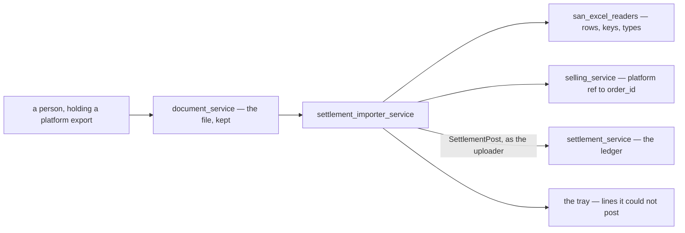
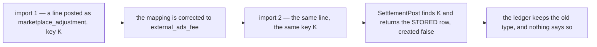
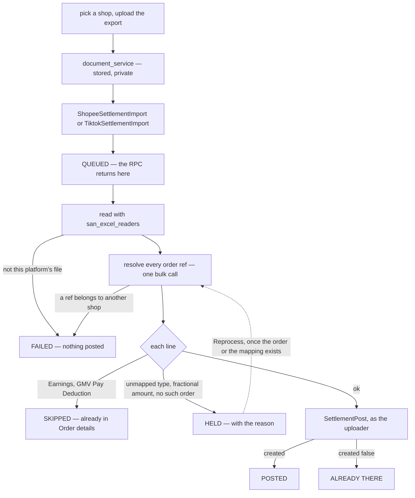
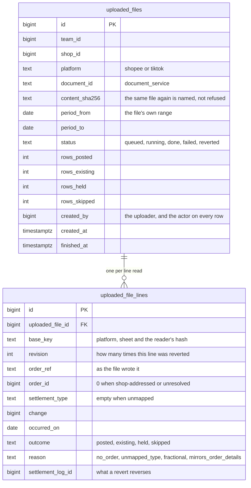
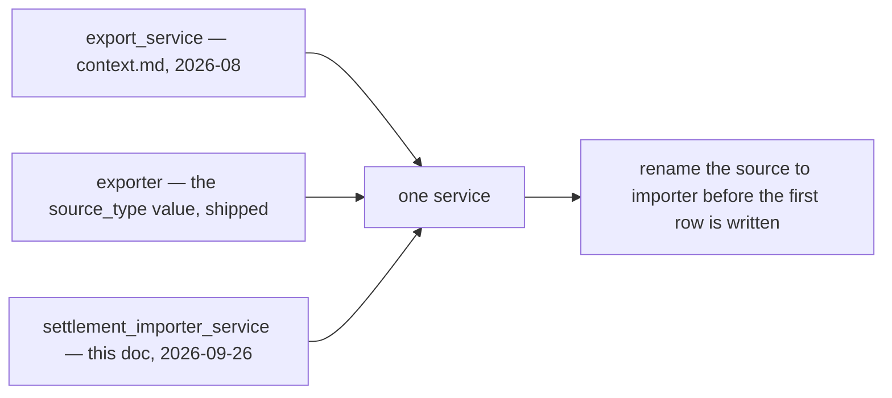

# Clarify — `settlement_importer.md`

What I read out of [settlement_importer.md](./settlement_importer.md), and what has to be settled before
its screens can be drawn. **That doc is yours — this one is mine.** An answered point is deleted.

## What the service already owns

The doc is three lines, but the service is not new. **Four decisions recorded while it was still called
`export_service` already hand it its job:**

| decision | hands this service |
| --- | --- |
| [importing-is-not-settlements-job](./context_decision.md#importing-is-not-settlements-job) | the stored file, the per-platform parser, the **unmatched tray**, the import screens |
| [settlement-keys-on-our-order-id](./context_decision.md#settlement-keys-on-our-order-id) | turning the platform's order ref into our `order_id` — and every way that fails |
| [the-recipe-is-the-callers-problem](./context_decision.md#the-recipe-is-the-callers-problem) | the `unique_id` recipe |
| [actor-id-is-the-pic](./context_decision.md#actor-id-is-the-pic) | it posts **as the person who uploaded** — no machine identity |

Three things it stands on are **built**: the readers
([san_excel_readers](../../../backend/pkgs/san_excel_readers/)), the write (`SettlementPost`, idempotent on
`unique_id`), and the file store (`document_service`, two-phase upload).

## Critique

Measured against all 26 sample workbooks, not read off the spec.

| # | Problem | → Recommend |
| --- | --- | --- |
| **1** | **RPCs before a person or a job** (HARD RULE 6). Nothing says who uploads, how often, or what they need back — and *what they need back* is most of this service: every TikTok sample holds rows that must NOT be posted, 5 of 14 hold a type nobody has mapped, and 25 of 26 hold a withdrawal the report cannot take yet. | Name the job — [Q1](#question). The design below is drawn from the likeliest answer. |
| **2** | ⛔ **Whatever a row is posted AS is frozen at its first import.** `unique_id` is global; a repeat returns the stored row unchanged (`created: false`), and a key held by another account is refused (`errUniqueIDTaken`). So a corrected **type**, **grain** or **shop** re-imports as a silent no-op — diagram below. | Build **revert** before the first real import — [Q4](#question). |
| **3** | ⛔ **Nothing names the shop.** A TikTok export carries no shop identity anywhere in the file. A Shopee export names a `Username (Penjual)` that our `Shop` does not store. By #2, a file imported into the wrong shop stays there. | **The file names its shop through its orders** — [Q3](#question). |
| **4** | **Matching joins on a rule that is decided and not built.** [an-order-is-unique-by-shop-and-marketplace-ref](../order/context_decision.md#an-order-is-unique-by-shop-and-marketplace-ref): the ref is never empty and unique among live orders. The shipped `order.proto` still says *"NOT unique, and nothing joins on it"*, and `selling_service` has no RPC that takes a ref. | Build that rule first, plus one bulk lookup: `(team_id, refs[])` → `order_id`, `shop_id`, `created_by_user_id`. A file is up to ~1,500 refs — one call, never one per row. |
| **5** | **An unmatched line posted to the shop never reaches its order** — by #2, its key is then held by the shop account. | Hold it in the tray. **Reprocessing the stored file is the retry**: the keys make it safe, so a line posts the day its order exists — [Q2](#question). |
| **6** | **TikTok's withdrawal sheet repeats money the order sheet already has — twice over.** `Earnings` is refused by design ([earnings-is-not-new-money](../../technical/packages/excel_readers/context_decision.md#earnings-is-not-new-money)). I measured the other one: **`GMV Pay Deduction` equals the `GMV Payment for TikTok Ads` rows to the rupiah** in all 3 files that carry it (−9,246,299 · −9,246,299 · −9,189,215), so booking it double-counts the ads fee. Both come back as `ErrNoSettlementTypeMapping` — the same error as a type never seen. | Book `Order details` + `Withdrawal` rows. **Skip** `Earnings` and `GMV Pay Deduction`, and show them as *skipped*, never *held*. The skip list is the importer's: the reader stays a function, the policy lives in its caller. |
| **7** | **One unknown type must not stop a file.** Real imports have shown 14 TikTok types and counting, and the reader refuses an unseen one — correctly. | Post every row it can, **hold** the rest with the type named, and reprocess once the mapping ships. |
| **8** | **Money crosses a type boundary.** The reader returns `float64` ([rupiah-is-floating-point](../order/context_decision.md#rupiah-is-floating-point)); `SettlementPost.change` is `int64` whole rupiah. **0 fractional amounts in 26 samples**, all IDR. | **Hold** a fractional amount, never round it — it has never happened, so it means the file is not what we think. Refuse a TikTok file whose stated currency is not `IDR`. |
| **9** | **A file is too big for one request.** Largest samples: 1,463 rows (Shopee, 19 days), 830 + 41 on the withdrawal sheet (TikTok, 26 days). `SettlementPost` is one row per call, 1.8 ms each — at the largest sample's pace a quarter is ~7,000 rows, ~13 s of posts before the request could answer. | **Asynchronous**: the import RPC stores and queues, and returns at once. `UploadedFileList` shows status and counts — which is what gives that list its job. |
| **10** | **A late upload lands on its upload day.** Reports bucket on `posted_on` ([posted-on-buckets-the-report](./context_decision.md#posted-on-buckets-the-report)), which settlement stamps — a month uploaded on the 1st is a month of `fund` on the 1st. | Keep the decision: a past window stays final. Upload **often**, and let the list show each file's own date range so the lag is visible. |
| **11** | **[auto_import.md](./auto_import.md) sits beside this doc as an empty heading** — *"Auto Import Feature."* | If it is this service, drop one of the two. If it is something else — the platforms pulled on a schedule, with no file — say so, because nothing here covers it. |

⛔ **Blocked outside this doc.** All five types settlement gained on 2026-09-24 are types this service
produces, and `SettlementPost` refuses every one of them —
[the type list grew to thirteen and the contract still takes eight](./context_clarify.md#the-type-list-grew-to-thirteen-and-the-contract-still-takes-eight).
And the commonest shop row, `withdrawal`, breaks the report's position the day it posts —
[settlement Q1](./context_clarify.md#question).

## Recommendation

**Decide the mapping, build revert, then import — in that order.** #2 turns every choice about a row into
a permanent one at its first post, so each question below costs a sentence now and a reversal per row
later. And give the service one name before a row carries the old one ([Contradiction](#contradiction)).

## Proposed Design

### The job

| | |
| --- | --- |
| who | the selling team, **CS and up** — exactly [the-write-set-is-cs-and-up](./context_decision.md#the-write-set-is-cs-and-up), since every row posts under their login |
| when | after downloading one shop's statement from the platform — **daily** keeps the report's days honest (#10) |
| what they get back | rows **posted** · **already there** · **held**, each with its reason · **skipped** |

### The flow

### What a line becomes

| `SettlementPost` | Shopee row | TikTok `Order details` row | TikTok `Withdrawal records` row |
| --- | --- | --- | --- |
| `order_id` | `No. Pesanan`, resolved · empty → the shop | `Order`: its own id · otherwise `Related order ID` · empty → the shop | the shop |
| `settlement_type` | `SettlementType()` | `SettlementType()` | `withdrawal` · `Earnings`, `GMV Pay Deduction` skipped |
| `change` | `Jumlah` | `Total settlement amount` | `Amount` |
| `occurred_on` | `Tanggal Transaksi`, WIB | `Order settled time` | `Request time` |
| `note` | `Deskripsi` | `Type` | `Reference ID` |
| `created_by_user_id` | from the order lookup | from the order lookup | — |
| every row | `team_id` and `shop_id` from the upload · `source_type` see [Contradiction](#contradiction) | | |

**The key** — `unique_id = <platform>:<sheet>:<GenerateUniqueID()>`, plus `:r<n>` once that line has been
reverted *n* times. The prefix tells a ledger reader which import wrote a row; the suffix lets a reverted
line go back in. ⚠ **The count is kept per LINE, never per file** — overlapping downloads share lines, so a
per-file counter would re-post a line another upload still holds.

### The screens — frontend-first

| route | what the person does there |
| --- | --- |
| `/settlement/imports` | **the list** (`UploadedFileList`) — one row per file: shop, platform, the file's own date range, uploaded by and when, status, the four counts. **Import File** opens a dialog: pick the shop, pick the file. The platform is read off `Shop.marketplace`, so the dialog calls the right RPC without asking |
| `/settlement/imports/:id` | **one file** — the counts, the held and skipped lines with their reasons, **Reprocess**, **Revert** (behind a `ConfirmDialog`), download the original |

The recorded decisions also named `/settlement/unmatched`, a tray across all files. **→ Not in v1** — the
per-file view covers it until held lines start outliving their files.

### The contract

| RPC | | |
| --- | --- | --- |
| `ShopeeSettlementImport` · `TiktokSettlementImport` | yours | `team_id` (scope), `shop_id`, `document_id` → the `UploadedFile`, status `queued` |
| `UploadedFileList` | yours | the guideline List shape, paged (RULE 9) — filter by shop, platform, status |
| `UploadedFileLineList` | 🆕 | one file's held and skipped lines, paged |
| `UploadedFileReprocess` | 🆕 | re-run a stored file under the same keys — only what was held can post |
| `UploadedFileRevert` | 🆕 | one reversal per row **this** file created, then the file reads `reverted` |

Two platform RPCs rather than one is right: the two readers return different items, and the shop already
says which one applies.

### The data — this service's own tables (HARD RULE 3)

## Question

1. **Who uploads, and how often?** It sets the role policy, and decides whether the daily report stays
   readable (#10).
   **→ Recommend CS and up** — the settlement write set, which it has to be, since each row posts as them
   — **and daily.**

2. **Should every marketplace order already be in our system?** It decides what a line held as *no such
   order* MEANS. If yes, each one is an order somebody failed to enter: a work queue, and the tray is a
   screen people clear. If no, most will never match and the tray only grows.
   **→ Recommend yes** — it is `context.md`'s own first problem, *"we record that twice"*, and the tray
   becomes the check that the two records agree. It clears by entering the order and pressing Reprocess —
   no attaching by hand in v1.

3. **Refuse a file whose orders belong to ANOTHER shop?**
   **→ Recommend yes** — resolve every ref across the team, and fail the file before anything posts if one
   lands outside the chosen shop. An order belongs to exactly one shop, so a shop's orders are its
   fingerprint: it works for TikTok, which names no shop, and needs no new column on `Shop`. ⚠ A file with
   no matchable order at all — a new shop — cannot be checked, and posts on the person's word.

4. **May an upload be REVERTED?** Without it, #2 makes a wrong type, grain or shop permanent.
   **→ Recommend yes** — one compensating row per row that upload created, never the *already there* ones
   (another upload owns those), and each reverted line moves to its next revision so it can go back in.
   **Team owner and team admin only**, behind a `ConfirmDialog`.

5. **Does TikTok's affiliate commission get its own `affiliate_fee` row?** It is a column inside `Total
   settlement amount` — in `shipping_issurance.xlsx`, −2,440,317 against +116,445,834 of `fund` (2.1%),
   all of it inside `fund` — so no import ever produces `affiliate_fee`. `gap` is the same either way; only
   the breakdown that [explains it](./context_decision.md#the-measure-is-sales-received-and-gap) changes.
   But by #2 it is decided at the first import.
   **→ Recommend split** — `fund` before the commission, `affiliate_fee` for it, second key
   `…:affiliate_fee`. The type exists to explain the gap, and TikTok is the only source that itemises it.
   ⚠ Shopee's affiliate charges still land in `marketplace_adjustment`, because
   [shopee-maps-on-tipe-transaksi-alone](../../technical/packages/excel_readers/context_decision.md#shopee-maps-on-tipe-transaksi-alone)
   ignores `Deskripsi` — so the two platforms will still differ.

6. **Is a FAILED withdrawal booked?** ➡ Re-routed here from
   [excel_readers Q6](../../technical/packages/excel_readers/context_clarify.md#question), which sent it to
   settlement before this service existed — it never landed in any settlement file. A failed Shopee
   withdrawal is two rows: the debit marked `Gagal`, and its refund a day later. Both are in the platform's
   `Saldo Akhir` chain.
   **→ Recommend booking both** — the pair nets to zero because the amounts do, and skipping the failure
   is what makes a balance disagree with the platform's.

# Contradiction

## the service has a third name, and the contract still carries the first

> `settlement_importer.md` §General 1 — *"we have service that named `settlement_importer_service`"*
>
> `context.md` §General Brief 3 — *"its `export_service` responsbility"*
>
> `context.md` §Settlement Log Ledger Shapes 3 — `source_type` *"by external service, `exporter`"*

| site | says | whose |
| --- | --- | --- |
| `settlement_importer.md` | `settlement_importer_service` | yours — the newest |
| `context.md` §General Brief 3 | `export_service` | yours |
| `context.md` §Shapes 3 · `settlement.proto` `SOURCE_TYPE_EXPORTER` · the stored text | `exporter` | yours · shipped |
| `technical/architecture/context.md` §Microservice | neither | yours |
| eight decisions in [context_decision.md](./context_decision.md) | `export_service`, 18 times | append-only — they stay |

**Which is wrong: every site but the newest.** The service IMPORTS — *export* is what the platform does to
produce the file.

**→ Recommend** `settlement_importer_service` everywhere, and rename the source to `importer` **now**:
`source_type` is stored as text and **nothing in the product writes `exporter` yet** — only tests,
Storybook fixtures and the frontend adapter name it, ~20 sites. Today the rename is those edits; after the
first import it is those edits plus a data migration. ⚠ Renaming the enum value breaks its JSON name, which
is free only while nothing sends it. **What stops it recurring** is the rule
[already recommended](./context_clarify.md#one-concept-three-service-names-and-each-is-written-down-as-authoritative):
a service is named once, in `architecture/context.md`, and every other doc links there.

