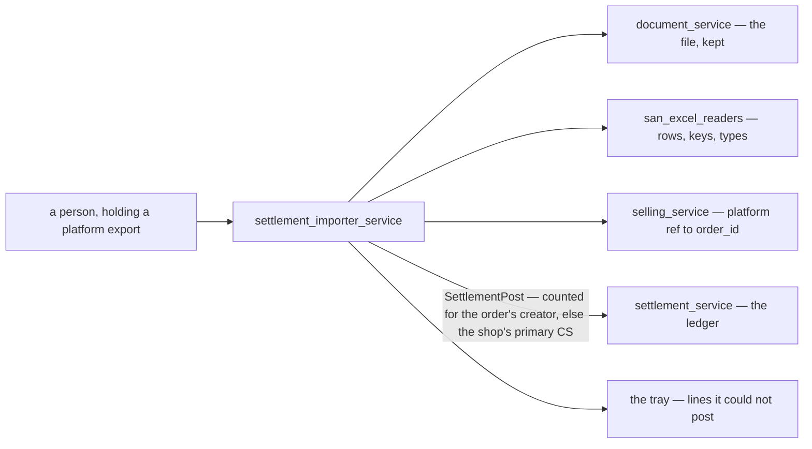
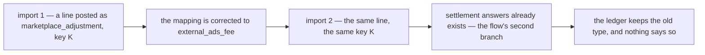
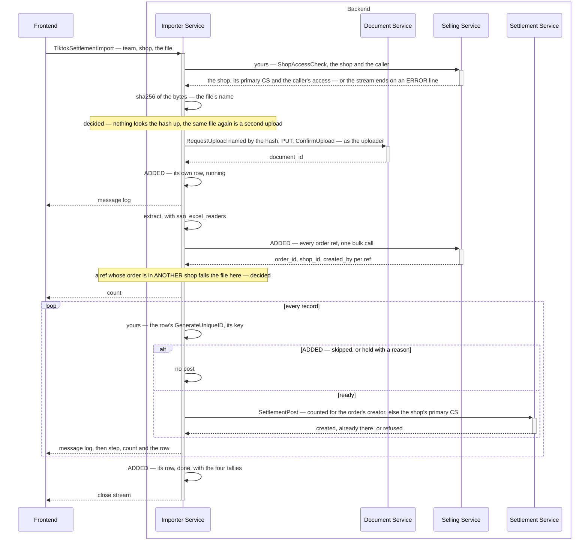
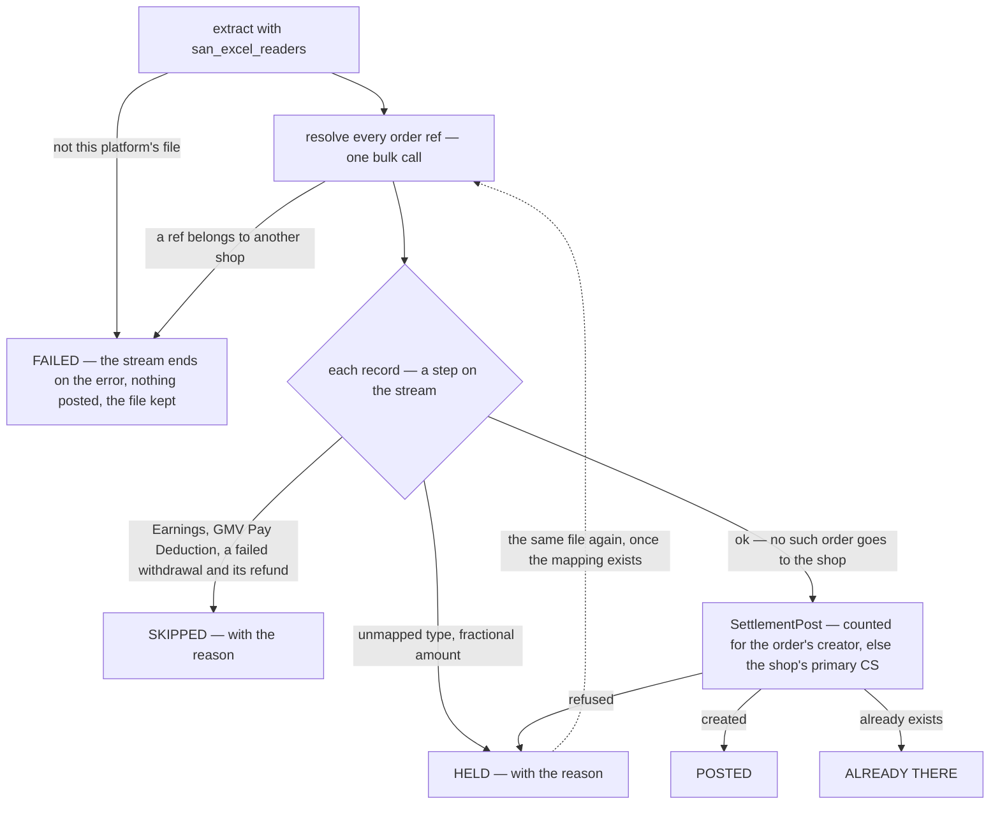
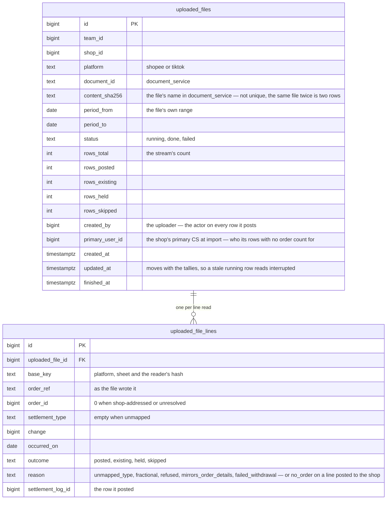
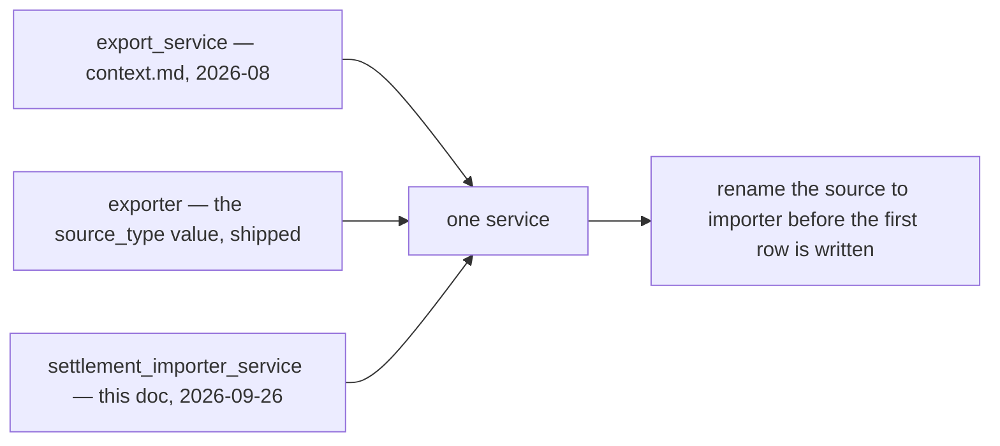
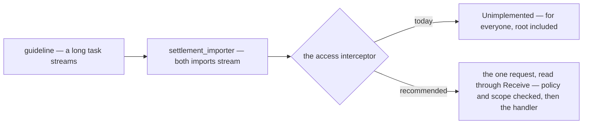
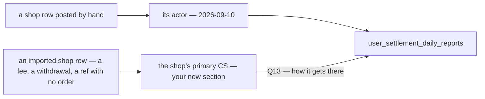
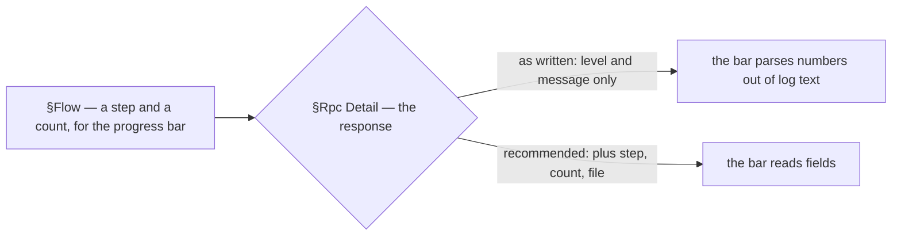
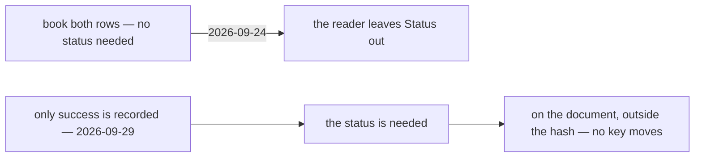

# Clarify — `settlement_importer.md`

What I read out of [settlement_importer.md](./settlement_importer.md), and what has to be settled before
its screens can be drawn. **That doc is yours — this one is mine.** An answered point is deleted; what you
settled is in [settlement_importer_decision.md](./settlement_importer_decision.md).

🔄 **Your doc changed, 2026-09-29** — §How We Decide `actor_id` / `user_id` became §How We Decide `user_id` in
Settlement importer in Every Rows: a row goes to its order's creator, else to the shop's primary CS from
`ShopAccessCheck` — [user-id-is-the-orders-creator-else-the-shops-primary-cs](./settlement_importer_decision.md#user-id-is-the-orders-creator-else-the-shops-primary-cs). And §Flow 1 names `ShopAccessCheck` as
the shop check. Earlier rounds are recorded in [settlement_importer_decision.md](./settlement_importer_decision.md).

| | |
| --- | --- |
| ✅ recorded | the new rule, superseding the uploader fallback — [superseded-an-imported-row-names-its-orders-creator-else-the-uploader](./settlement_importer_decision.md#superseded-an-imported-row-names-its-orders-creator-else-the-uploader) keeps the record. The shop check is annotated: it is `ShopAccessCheck` |
| ⚠ my reading | the section now names `user_id` only, so the log's `actor_id` stays whoever posted — the uploader. That closes **Q10** |
| 🆕 opened | **Q13** — nothing carries the primary CS to the report. **Q14** — a shop with no primary CS |
| ⛔ contradiction | your 2026-09-10 answer gives every shop row to its actor — [recorded](#an-imported-shop-row-goes-to-the-shops-primary-cs-and-a-shop-row-goes-to-whoever-posted-it). It replaces the old actor contradiction, which your new section settles |
| ✅ checked | your diagram parses. `ShopAccessCheck`'s shape — no `team_id`, the message names — is the shop doc's: [shop critique 10](../shop/context_clarify.md#critique) |

## What the service already owns

The doc is short, but the service is not new. **Four decisions recorded while it was still called
`export_service` already hand it its job:**

| decision | hands this service |
| --- | --- |
| [importing-is-not-settlements-job](./context_decision.md#importing-is-not-settlements-job) | the stored file, the per-platform parser, the **unmatched tray**, the import screens. 🔄 The tray now holds only what cannot post — a ref with no order posts to the shop ([decided](./settlement_importer_decision.md#an-unmatched-ref-posts-to-the-shop)) |
| [settlement-keys-on-our-order-id](./context_decision.md#settlement-keys-on-our-order-id) | turning the platform's order ref into our `order_id` — and every way that fails |
| [the-recipe-is-the-callers-problem](./context_decision.md#the-recipe-is-the-callers-problem) | the `unique_id` recipe |
| [actor-id-is-the-pic](./context_decision.md#actor-id-is-the-pic) | a person answers for every row — no machine identity. 🔄 Who the report counts a row for is now [yours](./settlement_importer_decision.md#user-id-is-the-orders-creator-else-the-shops-primary-cs): the order's creator, else the shop's primary CS — the actor stays whoever posted, ⚠ my reading |

Three things it stands on are **built**: the readers
([san_excel_readers](../../../backend/pkgs/san_excel_readers/) — ✅ yours now, [the-excel-reader-reads-every-statement](./settlement_importer_decision.md#the-excel-reader-reads-every-statement)), the write (`SettlementPost`, idempotent on
`unique_id`), and the file store (`document_service`, two-phase upload).

## Critique

Measured against all 26 sample workbooks, not read off the spec.

| # | Problem | → Recommend |
| --- | --- | --- |
| **1** | **RPCs before a person or a job** (HARD RULE 6). 🔄 The flow now starts at `Frontend` — still nobody holding a file. Nothing says who uploads, how often, or what they need back — and *what they need back* is most of this service: every TikTok sample holds rows that must NOT be posted, 5 of 14 hold a type nobody has mapped, and 25 of 26 hold a withdrawal the report cannot take yet. | Name the job — [Q1](#question). The design below is drawn from the likeliest answer. |
| **2** | ⛔ **Whatever a row is posted AS is frozen at its first import.** `unique_id` is global; a repeat returns the stored row unchanged (`created: false`), and a key held by another order is refused (`errUniqueIDTaken`) — ⛔ but not one held by another shop ([settlement critique 7](./context_clarify.md#critique)). 🔄 **Your flow draws it**: *"success or already exists"* — a corrected type, grain or shop takes the second branch, and nothing changes (diagram below). | ✅ **Accepted by decision** — no revert ([an-upload-is-never-reverted](./settlement_importer_decision.md#an-upload-is-never-reverted)). So the protection moves BEFORE the post: the shop check and the file check, both decided ([shop](./settlement_importer_decision.md#the-shop-is-checked-before-the-file-is-stored), [file](./settlement_importer_decision.md#a-file-with-another-shops-orders-is-refused)). A dry run is declined for now ([decided](./settlement_importer_decision.md#the-import-has-no-dry-run-for-now)). |
| **4** | 🔄 **Your new section names the lookup — the flow still does not draw it.** *"query in order by `order_external_ref_id`"* reads as one query per record, and `orders` is `selling_service`'s table, which the importer cannot read (HARD RULE 3). As drawn, every record still posts with no order — shop-addressed, and by #2 for good. The lookup it needs joins on a rule that is decided and not built: [an-order-is-unique-by-shop-and-marketplace-ref](../order/context_decision.md#an-order-is-unique-by-shop-and-marketplace-ref) — the ref is never empty and unique among live orders — while the shipped `order.proto` still says *"NOT unique, and nothing joins on it"*, and `selling_service` has no RPC that takes a ref. | Draw `selling_service` in the flow, between *extract* and the loop: **one bulk call**, `(team_id, refs[])` → `order_id`, `shop_id`, `created_by_user_id` — one answer addresses the row AND names its person. Build the uniqueness rule, and an index, first — the column has neither ([00012](../../../backend/services/selling_service/db_migrations/00012_order_external_ref.sql)). A file is up to ~1,500 refs — one call, never one per record. |
| **6** | **TikTok's withdrawal sheet repeats money the order sheet already has — twice over.** `Earnings` is refused by design ([earnings-is-not-new-money](../../technical/packages/excel_readers/context_decision.md#earnings-is-not-new-money)). I measured the other one: **`GMV Pay Deduction` equals the `GMV Payment for TikTok Ads` rows to the rupiah** in all 3 files that carry it (−9,246,299 · −9,246,299 · −9,189,215), so booking it double-counts the ads fee. Both come back as `ErrNoSettlementTypeMapping` — the same error as a type never seen. | Book `Order details` + `Withdrawal` rows. **Skip** `Earnings` and `GMV Pay Deduction`, and show them as *skipped*, never *held*. The skip list is the importer's: the reader stays a function, the policy lives in its caller. ✅ A failed withdrawal and its refund join it ([decided](./settlement_importer_decision.md#only-a-successful-withdrawal-is-recorded)). |
| **7** | 🔄 **A record that cannot post must not end the stream.** The flow gives a record two outcomes; the samples give it five — *posted*, *already there*, *refused* by settlement, *held* (a type nobody mapped · a fractional amount — a ref with no order now posts to the shop, [decided](./settlement_importer_decision.md#an-unmatched-ref-posts-to-the-shop)) and *skipped* (#6). The reader refuses an unseen type — correctly. | **Every record gets its step on the stream, and the stream goes on.** Only a FILE-level failure ends it on an error: not this platform's file, or a ref in another shop ([decided](./settlement_importer_decision.md#a-file-with-another-shops-orders-is-refused)). Held records post when the same file is uploaded again, once the mapping ships ([decided](./settlement_importer_decision.md#the-row-key-is-the-only-dedupe)). |
| **8** | **Money crosses a type boundary.** The reader returns `float64` ([rupiah-is-floating-point](../order/context_decision.md#rupiah-is-floating-point)); `SettlementPost.change` is `int64` whole rupiah. **0 fractional amounts in 26 samples**, all IDR. | **Hold** a fractional amount, never round it — it has never happened, so it means the file is not what we think. Refuse a TikTok file whose stated currency is not `IDR`. |
| **10** | **A late upload lands on its upload day.** Reports bucket on `posted_on` ([posted-on-buckets-the-report](./context_decision.md#posted-on-buckets-the-report)), which settlement stamps — a month uploaded on the 1st is a month of `fund` on the 1st. | Keep the decision: a past window stays final. Upload **often**, and let the list show each file's own date range so the lag is visible. |
| **11** | **[auto_import.md](./auto_import.md) sits beside this doc as an empty heading** — *"Auto Import Feature."* | If it is this service, drop one of the two. If it is something else — the platforms pulled on a schedule, with no file — say so, because nothing here covers it. |
| **13** | 🆕 **The flow writes nothing `UploadedFileList` could read.** The file goes to `document_service` and the records to settlement; the list's own row is never drawn. | The importer writes **its own row** the moment the upload succeeds — *running* — and moves its tallies as it goes. It is what the list pages over, what the stream sends as progress, and what makes an interrupted import visible ([decided](./settlement_importer_decision.md#an-import-finishes-whether-anyone-watches)). |
| **14** | 🆕 **The reader's TikTok key is not settled — and it is this service's key.** Under [hash-the-whole-struct](../../technical/packages/excel_readers/context_decision.md#hash-the-whole-struct) the item's fields ARE its `unique_id`. Your reader doc's `### Tiktok Contract` is Shopee's six columns — none of which a TikTok file has, and no `Related order ID`. The built item is ten TikTok columns, a deviation still waiting on your word ([reader #23](../../technical/packages/excel_readers/context_clarify.md#critique)). And whether a period re-downloaded in TikTok's 2026-09 layout keeps its keys is unmeasured ([the reader's questions](../../technical/packages/excel_readers/context_clarify.md#question)). A key that moves after the first import posts every line again — and with no revert ([decided](./settlement_importer_decision.md#an-upload-is-never-reverted)) nothing removes a post. 🔄 And the row key is now the ONLY dedupe ([decided](./settlement_importer_decision.md#the-row-key-is-the-only-dedupe)). | **Accept the built item as the TikTok contract** — *"tiktok use Related order ID"* already leans on it — and measure one re-download before the first TikTok import. Both belong to the reader's doc: this service only waits on them. |
| **15** | 🆕 ⛔ **The request has no team.** §Rpc Detail's `Payload` is `shop_id` and `file_content`. This service's callers are CS and up — team-level roles — and a team-level role on a message with no `use_scope` field is a dead letter: it is checked against the root team ([CLAUDE.md](../../../CLAUDE.md) §Rules that are easy to get wrong). As written, only root and admin could import, and [the decided stream check](./settlement_importer_decision.md#a-server-stream-is-authorized-on-its-request) has no scope to read. | Add `uint64 team_id = 1` with `use_scope` and `gt = 0` — exactly as `SettlementPostRequest` carries it ([settlement.proto:245](../../../proto/warehouse/settlement/v1/settlement.proto#L245)). |
| **16** | 🆕 ⛔ **Both requests are `Payload`, and both streams send `Response`.** Two messages with one name in one package do not compile, and buf's STANDARD lint — used with no exceptions ([buf.yaml](../../../proto/buf.yaml)) — wants each RPC's own `…Request` and `…Response`. | `TiktokSettlementImportRequest` · `ShopeeSettlementImportRequest` · `TiktokSettlementImportResponse` · `ShopeeSettlementImportResponse` — the same fields under four names. `LogLevel` is one enum they share. |
| **17** | 🆕 ⚠ **Nothing caps `file_content`.** connect-go reads a request of any size by default, and the backend sets no limit. The largest sample is 246 KB. | `(buf.validate.field).bytes.max_len` of 10 MB, and the same limit on the handler's read. |
| **18** | 🆕 **The flow draws only the check's success.** *"check shop … return check"*, then *"Send Message Log"* — a caller who may not work on the shop, or a Shopee shop given a TikTok file, has no branch. | Draw it: an `ERROR` line naming what failed, then the stream ends — before the upload, so nothing is stored. |

⛔ **Blocked outside this doc.** All five types settlement gained on 2026-09-24 are types this service
produces, and `SettlementPost` refuses every one of them —
[the type list grew to thirteen and the contract still takes eight](./context_clarify.md#the-type-list-grew-to-thirteen-and-the-contract-still-takes-eight).
And the commonest shop row, `withdrawal`, breaks the report's position the day it posts —
[settlement Q1](./context_clarify.md#question).

## Recommendation

**Decide the mapping, then import — in that order.** With no revert and no dry run (both decided —
[revert](./settlement_importer_decision.md#an-upload-is-never-reverted), [dry run](./settlement_importer_decision.md#the-import-has-no-dry-run-for-now)), #2 makes every choice about a row permanent at its first post, so
each question below costs a sentence now and a hand-posted correction per row later. What guards an import is
the two decided checks — the shop before the upload, the file's orders before the first post. ⛔ **And the
interceptor change lands before the first handler** — decided ([a-server-stream-is-authorized-on-its-request](./settlement_importer_decision.md#a-server-stream-is-authorized-on-its-request)), not built: until it
is, both imports answer `Unimplemented` to everyone. Give the service one name before a row carries the old
one ([Contradiction](#contradiction)).

## Proposed Design

### The job

| | |
| --- | --- |
| who | the selling team, **CS and up** — exactly [the-write-set-is-cs-and-up](./context_decision.md#the-write-set-is-cs-and-up), since every row is posted under their token |
| when | after downloading one shop's statement from the platform — **daily** keeps the report's days honest (#10) |
| what they get back | records **posted** — to the order, or to the shop when its order is missing · **already there** · **held**, each with its reason · **skipped** |

### The flow — yours, with what it needs added

`ADDED` marks what your flow does not draw yet: the order lookup (#4), the file's own row (#13), and the
records that do not post (#7). The hash step is yours:
[the-file-is-named-by-its-content-hash](./settlement_importer_decision.md#the-file-is-named-by-its-content-hash).

### What happens to a record

### What a line becomes

| `SettlementPost` | Shopee row | TikTok `Order details` row | TikTok `Withdrawal records` row |
| --- | --- | --- | --- |
| `order_id` | `No. Pesanan`, resolved · empty or no such order → the shop | ✅ `Related order ID`, resolved ([decided](./settlement_importer_decision.md#a-tiktok-row-finds-its-order-by-related-order-id)) · empty or no such order → the shop ([decided](./settlement_importer_decision.md#an-unmatched-ref-posts-to-the-shop)) | the shop |
| `settlement_type` | `SettlementType()` — a `Gagal` withdrawal and its refund skipped | `SettlementType()` | `withdrawal` when `Transferred` · `Earnings`, `GMV Pay Deduction` and any other status skipped |
| `change` | `Jumlah` | `Total settlement amount` | `Amount` |
| `occurred_on` | `Tanggal Transaksi`, WIB | `Order settled time` | `Request time` |
| `note` | `Deskripsi` | `Type` | `Reference ID` |
| `actor_id` | the uploader, from the token — ⚠ my reading ([decided](./settlement_importer_decision.md#user-id-is-the-orders-creator-else-the-shops-primary-cs)) | the uploader | the uploader |
| `user_id` — the report's, not a field, [Q13](#question) | the order's creator when `No. Pesanan` finds it — the report already does · else the shop's primary CS | the order's creator when `Related order ID` finds it · else the shop's primary CS | the shop's primary CS |
| `created_by_user_id` | from the order lookup | from the order lookup | — |
| every row | `team_id` and `shop_id` from the upload · `source_type` see [Contradiction](#contradiction) | | |

**The key** — `unique_id = <platform>:<sheet>:<GenerateUniqueID()>`. The prefix tells a ledger reader which
import wrote a row. 🔄 No revision suffix any more: nothing is reverted ([decided](./settlement_importer_decision.md#an-upload-is-never-reverted)). ✅ And it is the only dedupe — a row whose key exists is not posted again ([decided](./settlement_importer_decision.md#the-row-key-is-the-only-dedupe)).

### What the stream carries

Your `level` and `message`, the two numbers your flow sends, and the row they describe:

| field | sent | the screen draws |
| --- | --- | --- |
| `level` ✅ [yours](./settlement_importer_decision.md#every-stream-message-is-a-leveled-log-line) | with every message — `INFO`, `WARN`, `ERROR` | the line's colour. The `WARN` and `ERROR` lines are what the closing summary lists |
| `message` | every important step — the guideline's slog line, your *"Send Message Log"* | a log under the bar, folded by default |
| `count` | once, after extraction — *"send count record"* | the end of the bar |
| `step` | after every record | the bar |
| `file` 🆕 | with every `step` — the importer's own row (#13), its four tallies included | the tallies climbing, and the closing line: **what did NOT post**, linking to the file |

`step` of `count` says *how far*. The question the person is left with at the end is *what didn't go in*
(#1) — which is why the row rides along rather than being fetched afterwards.

### The screens — frontend-first

| route | what the person does there |
| --- | --- |
| `/settlement/imports` | **the list** (`UploadedFileList`) — one row per file: shop, platform, the file's own date range, uploaded by and when, status, the four tallies. **Import File** opens a dialog: pick the shop, pick the file. The platform is read off `Shop.marketplace`, so the dialog calls the right RPC without asking. 🔄 **Then the dialog shows the stream** — the bar, the tallies, the log — and ends on what did not post. Closing it early is safe ([decided](./settlement_importer_decision.md#an-import-finishes-whether-anyone-watches)): the row carries on |
| `/settlement/imports/:id` | **one file** — the tallies, the held and skipped lines with their reasons, the lines posted to the shop because their order was missing, download the original. 🔄 No **Revert** ([decided](./settlement_importer_decision.md#an-upload-is-never-reverted)), and no **Reprocess** — uploading the file again is the retry ([decided](./settlement_importer_decision.md#the-row-key-is-the-only-dedupe)) |

The recorded decisions also named `/settlement/unmatched`, a tray across all files. **→ Not in v1** — the
per-file view covers it until held lines start outliving their files.

### The contract

| RPC | | |
| --- | --- | --- |
| `ShopeeSettlementImport` · `TiktokSettlementImport` | yours — streaming, 🔄 detailed in §Rpc Detail | **in:** ⛔ `team_id` (the scope — missing, #15), `shop_id`, `file_content` — the file, ≤ 10 MB (#17). No `filename` — the name is the content hash ([decided](./settlement_importer_decision.md#the-file-is-named-by-its-content-hash)) · **out, per message:** `level` and `message` ([yours](./settlement_importer_decision.md#every-stream-message-is-a-leveled-log-line)), plus `step`, `count` and `file` ([Contradiction](#the-flow-sends-a-step-and-a-count-and-the-response-has-nowhere-to-put-them)) · ⛔ one request and one response name per RPC (#16) |
| `UploadedFileList` | yours | the guideline List shape, paged (RULE 9) — filter by shop, platform, status |
| `UploadedFileLineList` | 🆕 | one file's lines that did not reach an order — held, skipped, or posted to the shop — paged |
| `UploadedFileReprocess` | 🔄 not in v1 | uploading the same file again is the retry — held lines post once their mapping exists ([decided](./settlement_importer_decision.md#the-row-key-is-the-only-dedupe)) |
| `document_service` | 🆕 one enum value | `DOCUMENT_RESOURCE_TYPE_SETTLEMENT_STATEMENT`, private — a statement lists every order and what the shop took |

Two platform RPCs rather than one is right: the two readers return different items, and the shop already
says which one applies.

### The data — this service's own tables (HARD RULE 3)

## Question

1. **Who uploads, and how often?** It sets the role policy, and decides whether the daily report stays
   readable (#10).
   **→ Recommend CS and up** — the settlement write set, which it has to be, since each row is posted under their token
   — **and daily.**

2. ✅ **Answered 2026-09-28 — a ref that finds no order posts to the shop**, against my recommendation:
   [an-unmatched-ref-posts-to-the-shop](./settlement_importer_decision.md#an-unmatched-ref-posts-to-the-shop). Kept as a line so the numbers hold.

3. ✅ **Answered 2026-09-28 — a file with another shop's orders is refused**:
   [a-file-with-another-shops-orders-is-refused](./settlement_importer_decision.md#a-file-with-another-shops-orders-is-refused). Kept as a line so the numbers hold.

4. ✅ **Answered 2026-09-28 — no revert**, against my recommendation:
   [an-upload-is-never-reverted](./settlement_importer_decision.md#an-upload-is-never-reverted). Kept as a line so the numbers hold.

5. **Does TikTok's affiliate commission get its own `affiliate_fee` row?** It is a column inside `Total
   settlement amount` — in `shipping_issurance.xlsx`, −2,440,317 against +116,445,834 of `fund` (2.1%),
   all of it inside `fund` — so no import ever produces `affiliate_fee`. `gap` is the same either way; only
   the breakdown that [explains it](./context_decision.md#the-measure-is-sales-received-and-gap) changes.
   But by #2 it is decided at the first import.
   **→ Recommend split** — `fund` before the commission, `affiliate_fee` for it, second key
   `…:affiliate_fee`. The type exists to explain the gap, and TikTok is the only source that itemises it.
   ⚠ Shopee's affiliate charges still land in `marketplace_adjustment`, because
   [shopee-maps-on-tipe-transaksi-alone](../../technical/packages/excel_readers/context_decision.md#shopee-maps-on-tipe-transaksi-alone)
   ignores `Deskripsi` — so the two platforms will still differ.

6. ✅ **Answered 2026-09-29 — only a successful withdrawal is recorded**, against my recommendation:
   [only-a-successful-withdrawal-is-recorded](./settlement_importer_decision.md#only-a-successful-withdrawal-is-recorded). Kept as a line so the numbers hold.

7. ✅ **Answered 2026-09-28 — a server stream is authorized on its request**:
   [a-server-stream-is-authorized-on-its-request](./settlement_importer_decision.md#a-server-stream-is-authorized-on-its-request). A build task now. Kept as a line so the numbers hold.

8. ✅ **Answered 2026-09-29 — an import finishes whether anyone watches**:
   [an-import-finishes-whether-anyone-watches](./settlement_importer_decision.md#an-import-finishes-whether-anyone-watches). Kept as a line so the numbers hold.

9. ✅ **Answered 2026-09-29 — the row key is the only dedupe**, against my recommendation:
   [the-row-key-is-the-only-dedupe](./settlement_importer_decision.md#the-row-key-is-the-only-dedupe). Kept as a line so the numbers hold.

10. ✅ **Closed 2026-09-29 by your new §How We Decide `user_id`** — ⚠ my reading: the log's actor stays whoever
    posted, so nothing has to name the creator on it — [user-id-is-the-orders-creator-else-the-shops-primary-cs](./settlement_importer_decision.md#user-id-is-the-orders-creator-else-the-shops-primary-cs). What
    the new section opens is Q13. Kept as a line so the numbers hold.

11. ✅ **Answered 2026-09-28 — no dry run, for now**, against my recommendation:
    [the-import-has-no-dry-run-for-now](./settlement_importer_decision.md#the-import-has-no-dry-run-for-now). Kept as a line so the numbers hold.

12. ➡ **Re-routed 2026-09-28 to [shop Q1](../shop/context_clarify.md#question)** — who may work on a shop is the shop doc's to answer;
    this one only asks. Kept as a line so the numbers hold.

13. **How does an imported shop row reach the shop's primary CS?** 🆕 Opened by
    [user-id-is-the-orders-creator-else-the-shops-primary-cs](./settlement_importer_decision.md#user-id-is-the-orders-creator-else-the-shops-primary-cs). The per-user report counts a shop row for its actor
    ([analytic_fold.go:72](../../../backend/services/settlement_service/settlement_v1/analytic_fold.go#L72)) — the uploader, from the token. Nothing carries the primary CS to it.
    **(a)** `SettlementPost` gains `user_id`, taken on a shop row only: the importer fills it with
    `ShopAccessCheck`'s `primary_user_id`, and the fold counts a shop row for it when set, else for its actor.
    The actor stays the uploader, so who posted is never lost — but anyone who may post can count a shop row for
    anyone in the team. **(b)** settlement asks the shop itself, on every shop row it posts: nothing to misuse, but
    every shop post then waits on `selling_service`, and a shop row posted by hand needs a rule to keep its actor.
    **→ Recommend (a)** — your flow already puts the choice in the importer, the importer already has the answer
    from its shop check, and a wrong count is visible: the actor beside it says who posted.

14. **A shop with no primary CS — refuse the import, or count its rows for the uploader?** 🆕 Opened by
    [user-id-is-the-orders-creator-else-the-shops-primary-cs](./settlement_importer_decision.md#user-id-is-the-orders-creator-else-the-shops-primary-cs). Your flow always ends on a person, but a shop can lose
    its primary — the grant removed, or the person leaving the team ([shop Q7](../shop/context_clarify.md#question)
    recommends *at most one*). Then `primary_user_id` is 0: user 0, the attribution you declined for
    [analytic Q7](./analytic_context_clarify.md#question).
    **→ Recommend refuse**, at the shop check, before the file is stored — an `ERROR` line: *"this shop has no
    primary CS — choose one first"*. A silent fallback to the uploader would bring back the rule you just replaced,
    for some shops only. ⚠ Moot if shop Q7 makes a primary mandatory.

# Contradiction

## the service has a third name, and the contract still carries the first

> `settlement_importer.md` §General 1 — *"we have service that named `settlement_importer_service`"*
>
> `context.md` §General Brief 3 — *"its `export_service` responsbility"*
>
> `context.md` §Settlement Log Ledger Shapes 3 — `source_type` *"by external service, `exporter`"*

| site | says | whose |
| --- | --- | --- |
| `settlement_importer.md` | `settlement_importer_service` | yours — the newest |
| `context.md` §General Brief 3 | `export_service` | yours |
| `context.md` §Shapes 3 · `settlement.proto` `SOURCE_TYPE_EXPORTER` · the stored text | `exporter` | yours · shipped |
| `technical/architecture/context.md` §Microservice | neither | yours |
| eight decisions in [context_decision.md](./context_decision.md) | `export_service`, 18 times | append-only — they stay |

**Which is wrong: every site but the newest.** The service IMPORTS — *export* is what the platform does to
produce the file.

**→ Recommend** `settlement_importer_service` everywhere, and rename the source to `importer` **now**:
`source_type` is stored as text and **nothing in the product writes `exporter` yet** — only tests,
Storybook fixtures and the frontend adapter name it, ~20 sites. Today the rename is those edits; after the
first import it is those edits plus a data migration. ⚠ Renaming the enum value breaks its JSON name, which
is free only while nothing sends it. **What stops it recurring** is the rule
[already recommended](./context_clarify.md#one-concept-three-service-names-and-each-is-written-down-as-authoritative):
a service is named once, in `architecture/context.md`, and every other doc links there.

## the long-task guideline streams, and the interceptor refuses every stream

✅ **Decided 2026-09-28** — [a-server-stream-is-authorized-on-its-request](./settlement_importer_decision.md#a-server-stream-is-authorized-on-its-request). The sites below change in the commit that builds it; until then they describe the code truthfully.

> [code-implementation-guideline.md](../../../guidelines/code-implementation-guideline.md#implementation-for-long-running-task-rpc)
> §Long Running Task 1 — *"rpc shape usualy use stream response like `rpc LongTask(...) returns (stream
> LongTaskResponse)`"*
>
> [interceptor.go:33](../../../backend/services/user_service/access_interceptors/interceptor.go#L33) —
> *"There is deliberately NO streaming path … every RPC in this system is unary."*
>
> [CLAUDE.md](../../../CLAUDE.md) §Authorization — *"Streaming RPCs are **refused**, not degraded: a
> streaming interceptor cannot read the request body"*

| site | says | whose |
| --- | --- | --- |
| `guidelines/code-implementation-guideline.md` | a long task streams | yours — programmer-authoritative |
| `settlement_importer.md` §Rpc 1–2 | both imports stream | yours — the first to use it |
| `access_interceptors/interceptor.go:33–65` | every stream → `Unimplemented` | shipped |
| `CLAUDE.md` §Rules that are easy to get wrong · `docs/faq/contract.md:82` · `docs/faq/workflow.md:204` · `tools/san/remote/auth.go:34` | *"refused"* — and why | the repo's instructions · the FAQ, twice · a comment |

**Which is wrong: the interceptor's premise, for server streams.** *"Cannot read the request body"* is true
of client and bidi streams and false of a server stream, whose one message is read through `conn.Receive`
inside the function the interceptor wraps. The refusal was right while nothing streamed; the guideline makes
long tasks stream, and this doc is the first to ask.

**→ Recommend** the interceptor authorizes server streams on their one message ([Q7](#question)), and
`CLAUDE.md`'s rule and both FAQ answers are rewritten in the same commit — *server streams are authorized on
their request; client and bidi streams are refused*. **What stops it recurring** is a test that mounts a server stream behind the
interceptor, so the next long task inherits a path that is proven, not a comment saying there is none.

## an imported shop row goes to the shop's primary CS, and a shop row goes to whoever posted it

> `settlement_importer.md` §How We Decide `user_id` *(2026-09-29)* — no order ref, or no such order → *"use
> primary_user_id from rpc `ShopAccessCheck`"*
>
> [a-shop-addressed-row-is-attributed-to-its-actor](./context_decision.md#a-shop-addressed-row-is-attributed-to-its-actor)
> *(your answer, 2026-09-10)* — *"its from identity id"*: a shop row counts for the identity that posted it

| site | says | whose |
| --- | --- | --- |
| `settlement_importer.md` §How We Decide `user_id` | an imported row with no order → the shop's primary CS | yours — the newest |
| `a-shop-addressed-row-is-attributed-to-its-actor` | every shop row → its actor, the token | yours, 2026-09-10 — recorded, ✅ annotated |
| [analytic_fold.go:72](../../../backend/services/settlement_service/settlement_v1/analytic_fold.go#L72) | a shop row → its actor | shipped — [Q13](#question) |
| [every-entry-names-its-actor](./context_decision.md#every-entry-names-its-actor) · [actor-id-is-the-pic](./context_decision.md#actor-id-is-the-pic) | an exporter row's actor → the login it runs under | recorded — ✅ right again, by my reading: your section now names `user_id` only. This settles the old actor contradiction |

**Which is wrong: neither — they answer two kinds of shop row.** On 2026-09-10 a shop row was a person's own entry,
and whoever posted it answered for it. An imported shop row is posted by whoever uploads the file, and your section
gives it to the person who answers for the shop.

**→ Recommend** scoping them: a shop row posted by hand stays with its actor, and an imported one goes to the shop's
primary CS, carried as [Q13](#question) decides. **What stops it recurring:** a rule about the per-user report says
which rows it covers — *"a shop row"* was written when only one kind existed.

## the flow sends a step and a count, and the response has nowhere to put them

> `settlement_importer.md` §Flow — *"send count record for frontend progress render"* · *"send step and
> count record for frontend progress render"*
>
> §Rpc Detail 3 — `message Response { LogLevel level  string message }`

| site | says | whose |
| --- | --- | --- |
| §Flow, twice | the stream carries a count, then a step and a count after every record | yours |
| §Rpc Detail 3 | a response is a level and a line of text | yours — the newest |

**Which is wrong: §Rpc Detail, by omission.** The flow's progress bar needs two numbers. With only
`message`, the screen would read them out of log text — which breaks the first time a message is reworded.

**→ Recommend** adding `uint32 step` and `uint32 count` to the response — the guideline allows *"any defined
field"* beside `message` — and the file's own row (#13), so the tallies ride along. **What stops it
recurring:** a number the screen has to parse out of text is a field nobody declared.

## the reader leaves the status out, and the importer now needs it

> [hash-the-whole-struct](../../technical/packages/excel_readers/context_decision.md#hash-the-whole-struct) — *"`Status` is therefore **not carried**. A failed withdrawal and its
> reversal are two rows … accepted, and the balance is still correct because the sign carries it."*
>
> [only-a-successful-withdrawal-is-recorded](./settlement_importer_decision.md#only-a-successful-withdrawal-is-recorded) — *"dont record failed withdrawal, only success"*

| site | says | whose |
| --- | --- | --- |
| the reader's `hash-the-whole-struct` | no status — booking both rows keeps the balance right | recorded — ✅ annotated |
| the reader's clarify, critique 12 and Q6 | *"Book `Gagal` rows at face value"* | the reader's pass — overtaken, left to it |
| [shopee.go](../../../backend/pkgs/san_excel_readers/shopee.go) | reads no `Status` column | built |
| `only-a-successful-withdrawal-is-recorded` | skip a failed withdrawal and its refund | yours — the newest |

**Which is wrong: neither, once the status moves to the document.** The reader left the status out because
booking both rows needed no label; skipping them needs one. Its own rule allows it — *"anything diagnostic
lives on `ShopeeSettlementDocument` instead — the document is never hashed"* — so the item, and every key,
stay as they are.

**→ Recommend** a per-row status on the Shopee document, beside the item and outside the hash. **What stops it
recurring:** a reader decision that drops a column because nobody needs it should name who did not need it —
here it was the booking rule, and the booking rule changed.

