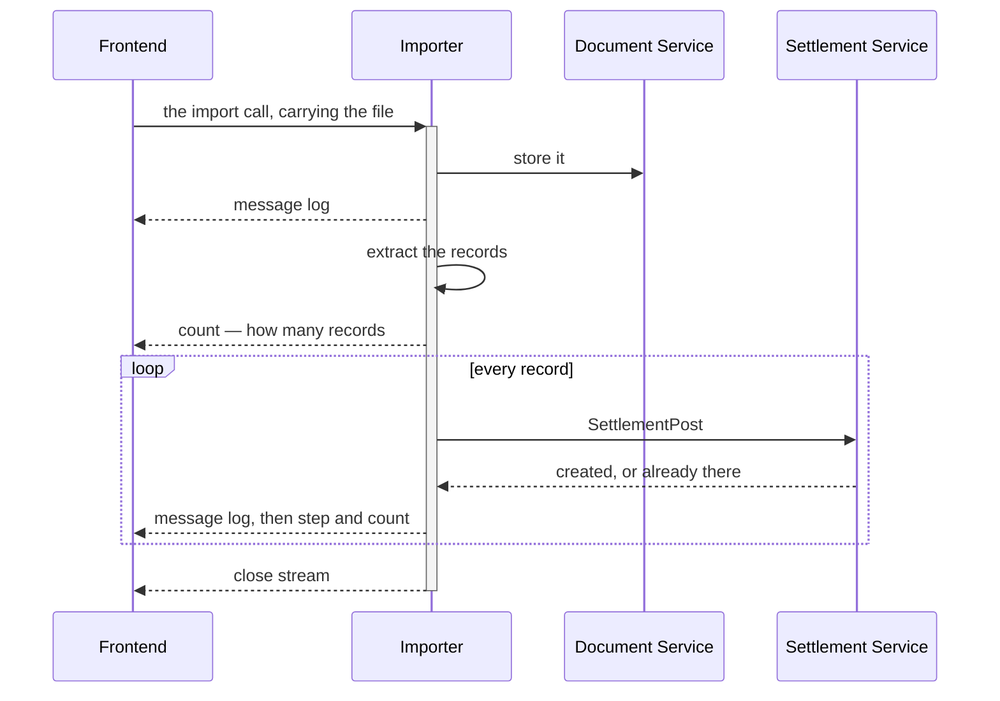
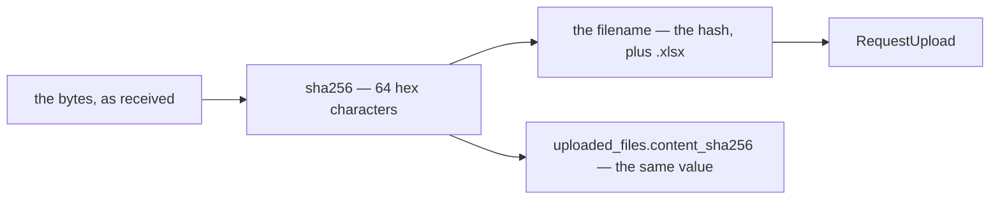
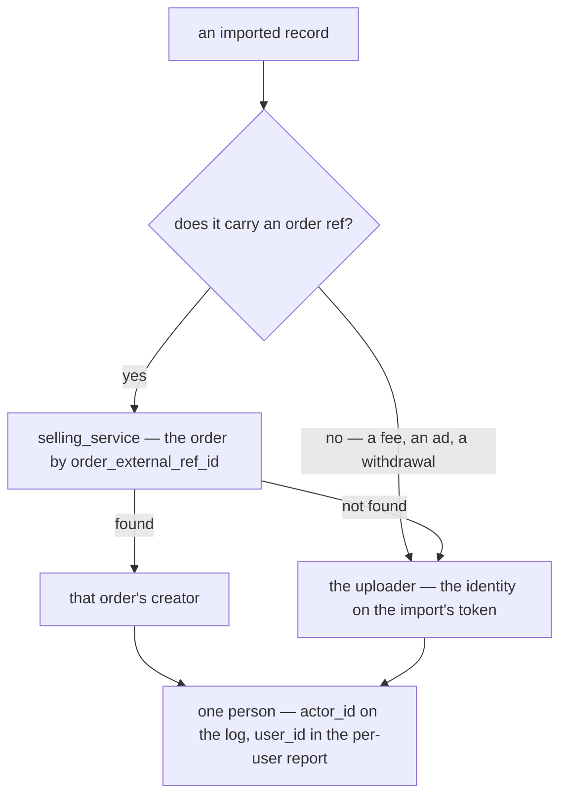
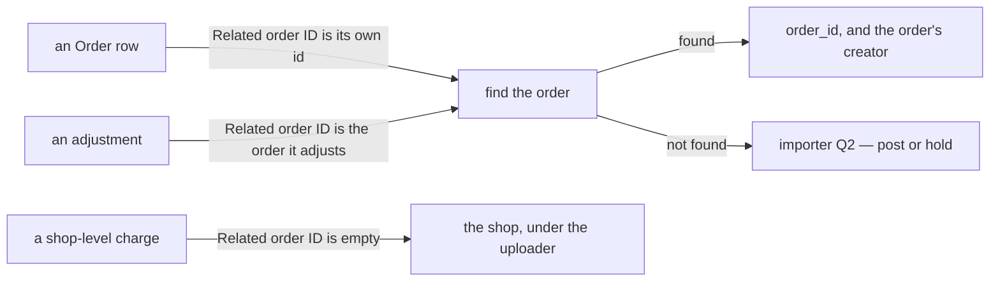

# Decisions — `settlement_importer.md`

What the owner settled, recorded before it is acted on. **Append-only** — a decision that is later
reversed is renamed and its references grepped (RULE 12), never quietly edited away. The open set is
[settlement_importer_clarify.md](./settlement_importer_clarify.md).

| decision | what it decided |
| --- | --- |
| [the-import-is-one-streamed-call](#the-import-is-one-streamed-call) | one server-streaming call per file — the file goes IN the call, is stored, read and posted record by record while the stream reports progress. No queue |
| [the-file-is-named-by-its-content-hash](#the-file-is-named-by-its-content-hash) | the stored statement's filename is the hash of its bytes, computed by the importer — the person's own filename is not sent |
| [an-imported-row-names-its-orders-creator-else-the-uploader](#an-imported-row-names-its-orders-creator-else-the-uploader) | a row whose ref finds an order names that order's creator; any other row names the uploader — one person, both the log's `actor_id` and the per-user report's `user_id` |
| [a-tiktok-row-finds-its-order-by-related-order-id](#a-tiktok-row-finds-its-order-by-related-order-id) | a TikTok row finds its order by `Related order ID`, on every row — never by `Order/adjustment ID`. Empty means the shop |

## the-import-is-one-streamed-call

> `settlement_importer.md` §Rpc That Must Have 1–2 and §Flow *(owner, 2026-09-28)* —
> *"`TiktokSettlementImport(response) return (stream response)`"*, and a flow that uploads to the document
> service, extracts, then loops *"Every Settlement Record"*: post, *"Send Message Log"*, *"send step and
> count record for frontend progress render"* — and *"close stream"*.

**The verdict.** An import is **one server-streaming call per file** — the long-task shape of
[the code guideline](../../../guidelines/code-implementation-guideline.md#implementation-for-long-running-task-rpc).
The file travels in the request. The importer stores it in `document_service` first, extracts the records,
and posts them one by one, streaming a log line and the progress after each. The stream closing is the
import finishing. It **overtakes** the clarify's recommendation to queue the file and return at once.

### The spec

| | |
| --- | --- |
| shape | `rpc TiktokSettlementImport(…Request) returns (stream …Response)` — `ShopeeSettlementImport` the same |
| each response | `message`, the guideline's must-have — one slog line bound to the stream · plus `step` and `count`, so the screen draws progress without parsing a log |
| the file | in the request, not a `document_id`. The importer is therefore `document_service`'s client, through its shipped two-phase contract — `RequestUpload`, PUT, `ConfirmUpload` — under the uploader's own token |
| the order | **stored before it is read** — so a file the reader refuses is still kept, and that is exactly the file a developer needs: `cannot_open.xlsx` was one |
| per record | one `SettlementPost`. *Created* or *already there* is its idempotency on `unique_id`, already built |
| no queue | no worker, and no job table for a screen to poll |

### What it does NOT settle

- ⛔ **How a stream is authorized** — the access interceptor refuses every streaming RPC today:
  [importer Q7](./settlement_importer_clarify.md#question).
- **Whether the import finishes when nobody is watching** — [importer Q8](./settlement_importer_clarify.md#question).
- **A record that cannot post** — the flow draws two outcomes, the samples produce five:
  [critique 7](./settlement_importer_clarify.md#critique).

## the-file-is-named-by-its-content-hash

> Chat *(owner, 2026-09-28)* — *"make filename as content hash"*.

**The verdict.** The statement the importer stores in `document_service` is named by the **hash of its
bytes**, not by whatever the person's file happened to be called. The importer computes it over the bytes it
received; the client sends neither the name nor the hash.

### The spec

| | |
| --- | --- |
| the name | the hash plus `.xlsx`. ⚠ **The extension stays**: `document_service` builds the storage key from the document's uuid and the filename's extension ([tokens.go:83](../../../backend/services/document_service/document_v1/tokens.go#L83)), so a bare hash would store the file with none |
| which hash | **sha256** — ⚠ *content hash* did not say which, so this part is my proposal. Not md5, the row keys' hash: once the hash is an identity ([importer Q9](./settlement_importer_clarify.md#question)), two different files must never share one, and sha256 costs the same. 64 characters, inside the 255 `RequestUpload` allows |
| computed by | the importer, over the bytes it received — never a value the client sends |
| the request | carries **no `filename`** — there is nothing left for it to say |
| the person's own name for the file | not kept. The list tells files apart by shop and date range, which the platform's generated names do not |

### What it does NOT settle

- **What the same bytes do a second time.** The name alone dedupes nothing: `document_service` keys every
  object by a fresh uuid and nothing is unique on `documents.filename`, so one file uploaded twice is two
  stored copies with one name — [importer Q9](./settlement_importer_clarify.md#question).
- ⚠ **The hash names BYTES, not a report.** Measured: 0 of the 26 samples share bytes, and the one re-saved
  pair — `awan_beban_return` and its `_simple` copy — hashes differently. A TikTok export also stamps its own
  `modified` time into the file, so re-downloading a period is new bytes too. What stops those from
  double-posting is the line keys, not the name.

## an-imported-row-names-its-orders-creator-else-the-uploader

> `settlement_importer.md` §How We Decide `actor_id` / `user_id` in Settlement importer *(owner, 2026-09-28)* —
> *"if settlement record have ref id, query in order by `order_external_ref_id`, if not found use user id
> that carry on identity."*

**The verdict.** Every imported row names one person, chosen row by row. A row whose ref finds an order
names **that order's creator**. A row with no ref, or a ref that finds no order, names **the uploader** —
the identity on the import's token. That person is both the log's `actor_id` and the per-user report's
`user_id`.

It answers [analytic Q7](./analytic_context_clarify.md#question): **the uploader carries an imported
shop-level row** — a fee, an ad charge, a withdrawal — in the per-user report, and with
[the-user-carry-is-kept](./context_decision.md#the-user-carry-is-kept), for good. My recommendation there,
user 0, is declined — so the per-user list ranks whoever uploads by the shop-level money they bring in.

### The spec

| | |
| --- | --- |
| the ref | Shopee: `No. Pesanan`. TikTok: `Order/adjustment ID` on an `Order` row, `Related order ID` on any other — an adjustment's own ID names no order. ⚠ My reading: the doc says *ref id*, and a TikTok row carries two · ✅ **Settled** by [a-tiktok-row-finds-its-order-by-related-order-id](#a-tiktok-row-finds-its-order-by-related-order-id): `Related order ID` on every row — the same order, by one rule |
| the lookup | `selling_service`'s, over RPC — `orders` is its table (HARD RULE 3). One call per file, never one per record ([critique 4](./settlement_importer_clarify.md#critique)). ⚠ `order_external_ref_id` is not unique yet: [an-order-is-unique-by-shop-and-marketplace-ref](../order/context_decision.md#an-order-is-unique-by-shop-and-marketplace-ref) is decided and not built |
| the order's creator | `orders.created_by_user_id` — the person settlement stamps on the order's account when it opens ([the-creator-is-stamped-on-the-state-row](./context_decision.md#the-creator-is-stamped-on-the-state-row)) |
| the uploader | the identity on the import's token. It stays on the importer's own row, `uploaded_files.created_by`, whoever each line names — so who brought a file in is never lost |
| the per-user report | **unchanged** — the fold already credits an order row to its creator and a shop row to its actor ([analytic_fold.go:72](../../../backend/services/settlement_service/settlement_v1/analytic_fold.go#L72)). What moves is the LOG: an imported order row's `actor_id` is its creator, not the uploader |

⚠ **It amends three recorded rows** that gave an exporter row *"the person whose login the exporter runs
under"* — in [every-entry-names-its-actor](./context_decision.md#every-entry-names-its-actor),
[actor-id-is-the-pic](./context_decision.md#actor-id-is-the-pic) and
[a-shop-addressed-row-is-attributed-to-its-actor](./context_decision.md#a-shop-addressed-row-is-attributed-to-its-actor).
Each is annotated where it stands. The PIC verdict itself holds, and this is it applied: *"the human
answerable for it, not merely whichever session happened to write the row"*.

### What it does NOT settle

- ⛔ **How the log comes to name the creator.** `SettlementPost` takes its actor from the caller's token and
  has no field for anyone else — [importer Q10](./settlement_importer_clarify.md#question).
- **Whether a ref that finds no order posts at all.** Posted, it lands on the shop for good; held, it waits
  for its order — [importer Q2](./settlement_importer_clarify.md#question).

## a-tiktok-row-finds-its-order-by-related-order-id

> Chat *(owner, 2026-09-28)* — *"tiktok use Related order ID"* — which of a TikTok row's two refs finds its
> order.

**The verdict.** A TikTok `Order details` row finds its order by **`Related order ID`**, on every row —
never by `Order/adjustment ID`. That one lookup addresses the row (`order_id`) and names its person
([an-imported-row-names-its-orders-creator-else-the-uploader](#an-imported-row-names-its-orders-creator-else-the-uploader)). Empty means the row belongs to the shop. It settles the part of that decision's spec
I had flagged as my reading, and finds the same order on every sampled row — by one rule instead of two.

### The spec

| | |
| --- | --- |
| the column | `Related order ID` — `RelatedOrderRefID` on the reader's item |
| on an `Order` row | equal to the row's own id on **all 2,710** sampled — asserted by [TestTiktokAdjustmentsCarryAnAdjustmentID](../../../backend/pkgs/san_excel_readers/tiktok_test.go#L692) |
| on an adjustment | the order it adjusts — **8 of the 23** sampled. Its own `Order/adjustment ID` is an adjustment id, which names no order |
| empty | shop-level — **15 of the 23**: addressed to the shop, and named for the uploader |
| the reader | unchanged — both columns stay on the item, and which one to look up is the importer's call |
