# Decisions — `settlement_importer.md`

What the owner settled, recorded before it is acted on. **Append-only** — a decision that is later
reversed is renamed and its references grepped (RULE 12), never quietly edited away. The open set is
[settlement_importer_clarify.md](./settlement_importer_clarify.md).

| decision | what it decided |
| --- | --- |
| [the-import-is-one-streamed-call](#the-import-is-one-streamed-call) | one server-streaming call per file — the file goes IN the call, is stored, read and posted record by record while the stream reports progress. No queue |
| [the-file-is-named-by-its-content-hash](#the-file-is-named-by-its-content-hash) | the stored statement's filename is the hash of its bytes, computed by the importer — the person's own filename is not sent |
| [superseded-an-imported-row-names-its-orders-creator-else-the-uploader](#superseded-an-imported-row-names-its-orders-creator-else-the-uploader) | ⛔ **superseded in part** by [user-id-is-the-orders-creator-else-the-shops-primary-cs](#user-id-is-the-orders-creator-else-the-shops-primary-cs) — a row whose ref finds an order named that order's creator, any other row the uploader, as both `actor_id` and `user_id` |
| [a-tiktok-row-finds-its-order-by-related-order-id](#a-tiktok-row-finds-its-order-by-related-order-id) | a TikTok row finds its order by `Related order ID`, on every row — never by `Order/adjustment ID`. Empty means the shop |
| [the-excel-reader-reads-every-statement](#the-excel-reader-reads-every-statement) | the importer parses no workbook itself — the Excel Reader package reads every statement, and stays a function: what to skip, look up, key and round is the importer's |
| [a-server-stream-is-authorized-on-its-request](#a-server-stream-is-authorized-on-its-request) | the access interceptor checks a SERVER stream's one request exactly as it checks a unary call. Client and bidi streams stay refused. Not built yet |
| [an-upload-is-never-reverted](#an-upload-is-never-reverted) | no file-level revert — what an import posts stays posted, and a wrong row is corrected by hand, row by row |
| [an-unmatched-ref-posts-to-the-shop](#an-unmatched-ref-posts-to-the-shop) | a ref that finds no order posts to the shop, under the uploader — it is not held |
| [an-import-request-is-a-shop-and-its-file](#an-import-request-is-a-shop-and-its-file) | an import request is the shop and the file's bytes — the same two fields for both platforms |
| [every-stream-message-is-a-leveled-log-line](#every-stream-message-is-a-leveled-log-line) | every message an import streams is a log line with a level — `INFO`, `WARN` or `ERROR` — and its text |
| [the-shop-is-checked-before-the-file-is-stored](#the-shop-is-checked-before-the-file-is-stored) | before the file is stored, the importer asks ShopService whether the caller may work on the shop and whether it is the right shop |
| [a-file-with-another-shops-orders-is-refused](#a-file-with-another-shops-orders-is-refused) | after extraction, a ref whose order is in ANOTHER shop of the team fails the whole file, before anything posts |
| [the-import-has-no-dry-run-for-now](#the-import-has-no-dry-run-for-now) | no dry run — an import posts as it reads. Deferred, not refused |
| [only-a-successful-withdrawal-is-recorded](#only-a-successful-withdrawal-is-recorded) | only a withdrawal that succeeded is recorded — a failed one, and the refund that returns it, are skipped |
| [an-import-finishes-whether-anyone-watches](#an-import-finishes-whether-anyone-watches) | an import finishes whether or not anyone watches — closing the tab ends the stream, never the import. No Cancel, no rollback |
| [the-row-key-is-the-only-dedupe](#the-row-key-is-the-only-dedupe) | duplicates are caught row by row, never file by file — a row whose key is already in the ledger is not posted again, and the same file twice is a second upload |
| [user-id-is-the-orders-creator-else-the-shops-primary-cs](#user-id-is-the-orders-creator-else-the-shops-primary-cs) | a row's `user_id` is its order's creator when its ref finds the order, else the shop's primary CS from `ShopAccessCheck` — decided row by row |
| [settlement-asks-the-shop-for-its-primary-cs](#settlement-asks-the-shop-for-its-primary-cs) | an imported shop row counts for the shop's primary CS, which settlement asks the shop service for and writes on the row — the importer passes no person |

## the-import-is-one-streamed-call

> `settlement_importer.md` §Rpc That Must Have 1–2 and §Flow *(owner, 2026-09-28)* —
> *"`TiktokSettlementImport(response) return (stream response)`"*, and a flow that uploads to the document
> service, extracts, then loops *"Every Settlement Record"*: post, *"Send Message Log"*, *"send step and
> count record for frontend progress render"* — and *"close stream"*.

**The verdict.** An import is **one server-streaming call per file** — the long-task shape of
[the code guideline](../../../guidelines/code-implementation-guideline.md#implementation-for-long-running-task-rpc).
The file travels in the request. The importer stores it in `document_service` first, extracts the records,
and posts them one by one, streaming a log line and the progress after each. The stream closing is the
import finishing. ⚠ **Amended** by [an-import-finishes-whether-anyone-watches](#an-import-finishes-whether-anyone-watches): the server closes it when the import finishes — a client that leaves early closes only its own end. It **overtakes** the clarify's recommendation to queue the file and return at once.

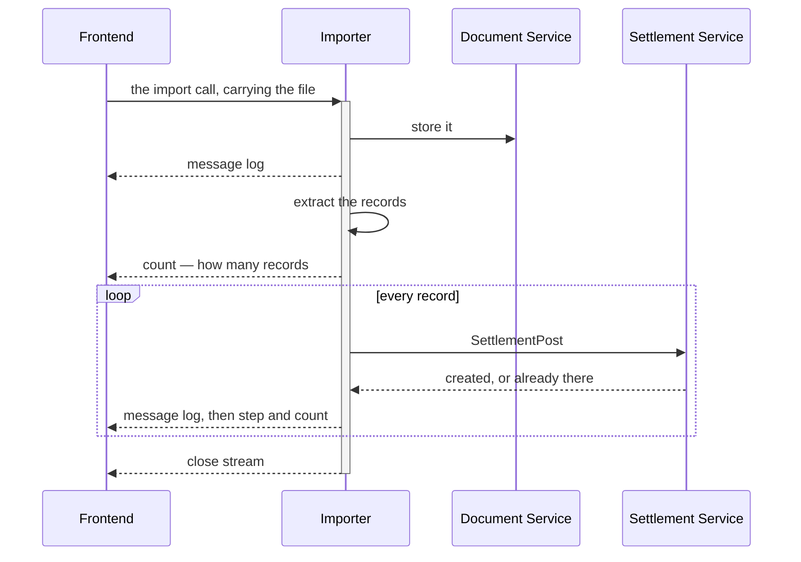

### The spec

| | |
| --- | --- |
| shape | `rpc TiktokSettlementImport(…Request) returns (stream …Response)` — `ShopeeSettlementImport` the same |
| each response | `message`, the guideline's must-have — one slog line bound to the stream · plus `step` and `count`, so the screen draws progress without parsing a log |
| the file | in the request, not a `document_id`. The importer is therefore `document_service`'s client, through its shipped two-phase contract — `RequestUpload`, PUT, `ConfirmUpload` — under the uploader's own token |
| the order | **stored before it is read** — so a file the reader refuses is still kept, and that is exactly the file a developer needs: `cannot_open.xlsx` was one |
| per record | one `SettlementPost`. *Created* or *already there* is its idempotency on `unique_id`, already built |
| no queue | no worker, and no job table for a screen to poll |

### What it does NOT settle

- ⛔ **How a stream is authorized** — the access interceptor refuses every streaming RPC today:
  [importer Q7](./settlement_importer_clarify.md#question). ✅ **Answered** — [a-server-stream-is-authorized-on-its-request](#a-server-stream-is-authorized-on-its-request).
- **Whether the import finishes when nobody is watching** — [importer Q8](./settlement_importer_clarify.md#question). ✅ **Answered** — [an-import-finishes-whether-anyone-watches](#an-import-finishes-whether-anyone-watches).
- **A record that cannot post** — the flow draws two outcomes, the samples produce five:
  [critique 7](./settlement_importer_clarify.md#critique).

## the-file-is-named-by-its-content-hash

> Chat *(owner, 2026-09-28)* — *"make filename as content hash"*.

**The verdict.** The statement the importer stores in `document_service` is named by the **hash of its
bytes**, not by whatever the person's file happened to be called. The importer computes it over the bytes it
received; the client sends neither the name nor the hash.

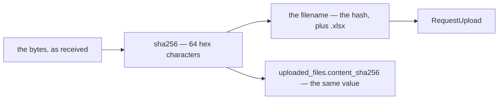

### The spec

| | |
| --- | --- |
| the name | the hash plus `.xlsx`. ⚠ **The extension stays**: `document_service` builds the storage key from the document's uuid and the filename's extension ([tokens.go:83](../../../backend/services/document_service/document_v1/tokens.go#L83)), so a bare hash would store the file with none |
| which hash | **sha256** — ⚠ *content hash* did not say which, so this part is my proposal. Not md5, the row keys' hash: once the hash is an identity ([importer Q9](./settlement_importer_clarify.md#question)), two different files must never share one, and sha256 costs the same. ⚠ **Amended** by [the-row-key-is-the-only-dedupe](#the-row-key-is-the-only-dedupe): the hash never became an identity — sha256 stays, at the same cost. 64 characters, inside the 255 `RequestUpload` allows |
| computed by | the importer, over the bytes it received — never a value the client sends |
| the request | carries **no `filename`** — there is nothing left for it to say |
| the person's own name for the file | not kept. The list tells files apart by shop and date range, which the platform's generated names do not |

### What it does NOT settle

- **What the same bytes do a second time.** The name alone dedupes nothing: `document_service` keys every
  object by a fresh uuid and nothing is unique on `documents.filename`, so one file uploaded twice is two
  stored copies with one name — [importer Q9](./settlement_importer_clarify.md#question). ✅ **Answered** — and that stands: the row
  keys dedupe, never the file ([the-row-key-is-the-only-dedupe](#the-row-key-is-the-only-dedupe)).
- ⚠ **The hash names BYTES, not a report.** Measured: 0 of the 26 samples share bytes, and the one re-saved
  pair — `awan_beban_return` and its `_simple` copy — hashes differently. A TikTok export also stamps its own
  `modified` time into the file, so re-downloading a period is new bytes too. What stops those from
  double-posting is the line keys, not the name.

## superseded-an-imported-row-names-its-orders-creator-else-the-uploader

> ⛔ **SUPERSEDED IN PART (2026-09-29) by [user-id-is-the-orders-creator-else-the-shops-primary-cs](#user-id-is-the-orders-creator-else-the-shops-primary-cs).**
> The owner replaced the section below with one that decides `user_id` only: a row with no order now goes to the
> shop's primary CS, not the uploader — and, by my reading, the log's actor stays whoever posted, so
> [importer Q10](./settlement_importer_clarify.md#question) closes. The order's creator for a row whose ref finds its
> order still stands. Kept as the record, per the header.

> `settlement_importer.md` §How We Decide `actor_id` / `user_id` in Settlement importer *(owner, 2026-09-28)* —
> *"if settlement record have ref id, query in order by `order_external_ref_id`, if not found use user id
> that carry on identity."*

**The verdict.** Every imported row names one person, chosen row by row. A row whose ref finds an order
names **that order's creator**. A row with no ref, or a ref that finds no order, names **the uploader** —
the identity on the import's token. That person is both the log's `actor_id` and the per-user report's
`user_id`.

It answers [analytic Q7](./analytic_context_clarify.md#question): **the uploader carries an imported
shop-level row** — a fee, an ad charge, a withdrawal — in the per-user report, and with
[the-user-carry-is-kept](./context_decision.md#the-user-carry-is-kept), for good. My recommendation there,
user 0, is declined — so the per-user list ranks whoever uploads by the shop-level money they bring in.

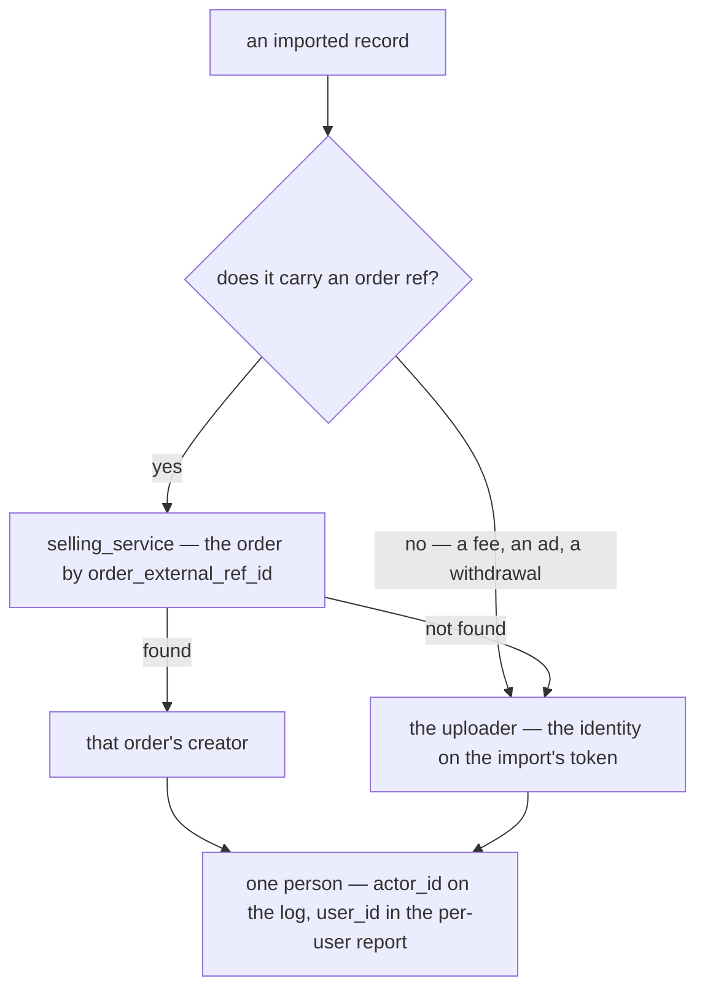

### The spec

| | |
| --- | --- |
| the ref | Shopee: `No. Pesanan`. TikTok: `Order/adjustment ID` on an `Order` row, `Related order ID` on any other — an adjustment's own ID names no order. ⚠ My reading: the doc says *ref id*, and a TikTok row carries two · ✅ **Settled** by [a-tiktok-row-finds-its-order-by-related-order-id](#a-tiktok-row-finds-its-order-by-related-order-id): `Related order ID` on every row — the same order, by one rule |
| the lookup | `selling_service`'s, over RPC — `orders` is its table (HARD RULE 3). One call per file, never one per record ([critique 4](./settlement_importer_clarify.md#critique)). ⚠ `order_external_ref_id` is not unique yet: [an-order-is-unique-by-shop-and-marketplace-ref](../order/context_decision.md#an-order-is-unique-by-shop-and-marketplace-ref) is decided and not built |
| the order's creator | `orders.created_by_user_id` — the person settlement stamps on the order's account when it opens ([the-creator-is-stamped-on-the-state-row](./context_decision.md#the-creator-is-stamped-on-the-state-row)) |
| the uploader | the identity on the import's token. It stays on the importer's own row, `uploaded_files.created_by`, whoever each line names — so who brought a file in is never lost |
| the per-user report | **unchanged** — the fold already credits an order row to its creator and a shop row to its actor ([analytic_fold.go:72](../../../backend/services/settlement_service/settlement_v1/analytic_fold.go#L72)). What moves is the LOG: an imported order row's `actor_id` is its creator, not the uploader |

⚠ **It amends three recorded rows** that gave an exporter row *"the person whose login the exporter runs
under"* — in [every-entry-names-its-actor](./context_decision.md#every-entry-names-its-actor),
[actor-id-is-the-pic](./context_decision.md#actor-id-is-the-pic) and
[a-shop-addressed-row-is-attributed-to-its-actor](./context_decision.md#a-shop-addressed-row-is-attributed-to-its-actor).
Each is annotated where it stands. The PIC verdict itself holds, and this is it applied: *"the human
answerable for it, not merely whichever session happened to write the row"*.

### What it does NOT settle

- ⛔ **How the log comes to name the creator.** `SettlementPost` takes its actor from the caller's token and
  has no field for anyone else — [importer Q10](./settlement_importer_clarify.md#question).
- **Whether a ref that finds no order posts at all.** Posted, it lands on the shop for good; held, it waits
  for its order — [importer Q2](./settlement_importer_clarify.md#question). ✅ **Answered** — [an-unmatched-ref-posts-to-the-shop](#an-unmatched-ref-posts-to-the-shop): it posts.

## a-tiktok-row-finds-its-order-by-related-order-id

> Chat *(owner, 2026-09-28)* — *"tiktok use Related order ID"* — which of a TikTok row's two refs finds its
> order.

**The verdict.** A TikTok `Order details` row finds its order by **`Related order ID`**, on every row —
never by `Order/adjustment ID`. That one lookup addresses the row (`order_id`) and names its person
([superseded-an-imported-row-names-its-orders-creator-else-the-uploader](#superseded-an-imported-row-names-its-orders-creator-else-the-uploader) · 🔄 now [user-id-is-the-orders-creator-else-the-shops-primary-cs](#user-id-is-the-orders-creator-else-the-shops-primary-cs)). Empty means the row belongs to the shop. It settles the part of that decision's spec
I had flagged as my reading, and finds the same order on every sampled row — by one rule instead of two.

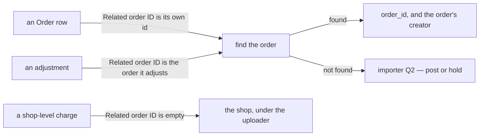

### The spec

| | |
| --- | --- |
| the column | `Related order ID` — `RelatedOrderRefID` on the reader's item |
| on an `Order` row | equal to the row's own id on **all 2,710** sampled — asserted by [TestTiktokAdjustmentsCarryAnAdjustmentID](../../../backend/pkgs/san_excel_readers/tiktok_test.go#L692) |
| on an adjustment | the order it adjusts — **8 of the 23** sampled. Its own `Order/adjustment ID` is an adjustment id, which names no order |
| empty | shop-level — **15 of the 23**: addressed to the shop, and named for the uploader |
| the reader | unchanged — both columns stay on the item, and which one to look up is the importer's call |

## the-excel-reader-reads-every-statement

> `settlement_importer.md` §General 2 *(owner, 2026-09-28)* — *"for reading excel, we use
> [Excel Reader](../../technical/packages/excel_readers/context.md)"*.

**The verdict.** The importer parses no workbook itself. Every statement is read by the Excel Reader
package — [`san_excel_readers`](../../../backend/pkgs/san_excel_readers/), one reader per platform — and the
importer works on the items it returns. The package stays a **function**: what to skip, which ref finds an
order, the key's prefix and the whole-rupiah conversion are the importer's policy, never the reader's. It
is what this design already drew, so nothing changes shape.

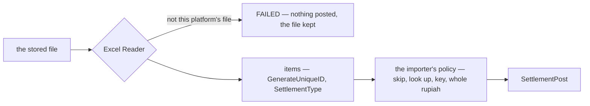

### The spec

| | |
| --- | --- |
| Shopee | `NewShopeeSettlementDocument` → `GetItems()`. `GetShopUsername()` names the seller account the file was exported for |
| TikTok | `NewTiktokSettlementDocument` → `GetItems()` (`Order details`) and `GetWithdrawals()` (`Withdrawal records`). `GetCurrency()` is the IDR check ([critique 8](./settlement_importer_clarify.md#critique)) |
| per item | `GenerateUniqueID()` — the base of the importer's key · `SettlementType()` |
| the reader's refusals | `ErrNotShopeeReport` / `ErrNotTiktokReport` → the file FAILS, nothing posted · `ErrNoSettlementTypeMapping` → the line is HELD, or SKIPPED when the skip list names it ([critique 6](./settlement_importer_clarify.md#critique)). Never a panic: the vocabulary is open, and one new type must not end a file |
| the importer's policy, not the reader's | the skip list · [a-tiktok-row-finds-its-order-by-related-order-id](#a-tiktok-row-finds-its-order-by-related-order-id) · the key's `<platform>:<sheet>:` prefix · `float64` → whole rupiah ([critique 8](./settlement_importer_clarify.md#critique)) |

### What it does NOT settle

- ⛔ **The TikTok key.** The reader's item IS its key, the reader doc's TikTok struct is Shopee's six columns,
  and the built one is a deviation still waiting on your word — [critique 14](./settlement_importer_clarify.md#critique).

## a-server-stream-is-authorized-on-its-request

> Chat *(owner, 2026-09-28)* — *"for q 7 yes"*, to [importer Q7](./settlement_importer_clarify.md#question):
> may the access interceptor authorize a SERVER stream?

**The verdict.** The access interceptor authorizes a **server stream** on its one request: when that request
is read, the same policy and team-scope check a unary call gets runs on it, before the handler's body does
anything. **Client and bidi streams stay refused** — they carry many messages, and "the request" means
nothing there. Both imports become callable once it is built.

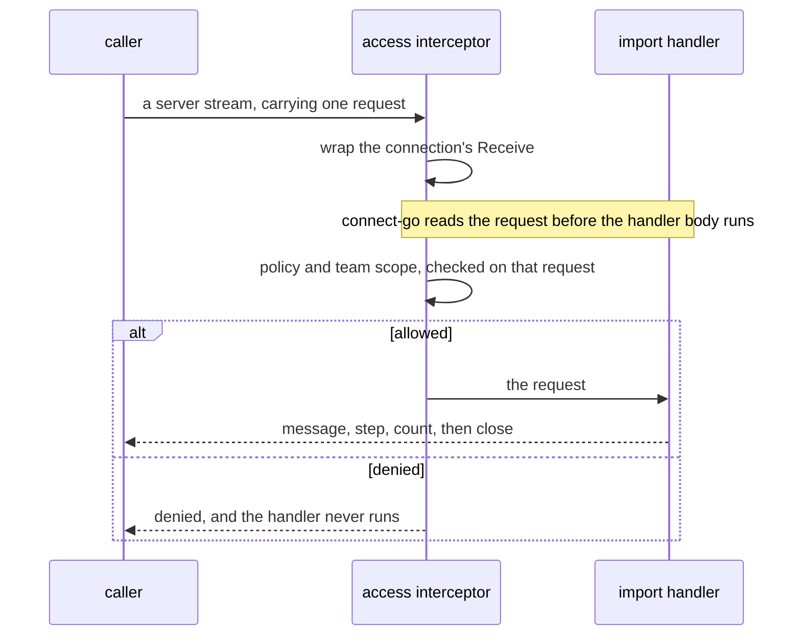

### The spec

| | |
| --- | --- |
| which streams | **server** streams only. Client and bidi streams stay `Unimplemented` |
| where | the access interceptor ([interceptor.go:57](../../../backend/services/user_service/access_interceptors/interceptor.go#L57)) wraps the stream's connection, and its first `Receive` runs the check a unary call gets — policy, then team scope — unchanged |
| the scope in `ctx` | not available: `next` is called before `Receive` decodes the request, so a stream handler reads `team_id` off its own request |
| the proof | one test — a non-member calling a mounted server stream is refused before the handler runs, and a member streams |
| in the same commit | `CLAUDE.md` §Rules that are easy to get wrong, [docs/faq/contract.md:82](../../faq/contract.md#L82) and [docs/faq/workflow.md:204](../../faq/workflow.md#L204) — *server streams are authorized on their request, client and bidi streams are refused* — and the comment at [tools/san/remote/auth.go:34](../../../tools/san/remote/auth.go#L34) |
| ⛔ state | **not built** — the interceptor still refuses, so both imports answer `Unimplemented` until this lands |

## an-upload-is-never-reverted

> Chat *(owner, 2026-09-28)* — *"for q4, no, revert cost is hard"*, to
> [importer Q4](./settlement_importer_clarify.md#question): may an upload be reverted?

**The verdict.** There is **no file-level revert**. What an import posts stays posted — no
`UploadedFileRevert`, no `reverted` status, no revision suffix on a key. A wrong row is corrected the way
every settlement row is: a new row, by hand ([a-correction-is-a-new-row](./context_decision.md#a-correction-is-a-new-row)).
It **declines my recommendation**: a compensating row per row, a revision per line and a status to track
them cost more than they are worth to you.

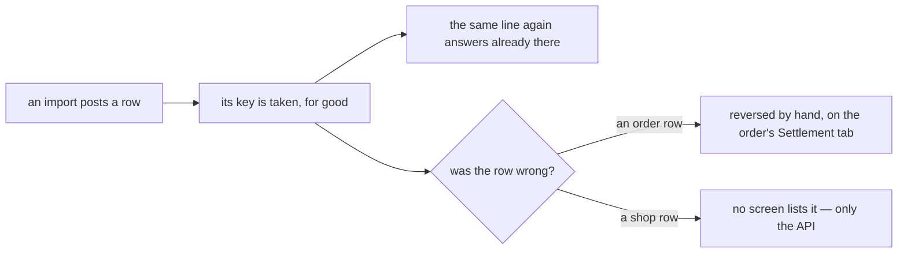

### The spec

| | |
| --- | --- |
| gone from the design | `UploadedFileRevert` · the **Revert** action · the `reverted` status · `uploaded_file_lines.revision` · the `:r<n>` key suffix |
| a wrong order row | reversed by hand, row by row, on the order's Settlement tab — its per-row Reverse is built |
| a wrong shop row | ⚠ **no screen** — no RPC lists a shop's own rows yet ([state report](../../development_state/settlement/context.md)), so it is offset through the API or not at all |
| what protects the ledger now | checking BEFORE the post — the shop guard ([importer Q3](./settlement_importer_clarify.md#question)) and a dry run ([importer Q11](./settlement_importer_clarify.md#question)) · ✅ the file check decided — [a-file-with-another-shops-orders-is-refused](#a-file-with-another-shops-orders-is-refused) · ⚠ the dry run declined for now — [the-import-has-no-dry-run-for-now](#the-import-has-no-dry-run-for-now) |

### What it accepts

- **A mistake at the first import stays** unless someone offsets it by hand, row by row: a wrong mapping, a
  file in the wrong shop, a line posted to the shop before its order existed ([an-unmatched-ref-posts-to-the-shop](#an-unmatched-ref-posts-to-the-shop)), a
  TikTok key that moves ([importer critique 14](./settlement_importer_clarify.md#critique)).

## an-unmatched-ref-posts-to-the-shop

> Chat *(owner, 2026-09-28)* — *"for 3. post it to shop"*, to [importer Q2](./settlement_importer_clarify.md#question)
> as last put: a ref that finds no order — post it to the shop, or hold it for its order?

**The verdict.** A line whose ref finds **no order** is **posted to the shop** (`order_id = 0`), under the
uploader ([superseded-an-imported-row-names-its-orders-creator-else-the-uploader](#superseded-an-imported-row-names-its-orders-creator-else-the-uploader) — ⚠ **amended** by [user-id-is-the-orders-creator-else-the-shops-primary-cs](#user-id-is-the-orders-creator-else-the-shops-primary-cs): the uploader stays its actor, and the report counts it for the shop's primary CS). It is not held, so the shop's report carries every line of the file from
the day it is imported. It **declines my recommendation** to hold the line until its order exists.

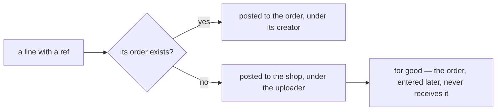

### The spec

| | |
| --- | --- |
| the row | `order_id = 0`, the file's `shop_id`, the uploader as actor, the line's own key |
| the importer's own record | outcome `posted`, reason `no_order` — so a file's page can say how many lines went to the shop for want of an order |
| the order, entered later | never receives the line: posting it under the order is refused, because the shop's account already holds its key ([post_entry.go:338](../../../backend/services/settlement_service/settlement_v1/post_entry.go#L338)), and nothing reverts ([an-upload-is-never-reverted](#an-upload-is-never-reverted)) |
| held now | only what cannot post at all — a type nobody mapped, a fractional amount, a refusal from settlement |

### What it accepts

- **An order entered after its statement was imported stays short for good.** Its Settlement tab shows the
  sale with nothing received, and the per-user report shows its creator short by that amount and the
  uploader ahead by it. ⚠ **Amended** by [user-id-is-the-orders-creator-else-the-shops-primary-cs](#user-id-is-the-orders-creator-else-the-shops-primary-cs): the shop's primary CS ahead by it, not the uploader.

## an-import-request-is-a-shop-and-its-file

> `settlement_importer.md` §Rpc Detail 1–2 *(owner, 2026-09-28)* — for TikTok and for Shopee,
> `message Payload { uint64 shop_id  bytes file_content }` — and §Rpc That Must Have, now
> `(request) return (stream response)`.

**The verdict.** An import request is **the shop and the file's bytes** — the same two fields for both
platforms. The file rides in the call, as [the-import-is-one-streamed-call](#the-import-is-one-streamed-call)
already had it, and nothing else describes it: no filename
([the-file-is-named-by-its-content-hash](#the-file-is-named-by-its-content-hash)), and no platform — the RPC
says which.

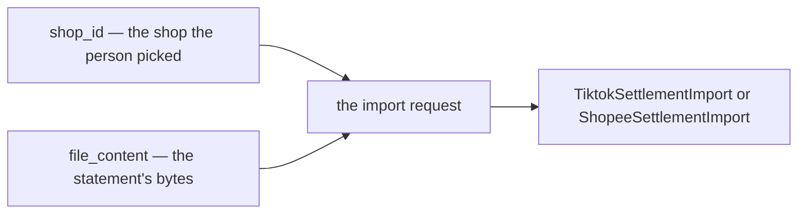

### The spec

| | |
| --- | --- |
| `shop_id` | the shop the person picked. ⚠ The file does not confirm it — [importer Q3](./settlement_importer_clarify.md#question) is the check |
| `file_content` | the workbook's bytes, as uploaded — stored first, then read ([the-import-is-one-streamed-call](#the-import-is-one-streamed-call)) |
| both platforms | the same two fields |

### What it does NOT settle

- ⛔ **The team scope** — with no `team_id`, only root and admin could call it ([critique 15](./settlement_importer_clarify.md#critique)).
- ⛔ **The names** — two messages called `Payload` do not compile ([critique 16](./settlement_importer_clarify.md#critique)).
- ⚠ **A size cap** ([critique 17](./settlement_importer_clarify.md#critique)) · **a dry-run flag** ([importer Q11](./settlement_importer_clarify.md#question)). ✅ The flag is declined for now — [the-import-has-no-dry-run-for-now](#the-import-has-no-dry-run-for-now).

## every-stream-message-is-a-leveled-log-line

> `settlement_importer.md` §Rpc Detail 3 *(owner, 2026-09-28)* —
> `enum LogLevel { UNSPECIFIED, INFO, WARN, ERROR }` and `message Response { LogLevel level  string message }`.

**The verdict.** Every message an import streams is **a log line with a level** — `INFO`, `WARN` or
`ERROR` — and its text. It meets the guideline's one must-have, `string message`, and adds what the
guideline's text-only line lacks: how serious the line is, so the screen can colour it and count what went
wrong without reading it.

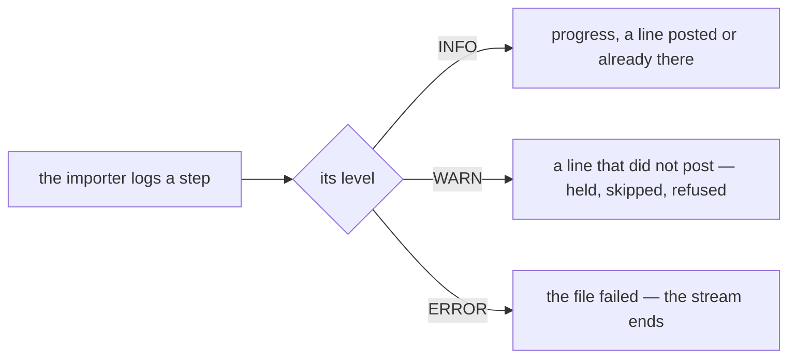

### The spec

| | |
| --- | --- |
| the enum | `LOG_LEVEL_UNSPECIFIED = 0`, then `INFO`, `WARN`, `ERROR` — lint-clean as written |
| which level | ⚠ my proposal: **INFO** for progress and for a line posted or already there · **WARN** for a line that did not post · **ERROR** for the file failing — the last message before the stream ends |
| the binding | the guideline binds slog to the stream through an `io.Writer` ([code-implementation-guideline.md](../../../guidelines/code-implementation-guideline.md#implementation-for-long-running-task-rpc)), which hands over formatted text — the level is inside it, not a field. To fill `level`, bind a `slog.Handler`: it receives each record's level beside its message |

### What it does NOT settle

- ⚠ **The progress your flow sends.** §Flow sends a count and a step, and this response carries neither —
  [Contradiction](./settlement_importer_clarify.md#the-flow-sends-a-step-and-a-count-and-the-response-has-nowhere-to-put-them).

## the-shop-is-checked-before-the-file-is-stored

> `settlement_importer.md` §Flow *(owner, 2026-09-28)* — a *"Validation File Flow"* block, first in the flow:
> *"check shop: is caller that access on shop, is shop correct"*, sent to the Shop Service, then *"Send Message
> Log"* — and only then the upload. The separate `## How We Validate File` it grew from is gone.

**The verdict.** Before the file is stored, the importer asks `selling_service`'s **ShopService** two things
about the shop the request names: may **this caller** work on it, and is it the **right shop**. Only then is
the file uploaded, read and posted.

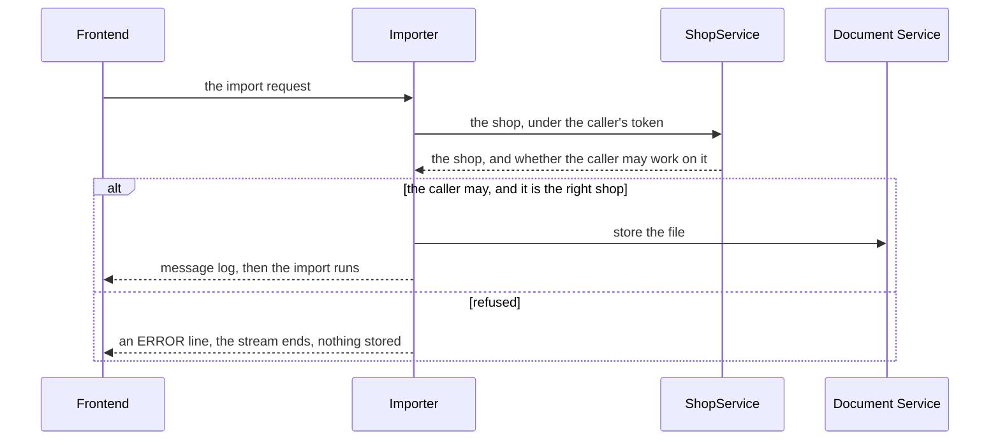

### The spec

| | |
| --- | --- |
| the service | `ShopService`, in `selling_service` ([selling.proto](../../../proto/warehouse/selling/v1/selling.proto)) — shops live there · ⚠ **Amended** by §Flow 1 *(owner, 2026-09-29)*: the call is **`ShopAccessCheck`** — the shop, its primary CS and the caller's access in one answer ([one-call-answers-the-shop-and-the-access](../shop/context_decision.md#one-call-answers-the-shop-and-the-access)) |
| the right shop | ⚠ my reading: `ShopDetail(team_id, shop_id)` answers it — the shop exists in the request's team, is not `deleted`, and its `marketplace` is the RPC's platform, so a TikTok file into a Shopee shop fails here · 🔄 read off `ShopAccessCheck`'s `shop` now |
| the caller may work on it | shop access (#86): `shop_users`, one grant of one user to one shop. ⚠ **Nothing reads it today** except its own three RPCs, so this is its first enforcement — and who counts is [importer Q12](./settlement_importer_clarify.md#question), ➡ re-routed to [shop Q1](../shop/context_clarify.md#question) · 🔄 `ShopAccessCheck`'s `is_have_access` now |
| when it fails | ⚠ my proposal: an `ERROR` line naming what failed, then the stream ends |
| the order | before the upload — a refused request stores nothing |

### What it does NOT settle

- **Whether the FILE belongs to the shop.** The check runs before the file is read, so it proves the shop is
  right for the caller and the platform, not that the statement came from it — [importer Q3](./settlement_importer_clarify.md#question),
  after extraction.
- **Who counts as a shop's user** — its listed users only, or the team's owner and admin too:
  [importer Q12](./settlement_importer_clarify.md#question). ➡ Re-routed to [shop Q1](../shop/context_clarify.md#question) — the shop's own doc can answer it.
- ⚠ A TikTok export also carries **Tokopedia** orders (`Order Source`), and `MARKETPLACE_TOKOPEDIA` is its own
  value — whether a TikTok file may go into a Tokopedia shop waits on
  [excel_readers Q2](../../technical/packages/excel_readers/context_clarify.md#question).

## a-file-with-another-shops-orders-is-refused

> Chat *(owner, 2026-09-28)* — *"for q3, yes"*, to [importer Q3](./settlement_importer_clarify.md#question):
> refuse a file whose orders belong to ANOTHER shop?

**The verdict.** After the file is read, every ref is looked up across the request's **team** in one call. If
any ref's order is found in the team but **not in the chosen shop**, the file **fails** before anything posts:
an `ERROR` line names the shop those orders belong to, and the stream ends. An order belongs to exactly one
shop, so a statement's orders say which shop it came from — this works for TikTok, whose file names no shop,
and needs no new column on `Shop`. It pairs with [the-shop-is-checked-before-the-file-is-stored](#the-shop-is-checked-before-the-file-is-stored): that check proves the shop, this one
proves the file.

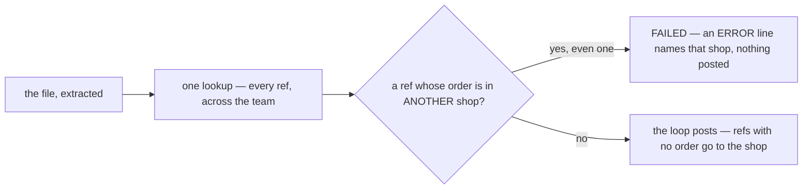

### The spec

| | |
| --- | --- |
| when | after extraction, in the one bulk order lookup — before the first post |
| the rule | a ref whose order is found in the team but not in the chosen shop. ⚠ My refinement: a ref the chosen shop also has counts as that shop's, so a ref two shops happen to share never fails a file by itself |
| one is enough | a single ref in another shop fails the whole file — a statement belongs to one shop, so one stray order means the wrong file |
| on failure | an `ERROR` line naming the shop the orders belong to · nothing posted · the stored file kept, and its row reads `failed` |
| refs with no order | not evidence either way — they post to the shop ([an-unmatched-ref-posts-to-the-shop](#an-unmatched-ref-posts-to-the-shop)) |

### What it does NOT settle

- ⚠ **A file with no findable order at all** — a brand-new shop, orders never entered, or another TEAM's
  statement, since the lookup sees only this team — cannot be checked, and posts on the person's word. With no
  revert, a dry run is what would show it — *0 of 830 lines found an order* ([importer Q11](./settlement_importer_clarify.md#question)). ⚠ Declined for now — [the-import-has-no-dry-run-for-now](#the-import-has-no-dry-run-for-now).
- ⚠ A Shopee file also names its seller (`Username (Penjual)`), but `Shop` stores no username and a TikTok file
  names nothing — so the orders stay the check that works for both.

## the-import-has-no-dry-run-for-now

> Chat *(owner, 2026-09-28)* — *"for q11 no need, its overkill for now"*, to
> [importer Q11](./settlement_importer_clarify.md#question): may an import run dry first?

**The verdict.** No dry run — **for now**. An import posts as it reads: there is no `dry_run` flag and no
preview. It **declines my recommendation** as more than the first version needs — deferred, not refused, and
adding it later changes nothing already built.

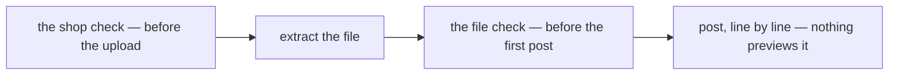

### The spec

| | |
| --- | --- |
| what guards an import now | two checks, both decided: the shop before the upload ([the-shop-is-checked-before-the-file-is-stored](#the-shop-is-checked-before-the-file-is-stored)) and the file's orders before the first post ([a-file-with-another-shops-orders-is-refused](#a-file-with-another-shops-orders-is-refused)) |
| what nothing catches | a file with no findable order — a new shop, orders never entered, another team's statement — posts on the person's word, and stays ([an-upload-is-never-reverted](#an-upload-is-never-reverted)) |
| what the person still sees | ⚠ my proposal: a line posted to the shop because its order is missing logs a `WARN`, though it posts — so the closing summary names every such line |
| adding it later | one `bool dry_run` on the request, and the post skipped when it is set |

## only-a-successful-withdrawal-is-recorded

> Chat *(owner, 2026-09-29)* — *"dont record failed withdrawal, only success"*, to
> [importer Q6](./settlement_importer_clarify.md#question): is a FAILED withdrawal booked?

**The verdict.** Only a withdrawal that **succeeded** is recorded — money that actually left for the bank. A
failed one is not, and neither is the refund that returns it. It **declines my recommendation** to book both
rows at face value: the ledger's withdrawals now equal the money that reached the bank.

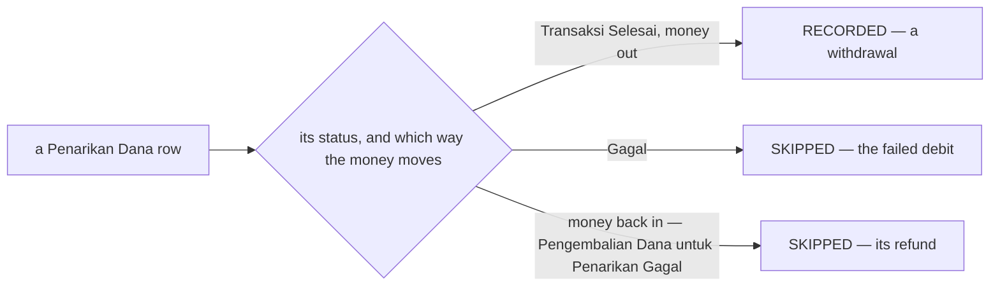

### The spec

| | |
| --- | --- |
| Shopee — recorded | a `Penarikan Dana` row with status `Transaksi Selesai` and money going out — 168 in the samples |
| Shopee — skipped | ⚠ my reading of *"only success"*: the `Gagal` debit **and** its refund — money coming back, described *"Pengembalian Dana untuk Penarikan Gagal"*, itself marked `Transaksi Selesai`. 2 pairs in the samples: `awan_wdgagal` at 5,899,085 and `luxy_wdgagal` at 3,977,187 |
| ⚠ the trap | skipping only `Gagal` keeps the refund — completed, +5.9M — and drops the debit: the shop reads 5.9M richer, for good |
| TikTok | recorded only when `Status` is `Transferred` — every sample is. Any other status is skipped |
| a skipped row | outcome `skipped`, reason `failed_withdrawal`, a `WARN` on the stream — so the file's page lists them |
| a status never seen | skipped too — a withdrawal still processing, say. Re-imported once it completes, it posts then: skipping writes nothing |
| ⛔ the build | the Shopee reader reads no `Status` column. It has to come from the DOCUMENT, beside the item and outside the hash ([hash-the-whole-struct](../../technical/packages/excel_readers/context_decision.md#hash-the-whole-struct)), so no key moves — [Contradiction](./settlement_importer_clarify.md#the-reader-leaves-the-status-out-and-the-importer-now-needs-it) |

### What it accepts

- **For a day, the ledger and Shopee's own balance differ.** Shopee shows the failed withdrawal leave and come
  back; the ledger never moves. By the refund's day they agree again.

## an-import-finishes-whether-anyone-watches

> Chat *(owner, 2026-09-29)* — *"no need cancel/rollback"*, to [importer Q8](./settlement_importer_clarify.md#question):
> does an import keep going after the person stops watching? Read as **yes** — nothing cancels an import, and
> nothing rolls it back.

**The verdict.** An import **finishes whether or not anyone is watching**. A closed tab, a sleeping phone or a
dropped connection ends the stream — the window onto the import — never the import itself. There is **no
Cancel**, and no rollback ([an-upload-is-never-reverted](#an-upload-is-never-reverted)).

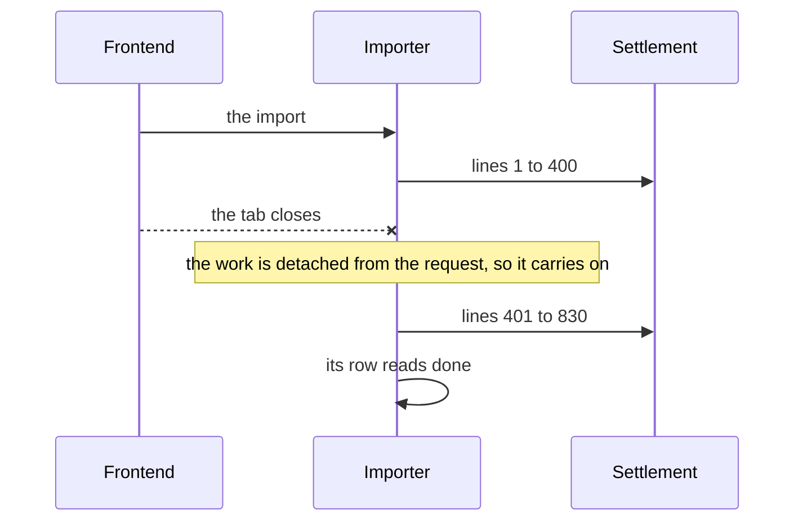

### The spec

| | |
| --- | --- |
| the work | detached from the request with `context.WithoutCancel` — it keeps the uploader's identity for every call, and drops only the cancellation |
| the stream | a window: once nobody listens, a failed send is noted once in the server log and the import carries on. Its log lines still reach the server log |
| no Cancel | nothing stops an import once it starts — the two checks refuse a wrong shop or a wrong file before anything posts |
| a server stopped mid-file | the file is half-posted, its row's `updated_at` stops moving, and the list shows it **interrupted** — ⚠ my proposal: *running* with no update for two minutes, worked out when listed, no sweeper |
| recovery | upload the same file again — every posted line answers *already there*, the rest post. Whether that re-runs the same row is [importer Q9](./settlement_importer_clarify.md#question) — ✅ **answered**: it does not, the same file again is a second row ([the-row-key-is-the-only-dedupe](#the-row-key-is-the-only-dedupe)) |

### What it accepts

- **Closing the tab does not stop an import.** A file that passes both checks posts in full.

## the-row-key-is-the-only-dedupe

> `settlement_importer.md` §Flow *(owner, 2026-09-29)* — the loop now opens *"row generate `GenerateUniqueID`"*,
> before *"post to settlement service"*. And in chat, to [importer Q9](./settlement_importer_clarify.md#question) — the
> same bytes a second time, a second upload or the first one re-run? — *"every row `GenerateUniqueID` so when its
> exist, dont post it"*.

**The verdict.** Duplicates are caught **row by row, never file by file**. Every row is keyed by the reader's
`GenerateUniqueID()`, and a row whose key is already in the ledger is **not posted again**. Nothing checks the
file itself: the same bytes a second time are a **second upload** — stored again, with their own row in the list,
and their lines answer *already there*. It **declines my recommendation** — the first upload re-run, the hash
unique per team — as unneeded: the row key already stops every double post.

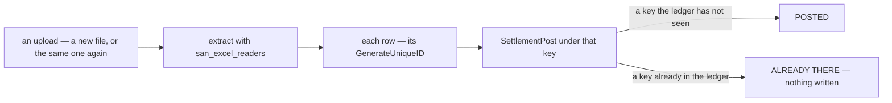

### The spec

| | |
| --- | --- |
| the key | the row's `GenerateUniqueID()` — the reader's hash of the row's own fields ([hash-the-whole-struct](../../technical/packages/excel_readers/context_decision.md#hash-the-whole-struct)). ⚠ Written `<platform>:<sheet>:<hash>` — the prefix is my proposal, from the clarify's key recipe |
| *"when its exist, dont post it"* | ⚠ my reading: settlement's own check, which already does it. `SettlementPost` finds the key, writes nothing and answers `created: false` — your flow's *"already exists"*. No lookup before the post: it would be a second call per row for the same answer |
| the same file twice | a second upload — stored again, a second row in the list. Every line answers *already there*, except a line held the first time whose type has been mapped since: that one posts now |
| an interrupted file | upload it again — a new row finishes the job. The first stays *interrupted*, with the same `content_sha256` |
| the file's hash | its name in `document_service`, never a key — nothing is unique on it and nothing looks it up |
| two people, one file, one moment | both run, and each line is written once: settlement locks the account before it looks for the key ([post_entry.go:225](../../../backend/services/settlement_service/settlement_v1/post_entry.go#L225)), so the later post answers *already there* |
| measured | a line keeps its key from file to file: **193 lines appear in two or more samples, and 0 change key** — 141 Shopee lines in a re-saved copy (`awan_beban_return` / `_simple`), 43 TikTok orders and 9 TikTok withdrawals in three overlapping downloads (`niko_*`) |

### What it leans on

- ⛔ **Settlement refusing a key that another SHOP holds — and today it does not.** Its key check compares only
  the order ([post_entry.go:338](../../../backend/services/settlement_service/settlement_v1/post_entry.go#L338)), as
  [the-idempotency-key-is-global](./context_decision.md#the-idempotency-key-is-global) specifies. Measured
  2026-09-29: a shop row's key posted to shop 30, then to shop 31 — and to a shop in another TEAM — answered
  *already exists* both times and returned shop 30's row. So a statement posted into the wrong shop, with no order
  to find, reads *already there* line by line in the right one, and nothing says where the money went —
  [settlement critique 7](./context_clarify.md#critique).
- ⚠ **The key staying put.** It is now the only thing between a re-download and a double post, so a TikTok period
  re-downloaded in the 2026-09 layout ([critique 14](./settlement_importer_clarify.md#critique)) matters more.

### What it accepts

- **One file uploaded twice is two rows in the list**, the second reading *already there* throughout.
- **An interrupted row stays interrupted** after the file is uploaded again — the row that finished it carries the
  same hash.
- **Uploading the same file again is the retry** — for an interrupted import, and for held lines once their
  mapping exists. A Reprocess button would be a convenience, not a need.

## user-id-is-the-orders-creator-else-the-shops-primary-cs

> `settlement_importer.md` §How We Decide `user_id` in Settlement importer in Every Rows *(owner, 2026-09-29)* — a
> flowchart per row: an order ref whose order exists → *"use user_id from order"*; no ref, or no such order →
> *"use primary_user_id from rpc `ShopAccessCheck`"*. It replaces §How We Decide `actor_id` / `user_id`.

**The verdict.** Every imported row's **`user_id`** — the person the per-user report counts it for — is decided row
by row. A row whose ref finds its order: **that order's creator**. A row with no ref, or a ref that finds no order:
**the shop's primary CS**, the `primary_user_id` that `ShopAccessCheck` returns
([one-call-answers-the-shop-and-the-access](../shop/context_decision.md#one-call-answers-the-shop-and-the-access)). It **supersedes**
the uploader as the fallback ([superseded-an-imported-row-names-its-orders-creator-else-the-uploader](#superseded-an-imported-row-names-its-orders-creator-else-the-uploader)).

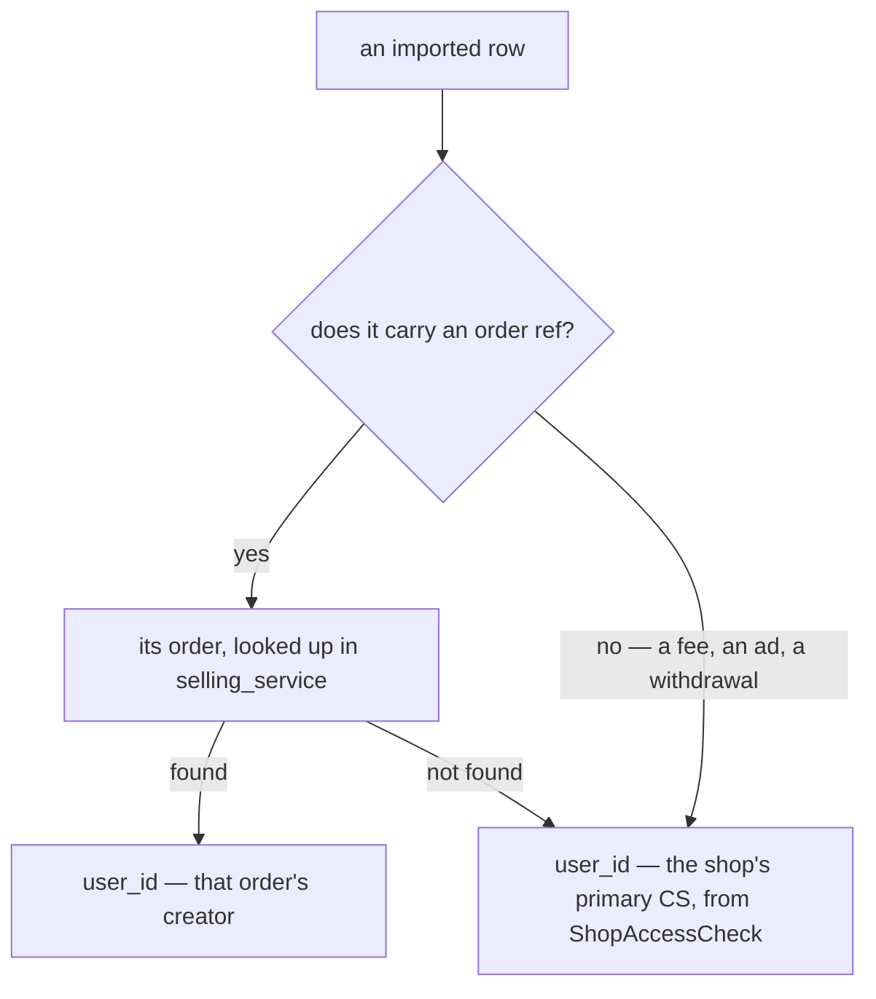

### The spec

| | |
| --- | --- |
| a row whose ref finds its order | its creator — the person stamped on the order's settlement account when the order was placed. ✅ **The per-user report already does this** ([analytic_fold.go:72](../../../backend/services/settlement_service/settlement_v1/analytic_fold.go#L72)): nothing to build |
| any other row | the shop's primary CS — `primary_user_id`, asked once per file by the shop check the importer already makes ([the-shop-is-checked-before-the-file-is-stored](#the-shop-is-checked-before-the-file-is-stored)) · 🔄 **Amended** by [settlement-asks-the-shop-for-its-primary-cs](#settlement-asks-the-shop-for-its-primary-cs): settlement asks for it on each imported shop row — the importer's own ask stays its check |
| which primary | the one at import time — not the one when the money moved |
| the log's `actor_id` | ⚠ my reading: **whoever posted — the uploader**, from the token, on every row. The section named `actor_id` / `user_id` and now names `user_id` only. So an order's Settlement page says *by* the uploader, and the report counts the row for the person your flow names |
| ⛔ getting a shop row to its primary CS | the fold counts a shop row for its ACTOR — the uploader — and nothing carries the primary to it: [importer Q13](./settlement_importer_clarify.md#question) — ✅ **decided**: [settlement-asks-the-shop-for-its-primary-cs](#settlement-asks-the-shop-for-its-primary-cs) |
| ⛔ a shop with no primary CS | the flow always ends on a person, and a shop can have none: [importer Q14](./settlement_importer_clarify.md#question) |

### What it replaces

- **The uploader as the fallback** — and with it the answer to [analytic Q7](./analytic_context_clarify.md#question):
  an imported shop-level row — a fee, an ad charge, a withdrawal — is carried by the shop's primary CS, not by
  whoever uploads. The per-user list no longer ranks the uploader by the shop's money.
- **[Importer Q10](./settlement_importer_clarify.md#question)** — how the log names the order's creator. By my reading
  it no longer has to: the actor stays whoever posted.
- ⚠ It **conflicts** with your 2026-09-10 answer that a shop row counts for its actor —
  [a-shop-addressed-row-is-attributed-to-its-actor](./context_decision.md#a-shop-addressed-row-is-attributed-to-its-actor).
  Recorded as a [Contradiction](./settlement_importer_clarify.md#an-imported-shop-row-goes-to-the-shops-primary-cs-and-a-shop-row-goes-to-whoever-posted-it).

### What it accepts

- **One person carries a shop's shop-level money for good** — every fee, ad charge and withdrawal an import brings
  in goes to the primary CS of the day ([the-user-carry-is-kept](./context_decision.md#the-user-carry-is-kept)).
- **Two names on one row** — the Settlement page's *by* is who posted it, and the report counts it for whose it is.

## settlement-asks-the-shop-for-its-primary-cs

> Chat *(owner, 2026-09-29)* — *"im prefer b"*, to [importer Q13](./settlement_importer_clarify.md#question): how does
> an imported shop row reach the shop's primary CS — (a) the importer passes the person on the post, or (b) settlement
> asks the shop service itself?

**The verdict.** **Settlement asks the shop.** When an imported row lands on a shop — no order — settlement asks
`selling_service` for the shop's primary CS and writes that person on the row as its **`user_id`**. The per-user
report counts the row for them. The importer passes no person. It **declines my recommendation** (a): nothing a
caller sends can name the person, at the price of a call to the shop service for every such row.

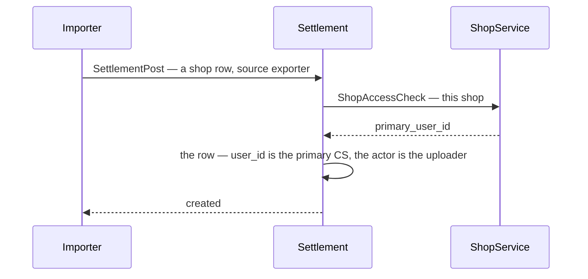

### The spec

| | |
| --- | --- |
| which rows | an **imported** row with **no order** — `source_type` `exporter`, the importer's source (its rename is the [Contradiction](./settlement_importer_clarify.md#the-service-has-a-third-name-and-the-contract-still-carries-the-first)). A shop row posted by hand keeps its actor ([a-shop-addressed-row-is-attributed-to-its-actor](./context_decision.md#a-shop-addressed-row-is-attributed-to-its-actor)); an order row keeps its stamped creator |
| the call | ⚠ my proposal: `ShopAccessCheck` — the shop call that already returns `primary_user_id` ([one-call-answers-the-shop-and-the-access](../shop/context_decision.md#one-call-answers-the-shop-and-the-access)) — under the caller's token, with the request's `team_id`. No second shop RPC |
| when | ⚠ my proposal: **before** the ledger transaction — never while the shop's account row is locked ([post_entry.go:295](../../../backend/services/settlement_service/settlement_v1/post_entry.go#L295)), or every post on that shop waits on the network |
| written | 🆕 `settlement_logs.user_id` — the person a row counts for, written once. 0 on every other row, meaning its actor |
| carried | `SettlementLogPosted` gains `user_id`, built from the row like every other field ([events.go:66](../../../backend/services/settlement_service/settlement_v1/events.go#L66)). The replay re-reads the events, so the person is written on the row — never asked again later |
| counted | the fold: an order row → its stamped creator · a shop row → `user_id` when set, else its actor ([analytic_fold.go:75](../../../backend/services/settlement_service/settlement_v1/analytic_fold.go#L75)) |
| the shop service fails | ⚠ my proposal: the post is **refused** — never a quiet fallback to the actor, which would count the row for the wrong person for good. The importer holds the line with its reason, and the same file again posts it |
| no primary CS | 0 from the shop — never counted for user 0. Refuse, or count for the uploader, is [importer Q14](./settlement_importer_clarify.md#question) |

### What it costs

- ⛔ **Settlement's first call into another service.** Today it depends on its database, its event sender and the
  replay broker, nothing else ([service.go:50](../../../backend/services/settlement_service/settlement_v1/service.go#L50)). A `ShopService` client joins its Wire set, and
  [rpc.md](../../services/settlement_service/rpc.md) gains the flow in the commit that builds it (HARD RULE 3).
- **A call per imported shop row** — the whole file when no order is found, ~1,500 on the largest Shopee sample.
  The performance audit measures it once built.
- **Imports lean on the shop service line by line** — down mid-file, the rest of the file's shop lines are held.
