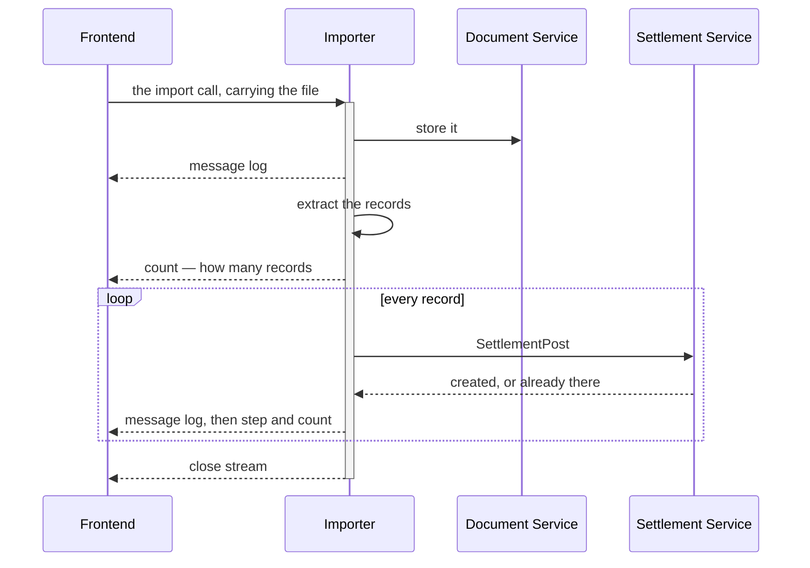

# Decisions — `settlement_importer.md`

What the owner settled, recorded before it is acted on. **Append-only** — a decision that is later
reversed is renamed and its references grepped (RULE 12), never quietly edited away. The open set is
[settlement_importer_clarify.md](./settlement_importer_clarify.md).

| decision | what it decided |
| --- | --- |
| [the-import-is-one-streamed-call](#the-import-is-one-streamed-call) | one server-streaming call per file — the file goes IN the call, is stored, read and posted record by record while the stream reports progress. No queue |

## the-import-is-one-streamed-call

> `settlement_importer.md` §Rpc That Must Have 1–2 and §Flow *(owner, 2026-09-28)* —
> *"`TiktokSettlementImport(response) return (stream response)`"*, and a flow that uploads to the document
> service, extracts, then loops *"Every Settlement Record"*: post, *"Send Message Log"*, *"send step and
> count record for frontend progress render"* — and *"close stream"*.

**The verdict.** An import is **one server-streaming call per file** — the long-task shape of
[the code guideline](../../../guidelines/code-implementation-guideline.md#implementation-for-long-running-task-rpc).
The file travels in the request. The importer stores it in `document_service` first, extracts the records,
and posts them one by one, streaming a log line and the progress after each. The stream closing is the
import finishing. It **overtakes** the clarify's recommendation to queue the file and return at once.

### The spec

| | |
| --- | --- |
| shape | `rpc TiktokSettlementImport(…Request) returns (stream …Response)` — `ShopeeSettlementImport` the same |
| each response | `message`, the guideline's must-have — one slog line bound to the stream · plus `step` and `count`, so the screen draws progress without parsing a log |
| the file | in the request, not a `document_id`. The importer is therefore `document_service`'s client, through its shipped two-phase contract — `RequestUpload`, PUT, `ConfirmUpload` — under the uploader's own token |
| the order | **stored before it is read** — so a file the reader refuses is still kept, and that is exactly the file a developer needs: `cannot_open.xlsx` was one |
| per record | one `SettlementPost`. *Created* or *already there* is its idempotency on `unique_id`, already built |
| no queue | no worker, and no job table for a screen to poll |

### What it does NOT settle

- ⛔ **How a stream is authorized** — the access interceptor refuses every streaming RPC today:
  [importer Q7](./settlement_importer_clarify.md#question).
- **Whether the import finishes when nobody is watching** — [importer Q8](./settlement_importer_clarify.md#question).
- **A record that cannot post** — the flow draws two outcomes, the samples produce five:
  [critique 7](./settlement_importer_clarify.md#critique).
