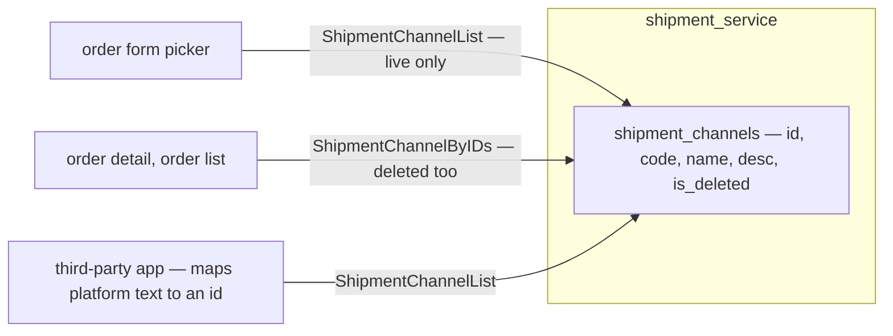

# Clarity — shipment `context.md`

What [context.md](./context.md) leaves open. **That doc is yours — this one is mine.** Answered points are
deleted, so this file is always the current open set. Settled: [context_decision.md](./context_decision.md).

> **Opened 2026-09-16**, when [order](../order/context.md) started pointing here for `shipment_channel_id`.
> **Re-examined 2026-09-16** after §Table, §Who can manage and §What Exposed landed — identity, soft delete,
> root-only and tracking-deferred moved to decisions; then
> [the-app-converts-the-courier-to-a-channel-id](./context_decision.md#the-app-converts-the-courier-to-a-channel-id),
> [a-channel-is-a-courier](./context_decision.md#a-channel-is-a-courier) and
> [a-deleted-channel-still-resolves-by-id](./context_decision.md#a-deleted-channel-still-resolves-by-id).

Siblings: [order_context](../order/context_clarify.md) · [warehouse_context](../warehouse/context_clarify.md).

---

## Proposed Design

| RPC | who | returns |
| --- | --- | --- |
| `ShipmentChannelList` | ✅ [no login](./context_decision.md#the-channel-list-needs-no-login) | live channels, paged per the [list rule](../../../guidelines/service-guideline.md) |
| `ShipmentChannelByIDs` | ✅ [no login](./context_decision.md#by-ids-is-public-too) | ✅ [decided](./context_decision.md#a-deleted-channel-still-resolves-by-id) — deleted ones included, flagged |
| `ShipmentChannelCreate` / `Update` / `Delete` | root | — |

⚠ **This withdraws my earlier *"exempt the list from pagination"*.** The guideline's List shape carries
`CommonPagination` for every list, and it is programmer-authoritative — the picker asks for a large first page.

---

## Critique

*None open.*

---

## Question

> Re-routed: *an order with an unknown courier* → [order](../order/context_clarify.md#an-order-cannot-be-created-without-a-channel).

*No open question.* Deferred with their own design pass: tracking, the handover.
