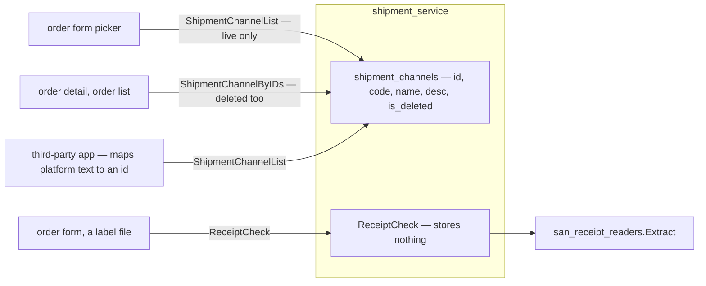
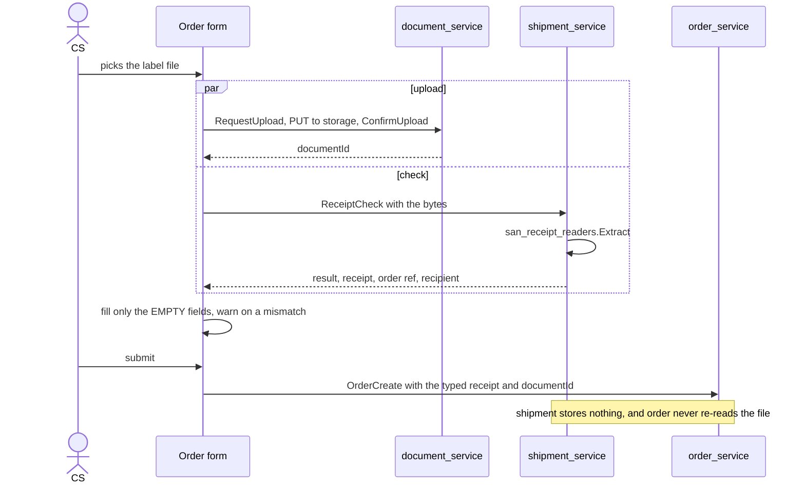
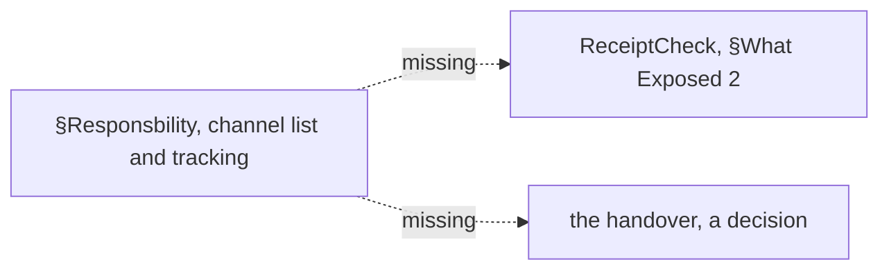

# Clarity — shipment `context.md`

What [context.md](./context.md) leaves open. **That doc is yours — this one is mine.** Answered points are
deleted, so this file is always the current open set. Settled: [context_decision.md](./context_decision.md).

> **Opened 2026-09-16**, when [order](../order/context.md) started pointing here for `shipment_channel_id`.
> **Re-examined 2026-09-16** after §Table, §Who can manage and §What Exposed landed — identity, soft delete,
> root-only and tracking-deferred moved to decisions; then
> [the-app-converts-the-courier-to-a-channel-id](./context_decision.md#the-app-converts-the-courier-to-a-channel-id),
> [a-channel-is-a-courier](./context_decision.md#a-channel-is-a-courier) and
> [a-deleted-channel-still-resolves-by-id](./context_decision.md#a-deleted-channel-still-resolves-by-id).
> **Re-examined 2026-10-05** after §What Exposed to Public 2 and §`ReceiptCheck` rpc landed:
> [receipt-check-is-shipments](./context_decision.md#receipt-check-is-shipments) recorded (it answers
> receipt_readers Q3), and receipt_readers Q2, the caller flow, moved here as Q4. **Same day, Q2–Q4 answered:**
> [receipt-check-needs-a-login](./context_decision.md#receipt-check-needs-a-login) ·
> [receipt-check-returns-what-the-library-reads](./context_decision.md#receipt-check-returns-what-the-library-reads) ·
> [receipt-check-takes-the-file-bytes](./context_decision.md#receipt-check-takes-the-file-bytes). **Then its three critiques accepted:**
> [a-label-outcome-is-a-result-not-an-error](./context_decision.md#a-label-outcome-is-a-result-not-an-error) ·
> [receipt-check-caps-the-body-before-reading](./context_decision.md#receipt-check-caps-the-body-before-reading) ·
> [receipt-check-logs-only-the-result](./context_decision.md#receipt-check-logs-only-the-result).

Siblings: [order_context](../order/context_clarify.md) · [warehouse_context](../teams/warehouse/context_clarify.md) ·
[receipt_readers](../../technical/packages/receipt_readers/context_clarify.md).

---

## Proposed Design


```mermaid
flowchart LR
  subgraph "shipment_service"
    CH["shipment_channels — id, code, name, desc, is_deleted"]
    RC["ReceiptCheck — stores nothing"]
  end
  PICK["order form picker"] -->|"ShipmentChannelList — live only"| CH
  SCREEN["order detail, order list"] -->|"ShipmentChannelByIDs — deleted too"| CH
  APP["third-party app — maps platform text to an id"] -->|"ShipmentChannelList"| CH
  FORM["order form, a label file"] -->|"ReceiptCheck"| RC
  RC --> PKG["san_receipt_readers.Extract"]
```

| RPC | who | returns |
| --- | --- | --- |
| `ShipmentChannelList` | ✅ [no login](./context_decision.md#the-channel-list-needs-no-login) | live channels, paged per the [list rule](../../../guidelines/service-guideline.md) |
| `ShipmentChannelByIDs` | ✅ [no login](./context_decision.md#by-ids-is-public-too) | ✅ [decided](./context_decision.md#a-deleted-channel-still-resolves-by-id) — deleted ones included, flagged |
| `ShipmentChannelCreate` / `Update` / `Delete` | root | — |
| `ReceiptCheck` | ✅ [signed in](./context_decision.md#receipt-check-needs-a-login), no team scope | ✅ [what the library reads](./context_decision.md#receipt-check-returns-what-the-library-reads), plus a [`result`](./context_decision.md#a-label-outcome-is-a-result-not-an-error) |

⚠ **This withdraws my earlier *"exempt the list from pagination"*.** The guideline's List shape carries
`CommonPagination` for every list, and it is programmer-authoritative — the picker asks for a large first page.

### `ReceiptCheck`

✅ Everything below is decided except the service's NAME: a second proto service in `warehouse.shipment.v1`, beside
`ShipmentChannelService`, because that one is named for its subject and the
[size cap](./context_decision.md#receipt-check-caps-the-body-before-reading) must reach this one handler only. The name is accepted with
the screens at `design_accept`.

```proto
service ReceiptService {
  rpc ReceiptCheck(ReceiptCheckRequest) returns (ReceiptCheckResponse);
}

message ReceiptCheckRequest {
  option (warehouse.role_base.v1.request_policy) = { allow_only_authenticated: true };  // ✅ receipt-check-needs-a-login
  bytes file_content = 1 [(buf.validate.field).bytes = { min_len: 1, max_len: 2097152 }]; // ✅ receipt-check-takes-the-file-bytes
}

message ReceiptCheckResponse {
  ReceiptCheckResult result = 1;  // ✅ a-label-outcome-is-a-result-not-an-error
  // ✅ receipt-check-returns-what-the-library-reads: the rest is Extract's ReceiptData, field for field
  string receipt = 2;        // the tracking number, or an instant label's pickup code
  string order_ref_id = 3;   // the marketplace's order number (receipt_readers critique 2)
  string customer_name = 4;  // "" = not printed, or masked
  string phone = 5;
  string address = 6;
}

enum ReceiptCheckResult {
  RECEIPT_CHECK_RESULT_UNSPECIFIED = 0;
  RECEIPT_CHECK_RESULT_READ = 1;
  RECEIPT_CHECK_RESULT_UNKNOWN_LABEL = 2;
  RECEIPT_CHECK_RESULT_MULTIPLE_LABELS = 3;
  RECEIPT_CHECK_RESULT_NOT_SHIPPING_LABEL = 4;
  RECEIPT_CHECK_RESULT_UNREADABLE = 5;
}
```

| `Extract` returns | `result` | the form shows |
| --- | --- | --- |
| no error | `READ` | fills the EMPTY fields only, warns on a mismatch |
| neither exported error | `UNKNOWN_LABEL` | nothing: the person types, as today |
| more than one label | `MULTIPLE_LABELS` | "this file holds several labels" |
| `ErrNotShippingLabel` | `NOT_SHIPPING_LABEL` | "this is not a shipping label" |
| `ErrUnreadable` | `UNREADABLE` | "this file can't be opened" |

⚠ `MULTIPLE_LABELS` needs [receipt_readers critique 4](../../technical/packages/receipt_readers/context_clarify.md#critique)
to export that error. Until then a bulk print arrives as `UNKNOWN_LABEL`, which is still safe: nothing is filled.

It returns no courier ([courier-is-not-read](../../technical/packages/receipt_readers/context_decision.md#courier-is-not-read)),
so [the-app-converts-the-courier-to-a-channel-id](./context_decision.md#the-app-converts-the-courier-to-a-channel-id)
still holds: the person picks the channel.


```mermaid
sequenceDiagram
  actor CS
  participant F as Order form
  participant D as document_service
  participant S as shipment_service
  participant O as order_service
  CS->>F: picks the label file
  par upload
    F->>D: RequestUpload, PUT to storage, ConfirmUpload
    D-->>F: documentId
  and check
    F->>S: ReceiptCheck with the bytes
    S->>S: san_receipt_readers.Extract
    S-->>F: result, receipt, order ref, recipient
  end
  F->>F: fill only the EMPTY fields, warn on a mismatch
  CS->>F: submit
  F->>O: OrderCreate with the typed receipt and documentId
  Note over S,O: shipment stores nothing, and order never re-reads the file
```

---

## Critique

*None open.* `ReceiptCheck`'s four were answered on 2026-10-05: see the header.

---

## Question

> Re-routed: *an order with an unknown courier* → [order](../order/context_clarify.md#an-order-cannot-be-created-without-a-channel).

> ✅ **Answered and deleted (2026-10-05): Q2–Q4**, `ReceiptCheck`'s shape. Who may call it:
> [receipt-check-needs-a-login](./context_decision.md#receipt-check-needs-a-login). Read or verify:
> [receipt-check-returns-what-the-library-reads](./context_decision.md#receipt-check-returns-what-the-library-reads). Bytes or a
> document: [receipt-check-takes-the-file-bytes](./context_decision.md#receipt-check-takes-the-file-bytes).

*No open question.* Deferred with their own design pass: tracking, the handover.

---

# Contradiction

## responsibility-omits-the-receipt-check

**The example.** §Responsbility lists two jobs: *"Provide and manage shipment channel list"* and *"Provide tracking
service [defered]"*. §What Exposed to Public 2 adds a third: *"provide tool for check receipt that named
`ReceiptCheck`"*. Someone who reads only §Responsbility doesn't learn that shipment reads labels, and the handover
([the-handover-is-shipments-and-deferred](./context_decision.md#the-handover-is-shipments-and-deferred)) is missing from
it too.

**→ Recommend** adding to §Responsbility: *"3. Check a shipping label (`ReceiptCheck`)"* and *"4. Record the handover
to the courier [defered]"*. §Responsbility is the list that sets what belongs in shipment, so a job left out of it is
the first one to drift to another service.


```mermaid
flowchart LR
  R["§Responsbility, channel list and tracking"] -.->|"missing"| X["ReceiptCheck, §What Exposed 2"]
  R -.->|"missing"| H["the handover, a decision"]
```
