# Decisions — shipment `context.md`

What the owner settled, recorded before it is acted on. **Append-only** — a decision that is later
reversed is renamed and its references grepped (RULE 12), never quietly edited away.

| decision | what it decided |
| --- | --- |
| [a-channel-has-an-id-and-a-unique-code](#a-channel-has-an-id-and-a-unique-code) | `shipment_channels` carries `id` (what an order stores) and a unique `code` (what a human reads) |
| [a-channel-is-soft-deleted](#a-channel-is-soft-deleted) | a channel is never removed — `is_deleted` hides it |
| [only-root-manages-channels](#only-root-manages-channels) | create, edit and delete are ROOT only — not admin, not a team |
| [tracking-is-deferred](#tracking-is-deferred) | tracking is shipment's job, and it is not designed now |
| [a-channel-is-a-courier](#a-channel-is-a-courier) | `jne` is a channel — `jne_reg` / `jne_yes` are not; the service level is the platform's |
| [a-deleted-channel-still-resolves-by-id](#a-deleted-channel-still-resolves-by-id) | `ShipmentChannelByIDs` returns deleted channels too, flagged — the picker list does not |
| [the-app-converts-the-courier-to-a-channel-id](#the-app-converts-the-courier-to-a-channel-id) | the third-party app maps platform courier text to our id — no alias table here |
| [a-deleted-code-is-restored-not-recreated](#a-deleted-code-is-restored-not-recreated) | a deleted channel comes back by restore, same id — its `code` is never reused |
| [the-handover-is-shipments-and-deferred](#the-handover-is-shipments-and-deferred) | recording parcels given to the courier is shipment's job, not designed now |
| [the-channel-list-needs-no-login](#the-channel-list-needs-no-login) | `ShipmentChannelList` is public — `allow_all`, no token read |
| [by-ids-is-public-too](#by-ids-is-public-too) | `ShipmentChannelByIDs` is public as well — every read open, every write root |
| [a-code-never-changes](#a-code-never-changes) | `code` is fixed at create — only `name` and `desc` are editable |
| [the-three-channels-are-seeded](#the-three-channels-are-seeded) | `jne`, `jnt`, `sicepat` arrive with the migration |
| [a-channel-records-updated-at](#a-channel-records-updated-at) | `shipment_channels` gains `updated_at` |

---

## a-channel-has-an-id-and-a-unique-code

> Owner (2026-09-16), in [context.md](./context.md) §Table That Must Have — closing *"no channel identity rule"*.

**The verdict.** A channel has a primary-key `id` and a **unique** `code` (`jne`, `jnt`, `sicepat`), beside a
`name` and a `desc`. The order stores the `id`
([shipment-channel-is-an-id-into-shipment-service](../order/context_decision.md#shipment-channel-is-an-id-into-shipment-service)).

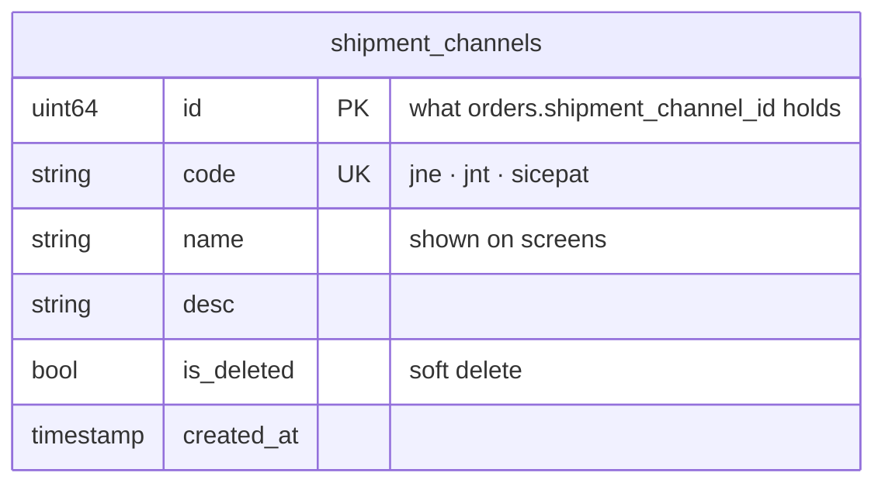

| field | rule |
| --- | --- |
| `id` | primary key — the only thing another service stores |
| `code` | unique, human-readable, stable |
| `name`, `desc` | free text, editable |
| `is_deleted` | see [a-channel-is-soft-deleted](#a-channel-is-soft-deleted) |
| `created_at` | set on create |

---

## a-channel-is-soft-deleted

> Owner (2026-09-16), `is_deleted, for soft delete` — closing *"can a channel be deleted, or only retired?"*

**The verdict.** Deleting a channel sets `is_deleted`. The row stays, so an order's `shipment_channel_id`
never points at nothing.

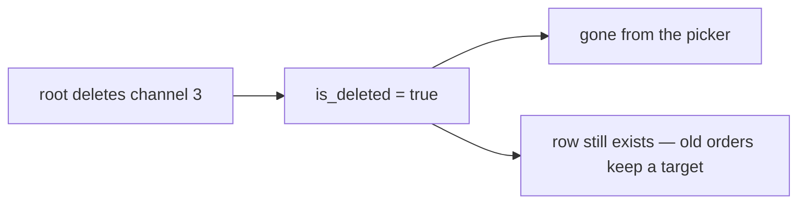

What a deleted channel still returns is settled in
[a-deleted-channel-still-resolves-by-id](#a-deleted-channel-still-resolves-by-id).

---

## only-root-manages-channels

> Owner (2026-09-16), §Who can manage — *"only root can create, edit and delete it"*. **Narrower than my
> recommendation** (root and admin).

**The verdict.** `ROLE_ROOT` alone may create, edit or delete a channel. The list is shared reference data for
every team, so no team — selling or warehouse — adds its own.

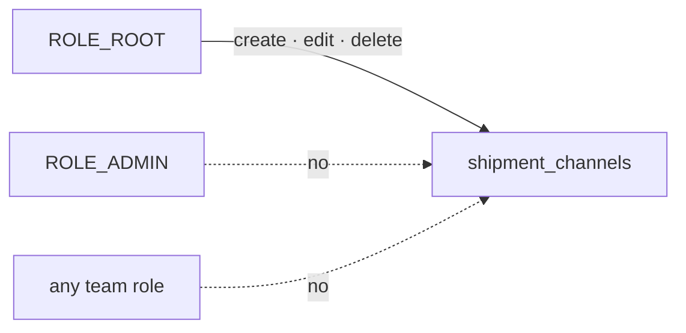

**The spec.** The create / edit / delete request messages carry
`request_policy = { roles: [ROLE_ROOT] }` and **no `use_scope`** — the list belongs to no team.

---

## tracking-is-deferred

> Owner (2026-09-16), §Responsibility — *"Provide tracking service [defered]"*.

**The verdict.** Tracking belongs to shipment, and is not designed in this pass. The question of whether
tracking **moves** an order's status or only **reports** it waits with it.

---

## a-channel-is-a-courier

> Owner (2026-09-16): **"yes its just courier"** — to *"is `jne` the channel, or `jne_reg` and `jne_yes`?"*

**The verdict.** One channel per **courier**. A service level (REG, YES, economy, instant) is not a channel and
is not stored by shipment — it is the platform's choice, and it does not change where a parcel goes at the dock.

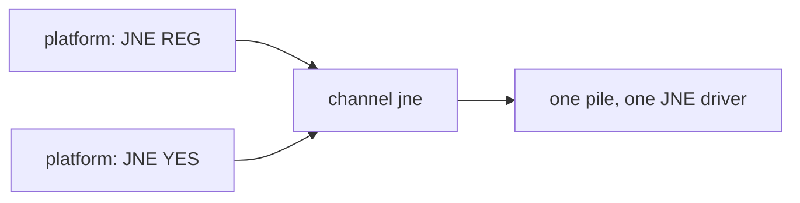

| | |
| --- | --- |
| a channel is | a courier company: `jne`, `jnt`, `sicepat` |
| a channel is NOT | a courier + service level |
| consequence | every service-level name a platform uses maps to the one courier channel |

---

## a-deleted-channel-still-resolves-by-id

> Owner (2026-09-16): **"yes"** — to *"does a deleted channel still come back when an old order asks for it by id?"*

**The verdict.** Shipment exposes two reads with different jobs. The picker list shows live channels only;
resolving by id returns **every** requested channel, deleted ones included and flagged, so an old order never
shows a blank courier.

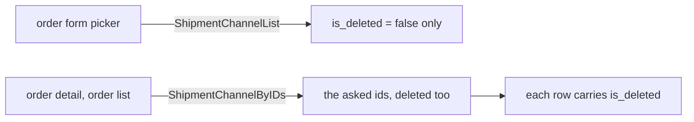

**The spec.**

| RPC | shape | returns |
| --- | --- | --- |
| `ShipmentChannelList` | guideline List shape, paged | live channels only |
| `ShipmentChannelByIDs` | guideline ByIDs shape | every requested id that exists, **including** `is_deleted = true`, flag set |

A screen may mark a deleted channel's name as deleted; it never refuses to render it.

---

## the-app-converts-the-courier-to-a-channel-id

> Owner (2026-09-16): **"third party app obey our rule, they convert it, not our system responsbility"** — to
> *"who turns the platform's courier text into `shipment_channel_id`?"*. **Against my recommendation** (B, a
> shipment alias table).

**The verdict.** The third-party app reads our channel list and sends a `shipment_channel_id`. Our system never
receives, stores or matches the platform's courier text. There is **no alias table**.

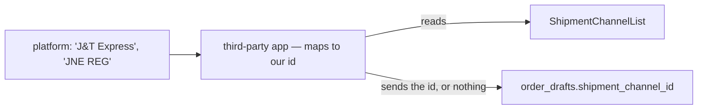

| | |
| --- | --- |
| shipment's contract | `ShipmentChannelList` — the codes and ids the app maps onto |
| the app's job | platform text → channel id, including REG/YES → one courier ([a-channel-is-a-courier](#a-channel-is-a-courier)) |
| the app cannot map | it sends no id — the draft's channel stays empty |
| a wrong mapping | the app's defect, corrected on the draft by a person |

**Why it is coherent.** The app already adapts one platform's page into our draft shape; the courier is one
more field it translates. Keeping platform vocabulary out of our database means a platform renaming a courier
is never our change.

⚠ **The cost:** the app needs our ids (or stable `code`s) — so a channel's `code` must never be edited once an
app maps onto it. What happens to a draft the app could not map is the order's to decide:
[an-order-cannot-be-created-without-a-channel](../order/context_clarify.md#an-order-cannot-be-created-without-a-channel).

---

## a-deleted-code-is-restored-not-recreated

> Owner (2026-09-16): **"yes"** — to *"re-creating a deleted `code`: refused (restore instead), or a new row?"*

**The verdict.** A `code` belongs to one row forever. Bringing back a deleted channel clears its `is_deleted`;
creating a channel whose `code` exists — deleted or not — is refused.

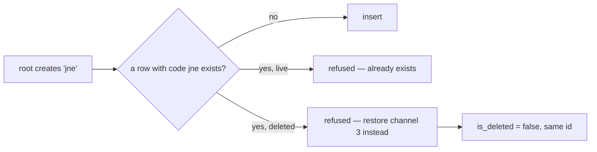

| | |
| --- | --- |
| uniqueness | `code` unique over **all** rows, deleted included — a plain unique index, not a partial one |
| restore | root only ([only-root-manages-channels](#only-root-manages-channels)), keeps the `id` |
| why | old orders and the third-party app ([the-app-converts-the-courier-to-a-channel-id](#the-app-converts-the-courier-to-a-channel-id)) both hold that id — a second `jne` would split them |

---

## the-handover-is-shipments-and-deferred

> Owner (2026-09-16): **"yes"** — to *"is recording the handover to the courier shipment's job, deferred like tracking?"*

**The verdict.** *"Warehouse Give to Shipping Channel"* — which parcels went to which courier, when — belongs to
shipment, and is not designed now. Until it is, the `shipped` status is the only record that a parcel left.

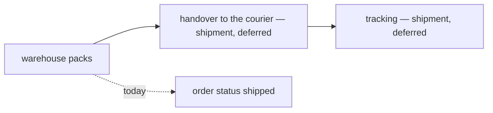

---

## the-channel-list-needs-no-login

> Owner (2026-09-16): **"no login at all"** — to *"does 'exposed to public' mean anyone signed in, or no login?"*.
> **Against my recommendation** (signed in).

**The verdict.** `ShipmentChannelList` is callable with no token. The courier catalogue is not a secret — the
third-party app and any screen can read it without an identity.

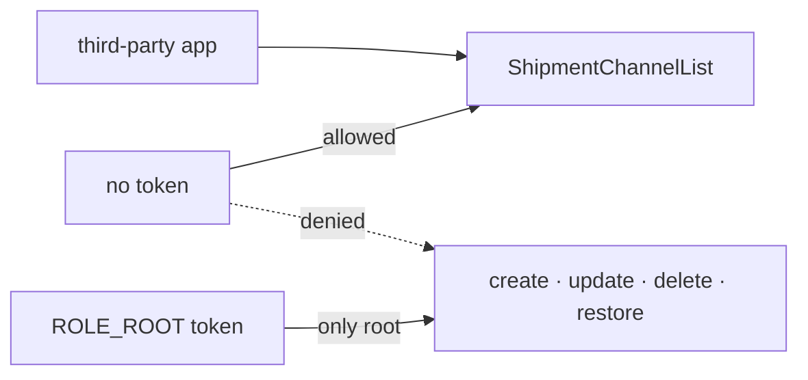

**The spec.** The request message carries `request_policy = { allow_all: true }` — the **existing** public
mode in `role_base/v1/role.proto` (*"the token is never read; no identity reaches the handler"*).

⚠ **Correction to my own question:** I wrote that no-login needed *"a new public marker"*. It does not —
`allow_all` already exists. Deny-by-default is unchanged: a message with no policy is still refused, and
`allow_all` is an explicit, per-message opt-in.

| | |
| --- | --- |
| `ShipmentChannelList` | `allow_all` — decided here |
| write RPCs | `roles: [ROLE_ROOT]` ([only-root-manages-channels](#only-root-manages-channels)) |
| `ShipmentChannelByIDs` | `allow_all` — [by-ids-is-public-too](#by-ids-is-public-too) |

---

## by-ids-is-public-too

> Owner (2026-09-16): **"yes"** — to *"is `ShipmentChannelByIDs` public too?"*

**The verdict.** `ShipmentChannelByIDs` carries `request_policy = { allow_all: true }`, like the list. Every
read of the courier catalogue needs no login; every write needs root.

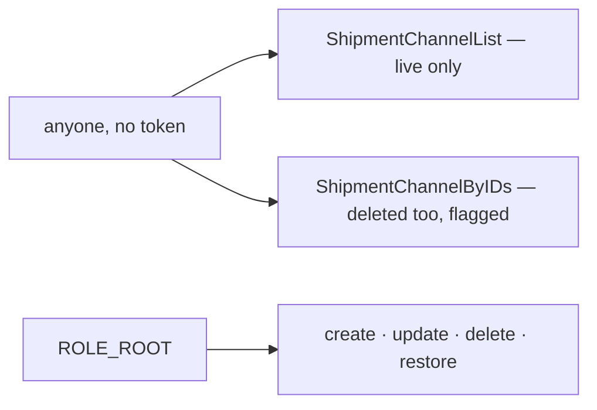

| RPC | policy |
| --- | --- |
| `ShipmentChannelList` | `allow_all` ([the-channel-list-needs-no-login](#the-channel-list-needs-no-login)) |
| `ShipmentChannelByIDs` | `allow_all` |
| create / update / delete / restore | `roles: [ROLE_ROOT]` ([only-root-manages-channels](#only-root-manages-channels)) |

---

## a-code-never-changes

> Owner (2026-09-16): **"yes"** — to *"`code` is immutable after create; `name` stays editable"*.

**The verdict.** Once a channel is created its `code` is fixed. The update RPC edits `name` and `desc` only.

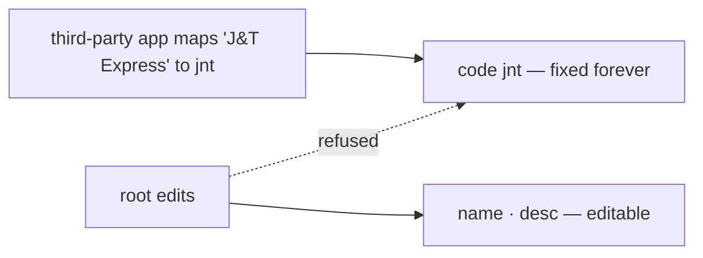

**Why.** The third-party app maps onto our channels
([the-app-converts-the-courier-to-a-channel-id](#the-app-converts-the-courier-to-a-channel-id)); a renamed code
breaks that mapping with no error on our side.

---

## the-three-channels-are-seeded

> Owner (2026-09-16): **"yes"** — to *"seed `jne`, `jnt`, `sicepat` in the service's migration"*.

**The verdict.** `shipment_service`'s migration inserts the three channels from [context.md](./context.md)
§Shipment Channel That Exists, so a fresh database can take an order before root has done anything.

| code | name |
| --- | --- |
| `jne` | JNE |
| `jnt` | J&T |
| `sicepat` | SiCepat |

---

## a-channel-records-updated-at

> Owner (2026-09-16): **"yes"** — to *"add `updated_at`"*.

**The verdict.** `shipment_channels` carries `updated_at`, set on every edit, delete and restore.

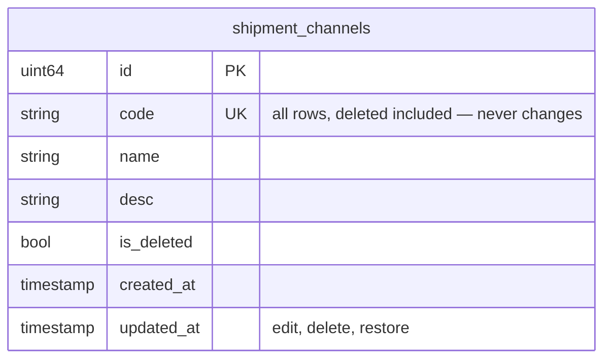
