# Decisions — shipment `context.md`

What the owner settled, recorded before it is acted on. **Append-only** — a decision that is later
reversed is renamed and its references grepped (RULE 12), never quietly edited away.

| decision | what it decided |
| --- | --- |
| [a-channel-has-an-id-and-a-unique-code](#a-channel-has-an-id-and-a-unique-code) | `shipment_channels` carries `id` (what an order stores) and a unique `code` (what a human reads) |
| [a-channel-is-soft-deleted](#a-channel-is-soft-deleted) | a channel is never removed — `is_deleted` hides it |
| [only-root-manages-channels](#only-root-manages-channels) | create, edit and delete are ROOT only — not admin, not a team |
| [tracking-is-deferred](#tracking-is-deferred) | tracking is shipment's job, and it is not designed now |
| [a-channel-is-a-courier](#a-channel-is-a-courier) | `jne` is a channel — `jne_reg` / `jne_yes` are not; the service level is the platform's |
| [a-deleted-channel-still-resolves-by-id](#a-deleted-channel-still-resolves-by-id) | `ShipmentChannelByIDs` returns deleted channels too, flagged — the picker list does not |
| [the-app-converts-the-courier-to-a-channel-id](#the-app-converts-the-courier-to-a-channel-id) | the third-party app maps platform courier text to our id — no alias table here |
| [a-deleted-code-is-restored-not-recreated](#a-deleted-code-is-restored-not-recreated) | a deleted channel comes back by restore, same id — its `code` is never reused |
| [the-handover-is-shipments-and-deferred](#the-handover-is-shipments-and-deferred) | recording parcels given to the courier is shipment's job, not designed now |
| [the-channel-list-needs-no-login](#the-channel-list-needs-no-login) | `ShipmentChannelList` is public — `allow_all`, no token read |
| [by-ids-is-public-too](#by-ids-is-public-too) | `ShipmentChannelByIDs` is public as well — every read open, every write root |
| [a-code-never-changes](#a-code-never-changes) | `code` is fixed at create — only `name` and `desc` are editable |
| [the-three-channels-are-seeded](#the-three-channels-are-seeded) | `jne`, `jnt`, `sicepat` arrive with the migration |
| [a-channel-records-updated-at](#a-channel-records-updated-at) | `shipment_channels` gains `updated_at` |
| [the-prototype-is-accepted](#the-prototype-is-accepted) | screens and `warehouse.shipment.v1` accepted at design_accept |
| [the-old-catalogue-bridges-by-code](#the-old-catalogue-bridges-by-code) | `shipping_service` is deleted; code-storing screens read `shipment_service` by code |
| [receipt-check-is-shipments](#receipt-check-is-shipments) | reading an uploaded shipping label is `ReceiptCheck`, served by `shipment_service` |
| [receipt-check-takes-the-file-bytes](#receipt-check-takes-the-file-bytes) | the request carries the file's bytes, sent beside the upload — no stored document is fetched |
| [receipt-check-returns-what-the-library-reads](#receipt-check-returns-what-the-library-reads) | it reads, it does not verify: the response is `Extract`'s `ReceiptData`, with no match verdict |
| [receipt-check-needs-a-login](#receipt-check-needs-a-login) | any signed-in user may call it — unlike the channel reads, it is NOT public |
| [a-label-outcome-is-a-result-not-an-error](#a-label-outcome-is-a-result-not-an-error) | unknown, several labels, not a label, unreadable: a `result` in a successful response |
| [receipt-check-caps-the-body-before-reading](#receipt-check-caps-the-body-before-reading) | the handler refuses a request over 3 MB before reading it; the file stays `max_len` 2 MB |
| [receipt-check-logs-only-the-result](#receipt-check-logs-only-the-result) | a log line carries the `result`, never the buyer's fields or the bytes |

---

## a-channel-has-an-id-and-a-unique-code

> Owner (2026-09-16), in [context.md](./context.md) §Table That Must Have — closing *"no channel identity rule"*.

**The verdict.** A channel has a primary-key `id` and a **unique** `code` (`jne`, `jnt`, `sicepat`), beside a
`name` and a `desc`. The order stores the `id`
([shipment-channel-is-an-id-into-shipment-service](../order/context_decision.md#shipment-channel-is-an-id-into-shipment-service)).

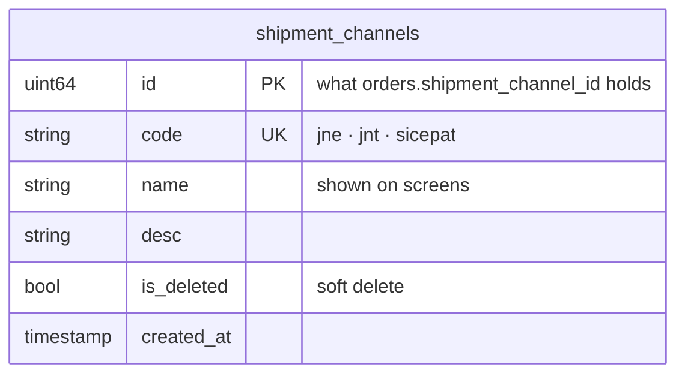
```mermaid
erDiagram
  shipment_channels {
    uint64 id PK "what orders.shipment_channel_id holds"
    string code UK "jne · jnt · sicepat"
    string name "shown on screens"
    string desc
    bool is_deleted "soft delete"
    timestamp created_at
  }
```

| field | rule |
| --- | --- |
| `id` | primary key — the only thing another service stores |
| `code` | unique, human-readable, stable |
| `name`, `desc` | free text, editable |
| `is_deleted` | see [a-channel-is-soft-deleted](#a-channel-is-soft-deleted) |
| `created_at` | set on create |

---

## a-channel-is-soft-deleted

> Owner (2026-09-16), `is_deleted, for soft delete` — closing *"can a channel be deleted, or only retired?"*

**The verdict.** Deleting a channel sets `is_deleted`. The row stays, so an order's `shipment_channel_id`
never points at nothing.

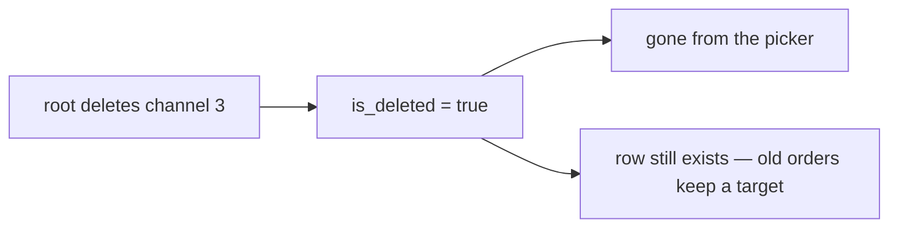
```mermaid
flowchart LR
  R["root deletes channel 3"] --> F["is_deleted = true"]
  F --> P["gone from the picker"]
  F --> O["row still exists — old orders keep a target"]
```

What a deleted channel still returns is settled in
[a-deleted-channel-still-resolves-by-id](#a-deleted-channel-still-resolves-by-id).

---

## only-root-manages-channels

> Owner (2026-09-16), §Who can manage — *"only root can create, edit and delete it"*. **Narrower than my
> recommendation** (root and admin).

**The verdict.** `ROLE_ROOT` alone may create, edit or delete a channel. The list is shared reference data for
every team, so no team — selling or warehouse — adds its own.

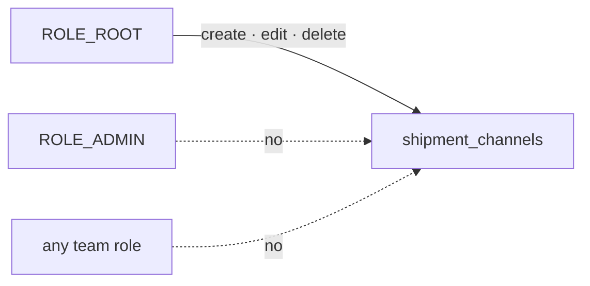
```mermaid
flowchart LR
  ROOT["ROLE_ROOT"] -->|"create · edit · delete"| C["shipment_channels"]
  ADMIN["ROLE_ADMIN"] -.->|"no"| C
  TEAM["any team role"] -.->|"no"| C
```

**The spec.** The create / edit / delete request messages carry
`request_policy = { roles: [ROLE_ROOT] }` and **no `use_scope`** — the list belongs to no team.

---

## tracking-is-deferred

> Owner (2026-09-16), §Responsibility — *"Provide tracking service [defered]"*.

**The verdict.** Tracking belongs to shipment, and is not designed in this pass. The question of whether
tracking **moves** an order's status or only **reports** it waits with it.

---

## a-channel-is-a-courier

> Owner (2026-09-16): **"yes its just courier"** — to *"is `jne` the channel, or `jne_reg` and `jne_yes`?"*

**The verdict.** One channel per **courier**. A service level (REG, YES, economy, instant) is not a channel and
is not stored by shipment — it is the platform's choice, and it does not change where a parcel goes at the dock.

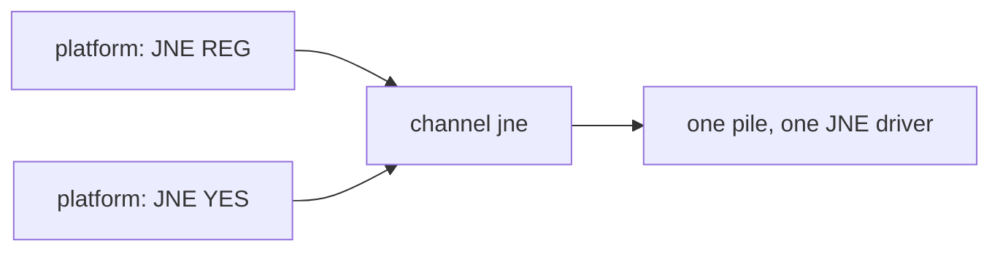
```mermaid
flowchart LR
  A["platform: JNE REG"] --> C["channel jne"]
  B["platform: JNE YES"] --> C
  C --> D["one pile, one JNE driver"]
```

| | |
| --- | --- |
| a channel is | a courier company: `jne`, `jnt`, `sicepat` |
| a channel is NOT | a courier + service level |
| consequence | every service-level name a platform uses maps to the one courier channel |

---

## a-deleted-channel-still-resolves-by-id

> Owner (2026-09-16): **"yes"** — to *"does a deleted channel still come back when an old order asks for it by id?"*

**The verdict.** Shipment exposes two reads with different jobs. The picker list shows live channels only;
resolving by id returns **every** requested channel, deleted ones included and flagged, so an old order never
shows a blank courier.

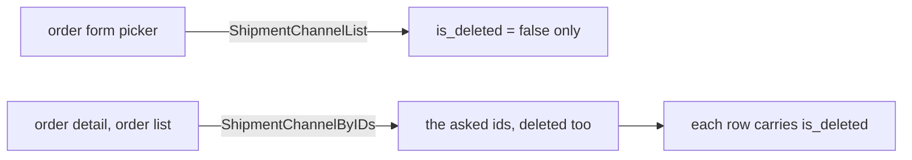
```mermaid
flowchart LR
  PICK["order form picker"] -->|"ShipmentChannelList"| LIVE["is_deleted = false only"]
  SCREEN["order detail, order list"] -->|"ShipmentChannelByIDs"| ALL["the asked ids, deleted too"]
  ALL --> FLAG["each row carries is_deleted"]
```

**The spec.**

| RPC | shape | returns |
| --- | --- | --- |
| `ShipmentChannelList` | guideline List shape, paged | live channels only |
| `ShipmentChannelByIDs` | guideline ByIDs shape | every requested id that exists, **including** `is_deleted = true`, flag set |

A screen may mark a deleted channel's name as deleted; it never refuses to render it.

---

## the-app-converts-the-courier-to-a-channel-id

> Owner (2026-09-16): **"third party app obey our rule, they convert it, not our system responsbility"** — to
> *"who turns the platform's courier text into `shipment_channel_id`?"*. **Against my recommendation** (B, a
> shipment alias table).

**The verdict.** The third-party app reads our channel list and sends a `shipment_channel_id`. Our system never
receives, stores or matches the platform's courier text. There is **no alias table**.

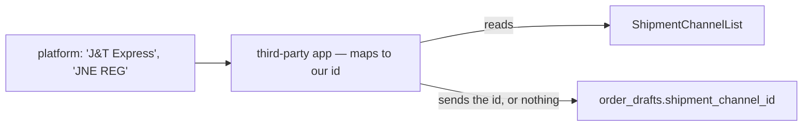
```mermaid
flowchart LR
  P["platform: 'J&T Express', 'JNE REG'"] --> APP["third-party app — maps to our id"]
  APP -->|"reads"| L["ShipmentChannelList"]
  APP -->|"sends the id, or nothing"| D["order_drafts.shipment_channel_id"]
```

| | |
| --- | --- |
| shipment's contract | `ShipmentChannelList` — the codes and ids the app maps onto |
| the app's job | platform text → channel id, including REG/YES → one courier ([a-channel-is-a-courier](#a-channel-is-a-courier)) |
| the app cannot map | it sends no id — the draft's channel stays empty |
| a wrong mapping | the app's defect, corrected on the draft by a person |

**Why it is coherent.** The app already adapts one platform's page into our draft shape; the courier is one
more field it translates. Keeping platform vocabulary out of our database means a platform renaming a courier
is never our change.

⚠ **The cost:** the app needs our ids (or stable `code`s) — so a channel's `code` must never be edited once an
app maps onto it. What happens to a draft the app could not map is the order's to decide:
[an-order-cannot-be-created-without-a-channel](../order/context_clarify.md#an-order-cannot-be-created-without-a-channel).

---

## a-deleted-code-is-restored-not-recreated

> Owner (2026-09-16): **"yes"** — to *"re-creating a deleted `code`: refused (restore instead), or a new row?"*

**The verdict.** A `code` belongs to one row forever. Bringing back a deleted channel clears its `is_deleted`;
creating a channel whose `code` exists — deleted or not — is refused.

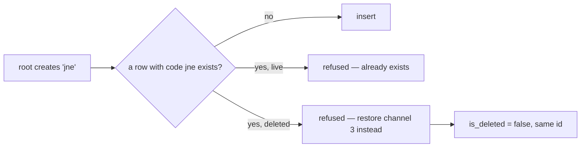
```mermaid
flowchart LR
  C["root creates 'jne'"] --> E{"a row with code jne exists?"}
  E -->|"no"| N["insert"]
  E -->|"yes, live"| X["refused — already exists"]
  E -->|"yes, deleted"| R["refused — restore channel 3 instead"]
  R --> U["is_deleted = false, same id"]
```

| | |
| --- | --- |
| uniqueness | `code` unique over **all** rows, deleted included — a plain unique index, not a partial one |
| restore | root only ([only-root-manages-channels](#only-root-manages-channels)), keeps the `id` |
| why | old orders and the third-party app ([the-app-converts-the-courier-to-a-channel-id](#the-app-converts-the-courier-to-a-channel-id)) both hold that id — a second `jne` would split them |

---

## the-handover-is-shipments-and-deferred

> Owner (2026-09-16): **"yes"** — to *"is recording the handover to the courier shipment's job, deferred like tracking?"*

**The verdict.** *"Warehouse Give to Shipping Channel"* — which parcels went to which courier, when — belongs to
shipment, and is not designed now. Until it is, the `shipped` status is the only record that a parcel left.

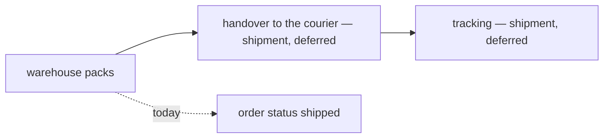
```mermaid
flowchart LR
  W["warehouse packs"] --> H["handover to the courier — shipment, deferred"]
  H --> T["tracking — shipment, deferred"]
  W -.->|"today"| S["order status shipped"]
```

---

## the-channel-list-needs-no-login

> Owner (2026-09-16): **"no login at all"** — to *"does 'exposed to public' mean anyone signed in, or no login?"*.
> **Against my recommendation** (signed in).

**The verdict.** `ShipmentChannelList` is callable with no token. The courier catalogue is not a secret — the
third-party app and any screen can read it without an identity.

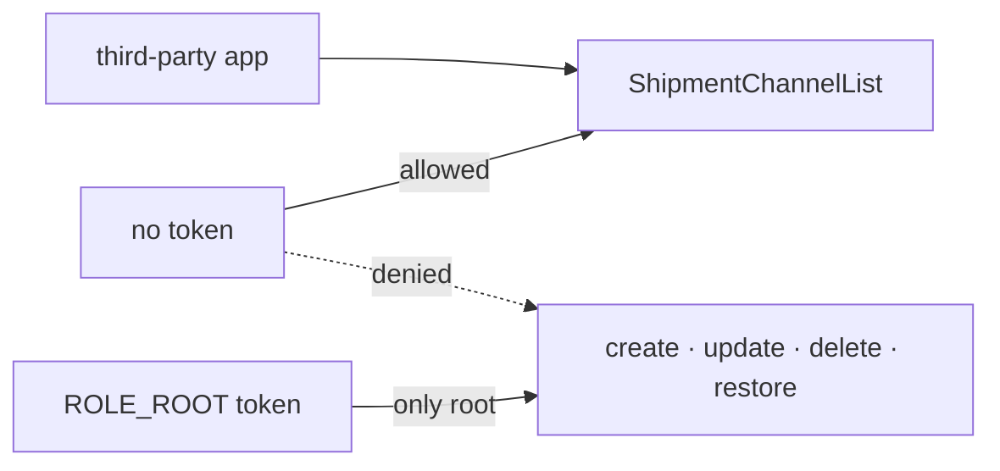
```mermaid
flowchart LR
  ANON["no token"] -->|"allowed"| L["ShipmentChannelList"]
  APP["third-party app"] --> L
  ROOT["ROLE_ROOT token"] -->|"only root"| W["create · update · delete · restore"]
  ANON -.->|"denied"| W
```

**The spec.** The request message carries `request_policy = { allow_all: true }` — the **existing** public
mode in `role_base/v1/role.proto` (*"the token is never read; no identity reaches the handler"*).

⚠ **Correction to my own question:** I wrote that no-login needed *"a new public marker"*. It does not —
`allow_all` already exists. Deny-by-default is unchanged: a message with no policy is still refused, and
`allow_all` is an explicit, per-message opt-in.

| | |
| --- | --- |
| `ShipmentChannelList` | `allow_all` — decided here |
| write RPCs | `roles: [ROLE_ROOT]` ([only-root-manages-channels](#only-root-manages-channels)) |
| `ShipmentChannelByIDs` | `allow_all` — [by-ids-is-public-too](#by-ids-is-public-too) |

---

## by-ids-is-public-too

> Owner (2026-09-16): **"yes"** — to *"is `ShipmentChannelByIDs` public too?"*

**The verdict.** `ShipmentChannelByIDs` carries `request_policy = { allow_all: true }`, like the list. Every
read of the courier catalogue needs no login; every write needs root.

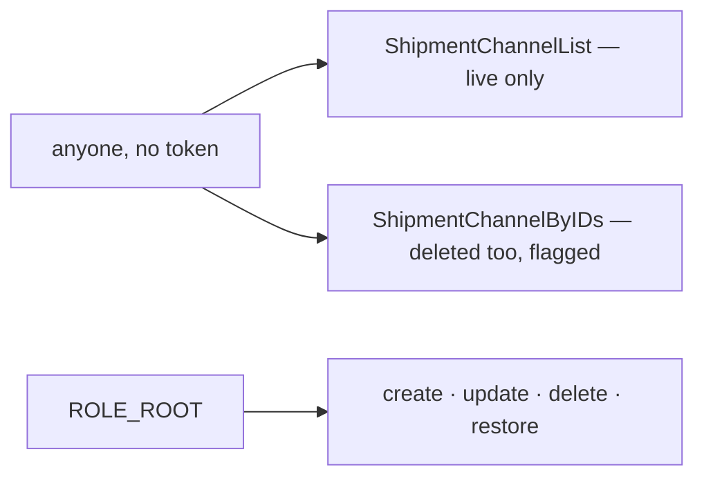
```mermaid
flowchart LR
  ANY["anyone, no token"] --> L["ShipmentChannelList — live only"]
  ANY --> B["ShipmentChannelByIDs — deleted too, flagged"]
  ROOT["ROLE_ROOT"] --> W["create · update · delete · restore"]
```

| RPC | policy |
| --- | --- |
| `ShipmentChannelList` | `allow_all` ([the-channel-list-needs-no-login](#the-channel-list-needs-no-login)) |
| `ShipmentChannelByIDs` | `allow_all` |
| create / update / delete / restore | `roles: [ROLE_ROOT]` ([only-root-manages-channels](#only-root-manages-channels)) |

---

## a-code-never-changes

> Owner (2026-09-16): **"yes"** — to *"`code` is immutable after create; `name` stays editable"*.

**The verdict.** Once a channel is created its `code` is fixed. The update RPC edits `name` and `desc` only.

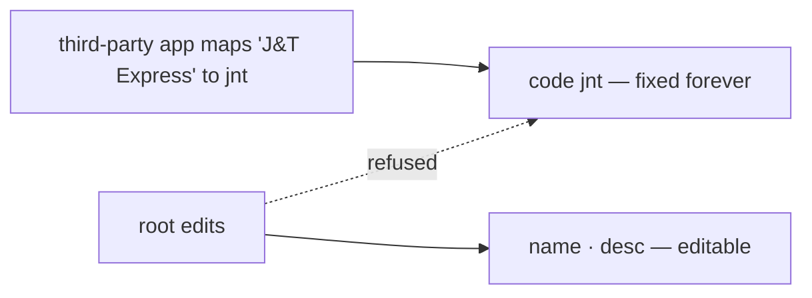
```mermaid
flowchart LR
  APP["third-party app maps 'J&T Express' to jnt"] --> CODE["code jnt — fixed forever"]
  ROOT["root edits"] --> NAME["name · desc — editable"]
  ROOT -.->|"refused"| CODE
```

**Why.** The third-party app maps onto our channels
([the-app-converts-the-courier-to-a-channel-id](#the-app-converts-the-courier-to-a-channel-id)); a renamed code
breaks that mapping with no error on our side.

---

## the-three-channels-are-seeded

> Owner (2026-09-16): **"yes"** — to *"seed `jne`, `jnt`, `sicepat` in the service's migration"*.

**The verdict.** `shipment_service`'s migration inserts the three channels from [context.md](./context.md)
§Shipment Channel That Exists, so a fresh database can take an order before root has done anything.

| code | name |
| --- | --- |
| `jne` | JNE |
| `jnt` | J&T |
| `sicepat` | SiCepat |

---

## a-channel-records-updated-at

> Owner (2026-09-16): **"yes"** — to *"add `updated_at`"*.

**The verdict.** `shipment_channels` carries `updated_at`, set on every edit, delete and restore.

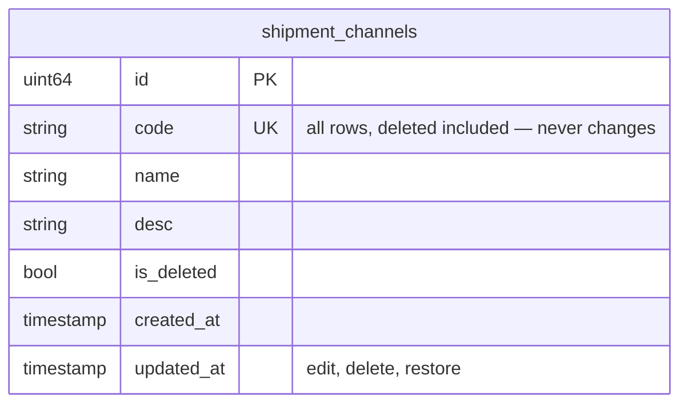
```mermaid
erDiagram
  shipment_channels {
    uint64 id PK
    string code UK "all rows, deleted included — never changes"
    string name
    string desc
    bool is_deleted
    timestamp created_at
    timestamp updated_at "edit, delete, restore"
  }
```

---

## the-prototype-is-accepted

> Owner (2026-09-16): **"yes, i accept the design, make it fully implemented"** — at `design_accept` for the
> Storybook prototype ([design-accept-blocks](../../development_lifecycle_decision.md#design-accept-blocks)).

**The verdict.** The screens AND the contract (`warehouse.shipment.v1`) are accepted together
([contract-accepted-with-the-screens](../../development_lifecycle_decision.md#contract-accepted-with-the-screens)),
including the five details the decisions did not state:

| accepted with the screens | |
| --- | --- |
| `ShipmentChannelListFilter.include_deleted`, default false | the management page sets it; the picker and the app do not |
| `ShipmentChannelByIds` | the repo's `ByIds` spelling |
| proto field `desc` | the column's own name |
| code `^[a-z0-9_]+$`, max 40 | a stable lowercase key |
| restore has no confirm, delete does | restore is undone by deleting |

A contract change from here is a new pass, not an amendment.

---

## the-old-catalogue-bridges-by-code

> Owner (2026-09-16): **"Shipment, plus a code bridge"** — to *"how far does fully implemented go, while order and
> restock screens still store a courier CODE?"*

**The verdict.** `shipment_service` replaces `shipping_service` as the ONE courier catalogue now. Screens that still
store a courier **code** (`shipping_code` on selling orders and restocks) read names from `shipment_service` by that
code. Moving those records to `shipment_channel_id` belongs to the order redesign, not to this pass.

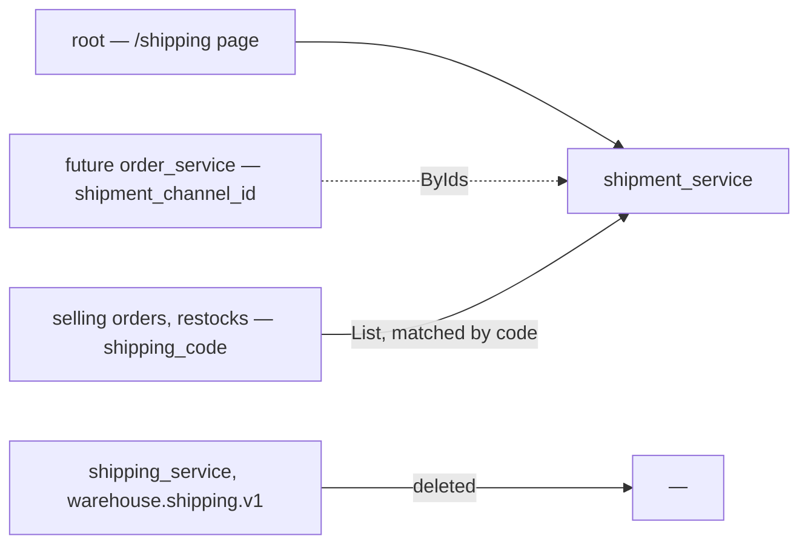
```mermaid
flowchart LR
  ROOT["root — /shipping page"] --> S["shipment_service"]
  NEW["future order_service — shipment_channel_id"] -.->|"ByIds"| S
  OLD["selling orders, restocks — shipping_code"] -->|"List, matched by code"| S
  X["shipping_service, warehouse.shipping.v1"] -->|"deleted"| GONE["—"]
```

| | |
| --- | --- |
| deleted | `shipping_service`, `warehouse.shipping.v1`, `pages/shipping-channels` |
| kept, re-pointed | `ShippingSelect` (live channels, still emits a code), `ShippingBadge` (names by code, deleted ones included) |
| the `/shipping` menu | opens the new page, **root only** ([only-root-manages-channels](#only-root-manages-channels)) |
| ⚠ old data | existing rows with a code outside the new seed (e.g. `anteraja`) render as the raw code until root creates that channel |
| ⚠ old table | `shippings` is left in existing databases, unused — no migration of another service may drop it |

---

## receipt-check-is-shipments

> Owner (2026-10-05), in [context.md](./context.md) §What Exposed to Public 2 and §`ReceiptCheck` rpc: *"provide tool
> for check receipt that named `ReceiptCheck`"*, *"its use receipt reader"*. This answers
> [receipt_readers Q3](../../technical/packages/receipt_readers/context_clarify.md#question), *which service hosts the
> scan?* **Against my recommendation** (order_service).

**The verdict.** The RPC that reads an uploaded shipping label is **`ReceiptCheck`**, served by `shipment_service`,
and it runs [`san_receipt_readers.Extract`](../../technical/packages/receipt_readers/context.md). The name
`ReceiptScan` from the receipt reader's clarify is retired.

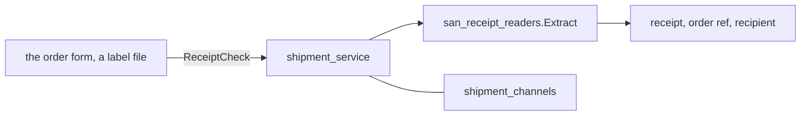
```mermaid
flowchart LR
  F["the order form, a label file"] -->|"ReceiptCheck"| S["shipment_service"]
  S --> E["san_receipt_readers.Extract"]
  E --> R["receipt, order ref, recipient"]
  S --- C["shipment_channels"]
```

| | |
| --- | --- |
| host | `shipment_service`, not order_service as I had recommended |
| name | `ReceiptCheck`, replacing `ReceiptScan` |
| engine | `backend/packages/san_receipt_readers`: a package, and this RPC is its only caller |
| still open | who may call it, read or verify, bytes or a stored document: [the clarify](./context_clarify.md#question) |

**Why I now agree.** A receipt is the courier's number for one parcel. Shipment already owns two deferred jobs, the
handover ([the-handover-is-shipments-and-deferred](#the-handover-is-shipments-and-deferred)) and tracking
([tracking-is-deferred](#tracking-is-deferred)), and both are keyed on that number. My order_service argument looked
only at today's caller.

---

## receipt-check-takes-the-file-bytes

> Owner (2026-10-05): **"for q4 take file byte"**, to *"the file: its bytes, or a stored document?"* (was Q4,
> re-routed from [receipt_readers Q2](../../technical/packages/receipt_readers/context_clarify.md#question)). As
> recommended.

**The verdict.** `ReceiptCheckRequest` carries the file's bytes. The order form sends them while it uploads the same
file to storage, and shipment never fetches a stored document.

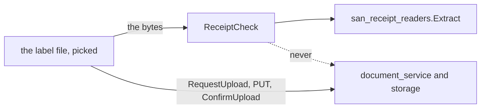
```mermaid
flowchart LR
  P["the label file, picked"] -->|"the bytes"| RC["ReceiptCheck"]
  P -->|"RequestUpload, PUT, ConfirmUpload"| D["document_service and storage"]
  RC --> E["san_receipt_readers.Extract"]
  RC -.->|"never"| D
```

| | spec |
| --- | --- |
| request | `bytes file_content`, the name `settlement_importer` already uses for a file |
| document_service | not called: no service-to-service read |
| starts | as soon as the file is picked, beside the upload rather than after it |
| known cost | the server can't prove the checked bytes are the stored ones. Harmless, because the check gives no verdict ([receipt-check-returns-what-the-library-reads](#receipt-check-returns-what-the-library-reads)) |

---

## receipt-check-returns-what-the-library-reads

> Owner (2026-10-05): **"for q3 return resp on library"**, to *"'check': read the label, or verify it?"* (was Q3). As
> recommended: read.

**The verdict.** `ReceiptCheck` reads; it does not verify. Its response is what
[`Extract`](../../technical/packages/receipt_readers/context.md) returns, field for field. Comparing that with what
the person typed is the order form's job, and the server gives no match verdict, so nothing can block an order on it.

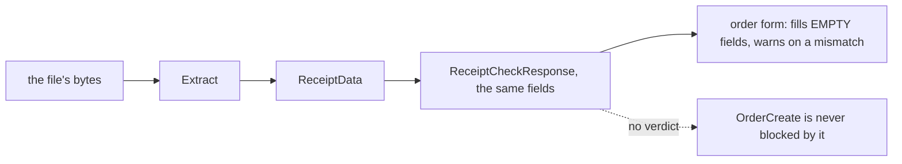
```mermaid
flowchart LR
  F["the file's bytes"] --> E["Extract"]
  E --> D["ReceiptData"]
  D --> R["ReceiptCheckResponse, the same fields"]
  R --> FORM["order form: fills EMPTY fields, warns on a mismatch"]
  R -.->|"no verdict"| O["OrderCreate is never blocked by it"]
```

| response field | from `ReceiptData` |
| --- | --- |
| `receipt` | `Receipt`: the tracking number, or an instant label's pickup code |
| `order_ref_id` | `OrderID`. The name follows [receipt_readers critique 2](../../technical/packages/receipt_readers/context_clarify.md#critique) |
| `customer_name` · `phone` · `address` | `CustomerName` · `Phone` · `Address`; `""` = not printed, or masked |
| **not in it** | a match flag, the typed receipt, a courier ([courier-is-not-read](../../technical/packages/receipt_readers/context_decision.md#courier-is-not-read)) |

⚠ Not decided here: how `Extract`'s **errors** reach the caller. The `result` enum is still my proposal
([an-unknown-label-is-not-an-error](./context_clarify.md#critique)).

---

## receipt-check-needs-a-login

> Owner (2026-10-05): **"for q2, signed user only"**, to *"who may call `ReceiptCheck`: anyone, or anyone signed in?"*
> (was Q2). As recommended. It narrows §What Exposed to Public 2: "public" here does **not** mean no login, as it did
> for the channel list ([the-channel-list-needs-no-login](#the-channel-list-needs-no-login)).

**The verdict.** Any signed-in user may call `ReceiptCheck`, whatever their role or team. A caller without a valid token
is refused. The channel reads stay open to everyone.

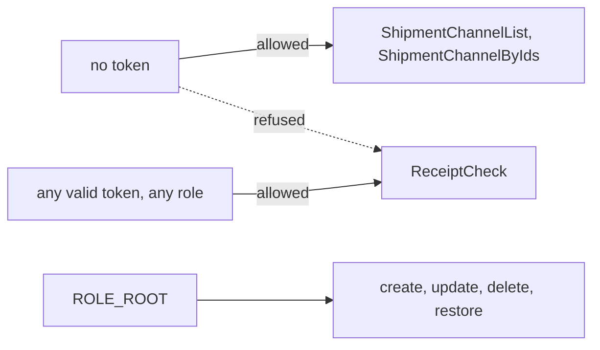
```mermaid
flowchart LR
  ANON["no token"] -->|"allowed"| L["ShipmentChannelList, ShipmentChannelByIds"]
  ANON -.->|"refused"| RC["ReceiptCheck"]
  USER["any valid token, any role"] -->|"allowed"| RC
  ROOT["ROLE_ROOT"] --> W["create, update, delete, restore"]
```

| | spec |
| --- | --- |
| policy | `request_policy = { allow_only_authenticated: true }` |
| scope | **no `use_scope` field**: the check stores nothing and reads no team's data, so there is no team to check |
| why not public | it parses a file the caller sends (up to 2 MB, barcode decoding, a PDF library that panics on hostile input), so an anonymous caller could loop it |

| RPC | policy |
| --- | --- |
| `ShipmentChannelList`, `ShipmentChannelByIds` | `allow_all` |
| `ReceiptCheck` | `allow_only_authenticated` — decided here |
| create / update / delete / restore | `roles: [ROLE_ROOT]` |

---

## a-label-outcome-is-a-result-not-an-error

> Owner (2026-10-05): **"yes"**, to *"outcomes as a field, not errors"* (critique an-unknown-label-is-not-an-error).

**The verdict.** Every answer `Extract` can give about a file comes back in a **successful** response, as a `result`.
Only a fault in the handler itself is a Connect error. A label the reader hasn't learned yet is normal, not a failure.

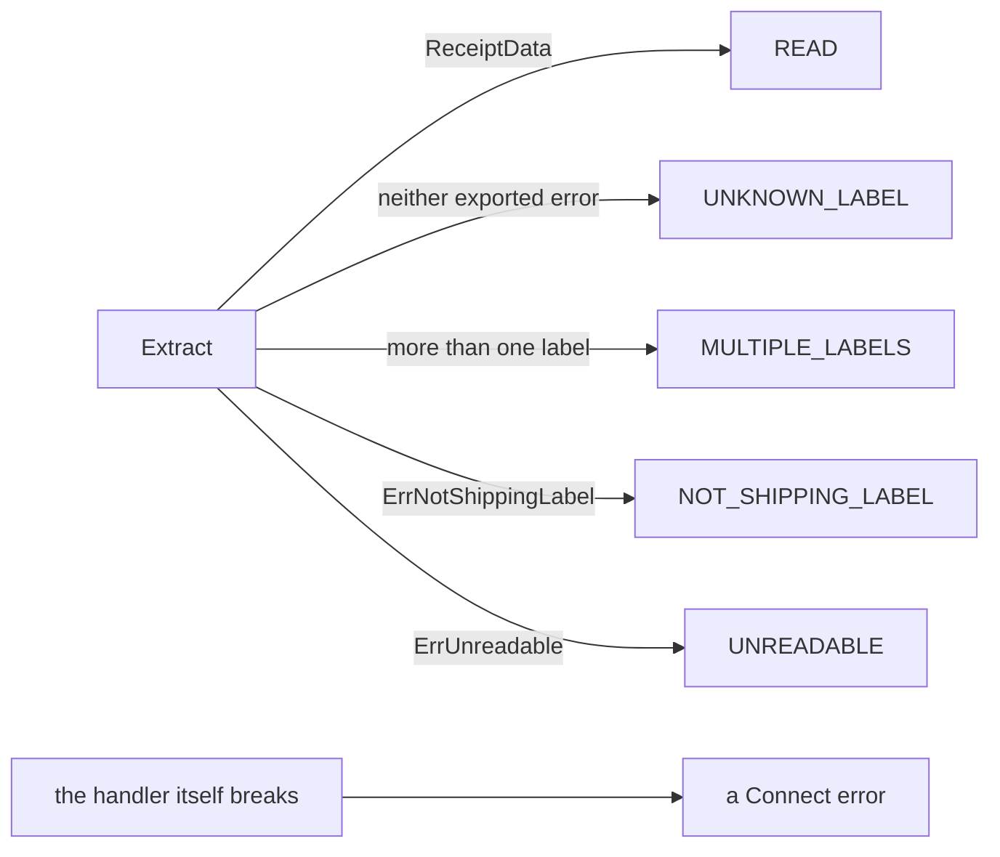
```mermaid
flowchart LR
  E["Extract"] -->|"ReceiptData"| R1["READ"]
  E -->|"neither exported error"| R2["UNKNOWN_LABEL"]
  E -->|"more than one label"| R3["MULTIPLE_LABELS"]
  E -->|"ErrNotShippingLabel"| R4["NOT_SHIPPING_LABEL"]
  E -->|"ErrUnreadable"| R5["UNREADABLE"]
  H["the handler itself breaks"] --> X["a Connect error"]
```

| `result` | the fields | the order form |
| --- | --- | --- |
| `READ` | filled, `""` where not printed or masked | fills the EMPTY fields, warns on a mismatch |
| `UNKNOWN_LABEL` | all `""` | nothing: the person types |
| `MULTIPLE_LABELS` | all `""`, never page 1 | "this file holds several labels" |
| `NOT_SHIPPING_LABEL` | all `""` | "this is not a shipping label" |
| `UNREADABLE` | all `""` | "this file can't be opened" |

⚠ `MULTIPLE_LABELS` reaches the caller only once the reader exports that error
([receipt_readers critique 4](../../technical/packages/receipt_readers/context_clarify.md#critique)). Until then a bulk
print is `UNKNOWN_LABEL`: still safe, since nothing is filled.

---

## receipt-check-caps-the-body-before-reading

> Owner (2026-10-05): **"yes"**, to *"a 3 MB request cap on this handler only"* (critique the-cap-arrives-too-late).

**The verdict.** The `ReceiptCheck` handler is mounted with `connect.WithReadMaxBytes` of 3 MB, so a larger request is
refused before it is read into memory. The contract still says the file's own limit: `max_len` 2 MB, `Extract`'s cap.

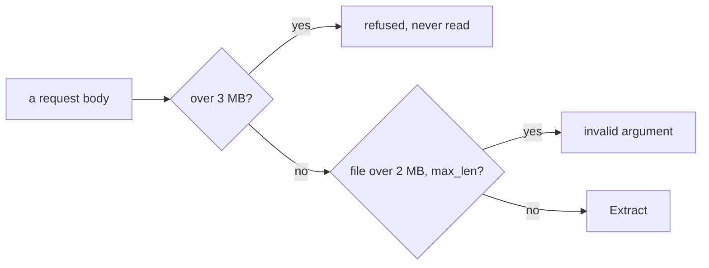
```mermaid
flowchart LR
  B["a request body"] --> T{"over 3 MB?"}
  T -->|"yes"| X["refused, never read"]
  T -->|"no"| V{"file over 2 MB, max_len?"}
  V -->|"yes"| Y["invalid argument"]
  V -->|"no"| E["Extract"]
```

| | spec |
| --- | --- |
| transport | `connect.WithReadMaxBytes(3 << 20)` on `ReceiptService` only; the channel handlers keep the default |
| why 3 MB | 2 MB of bytes is about 2.7 MB as base64 in JSON, which the browser sends |
| contract | `bytes file_content` with `min_len: 1, max_len: 2097152` |
| precedent | `settlement_importer_service/register.go` caps its file upload the same way |

---

## receipt-check-logs-only-the-result

> Owner (2026-10-05): **"yes"**, to *"log only the result"* (critique the-response-carries-a-buyer).

**The verdict.** Whatever `ReceiptCheck` logs carries the `result` and the file's size, never the receipt, the order
number, the buyer's name, address or phone, and never the bytes.

| logged | never logged |
| --- | --- |
| `result`, the file's size, the duration | `receipt`, `order_ref_id`, `customer_name`, `phone`, `address`, the file |

**Why.** The caller sent the file, so the response leaks nothing to them, but a log line would copy a buyer's address
into our logs. That's the same reason the receipt samples stay out of git
([receipt_readers Q5](../../technical/packages/receipt_readers/context_clarify.md#question)).
