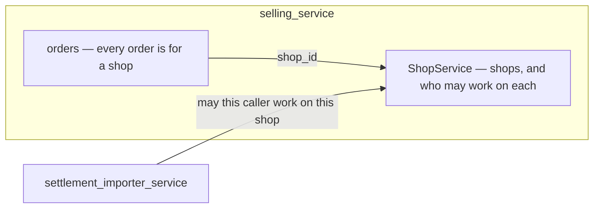

# Clarify — `shop/context.md`

What I read out of [context.md](./context.md), and what has to be settled beside it. **That doc is yours — this
one is mine.** An answered point is deleted; what you settle will be recorded in `context_decision.md` beside it.

🆕 **First pass, 2026-09-28** — the doc is new: an empty §General, and one responsibility — *"Manage Shop for
Selling Team"*: create, edit, delete, list. One question arrives already open: who may work on a shop,
re-routed from the settlement importer.

## What already exists

The shop is not new. **`ShopService` ships today inside `selling_service`** (#66), with shop access (#86),
and the `/shops` and shop-detail screens:

| your doc | built |
| --- | --- |
| create | `ShopCreate` |
| edit | `ShopUpdate` |
| delete | `ShopDelete` — a SOFT delete: the row stays with `deleted` set, and its code is freed |
| list | `ShopList` |
| — | `ShopDetail` — one shop by id, scoped to its team |
| — | **shop access** — `ShopUserList` · `ShopUserAdd` · `ShopUserRemove`: which users may work on a shop |

## Critique

| # | Problem | → Recommend |
| --- | --- | --- |
| **1** | **Shop access is built, missing from the doc — and enforced nowhere.** `shop_users` grants one user one shop, and only its own three RPCs read it: orders, settlement and every screen ignore it. The settlement importer's shop check ([the-shop-is-checked-before-the-file-is-stored](../settlement/settlement_importer_decision.md#the-shop-is-checked-before-the-file-is-stored)) will be its first reader. | Add it to §Responsbility, and settle what it means — [Q1](#question). |
| **2** | **The doc's title is *Shop Service*, and there is no shop service.** Shops are one proto service inside `selling_service`, which *"will grow to own orders too … shops are the first piece"* ([selling.proto](../../../proto/warehouse/selling/v1/selling.proto)). A `business/shop/` context reads as a service of its own. | Say which — [Q2](#question). |
| **3** | **"delete" is soft.** The row stays with `deleted` set, so the orders and settlement rows that name it keep pointing at it. | Say it in the doc: a deleted shop stays readable, and takes no new import — the importer's shop check refuses it. |

## Question

1. **Who may work on a shop — its listed users only, or its team's owner and admin too?** ➡ Re-routed from
   [importer Q12](../settlement/settlement_importer_clarify.md#question), where the importer's flow asks *"is caller
   that access on shop"* — this doc owns the answer. Shop access exists — `shop_users`, one grant per user per
   shop (`ShopUserAdd`) — but nothing reads it except its own three RPCs, so the importer would be its first
   enforcement, and what it means is set here.
   **→ Recommend: the shop's listed users, plus the team's owner and admin** — and root and admin, who pass
   every scope. A CS person works only on the shops they are granted, so the grant finally means something,
   while the people who run the team never need a grant to act on it. The check is one lookup: add `user_id`
   to `ShopUserListFilter`, so *"is this caller on this shop?"* reads one row instead of paging.

2. **Is the shop its own service, or does `ShopService` stay inside `selling_service`?** Your doc is titled
   *Shop Service Context*, in a context of its own.
   **→ Recommend: it stays.** Every order is for a shop, and orders live in `selling_service` — one service
   keeps that join local and the shop check one call away. A separate `shop_service` would move `shops` and
   `shop_users`, their migrations and every caller, for no job a shop does alone.

# Contradiction

**None found.** The doc's four jobs match the built RPCs; what it lacks is listed above, not contradicted.
