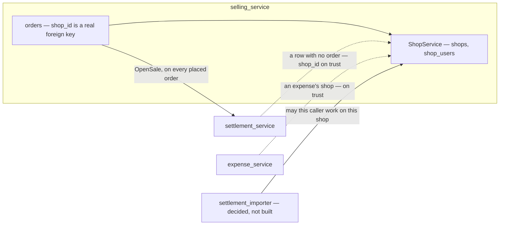
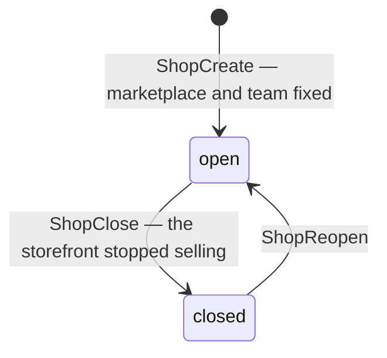
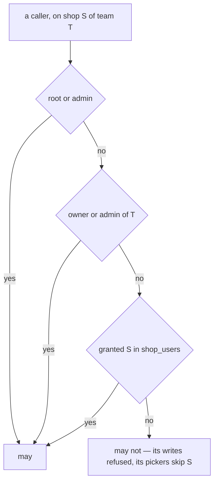
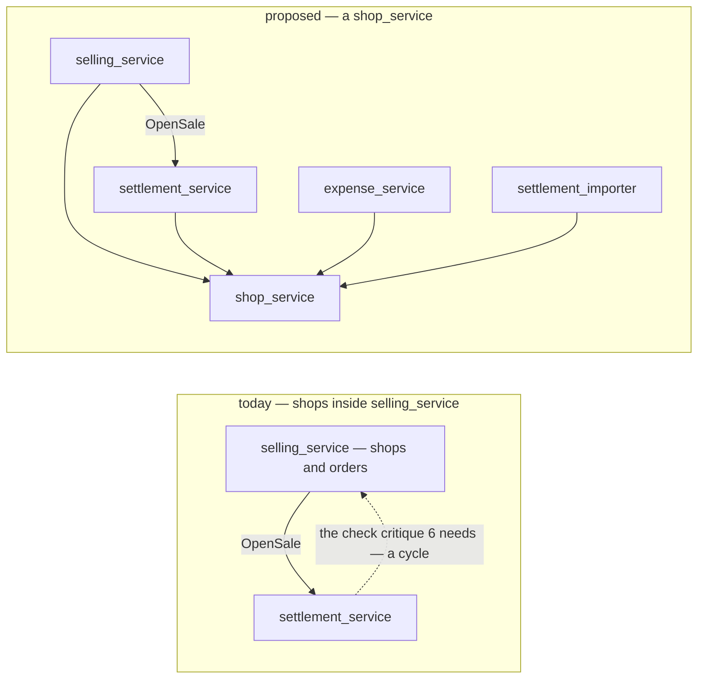
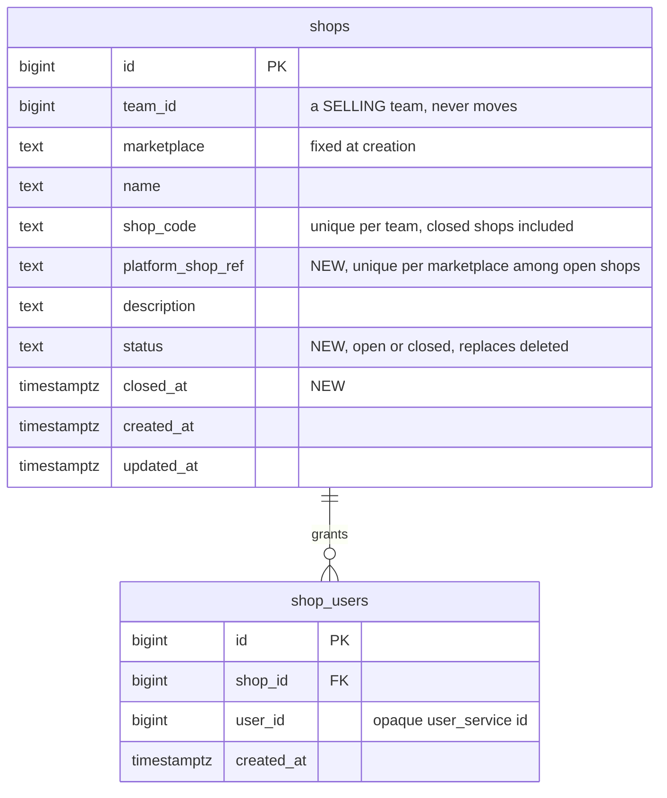

# Clarify — `shop/context.md`

What I read out of [context.md](./context.md), and what has to be settled beside it. **That doc is yours — this
one is mine.** An answered point is deleted; what you settled is in [context_decision.md](./context_decision.md).

🔄 **Second pass, 2026-09-28 — the whole doc, read against the build.** The first pass carried importer Q12 across
and asked where the shop lives. Everything §Responsbility lists already ships, so what is open is what the doc
does not say: **where the shop lives, what *delete* does to its history, what is fixed at creation, and what
other services may ask it.**

| | |
| --- | --- |
| ✅ your edits | §Responsbility gained *"give access user to shop"* (2026-09-28), then made it *"manage access user to shop"* (2026-09-29) — recorded as [access-is-given-per-user-per-shop](./context_decision.md#access-is-given-per-user-per-shop) and [the-shop-manages-its-access-list](./context_decision.md#the-shop-manages-its-access-list). Who needs a grant, and what it gates, is still [Q1](#question) |
| 🆕 +1 (2026-09-29) | [Q6](#question) — *manage* includes seeing who has access, and the list keeps people who left the team |
| 🔄 revised | [Q2](#question) — I now recommend its **own** `shop_service`. Settlement has to ask about shops, and selling already calls settlement |
| 🔄 corrected | critique 3 said a deleted shop *stays readable* — nothing can read it, and a closed shop still has payouts coming |
| 🆕 +3 | [Q3](#question) close, not delete · [Q4](#question) marketplace and team fixed · [Q5](#question) the shop's own name on the platform |
| ➡ moved here | [architecture Q6](../../technical/architecture/context_clarify.md#question) — *team_service or order_service?* — is Q2, asked earlier |
| ⛔ found | settlement opens a shop's account under **whichever team posts to it first** — [critique 6](#critique) |

## What already exists

**`ShopService` ships inside `selling_service`** (#66), with shop access (#86), the `/shops` and shop-detail
screens, and `ShopSelect`:

| your doc | built |
| --- | --- |
| create | `ShopCreate` |
| edit | `ShopUpdate` — every field, the marketplace included |
| delete | `ShopDelete` — soft: `deleted` is set, the code is freed, and the shop **disappears from every read** |
| list | `ShopList` — open shops only, searched by name or code |
| — | `ShopDetail` — one open shop |
| manage access user to shop | **shop access** — `ShopUserList` · `ShopUserAdd` · `ShopUserRemove`, one grant of one user to one shop |

Who reads a shop today — a dotted line is a `shop_id` taken on trust, with nothing asked:

## Critique

| # | Problem | → Recommend |
| --- | --- | --- |
| **1** | **Shop access is in the doc now — and still enforced nowhere.** ✅ *"manage access user to shop"* ([the-shop-manages-its-access-list](./context_decision.md#the-shop-manages-its-access-list)). But `shop_users` is read only by its own three RPCs: orders, settlement and every screen ignore it. The importer's shop check ([the-shop-is-checked-before-the-file-is-stored](../settlement/settlement_importer_decision.md#the-shop-is-checked-before-the-file-is-stored)) will be its first reader. | Settle who needs a grant and what it gates — [Q1](#question). |
| **2** | **The title says *Shop Service*, and there is no shop service.** Shops are one proto service inside `selling_service`. | Say which — [Q2](#question). |
| **3** | 🔄 **Delete hides a shop from everything that still points at it.** `ShopList` and `ShopDetail` both filter out `deleted`, so nothing can read a deleted shop: the settlement report's by-shop ranking names its row `#7`, and the orders filter cannot pick it. And a shop is paid **after** it stops selling — its last orders settle and its balance is withdrawn later — while the importer's check, as specified, refuses a deleted shop. | **Close, not delete** — [Q3](#question). |
| **4** | ***"for Selling Team"* is not enforced.** `ShopCreate` writes into any team it is given. The menu hides `/shops` from a warehouse team; the RPC does not. | `ShopCreate` refuses a team whose type is not SELLING — one lookup. |
| **5** | **The marketplace can be edited after a shop has history.** `ShopUpdate` takes it, and the edit dialog offers it. It is what picks the import's reader, what a ref is unique within ([an-order-is-unique-by-shop-and-marketplace-ref](../order/context_decision.md#an-order-is-unique-by-shop-and-marketplace-ref)), and the badge on every past order. | Fixed at creation, with the team — [Q4](#question). |
| **6** | ⛔ **Other services take a `shop_id` on trust, and settlement lets a team claim another's shop.** A row with no order opens its shop's account under the **caller's** team, and the team is checked only after ([post_entry.go:282](../../../backend/services/settlement_service/settlement_v1/post_entry.go#L282)). Team A posts one such row naming team B's shop before B has posted any: the account is A's, and every such post B makes to its own shop answers `errWrongTeam` from then on. `expense_service` stores any `shop_id` it is given. Neither has anything to ask — the doc names no RPC for other services, as [warehouse's](../teams/warehouse/context.md) does. | Add `## Rpc That Must Exist for other service use`: **`ShopByIds`** — team, marketplace and status per shop, closed ones included. Settlement asks it before opening a shop's account, expense before storing a shop. |
| **7** | **A shop does not record who it is on the platform.** Only `shop_code` is unique, and only within a team — one Shopee storefront can be registered twice, in one team or two, and its orders and settlements split between the copies. A Shopee statement names its seller, `Username (Penjual)`, and there is nothing to match it to ([what the file check cannot see](../settlement/settlement_importer_decision.md#a-file-with-another-shops-orders-is-refused)). | Record it — [Q5](#question). |
| **8** | **One list, two questions.** The order form's picker needs the open shops this person may work on; a report's filter needs every shop that ever had a row. `ShopList` has one fixed answer — every open shop. | Filters `status` (open · closed · all), `marketplace` and `user_id`, so each screen asks its own question. |
| **9** | 🆕 **A managed list has to be true — and this one keeps people who left.** *Manage* includes seeing who has access ([the-shop-manages-its-access-list](./context_decision.md#the-shop-manages-its-access-list)). But nothing ends a grant when its holder leaves the team — `shop_users` is `selling_service`'s, and nothing there hears of a membership change — and `ShopUserAdd` never checks that the user is in the team at all. A shop's access list drifts into people who no longer work there. | A grant is held only by a member of the shop's team, and leaving the team ends it — [Q6](#question). |

## Recommendation

**Answer Q2 first.** The closed state (Q3), the platform name (Q5) and `ShopByIds` (critique 6) all land in
whichever service holds the shop, and settlement's fix is a call to it. **Then Q3, before the importer's shop
check is built** — as specified it refuses a deleted shop, which strands a closed shop's last payout.

## Proposed Design

### The jobs

| who | does | how often |
| --- | --- | --- |
| the selling team's owner, admin | open a shop when the team opens a storefront · rename it · grant CS to it · close it | a few times a year |
| CS | pick a shop on every order and draft · import its statements | many times a day |
| everyone in the team | read a shop's orders, settlements and expenses — a closed shop's too | daily |
| orders · settlement · expense · importer | ask whether a shop is the team's, and whether this person may work on it | every write |

### A shop's life — Q3

| | open | closed |
| --- | --- | --- |
| a new order or draft | ✅ | ❌ refused |
| an order already placed | runs to its end | runs to its end |
| a settlement post, an import | ✅ | ✅ — its last payouts arrive after it closes |
| lists, reports, filters, labels | ✅ | ✅ marked closed |
| the order form's picker | ✅ | ❌ |
| its `shop_code` | reserved | still reserved — it can reopen |

### What a shop carries

| field | editable | rule |
| --- | --- | --- |
| `team_id` | ❌ | a SELLING team (critique 4) — never moves (Q4) |
| `marketplace` | ❌ (Q4) | set at creation |
| `name` | ✅ | what people read |
| `shop_code` | ✅ | unique in the team, closed shops included |
| `platform_shop_ref` 🆕 Q5 | ✅ — platforms allow a rename | unique per marketplace among open shops, **across all teams** |
| `description` | ✅ | |
| `status` 🆕 | by close and reopen | `open` · `closed` — replaces `deleted` |
| `closed_at` 🆕 | — | when it stopped selling |

Not on the shop, by decision: a return warehouse — one per team
([the-return-warehouse-is-per-team](../order/context_decision.md#the-return-warehouse-is-per-team)).

### Who may work on a shop — Q1

### Where it lives — Q2

### The contract

| RPC | | change |
| --- | --- | --- |
| `ShopCreate` | built | refuses a non-SELLING team · takes `platform_shop_ref` (Q5) |
| `ShopUpdate` | built | no longer takes `marketplace` (Q4) |
| `ShopDelete` | built | becomes `ShopClose`, beside a new `ShopReopen` (Q3) |
| `ShopList` | built | filters `status`, `marketplace`, `user_id` (critique 8) |
| `ShopDetail` | built | reads a closed shop too |
| `ShopByIds` 🆕 | for other services | ids → team, marketplace, status — closed included (critique 6) |
| `ShopUserList` · `ShopUserAdd` · `ShopUserRemove` | built | `user_id` on the list's filter, so *"is this caller on this shop?"* is one row (Q1) · `ShopUserAdd` refuses a user outside the team, and leaving the team ends the grant (Q6) |

### The data

### The screens

| where | change |
| --- | --- |
| `/shops` | a status filter, open by default · **Close** in the row menu, through a `ConfirmDialog` · **Reopen** on a closed row |
| `/shops/:id` | the platform name · the marketplace read-only · a *closed* banner with Reopen |
| every shop picker | open shops only — and only the caller's, once Q1 lands |
| every report and filter | closed shops too, marked closed |

## Question

1. **Who may work on a shop — its listed users only, or its team's owner and admin too?** ➡ Re-routed from
   [importer Q12](../settlement/settlement_importer_clarify.md#question), where the importer's flow asks *"is caller
   that access on shop"* — this doc owns the answer. Shop access exists — `shop_users`, one grant per user per
   shop (`ShopUserAdd`) — but nothing reads it except its own three RPCs, so the importer would be its first
   enforcement, and what it means is set here. ✅ That access is the shop's to manage — give it, take it away,
   see who has it — is now in your doc
   ([the-shop-manages-its-access-list](./context_decision.md#the-shop-manages-its-access-list)) — who needs a
   grant is not.
   **→ Recommend: the shop's listed users, plus the team's owner and admin** — and root and admin, who pass
   every scope. A CS person works only on the shops they are granted, so the grant finally means something,
   while the people who run the team never need a grant to act on it. The check is one lookup: add `user_id`
   to `ShopUserListFilter`, so *"is this caller on this shop?"* reads one row instead of paging.
   🆕 ⚠ **And a grant gates every write on the shop, not only the import** — an order and a draft too, or a CS
   person barred from importing a shop's statement can still sell through it. Reads stay team-wide: a report
   is the team's.

2. **Is the shop its own service, or does `ShopService` stay inside `selling_service`?** Your doc is titled
   *Shop Service Context*, in a context of its own. ➡ It also answers
   [architecture Q6](../../technical/architecture/context_clarify.md#question) — *team_service or order_service?* —
   moved here.
   🔄 **→ Recommend now: its own `shop_service`** — the first pass recommended it stays. Critique 6 changed my
   mind: settlement has to ask whether a shop is the team's, and `selling_service` already calls settlement on
   every placed order, so a shop left inside selling makes the two services call each other. Expense and the
   importer need the same answer and nothing from orders. Not `team_service`, architecture Q6's old answer:
   your warehouse doc gives a warehouse team's own facts a service of their own, and a shop is the selling
   team's.
   ⚠ **The price**: `shops` and `shop_users` move with their migrations · `orders.shop_id` loses its foreign key
   and becomes an opaque id checked on write, as `warehouse_id` already is · placing an order gains one call.
   It is cheapest now — two tables, eight RPCs, four callers. What breaks that I have not listed?

3. **What does *delete* do to a shop with history — and what may a closed shop still do?** 🆕 Critique 3.
   **→ Recommend: close, not delete.** A closed shop takes no new order or draft and leaves the pickers — and
   is everything else still: readable everywhere, named on its old orders and in every report, and **open to
   settlement posts and imports**, because the platform pays out a shop's last orders and its balance after it
   stops selling. It can reopen, so its code stays reserved.
   ⚠ **It changes the importer's check**: [its spec](../settlement/settlement_importer_decision.md#the-shop-is-checked-before-the-file-is-stored)
   refuses a deleted shop — my reading, marked ⚠ there — and a closed shop must pass it.

4. **Are a shop's marketplace and team fixed once it exists?** 🆕 Critique 5.
   **→ Recommend yes, both.** A storefront cannot change platforms or teams: the marketplace picks the import
   and scopes the ref, and settlement freezes `shop_id` and `team_id` on every row. `ShopUpdate` stops taking
   `marketplace`. Nothing moves a shop between teams today, and the rule says nothing will. A marketplace
   picked wrongly is fixed by closing the shop — it has no history yet — and opening the right one.

5. **Does a shop record who it is on the platform?** 🆕 Critique 7.
   **→ Recommend yes — `platform_shop_ref`**: the seller username or shop id the platform shows, required at
   creation, unique per marketplace among open shops **across all teams**. A storefront can then be
   registered only once, and a Shopee statement's `Username (Penjual)` is checked against its shop even when
   no ref finds an order — the case the file check cannot see.
   ⚠ A TikTok statement names no shop, so it gains nothing there — and uniqueness across teams tells a team
   that a storefront is already registered elsewhere.

6. **May a grant outlive its holder's place in the team?** 🆕 *(2026-09-29)* Critique 9 — opened by *manage*.
   **→ Recommend no.** `ShopUserAdd` refuses a user who is not a member of the shop's team, and leaving the team
   ends every shop grant the person held — so a shop's access list is always people who can work there. A stale
   grant opens nothing today, since the interceptor refuses a non-member first. What it breaks is the list you now
   manage, which shows people who left — and, once Q1 makes a grant mean something, a person who rejoins gets
   their old shops back without anyone granting them.
   ⚠ The price: the shop has to hear when a membership ends — one event from `user_service`, or a membership
   check when the list is read.

# Contradiction

**None in your doc** — re-examined after the 2026-09-29 edit. 🔄 One in mine, corrected: the first pass's critique 3 said a deleted shop *stays
readable*, and recommended that it take no new import. `ShopList` and `ShopDetail` both filter a deleted shop
out, and a closed shop still has money coming — see [Q3](#question).
