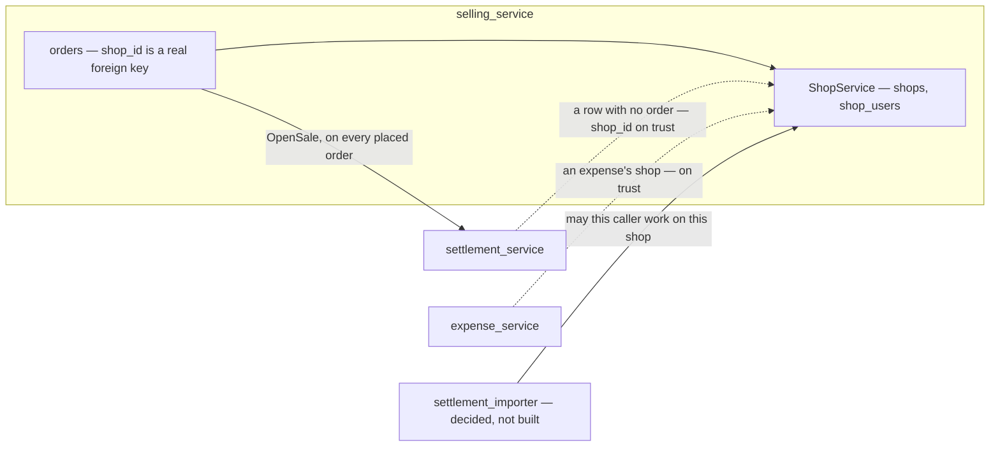
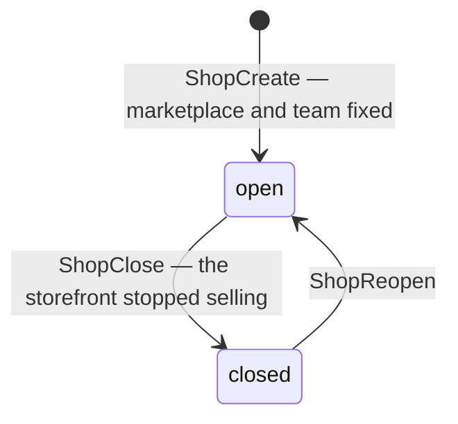
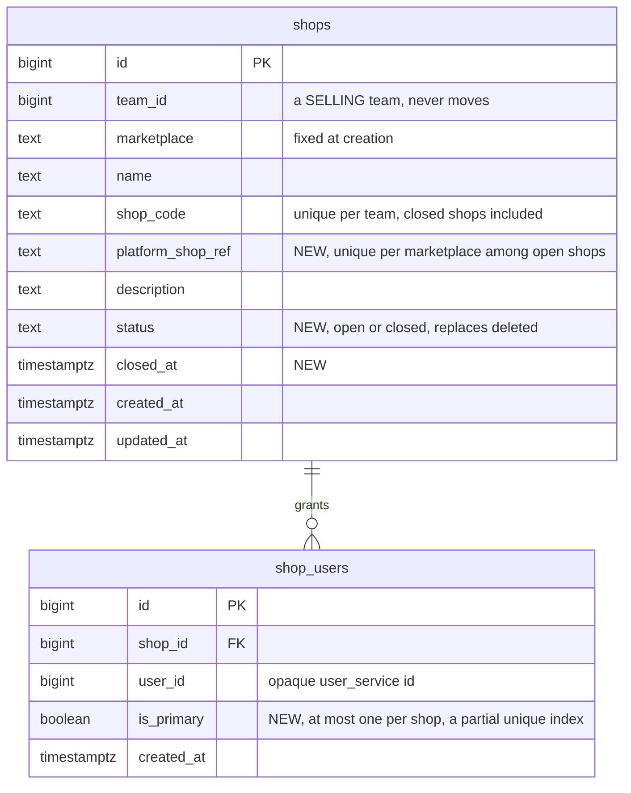

# Clarify — `shop/context.md`

What I read out of [context.md](./context.md), and what has to be settled beside it. **That doc is yours — this
one is mine.** An answered point is deleted; what you settled is in [context_decision.md](./context_decision.md).

🔄 **Second pass, 2026-09-28 — the whole doc, read against the build.** The first pass carried importer Q12 across
and asked where the shop lives. Everything §Responsbility lists already ships, so what is open is what the doc
does not say: **where the shop lives, what *delete* does to its history, what is fixed at creation, and what
other services may ask it.**

| | |
| --- | --- |
| ✅ answered (2026-09-29) | [Q2](#question) — its own `shop_service`: [the-shop-gets-its-own-service](./context_decision.md#the-shop-gets-its-own-service). ⚠ `ShopAccessCheck` and the primary CS were built into `selling_service` an hour earlier (f6dab3b) — they move with the shop |
| ✅ answered (2026-09-29, later) | [Q7](#question) — the primary CS is a flag on one of the shop's grants: the first grant becomes it, the owner or admin moves it, removing that grant leaves none — [the-primary-cs-is-a-flag-on-a-grant](./context_decision.md#the-primary-cs-is-a-flag-on-a-grant) · ✅ `ShopAccessCheck` built as [critique 10](#critique) recommends (f6dab3b) |
| ✅ answered (2026-09-29) | [Q1](#question) — a write needs a grant for the shop, or the team's owner or admin role · reads stay team-wide · every current CS is granted on rollout: [a-write-needs-a-grant-or-a-manager](./context_decision.md#a-write-needs-a-grant-or-a-manager) |
| ✅ your edits | §Responsbility gained *"give access user to shop"* (2026-09-28), then made it *"manage access user to shop"* (2026-09-29) — recorded as [access-is-given-per-user-per-shop](./context_decision.md#access-is-given-per-user-per-shop) and [the-shop-manages-its-access-list](./context_decision.md#the-shop-manages-its-access-list) |
| 🆕 +1 (2026-09-29) | [Q6](#question) — *manage* includes seeing who has access, and the list keeps people who left the team |
| ✅ your sections (2026-09-29) | §Manage User Access In Shop and §Rpc That Must Exist — recorded as [a-shop-has-one-primary-cs](./context_decision.md#a-shop-has-one-primary-cs) and [one-call-answers-the-shop-and-the-access](./context_decision.md#one-call-answers-the-shop-and-the-access) |
| 🆕 +1 | [Q7](#question) — the primary CS: its rules, and what the importer does with `primary_user_id` · ⛔ [critique 10](#critique) — `ShopAccessCheck` as written has no team, so a CS cannot call it |
| 🔄 withdrawn | `ShopByIds` — your `ShopAccessCheck` is the call other services need ([critique 6](#critique)), and `ShopList` with a status filter covers labels |
| 🔄 corrected | critique 3 said a deleted shop *stays readable* — nothing can read it, and a closed shop still has payouts coming |
| 🆕 +3 | [Q3](#question) close, not delete · [Q4](#question) marketplace and team fixed · [Q5](#question) the shop's own name on the platform |
| ➡ moved here | [architecture Q6](../../technical/architecture/context_clarify.md#question) — *team_service or order_service?* — is Q2, asked earlier. ✅ Answered with it |
| ⛔ found | settlement opens a shop's account under **whichever team posts to it first** — [critique 6](#critique) |

## What already exists

**`ShopService` ships inside `selling_service`** (#66) — ✅ moving to its own `shop_service`
([the-shop-gets-its-own-service](./context_decision.md#the-shop-gets-its-own-service)) — with shop access (#86), the
`/shops` and shop-detail screens, and `ShopSelect`:

| your doc | built |
| --- | --- |
| create | `ShopCreate` |
| edit | `ShopUpdate` — every field, the marketplace included |
| delete | `ShopDelete` — soft: `deleted` is set, the code is freed, and the shop **disappears from every read** |
| list | `ShopList` — open shops only, searched by name or code |
| — | `ShopDetail` — one open shop |
| manage access user to shop | **shop access** — `ShopUserList` · `ShopUserAdd` · `ShopUserRemove`, one grant of one user to one shop |
| shop can have multiple user | ✅ built — `shop_users`, many rows per shop |
| one primary customer service | ✅ built (f6dab3b) — a flag on a grant, in `selling_service` for now |
| `ShopAccessCheck` | ✅ built (f6dab3b) — in `selling_service` for now · ⚠ a deleted shop still answers `NotFound` ([Q3](#question)) |

Who reads a shop today — a dotted line is a `shop_id` taken on trust, with nothing asked:

## Critique

| # | Problem | → Recommend |
| --- | --- | --- |
| **1** | ✅ **Decided — [a-write-needs-a-grant-or-a-manager](./context_decision.md#a-write-needs-a-grant-or-a-manager).** A grant, or the team's owner or admin role, now gates every write on a shop. Until it is built, `shop_users` is still read only by its own three RPCs. | Build it: `ShopAccessCheck` ([critique 10](#critique)), the check in `OrderCreate`, `OrderDraftPush`, `OrderDraftPromote` and both imports, and the rollout grants. |
| **2** | ✅ **Decided — [the-shop-gets-its-own-service](./context_decision.md#the-shop-gets-its-own-service).** Shops, shop access and `ShopAccessCheck` leave `selling_service` for `shop_service`. | Build the move. How the existing shops move is a technical item, not designed yet. |
| **3** | 🔄 **Delete hides a shop from everything that still points at it.** `ShopList` and `ShopDetail` both filter out `deleted`, so nothing can read a deleted shop: the settlement report's by-shop ranking names its row `#7`, and the orders filter cannot pick it. And a shop is paid **after** it stops selling — its last orders settle and its balance is withdrawn later — while the importer's check, as specified, refuses a deleted shop. | **Close, not delete** — [Q3](#question). |
| **4** | ***"for Selling Team"* is not enforced.** `ShopCreate` writes into any team it is given. The menu hides `/shops` from a warehouse team; the RPC does not. | `ShopCreate` refuses a team whose type is not SELLING — one lookup. |
| **5** | **The marketplace can be edited after a shop has history.** `ShopUpdate` takes it, and the edit dialog offers it. It is what picks the import's reader, what a ref is unique within ([an-order-is-unique-by-shop-and-marketplace-ref](../order/context_decision.md#an-order-is-unique-by-shop-and-marketplace-ref)), and the badge on every past order. | Fixed at creation, with the team — [Q4](#question). |
| **6** | ⛔ **Other services take a `shop_id` on trust, and settlement lets a team claim another's shop.** A row with no order opens its shop's account under the **caller's** team, and the team is checked only after ([post_entry.go:282](../../../backend/services/settlement_service/settlement_v1/post_entry.go#L282)). Team A posts one such row naming team B's shop before B has posted any: the account is A's, and every such post B makes to its own shop answers `errWrongTeam` from then on. `expense_service` stores any `shop_id` it is given. Neither has anything to ask. | 🔄 ✅ **Your §Rpc That Must Exist is the place — widen it past the importer.** Settlement calls `ShopAccessCheck` before opening a shop's account, expense before storing a shop: once it carries `team_id` ([critique 10](#critique)), another team's shop answers `NotFound`, which is the check both lack. My `ShopByIds` is withdrawn. |
| **7** | **A shop does not record who it is on the platform.** Only `shop_code` is unique, and only within a team — one Shopee storefront can be registered twice, in one team or two, and its orders and settlements split between the copies. A Shopee statement names its seller, `Username (Penjual)`, and there is nothing to match it to ([what the file check cannot see](../settlement/settlement_importer_decision.md#a-file-with-another-shops-orders-is-refused)). | Record it — [Q5](#question). |
| **8** | **One list, two questions.** The order form's picker needs the open shops this person may work on; a report's filter needs every shop that ever had a row. `ShopList` has one fixed answer — every open shop. | Filters `status` (open · closed · all), `marketplace` and `user_id`, so each screen asks its own question. |
| **9** | 🆕 **A managed list has to be true — and this one keeps people who left.** *Manage* includes seeing who has access ([the-shop-manages-its-access-list](./context_decision.md#the-shop-manages-its-access-list)). But nothing ends a grant when its holder leaves the team — nothing that owns `shop_users` hears of a membership change — and `ShopUserAdd` never checks that the user is in the team at all. A shop's access list drifts into people who no longer work there. | A grant is held only by a member of the shop's team, and leaving the team ends it — [Q6](#question). |
| **10** | ✅ **Built 2026-09-29 as recommended** (f6dab3b), for the importer — inside `selling_service`, and it moves with the shop ([the-shop-gets-its-own-service](./context_decision.md#the-shop-gets-its-own-service)) — `team_id` scoped, the buf names, `Shop shop`, and your field name `is_have_access` kept. ⚠ Your §Rpc still reads `Payload` · `Response` · `ShopDetail` — yours to update. Was: 🆕 ⛔ **`ShopAccessCheck` as written cannot be called by the person it is for, and does not compile.** **No `team_id`**: the importer calls it under the uploader's token — a CS — and a team-level role on a request with no `use_scope` field is checked against the root team ([CLAUDE.md](../../../CLAUDE.md) §Rules that are easy to get wrong), so only root and admin could call it. **`Payload` · `Response`**: buf's STANDARD lint, used with no exceptions ([buf.yaml](../../../proto/buf.yaml)), wants `ShopAccessCheckRequest` · `ShopAccessCheckResponse`. **`ShopDetail shop`**: there is no `ShopDetail` message — the shop is `Shop`. | `ShopAccessCheckRequest` — `team_id` (`use_scope`, `gt 0`), `shop_id`, `user_id` · `ShopAccessCheckResponse` — `Shop shop`, `primary_user_id`, `bool has_access` · another team's shop answers `NotFound`. See [the contract](#the-contract). |

## Recommendation

✅ **Q1, Q2 and Q7 are decided.** Next, **Q3 — before the importer ships**: the built `ShopAccessCheck` answers a
deleted shop `NotFound`, so a shop's last statements, paid after it stops selling, can never be imported. Then **Q6**,
now that a grant is real access. **Q4 and Q5 cost least now** — the move to `shop_service`
([the-shop-gets-its-own-service](./context_decision.md#the-shop-gets-its-own-service)) rewrites every shop RPC anyway.

## Proposed Design

### The jobs

| who | does | how often |
| --- | --- | --- |
| the selling team's owner, admin | open a shop when the team opens a storefront · rename it · grant CS to it · close it | a few times a year |
| CS | pick a shop on every order and draft · import its statements | many times a day |
| everyone in the team | read a shop's orders, settlements and expenses — a closed shop's too | daily |
| orders · settlement · expense · importer | ask whether a shop is the team's, and whether this person may work on it | every write |

### A shop's life — Q3

| | open | closed |
| --- | --- | --- |
| a new order or draft | ✅ | ❌ refused |
| an order already placed | runs to its end | runs to its end |
| a settlement post, an import | ✅ | ✅ — its last payouts arrive after it closes |
| lists, reports, filters, labels | ✅ | ✅ marked closed |
| the order form's picker | ✅ | ❌ |
| its `shop_code` | reserved | still reserved — it can reopen |

### What a shop carries

| field | editable | rule |
| --- | --- | --- |
| `team_id` | ❌ | a SELLING team (critique 4) — never moves (Q4) |
| `marketplace` | ❌ (Q4) | set at creation |
| `name` | ✅ | what people read |
| `shop_code` | ✅ | unique in the team, closed shops included |
| `platform_shop_ref` 🆕 Q5 | ✅ — platforms allow a rename | unique per marketplace among open shops, **across all teams** |
| `description` | ✅ | |
| `status` 🆕 | by close and reopen | `open` · `closed` — replaces `deleted` |
| `closed_at` 🆕 | — | when it stopped selling |
| `primary_user_id` 🆕 Q7 | by **Make primary** | one of the shop's own users — a flag on their grant, read onto the shop |

Not on the shop, by decision: a return warehouse — one per team
([the-return-warehouse-is-per-team](../order/context_decision.md#the-return-warehouse-is-per-team)).

### Who may work on a shop — ✅ decided

[a-write-needs-a-grant-or-a-manager](./context_decision.md#a-write-needs-a-grant-or-a-manager) — the rule, its
diagram and its spec, the rollout grants included. It is what `ShopAccessCheck` computes as `is_have_access`.

### Where it lives — ✅ decided

[the-shop-gets-its-own-service](./context_decision.md#the-shop-gets-its-own-service) — the before and after, what
moves, and who calls it. Everything below is `shop_service`'s.

### The contract

| RPC | | change |
| --- | --- | --- |
| `Shop` — the message | built | gains `status` (Q3), `platform_shop_ref` (Q5), and `primary_user_id` — the badge, with no second call (Q7) |
| `ShopCreate` | built | refuses a non-SELLING team · takes `platform_shop_ref` (Q5) |
| `ShopUpdate` | built | no longer takes `marketplace` (Q4) |
| `ShopDelete` | built | becomes `ShopClose`, beside a new `ShopReopen` (Q3) |
| `ShopList` | built | filters `status`, `marketplace`, `user_id` (critique 8) |
| `ShopDetail` | built | reads a closed shop too |
| `ShopAccessCheck` 🆕 yours | for other services | `ShopAccessCheckRequest` — `team_id`, `shop_id`, `user_id` · `ShopAccessCheckResponse` — `Shop` (closed included, with its status — Q3), `primary_user_id` (Q7), `has_access` ([a-write-needs-a-grant-or-a-manager](./context_decision.md#a-write-needs-a-grant-or-a-manager)) · another team's shop → `NotFound` (critique 10) · called by the importer, orders, settlement and expense (critique 6) |
| `ShopUserList` · `ShopUserAdd` · `ShopUserRemove` | built | `ShopUserAdd` refuses a user outside the team, and leaving the team ends the grant (Q6) · the list marks the primary (Q7) |
| `ShopUserSetPrimary` 🆕 | owner, admin | moves the primary to another of the shop's users (Q7) |

### The data

### The screens

| where | change |
| --- | --- |
| `/shops` | a status filter, open by default · the primary CS as a badge on each row · **Close** in the row menu, through a `ConfirmDialog` · **Reopen** on a closed row |
| `/shops/:id` | the platform name · the marketplace read-only · a *closed* banner with Reopen · the users section marks the primary with a badge, and offers **Make primary** in each user's row menu |
| a form that writes — the order form | open shops only, and only those the person may write on ([a-write-needs-a-grant-or-a-manager](./context_decision.md#a-write-needs-a-grant-or-a-manager)) |
| every report and filter | closed shops too, marked closed |

## Question

1. ✅ **Answered 2026-09-29 — a write needs a grant or a manager role**, as recommended, all four parts:
   [a-write-needs-a-grant-or-a-manager](./context_decision.md#a-write-needs-a-grant-or-a-manager). Kept as a line
   so the numbers hold.

2. ✅ **Answered 2026-09-29 — its own `shop_service`**, as recommended:
   [the-shop-gets-its-own-service](./context_decision.md#the-shop-gets-its-own-service). It also answers
   architecture Q6. Kept as a line so the numbers hold.

3. **What does *delete* do to a shop with history — and what may a closed shop still do?** 🆕 Critique 3.
   **→ Recommend: close, not delete.** A closed shop takes no new order or draft and leaves the pickers — and
   is everything else still: readable everywhere, named on its old orders and in every report, and **open to
   settlement posts and imports**, because the platform pays out a shop's last orders and its balance after it
   stops selling. It can reopen, so its code stays reserved.
   ⚠ **It changes the importer's check**: [its spec](../settlement/settlement_importer_decision.md#the-shop-is-checked-before-the-file-is-stored)
   refuses a deleted shop — my reading, marked ⚠ there — and a closed shop must pass it. So `ShopAccessCheck`
   answers for a closed shop too, with its status: the importer takes it, an order refuses it.

4. **Are a shop's marketplace and team fixed once it exists?** 🆕 Critique 5.
   **→ Recommend yes, both.** A storefront cannot change platforms or teams: the marketplace picks the import
   and scopes the ref, and settlement freezes `shop_id` and `team_id` on every row. `ShopUpdate` stops taking
   `marketplace`. Nothing moves a shop between teams today, and the rule says nothing will. A marketplace
   picked wrongly is fixed by closing the shop — it has no history yet — and opening the right one.

5. **Does a shop record who it is on the platform?** 🆕 Critique 7.
   **→ Recommend yes — `platform_shop_ref`**: the seller username or shop id the platform shows, required at
   creation, unique per marketplace among open shops **across all teams**. A storefront can then be
   registered only once, and a Shopee statement's `Username (Penjual)` is checked against its shop even when
   no ref finds an order — the case the file check cannot see.
   ⚠ A TikTok statement names no shop, so it gains nothing there — and uniqueness across teams tells a team
   that a storefront is already registered elsewhere.

6. **May a grant outlive its holder's place in the team?** 🆕 *(2026-09-29)* Critique 9 — opened by *manage*.
   **→ Recommend no.** `ShopUserAdd` refuses a user who is not a member of the shop's team, and leaving the team
   ends every shop grant the person held — so a shop's access list is always people who can work there. A stale
   grant opens nothing today, since the interceptor refuses a non-member first. What it breaks is the list you now
   manage, which shows people who left — and ⛔ now that a grant gates writes
   ([a-write-needs-a-grant-or-a-manager](./context_decision.md#a-write-needs-a-grant-or-a-manager)), a person who
   rejoins gets their old shops back without anyone granting them. That is real access, not only a wrong list.
   ⚠ The price: the shop has to hear when a membership ends — one event from `user_service`, or a membership
   check when the list is read.

7. ✅ **Answered 2026-09-29 — the primary CS is a flag on a grant**, as recommended:
   [the-primary-cs-is-a-flag-on-a-grant](./context_decision.md#the-primary-cs-is-a-flag-on-a-grant). Kept as a line so
   the numbers hold.

# Contradiction

**None in your doc** — re-examined after both 2026-09-29 edits and the Q1 and Q2 answers. ⚠ One in another of
yours: `technical/architecture/context.md` §Microservice lists no `shop_service` — reported in
[its clarify](../../technical/architecture/context_clarify.md#question). 🔄 One in mine, corrected: the first pass's critique 3 said a deleted shop *stays
readable*, and recommended that it take no new import. `ShopList` and `ShopDetail` both filter a deleted shop
out, and a closed shop still has money coming — see [Q3](#question).
