# Decisions — `shop/context.md`

What the owner settled, recorded before it is acted on. **Append-only** — a decision that is later reversed is
renamed and its references grepped (RULE 12), never quietly edited away. The open set is
[context_clarify.md](./context_clarify.md).

🏗 **As built — recorded 2026-09-28, on your instruction:** *"write already coded and implemented in
context_decision.md so we have documentation review later"*. Every decision marked **as built** is what the code
does TODAY, read from the code and linked to it — not a choice you wrote in a doc. It is here to be reviewed.
Where a [clarify](./context_clarify.md) question proposes to change one, the table says so — and recording it here
**closes no question**: if an answer changes the rule, the decision is renamed.

| decision | what it decided | from | under review |
| --- | --- | --- | --- |
| [access-is-given-per-user-per-shop](#access-is-given-per-user-per-shop) | giving a user access to a shop is the shop's own job — one user, one shop, one grant | owner | ✅ who needs one: [a-write-needs-a-grant-or-a-manager](#a-write-needs-a-grant-or-a-manager) |
| [superseded-shops-live-in-selling-service](#superseded-shops-live-in-selling-service) | `ShopService` is one of three proto services one `selling_service` serves, and `shops`, `shop_users` are its tables | as built | ⛔ superseded by [the-shop-gets-its-own-service](#the-shop-gets-its-own-service) |
| [every-shop-call-is-scoped-to-its-team](#every-shop-call-is-scoped-to-its-team) | every request names its team and every query is held to it — another team's shop reads as not found | as built | [critique 4](./context_clarify.md#critique) — the team's type |
| [managers-write-shops-and-cs-reads-them](#managers-write-shops-and-cs-reads-them) | owner and admin create, edit, delete and grant · customer service only reads | as built | — |
| [a-shop-is-a-name-a-code-and-a-marketplace](#a-shop-is-a-name-a-code-and-a-marketplace) | the record — a code unique among the team's live shops, a marketplace required | as built | [Q5](./context_clarify.md#question) — no platform name |
| [every-shop-field-stays-editable](#every-shop-field-stays-editable) | an edit writes only the fields it sends — the marketplace included | as built | [Q4](./context_clarify.md#question) |
| [delete-is-soft-and-frees-the-code](#delete-is-soft-and-frees-the-code) | delete flags the row, frees its code, and hides the shop from every read | as built | [Q3](./context_clarify.md#question) |
| [the-shop-list-is-paged-and-searched](#the-shop-list-is-paged-and-searched) | a team's live shops, newest first, a page at a time, searched by name or code | as built | [critique 8](./context_clarify.md#critique) |
| [a-grant-is-idempotent-and-listed-as-ids](#a-grant-is-idempotent-and-listed-as-ids) | adding or removing a grant twice changes nothing · the list returns user ids | as built | 🔄 a grant now gates writes — [a-write-needs-a-grant-or-a-manager](#a-write-needs-a-grant-or-a-manager) · [Q6](./context_clarify.md#question) |
| [an-order-needs-a-live-shop-of-its-team](#an-order-needs-a-live-shop-of-its-team) | an order is placed only on a live shop of its own team, checked before any stock moves | as built | 🔄 gains a grant check — [a-write-needs-a-grant-or-a-manager](#a-write-needs-a-grant-or-a-manager) |
| [other-services-keep-a-shop-id-unchecked](#other-services-keep-a-shop-id-unchecked) | expense and settlement store a shop id without asking the shop | as built | ⛔ [critique 6](./context_clarify.md#critique) |
| [the-shop-manages-its-access-list](#the-shop-manages-its-access-list) | managing a shop's access — give it, take it away, see who has it — is the shop's own job | owner | ✅ who needs one: [a-write-needs-a-grant-or-a-manager](#a-write-needs-a-grant-or-a-manager) · [Q6](./context_clarify.md#question) — who can hold one |
| [a-shop-has-one-primary-cs](#a-shop-has-one-primary-cs) | a shop has many users and, among them, one primary customer service, shown as a badge | owner | ✅ its rules: [the-primary-cs-is-a-flag-on-a-grant](#the-primary-cs-is-a-flag-on-a-grant) |
| [one-call-answers-the-shop-and-the-access](#one-call-answers-the-shop-and-the-access) | `ShopAccessCheck` — one call gives the importer the shop, its primary CS, and whether a user has access | owner | [critique 10](./context_clarify.md#critique) — its contract · ✅ what access means: [a-write-needs-a-grant-or-a-manager](#a-write-needs-a-grant-or-a-manager) |
| [a-write-needs-a-grant-or-a-manager](#a-write-needs-a-grant-or-a-manager) | writing on a shop — an order, a draft, an import — needs a grant for it, or the team's owner or admin role · reads stay team-wide · every current CS is granted on rollout | owner | [Q6](./context_clarify.md#question) — a grant outliving its holder is now real access |
| [the-primary-cs-is-a-flag-on-a-grant](#the-primary-cs-is-a-flag-on-a-grant) | the primary CS is one of the shop's granted users, flagged — the first grant becomes it, the owner or admin moves it with Make primary, removing that grant leaves none | owner | [Q6](./context_clarify.md#question) — a primary who left the team |
| [the-shop-gets-its-own-service](#the-shop-gets-its-own-service) | shops and shop access leave `selling_service` for `shop_service` — every other service calls it, and it calls only `user_service` | owner | ⚠ moving the shops that exist — a technical item |

## access-is-given-per-user-per-shop

> `context.md` §Responsbility 1 *(owner, 2026-09-28)* — *"give access user to shop"*, added beside create, edit,
> delete and list. It answers the first half of [critique 1](./context_clarify.md#critique): shop access was
> built, and missing from the doc.

> 🔄 *(2026-09-29)* The line now reads *"manage access user to shop"* — widened by
> [the-shop-manages-its-access-list](#the-shop-manages-its-access-list). This verdict still holds.

**The verdict.** Access to a shop is **given to a user, one shop at a time**, and giving it is the shop's own job —
the same one that creates and closes the shop. It is the model already built: `shop_users`, one row per user per
shop, written by `ShopUserAdd` and removed by `ShopUserRemove`.

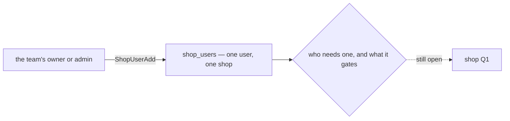

### The spec

| | |
| --- | --- |
| the grant | one user, one shop — `shop_users (shop_id, user_id)`, unique |
| who gives it | the team's owner and admin, and root and admin — the built policy on `ShopUserAdd`, unchanged |
| where it lives | with the shop — if the shop gets a service of its own ([Q2](./context_clarify.md#question)), the grants move with it |

### What it does NOT settle

- **Who needs a grant** — only the users listed on the shop, or the team's owner and admin without one:
  [Q1](./context_clarify.md#question).
- **What a grant gates** — the import alone, or every write on the shop: [Q1](./context_clarify.md#question).

## superseded-shops-live-in-selling-service

> ⛔ **SUPERSEDED (2026-09-29) by [the-shop-gets-its-own-service](#the-shop-gets-its-own-service).** It stays what
> the code does until the move is built.

> 🏗 As built — [selling.proto:17](../../../proto/warehouse/selling/v1/selling.proto#L17),
> [register.go](../../../backend/services/selling_service/register.go) (#66). Recorded 2026-09-28 for review.

**The verdict.** The shop is `warehouse.selling.v1.ShopService`, one of three proto services served by a single
`selling_service` implementation — beside `OrderService` and `OrderDraftService`. Its two tables, `shops` and
`shop_users`, are `selling_service`'s own, and an order points at its shop with a real foreign key.

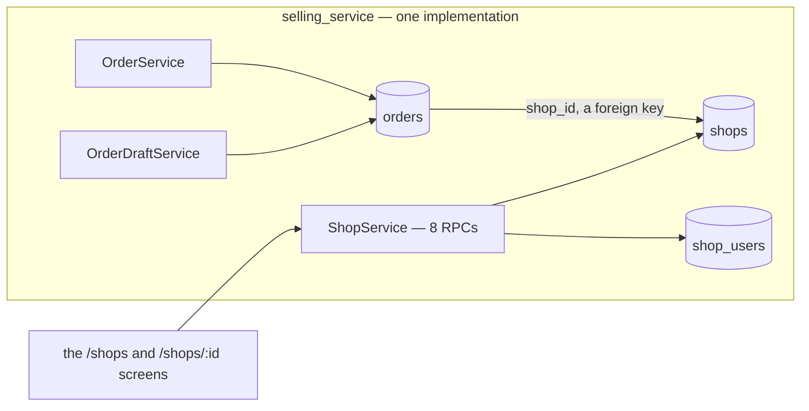

### The spec

| | |
| --- | --- |
| RPCs | `ShopCreate` · `ShopList` · `ShopDetail` · `ShopUpdate` · `ShopDelete` · `ShopUserList` · `ShopUserAdd` · `ShopUserRemove` — one handler file each, `selling_v1/shop_*.go`, unit tests beside them |
| tables | `shops` ([00001](../../../backend/services/selling_service/db_migrations/00001_create_shops.sql)) · `shop_users` ([00002](../../../backend/services/selling_service/db_migrations/00002_create_shop_users.sql)) — goose, owned by `selling_service` |
| mounted | [register.go](../../../backend/services/selling_service/register.go) — behind the shared interceptor chain, so every RPC is policy- and scope-checked |
| screens | `/shops` and `/shops/:shopId` ([router.tsx:232](../../../frontend/src/router.tsx#L232)) — in the menu of a selling team ([nav.ts:262](../../../frontend/src/layouts/nav.ts#L262)) |

⚠ **Under review** — [Q2](./context_clarify.md#question) recommends a `shop_service` of its own.

## every-shop-call-is-scoped-to-its-team

> 🏗 As built — `use_scope` on every request in [selling.proto](../../../proto/warehouse/selling/v1/selling.proto),
> and the `team_id` clause in every handler ([service.go:111](../../../backend/services/selling_service/selling_v1/service.go#L111)).
> Recorded 2026-09-28 for review.

**The verdict.** Every shop request carries `team_id` — required, and the field the access interceptor scopes the
call to. Every query is then held to that team, so a shop of another team is **not found**, never forbidden: the
caller cannot even learn it exists. Root and admin of the root team pass every scope.

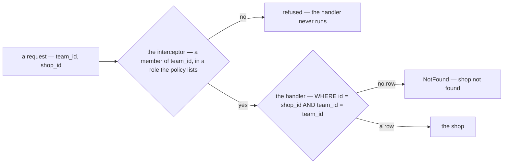

### The spec

| | |
| --- | --- |
| the scope | `team_id` — `gt 0` and `use_scope`, on all eight requests |
| another team's shop | `NotFound` from one shop's RPCs, absent from the list — the same as a shop that does not exist |
| root and admin | pass every scope — the root team's roles |
| moving a shop | impossible — no request changes `team_id` |
| ⚠ the team's type | not checked — `ShopCreate` writes into a warehouse team as readily as a selling one ([critique 4](./context_clarify.md#critique)). Only the menu keeps shops to selling teams |

## managers-write-shops-and-cs-reads-them

> 🏗 As built — the `request_policy` on each request in [selling.proto](../../../proto/warehouse/selling/v1/selling.proto).
> Recorded 2026-09-28 for review.

**The verdict.** A selling team's **owner and admin** manage its shops and who may work on them. Its **customer
service** may read them — the list, one shop, and a shop's users — and nothing more.

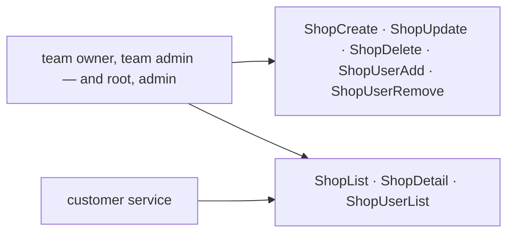

### The spec

| RPC | root · admin | team owner · team admin | customer service | anyone else |
| --- | --- | --- | --- | --- |
| `ShopCreate` · `ShopUpdate` · `ShopDelete` | ✅ | ✅ | ❌ | ❌ |
| `ShopUserAdd` · `ShopUserRemove` | ✅ | ✅ | ❌ | ❌ |
| `ShopList` · `ShopDetail` · `ShopUserList` | ✅ | ✅ | ✅ | ❌ |

## a-shop-is-a-name-a-code-and-a-marketplace

> 🏗 As built — the `Shop` message ([selling.proto:30](../../../proto/warehouse/selling/v1/selling.proto#L30)), its create
> rules ([line 40](../../../proto/warehouse/selling/v1/selling.proto#L40)) and
> [00001_create_shops.sql](../../../backend/services/selling_service/db_migrations/00001_create_shops.sql). Recorded
> 2026-09-28 for review.

**The verdict.** A shop is a **name**, a **code** and a **marketplace**, with an optional description. The code is the
team's short handle for it — unique among the team's live shops, so two teams may use the same one. The marketplace
is required, from a shared list of seven.

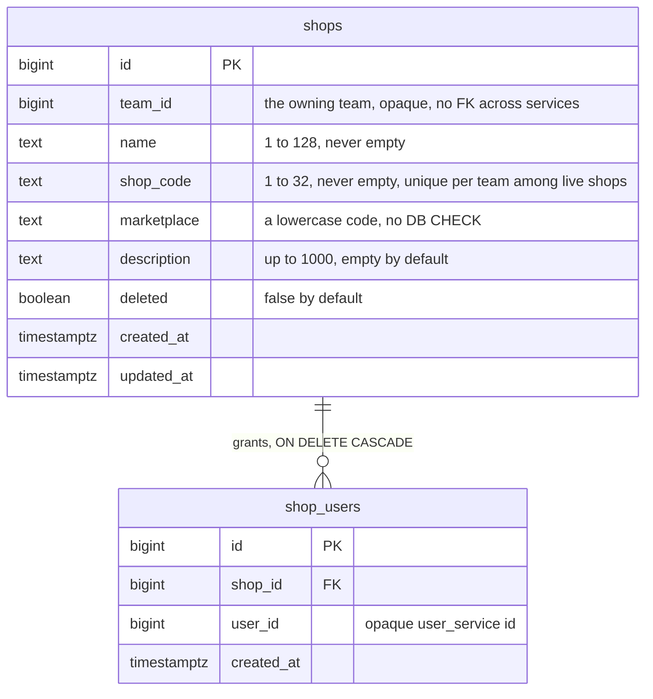

### The spec

| field | rule | on the wire |
| --- | --- | --- |
| `name` | required, 1–128 characters | ✅ |
| `shop_code` | required, 1–32 · unique per team among shops not deleted — a partial index, so two teams may share a code · a duplicate answers `AlreadyExists`, *"a shop with this code already exists in the team"* | ✅ |
| `marketplace` | required — Shopee, Tokopedia, Lazada, TikTok, Blibli, Bukalapak or Other ([marketplace.proto](../../../proto/warehouse/marketplace/v1/marketplace.proto) — append-only, shared with supplier channels) · stored as a lowercase code by [san_marketplace](../../../backend/pkgs/san_marketplace/marketplace.go), with no DB CHECK, so a new value needs no migration | ✅ |
| `description` | optional, up to 1000 characters | ✅ |
| `deleted` | set by `ShopDelete` only | ✅ |
| `created_at` · `updated_at` | stamped by the service | ❌ |

⚠ **Under review** — nothing records who the shop is ON the platform: [Q5](./context_clarify.md#question).

## every-shop-field-stays-editable

> 🏗 As built — [shop_update.go](../../../backend/services/selling_service/selling_v1/shop_update.go),
> [selling.proto:162](../../../proto/warehouse/selling/v1/selling.proto#L162). Recorded 2026-09-28 for review.

**The verdict.** An edit sends only what changes: a field left out is kept, a field sent is written — the name, the
code, the description, **and the marketplace**. The team is never editable.

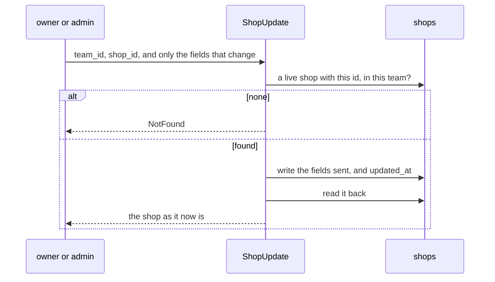

### The spec

| | |
| --- | --- |
| a field left out | kept — the fields are `optional`, so *absent* and *empty* differ |
| the same values sent again | success — existence is checked **before** the write, so a no-op edit is never mistaken for a missing shop |
| a code another live shop holds | `AlreadyExists` |
| a deleted shop | `NotFound` |
| the answer | the shop, read back after the write |

⚠ **Under review** — [Q4](./context_clarify.md#question) recommends the marketplace fixed at creation: it picks the
import's reader and labels every past order.

## delete-is-soft-and-frees-the-code

> 🏗 As built — [shop_delete.go](../../../backend/services/selling_service/selling_v1/shop_delete.go), and the partial
> index in [00001_create_shops.sql](../../../backend/services/selling_service/db_migrations/00001_create_shops.sql).
> Recorded 2026-09-28 for review.

**The verdict.** Deleting a shop **flags** it — the row stays, so its orders, settlement rows and expenses still point
at a real id. From that moment its code is free for a new shop, and the shop is gone from every read: the list, the
detail, its users and order placement all answer as if it never existed. There is no undo.

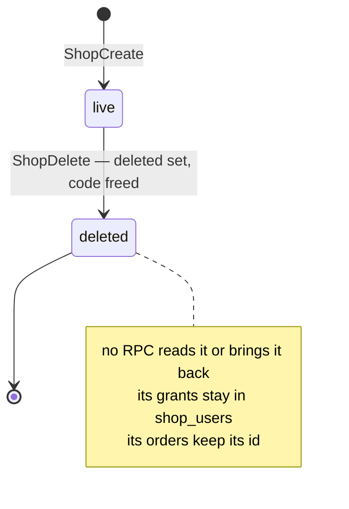

### The spec

| after `ShopDelete` | |
| --- | --- |
| the row | kept — `deleted = true`, `updated_at` stamped |
| its code | free — a new shop in the team may take it |
| `ShopList` · `ShopDetail` · `ShopUpdate` · `ShopUserList` · `ShopUserAdd` · `ShopUserRemove` | leave it out, or answer `NotFound` |
| deleting it again | `NotFound` |
| placing an order on it | `NotFound` |
| its grants | kept in `shop_users` — the cascade fires only on a row delete, which nothing does |
| its past orders, settlement rows, expenses | keep its id · nothing can read its name — the settlement report shows `#<id>` |

⚠ **Under review** — [Q3](./context_clarify.md#question) recommends *close, not delete*: a shop is still paid after it
stops selling.

## the-shop-list-is-paged-and-searched

> 🏗 As built — [shop_list.go](../../../backend/services/selling_service/selling_v1/shop_list.go),
> [list_slices.go](../../../backend/services/selling_service/selling_v1/list_slices.go),
> [selling.proto:75](../../../proto/warehouse/selling/v1/selling.proto#L75). Recorded 2026-09-28 for review.

**The verdict.** The list is **one team's live shops, newest first, a page at a time** — searched by name or code, in
the guideline's List shape: the ids in order, plus the slices the caller asks for.

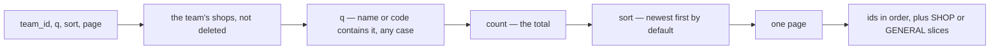

### The spec

| | |
| --- | --- |
| page | required — `page` ≥ 1, `limit` 1–200 (RULE 9) |
| `q` | up to 100 characters, trimmed · matches name **or** code, case-insensitive, anywhere in it · `%` and `_` are searched literally |
| sort | newest first (`id` descending) by default · by name, code or id, ascending or descending |
| slices | `SHOP` — the whole shop, and the default · `GENERAL` — id and name only |
| deleted shops | never listed |
| the picker | `ShopSelect` asks for one large page — a team runs a handful of shops |

⚠ **Under review** — [critique 8](./context_clarify.md#critique): no filter by status, marketplace or granted user.

## a-grant-is-idempotent-and-listed-as-ids

> 🏗 As built — [shop_user_add.go](../../../backend/services/selling_service/selling_v1/shop_user_add.go),
> [shop_user_remove.go](../../../backend/services/selling_service/selling_v1/shop_user_remove.go),
> [shop_user_list.go](../../../backend/services/selling_service/selling_v1/shop_user_list.go). The model it serves is
> [access-is-given-per-user-per-shop](#access-is-given-per-user-per-shop). Recorded 2026-09-28 for review.

**The verdict.** Granting a user a shop twice, or removing a grant that is not there, **succeeds and changes
nothing**. The list answers with user **ids**, newest grant first, and the screen resolves the names. The shop must
be live and the team's — the user is not checked at all.

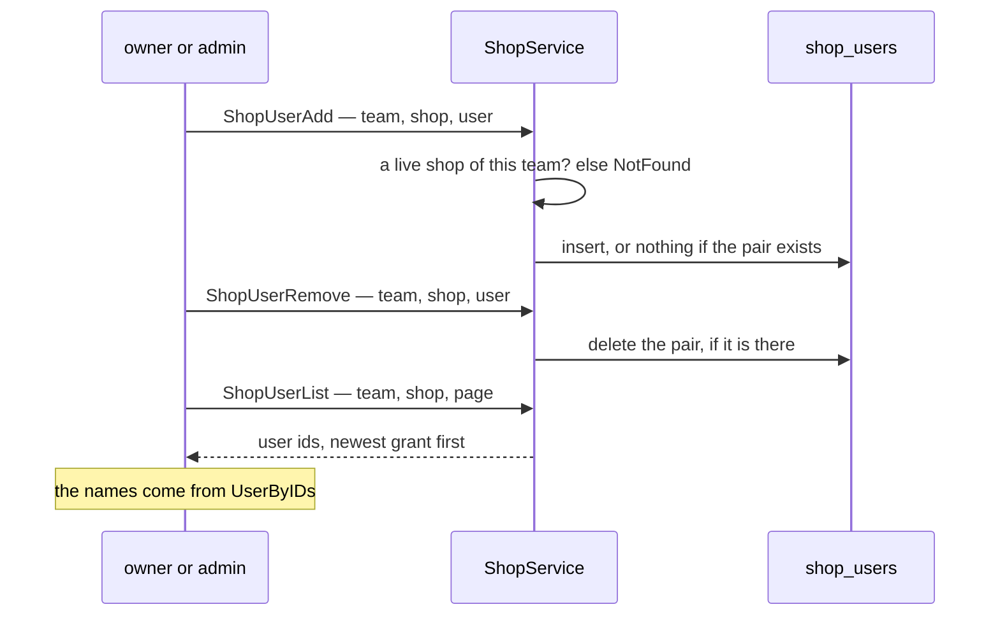

### The spec

| | |
| --- | --- |
| add twice | success, one row — `ON CONFLICT DO NOTHING` on `(shop_id, user_id)` |
| remove a missing grant | success |
| list | user ids only, newest grant first, paged — `GENERAL` is its only slice |
| a deleted or foreign shop | `NotFound`, for all three |
| ⚠ the user | not checked — a grant can name someone outside the team, or no one |
| ⚠ who reads a grant | nothing but these three RPCs — orders, settlement and every screen ignore it |

⚠ **Under review** — [Q1](./context_clarify.md#question): who needs a grant, and what it gates.

## an-order-needs-a-live-shop-of-its-team

> 🏗 As built — [order_place.go:119](../../../backend/services/selling_service/selling_v1/order_place.go#L119),
> [00003_create_orders.sql:9](../../../backend/services/selling_service/db_migrations/00003_create_orders.sql#L9).
> Recorded 2026-09-28 for review.

**The verdict.** An order is placed only on a shop that is **live and belongs to the order's team** — checked first,
before any stock moves, so a bad shop is a refused request and never a stock draw to undo. A draft promoted to an
order passes the same check and, if refused, stays a draft to fix.

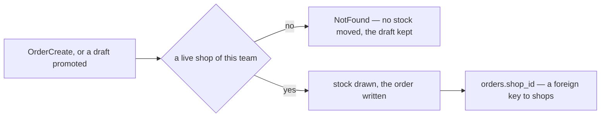

### The spec

| | |
| --- | --- |
| the check | [`shopExists`](../../../backend/services/selling_service/selling_v1/service.go#L111) — the id, the team, not deleted |
| when | before the stock draw |
| `orders.shop_id` | required, a foreign key to `shops`, indexed |
| `order_drafts.shop_id` | `0` until chosen, no foreign key ([00007](../../../backend/services/selling_service/db_migrations/00007_create_order_drafts.sql#L39)) — checked when the draft is promoted |
| filtering orders | `OrderList` takes a `shop_id`, `0` = every shop ([order.proto:438](../../../proto/warehouse/selling/v1/order.proto#L438)) |
| ⚠ the person | not checked against the shop's grants — [Q1](./context_clarify.md#question) |

## other-services-keep-a-shop-id-unchecked

> 🏗 As built — [expense_create.go:30](../../../backend/services/expense_service/expense_v1/expense_create.go#L30),
> [post_entry.go:273](../../../backend/services/settlement_service/settlement_v1/post_entry.go#L273) and
> [:282](../../../backend/services/settlement_service/settlement_v1/post_entry.go#L282). Recorded 2026-09-28 for review.

**The verdict.** Outside `selling_service`, a shop is **just a number**. Expense and settlement store the `shop_id`
they are given and never ask whether it exists or is the team's — there is no RPC for them to ask.

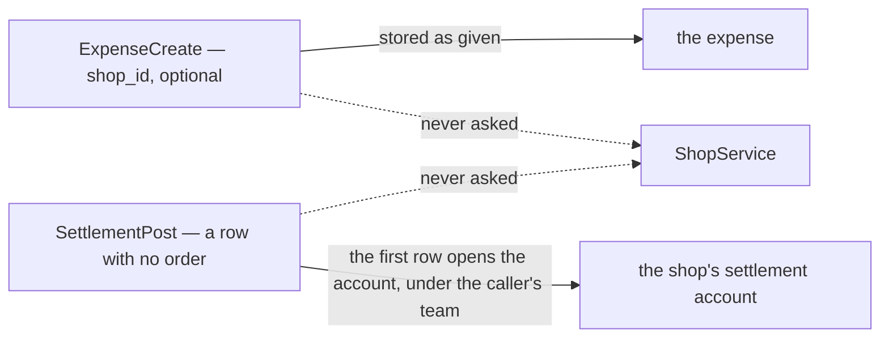

### The spec

| service | holds | checked against the shop |
| --- | --- | --- |
| `expense_service` | an expense's `shop_id` — optional, `0` = not one shop's | ❌ — any number is stored |
| `settlement_service` | `shop_id` and `team_id` on every row, frozen · one shop-addressed account per shop | ❌ — the **first** row with no order opens the account under the caller's team. After that, a row naming another team answers `errWrongTeam`, and an order row naming another shop `errWrongShop` |

⛔ **Under review** — [critique 6](./context_clarify.md#critique): one team can claim another team's shop account by
posting to it first.

## the-shop-manages-its-access-list

> `context.md` §Responsbility 1 *(owner, 2026-09-29)* — *"manage access user to shop"*, in place of *"give access
> user to shop"*.

**The verdict.** The shop's job is not only to **give** a user access but to **manage** it: give it, take it away, and
show who has it. All three are the shop's own, and all three are built
([a-grant-is-idempotent-and-listed-as-ids](#a-grant-is-idempotent-and-listed-as-ids)). It widens
[access-is-given-per-user-per-shop](#access-is-given-per-user-per-shop), and reverses nothing.

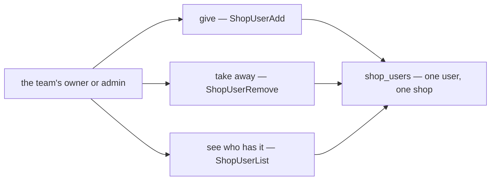

### The spec

| manage | RPC | as built |
| --- | --- | --- |
| give | `ShopUserAdd` | idempotent — granting twice is one grant |
| take away | `ShopUserRemove` | idempotent — removing a missing grant succeeds |
| see who has it | `ShopUserList` | user ids, newest grant first, paged — the screen resolves the names |

### What it does NOT settle

- **Who needs a grant, and what a grant gates** — [Q1](./context_clarify.md#question). Managing the list says nothing
  about who must be on it.
- **Who can hold one** — a grant can name someone outside the team, and outlives its holder leaving:
  [Q6](./context_clarify.md#question).

## a-shop-has-one-primary-cs

> `context.md` §Manage User Access In Shop *(owner, 2026-09-29)* — *"shop can have multiple user"* · *"shop have one
> primary customer service. Like Badge in Frontend."*

**The verdict.** A shop has **many users**, and among them **one primary customer service**, shown as a badge
wherever the shop's people are shown. The many users are built (`shop_users`); the primary is new — nothing in the
build marks one grant above the others.

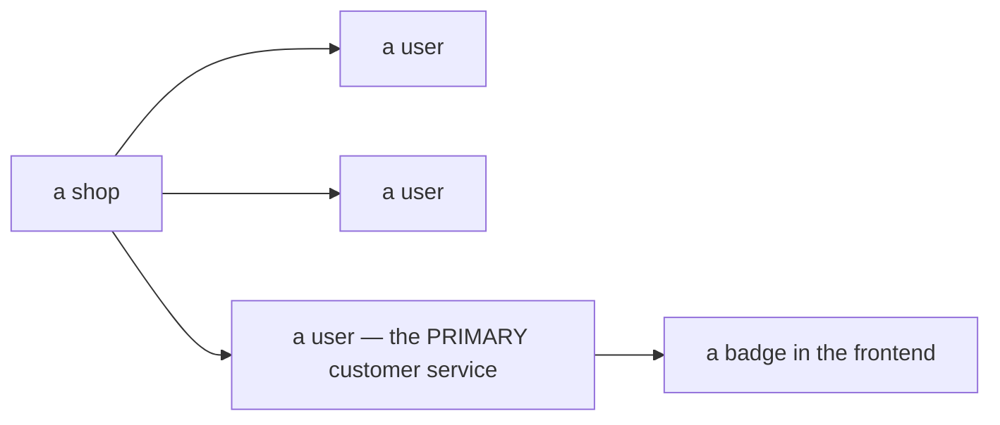

### The spec

| | |
| --- | --- |
| users per shop | many — the built `shop_users`, one row per user |
| primary per shop | one — 🆕 not built |
| shown | as a badge |
| read by | the importer, as `primary_user_id` — [one-call-answers-the-shop-and-the-access](#one-call-answers-the-shop-and-the-access) · 🔄 and settlement, to count an imported shop row ([settlement-asks-the-shop-for-its-primary-cs](../settlement/settlement_importer_decision.md#settlement-asks-the-shop-for-its-primary-cs)) |

### What it does NOT settle — [Q7](./context_clarify.md#question)

✅ **Answered 2026-09-29** — [the-primary-cs-is-a-flag-on-a-grant](#the-primary-cs-is-a-flag-on-a-grant): at most one, one of the
shop's granted users, the first grant becomes it. What the list below asked is kept as the record.

- Must a shop always have one — and who may be one: only the shop's own users, only the CS role?
- What happens when the primary is removed from the shop, or leaves the team.
- What the importer does with it. ✅ **Answered in the importer doc** (2026-09-29): a row with no order is counted for
  the shop's primary CS — [user-id-is-the-orders-creator-else-the-shops-primary-cs](../settlement/settlement_importer_decision.md#user-id-is-the-orders-creator-else-the-shops-primary-cs).

## one-call-answers-the-shop-and-the-access

> `context.md` §Rpc That Must Exist that Used by Settlement Importer Service *(owner, 2026-09-29)* —
> `ShopAccessCheck`: in `shop_id`, `user_id` · out `ShopDetail shop`, `primary_user_id`, `is_have_access`.

**The verdict.** The shop gives the importer **one call** for everything its shop check needs: the shop itself — so
the importer can tell it is the right one — its primary CS, and whether a given user has access. It is the call
behind the importer's *"check shop: is caller that access on shop, is shop correct"*
([the-shop-is-checked-before-the-file-is-stored](../settlement/settlement_importer_decision.md#the-shop-is-checked-before-the-file-is-stored)),
which had read it as `ShopDetail`.

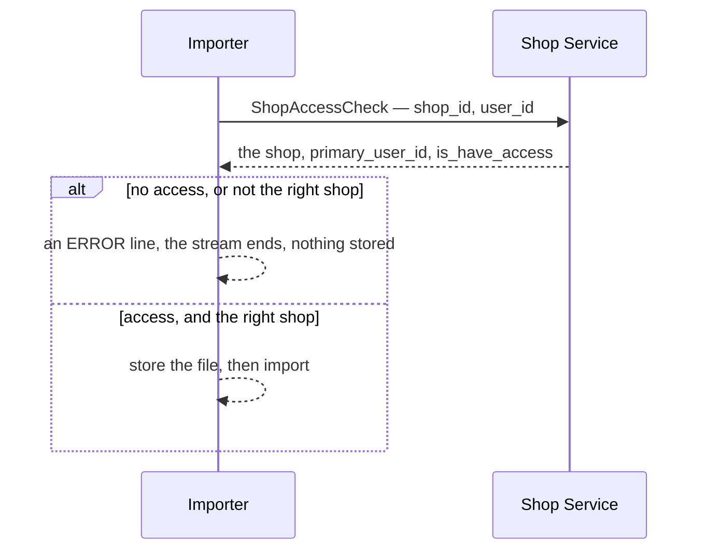

### The spec — as written

| | |
| --- | --- |
| name | `ShopAccessCheck` |
| in | `shop_id` · `user_id` |
| out | the shop · `primary_user_id` · `is_have_access` |
| called by | the settlement importer, before it stores a file · 🔄 and settlement, for the primary CS of every imported shop row ([settlement-asks-the-shop-for-its-primary-cs](../settlement/settlement_importer_decision.md#settlement-asks-the-shop-for-its-primary-cs)) |

### What it does NOT settle

- **Who has access** — what `is_have_access` computes is [Q1](./context_clarify.md#question).
- **What `primary_user_id` is for** — [Q7](./context_clarify.md#question). ✅ Answered —
  [the-primary-cs-is-a-flag-on-a-grant](#the-primary-cs-is-a-flag-on-a-grant).
- 🔨 **Built 2026-09-29 as [critique 10](./context_clarify.md#critique) recommends**, keeping your name `is_have_access`. Was:
- **The contract's shape** — no team to scope it, message names buf refuses, and a `ShopDetail` message that does
  not exist: [critique 10](./context_clarify.md#critique).

## a-write-needs-a-grant-or-a-manager

> Chat *(owner, 2026-09-29)* — *"yes"*, to [Q1](./context_clarify.md#question) as recommended, all four parts: who has
> access is the shop's granted users plus the team's owner and admin · access gates every write on the shop — an
> order, a draft pushed or promoted, an import · reads stay team-wide · every current CS is granted every shop of
> their team when it ships. Re-routed from [importer Q12](../settlement/settlement_importer_clarify.md#question).

**The verdict.** To **write** on a shop, a person must be **granted that shop, or run the team** — its owner or
admin; root and admin pass everywhere. **Reading** stays team-wide: everyone in the team still sees every shop's
orders and reports. The grant stops being a label and becomes the gate — and it is the rule `is_have_access`
computes ([one-call-answers-the-shop-and-the-access](#one-call-answers-the-shop-and-the-access)).

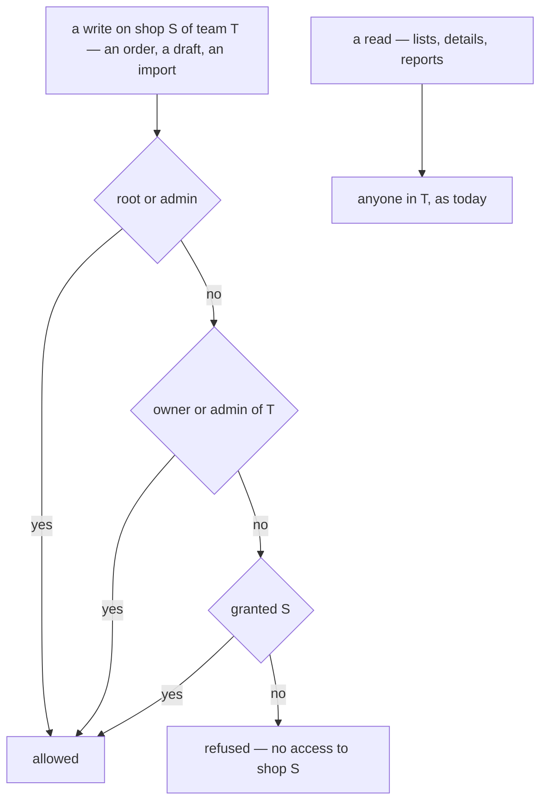

### The spec

| | |
| --- | --- |
| who may write | root · admin · the team's owner · the team's admin · anyone granted the shop |
| the gated writes | `OrderCreate` · `OrderDraftPush` · `OrderDraftPromote` · the Shopee and TikTok imports — each asks `ShopAccessCheck` before it writes. Today all three order RPCs take any CS of the team, on any shop |
| refused | ⚠ my spec: `PermissionDenied`, naming the shop · an import answers with an `ERROR` line, and stores nothing |
| reads | not gated — `ShopList`, `OrderList`, details and reports, as today |
| the order form's shop picker | offers only the shops the person may write on · a filter still offers every shop |
| managing grants | unchanged — the owner and admin ([the-shop-manages-its-access-list](#the-shop-manages-its-access-list)) |
| the rollout | in the release that turns the gate on, every current CS is granted every shop of their team — nobody loses order-taking on day one, and the owner trims afterwards |
| the check's cost | one grant lookup, plus the user's role in the team from `user_service`, which already caches roles |

### What it does NOT settle

- **Which service runs the check** — [Q2](./context_clarify.md#question).
- **Who can hold a grant** — one still outlives its holder leaving the team, and now that is real access for someone
  who rejoins: [Q6](./context_clarify.md#question).
- **A closed shop** — whether an import still passes on one: [Q3](./context_clarify.md#question).
- ⚠ **An app that pushes drafts** writes too — its login needs a grant, or a manager role.
- ⚠ **Other writes that name a shop** — a hand-posted settlement row, an expense — were not in the question. They stay
  gated by the team role alone unless you extend this.

## the-primary-cs-is-a-flag-on-a-grant

> Chat *(owner, 2026-09-29)* — *"Flag on a grant, auto"*, to [Q7](./context_clarify.md#question): how does a shop get
> its primary CS? Without one it cannot import
> ([a-shop-with-no-primary-cs-cannot-import](../settlement/settlement_importer_decision.md#a-shop-with-no-primary-cs-cannot-import)).

**The verdict.** A shop's primary CS is **one of its granted users, flagged** — never someone without a grant. The
**first user granted** becomes it; the team's **owner or admin** moves it to another of the shop's users with **Make
primary**; **removing** the primary's grant leaves the shop with **none**, shown as a warning until another is chosen.
Any granted user may be primary, not only the CS role. It is my recommendation, and it answers
[a-shop-has-one-primary-cs](#a-shop-has-one-primary-cs)'s open rules.

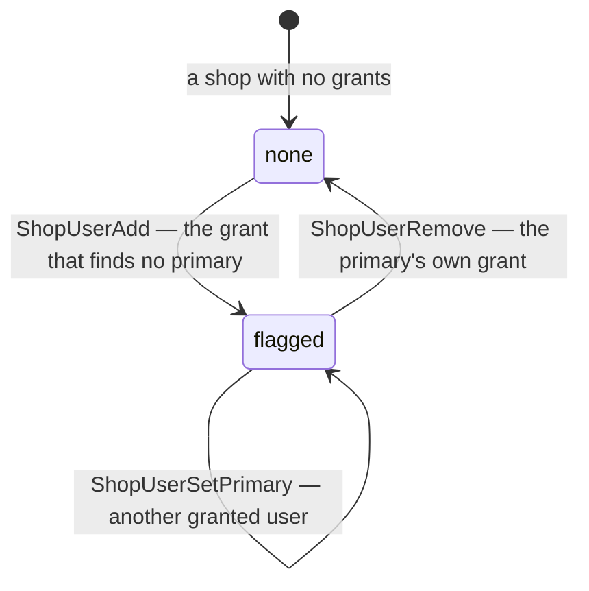

### The spec

| | |
| --- | --- |
| stored | `shop_users.is_primary` — boolean, false by default · at most one per shop, by a partial unique index on `shop_id WHERE is_primary` |
| becomes primary | `ShopUserAdd` flags the new grant when the shop has no primary — ⚠ my reading of *first*: a shop left with none takes its next grant the same way · the owner or admin, with **Make primary** — 🆕 `ShopUserSetPrimary`, whose user must already hold a grant |
| none | the primary's grant removed (`ShopUserRemove`) — the flag goes with the row, and nothing picks a successor |
| on the wire | `Shop.primary_user_id` — 0 means none · `ShopAccessCheckResponse.primary_user_id` |
| the screens | `/shops/:id` — a **Primary CS** badge on that user's row, **Make primary** in every other row's menu, a warning when there is none · `/shops` — a warning badge on a shop with none |
| existing shops | the migration flags each shop's earliest grant, so a shop already granted has a primary on day one |
| who may be one | any granted user — not only the CS role |

### What it does NOT settle

- **A primary who leaves the team** keeps the flag — nothing ends a grant then ([Q6](./context_clarify.md#question)).
  🔄 *(2026-10-06)* Settled since, in the user context: leaving ends every grant in the team, and the flag with it —
  [removing-a-member-drops-their-shop-access](../user/context_decision.md#removing-a-member-drops-their-shop-access), built.

## the-shop-gets-its-own-service

> Chat *(owner, 2026-09-29)* — *"for q2, yes"*, to [Q2](./context_clarify.md#question) as recommended: the shop is its
> own `shop_service`, not a piece of `selling_service`. It also answers
> [architecture Q6](../../technical/architecture/context_clarify.md#question), which asked `team_service` or
> `order_service`, and it reverses the as-built
> [superseded-shops-live-in-selling-service](#superseded-shops-live-in-selling-service).

**The verdict.** Shops leave `selling_service` for a service of their own, **`shop_service`**: the shops, who may work
on each, and the one call every other service asks. Orders, settlement, expense and the importer call it; it calls
none of them. That is what stops settlement's call to the shop from being a cycle — `selling_service` calls settlement
on every placed order, and settlement asks the shop for a shop row's primary CS
([settlement-asks-the-shop-for-its-primary-cs](../settlement/settlement_importer_decision.md#settlement-asks-the-shop-for-its-primary-cs)).

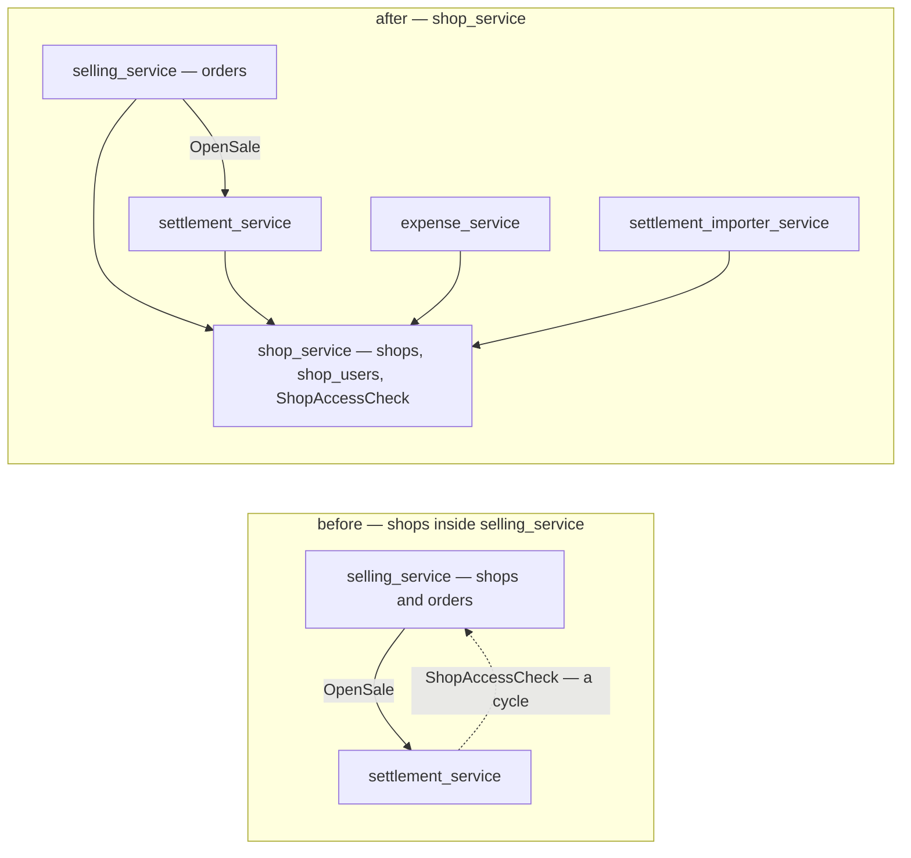

### The spec

| | |
| --- | --- |
| the service | `backend/services/shop_service/` — its own `shop_service_models/`, `db_migrations/`, a `register.go` and a Wire provider (HARD RULE 2) |
| it owns | `shops` · `shop_users`, with their migrations. `selling_service` keeps orders and drafts |
| its RPCs | the eight `ShopService` has today · `ShopAccessCheck` ([one-call-answers-the-shop-and-the-access](#one-call-answers-the-shop-and-the-access)) · `ShopUserSetPrimary` ([the-primary-cs-is-a-flag-on-a-grant](#the-primary-cs-is-a-flag-on-a-grant)) |
| its contract | ⚠ my spec: `proto/warehouse/shop/v1/`, package `warehouse.shop.v1` — the directory names the domain. A breaking move for the one client that calls it today, the frontend's `shopClient` |
| `orders.shop_id` | loses its foreign key — an opaque id, checked on write through `ShopAccessCheck`, as `warehouse_id` already is |
| who calls it | `selling_service` on an order or a draft · `settlement_service` for a shop row · `expense_service` before it stores a shop · the importer before it stores a file ([a-write-needs-a-grant-or-a-manager](#a-write-needs-a-grant-or-a-manager)) |
| what it calls | `user_service` only — a user's role in the team, for `ShopAccessCheck` |
| not moved | the `Marketplace` enum — it stays in `warehouse.marketplace.v1`, shared with supplier channels |
| already built, and moving | f6dab3b, inside `selling_service` an hour before this answer: `ShopAccessCheck` · `ShopUserSetPrimary` · `shop_users.is_primary` (its migration 00014, backfilled from each shop's earliest grant) · `Shop.primary_user_id` · the role reader. The contract moves as it is |
| the callers | settlement and the importer each own an interface for the shop, answered by an adapter at the composition root — so the move changes those adapters, not the services |

### What it does NOT settle

- ⚠ **Moving the shops that exist** — which migration creates the tables, how the rows move, and when
  `selling_service` drops its copy. A technical design item: nothing in `docs/technical/` covers the shop yet.
- **What the new service does differently** — close not delete ([Q3](./context_clarify.md#question)), fields fixed at
  creation ([Q4](./context_clarify.md#question)), the platform name ([Q5](./context_clarify.md#question)), grants that
  end with membership ([Q6](./context_clarify.md#question)). The move is the cheapest moment for all four: every shop
  RPC is rewritten anyway.
