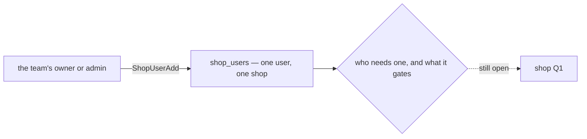

# Decisions — `shop/context.md`

What the owner settled, recorded before it is acted on. **Append-only** — a decision that is later reversed is
renamed and its references grepped (RULE 12), never quietly edited away. The open set is
[context_clarify.md](./context_clarify.md).

| decision | what it decided |
| --- | --- |
| [access-is-given-per-user-per-shop](#access-is-given-per-user-per-shop) | giving a user access to a shop is the shop's own job — one user, one shop, one grant |

## access-is-given-per-user-per-shop

> `context.md` §Responsbility 1 *(owner, 2026-09-28)* — *"give access user to shop"*, added beside create, edit,
> delete and list. It answers the first half of [critique 1](./context_clarify.md#critique): shop access was
> built, and missing from the doc.

**The verdict.** Access to a shop is **given to a user, one shop at a time**, and giving it is the shop's own job —
the same one that creates and closes the shop. It is the model already built: `shop_users`, one row per user per
shop, written by `ShopUserAdd` and removed by `ShopUserRemove`.

### The spec

| | |
| --- | --- |
| the grant | one user, one shop — `shop_users (shop_id, user_id)`, unique |
| who gives it | the team's owner and admin, and root and admin — the built policy on `ShopUserAdd`, unchanged |
| where it lives | with the shop — if the shop gets a service of its own ([Q2](./context_clarify.md#question)), the grants move with it |

### What it does NOT settle

- **Who needs a grant** — only the users listed on the shop, or the team's owner and admin without one:
  [Q1](./context_clarify.md#question).
- **What a grant gates** — the import alone, or every write on the shop: [Q1](./context_clarify.md#question).
