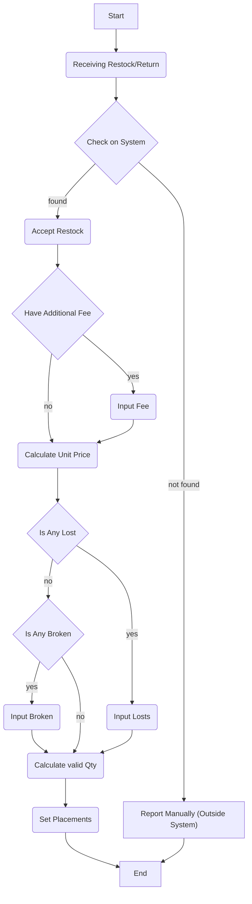

# Stock Context.

## Stock loss.
1. Selling Team bears the loss at receiving.
2. When Stocks already in Warehouse, and loss/opname happen, its shortfall a warehouse liability.

## How Warehouse Team Member Accept Stock / Return That Arrived

