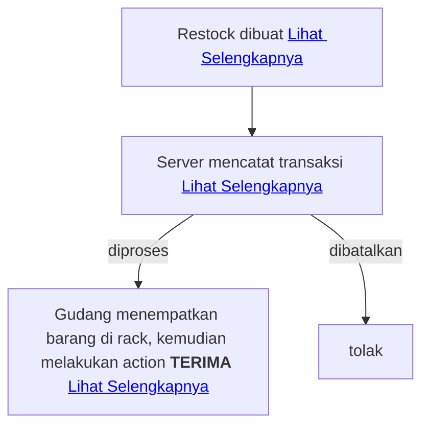

# Proposal Mekanisme Stok Gudang

Dalam sistem gudang saya membaginya dalam 2 domain besar:

- SKU (atau dalam konteks proyek ini bisa juga disebut `inventory`), [Lihat](#sku--inventory)
- Transaction, [Lihat](#transaction)

## SKU / Inventory

SKU adalah sebuah domain yang merepresentasikan sebuah produk yang akan dikelola oleh sistem ini.

Di dalam sudut pandang bisnis, sebuah SKU akan memiliki beberapa atribut penting seperti:

- Siapa pemilik barang ini?
- Berapa harganya
- Dimana letaknya (Digudang mana?, di Rak mana?)
- Siapa suppliernya
- berapa stok ready
- berapa stok on the way

Tentunya, penambahan atau pengurangan stok akan di pengaruhi oleh [transaksi](#transaction)

## Transaction

Transaksi merupakan segala aktivitas yang mempunyai tujuan utama yaitu memutasi stok sebuah [SKU](#sku--inventory).

Dengan definisi di atas, kemungkinan transaksi akan dibagi menjadi 3 jenis:

- Restock / Inbound
- Order / Outbound
- Adjustment, transaksi ini mungkin terjadi ketika proses opname stok, lain dengan 2 transaksi diatas, adjustment ini bisa dibilang transaksi mutlak yang harus dipatuhi.

Setiap transaksi tentunya akan membawa informasi SKU mana saja yang terlibat. Nantinya setiap transaksi akan di-log agar nantinya bisa di audit. Berikut kemungkinan 3 transaksi diatas akan dibagi jadi beberapa status:

- Restock: `pending`, `cancel`, `approved` / `completed`
- Order: `pending`, `processing`, `picking`, `picking_completed`, `packing_completed`, `completed`, `cancel`, `return`
- Adjustment: `broken`, `lost`, `found_back`, dan mungkin status lain

Status `order` dibangun berdasarkan istilah `status kerja gudang`.

## Ketentuan Stok

Kapan stok bertambah?
- Saat `Restock - completed`
- Saat `Order - cancel`
- Saat `Order - return`
- Saat adjustment yang sifatnya menambah

Kapan stok berkurang?
- Saat `Order - pending`
- Saat adjustment yang sifatnya mengurangi

## Ketentuan Transaksi

### Ketentuan Transaksi - Restock atau Inbound
Transaksi ini dibuat oleh pemilik SKU (dalam banyak kasus SKU dimiliki oleh CustomerService/UserGudang), alurnya:

#### Restock Dibuat
Ketika restock di buat, terlebih dahulu pemilik SKU memilih Gudang mana yang dituju,
kemudian barang/sku apa saja yang dipilih, tiap-tiap SKU memiliki field: `supplier`, `price`, `count`

#### Server Mencatat Transaksi Restock Yang Baru Dibuat
Server akan mencatat transaksi yang baru saja dibuat, saya menyarankan pembagian table nya `transactions`, `transaction_status_logs`, `transaction_items`. Maka dengan beberapa table tersebut maka alurnya adalah setelah transaksi dibuat di table `transactions` dengan type `restock` kemudian lanjut mencatat status-nya ke `transaction_status_logs` dengan status `pending`, lanjut ke `transaction_items` yang berisi relasi `tx_id` dan `sku_id`, tentunya di table `transaction_status_logs` akan dicatat juga siapa PIC-nya.

#### Gudang Menerima Restock
Petugas gudang menerima transaksi Restock lantas meletakkan di rak yang dipilih, kemudian data penerimaan dikirim ke server. Saat server menerima data transaksi beserta penempatannya di rak mana saja, maka di buat record baru di table `transaction_status_logs` dengan tx_id terkait dan status-nya `approved` / `completed` 